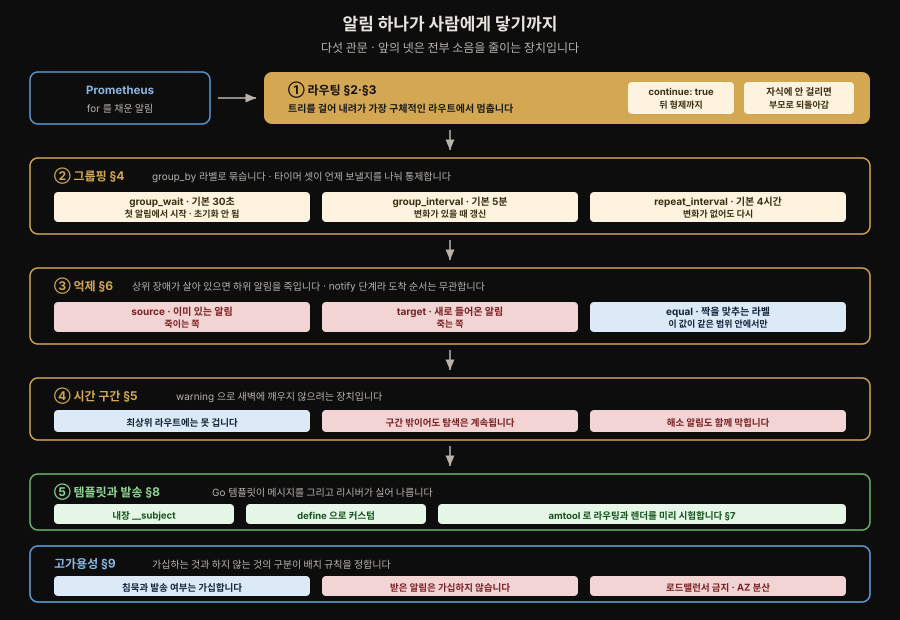
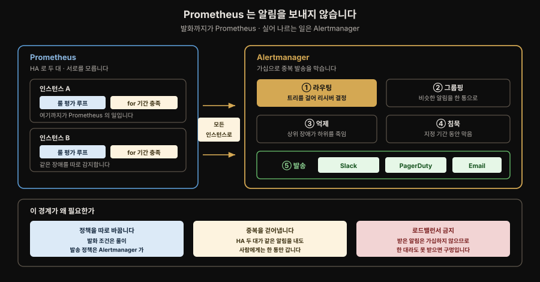
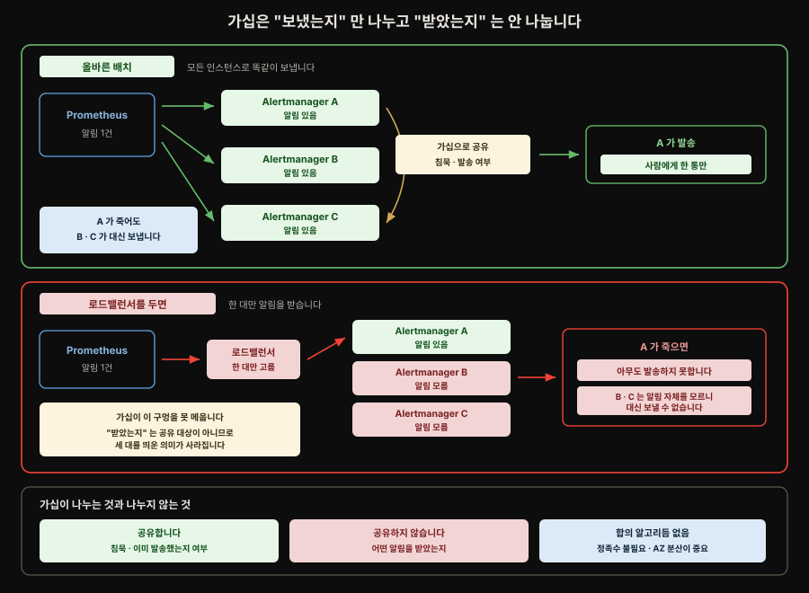

# Alertmanager — 라우팅·그룹핑·억제·HA
---

## 핵심 요약

> Prometheus 는 알림을 **보내지 않습니다**. 룰을 끝없이 평가하다가 `for` 기간을 채운 알림을 하나 이상의 Alertmanager 로 넘길 뿐이고 그 알림을 Slack 이나 PagerDuty 로 실어 나르는 일은 전부 Alertmanager 몫입니다. 처음 쓰는 사람이 가장 자주 오해하는 지점입니다.
>
> Alertmanager 의 핵심은 라우팅입니다. 알림 하나가 라우트 트리를 걸어 내려가며 어느 리시버로 갈지 정합니다. 유효한 설정에 반드시 있어야 하는 것은 `route` 와 `receiver` 둘뿐이고 나머지는 전부 선택입니다.
>
> 나머지 기능은 소음을 줄이는 장치입니다. 그룹핑은 같은 종류의 알림 100개를 한 통으로 묶고 억제 규칙은 "데이터센터가 죽은 걸 아는데 그 안의 서버 하나가 죽었다는 알림은 필요 없다" 를 표현하며 시간 구간은 새벽에 warning 으로 사람을 깨우지 않게 합니다.


## 학습 목표

> 이 절을 읽고 나면 아래 다섯 가지를 스스로 해낼 수 있습니다.

1. 라우트 트리에서 알림이 어느 리시버로 가는지 손으로 짚어 낼 수 있고 `continue` 가 그 결과를 어떻게 바꾸는지 말할 수 있습니다.
2. `group_wait`·`group_interval`·`repeat_interval` 셋이 각각 무엇을 통제하는지 구분할 수 있습니다.
3. 억제 규칙의 source 와 target 방향을 헷갈리지 않고 쓸 수 있습니다.
4. `amtool` 로 설정을 검증하고 특정 라벨의 알림이 어디로 갈지 미리 시험할 수 있습니다.
5. Alertmanager 를 HA 로 띄울 때 로드밸런서를 앞에 두면 안 되는 이유를 설명할 수 있습니다.

아래는 이 절 전체를 알림 하나의 여정으로 이은 지도입니다. 다섯 관문 중 앞의 넷은 전부 소음을 줄이는 장치이고, 각 관문 옆의 절 번호가 본문에서 그 손잡이를 다루는 곳입니다.




## 1. Prometheus 와 Alertmanager 의 분업

> Prometheus 는 알림을 발화만 하고, 목적지로 실어 나르는 일은 Alertmanager 가 합니다. 처음 쓰는 사람이 가장 자주 오해하는 경계입니다.

Prometheus 는 알림 룰을 끊임없이 평가하고 알림이 지정된 `for` 기간을 채우면 하나 이상의 Alertmanager 인스턴스로 보냅니다. 거기서부터 알림 정보를 어디로 보낼지 정하는 일은 Alertmanager 가 합니다. Slack 이든 PagerDuty 든 OpsGenie 든 목적지에 알림을 실어 나르는 쪽은 Prometheus 가 아닙니다.



### 설정 파일이 둘로 갈립니다

책임이 갈렸으니 설정도 갈립니다. 이 절 이후로 다루는 `route`·`matchers`·`inhibit_rules` 는 전부 Alertmanager 설정이고, 알림을 만들어 내는 쪽은 Prometheus 설정입니다. 처음에는 둘이 한 덩어리처럼 보여 어느 파일에 무엇을 적을지 헷갈립니다.

| 무엇을 정하는가 | 어느 설정 | 대표 키 |
|---|---|---|
| 언제 발화할지, 어떤 라벨을 붙일지 | Prometheus 알림 룰 | `alert` · `expr` · `for` · `labels` · `annotations` |
| 어디로 보낼지, 무엇을 죽일지 | Alertmanager | `route` · `matchers` · `receivers` · `inhibit_rules` · `group_by` |

**두 설정을 잇는 것이 라벨입니다.** 룰의 `labels` 블록에서 붙인 값이 그대로 알림에 실려 넘어가고, Alertmanager 의 매처는 그 라벨만 봅니다.

```yaml
# Prometheus 알림 룰 — 라벨을 붙이는 쪽
- alert: HighApiErrorRate
  expr: ...
  for: 15m
  labels:
    severity: warning
    team: sre
```

```yaml
# Alertmanager — 그 라벨을 읽는 쪽
route:
  routes:
    - receiver: "sre-slack"
      matchers:
        - "team = sre"
```

이 연결을 놓치면 증상을 엉뚱한 층에서 고치게 됩니다. `team` 라벨이 없는 알림이 흘러들어와 새벽에 사람을 깨웠다면, Alertmanager 매처에 `team =~ .+` 를 걸어 막는 방법과 그 알림을 내는 **룰의 `labels` 블록을 채우는** 방법이 둘 다 있습니다. 앞은 라벨 없는 알림을 버리고 뒤는 애초에 생기지 않게 합니다. 버리는 쪽은 그 알림이 진짜 장애였을 때 조용히 묻히므로, 정공법은 룰을 고치는 쪽이고 매처는 안전망입니다. 안전망을 둘 때도 버리는 대신 `team = ""` 매처로 별도 리시버에 모으면 어느 룰이 라벨을 빠뜨렸는지 드러납니다.

Operator 환경에서는 이 둘이 각각 `PrometheusRule` 과 `AlertmanagerConfig` 커스텀 리소스로 나뉩니다. 파일을 손으로 고치는 대신 리소스를 선언하면 Operator 가 실제 설정으로 옮겨 적습니다.


## 2. 라우팅 — 트리를 걸어 내려간다

> 알림 하나가 라우트 트리를 걸어 내려가며 리시버를 정합니다. 유효한 설정에 반드시 있어야 하는 것은 `route` 와 `receiver` 둘뿐입니다.

라우팅이 Alertmanager 의 핵심입니다. 알림 하나를 처리한다는 것은 라우트로 이루어진 트리 구조를 걸으며 어느 리시버로 보낼지 정하는 일입니다. 유효한 Alertmanager 설정 파일에 반드시 있어야 하는 것은 라우트 하나와 리시버 하나뿐이고 나머지는 전부 선택입니다.

가장 단순한 형태의 라우트는 매처 하나 이상과 리시버 하나입니다.

```yaml
- receiver: "default"
  matchers:
    - "environment = production"
```

**매처**는 PromQL 의 라벨 매처와 대체로 같게 동작합니다. 다른 점은 라벨 값에 따옴표를 두르지 않아도 된다는 데 있습니다. 둘러도 유효합니다. `=`, `!=`, `=~`, `!~` 로 각각 일치·불일치·정규식 일치·정규식 불일치를 표현합니다.

작은따옴표는 함정입니다. 큰따옴표(`"value"`)로 감싸는 것은 유효하지만 작은따옴표(`'value'`)로 감싸면 Alertmanager 는 라벨 값에 작은따옴표 문자가 **실제로 들어 있기를** 기대합니다. `environment = 'production'` 이라는 매처는 `{environment="'production'"}` 인 알림에만 걸립니다. 저자는 아예 따옴표를 두르지 않는 편이 읽기 좋다고 적습니다.

오래 쓴 사람에게 익숙한 `match` 와 `match_re` 절은 **폐기 예정**입니다.[^am-deprecated-match] `matchers` 절이 그 둘을 대체했으니 새 라우트에 쓰지 말고 기존 라우트도 옮기는 편이 좋습니다.


## 3. 서브라우트와 `continue`

> 알림은 가장 구체적인 라우트에서 멈춥니다. `continue: true` 를 켜면 거기서 멈추지 않고 형제 라우트를 계속 훑어, 한 알림을 여러 곳으로 보냅니다.

Alertmanager 에는 들어오는 모든 알림에 걸리는 최상위 라우트가 하나 있습니다. 이 라우트는 `matchers` 절을 가질 수 없습니다. 나머지 라우트는 전부 이 최상위 라우트의 서브라우트입니다. 앞의 예제가 YAML 리스트 항목이었던 이유가 그것입니다.

Alertmanager 는 리시버를 정할 때 **가능한 한 가장 구체적인 라우트**에 맞추려 합니다. 부모 라우트에는 걸리지만 그 서브라우트 중 어느 것에도 걸리지 않으면 부모 라우트의 리시버로 되돌아갑니다.


여기에 예외가 하나 있습니다. 라우트에 `continue` 를 켜면 알림은 가장 구체적인 서브라우트에서 멈추지 않고 **같은 레벨의 형제 라우트**를 계속 탐색합니다. 이 전파는 위쪽으로도 이어집니다.

```yaml
route:
  receiver: "fallthrough"
  routes:
    - receiver: "slack-devops"
      continue: true
      matchers:
        - "team = devops"
      routes:
        - receiver: "pagerduty-devops"
          matchers:
            - "environment = production"
    - receiver: "default"
      matchers:
        - "environment = production"
        - "namespace != default"
        - "team =~ (devops|sre)"
        - "service !~ ^(api.+)"
```

`pagerduty-devops` 는 `slack-devops` 의 서브라우트인데도, `continue` 를 설정한 지점이 `slack-devops` 이므로 그 형제 라우트를 계속 훑습니다. 알림을 여러 곳에 동시에 보내고 싶을 때(슬랙 메시지와 이메일을 함께 보내는 식) 쓸모가 큽니다.

여기서 헷갈리기 쉬운 지점이 하나 있습니다. **알림이 지나간 노드가 곧 발송 대상은 아닙니다.**

위 설정에 `{team=devops, environment=production}` 알림이 들어온다고 해 보겠습니다. 이 알림은 `slack-devops` 를 거쳐 `pagerduty-devops` 까지 내려갑니다. 그런데 실제로 발송되는 곳은 `pagerduty-devops` 와 `default` 두 곳입니다. 자식 매처에 걸려 더 내려갔으므로 `slack-devops` 는 경유지일 뿐입니다.

`slack-devops` 가 발송 대상이 되는 경우는 따로 있습니다. `{team=devops, environment=staging}` 처럼 **자식 중 어느 것에도 걸리지 않아** 부모로 되돌아올 때입니다.[^am-route-traversal]

그래서 `continue` 를 다는 자리가 결과를 바꿉니다. 이 노트의 예제처럼 경유지에 달면 형제 탐색만 열릴 뿐 그 노드로는 발송되지 않습니다. "PagerDuty 로 사람을 깨우면서 슬랙 채널에도 기록을 남긴다" 를 하려면 `continue` 를 단 노드가 **그 자체로 목적지**여야 하므로, 자식이 없는 라우트를 형제로 하나 세우는 편이 확실합니다.

```yaml
route:
  receiver: "fallthrough"
  routes:
    - receiver: "slack-all"        # 자식이 없으므로 여기가 곧 목적지
      continue: true               # 발송한 뒤 형제 탐색을 이어 감
      # matchers 없음 — 모든 알림이 걸림
    - receiver: "slack-devops"
      matchers:
        - "team = devops"
      routes:
        - receiver: "pagerduty-devops"
          matchers:
            - "severity = critical"
```

`{team=devops, severity=critical}` 알림은 `slack-all` 로 발송된 뒤 형제인 `slack-devops` 를 거쳐 `pagerduty-devops` 로도 발송됩니다. 두 통이 나갑니다.

`continue` 가 여는 것은 **뒤에 오는 형제**입니다. 공식 문서의 표현도 `subsequent sibling nodes` 이므로 앞에 선언된 형제로는 돌아가지 않습니다.[^am-continue] 그래서 위 설정에서 `slack-all` 을 `slack-devops` 아래로 내리면 `continue` 를 켜 두어도 `slack-devops` 가 먼저 걸려 멈추므로 두 통이 나가지 않습니다. 형제의 **선언 순서**가 곧 탐색 순서입니다.

형제가 아예 없는 자리에 `continue` 를 달면 아무 일도 일어나지 않습니다. 위 예제의 `pagerduty-devops` 는 외동이라 `continue` 를 켜든 끄든 결과가 같습니다.


## 4. 그룹핑 — 100개의 알림을 한 통으로

> 라벨로 비슷한 알림을 묶습니다. `group_wait`(30초)·`group_interval`(5분)·`repeat_interval`(4시간) 세 타이머가 언제·얼마나 자주 보낼지를 나눠 통제합니다.

똑같은 사안으로 알림 100개가 한꺼번에 쏟아지는 경험은 누구에게나 있습니다. Alertmanager 는 라벨을 기준으로 비슷한 알림을 묶어 그 상황을 덜어 줍니다.

그룹핑은 라우팅 트리의 어느 층에서든 일어날 수 있고 라우트마다 다르게 둘 수 있습니다. 최소한 최상위 라우트에는 기본 그룹핑을 두는 편이 좋습니다. `group_by` 를 스스로 정의하지 않은 서브라우트는 가장 가까운 부모의 그룹핑 설정을 그대로 씁니다.

2장에서 kube-prometheus 로 배포한 Alertmanager 의 기본 그룹핑은 `namespace` 라벨 하나입니다. 저자가 실무에서 본 최상위 그룹핑은 알림 이름·대상 서비스·서비스의 환경 조합에 가깝습니다.

```yaml
route:
  receiver: "fallthrough"
  group_by: ["alertname", "service", "environment"]
```

여기에 시간을 다루는 설정 셋이 붙습니다.

`group_wait` 는 알림을 리시버로 실제 발송하기 전에 얼마나 기다릴지 정합니다. 그 사이 같은 그룹에 들어올 알림을 더 모아 발송 횟수를 줄이려는 장치입니다. **기본값은 30초**입니다. 타이머는 그룹의 **첫 알림이 도착한 순간** 시작하고 새 알림이 추가돼도 **초기화되지 않습니다**. 타이머가 끝나면 발송되고 이후 새로 들어온 알림은 다음 `group_interval` 이 지날 때까지 기다립니다.

`group_interval` 은 알림 그룹의 갱신을 얼마나 자주 보낼지 정합니다. 새로 발화한 알림과 해소된 알림이 모두 포함됩니다. **기본값은 5분**입니다.

| 알림 라벨 | 도착 시각 | 발송 시각 |
|-----------|----------|----------|
| `instance="api1"` | 10:00:00 | 10:00:30 |
| `instance="api2"` | 10:00:17 | 10:00:30 |
| `instance="api3"` | 10:00:35 | 10:05:00 |

셋째 알림은 첫 알림으로부터 30초를 조금 넘겨 도착해 초기 `group_wait` 를 놓쳤습니다. 그래서 첫 알림 도착 시각으로부터 5분이 지날 때까지 기다렸다 발송됩니다.

`repeat_interval` 은 아무 변화가 없는데도 알림 그룹을 리시버로 다시 보내는 주기이며 **기본값은 4시간**입니다.[^am-timers] 저자는 이 값이 지나치게 공격적이라 알림 피로를 부른다고 보고 최소 24시간으로 둡니다. 그래도 알림이 레이더 아래로 사라지지 않게 하는 기능이라 꺼 두지는 않습니다.


## 5. 시간 구간 — 새벽에 깨우지 않기

> `mute_time_intervals`·`active_time_intervals` 로 알림 받을 시간대를 정합니다. 최상위 라우트엔 못 걸고, 구간 밖이면 발송만 멈출 뿐 라우팅 탐색은 계속됩니다.

2022년에 비교적 최근 추가된 선택 기능입니다. 특정 라우트에서 알림을 받고 싶은 시간대를 정의합니다. 저자의 팀은 warning 등급 알림을 업무 시간에만 받고 한밤중에 온콜 엔지니어를 깨우지 않으려 이 기능을 씁니다.

`mute_time_intervals` 와 `active_time_intervals` 두 설정이 이를 통제합니다. 서로 배타적이지 않아 함께 쓸 수 있지만 보통 한 라우트에 하나만 씁니다. **최상위 라우트에는 설정할 수 없습니다.** 둘 다 없으면 알림은 시간 제한 없이 항상 발송됩니다.

```yaml
route:
  receiver: "fallthrough"
  routes:
    - receiver: "slack-devops"
      continue: true
      matchers:
        - "team = devops"
      active_time_intervals:
        - business-hours

time_intervals:
  - name: business-hours
    time_intervals:
      - weekdays: ["Monday:Friday"]
        times:
          - start_time: 09:00
            end_time: 17:00
        location: "US/Eastern"
```

라우트에 이름을 적는 것만으로는 부족하고 최상위 `time_intervals` 키 아래 같은 이름의 구간을 반드시 정의해야 합니다. 각 구간은 `weekdays`·`days_of_month`·`months`·`years` 와 하루 중 시각을 다루는 `times` 를 조합해 여러 범위를 담습니다. 전부 리스트이고 범위는 콜론(`:`)으로 구분하며 모든 필드가 선택입니다.

`days_of_month` 는 음수로 월말부터 세는 재주가 있습니다. 2월의 `-1` 은 2월 28일(윤년이면 29일)이고 `-3:-1` 은 그 달의 마지막 사흘입니다. `location` 은 IANA 시간대 데이터베이스의 이름이며 `"US/Eastern"`, `"Asia/Kolkata"`, `"Europe/London"` 같은 값을 받습니다. `"Local"` 과 `"UTC"` 도 됩니다.

여기에 사람을 헷갈리게 하는 성질이 하나 있습니다. 라우트에 시간 구간을 걸어도 그 구간 밖에서 **라우트가 통째로 무시되지는 않습니다**. 라우팅 탐색은 평소대로 일어나므로 `continue` 가 없으면 그 노드에서 트리 순회가 끝납니다. 다만 현재 시각이 구간 안이냐 밖이냐에 따라 알림이 발송되지 않을 뿐입니다. 저자의 팀은 업무 시간에 호출을 받아 문제를 해결했는데 그때는 이미 업무 시간이 지나 "Resolved" 알림이 오지 않는 상황에 혼란을 겪었습니다.


## 6. 리시버와 억제 규칙

> 리시버는 알림을 어디로 보낼지 정하고, 억제 규칙은 상위 장애가 살아 있을 때 하위 알림을 죽입니다. 억제의 source 는 기존 알림, target 은 들어오는 알림입니다.

리시버는 이름과 하나 이상의 노티파이어로 이루어집니다. 하나의 리시버에서 Slack 과 PagerDuty 에 함께 보낼 수도 있습니다.

```yaml
receivers:
  - name: "sre"
    slack_configs:
      - channel: "#alerts" # Slack의 알림 채널을 지정합니다.
        api_url: "https://hooks.slack.com/services/ZZZZZZZZZZZZZZZ" # Slack Webhook 주소입니다.
        send_resolved: true # 장애 해소 알림도 보냅니다.
    pagerduty_configs:
      - routing_key: "XXXXXXXXXXXXXXX" # PagerDuty 서비스로 연결하는 키입니다.
```

`send_resolved` 는 장애가 해소됐을 때도 알릴지 정합니다. 기본값은 노티파이어마다 다르므로 필요한 동작을 명시하는 편이 안전합니다.[^am-send-resolved]

억제 규칙은 source 알림이 살아 있을 때 조건에 맞는 target 알림의 발송을 막습니다.

```yaml
inhibit_rules:
  - source_matchers:
      - severity="critical"      # 이미 발화한 critical 알림이 억제의 기준입니다.
    target_matchers:
      - severity=~"warning|info" # warning 또는 info 알림을 억제 대상으로 삼습니다.
    equal:
      - namespace                 # source와 target의 namespace가 같아야 합니다.
      - alertname                 # source와 target의 alertname이 같아야 합니다.
```

- `equal` 은 source 와 target 에서 값이 같아야 할 라벨을 정합니다. 위 설정은 같은 `namespace` 와 `alertname` 에서 severity 만 낮은 알림을 억제합니다. 서로 이름이 다른 상위·하위 장애를 묶으려면 `alertname` 대신 `datacenter` 같은 공통 라벨을 사용해야 합니다.
- 억제는 notify 단계에서 적용되므로 발송 전 두 알림이 모두 도착하면 순서와 관계없이 동작합니다. 한 알림이 source 와 target 매처에 모두 걸리면 자기 억제 방지 장치에 따라 억제되지 않습니다.[^am-inhibit]


## 7. `amtool` 로 검증하기

> `amtool` 이 설정 문법을 검증하고, 특정 라벨의 알림이 어느 라우트로 갈지 미리 시험합니다. 설정 파일이 없어도 Alertmanager URL 을 가리켜 쓸 수 있습니다.

설정을 배포하기 전에는 문법과 라우팅 결과를 차례로 확인합니다.

```bash
# alertmanager.yml의 YAML 문법과 설정 구조를 검사합니다.
amtool check-config alertmanager.yml

# 로컬 설정 파일의 라우트 트리를 출력합니다.
amtool config routes --config.file alertmanager.yml
```

`check-config` 는 하이픈으로 이어진 한 단어입니다.[^am-check-config] 성공 메시지만 보지 말고 파싱된 억제 규칙·리시버·템플릿 개수가 작성한 설정과 같은지도 확인합니다. 개수가 다르면 들여쓰기 오류로 블록이 빠졌을 가능성이 큽니다.

```pseudocode
# amtool check-config의 출력 예시입니다.
Checking 'alertmanager.yml'  SUCCESS
Found:
 - global config
 - route
 - 0 inhibit rules
 - 2 receivers
 - 0 templates
```

실행 중인 Alertmanager 의 라우트도 조회할 수 있습니다.

```bash
# localhost:9093에서 실행 중인 Alertmanager의 라우트 트리를 조회합니다.
amtool config routes --alertmanager.url http://localhost:9093
```

마지막으로 가상의 라벨을 넣어 실제 도착 리시버를 확인합니다.

```bash
# production 환경의 sre 팀 알림이 어느 리시버로 가는지 시험합니다.
amtool config routes test \
  --config.file alertmanager.yml \
  environment=production \
  team=sre
```

이 문서의 확장 라우트 기준 예상 출력은 `default` 입니다.

Prometheus 웹사이트의 [라우팅 트리 편집기](https://prometheus.io/webtools/alerting/routing-tree-editor/)가 같은 일을 더 보기 좋은 웹 화면으로 해 줍니다.


## 8. 템플릿

> Go 템플릿 엔진으로 알림 메시지 전체를 그립니다. 내장 `__subject` 를 기본으로 쓰거나, `define` 으로 팀별 커스텀 템플릿을 만들어 `amtool` 로 렌더를 미리 봅니다.

Prometheus 알림 룰에서는 라벨 값을 애노테이션에 넣을 수 있습니다.

```yaml
annotations:
  # namespace와 pod 라벨을 설명문에 삽입합니다.
  description: Configuration failed to load for {{ $labels.namespace }}/{{ $labels.pod }}.
```

Alertmanager 는 같은 Go 템플릿으로 Slack 메시지나 PagerDuty 설명 전체를 만듭니다. 템플릿 파일은 최상위 `templates` 에 등록하며 글롭을 사용할 수 있습니다.

```yaml
templates:
  - /path/to/my/template.tmpl # 단일 템플릿 파일을 불러옵니다.
  - /other/path/*.tmpl        # 디렉터리의 모든 .tmpl 파일을 불러옵니다.
```

커스텀 템플릿이 없으면 Slack·PagerDuty·Discord 제목 등에 내장 `__subject`가 쓰입니다. 팀에 필요한 정보만 보여 주려면 이름 있는 템플릿을 직접 정의합니다.

```gotemplate
{{/* descriptions라는 템플릿을 정의합니다. */}}
{{ define "descriptions" }}
{{/* 현재 발화 중인 알림의 description을 한 줄씩 출력합니다. */}}
{{- range .Alerts.Firing }}
[FIRING] - {{ .Annotations.description }}
{{- end }}
{{/* 해소된 알림의 description을 한 줄씩 출력합니다. */}}
{{- range .Alerts.Resolved }}
[RESOLVED] - {{ .Annotations.description }}
{{- end }}
{{ end }}
```

`{{-` 의 하이픈은 앞쪽 공백과 줄바꿈을 제거합니다. 배포 전에는 샘플 알림 데이터로 렌더 결과를 확인합니다.

```bash
# *.tmpl 파일에서 descriptions 템플릿을 불러와 alert_data.json으로 렌더링합니다.
amtool template render \
  --template.glob '*.tmpl' \
  --template.text '{{ template "descriptions" . }}' \
  --template.data alert_data.json
```

```pseudocode
# 예상 출력: firing과 resolved 알림이 각각 한 줄로 렌더링됩니다.
[FIRING] - CPU is elevated on api1 for >30m
[FIRING] - CPU is elevated on api3 for >30m
[RESOLVED] - CPU is elevated on api2 for >30m
```


## 9. HA — 로드밸런서를 앞에 두지 마십시오

> Alertmanager 는 가십으로 침묵과 "이미 보냈는지" 를 공유하지만, "어떤 알림을 받았는지" 는 공유하지 않습니다. 그래서 Prometheus 는 모든 인스턴스로 알림을 보내야 하고, 앞에 로드밸런서를 두면 안 됩니다.

Alertmanager 는 `--cluster.peer` 로 피어를 지정해 클러스터를 구성합니다. 알림 처리 상태 중 가십으로 공유하는 것은 침묵과 **어떤 알림 그룹을 이미 발송했는지**이며, 각 인스턴스가 **어떤 알림을 받았는지**는 공유하지 않습니다.

따라서 Prometheus 는 모든 Alertmanager 인스턴스에 같은 알림을 직접 보내야 합니다. 앞에 로드밸런서를 두어 한 인스턴스만 알림을 받게 하면, 그 인스턴스가 죽었을 때 나머지는 알림의 존재를 몰라 대신 보낼 수 없습니다.[^am-ha-no-lb]



역할은 명확히 나뉩니다. **모든 인스턴스에 중복 전송**하는 것이 가용성을 만들고, **발송 사실을 가십으로 공유**하는 것이 사용자에게 같은 알림이 여러 번 가는 것을 막습니다.

Alertmanager 는 합의 알고리듬을 쓰지 않아 정족수가 필요 없습니다. 보통 2~3대를 서로 다른 가용 영역에 배치하며, 한 대만 살아 있어도 알림을 계속 보낼 수 있습니다.


## 심화 학습

> 책이 흐릿하게 남긴 지점과 공식 문서로 보강할 내용을 답니다.

**원문 라우팅 표의 셋째 행은 스스로와 모순됩니다.** `continue: true` 와 `default` 라우트를 추가한 확장 설정 다음의 표는 `{environment="production", team="sre"}` 알림이 `fallthrough` 로 간다고 적습니다. 그런데 같은 표의 첫째 행은 `{environment="production", team="devops"}` 가 `pagerduty-devops` 와 **`default`** 두 곳으로 간다고 적습니다.

`default` 라우트의 매처는 `namespace != default` 와 `service !~ ^(api.+)` 를 포함합니다. 첫째 행의 알림에는 `namespace` 라벨도 `service` 라벨도 없는데 `default` 에 매칭됐다는 것은, **없는 라벨이 이 매처들을 만족한다**는 뜻입니다.

그렇다면 셋째 행의 알림도 어긋납니다. 똑같이 `environment = production` 을 만족하고 `team = sre` 는 `team =~ (devops|sre)` 에 걸리므로 `default` 에 매칭되어야 합니다. 두 행이 동시에 옳을 수 없습니다.

공식 문서가 판정을 내려 줍니다. 두 사실이 맞물립니다.

- 매처의 정규식은 "양쪽 끝이 앵커링" 됩니다 ([`<regex>` 정의](https://github.com/prometheus/alertmanager/blob/main/docs/configuration.md)).
- Alertmanager 는 "없는 라벨과 빈 값을 가진 라벨을 의미상 같은 것으로 취급" 합니다 ([억제 규칙 `equal` 절](https://github.com/prometheus/alertmanager/blob/main/docs/configuration.md)). 이 문장은 억제 규칙 설명에 적혀 있지만 라벨 매칭 전반에 적용됩니다.

따라서 라벨이 없으면 빈 값으로 취급되어 `!=` 도 `!~` 도 만족합니다.[^am-empty-label]

셋째 행의 올바른 리시버는 `default` 입니다. 표 앞의 첫 설정(`default` 라우트가 없던 버전) 기준으로는 `fallthrough` 가 맞으니, 설정을 확장하면서 표의 셋째 행만 갱신하지 않은 것으로 보입니다. 이 노트의 SVG 가 `default` 없는 트리를 그린 이유입니다. ([Alertmanager configuration](https://prometheus.io/docs/alerting/latest/configuration/))

**이 성질은 원문 표를 푸는 열쇠로 끝나지 않고 실무에서 부정 매처를 무력화합니다.** `!=` 와 `!~` 로 무언가를 걸러내려 했는데, 그 라벨이 **아예 없는** 알림은 빈 값으로 판정되어 필터를 그냥 통과합니다. `namespace != sandbox` 를 걸어 두면 sandbox 네임스페이스는 빠지지만 `namespace` 라벨 자체가 없는 알림은 전부 들어옵니다. 걸러졌으리라 믿은 알림이 조용히 흘러 들어오는 쪽이라 발견이 늦습니다.

라벨의 존재 자체를 요구하려면 부정 매처만으로는 부족하고 존재 확인 매처를 함께 겁니다.

```yaml
matchers:
  - "namespace =~ .+"        # 라벨이 있고 값이 비어 있지 않을 것
  - "namespace != sandbox"   # 그중 sandbox 는 제외
```

매처의 정규식은 양쪽 끝이 앵커링되므로 `.+` 는 "한 글자 이상" 을 뜻하고 빈 값에는 걸리지 않습니다. 반대로 라벨이 없는 알림만 고르고 싶다면 `namespace = ""` 로 씁니다.

`amtool` 로 이 동작을 시험할 때 빈 값은 **반드시 따옴표로 감쌉니다**. `namespace=` 처럼 값을 비워 두면 UTF-8 매처 파서가 `end of input: expected label value` 로 거부하고 구식 파서로 폴백하며 경고를 냅니다. 폴백 결과가 우연히 같더라도 그것은 파서가 입력을 제대로 읽은 결과가 아니므로 근거로 쓸 수 없습니다. `namespace=""` 로 적어야 경고 없이 판정됩니다(v0.33.1 실측).

**`repeat_interval` 은 생각보다 덜 자주 울립니다.** 문서는 마지막 `group_interval` 이후 새로 발화하거나 해소된 알림이 있으면 반복 알림을 보내지 않는다고 적습니다. 게다가 `repeat_interval` 은 `group_interval` 마다 확인되므로 그 배수가 아니면 다음 배수로 **올림**됩니다. `group_interval: 5m` 에 `repeat_interval: 24h` 를 두면 문제가 없지만 어중간한 값을 넣으면 의도한 시각에 울리지 않습니다.

**`--data.retention` 이 `repeat_interval` 보다 짧으면 그 지점에서 반복됩니다.** 문서가 명시하는 조건인데 저자는 다루지 않습니다. 반복 주기를 24시간으로 늘렸는데 데이터 보존이 그보다 짧으면 의도대로 동작하지 않습니다.

**최상위 라우트가 시간 구간을 못 가진다는 제약은 문서에도 있습니다.** "the root node cannot have any mute times" 라고 적혀 있고 `active_time_intervals` 도 같습니다.[^am-root-times] 전 조직의 알림을 특정 시간대에 통째로 죽이고 싶다면 최상위 바로 아래에 매처 없는 서브라우트를 하나 두고 거기에 거는 우회가 필요합니다.


## 결정 치트시트

> 소음을 줄이려는데 어느 손잡이를 돌릴지 고르는 표입니다.

| 하고 싶은 일 | 손잡이 | 주의 |
|-------------|--------|------|
| 같은 사안의 알림 여러 개를 한 통으로 | `group_by` | 서브라우트는 가장 가까운 부모의 설정을 상속합니다 |
| 첫 알림 뒤 잠깐 더 모아서 보내기 | `group_wait` (기본 30초) | 타이머는 첫 알림에서 시작하고 초기화되지 않습니다 |
| 그룹에 변화가 생겼을 때 갱신 주기 | `group_interval` (기본 5분) | 발화와 해소를 모두 포함합니다 |
| 아무 변화 없이 계속 울리게 | `repeat_interval` (기본 4시간) | 저자는 24시간 이상 권장 · `group_interval` 의 배수로 |
| 한 알림을 여러 곳으로 | `continue: true` | 뒤에 오는 형제만 탐색합니다 · 경유지에 달면 그 노드로는 발송되지 않습니다 |
| 특정 라벨이 없는 알림 걸러내기 | `라벨 =~ .+` 를 함께 | 부정 매처만으로는 라벨 없는 알림이 통과합니다 |
| 상위 장애가 있을 때 하위 알림 죽이기 | `inhibit_rules` | source 는 기존 알림, target 은 들어오는 알림 · `equal` 이 겨냥 범위를 정합니다 |
| 업무 시간에만 알림 받기 | `active_time_intervals` | 최상위 라우트에는 못 겁니다 · 해소 알림도 함께 막힙니다 |
| 해소 알림이 필요 없을 때 | `send_resolved: false` | 리시버 단위 설정입니다 |

| 검증하고 싶은 것 | 명령 |
|-----------------|------|
| 설정 파일 문법 | `amtool check-config alertmanager.yml` (하이픈 한 단어) |
| 라우트 계층 구조 | `amtool config routes --config.file alertmanager.yml` |
| 이 라벨의 알림이 갈 곳 | `amtool config routes test --config.file alertmanager.yml environment=production team=sre` |
| 템플릿 렌더 결과 | `amtool template render --template.glob '*.tmpl' --template.text '...' --template.data alert_data.json` |


## Spring 앱 개발 관점

> 이 장의 라우팅·그룹핑·억제가 Spring 환경에서 어디로 떨어지는지입니다. 공통 태그·조직 라벨·배포 억제·해소 알림 넷을 짚습니다.

**그룹핑과 라우팅은 결국 라벨 설계 문제입니다.** 저자가 권하는 최상위 그룹핑은 `["alertname", "service", "environment"]` 인데, 이 라벨이 알림에 붙어 있지 않으면 그룹핑도 라우팅도 할 수 없습니다. Spring 앱의 메트릭에 공통 태그를 심어 두면 그 라벨이 모든 시계열에 따라붙습니다.

```java
@Bean
MeterRegistryCustomizer<MeterRegistry> commonTags() {
    return registry -> registry.config()
            .commonTags("service", "order-api", "environment", "prod");
}
```

Micrometer 의 `commonTags` 는 해당 레지스트리가 내보내는 모든 메터에 태그를 붙이므로 `/actuator/prometheus` 로 나가는 시계열 전부에 `service` 와 `environment` 가 실립니다. 다만 태그 하나가 카디널리티를 곱하므로 값이 유한한 것만 넣습니다. 사용자 ID 나 요청 경로 원본은 넣지 않습니다.

**`team` 같은 조직 라벨은 메트릭이 아니라 알림 룰에 붙이는 편이 낫습니다.** 메트릭에 팀 이름을 실으면 팀이 바뀔 때마다 시계열이 갈라집니다. 알림 룰의 `labels` 블록은 발화하는 알림에만 라벨을 얹으므로 조직 개편이 저장소를 오염시키지 않습니다.

```yaml
- alert: HighApiErrorRate
  expr: ...
  for: 15m
  labels:
    severity: warning
    team: sre
```

**배포 중 쏟아지는 알림은 억제 규칙으로 잡습니다.** 롤링 업데이트 도중 파드가 사라지며 `up == 0` 이 뜨고 그와 함께 오류율 알림이 함께 발화하는 상황이 흔합니다. 배포 진행을 알리는 알림을 source 로, 오류율·지연 알림을 target 으로 두고 `equal: [service]` 로 묶으면 같은 서비스의 하위 알림만 조용해집니다. 억제는 notify 단계에서 적용되므로 두 알림이 발송 전에 도착하기만 하면 순서는 상관없습니다.

**`send_resolved: false` 가 어울리는 Spring 알림도 있습니다.** 컨텍스트 로딩 실패나 마이그레이션 실패처럼 한 번 일어났다는 사실만 알면 되는 사건이 그렇습니다. 반대로 오류율·지연 같은 지속 상태 알림은 해소 알림이 있어야 사람이 안심합니다.


## 면접에서 받을 만한 질문

> 아래 질문에 **먼저 스스로 답해 보세요.** 자답이 끝나면 이어지는 §정답 (자답 후 펼치기) 으로 내려갑니다.

1. Prometheus 는 Slack 으로 알림을 보냅니까?
2. `group_wait` 와 `group_interval` 과 `repeat_interval` 은 각각 무엇입니까?
3. `continue: true` 는 무엇을 바꿉니까?
4. 억제 규칙의 source 와 target 중 어느 쪽이 새 알림입니까?
5. Alertmanager 를 세 대 띄우고 앞에 로드밸런서를 두면 어떻게 됩니까?
6. Alertmanager 는 몇 대가 적당합니까?
7. `match` 와 `matchers` 중 무엇을 씁니까?


## 핵심 개념 체크리스트

> 덮고 나서 스스로 물어볼 항목입니다. 막히는 곳이 그 절로 돌아갈 지점입니다.

- [ ] Prometheus 와 Alertmanager 의 책임 경계를 말할 수 있는가?
- [ ] 어느 키가 어느 설정에 속하는지 구분하고, 둘을 잇는 것이 라벨임을 아는가?
- [ ] 라벨 누락을 매처에서 막는 것과 룰에서 채우는 것의 차이를 말할 수 있는가?
- [ ] 유효한 Alertmanager 설정에 최소한 무엇이 있어야 하는지 아는가?
- [ ] 매처에서 작은따옴표가 큰따옴표와 다르게 동작하는 이유를 아는가?
- [ ] 최상위 라우트가 `matchers` 를 가질 수 없다는 사실을 아는가?
- [ ] 서브라우트에 걸리지 않을 때 어느 리시버로 가는지 아는가?
- [ ] `continue` 가 형제 라우트 탐색을 어떻게 바꾸는지 설명할 수 있는가?
- [ ] 알림이 지나간 노드와 발송되는 노드가 다르다는 사실을 아는가?
- [ ] `continue` 가 뒤에 오는 형제만 연다는 사실과 선언 순서의 영향을 아는가?
- [ ] 라벨이 없는 알림이 `!=` · `!~` 매처를 통과하는 이유와 회피법을 아는가?
- [ ] `group_wait` 타이머가 언제 시작하고 초기화되지 않는다는 사실을 아는가?
- [ ] `group_interval` 과 `repeat_interval` 의 기본값을 아는가?
- [ ] 시간 구간을 최상위 라우트에 걸 수 없다는 제약을 아는가?
- [ ] 시간 구간 밖에서도 라우팅 탐색이 계속된다는 사실과 그 부작용을 아는가?
- [ ] 억제 규칙의 source 와 target 방향을 헷갈리지 않는가?
- [ ] 억제가 파이프라인의 어느 단계에서 적용되는지 아는가?
- [ ] `equal` 절이 억제의 겨냥 범위를 정한다는 사실과, kube-prometheus 기본값이 무엇을 못 잡는지 아는가?
- [ ] `amtool config routes test` 로 무엇을 확인할 수 있는지 아는가?
- [ ] Alertmanager 가 가십하는 정보와 하지 않는 정보를 구분할 수 있는가?
- [ ] Alertmanager 앞에 로드밸런서를 두면 안 되는 이유를 설명할 수 있는가?


## 참고 자료

> 본문의 사실을 확인한 1차 자료입니다.

- 원본: *Mastering Prometheus* (Packt, ISBN 9781805125662) 5장 앞부분 — Alertmanager configuration and routing · Alertmanager templating · Highly available (HA) alerting. 예제 코드는 [PacktPublishing/Mastering-Prometheus](https://github.com/PacktPublishing/Mastering-Prometheus) 에 있고 `amtool` v0.25.0, `promtool` v2.46.0 이 필요합니다.
- [Alertmanager — Configuration](https://prometheus.io/docs/alerting/latest/configuration/) (`route` · `inhibit_rules` · `time_intervals`) · [Alerting overview](https://prometheus.io/docs/alerting/latest/overview/)
- [라우팅 트리 편집기](https://prometheus.io/webtools/alerting/routing-tree-editor/)
- 관련 노트: [README (책 MOC)](README.md) · [05-02. 견고한 알림과 룰 단위 테스트](05-02.견고한%20알림과%20룰%20단위%20테스트.md) · [01-04. SLO와 알림](../../01_Foundations/01-04.SLO와%20알림%20—%20Error%20Budget,%20Burn%20Rate.md)


## 정답 (자답 후 펼치기)

> 위 §면접에서 받을 만한 질문 의 7개에 *먼저 자답한 뒤* 아래를 읽으세요. 자답 없이 먼저 읽으면 학습 효과가 0 입니다. 질문 번호와 1:1 로 대응합니다.

### 정답 1 — Prometheus 는 Slack 으로 보내지 않는다

보내지 않습니다. Prometheus 는 알림 룰을 평가해 `for` 기간을 채운 알림을 Alertmanager 로 넘길 뿐입니다. 목적지로 실어 나르는 일은 Alertmanager 의 리시버가 합니다. 둘을 분리한 덕에 알림 발화 로직과 발송 정책을 따로 바꿀 수 있습니다.

### 정답 2 — 세 타이머의 역할

`group_wait` 는 그룹의 첫 알림이 도착한 뒤 발송까지 기다리는 시간이고 기본 30초입니다. 그 사이 들어온 알림을 함께 묶습니다. `group_interval` 은 그룹에 변화가 생겼을 때 갱신을 보내는 주기이고 기본 5분입니다. `repeat_interval` 은 아무 변화가 없어도 다시 알리는 주기이고 기본 4시간입니다.[^am-timers]

### 정답 3 — `continue: true` 가 바꾸는 것

기본적으로 알림은 가장 구체적으로 일치하는 라우트에서 멈춥니다. `continue` 를 켜면 그 노드에서 멈추지 않고 같은 레벨의 형제 라우트를 계속 탐색합니다. 한 알림을 슬랙과 이메일 양쪽으로 보내는 식으로 씁니다.

### 정답 4 — 억제의 source 와 target 방향

target 이 새로 들어오는 알림이고 source 가 이미 존재하는 알림입니다. source 가 살아 있으면 target 이 억제됩니다. 한 알림이 양쪽 매처에 모두 걸리면 Alertmanager 가 자기 억제를 막아 규칙을 적용하지 않습니다.[^am-inhibit]

### 정답 5 — 앞에 로드밸런서를 두면

알림을 받은 인스턴스만 그 알림을 알게 됩니다. Alertmanager 는 침묵과 "이미 알림을 보냈는지" 는 가십하지만 **어떤 알림을 받았는지는 가십하지 않기** 때문입니다. Prometheus 가 모든 인스턴스로 알림을 보내야 하므로 로드밸런서를 앞에 두면 안 됩니다.[^am-ha-no-lb]

### 정답 6 — 적정 대수

합의 알고리듬을 쓰지 않으므로 정족수 개념이 없고 하나만 살아 있어도 동작합니다. 둘이나 셋이면 충분하고 개수보다 서로 다른 가용 영역에 흩어 두는 편이 중요합니다.

### 정답 7 — `match` 와 `matchers`

`matchers` 입니다. `match` 와 `match_re` 는 폐기 예정이며 새 라우트에 쓰지 않고 기존 라우트도 옮기는 편이 좋습니다.[^am-deprecated-match]


## 관련 문서

> 이 절에서 이어지는 갈래입니다.

| 문서 | 이 절과 어떻게 이어지는가 |
|------|------------------------|
| [05-02. 견고한 알림과 룰 단위 테스트](05-02.견고한%20알림과%20룰%20단위%20테스트.md) | 같은 5장의 뒷절입니다. 여기서 라우팅·발송을 다뤘다면 거기선 알림 룰 자체를 어떻게 잘 쓰고 테스트하는지 |
| [02-01. Prometheus 배포](02-01.Prometheus%20배포%20—%20스택%20구성요소와%20Operator.md) | 이 절이 내내 참조하는 kube-prometheus 의 Alertmanager 가 어떻게 뜨는지 — HA `--cluster.peer` 도 거기서 설정 |
| [03-04. PromQL 기초](03-04.PromQL%20기초.md) | 알림 룰의 `expr` 가 곧 PromQL. 매처 문법(`=~`·`!~`)도 PromQL 셀렉터와 같은 뿌리 |
| [07-01. 최적화와 디버깅](07-01.최적화와%20디버깅.md) | 메트릭 relabeling 으로 거른 라벨이 여기 그룹핑·라우팅의 키가 됩니다 |
| [01-04. SLO와 알림](../../01_Foundations/01-04.SLO와%20알림%20—%20Error%20Budget,%20Burn%20Rate.md) | 무엇을 알릴지(SLO·번레이트)를 정하면, 이 절은 그것을 어떻게 라우팅·억제할지를 정합니다 |
| [00-01. 용어집](00-01.용어집.md) | 라우트·리시버·억제·가십 등 이 절 용어의 정의 |

[^am-timers]: Alertmanager — Configuration, `route`. 기본값은 `group_wait: 30s` · `group_interval: 5m` · `repeat_interval: 4h` 입니다. §심화 학습의 근거는 `Notifications are not repeated if any new alerts have fired or any firing alerts have resolved since the last group_interval`.
<https://prometheus.io/docs/alerting/latest/configuration/#route>

[^am-deprecated-match]: Alertmanager — Configuration, `route`. `match` 와 `match_re` 두 필드에 각각 `DEPRECATED: Use matchers below.` 가 붙어 있습니다.
<https://prometheus.io/docs/alerting/latest/configuration/#route>

[^am-root-times]: Alertmanager — Configuration, `route`. `the root node cannot have any mute times` 와 `the root node cannot have any active times` 가 각각 `mute_time_intervals` · `active_time_intervals` 제약으로 적혀 있습니다.
<https://prometheus.io/docs/alerting/latest/configuration/#route>

[^am-inhibit]: Alertmanager — Configuration, `inhibit_rule`. 자기 억제 방지 조항은 `An alert that matches both the target and the source side of a rule cannot be inhibited by alerts for which the same is true (including itself)` 입니다.
<https://prometheus.io/docs/alerting/latest/configuration/#inhibit_rule>

[^am-send-resolved]: Alertmanager — Configuration. `send_resolved` 는 대부분의 리시버에서 `default = true` 이지만 `email_config` 와 `wechat_config` 는 기본값이 `false` 입니다. 본문의 "기본적으로 켜져 있다" 는 Slack·PagerDuty 계열 기준이며, 이메일 리시버를 쓸 때는 해소 알림을 받으려면 명시적으로 켜야 합니다.
<https://prometheus.io/docs/alerting/latest/configuration/#receiver>

[^am-ha-no-lb]: Alertmanager — Overview, High Availability. `It's important not to load balance traffic between Prometheus and its Alertmanagers, but instead, point Prometheus to a list of all Alertmanagers.`
<https://prometheus.io/docs/alerting/latest/alertmanager/#high-availability>

[^am-route-traversal]: Alertmanager — Configuration, `route`. 부모로 되돌아가는 근거는 `If an alert does not match any children of a node (no matching child nodes, or none exist), the alert is handled based on the configuration parameters of the current node` 입니다.
<https://prometheus.io/docs/alerting/latest/configuration/#route>

[^am-continue]: Alertmanager — Configuration, `route`. `continue` 는 `Whether an alert should continue matching subsequent sibling nodes` 로 정의되며, `subsequent` 가 선언 순서 의존성의 근거입니다.
<https://prometheus.io/docs/alerting/latest/configuration/#route>

[^am-empty-label]: Alertmanager — Configuration. 없는 라벨과 빈 값의 동치는 `Semantically, a missing label and a label with an empty value are the same thing` 입니다. 억제 규칙 `equal` 절 설명에 적혀 있지만 라벨 매칭 전반에 적용됩니다.
<https://prometheus.io/docs/alerting/latest/configuration/#inhibit_rule>

[^am-check-config]: 상류 소스가 `checkCmd = app.Command("check-config", checkConfigHelp)` 로 한 단어를 등록하며 옛 이름의 별칭은 없습니다. 원문의 `check config` 는 오기입니다.
<https://github.com/prometheus/alertmanager/blob/main/cli/check_config.go>
