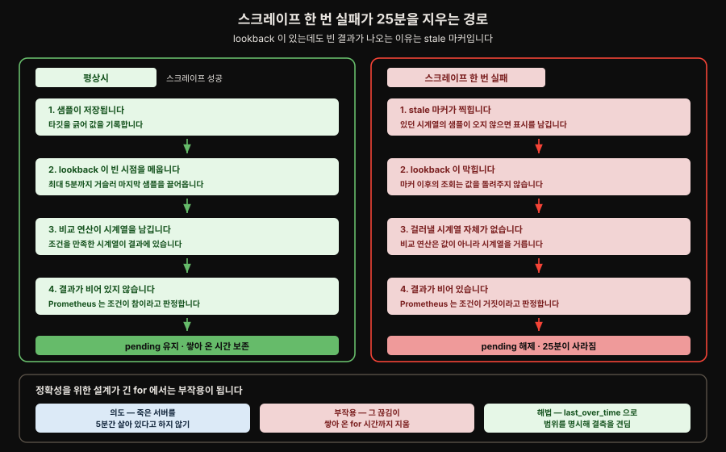
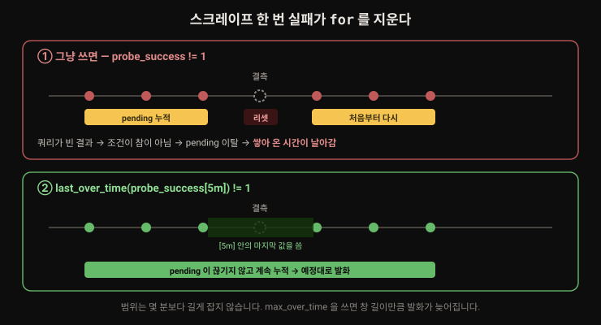
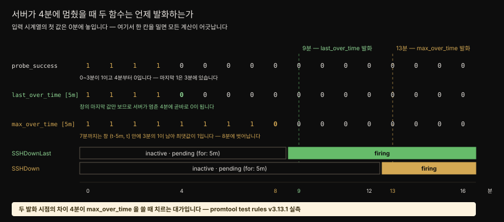

# 견고한 알림과 룰 단위 테스트
---

## 핵심 요약

> 좋은 알림과 시끄러운 알림의 차이는 대개 임계값이 아니라 **`for` 기간 하나**입니다. 저자의 경험칙은 warning 은 15분보다 짧지 않게, critical 은 15분보다 길지 않게입니다.
>
> Prometheus 가 Nagios 같은 체크 기반 도구와 갈리는 지점도 여기입니다. 메모리 사용률만 보고 알리는 대신 **메모리 사용률이 높으면서 동시에 메이저 페이지 폴트 비율도 높을 때**만 `and`·`or`·`unless` 로 알릴 수 있습니다.
>
> 긴 `for` 는 새 함정을 만듭니다. 스크레이프가 한 번 실패하면 쿼리가 빈 결과를 내고 알림이 pending 에서 떨어집니다. `last_over_time` 같은 `_over_time` 함수가 그 초기화를 막습니다.
>
> 알림도 코드이므로 테스트합니다. `promtool test rules` 로 시계열을 지어 넣고 몇 분에 무엇이 발화해야 하는지 단언합니다.


## 학습 목표

> 이 절을 읽고 나면 아래 다섯 가지를 스스로 해낼 수 있습니다.

1. `unless` 로 재부팅 직후 오탐을 걷어 내는 알림을 쓸 수 있습니다.
2. warning 과 critical 에 각각 어울리는 `for` 기간을 고르고 평가 주기와의 관계를 설명할 수 있습니다.
3. 스크레이프 실패가 `for` 상태를 초기화하는 문제를 `_over_time` 으로 막을 수 있습니다.
4. `max_over_time` 을 쓰면 왜 발화가 늦어지는지 계산할 수 있습니다.
5. `promtool test rules` 로 알림 룰의 단위 테스트를 작성하고 실패를 읽을 수 있습니다.


## 본문 정리

### 논리·집합 연산자로 오탐 줄이기

견고한 알림을 만드는 능력은 Prometheus 가 Nagios 같은 전통적 체크 기반 모니터링과 갈리는 지점입니다. 여러 조건을 함께 볼 수 있기 때문입니다. 메모리 사용률이 높다는 사실만으로 알리는 대신, 메모리 사용률이 높으면서 **메이저 페이지 폴트 비율도 높을 때** 알리는 편이 메모리 압박을 훨씬 잘 가리킵니다. 핵심은 오탐을 줄여 **실제로 눈에 보이는 영향이 있을 때만** 울리게 만드는 데 있습니다. 증상에 알릴 것이냐 원인에 알릴 것이냐는 Rob Ewaschuk 의 *My Philosophy on Alerting* 이 깊이 다룹니다.

3장에서 본 `and`·`or`·`unless` 를 아낌없이 씁니다. 서버의 NTP 동기화를 감시하고 싶은데 재부팅 직후에는 NTP 가 어긋나 있을 수 있습니다. 노드의 부팅 시각을 알림 조건에 끌어들이면 됩니다.

```pseudocode
node_timex_offset_seconds > 0.05
unless on (instance)
changes(node_boot_time_seconds[30m]) > 0
```

재부팅 후 대략 30분 동안(설정한 `for` 기간이 더해집니다) NTP 알림이 발화하지 않습니다.

> **`_info` 메트릭 패턴** — 값이 항상 `1` 인 게이지에 `_info` 접미사를 붙이고 정보성 라벨을 잔뜩 매다는 관례입니다. 라벨 값이 바뀔 때 모든 시계열이 갈라지는 대신 이 메트릭 하나만 바뀌므로 churn 이 줄어듭니다. 2장에서 kube-prometheus 와 함께 배포한 kube-state-metrics 가 클러스터 노드 정보를 담은 `kube_node_info` 를 내놓습니다.

### `for` 기간이 알림의 품질을 가른다

시끄러운 알림과 좋은 알림의 차이는 대개 `for` 기간을 늘리는 것만큼 단순합니다. 1시간이나 2시간짜리 `for` 를 겁내지 말고 짧은 `for`(`0m`, `5m`)는 critical 알림에 아껴 둡니다. 저자의 경험칙은 이렇습니다.

- warning 알림의 `for` 는 **15분보다 짧지 않게**
- critical 알림의 `for` 는 **15분보다 길지 않게**

여기에 놓치기 쉬운 제약이 하나 붙습니다. `for` 기간은 룰의 **평가 주기보다 길어야** 의미가 있습니다.[^prom-for] 알림 룰을 5분마다 평가하도록 설정해 두고 `for: 3m` 을 걸면 그 3분은 아무 일도 하지 않습니다.

### 스크레이프 실패가 `for` 를 지운다

긴 `for` 를 쓰면 마주치는 문제가 있습니다. 스크레이프가 한 번 실패하면 그 뒤 룰을 평가할 때 쿼리 표현식이 아무 데이터도 돌려주지 않고 알림은 더 이상 pending 상태가 아니게 됩니다.[^prom-for] 쌓아 온 시간이 날아갑니다.

여기서 의문이 생깁니다. Prometheus 는 조회 시점에 값이 없으면 **최대 5분까지 거슬러 올라가 마지막 샘플을 끌어옵니다**(`--query.lookback-delta` 기본값). 그렇다면 한 번 실패해도 직전 값을 쓰면 될 텐데 왜 빈 결과가 나올까요.

**stale 마커가 그 lookback 을 막습니다.** 있던 시계열의 샘플이 더 이상 오지 않으면 Prometheus 는 stale 표시를 남기고, 그 시점 이후의 조회는 값을 돌려주지 않습니다.[^prom-staleness] 타깃이 사라졌는데 5분 동안 옛 값이 보이면 죽은 서버가 살아 있는 것처럼 읽히므로 결측을 명시적으로 끊는 편이 정확한데, 긴 `for` 에서는 그 정확성이 부작용으로 돌아옵니다.

나머지 한 조각은 **참·거짓을 무엇으로 판정하는가** 입니다. PromQL 의 비교 연산자는 참·거짓 값을 돌려주지 않고 **조건을 만족하지 못한 시계열을 결과에서 떨어뜨립니다**.[^prom-comparison] 그래서 Prometheus 는 결과가 비어 있는지로 판정합니다 — 시계열이 남으면 참, 아무것도 없으면 거짓입니다.

두 조각을 이으면 인과가 드러납니다. 평상시와 견주면 어느 단계에서 갈리는지가 보입니다.



`for` 가 길수록 이 사고를 만날 확률이 올라갑니다. 소음을 줄이려고 내린 결정이 새 취약점을 만든 셈입니다.

`last_over_time`·`avg_over_time`·`max_over_time` 같은 `_over_time` 함수가 이 문제를 우회합니다. 지정한 시간 범위 안에 데이터가 조금이라도 있으면 스크레이프 실패가 `for` 상태를 초기화하지 못합니다.

```pseudocode
# 나쁨
probe_success{job="blackbox_ssh"} != 1

# 좋음
last_over_time(probe_success{job="blackbox_ssh"}[5m]) != 1
```



시간 범위는 몇 분보다 길게 잡지 않기를 저자가 권합니다. 발화와 해소가 제때 일어나야 하기 때문입니다. 스크레이프 실패로부터 `for` 를 지키는 목적이라면 대개 `last_over_time` 이 최선입니다.

`max_over_time` 같은 다른 함수는 알림 동작 자체를 바꿉니다. 위 예제에 넣으면 시계열이 5분 내내 `0` 이어야 표현식이 참이 되어, `for` 위에 지연이 더 얹힙니다.

> **이상 탐지** — 대부분의 알림은 `디스크 사용률 > 95%`, `up == 0` 처럼 뚜렷한 임계값을 갖지만 Prometheus 데이터로 이상 탐지를 할 여지도 분명히 있습니다. 표준편차 같은 값을 계산해 단순한 이상 탐지를 만들 수 있습니다. 통계 지식이 필요한 주제라 이 책의 범위를 벗어나며 저자는 z-score 와 계절성을 다룬 [GitLab 의 글](https://about.gitlab.com/blog/2019/07/23/anomaly-detection-using-prometheus/)을 권합니다.

### 알림 룰 단위 테스트

알림 테스트는 Prometheus 기능 중 덜 이야기되는 축입니다. 사고가 났던 시간 범위에 쿼리를 돌려 "이 쿼리라면 잡았겠군" 확인하는 방식이 흔한데, 유효하긴 해도 룰을 손본 뒤에도 계속 동작하리라는 보장은 주지 못합니다.

알림은 Prometheus 안에서 정의되고 평가되므로 `amtool` 이 아니라 **`promtool`** 을 씁니다. 단순 검증과 단위 테스트는 다른 명령입니다.

```bash
promtool check rules ch5/test-rule.yaml    # 문법만 검사
promtool test rules unit-test.yaml         # 기대대로 발화하는지 검사
```

#### 1. 테스트할 룰

테스트할 룰부터 둡니다.

```yaml
groups:
  - name: chapter5
    rules:
      - alert: SSHDown
        expr: >
          max_over_time(
            probe_success{job="blackbox_ssh"}[5m]
          ) != 1
        for: 5m
        labels:
          severity: warning
          team: sre
        annotations:
          description: "Cannot SSH to {{ $labels.instance }}"
```

#### 2. 입력 시계열

그 다음 테스트 파일을 씁니다. 어느 룰 파일을 대상으로 할지, 얼마나 자주 평가할지, 어떤 입력 시계열을 넣을지 적습니다.

```yaml
rule_files:
  - ./test-rule.yaml

evaluation_interval: 1m

tests:
  - interval: 1m
    input_series:
      - series: 'probe_success{instance="server1", job="blackbox_ssh"}'
        values: "1 1 1 1 0+0x12"
      - series: 'probe_success{instance="server2", job="blackbox_ssh"}'
        values: "1 1 1 _ 1+0x12"
```

`server1` 은 처음 4분 동안 성공하다가 그 뒤로 실패합니다. `server2` 는 3분 성공한 뒤 스크레이프를 한 번 놓치고(`_` 로 표시합니다) 계속 성공합니다.



원문은 `server1` 이 14분에 알림을 시작한다고 적습니다. `max_over_time` 이 9분이 되어서야 `0` 을 돌려주기 시작하고 룰의 `for` 기간이 5분이므로 14분이라는 계산입니다. **이 계산은 한 칸 밀려 있습니다** — 실제로는 8분에 `0` 이 나오기 시작해 13분에 발화합니다. 근거는 §심화 학습에 적었습니다.

> **확장 표기법** — `values` 필드는 샘플 값을 일일이 적는 대신 `A+BxC` 형태로 줄여 씁니다. `A` 는 시작 값, `B` 는 샘플마다 더할 증분, `C` 는 덧붙일 샘플 수입니다.[^prom-expanding] 뺄셈(`A-BxC`)도 되지만 곱셈과 나눗셈은 되지 않습니다.

#### 3. 단언

이제 무엇이 언제 발화해야 하는지 단언합니다. 9분에는 아무 알림도 발화하지 않아야 합니다.

```yaml
alert_rule_test:
  - alertname: SSHDown
    eval_time: 9m
    exp_alerts: []
  - alertname: SSHDown
    eval_time: 14m
    exp_alerts:
      - exp_labels:
          severity: warning
          team: sre
          instance: server1
          job: blackbox_ssh
        exp_annotations:
          description: "Cannot SSH to server1"
```

14분 쪽 테스트는 기대하는 라벨과 애노테이션을 전부 적게 하므로 **템플릿이 제대로 렌더되는지까지 검증**됩니다. `eval_time` 을 12분으로 낮추면 아직 발화 전이라 테스트가 실패합니다(발화는 13분부터입니다). 값을 이리저리 바꿔 보며 반응을 확인하기 좋은 지점입니다.

```bash
promtool test rules unit-test.yaml
```

```markdown
Unit Testing:  unit-test.yaml
  SUCCESS
```

여러 시계열을 엮는 견고한 알림일수록 `input_series` 정의가 복잡해집니다. 그래도 그 복잡한 알림이 기대대로 동작한다는 확신을 얻을 값어치가 있습니다.


## 심화 학습

**원문의 확장 표기법 설명은 시작 값을 빠뜨립니다.** 본문은 `1+0x12` 가 `1+(0*1) … 1+(0*12)` 로 펼쳐진다고 적어 샘플 12개처럼 읽히지만, 공식 문서는 다르게 적습니다.

> `'a+bxn'` becomes `'a a+b a+(2*b) a+(3*b) … a+(n*b)'` — Read this as series starts at a, then n further samples incrementing by b.

시작 값 `a` 가 먼저 놓이고 그 **뒤에** `n` 개가 붙으므로 `1+0x12` 는 샘플 **13개**이고, 본문의 나열에는 첫 항 `1+(0*0)` 이 빠져 있습니다. `axn` 이 `a` 를 **`n+1` 번** 반복한다는 다른 규칙이 이를 확인해 줍니다.[^prom-expanding] 원문의 "16분 어치 데이터" 는 샘플 개수가 아니라 `0분`부터 `16분`까지 흐른 **시간**으로 읽어야 어긋나지 않습니다.

**같은 한 칸 밀림이 발화 시점 계산에도 있습니다.** 원문은 `max_over_time` 이 9분에 `0` 을 내기 시작해 14분에 발화한다고 적지만, 실제로는 **8분에 시작해 13분에 발화**합니다(`promtool test rules` v3.13.1 로 확인, 2026-08-05).

뿌리는 같습니다. `input_series` 의 샘플은 `start_timestamp` 부터 놓이므로 **첫 값이 0분에 자리합니다**. `"1 1 1 1 0+0x12"` 는 0·1·2·3분이 `1` 이고 4분부터 `0` 인데, 원문처럼 "처음 4분" 을 1~4분으로 읽으면 모든 시점이 한 칸 밀립니다. 범위 벡터 `[5m]` 은 `(t-5m, t]` 구간이고 마지막 `1` 이 3분에 있으므로, 창이 3분을 벗어나는 첫 시점은 8분입니다.

| 시점 | 창 `(t-5m, t]` | 최댓값 | `!= 1` |
|---|---|---|---|
| 7분 | 3·4·5·6·7분 = `1 0 0 0 0` | 1 | 거짓 |
| 8분 | 4·5·6·7·8분 = `0 0 0 0 0` | 0 | **참** |

`for: 5m` 을 채워 **13분에 발화**합니다. `eval_time: 12m` 에는 발화가 없고 `13m` 에 있다는 것까지 단언해 경계를 확정했습니다.

**그래서 두 함수의 지연 차이는 5분이 아니라 4분입니다.** 같은 입력에서 `last_over_time` 은 4분에 참이 되어 9분에 발화하므로, `max_over_time` 이 4분 늦습니다.

| 함수 | 참 | 발화 | 서버 정지(4분) 대비 |
|---|---|---|---|
| `last_over_time` | 4분 | 9분 | 5분 (`for` 만큼) |
| `max_over_time` | 8분 | 13분 | 9분 |

본문 SVG 도 이 실측값으로 다시 그렸습니다. 두 함수를 나란히 두어 발화 시점이 갈리는 지점이 막대 길이로 드러납니다.

**`_` 말고 `stale` 도 있습니다.** 본문은 놓친 스크레이프를 `_` 로 표시하는 것만 소개합니다. 문서는 stale 마커도 함께 정의하며 `1 _x3 stale` 같은 표기를 예로 듭니다.[^prom-stale] 결측과 stale 은 PromQL 에서 다르게 취급되므로 staleness 를 다루는 알림을 테스트할 때 구분이 필요합니다.

**`last_over_time` 이 기본값이어야 하는 이유를 한 번 더 짚습니다.** 본문의 예제 룰은 정작 `max_over_time` 을 씁니다. 발화가 늦어지는 모습이 설명에 좋기 때문인데, 실전에서 스크레이프 실패로부터 `for` 를 지키는 것이 목적이라면 `last_over_time` 이 지연을 만들지 않습니다. 위 표의 **4분** 차이가 그 대가입니다.

**증상에 알린다는 원칙은 SLO 노트와 이어집니다.** 이 책이 권하는 "실제로 보이는 영향이 있을 때만 울려라" 는 기존 [`01-04. SLO와 알림`](../../01_Foundations/01-04.SLO와%20알림%20—%20Error%20Budget,%20Burn%20Rate.md) 편의 번 레이트 알림과 같은 뿌리입니다. 13장에서 Sloth·Pyrra 로 다시 만납니다.


## 결정 치트시트

> 알림을 덜 시끄럽게 만들 때 고르는 표입니다.

| 증상 | 손잡이 | 이유 |
|------|--------|------|
| 잠깐 튀는 값에 알림이 운다 | `for` 를 늘린다 | 시끄러운 알림과 좋은 알림의 차이는 대개 이것뿐입니다 |
| `for` 를 걸었는데 효과가 없다 | 평가 주기를 확인한다 | `for` 가 평가 주기보다 짧으면 무의미합니다 |
| 스크레이프 한 번 실패에 `for` 가 초기화된다 | `last_over_time(...[5m])` | stale 마커가 5분 lookback 을 막아 빈 결과가 되고, 빈 결과는 거짓으로 판정됩니다 |
| 원인 하나에 알림이 여러 개 운다 | `unless` · 억제 규칙 | 조건 자체를 좁히거나 Alertmanager 에서 죽입니다 |
| 재부팅 직후 오탐 | `unless on (instance) changes(node_boot_time_seconds[30m]) > 0` | 같은 시계열에서 값이 바뀔 때만 잡힙니다 |
| 배포·재시작 직후 오탐 | `unless on (instance) (time() - process_start_time_seconds) < 600` | 새 시계열이 생기는 파드에도 통합니다 |
| 임계값을 정할 수 없다 | 이상 탐지(표준편차·z-score) | 정적 임계값이 없는 지표에 씁니다 |

| `for` 기간 | 등급 | 근거 |
|-----------|------|------|
| `0m` · `5m` | critical | 즉시 사람이 움직여야 하는 알림에 아껴 씁니다 (15분 이하) |
| `15m` 이상 | warning | 저자 경험칙 — warning 은 15분보다 짧지 않게 |
| `1h` · `2h` | 느린 추세 | 겁내지 말고 쓰라고 저자가 권합니다 |


## Spring 앱 개발 관점

**Spring 앱의 오류율 알림도 `and` 로 조여야 실용적입니다.** 오류율만 보면 트래픽이 없는 새벽에 요청 두 건 중 한 건만 실패해도 50% 가 됩니다. 처리량 조건을 함께 걸면 이 오탐이 사라집니다.

```pseudocode
  sum(rate(http_server_requests_seconds_count{status=~"5.."}[5m])) by (service)
/ sum(rate(http_server_requests_seconds_count[5m])) by (service)
  > 0.05
and
  sum(rate(http_server_requests_seconds_count[5m])) by (service) > 1
```

`http_server_requests_seconds_count` 는 Spring Boot Actuator 가 Micrometer 를 통해 내보내는 기본 HTTP 서버 메트릭입니다. 뒤쪽 조건은 초당 요청이 1건을 넘을 때만 알림을 허용합니다.

**배포 직후 오탐도 같은 자리에서 잡습니다.** 앱 재시작 직후의 워밍업 구간은 프로세스 시작 시각으로 걸러 냅니다. Micrometer 의 `UptimeMetrics` 가 `process.start.time` 게이지를 등록하고 Prometheus 쪽에서는 `process_start_time_seconds` 로 나옵니다.

```pseudocode
<알림 조건>
unless on (instance)
(time() - process_start_time_seconds) < 600
```

NTP 예제처럼 `changes(process_start_time_seconds[10m]) > 0` 을 쓰지 않는 이유는 `changes` 가 **같은 시계열 안에서** 값이 바뀌어야 잡아내기 때문입니다.

- **노드** — 재부팅해도 인스턴스 식별자가 유지되므로 `changes` 가 성립합니다.
- **Kubernetes 파드** — 재시작하며 새 주소를 받으면 아예 **새 시계열**이 되어, 변화를 관측할 대상 자체가 없습니다.

시작 시각으로부터 흐른 시간을 직접 재면 시계열이 새것이든 아니든 똑같이 동작합니다.

**`for` 를 늘리기 전에 평가 주기를 봅니다.** Prometheus Operator 에서 룰 평가 주기는 `Prometheus` CRD 설정을 따르고 기본값이 30초입니다. `for: 15m` 은 문제없지만, 평가 주기를 길게 바꾼 환경에서 짧은 `for` 를 걸면 조용히 무력해집니다.

**알림 룰도 CI 에서 테스트합니다.** `promtool` 은 바이너리 하나로 도는 명령이라 파이프라인에 넣기 쉽습니다. `PrometheusRule` CRD 로 룰을 관리한다면 `spec.groups` 부분만 떼어 낸 YAML 을 테스트 대상으로 둡니다. 12장(CI 파이프라인·Pint) 에서 본격적으로 다룹니다.


## 면접에서 받을 만한 질문

> 아래 질문에 **먼저 스스로 답해 보세요.** 자답이 끝나면 이어지는 §정답 (자답 후 펼치기) 으로 내려갑니다.

1. 시끄러운 알림을 조용하게 만드는 가장 단순한 방법은 무엇입니까?
2. 스크레이프가 한 번 실패하면 `for` 가 왜 초기화됩니까?
3. `last_over_time` 대신 `max_over_time` 을 쓰면 무엇이 달라집니까?
4. 메모리 사용률이 높다는 이유만으로 알리지 않는 이유는 무엇입니까?
5. 알림 룰을 테스트하려면 `amtool` 을 씁니까?
6. 단위 테스트로 템플릿까지 검증할 수 있습니까?


## 핵심 개념 체크리스트

> §학습 목표·§면접 질문과 겹치지 않는 항목만 둡니다.

- [ ] `unless on (instance) changes(...) > 0` 이 무엇을 걸러 내는지 설명할 수 있는가?
- [ ] `_info` 메트릭 패턴의 값과 목적을 아는가?
- [ ] 5분 lookback 이 있는데도 결측이 빈 결과를 내는 이유(stale 마커)를 아는가?
- [ ] 비교 연산자가 시계열을 걸러낸다는 사실이 참·거짓 판정과 어떻게 이어지는지 아는가?
- [ ] `input_series` 의 첫 값이 0분에 놓인다는 사실과, 그것을 놓치면 계산이 한 칸 밀린다는 점을 아는가?
- [ ] 범위 벡터 `[5m]` 이 `(t-5m, t]` 구간이라는 것을 아는가?
- [ ] `promtool check rules` 와 `promtool test rules` 의 차이를 아는가?
- [ ] `input_series` 의 `_` 와 `stale` 의 차이를 아는가?
- [ ] 확장 표기법 `A+BxC` 의 세 인자를 설명할 수 있는가?


## 참고 자료

- 원본: *Mastering Prometheus* (Packt, ISBN 9781805125662) 5장 뒷부분 — Making robust alerts · Unit-testing alerting rules. 이 장으로 책의 1부(Prometheus 기초)가 끝나고 다음 장부터 2부(Scaling Prometheus)가 시작됩니다.
- 본문이 안내하는 링크 — [My Philosophy on Alerting (Rob Ewaschuk)](https://docs.google.com/document/d/199PqyG3UsyXlwieHaqbGiWVa8eMWi8zzAn0YfcApr8Q/edit) · [Unit Testing for Rules](https://prometheus.io/docs/prometheus/latest/configuration/unit_testing_rules/) · [Prometheus Alerting Documentation](https://prometheus.io/docs/alerting/latest/overview/) · [Anomaly detection using Prometheus (GitLab)](https://about.gitlab.com/blog/2019/07/23/anomaly-detection-using-prometheus/)
- 관련 노트는 문서 끝 §관련 문서 표에 있습니다. 책 전체 지도는 [README (책 MOC)](README.md).


## 정답 (자답 후 펼치기)

> 위 §면접에서 받을 만한 질문 의 6개에 *먼저 자답한 뒤* 아래를 읽으세요. 자답 없이 먼저 읽으면 학습 효과가 0 입니다. 질문 번호와 1:1 로 대응합니다.

### 정답 1 — 가장 단순한 손잡이는 `for`

`for` 기간을 늘립니다. 대개 임계값을 바꾸는 것보다 효과가 큽니다. 다만 룰 평가 주기보다 길어야 의미가 있어, 5분마다 평가하는 룰의 `for: 3m` 은 아무 일도 하지 않습니다.[^prom-for]

### 정답 2 — 스크레이프 실패가 `for` 를 지우는 메커니즘

결측에 stale 마커가 찍혀 5분 lookback 이 막힙니다. 조회는 빈 결과를 냅니다. 비교 연산자는 조건에 맞지 않는 시계열을 떨어뜨리므로 빈 결과가 곧 거짓입니다. pending 이 풀리고 쌓아 온 시간이 사라집니다. `last_over_time(...[5m])` 처럼 범위 안의 마지막 값을 쓰면 결측 한 번이 상태를 지우지 못합니다.

### 정답 3 — `max_over_time` 으로 바뀌는 것

알림 동작 자체가 바뀝니다. `max_over_time(...[5m])` 은 5분 창의 최댓값이 `1` 이 아니어야 참이므로 시계열이 창 내내 `0` 이어야 합니다. `for` 위에 지연이 더 얹혀, 본문 예제에서는 `last_over_time` 보다 4분 늦게 발화합니다.

### 정답 4 — 메모리 사용률만으로 알리지 않는 이유

높은 메모리 사용률 자체는 문제가 아닐 수 있습니다. 메이저 페이지 폴트 비율이 함께 높을 때가 메모리 압박의 더 나은 지표이고, `and` 로 두 조건을 묶으면 실제 영향이 있을 때만 울립니다. 증상에 알리고 원인에는 알리지 않는다는 원칙의 한 사례입니다.

### 정답 5 — `amtool` 이 아니라 `promtool`

아닙니다. 알림은 Prometheus 안에서 정의·평가되므로 `promtool` 을 씁니다. `check rules` 는 문법만 보고, `test rules` 는 입력 시계열을 지어 넣어 특정 시점에 어떤 알림이 어떤 라벨·애노테이션으로 발화하는지 단언합니다. `amtool` 은 Alertmanager 쪽 설정과 템플릿을 다룹니다.

### 정답 6 — 템플릿까지 검증된다

됩니다. `exp_alerts` 에 기대하는 `exp_labels` 와 `exp_annotations` 를 전부 적으므로, 애노테이션 안의 `{{ $labels.instance }}` 가 `server1` 로 렌더되는지까지 확인됩니다.[^prom-exp-alerts]


## 관련 문서

> 이 절에서 이어지는 갈래입니다. 앞 절이 발송 경로를 다뤘다면 여기는 알림 룰 자체의 품질과 테스트를 다뤘고, 그 룰을 CI 로 밀어 넣는 이야기가 12장으로 이어집니다.

| 문서 | 이 절과 어떻게 이어지는가 |
|------|------------------------|
| [05-01. Alertmanager](05-01.Alertmanager%20—%20라우팅·그룹핑·억제·HA.md) | 같은 5장의 앞절입니다. 여기서 만든 알림이 거기서 라우팅·그룹핑·억제를 거쳐 발송됩니다 |
| [03-04. PromQL 기초](03-04.PromQL%20기초.md) § "집합 연산자" | `and`·`or`·`unless` 와 `_over_time` 함수의 문법이 여기서 나옵니다 |
| [12-01. CI 파이프라인으로 Prometheus 검증](12-01.CI%20파이프라인으로%20Prometheus%20검증%20—%20promtool·amtool·Pint.md) | `promtool test rules` 를 파이프라인에 넣는 본격적인 이야기 |
| [01-04. SLO와 알림](../../01_Foundations/01-04.SLO와%20알림%20—%20Error%20Budget,%20Burn%20Rate.md) | 증상에 알린다는 원칙의 다른 얼굴 — 번 레이트로 무엇을 알릴지 정합니다 |
| [00-01. 용어집](00-01.용어집.md) | pending·firing·확장 표기법 등 이 절 용어의 정의 |

[^prom-for]: Prometheus — Alerting rules. 조건을 처음 만난 시점과 발화로 세는 시점 사이를 `for` 가 벌리며, 그 사이는 pending 상태입니다. 같은 문서가 `Alerting rules without the for clause will become active on the first evaluation` 이라 적어 평가 단위로 세는 값임을 못 박습니다.
<https://prometheus.io/docs/prometheus/latest/configuration/alerting_rules/#defining-alerting-rules>

[^prom-expanding]: Prometheus — Unit Testing for Rules. `'a+bxn'` 은 `'a a+b a+(2*b) a+(3*b) … a+(n*b)'` 로 펼쳐지고, `'axn'` 은 `'a a a … a' (a n+1 times)` 입니다. 즉 시작 값이 먼저 놓이고 그 뒤로 `n` 개가 더 붙어 총 `n+1` 개입니다.
<https://prometheus.io/docs/prometheus/latest/configuration/unit_testing_rules/#series>

[^prom-stale]: Prometheus — Unit Testing for Rules. `'_'` 는 `represents a missing sample from scrape`, `'stale'` 은 `indicates a stale sample` 이며 `'1 _x3 stale'` 이 `'1 _ _ _ stale'` 로 펼쳐집니다.
<https://prometheus.io/docs/prometheus/latest/configuration/unit_testing_rules/#series>

[^prom-staleness]: Prometheus — Querying basics, Staleness. 근거는 `If a query is evaluated at a sampling timestamp after a time series is marked as stale, then no value is returned for that time series` 입니다. lookback 기본값 5분은 `--query.lookback-delta` 로 바꿉니다.
<https://prometheus.io/docs/prometheus/latest/querying/basics/#staleness>

[^prom-comparison]: Prometheus — Operators, Comparison binary operators. 기본 동작은 `vector elements between which the comparison result is false get dropped from the result vector` 입니다. `bool` 수식어를 붙이면 걸러내는 대신 0 또는 1 을 돌려주므로 알림 조건에는 쓰지 않습니다.
<https://prometheus.io/docs/prometheus/latest/querying/operators/#comparison-binary-operators>

[^prom-exp-alerts]: Prometheus — Unit Testing for Rules. `exp_labels` 와 `exp_annotations` 는 `the expanded labels and annotations of the expected alert` 이므로 템플릿 렌더 결과까지 단언 대상이 됩니다.
<https://prometheus.io/docs/prometheus/latest/configuration/unit_testing_rules/#alert-test-case>
