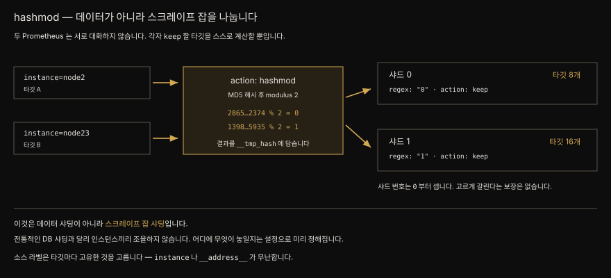

# 6-1. 샤딩·페더레이션·고가용성
---


## 핵심 요약

> 단일 Prometheus 가 버거워지는 원인은 대개 둘입니다. **카디널리티**와 **장기 보존**입니다. 앞의 것이 훨씬 자주 범인이고 메모리와 디스크는 돈으로 넓힐 수 있어도 쿼리 속도는 그렇지 않습니다. PromQL 엔진이 아직 단일 스레드이기 때문입니다.
>
> **샤딩**은 데이터를 쪼개는 일이 아니라 **스크레이프 잡을 쪼개는 일**입니다. Prometheus TSDB 끼리는 대화하지 않으므로 무엇이 어디에 놓일지는 설정으로 미리 정해집니다. `hashmod` 로 나누면 동적이지만 사람이 어느 인스턴스를 봐야 할지 알 수 없어집니다.
>
> **페더레이션**은 그 잃어버린 "단일 창"을 되찾으려는 시도인데, 저자는 열 번 중 아홉 번은 옳은 답이 아니라고 못 박습니다. 샤딩한 이유가 하나의 Prometheus 가 너무 커져서였다면 중앙 Prometheus 는 같은 문제를 되풀이합니다.
>
> **HA** 에 관해 Prometheus 는 Alertmanager 와 달리 내장 기능이 없습니다. 답은 복제입니다. 똑같은 인스턴스를 하나 더 띄우고 `prometheus_replica` 라벨로만 구분하되, 알림을 보내기 전 그 라벨을 떨어뜨려야 Alertmanager 가 중복을 제거할 수 있습니다.


## 학습 목표

> 이 절을 읽고 나면 아래 다섯 가지를 스스로 해낼 수 있습니다.

1. 라벨 카디널리티의 권장 상한을 말하고 어떤 라벨이 나쁜 라벨인지 판별할 수 있습니다.
2. `hashmod` 로 스크레이프 잡을 샤딩하는 두 단계 relabel 규칙을 쓸 수 있습니다.
3. 페더레이션을 써야 할 때와 쓰지 말아야 할 때를 구분하고 `honor_labels` 가 왜 필요한지 설명할 수 있습니다.
4. HA 복제본이 만드는 알림 중복 문제를 `alert_relabel_configs` 로 해결할 수 있습니다.
5. 세 가지 relabeling(표준·메트릭·알림)이 각각 언제 도는지 구분할 수 있습니다.


## 본문 정리

### Prometheus 의 두 가지 한계

쓰기 시작할 때는 못 하는 일이 없어 보입니다. 망치를 들면 모든 것이 못으로 보입니다. 시간이 지나면 금이 갑니다. 쿼리가 느려지고 메모리 사용량이 슬금슬금 올라가며 재시작할 때 WAL 재생이 점점 오래 걸립니다. 잘못한 것은 없습니다. 어느 기술이나 한계가 있고 그중 우리가 가장 신경 써야 할 둘은 **카디널리티**와 **장기 보존**입니다.

**카디널리티**는 데이터셋이 갖는 고유한 값의 수를 가리킵니다. IP 주소, UUID, 타임스탬프가 높은 카디널리티의 예이고 운영체제 종류(Windows·Mac·Linux)나 프로세스 상태(running·stopped)처럼 가능한 값이 미리 정해진 것이 낮은 카디널리티입니다.

이 문제는 **라벨에만** 해당합니다. 시계열의 *값* 은 Go 의 `float64` 로 표현할 수 있는 거의 무한한 카디널리티를 갖도록 설계돼 있습니다. 저장소에서 가장 높은 카디널리티를 만드는 쪽은 언제나 라벨 값이고 특히 가능한 값에 제약이 없을 때 그렇습니다.

제약이 없다는 말은 가능한 값에 의미 있는 한계가 없다는 뜻입니다. IPv4 주소는 "고작" 4,294,967,296 가지이고 IPv6 는 340,282,366,920,938,463,463,374,607,431,768,211,456 가지입니다. 요점은 그 값이 **100** 보다 훨씬 크다는 데 있습니다. 100 이 대부분의 라벨 값에 권장되는 최대 카디널리티입니다. 그마저도 대부분은 가능한 선택지가 **10 개 미만**이어야 Prometheus 가 편안하고 소수의 라벨만 그보다 많아도 됩니다.

> **좋은 라벨** — 가능한 값이 작고 고정된 라벨입니다. HTTP 메서드에 대응하는 `method` 라벨(`GET`·`PUT`·`POST`·`DELETE`)이 그런 예입니다.

카디널리티가 늘면 head 블록에 유지해야 할 고유 시계열이 늘어 메모리가 치솟고 디스크에 저장할 시계열도 늘어납니다. 이 둘은 돈을 더 써서 서버 자원을 늘리면 풀립니다. 그래도 남는 문제가 쿼리 속도입니다. Prometheus 의 PromQL 엔진은 집필 시점 기준으로 **여전히 단일 스레드**입니다. 카디널리티를 어떻게 찾아내고 어떻게 줄일지는 7장이 다룹니다.

**장기 보존**은 다른 결의 한계입니다. 3장에서 봤듯 TSDB 의 블록 하나하나가 사실상 독립된 데이터베이스입니다. 멋진 성질이지만 쿼리 하나를 위해 수십 개의 "독립된" 데이터베이스를 열어 살펴야 한다면 최적이라 하기 어렵습니다. 게다가 컴팩션을 거쳐도 **블록의 최대 크기는 31일**입니다. 몇 해치 데이터를 Prometheus 서버에 그대로 두면 해마다 거대한 블록이 최소 12개씩 쌓입니다.

> **장기 보존에 관한 일화** — 저자는 권하지 않는다면서도 로컬 디스크에 최소 2년치 데이터를 큰 문제 없이 보관하는 사람들을 안다고 적습니다. 더 나은 선택지가 있다는 사실이 순정 Prometheus 로 장기 보존을 하는 일이 불가능하거나 비현실적이라는 뜻은 아닙니다.

### 샤딩은 데이터가 아니라 스크레이프 잡을 나눈다

샤딩을 고민한다면 십중팔구 카디널리티에 부딪힌 것입니다. 데이터가 너무 많은데 어느 것도 버리고 싶지 않습니다. 답은 단순합니다. Prometheus 를 하나 더 띄웁니다.

이렇게 인스턴스 사이로 데이터를 가르는 일을 샤딩이라 부르지만 **전통적인 의미의 샤딩은 아닙니다**. Prometheus TSDB 끼리는 서로 대화하지 않으므로 인스턴스들이 협조해 데이터를 나누지 않습니다. 대신 각 인스턴스의 스크레이프 잡을 어떻게 설정하느냐로 데이터가 놓일 자리를 **미리 정해 둡니다**. 데이터 샤딩이라기보다 스크레이프 잡 샤딩에 가깝습니다.

방법은 둘입니다.

**서비스 단위 샤딩**이 더 단순합니다. 용도별로 인스턴스를 가릅니다. 팀마다 하나씩 두어 각 팀이 관심 있는 데이터를 한곳에서 보게 하거나, 가상화 인프라·베어메탈·컨테이너처럼 임의의 기준으로 나눕니다. 기준이 무엇이든 요점은 어느 Prometheus 가 어느 스크레이프 타깃을 갖는지에 최소한의 통일성과 일관성을 두는 데 있습니다. 다른 엔지니어가 "내가 찾는 메트릭은 어디 있지" 를 추론하기 쉬워집니다.

**relabeling 을 이용한 샤딩**은 훨씬 동적입니다. 대가도 분명합니다. 스크레이프 타깃이 **어느 인스턴스에 놓일지 알 수 없다**는 복잡성이 붙습니다. 사람에게 예측 불가능하다는 말이 결정론적이지 않다는 뜻은 아닙니다. 일관되게 정해지되 사용자가 어느 Prometheus 로 가야 하는지 알기 어려울 뿐입니다. Thanos 나 페더레이션이 그 문제를 우회하는 길입니다.

열쇠는 relabeling 중에 쓸 수 있는 **`hashmod`** 함수입니다. 소스 라벨 하나 이상을 받아 이어 붙이고 MD5 해시를 만든 뒤, 거기에 모듈로 연산을 적용합니다. 그 결과를 저장해 두고 다음 relabeling 단계에서 특정 값을 가진 타깃만 남기거나 버립니다.

> **여기서 쓰는 relabeling 은 표준 relabeling 입니다.** 메트릭 relabeling 이 아니라 스크레이프가 일어나기 **전에** 도는 쪽입니다. ([4장](04-01.서비스%20디스커버리와%20relabeling.md) 참고)

논리부터 파이썬 REPL 로 봅니다.

```python
>>> from hashlib import md5
>>> SEPARATOR = ";"
>>> MOD = 2
>>> targetA = ["app=nginx", "instance=node2"]
>>> targetB = ["app=nginx", "instance=node23"]
>>> hashA % MOD      # 286540756315414729800303363796300532374 % 2
0
>>> hashB % MOD      # 139861250730998106692854767707986305935 % 2
1
```

모듈로가 2 이므로 가능한 값은 0 과 1 뿐입니다. Prometheus 가 둘이라면 하나는 결과가 0 인 타깃만, 다른 하나는 1 인 타깃만 남기도록 설정합니다. 그것이 스크레이프 잡을 샤딩하는 방법이고 **모듈로 값은 대개 샤딩할 인스턴스 수와 같게** 잡습니다.



kube-prometheus 는 Prometheus Operator 를 통해 이 방식을 기본 지원합니다. Helm 값의 `prometheusSpec` 에 샤드 수를 적기만 하면 됩니다. 여기에 이름 정리가 하나 더 필요합니다. 그러지 않으면 문자 수 제약 탓에 Kubernetes 가 새 파드를 띄우지 못합니다.

```yaml
prometheus:
  prometheusSpec:
    shards: 2
cleanPrometheusOperatorObjectNames: true
```

> 집필 시점에 Prometheus CRD 로 샤드를 지정하는 기능은 **실험적** 으로 분류돼 있었습니다.

적용하면 `prometheus-mastering-prometheus-kube-shard-1-0` 라는 파드가 새로 생깁니다. `http://localhost:9090/config` 에서 Operator 가 뒤에서 만들어 낸 relabel 규칙을 볼 수 있습니다.

```yaml
relabel_configs:
  # [ . . . ]
  - source_labels: [__address__]
    modulus: 2
    target_label: __tmp_hash
    action: hashmod
  - source_labels: [__tmp_hash]
    regex: "1"
    action: keep
```

`__address__` 라벨의 해시에 모듈로 2 를 취해 `__tmp_hash` 라는 새 라벨에 담고 그 값을 자기 **샤드 번호**(0 부터 셉니다)와 맞춰 일치하는 타깃만 남깁니다. 저자는 `__tmp_hash` 라는 이름에 특별한 것이 없고 소스 라벨도 아무거나 고를 수 있다고 적습니다. 다만 **타깃마다 고유한 라벨**을 골라야 하므로 `instance` 와 `__address__` 가 무난합니다.

Operator 는 이 두 단계를 모든 스크레이프 잡에 알아서 붙여 줍니다. Prometheus 설정을 직접 관리한다면 샤딩하려는 **모든 스크레이프 잡에 일일이** 넣어야 합니다. 전역으로 한 번에 거는 방법은 현재 없습니다.

이 방식이 스크레이프 잡을 고르게 나눠 준다는 보장은 없습니다. 두 인스턴스에 각각 포트포워딩해 `count(up)` 을 돌려 보면 드러납니다. 저자의 환경에서는 **샤드 0 에 8개, 샤드 1 에 16개**가 붙었습니다. 소스 라벨을 더 넣어 미세 조정을 시도할 수는 있으나 들일 노력만큼의 값어치는 없을지 모릅니다. 고유한 타깃이 늘어나면 저절로 고르게 퍼집니다.

### 페더레이션 — 열 번 중 아홉 번은 답이 아니다

모두가 원하는 "단일 창(single pane of glass)" 이 있습니다. 샤딩은 그것과 반대로 가는 듯 보이지만 페더레이션으로 되찾을 수 있습니다. 페더레이션은 여러 출처의 메트릭을 중앙의 한곳으로 모으는 일입니다. 아래쪽 Prometheus 의 메트릭과 1:1 로 대응할 수도 있고 상위 인스턴스에 저장하기 전에 PromQL 함수를 적용해 시계열을 집계·통합할 수도 있습니다.

> **페더레이션을 해야 할까요** — 샤딩했다는 이유로 페더레이션한다면, 이미 하나의 Prometheus 가 감당 못 할 만큼 커진 경험을 한 셈입니다. 중앙 Prometheus 로 모으면 같은 문제를 되풀이합니다. 아껴 쓰고 부분집합만, 되도록 **집계된** 메트릭만 넘깁니다. 경험칙 하나 — 메트릭에 `instance` 라벨이 있다면 아마 페더레이션하지 말아야 합니다. 부분집합만 넘기는 순간 "단일 창" 은 이미 물 건너갑니다. 페더레이션을 건너뛰고 곧장 Thanos 로 가라고 누가 말해 주기를 기다렸다면, 저자가 그 신호를 줍니다.

페더레이션은 Prometheus 내장 기능이고 `/federate` 라는 전용 API 엔드포인트가 있습니다. 다른 메트릭 엔드포인트처럼 스크레이프하되 **`match[]` URL 쿼리 파라미터를 최소 하나** 줘야 합니다. 값은 순간 벡터 셀렉터여야 합니다.

```
http://localhost:9090/federate?match[]=up{job="node-exporter"}
```

cURL 로 부를 때는 중괄호를 이스케이프해야 합니다. `match[]` 는 여러 번 지정할 수 있어 부분집합마다 스크레이프 잡을 따로 만들 필요가 없습니다. 메트릭 이름이 숨은 `__name__` 라벨에 저장된다는 사실을 기억하면 그것으로도 거를 수 있습니다.

손으로 쓰면 금세 지저분해지므로 YAML 로 적습니다.

```yaml
scrape_configs:
  - job_name: 'federate'
    scrape_interval: 15s
    honor_labels: true
    metrics_path: '/federate'
    params:
      'match[]':
        - 'up{job="prometheus"}'
        - 'node_os_info'
    static_configs:
      - targets:
          - 'prometheus-shard-1:9090'
          - 'prometheus-shard-2:9090'
```

`honor_labels: true` 가 중요합니다. 들어오는 메트릭의 라벨을 의도치 않게 덮어쓰지 않도록 막아 줍니다.

Operator 환경에서는 `ServiceMonitor` 와 `Prometheus` CRD 로 같은 일을 합니다. 페더레이션 전용 인스턴스이므로 다른 스크레이프 잡 탐색은 전부 꺼 둡니다.

```yaml
apiVersion: monitoring.coreos.com/v1
kind: ServiceMonitor
metadata:
  name: federated-prometheus
  namespace: prometheus
  labels:
    app.kubernetes.io/name: "federated-prometheus"
spec:
  endpoints:
    - path: /federate
      port: http-web
      honorLabels: true
      params:
        'match[]':
          - 'up{job="prometheus"}'
          - 'node_os_info'
---
apiVersion: monitoring.coreos.com/v1
kind: Prometheus
metadata:
  name: federated-prometheus
  namespace: prometheus
spec:
  scrapeInterval: 15s
  serviceMonitorSelector:
    matchLabels:
      app.kubernetes.io/name: "federated-prometheus"
  serviceMonitorNamespaceSelector: null
  podMonitorSelector: null
  probeSelector: null
  scrapeConfigSelector: null
  version: v2.44.0
  replicas: 1
  retention: 24h
```

띄운 뒤 `count by (prometheus_replica) ({job=~".+"})` 를 돌리면 두 샤드에서 온 결과가 구분돼 보입니다. `prometheus_replica` 는 다른 Prometheus 들의 설정에서 `external_labels` 로 지정한 **외부 라벨**입니다. 외부 라벨은 이름이 다른 라벨과 충돌하지 않게 짓는 일이 중요합니다. Prometheus 가 **알림을 보내거나 페더레이션 요청에 응답하는** 등의 작업에서 이 라벨을 데이터에 붙여 내보내기 때문입니다.

저자의 결론은 단호합니다. 페더레이션은 확장 가능한 아키텍처 자체라기보다 그리로 가는 **임시방편**으로 쓰이는 경우를 훨씬 자주 봤고 선택하기 전에 정말 이 용도에 맞는지 깊이 생각해야 하며 **열 번 중 아홉 번은 아니라는** 것입니다.

### HA — 답은 복제, 문제는 중복 알림

모니터링 환경은 가장 탄력적인 서비스여야 합니다. 다른 서비스가 99.9% 가동률을 못 지킬 때 알려 주는 것이 바로 그 환경이기 때문입니다. 지금까지 우리는 단일 장애점 모드로만 Prometheus 를 써 왔습니다. Prometheus 가 죽으면 메트릭과 알림이 함께 죽습니다.

Alertmanager 와 달리 Prometheus 에는 내장 HA 가 없습니다. 답은 **복제**입니다. 같은 타깃을 긁고 같은 룰을 평가하는 인스턴스를 하나 더 띄웁니다. 비용이 두 배지만 밤에 발 뻗고 잘 수 있습니다.

> **누가 감시자를 감시하는가** — HA 로 띄운 Prometheus 들이 **서로를 감시**하게 설정할 수 있고 그래야 합니다. 같은 물리 하드웨어 위에 있지 않다면 예상 못 한 장애가 격리되고 알림도 받습니다. 같은 리전의 서로 다른 가용 영역에 두면 더 낫습니다. 이렇게 하면 99.99% 의 문제를 덮지만 100% 에 더 가까이 가려면 모니터링을 감시하는 SaaS 도구를 둘 값어치가 있습니다.

두(이상의) 인스턴스는 **어느 복제본인지 나타내는 외부 라벨 하나만 빼고** 완전히 동일합니다. Operator 는 `prometheus_replica` 라는 이름을 쓰지만 값이 복제본마다 다르기만 하면 이름은 무엇이든 됩니다. 엄밀한 요구사항은 아니고 편의를 위해 강력히 권장됩니다.

여기서 문제가 하나 생깁니다. Alertmanager 는 라벨을 근거로 알림을 중복 제거하고 그룹핑합니다. HA 구성에서는 같은 알림 룰을 두 번 평가해 같은 알림을 두 곳에서 보내는데, 복제본 라벨 때문에 **라벨 집합이 서로 달라 중복 제거가 되지 않습니다**.

해법이 `alert_relabel_configs` 입니다. 표준 relabeling 과 메트릭 relabeling 을 봤지만 **알림 relabeling** 도 있습니다. 알림이 Alertmanager 로 보내지기 **전에** 적용됩니다. 여기서 복제본 라벨을 떨어뜨리면 Alertmanager 가 중복을 제거할 수 있습니다.

```yaml
alerting:
  alert_relabel_configs:
    - regex: prometheus_replica
      action: labeldrop
```

Operator 를 쓰면 이 설정이 자동으로 붙습니다. Helm 값에서 HA 를 켜는 데는 한 줄이면 됩니다. `replicas` 는 샤드에도 적용되므로 **샤드 2 × 복제본 2 = Prometheus 서버 4대**가 뜹니다.

```yaml
prometheus:
  prometheusSpec:
    replicas: 2
    shards: 2
```

여기서 다시 단일 창을 잃습니다. HA 쌍 중 하나가 죽으면 사용자가 다른 인스턴스로 가야 한다는 사실을 알아야 하고 자동화된 절차도 살아 있는 인스턴스를 찾아 재시도해야 합니다. 해법 후보는 넷입니다.

| 해법 | 방식 | 걸림돌 |
|------|------|--------|
| 페더레이션 | 중앙에 모아 PromQL 로 `prometheus_replica` 를 떨구고 `min`·`max` 로 하나만 고름 | 앞 절의 모든 문제를 물려받습니다 |
| 로드밸런서 | 헬스체크 실패 시 풀에서 빼고 단일 URL 제공 | 요청마다 다른 인스턴스에 닿아 결과가 달라지므로 세션 고정이 필요하고 롤링 재시작 때 그래프에 구멍이 생깁니다 |
| 원격 저장소 | Grafana Mimir·VictoriaMetrics·M3DB·InfluxDB 등으로 전송 | 대규모 중앙 시스템을 운영해야 합니다 |
| **Thanos** | Sidecar + Query 두 컴포넌트만으로 충분 | 저자가 가장 선호합니다 |

Thanos 는 Prometheus 생태계의 또 다른 오픈소스이고 Prometheus·Kubernetes 처럼 CNCF 가 후원합니다. **Thanos Sidecar** 는 Prometheus 서버 옆에서 도는 사이드카 프로세스이며 이 용도에서 맡는 주된 일은 Thanos Query 에서 **gRPC** 로 오는 쿼리를 Prometheus 로 프록시합니다. **Thanos Query** 는 사이드카를 통해 관련 Prometheus 들로 쿼리를 펼쳐 보내고 결과에서 걷어낼 복제본 외부 라벨 이름을 지정해 중복을 제거합니다. 한 복제본의 데이터에 구멍이 있으면 다른 복제본에 그 구간 데이터가 있는지 확인합니다.

> 이 장의 실습 뒤처리 — 이후 장에서 샤드는 필요 없으니 `shards` 를 `0` 으로 되돌립니다. 복제본은 Thanos 가 HA Prometheus 와 어떻게 어울리는지 보기 위해 남겨 둡니다.


## 심화 학습

**세 번째 relabeling 이 여기서 등장합니다.** 4장이 표준 relabeling(스크레이프 전)과 메트릭 relabeling(스크레이프 후·저장 전)을 갈랐다면, 이 장은 **알림 relabeling**(알림을 Alertmanager 로 보내기 전)을 더합니다. 공식 설정 문서에서도 `alert_relabel_configs` 는 `scrape_configs` 가 아니라 최상위 `alerting` 블록 아래 있습니다. 셋은 도는 시점이 다르므로 문제를 찾을 자리도 다릅니다.

```yaml
alerting:
  alert_relabel_configs:   # 알림 발송 직전
    [ - <relabel_config> ... ]
  alertmanagers:
    [ - <alertmanager_config> ... ]
```

**`honor_labels` 가 실제로 하는 일은 "덮어쓰기 방지" 보다 구체적입니다.** 공식 문서는 이 설정이 *스크레이프한 데이터에 이미 있는 라벨* 과 *Prometheus 가 서버 쪽에서 붙이려는 라벨*(`job`·`instance`, 수동 설정한 타깃 라벨, 서비스 디스커버리가 만든 라벨) 사이의 **충돌**을 어떻게 풀지 정한다고 적습니다. `true` 면 스크레이프한 값을 남기고 서버 쪽 라벨을 버립니다. `false` 면 스크레이프한 쪽 라벨을 `exported_instance`·`exported_job` 처럼 **`exported_` 접두사를 붙여 개명한 뒤** 서버 쪽 라벨을 답니다. 문서는 페더레이션과 Pushgateway 스크레이프를 이 설정을 켜야 하는 대표 사례로 꼽습니다. ([Configuration — honor_labels](https://prometheus.io/docs/prometheus/latest/configuration/configuration/#scrape_config))

**Operator 문서는 `__tmp_hash` 를 특별한 이름으로 취급합니다.** 본문은 "`__tmp_hash` 라는 이름에 특별한 것은 없다" 고 적는데, 순정 Prometheus 설정에서는 맞는 말입니다. 그러나 Prometheus Operator 의 API 레퍼런스는 사용자가 **자기만의 샤딩 구현을 정의하려면 타깃 탐색 중 relabeling 으로 `__tmp_hash` 라벨을 설정하라**고 안내합니다. Operator 에게 이 이름은 약속된 이름입니다. 같은 문서가 `__tmp_disable_sharding` 라벨을 비어 있지 않은 값으로 두면 그 타깃을 **모든 샤드가 스크레이프한다**고도 적습니다.

**Operator 의 기본 샤딩 대상 라벨은 리소스 종류마다 다릅니다.** `PodMonitor`·`ServiceMonitor`·`ScrapeConfig` 는 `__address__` 를, `Probe` 는 `__param_target__` 을 씁니다. 본문의 `__address__` 예시는 앞의 세 가지에 해당합니다.

**샤드를 줄여도 데이터는 옮겨 가지 않습니다.** 본문은 뒤처리로 `shards: 0` 을 권하지만 그 뜻을 짚지 않습니다. Operator 문서는 **샤드를 줄이면 남은 인스턴스로 데이터가 재배치되지 않으며 수동으로 옮겨야 한다**고 명시합니다. 늘릴 때도 재배치는 없고 기존 데이터는 원래 인스턴스에서 계속 조회됩니다. 실습 뒤처리라면 무해하지만 운영 중인 클러스터에서 샤드 수를 바꾸는 일은 데이터 이동 계획을 동반해야 합니다.

**`shards` 의 실험적 표시는 지금 문서에 없습니다.** 본문은 "집필 시점에 실험적" 이라 적었으나 현재 Operator API 레퍼런스의 `shards` 항목에는 그 표시가 붙어 있지 않고 `spec.replicas × spec.shards` 가 생성되는 파드 총수라는 설명만 있습니다. 본문의 2×2=4 계산과 일치합니다. 다만 "실험적 표시가 사라졌다" 는 관찰이지 안정성 보증은 아닙니다. ([Prometheus Operator API](https://github.com/prometheus-operator/prometheus-operator/blob/main/Documentation/api-reference/api.md))

**블록 최대 31일은 3장 노트와 이어집니다.** [3장 노트](03-01.데이터%20모델과%20TSDB.md)의 심화에 적어 둔 대로 컴팩션된 블록의 상한은 *보존 기간의 10%* 와 *31일* 중 작은 쪽입니다. 이 장이 말하는 "최대 31일" 은 그 상한의 절대 한계에 해당합니다. 보존 기간이 짧으면 31일에 닿기 전에 10% 규칙이 먼저 걸립니다.


## 결정 치트시트

> 단일 Prometheus 가 버거울 때 무엇을 고를지 정하는 표입니다.

| 증상 | 고르는 것 | 대가 |
|------|----------|------|
| 인스턴스 하나에 데이터가 너무 많다 | 샤딩 | 어느 인스턴스를 볼지 사람이 알기 어려워집니다 |
| 팀·인프라 종류로 나눌 수 있다 | 서비스 단위 샤딩 | 예측 가능하지만 수동으로 나눠야 합니다 |
| 나눌 기준이 마땅치 않다 | `hashmod` 샤딩 | 결정론적이되 사람에게 불투명하고 고르게 갈리지 않습니다 |
| 흩어진 메트릭을 한곳에서 보고 싶다 | 페더레이션 | 열 번 중 아홉 번은 답이 아닙니다 · 부분집합만 |
| 흩어진 메트릭을 정말 한곳에서 보고 싶다 | Thanos (Sidecar + Query) | 컴포넌트가 늘어납니다 |
| Prometheus 가 죽으면 안 된다 | 복제본 2개 + 서로 감시 | 비용 두 배 · 알림 중복 처리 필요 |
| HA 인데 알림이 두 번 온다 | `alert_relabel_configs` 로 복제본 라벨 `labeldrop` | Operator 는 자동으로 붙여 줍니다 |
| 몇 해치를 보관해야 한다 | 원격 저장소 · Thanos | 대규모 중앙 시스템 운영 |

| relabeling 종류 | 도는 시점 | 설정 위치 |
|----------------|----------|----------|
| 표준 relabeling | 스크레이프 **전** | `scrape_configs[].relabel_configs` |
| 메트릭 relabeling | 스크레이프 후 · 저장 전 | `scrape_configs[].metric_relabel_configs` |
| 알림 relabeling | 알림 발송 전 | `alerting.alert_relabel_configs` |


## Spring 앱 개발 관점

**샤딩을 고민하기 전에 카디널리티부터 봅니다.** 이 장이 말하는 권장 상한은 라벨 값 **100 개**, 대부분은 **10 개 미만**입니다. Spring Boot 의 기본 HTTP 메트릭은 그 선을 쉽게 넘습니다. `http_server_requests_seconds` 의 `uri` 태그가 경로 템플릿(`/orders/{id}`)이 아니라 실제 경로(`/orders/8f3c…`)로 들어오면 주문 하나마다 시계열이 생깁니다.

Micrometer 는 이 사고를 막을 안전장치를 줍니다. `MeterFilter.maximumAllowableTags` 는 특정 메터의 특정 태그 값이 상한을 넘으면 정해진 필터를 적용합니다.

```java
@Bean
MeterFilter uriCardinalityGuard() {
    return MeterFilter.maximumAllowableTags(
            "http.server.requests", "uri", 100, MeterFilter.deny());
}
```

메터 총량 자체에 상한을 두는 `MeterFilter.maximumAllowableMetrics(int)` 와, 태그 값을 뭉뚱그리는 `MeterFilter.replaceTagValues(...)` 도 같은 목적에 씁니다. 상한에 걸린 뒤 새 시계열을 조용히 버리는 쪽이, Prometheus 의 head 블록이 부풀어 OOM 으로 죽는 쪽보다 낫습니다.

**`instance` 라벨이 붙은 메트릭은 페더레이션하지 않습니다.** 저자의 경험칙이 Spring 앱에 그대로 옵니다. `http_server_requests_seconds_count` 는 파드마다 다른 `instance` 를 달고 나오므로 중앙 Prometheus 로 그대로 넘기면 파드 수만큼 시계열이 늘어납니다. 굳이 넘긴다면 recording rule 로 미리 집계해 인스턴스 차원을 접은 시계열을 만들고 그것만 넘깁니다.

```yaml
# 하위 Prometheus 에서 미리 집계해 두고
- record: service:http_requests:rate5m
  expr: sum by (service, status) (rate(http_server_requests_seconds_count[5m]))
```

**HA 로 두 벌 띄우면 Spring 앱의 스크레이프 부하도 두 배입니다.** 복제본은 같은 타깃을 긁으므로 `/actuator/prometheus` 가 두 번 호출됩니다. Actuator 엔드포인트가 매 스크레이프마다 레지스트리 전체를 직렬화한다는 점을 감안해 스크레이프 주기와 메트릭 개수를 함께 봅니다. 메트릭이 수만 개인 앱에서 15초 주기로 두 벌을 긁으면 그 비용이 눈에 띕니다.

**샤딩은 애플리케이션에 투명합니다.** `hashmod` 는 스크레이프 잡을 나눌 뿐이므로 Spring 앱 쪽에서 바꿀 것은 없습니다. 다만 대시보드와 알림 룰이 어느 Prometheus 를 바라보는지가 바뀌므로, Grafana 데이터 소스를 인스턴스별로 늘리기보다 Thanos Query 하나를 앞에 두는 편이 운영이 단순합니다.


## 면접 대비

**Q. Prometheus 를 샤딩한다는 말은 데이터를 나눈다는 뜻입니까?**
아닙니다. Prometheus TSDB 들은 서로 대화하지 않으므로 협조해서 데이터를 나누지 않습니다. 각 인스턴스의 스크레이프 잡 설정으로 어떤 타깃을 누가 긁을지 미리 정해 둘 뿐입니다. 데이터 샤딩이 아니라 스크레이프 잡 샤딩입니다.

**Q. `hashmod` 는 어떻게 동작합니까?**
소스 라벨 하나 이상을 이어 붙여 MD5 해시를 만들고 거기에 모듈로를 적용합니다. 결과를 임시 라벨에 담아 두고 다음 relabel 단계에서 자기 샤드 번호와 일치하는 타깃만 `keep` 합니다. 샤드 번호는 0부터 세고 모듈로 값은 대개 인스턴스 수와 같게 잡습니다.

**Q. `hashmod` 샤딩의 소스 라벨로 무엇을 고릅니까?**
타깃마다 고유한 라벨이어야 하므로 `instance` 나 `__address__` 가 무난합니다. 고유하지 않은 라벨을 쓰면 여러 타깃이 같은 해시 값으로 몰립니다. 다만 고유한 라벨을 써도 균등 분배가 보장되지는 않습니다. 저자의 환경에서는 샤드 0 에 8개, 샤드 1 에 16개가 붙었습니다.

**Q. 메모리와 디스크를 늘리면 카디널리티 문제가 해결됩니까?**
절반만 해결됩니다. head 블록의 메모리 사용량과 디스크 사용량은 자원을 늘려 감당할 수 있습니다. 남는 문제는 쿼리 속도입니다. PromQL 엔진이 단일 스레드라서 높은 카디널리티 메트릭의 쿼리는 여전히 느립니다.

**Q. 페더레이션은 언제 씁니까?**
아껴 씁니다. 저자는 열 번 중 아홉 번은 옳은 답이 아니라고 말합니다. 샤딩해서 나눈 데이터를 다시 중앙 Prometheus 로 모으면 원래 겪던 크기 문제를 되풀이합니다. 쓰더라도 집계된 부분집합만 넘기고 경험칙으로 `instance` 라벨이 붙은 메트릭은 넘기지 않습니다. 전부 한곳에서 보려면 Thanos 가 낫습니다.

**Q. 페더레이션 스크레이프 잡에 `honor_labels: true` 를 켜는 이유는 무엇입니까?**
스크레이프한 데이터에 이미 있는 라벨과 Prometheus 가 서버 쪽에서 붙이려는 `job`·`instance` 같은 라벨이 충돌하기 때문입니다. `true` 면 스크레이프한 값을 남깁니다. `false` 면 원래 라벨이 `exported_instance` 처럼 개명되고 서버 쪽 라벨이 붙어, 하위 Prometheus 가 갖고 있던 원래 출처 정보가 가려집니다.

**Q. HA 로 Prometheus 를 두 벌 띄우면 알림이 두 번 옵니까?**
그대로 두면 그렇습니다. 복제본을 구분하려고 붙인 `prometheus_replica` 외부 라벨 때문에 두 알림의 라벨 집합이 달라 Alertmanager 가 중복으로 보지 않습니다. `alerting.alert_relabel_configs` 에서 그 라벨을 `labeldrop` 하면 알림이 나가기 전에 라벨이 사라져 중복 제거가 됩니다. Operator 는 이 설정을 자동으로 넣어 줍니다.

**Q. 샤드 2개와 복제본 2개를 설정하면 파드는 몇 개입니까?**
넷입니다. 복제본 수와 샤드 수의 곱이 전체 파드 수이고 샤드마다 두 벌씩 뜹니다.


## 핵심 개념 체크리스트

- [ ] Prometheus 의 두 가지 주요 한계를 말할 수 있는가?
- [ ] 카디널리티가 라벨에만 해당하고 값에는 해당하지 않는 이유를 아는가?
- [ ] 라벨 값의 권장 최대 카디널리티와 일반적인 권장치를 말할 수 있는가?
- [ ] 자원을 늘려도 남는 카디널리티 문제가 무엇인지 아는가?
- [ ] 블록의 최대 크기와 그것이 장기 보존에 갖는 함의를 설명할 수 있는가?
- [ ] Prometheus 샤딩이 전통적 DB 샤딩과 다른 점을 말할 수 있는가?
- [ ] 서비스 단위 샤딩과 relabeling 샤딩의 트레이드오프를 아는가?
- [ ] `hashmod` 의 세 단계(연결·해시·모듈로)를 설명할 수 있는가?
- [ ] `hashmod` 의 소스 라벨로 무엇을 골라야 하는지 아는가?
- [ ] 샤드 번호가 0부터 시작한다는 사실을 아는가?
- [ ] `hashmod` 샤딩이 균등 분배를 보장하지 않는다는 사실을 아는가?
- [ ] `/federate` 가 요구하는 필수 쿼리 파라미터를 아는가?
- [ ] `honor_labels: true` 가 무엇을 막는지 설명할 수 있는가?
- [ ] 외부 라벨이 언제 데이터에 붙어 나가는지 아는가?
- [ ] HA Prometheus 가 알림 중복을 만드는 이유와 해법을 아는가?
- [ ] 세 가지 relabeling 이 각각 언제 도는지 구분할 수 있는가?
- [ ] Thanos Sidecar 와 Thanos Query 가 각각 무엇을 하는지 아는가?


## 참고 자료

- 원본: *Mastering Prometheus* (Packt, ISBN 9781805125662) 6장 — Advancing Prometheus: Sharding, Federation, and High Availability. 2부(Scaling Prometheus)의 첫 장입니다. 2장의 Kubernetes·Prometheus 환경과 `kubectl`·`helm` 이 필요하고 예제 코드는 [PacktPublishing/Mastering-Prometheus](https://github.com/PacktPublishing/Mastering-Prometheus) 에 있습니다.
- 본문이 안내하는 링크 — [Prometheus TSDB Compaction and Retention (Ganesh Vernekar)](https://ganeshvernekar.com/blog/prometheus-tsdb-compaction-and-retention/#condition-2-preset-time-ranges) · [Federation](https://prometheus.io/docs/prometheus/latest/federation/)
- [Configuration — `honor_labels`·`external_labels`·`alert_relabel_configs`](https://prometheus.io/docs/prometheus/latest/configuration/configuration/) · [Prometheus Operator API — `shards`](https://github.com/prometheus-operator/prometheus-operator/blob/main/Documentation/api-reference/api.md)
- 관련 노트: [README (책 MOC)](README.md) · [03-01. 데이터 모델과 TSDB](03-01.데이터%20모델과%20TSDB.md) · [04-01. 서비스 디스커버리와 relabeling](04-01.서비스%20디스커버리와%20relabeling.md) · [05-01. Alertmanager](05-01.Alertmanager%20—%20라우팅·그룹핑·억제·HA.md)
