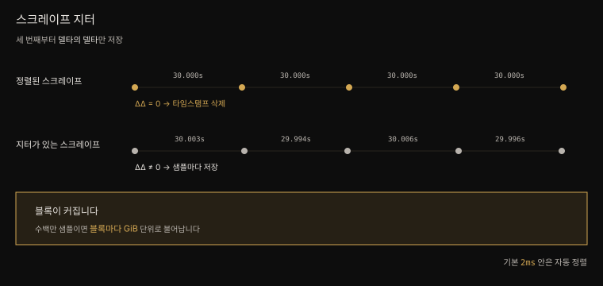

# 7-1. 최적화와 디버깅
---


## 핵심 요약

> 6장이 "카디널리티가 범인" 이라 말하고 넘겼다면, 이 장은 **범인을 찾아 잡는 법**을 다룹니다. 찾는 자리는 `/tsdb-status` 페이지이고 잡는 도구는 `metric_relabel_configs` 의 `drop` 입니다. 다시 벌어지지 않게 하는 장치는 스크레이프 잡의 **네 가지 리밋**입니다.
>
> 들어오는 데이터가 아니라 나가는 쿼리가 문제라면 **레코딩 룰**로 비싼 계산을 미리 해 둡니다. 다만 룰이 늘수록 rule manager 가 백그라운드에서 TSDB 를 계속 두드립니다. 저자는 시스템 RAM 의 4분의 1 이상을 rule manager 가 먹는 인스턴스도 봤습니다.
>
> 디스크가 이유 없이 부푼다면 **스크레이프 지터**를 의심합니다. 스크레이프 간격이 몇 밀리초씩 흔들리면 델타의 델타가 0 이 아니게 되어 샘플마다 타임스탬프를 저장해야 합니다.
>
> 그래도 원인을 모르겠으면 **pprof** 로 Go 런타임 안을 들여다보고 비싼 쿼리는 **쿼리 로그**로 잡으며 메모리는 **GOGC** 와 **GOMEMLIMIT** 로 조입니다.


## 학습 목표

> 이 절을 읽고 나면 아래 다섯 가지를 스스로 해낼 수 있습니다.

1. `/tsdb-status` 의 네 표 중 무엇을 믿고 무엇을 믿지 말아야 하는지 판단할 수 있습니다.
2. 카디널리티 범인을 PromQL 로 찾아 `metric_relabel_configs` 로 떨굴 수 있습니다.
3. 네 가지 스크레이프 리밋이 언제 평가되고 위반하면 무슨 일이 생기는지 말할 수 있습니다.
4. 레코딩 룰의 `level:metric:operations` 규약대로 이름을 지을 수 있습니다.
5. `GOGC` 와 `GOMEMLIMIT` 의 차이를 설명하고 OOM 킬러가 오는 경로를 그릴 수 있습니다.


## 본문 정리

### 카디널리티 범인 찾기

카디널리티 문제가 시계열 데이터베이스만의 것은 아닙니다. MySQL 이나 PostgreSQL 도 데이터를 고를 때 카디널리티를 따지고 큰 테이블은 흔히 파티셔닝으로 쿼리 성능을 개선합니다. Prometheus TSDB 에는 그 선택지가 없습니다. 블록 하나하나가 이미 독립된 데이터베이스라 어떤 의미로는 이미 파티셔닝된 셈이기 때문입니다. 시간이 아닌 기준으로 데이터를 나누는 데 가장 가까운 수단이 6장의 샤딩입니다.

샤드 안에서도 카디널리티는 통제해야 합니다. 시작점은 웹 UI 의 **TSDB 페이지**(`/tsdb-status`)입니다. Prometheus 2.46.0 기준으로 이 페이지는 네 가지 항목마다 상위 10개를 보여 줍니다.

| 표 | 무엇을 보여 주는가 | 얼마나 믿을 만한가 |
|----|------------------|-------------------|
| 라벨 이름별 값 개수 | 어느 라벨이 가장 많은 값을 갖는가 | **가장 중요합니다** |
| 메트릭 이름별 시계열 수 | 어느 메트릭의 카디널리티가 큰가 | 느려질 메트릭을 짚어 줍니다 |
| 메모리를 많이 쓰는 라벨 이름 | 라벨 하나가 메모리를 얼마나 먹는가 | 저자는 **카디널리티 식별에 쓰지 말라**고 합니다 |
| 라벨-값 쌍별 시계열 수 | 어느 라벨-값 조합이 흔한가 | 넷 중 **가장 쓸모없습니다** |

`__name__` 라벨은 언제나 값이 가장 많은 라벨입니다. 다른 어떤 라벨도 메트릭 개수보다 많은 값을 가질 수 없기 때문입니다. 높은 카디널리티 라벨을 볼 때는 이미 높다고 전제하고 무시하면 됩니다.

두 번째 표가 말하는 시계열 수는 같은 메트릭 이름을 공유하는 개별 시계열의 개수입니다. 이 메트릭들은 다른 메트릭보다 느립니다. 다만 높은 카디널리티는 대개 **몇몇 메트릭에 국한**되고 그것이 곧 Prometheus 전체 성능이 나빠진다는 뜻은 아닙니다. 저자의 경험상 특정 메트릭의 쿼리만 심하게 느려지고 나머지에 미치는 주된 영향은 **인스턴스 전체가 자원을 더 먹는다**는 것입니다. 저자 환경에서 1위 메트릭(`etcd_request_duration_seconds_bucket`)은 `up` 보다 약 **4배** 느리게 응답했습니다.

세 번째 표는 조심해서 읽습니다. 메모리 사용량은 값의 **개수뿐 아니라 길이**에도 좌우됩니다. 카디널리티가 200 인 라벨이, 카디널리티는 더 낮지만 값이 긴 라벨보다 메모리를 덜 쓸 수 있습니다. 그래서 저자는 이 표로 카디널리티 문제를 찾지 말라고 못 박습니다. 라벨이 유발한 높은 메모리 사용량을 짚는 데는 여전히 쓸모가 있습니다.

네 번째 표는 카디널리티와 관계가 없습니다. 쓸모없는 라벨을 찾는 데나 도움이 됩니다. 모든 시계열에 `environment="production"` 이 붙어 있다면 그것을 시계열마다 저장할 이유가 없습니다. 없애거나 인스턴스 전체의 외부 라벨로 올립니다.

### 범인을 떨구기

라벨 값이 어디서 오는지 알아내는 일이 까다롭습니다. 시계열을 손으로 뒤질 필요 없이 PromQL 로 찾습니다. 저자의 환경에서 `__name__` 다음으로 카디널리티가 높은 라벨은 `name` 이었습니다.

```promql
sort_desc(
    count by (__name__) ({name!=""})
)
```

```
kubernetes_feature_enabled{}                                       146
grafana_feature_toggles_info{}                                      70
container_processes{}                                               55
container_memory_max_usage_bytes{}                                  55
node_namespace_pod_container:container_memory_working_set_bytes{}   55
```

`kubernetes_feature_enabled` 메트릭이 `name` 라벨에서 고유한 값 146 개를 갖습니다. 이 메트릭을 남길 이유가 없다면 통째로 버립니다.

> **라벨을 떨굴 때는 조심합니다.** `metric_relabel_configs` 의 `labeldrop` 은 라벨을 줄이는 강력한 수단이지만 함부로 쓰면 안 됩니다. `metric_relabel_configs` 를 적용한 뒤에도 **모든 시계열이 여전히 고유해야** 합니다. 그러지 않으면 중복 시계열 때문에 스크레이프가 거부됩니다.

Operator 를 쓰므로 해당 잡에 대응하는 `ServiceMonitor` 에 `metricRelabelings` 를 겁니다. `kubernetes_feature_enabled` 는 `apiserver` 와 `kubelet` 잡에서 옵니다.

```yaml
kubeApiServer:
  serviceMonitor:
    metricRelabelings:
      # 기본값으로 이미 들어 있는 규칙 — 덮어쓰지 않으려고 함께 적습니다
      - action: drop
        regex: apiserver_request_duration_seconds_bucket;(0.15|0.2|0.3|...)
        sourceLabels: [__name__, le]
      - action: drop
        regex: kubernetes_feature_enabled
        sourceLabels: [__name__]
kubelet:
  serviceMonitor:
    metricRelabelings:
      - action: drop
        regex: kubernetes_feature_enabled
        sourceLabels: [__name__]
```

`apiserver_request_duration_seconds_bucket` 규칙은 차트의 **기본값**입니다. 새 규칙을 더하면서 기본값을 지우지 않으려고 함께 적었습니다. 적용한 뒤에도 head 블록에는 메트릭이 남아 있으므로 카디널리티 통계 페이지가 갱신되기까지 시간이 걸립니다. 당황할 일이 아닙니다.

### 리밋으로 애초에 막기

비교적 최근에 들어온 기능입니다. 높은 카디널리티를 사후에 떨구는 대신 **애초에 수집되지 않게** 막습니다. 덕분에 사용자에게 메트릭 전송 권한을 더 열어 주면서도 인스턴스가 무너질 걱정을 덜 수 있습니다. 네 종류입니다.

| 리밋 | 무엇을 제한하는가 |
|------|------------------|
| `sample_limit` | 스크레이프 한 번이 담을 수 있는 샘플 수 |
| `label_limit` | 샘플 하나에 붙을 수 있는 라벨의 총 개수 |
| `label_value_length_limit` | 라벨 **값**의 길이 |
| `label_name_length_limit` | 라벨 **이름**의 길이 |

전역으로도, 스크레이프 잡별로도 정의합니다.

```yaml
global:
  sample_limit: 2000
  label_limit: 20
  label_value_length_limit: 50
  label_name_length_limit: 20

scrape_configs:
  - job_name: exampleJob
    sample_limit: 10000          # 전역값을 덮어씁니다
    label_limit: 15
    label_value_length_limit: 20
    label_name_length_limit: 12
```

두 가지가 중요합니다. 첫째, **모든 리밋은 메트릭 relabeling 이 끝난 뒤 평가**됩니다. 원치 않는 시계열이나 라벨을 먼저 떨구면 리밋 계산에 잡히지 않습니다. 둘째, 리밋을 하나라도 어기면 **스크레이프 전체가 실패로 처리되고 어떤 샘플도 수집되지 않습니다**. 그래서 리밋을 켤 때는 실패한 스크레이프에 대한 알림을 반드시 함께 걸어야 합니다. 그러지 않으면 조용히 메트릭이 사라집니다.

### 레코딩 룰 — 미리 계산해 두기

긴 시간 범위에 복잡한 쿼리를 돌리면 실행 시간이 길어집니다. 그 쿼리를 Grafana 대시보드에 걸어 두었다면 사용자 경험이 나빠집니다. 레코딩 룰은 그 비싼 쿼리를 미리 계산해 둡니다. 알림 룰과 달리 **평가 결과로 새 시계열을 만들어 내며**, 알림 룰과 같은 룰 그룹 안에 함께 정의할 수 있습니다.

새 시계열을 만드니 이름이 고유해야 하고 레코딩 룰이 만든 메트릭임이 드러나야 합니다. Prometheus 가 강제하지는 않지만 콜론(`:`)을 구분자로 쓰는 관례가 잘 자리잡았습니다.

```
level:metric:operations
```

`level` 은 `metric` 을 집계한 기준 라벨이고 `operations` 는 적용한 PromQL 함수입니다. 세부 규약이 몇 가지 붙습니다.

- `level` 에 라벨이 여럿이거나 `operations` 가 여럿이면 밑줄(`_`)로 잇습니다.
- `by` 대신 `without` 으로 집계할 때는 남는 라벨을 전부 적기보다 **가장 관련 있는 것만** 적습니다.
- 연산 순서는 **최근 것이 먼저**입니다. 5분 rate 의 sum 은 `:sum_rate5m` 입니다.
- 카운터(`_total` 접미사)에 `rate` 나 `irate` 를 적용하면 이름에서 **그 접미사를 떼어 냅니다**.

kube-prometheus 가 쓰는 실제 예시입니다.

```yaml
groups:
  - name: k8s.rules
    rules:
      - record: node_namespace_pod_container:container_cpu_usage_seconds_total:sum_irate
        expr: |-
          sum by (cluster, namespace, pod, container) (
            irate(container_cpu_usage_seconds_total{job="kubelet", ...}[5m])
          ) * on (cluster, namespace, pod) group_left(node) topk by (cluster, namespace, pod) (
            1, max by(cluster, namespace, pod, node) (kube_pod_info{node!=""})
          )
```

레코딩 룰을 넉넉히 쓰면 사용자 경험이 크게 좋아집니다. 대가도 있습니다. 룰이 늘수록 **TSDB 가 백그라운드에서 끊임없이 쿼리됩니다.** 데이터 포인트가 계속 메모리로 올라오니 CPU 와 메모리 사용량이 함께 오릅니다. 저자가 본 어떤 인스턴스에서는 시스템 RAM 의 **4분의 1 이상**을 rule manager 가 레코딩 룰을 평가하는 데 쓰고 있었습니다.

> **룰 체이닝을 조심합니다.** 같은 그룹 안에서 다른 레코딩 룰의 결과에 의존하는 룰은 위험합니다. 룰 그룹 안의 룰은 **순차적으로 평가**되므로 정확하고 최신인 결과를 원한다면 평가 순서에 맞게 배치해야 합니다. 가능하면 아예 체이닝하지 않는 편이 혼란을 막습니다.

### 스크레이프 지터 — 몇 밀리초가 기가바이트로

저자가 관찰한 **과도하게 큰 TSDB 블록의 가장 흔한 원인**입니다. 3장에서 봤듯 세 번째 스크레이프부터 타임스탬프는 **델타의 델타**로 저장됩니다. 이 값이 0 이면 컴팩션이 일정한 간격으로 찍힌 샘플들에서 타임스탬프를 사실상 지워 공간을 크게 아낍니다. 샘플이 수백만 개라면 블록마다 기가바이트가 걸린 문제입니다. 델타의 델타가 일정하지 않은 상태를 스크레이프 지터라 부릅니다.



지터는 스크레이프가 일정한 간격으로 일어나지 않는다는 뜻이고 Prometheus 에서는 대개 몇 밀리초 차이입니다. **기본적으로 Prometheus 는 2ms 허용치 안의 타임스탬프를 자동으로 보정합니다.** 보정 여부는 `--scrape.adjust-timestamps` 로, 허용치는 `--scrape.timestamp-tolerance` 로 조정합니다.

Prometheus 메인테이너 Julien Pivotto 가 만든 [`oy-scrape-jitter`](https://github.com/o11ydev/oy-toolkit/releases) 가 이 일을 자동으로 해 줍니다.

```console
$ ./oy-scrape-jitter --prometheus.url=http://localhost:9090 --log.results-only
level=info aligned_targets=2 unaligned_targets=22 max_ms=30
```

`--scrape.timestamp-tolerance` 는 **스크레이프 주기의 1% 를 넘을 수 없습니다.** 기본 주기가 30초이니 최대 300ms 까지입니다. 저자의 최대 어긋남이 30ms 였으므로 거기서 시작합니다.

```yaml
prometheus:
  prometheusSpec:
    additionalArgs:
      - name: "scrape.timestamp-tolerance"
        value: "30ms"
```

```console
$ ./oy-scrape-jitter --prometheus.url=http://localhost:9090 --log.results-only
level=info aligned_targets=23 unaligned_targets=1 max_ms=34
```

모든 스크레이프를 완벽히 정렬하려 애쓸 필요는 없습니다. 자원 경합 때문에 조금 늦게 시작되는 스크레이프는 늘 있기 마련이고 그래도 괜찮습니다. 대다수가 정렬돼 있으면 신경 쓰지 않아도 됩니다. 다만 **디스크가 차오르기 시작하면** 한 번 확인해 볼 값어치가 있습니다.

### pprof 로 Go 런타임 들여다보기

"내 메모리 사용량을 만드는 것이 코드의 어느 부분인가" 를 묻고 싶을 때가 옵니다. Prometheus 는 Go 로 쓰였으므로 Go 의 pprof 를 그대로 씁니다. `/debug/pprof` 경로로 엔드포인트가 노출됩니다.

브라우저로도 볼 수 있지만 `go` 명령과 함께 쓰는 편이 낫습니다.

```console
$ go tool pprof http://localhost:9090/debug/pprof/heap
Type: inuse_space
Entering interactive mode (type "help" for commands, "o" for options)
(pprof) top
Showing nodes accounting for 82.47MB, 67.76% of 121.71MB total
Dropped 137 nodes (cum <= 0.61MB)
Showing top 10 nodes out of 123
      flat  flat%   sum%        cum   cum%
   17.01MB 13.98% 13.98%    17.01MB 13.98%  github.com/prometheus/prometheus/model/...
   11.44MB  9.40% 23.37%    11.44MB  9.40%  github.com/prometheus/prometheus/scrape...
```

예상대로 메모리를 가장 많이 쓰는 쪽은 시계열의 라벨을 추적하는 부분입니다. 호출 스택을 그림으로 보고 싶으면 `web` 명령을 쓰되 [Graphviz](https://www.graphviz.org/download/) 를 먼저 설치해야 합니다.

여기에 함정이 하나 있습니다. pprof 의 heap 엔드포인트는 **힙 메모리만** 셉니다. 힙은 오래 사는 메모리이고 스택은 함수 범위에 묶인 짧은 메모리입니다. pprof 가 보고하는 메모리가 Prometheus 의 실제 전체 메모리 사용량과 100% 일치하리라 기대하면 안 됩니다.

Go 개발자가 아니어도 됩니다. Prometheus 와 함께 배포되는 `promtool` 이 pprof 데이터를 파일로 떠 줍니다.

```console
$ promtool debug pprof http://localhost:9090
collecting: .../debug/pprof/threadcreate
collecting: .../debug/pprof/profile?seconds=30
collecting: .../debug/pprof/block
collecting: .../debug/pprof/goroutine
collecting: .../debug/pprof/heap
collecting: .../debug/pprof/mutex
collecting: .../debug/pprof/trace?seconds=30
Compiling debug information complete, all files written in "debug.tar.gz".
```

`promtool debug all` 은 여기에 Prometheus 자신의 메트릭까지 함께 담습니다.

> **관행 하나** — 저자의 팀은 원인 모를 성능 문제로 Prometheus 를 재시작해야 할 때, **재시작 전에 `promtool debug all` 을 돌리는 것**을 표준 절차로 삼았습니다. 나중에 근본 원인을 짚을 데이터를 남기기 위해서입니다.

### 쿼리 로깅과 쿼리 리밋

비싼 쿼리나 지나치게 많은 쿼리가 문제일 때가 있습니다. Prometheus 는 완료된 쿼리를 기록하고 실행 중인 쿼리 목록을 유지하며 지나치게 넓은 쿼리를 막는 수단을 모두 내장하고 있습니다.

```yaml
global:
  query_log_file: /var/log/prometheus/my_prometheus_queries.log
```

로그는 JSON 이라 `jq` 로 다루기 좋습니다. 각 줄에는 쿼리 문자열과 타임스탬프뿐 아니라 `evalTotalTime`·`queryPreparationTime`·`execQueueTime` 같은 **구간별 소요 시간**과 `totalQueryableSamples`·`peakSamples` 같은 **샘플 통계**가 담깁니다. 알림 룰에서 나온 쿼리라면 어느 룰 파일에서 왔는지도 `ruleGroup` 에 적힙니다.

이 로그에는 **끝난 쿼리만** 남습니다. 지금 돌고 있는 쿼리는 TSDB 데이터 디렉토리의 **`queries.active`** 파일이 따로 관리합니다. 설정하지 않아도 자동으로 만들어지고 관리됩니다. Prometheus 가 재시작하면 이 파일은 비워지지만 종료 시점에 어떤 쿼리가 아직 돌고 있었는지 로그로 남겨 줍니다.

로그는 사후 대응입니다. 애초에 막으려면 시작 플래그 둘을 씁니다.

| 플래그 | 무엇을 제한하는가 | 기본값 |
|--------|------------------|--------|
| `--query.max-concurrency` | 동시에 실행할 수 있는 쿼리 수 | `20` |
| `--query.max-samples` | 쿼리 하나가 메모리로 끌어올 수 있는 샘플 수 | `50000000` |

기본값 20 은 큰 환경에서는 꽤 낮습니다. `--query.max-samples` 가 세는 것은 **반환되는 샘플이 아니라 쿼리를 처리하려고 적재해야 하는 샘플**입니다. 30초 주기로 수집한 메트릭에 5분 `rate()` 를 거는 순간 쿼리는 데이터 포인트를 하나만 돌려주지만 메모리에는 샘플 10개가 올라옵니다.

### 가비지 컬렉션 조이기

Go 의 GC 는 Java 처럼 손잡이가 끝없이 많지 않습니다. 사실상 둘뿐입니다. **`GOGC`** 와 **`GOMEMLIMIT`** 환경 변수입니다.

Go 1.19 이전까지는 `GOGC` 가 유일한 수단이었습니다. 직전 GC 이후 **살아 있는 힙이 몇 퍼센트까지 늘어나면** GC 가 돌지를 정합니다. 기본값 **100** 은 직전 수집 후 남은 라이브 데이터로부터 힙이 두 배로 늘 수 있다는 뜻입니다. 라이브 힙이 20 MiB 면 목표는 40 MiB 이고 30 MiB 로 늘면 목표는 60 MiB 가 됩니다. `GOGC` 를 50 으로 낮추면 절반만 늘어납니다. 20 MiB → 30 MiB, 30 MiB → 45 MiB 입니다.

공짜는 없습니다. `GOGC` 를 낮추면 **메모리를 아끼는 대신 CPU 를 더 씁니다.** 저자의 경험상 메모리가 더 귀한 자원이고 Prometheus 는 CPU 보다 메모리를 탐내므로 괜찮은 거래입니다. head 블록의 활성 시계열이 수백만 개를 넘는 인스턴스라면 `GOGC` 를 낮추길 권하며 **50 이 시작점으로 무난**합니다.

`GOMEMLIMIT` 은 Go 1.19 에서 들어왔고 `GOGC` 를 대체하지 않습니다. 함께 씁니다. Go 프로그램이 안전하게 쓸 수 있는 메모리의 **소프트 리밋**을 둡니다. `GOGC` 가 언제나 상대적이라 목표가 움직이는 값이라면 `GOMEMLIMIT` 은 고정입니다. 메모리가 그 한계에 가까워질수록 Go 는 GC 를 더 공격적으로 돌립니다.

왜 필요한지는 산수로 드러납니다. `GOGC=100` 이고 `GOMEMLIMIT` 이 없는 상태에서 시스템 메모리의 **50% 를 넘겨 쓰면**, 다음 GC 목표가 시스템 전체 메모리를 초과합니다. 두 배가 다음 목표이기 때문입니다. 그러면 마크 단계가 영영 오지 않습니다. 저자는 WAL 컴팩션으로 메모리가 잠깐 치솟은 순간에 누군가 비싼 쿼리를 돌려 OOM 킬러에 맞은 사례를 봤습니다.

값은 환경마다 다르지만 **Prometheus 가 실제로 쓸 수 있는 전체 메모리의 90% 정도**에서 시작하길 권합니다. 32 GiB 서버라면 28 GiB 입니다. 소프트 리밋이므로 실제 사용량은 이 값을 넘을 수 있습니다.


## 심화 학습

**라벨 길이 리밋은 글자 수가 아니라 바이트 수입니다.** 본문은 `label_value_length_limit` 와 `label_name_length_limit` 을 "공백을 포함한 **문자 수**" 기준이라고 적습니다. 공식 문서는 다르게 적습니다. "Limit on the length (**in bytes**) of each individual label value… Note that label values are UTF-8 encoded, and **characters can take up to 4 bytes**." 한글은 UTF-8 에서 글자당 3 바이트이므로 `label_value_length_limit: 50` 은 한글 라벨 값 기준으로 **16 글자 남짓**입니다. 한글이나 이모지가 라벨 값에 들어가는 환경이라면 이 차이가 그대로 사고가 됩니다. 문서는 네 리밋 모두 기본값이 `0`(제한 없음)이라는 사실도 함께 적습니다. ([Configuration — scrape_config](https://prometheus.io/docs/prometheus/latest/configuration/configuration/#scrape_config))

**본문이 든 레코딩 룰 예시는 본문이 방금 말한 규약을 어깁니다.** 규약은 "카운터(`_total`)에 `rate`·`irate` 를 적용하면 접미사를 떼라" 인데, 바로 뒤에 나오는 kube-prometheus 의 실제 룰 이름은 `node_namespace_pod_container:container_cpu_usage_seconds_total:sum_irate` 로 `_total` 을 그대로 답니다. 확인해 보면 **업스트림 kube-prometheus 가 정말 그렇게 이름 짓습니다**. 규약을 어긴 쪽은 저자가 아니라 kube-prometheus 이고 공식 문서 역시 저자와 같은 규약을 적습니다. "`metric` is the metric name and should be unchanged other than **stripping `_total` off counters** when using `rate()` or `irate()`." 규약대로라면 `node_namespace_pod_container:container_cpu_usage_seconds:sum_irate` 여야 합니다. 널리 쓰이는 룰이라 이제 와 고치기 어려울 뿐이니, 규약은 규약대로 새 룰에 적용하면 됩니다.

같은 문서가 본문이 빠뜨린 규약 하나를 더 줍니다. **다른 연산이 있으면 `_sum` 은 생략**합니다. ([Recording rules — Naming](https://prometheus.io/docs/practices/rules/))

**본문이 권하는 지터 플래그는 업스트림에서 실험적이고 제거 예정입니다.** `--scrape.adjust-timestamps` 와 `--scrape.timestamp-tolerance` 는 Prometheus 소스에서 둘 다 `Hidden()` 으로 감춰져 있고 설명에 이렇게 적혀 있습니다. "Experimental. **This flag will be removed in a future release.**" 기본값이 `2ms` 라는 본문의 서술은 소스와 일치합니다(`ScrapeTimestampTolerance = 2 * time.Millisecond`). 튜닝하기 전에 이 플래그가 언젠가 사라진다는 사실을 알아 두는 편이 낫습니다.

**"1% 를 넘을 수 없다" 는 서술도 소스에서 확인됩니다.** 스크레이프 루프는 허용치를 이렇게 자릅니다.

```go
// Tolerance is clamped to maximum 1% of the scrape interval.
tolerance := min(sl.interval/100, ScrapeTimestampTolerance)
```

플래그에 300ms 보다 큰 값을 넣어도 30초 주기에서는 조용히 300ms 로 깎입니다. 오류가 나지 않으므로 설정한 값이 적용됐다고 착각하기 쉽습니다.

**튜닝 후 `max_ms` 가 30 에서 34 로 오른 것은 모순이 아닙니다.** 정렬된 타깃이 2 개에서 23 개로 늘고 어긋난 타깃은 1 개만 남았습니다. 남은 그 하나의 어긋남이 34ms 라서 허용치 30ms 로는 여전히 못 잡습니다. `max_ms` 는 정렬 실패의 최대치이지 전체의 평균이 아닙니다.

**`--query.max-samples` 의 기본값 설명이 문서에서 한 줄 더 나갑니다.** 본문은 "반환되는 샘플 수가 아니라 적재해야 하는 샘플 수" 라고만 적습니다. CLI 문서는 여기에 "queries will fail if they try to load more samples than this into memory, **so this also limits the number of samples a query can return**" 을 덧붙입니다. 적재량이 상한이므로 반환량도 자연히 그 아래로 묶인다는 뜻입니다.


## 결정 치트시트

> 증상별로 어느 도구를 집을지 고르는 표입니다.

| 증상 | 도구 | 주의 |
|------|------|------|
| 특정 메트릭 쿼리만 느리다 | `/tsdb-status` 첫째 표 → `sort_desc(count by (__name__) (...))` | 셋째·넷째 표는 카디널리티 진단에 쓰지 않습니다 |
| 필요 없는 메트릭이 크다 | `metric_relabel_configs` 의 `drop` | head 블록이 비워질 때까지 통계는 그대로입니다 |
| 라벨만 떼고 싶다 | `labeldrop` | 떼고 나서도 모든 시계열이 고유해야 합니다 |
| 앞으로 터지지 않게 막고 싶다 | `sample_limit` 등 네 리밋 | 위반하면 **스크레이프 전체가 실패** → 실패 알림 필수 |
| 대시보드 쿼리가 느리다 | 레코딩 룰 | 룰이 늘면 rule manager 가 RAM 을 먹습니다 |
| 디스크가 이유 없이 찬다 | `oy-scrape-jitter` → `--scrape.timestamp-tolerance` | 허용치는 주기의 1% 까지 · 플래그는 제거 예정 |
| 메모리·CPU 의 출처를 모르겠다 | `go tool pprof` · `promtool debug all` | heap 엔드포인트는 힙만 셉니다 |
| 누가 비싼 쿼리를 돌리는지 모르겠다 | `query_log_file` · `queries.active` | 로그에는 **끝난** 쿼리만 남습니다 |
| 쿼리가 인스턴스를 짓누른다 | `--query.max-concurrency` · `--query.max-samples` | 기본 20 은 큰 환경에서 낮습니다 |
| OOM 킬러에 맞는다 | `GOMEMLIMIT` ≈ 가용 메모리의 90% | 소프트 리밋이라 넘길 수 있습니다 |
| 메모리를 CPU 와 바꾸고 싶다 | `GOGC=50` | 활성 시계열 수백만 개 이상일 때 |


## Spring 앱 개발 관점

**Spring 앱은 카디널리티 폭발의 단골 출처입니다.** 6장에서 본 `uri` 태그가 경로 템플릿이 아니라 실제 경로로 들어오는 사고가 대표적입니다. 이 장의 진단법을 그대로 적용하면 범인이 바로 드러납니다.

```promql
sort_desc(
    count by (__name__) ({uri!=""})
)
```

**Operator 를 쓴다면 리밋을 `ServiceMonitor` 단위로 겁니다.** Prometheus Operator 의 `ServiceMonitor` 는 `sampleLimit`·`labelLimit`·`labelValueLengthLimit`·`labelNameLengthLimit` 필드를 모두 갖습니다. 팀이 각자 `ServiceMonitor` 를 들고 오는 조직이라면 이 네 필드가 방어선입니다.

```yaml
apiVersion: monitoring.coreos.com/v1
kind: ServiceMonitor
metadata:
  name: order-api
spec:
  sampleLimit: 5000
  labelLimit: 20
  labelValueLengthLimit: 100
  endpoints:
    - port: http
      path: /actuator/prometheus
```

여기에 함정이 붙습니다. 리밋을 어기면 그 스크레이프 **전체**가 실패합니다. `uri` 태그 하나가 폭주하면 그 앱의 **모든** 메트릭이 사라지지, 나쁜 시계열만 골라 버려지지 않습니다. 그래서 `up == 0` 알림이 리밋과 한 몸이어야 합니다. 예방은 애플리케이션 쪽에서 `MeterFilter.maximumAllowableTags` 로 하고 리밋은 최후의 방어선으로 둡니다.

**레코딩 룰의 이름 규약을 Spring 메트릭에 적용해 봅니다.** `http_server_requests_seconds_count` 는 `_total` 이 아니라 `_count` 로 끝나므로 떼어 낼 접미사가 없습니다. 서비스와 상태로 집계한 5분 rate 라면 이렇게 됩니다.

```yaml
- record: service_status:http_server_requests:rate5m
  expr: sum by (service, status) (rate(http_server_requests_seconds_count[5m]))
```

`level` 이 둘(`service`·`status`)이라 밑줄로 이었고 연산은 하나이므로 `:rate5m` 입니다.

**GC 두 손잡이는 JVM 을 아는 사람에게 오히려 낯섭니다.** `GOGC` 는 힙 크기의 **증가 비율**로 GC 시점을 정하는 값이라 JVM 의 고정 힙 상한과 성격이 다릅니다. 가장 헷갈리는 지점은 `GOMEMLIMIT` 이 **소프트 리밋**이라는 사실입니다. JVM 의 `-Xmx` 는 하드 상한이라 넘으면 `OutOfMemoryError` 를 던지지만 `GOMEMLIMIT` 을 넘긴 Go 프로세스는 예외를 던지지 않고 GC 를 더 공격적으로 돌릴 뿐입니다. 그러고도 못 줄이면 그때는 애플리케이션이 아니라 **커널의 OOM 킬러**가 프로세스를 정리합니다. 컨테이너 메모리 한계를 `-XX:MaxRAMPercentage` 로 맞추듯 `GOMEMLIMIT` 을 가용 메모리의 90% 로 두는 이유가 여기 있습니다. 상한에 닿기 전에 GC 가 먼저 일하게 만들려는 조치입니다.


## 면접 대비

**Q. Prometheus 에서 카디널리티 문제를 어떻게 찾습니까?**
웹 UI 의 `/tsdb-status` 페이지에서 시작합니다. 네 표 중 "라벨 이름별 값 개수" 가 가장 중요합니다. `__name__` 은 언제나 1위이므로 무시합니다. 범인 라벨을 찾았으면 `sort_desc(count by (__name__) ({그_라벨!=""}))` 로 어느 메트릭이 그 라벨을 많이 만드는지 좁힙니다.

**Q. "메모리를 많이 쓰는 라벨" 표로 카디널리티를 진단하면 안 되는 이유는 무엇입니까?**
그 표는 값의 개수뿐 아니라 값의 **길이**에도 좌우되기 때문입니다. 카디널리티 200 인 라벨이 카디널리티는 낮지만 값이 긴 라벨보다 메모리를 덜 쓸 수 있습니다. 메모리 사용량을 볼 때는 유용하지만 카디널리티의 대리 지표로는 부적절합니다.

**Q. 스크레이프 리밋은 언제 평가됩니까?**
메트릭 relabeling 이 모두 끝난 뒤입니다. 그래서 원치 않는 시계열을 먼저 `drop` 하면 리밋에 잡히지 않습니다. 리밋을 하나라도 어기면 그 스크레이프 전체가 실패로 처리되고 어떤 샘플도 저장되지 않으므로, 리밋을 켤 때는 실패한 스크레이프 알림을 함께 걸어야 합니다.

**Q. 레코딩 룰 이름 `level:metric:operations` 를 설명해 보십시오.**
`level` 은 집계 기준 라벨, `metric` 은 원본 메트릭 이름, `operations` 는 적용한 연산입니다. 연산은 최근 것을 먼저 적고 여럿이면 밑줄로 잇습니다. 카운터에 `rate`·`irate` 를 적용할 때는 `_total` 접미사를 뗍니다. 5분 rate 의 sum 이면 `:sum_rate5m` 입니다.

**Q. 레코딩 룰을 많이 만들면 무엇이 나빠집니까?**
rule manager 가 백그라운드에서 TSDB 를 계속 쿼리하므로 CPU 와 메모리가 함께 오릅니다. 저자는 시스템 RAM 의 4분의 1 이상을 rule manager 가 쓰는 인스턴스를 봤습니다. 또 같은 그룹 안의 룰은 순차 평가되므로 룰끼리 체이닝하면 순서에 따라 낡은 값을 참조할 수 있습니다.

**Q. 스크레이프 지터가 왜 디스크를 먹습니까?**
TSDB 는 세 번째 샘플부터 타임스탬프를 델타의 델타로 저장합니다. 간격이 일정하면 이 값이 0 이라 컴팩션이 타임스탬프를 사실상 지웁니다. 간격이 몇 밀리초씩 흔들리면 델타의 델타가 0 이 아니게 되어 샘플마다 타임스탬프를 저장해야 하고 샘플이 수백만 개면 블록마다 기가바이트 차이가 납니다.

**Q. `--query.max-samples` 는 무엇을 세는 값입니까?**
쿼리가 반환하는 샘플이 아니라 **처리하려고 메모리로 적재하는** 샘플입니다. 30초 주기 메트릭에 5분 `rate()` 를 걸면 반환값은 하나지만 샘플 10개가 올라옵니다. 기본값은 5천만입니다.

**Q. `GOGC` 와 `GOMEMLIMIT` 의 차이는 무엇입니까?**
`GOGC` 는 직전 GC 이후 라이브 힙이 몇 퍼센트 늘면 GC 를 돌릴지 정하는 **상대값**이라 목표가 계속 움직입니다. 기본 100 은 힙이 두 배가 될 때 GC 가 돈다는 뜻입니다. `GOMEMLIMIT` 은 **고정된 소프트 리밋**이고 메모리가 거기 가까워질수록 GC 가 공격적이 됩니다. 둘은 함께 씁니다. `GOMEMLIMIT` 없이 `GOGC=100` 으로 시스템 메모리의 절반을 넘겨 쓰면 다음 GC 목표가 전체 메모리를 넘어서서 OOM 킬러를 만납니다.


## 핵심 개념 체크리스트

- [ ] `/tsdb-status` 의 네 표를 나열하고 신뢰도 순으로 정렬할 수 있는가?
- [ ] `__name__` 이 항상 값이 가장 많은 라벨인 이유를 아는가?
- [ ] 높은 카디널리티가 인스턴스 전체에 미치는 주된 영향이 무엇인지 아는가?
- [ ] "메모리를 많이 쓰는 라벨" 표를 카디널리티 진단에 쓰면 안 되는 이유를 아는가?
- [ ] `labeldrop` 이후 시계열 고유성이 깨지면 무슨 일이 생기는지 아는가?
- [ ] 네 가지 스크레이프 리밋의 이름과 대상을 말할 수 있는가?
- [ ] 리밋이 relabeling 전후 어느 쪽에서 평가되는지 아는가?
- [ ] 리밋 위반의 결과가 부분 손실이 아니라 스크레이프 전체 실패임을 아는가?
- [ ] `level:metric:operations` 규약과 `_total` 처리 규칙을 아는가?
- [ ] 룰 그룹 안의 룰이 순차 평가된다는 사실과 그 함의를 아는가?
- [ ] 델타의 델타가 0 일 때 컴팩션이 무엇을 생략하는지 설명할 수 있는가?
- [ ] 기본 타임스탬프 허용치와 그 상한(주기의 1%)을 아는가?
- [ ] pprof 의 heap 엔드포인트가 무엇을 세지 않는지 아는가?
- [ ] `promtool debug all` 을 언제 돌려야 하는지 아는가?
- [ ] 쿼리 로그와 `queries.active` 의 차이를 아는가?
- [ ] `--query.max-samples` 가 적재량을 세는 값임을 아는가?
- [ ] `GOGC` 기본값과 그 의미를 말할 수 있는가?
- [ ] `GOMEMLIMIT` 이 소프트 리밋이라는 사실과 그 결과를 아는가?


## 참고 자료

- 원본: *Mastering Prometheus* (Packt, ISBN 9781805125662) 7장 — Optimizing and Debugging Prometheus. 2장의 환경과 `kubectl`·`helm`·`go` 가 필요하고 예제 코드는 [PacktPublishing/Mastering-Prometheus](https://github.com/PacktPublishing/Mastering-Prometheus) 에 있습니다.
- 본문이 안내하는 링크 — [Scrape Jitter (o11y.tools)](https://o11y.tools/oy-scrape-jitter/) · [runtime/pprof](https://pkg.go.dev/runtime/pprof) · [Profiling Go with pprof (Julia Evans)](https://jvns.ca/blog/2017/09/24/profiling-go-with-pprof/) · [Analysing Prometheus memory usage (Robust Perception)](https://www.robustperception.io/analysing-prometheus-memory-usage/) · [A Guide to the Go Garbage Collector](https://go.dev/doc/gc-guide)
- [Configuration — 스크레이프 리밋·`query_log_file`](https://prometheus.io/docs/prometheus/latest/configuration/configuration/) · [Recording rules — Naming](https://prometheus.io/docs/practices/rules/) · [Prometheus CLI 플래그](https://prometheus.io/docs/prometheus/latest/command-line/prometheus/)
- 관련 노트: [README (책 MOC)](README.md) · [03-01. 데이터 모델과 TSDB](03-01.데이터%20모델과%20TSDB.md) · [06-01. 샤딩·페더레이션·고가용성](06-01.샤딩·페더레이션·고가용성.md) · [04-01. 서비스 디스커버리와 relabeling](04-01.서비스%20디스커버리와%20relabeling.md)
