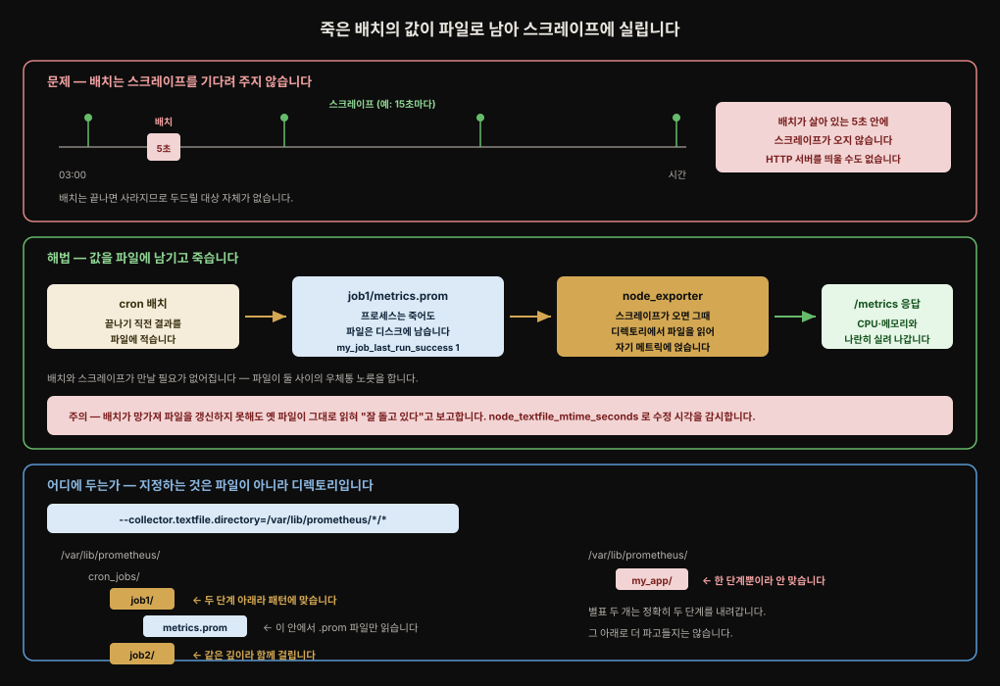

# Node Exporter — exporter 의 해부와 collector

---

> Prometheus 를 남다르게 만드는 것은 Prometheus 자체가 아니라 그 둘레의 생태계이고 그 생태계의 대부분은 exporter 입니다. 8장은 그중 가장 널리 쓰이는 Node Exporter 를 뜯어 봅니다. exporter 가 무엇으로 이뤄지는지 Go 코드 스무 줄로 확인한 다음, 기본으로 켜진 수십 개의 collector 중 실무에서 손이 가는 것들을 훑고 textfile collector 와 트러블슈팅으로 마무리합니다.


## 핵심 요약

> exporter 는 메트릭 정의·collector·레지스트리 세 부품으로 이뤄집니다. Node Exporter 가 다른 exporter 와 다른 점은 이 collector 를 수십 개 거느린다는 것이고 각 collector 가 자기 고루틴에서 도는 덕에 개수가 스크레이프 속도를 좌우하지 않습니다. `/proc` 에 있으면 Node Exporter 가 가져올 수 있습니다. loadavg 는 리눅스 커널 소스조차 "실없는 숫자"라 부르니 PSI 기반 pressure collector 로 갈아타는 편이 낫고 단명 프로세스는 textfile collector 로 거둡니다. 스크레이프가 느려지면 `node_scrape_collector_duration_seconds` 로 범인 collector 를 한 번에 짚습니다.

이 편은 [`02-01`](./02-01.Prometheus%20배포%20—%20스택%20구성요소와%20Operator.md) 이 스택 구성요소를 훑으며 짧게 언급한 Node Exporter 와 textfile collector 를 그 안쪽까지 파고듭니다. textfile collector 냐 Pushgateway 냐 하는 선택 기준은 02-01 에서 이미 근거까지 채워 뒀으므로 여기서 되풀이하지 않고 대신 textfile collector 를 *실제로 동작시킬 때* 걸려 넘어지는 지점을 봅니다.


## 학습 목표

> 이 절을 읽고 나면 아래 여섯 가지를 스스로 해낼 수 있습니다.

1. exporter 를 이루는 세 부품을 말하고 Go 로 최소 exporter 를 한 벌 쓸 수 있습니다.
2. collector 가 많아도 스크레이프가 느려지지 않는 이유를 고루틴 관점에서 설명할 수 있습니다.
3. `node_cpu_seconds_total` 로 CPU 사용률을 구하고 코어 수로 정규화하는 recording rule 이 왜 `mode="idle"` 을 필요로 하는지 압니다.
4. loadavg 대신 PSI(pressure) 를 권하는 근거를 대고 CPU 에 stalled 범주가 없는 이유를 압니다.
5. textfile collector 의 glob 이 무엇에 맞춰지는지 알고 조용한 실패를 `node_textfile_mtime_seconds` 로 막을 수 있습니다.
6. `node_scrape_collector_success` 와 `node_scrape_collector_duration_seconds` 를 트러블슈팅에 나눠 씁니다.


## 본문 정리

### 1. exporter 란 무엇인가

Prometheus 에서 **exporter** 는 스스로 Prometheus 메트릭을 내지 않는 어떤 데이터 소스로부터 메트릭을 뽑아내기 위해 독립적으로 도는 응용 프로그램을 가리킵니다. MySQL 부터 Minecraft 까지 상상할 수 있는 거의 모든 것에 exporter 가 있고 전부는 아니지만 상당수 목록이 [공식 문서](https://prometheus.io/docs/instrumenting/exporters/) 에 있습니다.

Node Exporter 는 Prometheus 프로젝트가 직접 관리하는 몇 안 되는 exporter 중 하나입니다. Blackbox Exporter 와 SNMP Exporter 가 같은 부류입니다. 하는 일은 CPU·디스크·메모리·네트워킹 같은 머신 수준 자원의 메트릭을 노출하는 일입니다. 저자는 시스템 수준 메트릭이 있느냐는 질문에 이렇게 답한다고 적습니다.

> `/proc` 에 있으면 Node Exporter 가 가져올 수 있습니다.

리눅스의 `/proc` 은 커널 내부 자료구조로 통하는 인터페이스 역할을 하는 유사 파일시스템입니다. 시스템 정보를 얻고 런타임에 커널 파라미터를 바꾸는(`sysctl`) 데 씁니다. Node Exporter 는 주로 이 `/proc` 에서 데이터를 긷습니다. `/sys/class/hwmon` 을 읽는 hwmon collector 처럼 예외가 몇 있지만 대부분의 collector 는 [procfs 라이브러리](https://github.com/prometheus/procfs) 를 거쳐 `/proc` 의 내용을 Prometheus 메트릭으로 옮깁니다.

> ⚠️ Node Exporter 는 \*NIX 커널 계열(리눅스·FreeBSD·macOS 등) 에서만 쓸모가 있습니다. 윈도우에는 비슷하되 별개인 [windows_exporter](https://github.com/prometheus-community/windows_exporter) 가 있습니다.

### 2. exporter 의 세 부품

모든 exporter 는 하나 이상의 **메트릭 정의**, **collector**, **메트릭 레지스트리** 로 이뤄집니다. 레지스트리는 모든 메트릭과 그 값을 추적하는 장부입니다. 메트릭은 코드에서 정의되어 레지스트리에 등록되고 Prometheus 가 메트릭을 내주는 HTTP 엔드포인트를 두드리면 그때 collector 가 깨어나 가장 최신 값을 모아 돌려줍니다.

```go
package main

import (
    "log"
    "net/http"
    "github.com/prometheus/client_golang/prometheus"
    "github.com/prometheus/client_golang/prometheus/promhttp"
)

var myMetric = prometheus.NewDesc("exporter_success", "Reflects if the exporter is ...", nil, nil)

type myCollector struct{}

func (c myCollector) Describe(ch chan<- *prometheus.Desc) {
    ch <- myMetric
}

func (c myCollector) Collect(ch chan<- prometheus.Metric) {
    ch <- prometheus.MustNewConstMetric(myMetric, prometheus.GaugeValue, 1.0)
}

func main() {
    prometheus.MustRegister(&myCollector{})
    http.Handle("/metrics", promhttp.Handler())
    log.Fatal(http.ListenAndServe(":9999", nil))
}
```

`main()` 부터 따라가면 이렇습니다. 먼저 collector 를 레지스트리에 등록합니다. 등록되는 순간 collector 의 `Describe()` 가 내부적으로 불려, 어떤 메트릭이 레지스트리에 추가되는지 알립니다. 이 시점에 `exporter_success` 에는 **아직 값이 없습니다.** 나중에 값을 넣겠다고 예고했을 뿐입니다.

다음으로 `/metrics` 경로에 HTTP 핸들러를 답니다. `promhttp.Handler()` 를 핸들러로 두면 그 URL 이 두드려질 때 등록된 모든 collector 의 `Collect()` 가 돕니다. `prometheus.Collector` 인터페이스를 만족시키는 데 필요한 것은 `Collect()` 와 `Describe()` 두 메서드뿐이고 대부분의 exporter 는 collector 를 하나만 둡니다.

마지막으로 9999 번 포트에서 HTTP 서버를 띄웁니다. `http://localhost:9999/metrics` 를 열면 `exporter_success` 와 함께 promhttp 가 덤으로 붙여 주는 Go 런타임 통계와 exporter 자신에 관한 기본 HTTP 통계가 보입니다.

Node Exporter 가 여느 exporter 와 갈리는 지점이 바로 여기입니다. collector 를 하나가 아니라 수십 개 기본으로 돌리고 켤 수 있는 것은 더 많습니다.

> **collector 가 많으면 느려지지 않습니까**
> 그렇지 않습니다. Node Exporter 는 collector 마다 별도의 고루틴을 띄우기 때문에 개수가 스크레이프 응답 속도에 미치는 영향이 미미합니다. 속도를 높이려고 collector 수를 줄일 이유는 없습니다. 다만 이는 Node Exporter 에 국한된 이야기이고 다른 exporter 가 고루틴을 이렇게 쓴다는 보장은 없습니다.

### 3. 눈여겨볼 기본 collector

기본으로 켜지는 collector 는 수십 개이고 상당수는 `dmi` 처럼 지엽적이거나 `xfs`·`zfs` 처럼 인프라에 달려 있습니다. 손이 자주 가는 것만 봅니다.

#### conntrack

리눅스 커널 netfilter 의 연결 추적 서브시스템에 관한 메트릭입니다. 서버로 맺어진 연결을 추적하며 이 테이블이 가득 차면 장애가 됩니다.

| 메트릭 | 설명 |
|--------|------|
| `node_nf_conntrack_entries` | 연결 추적 테이블의 현재 항목 수 |
| `node_nf_conntrack_entries_limit` | 허용된 최대 항목 수 |

두 값의 비율을 보는 것이 요령입니다. 한쪽만 봐서는 위험한지 알 수 없습니다.

#### cpu

CPU 를 얼마나 쓰는지 볼 때 쓰는 주력 collector 입니다. `top` 같은 명령이 백분율로 보여 주는 것과 달리, CPU 사용은 **각 CPU 모드에서 보낸 초** 로 추적됩니다. 그래서 백분율을 원하면 PromQL 로 비유휴(non-idle) 시간을 직접 계산해야 합니다.

```promql
sum without (cpu, mode) (rate(node_cpu_seconds_total{mode!="idle"}[5m]))
```

`cpu` 와 `mode` 라벨을 걷어내 모든 비유휴 시간을 합쳤습니다. 결과는 전체 CPU 에 걸친 비유휴 시간의 비율입니다. CPU 가 하나면 최댓값이 `1.0`, 둘이면 `2.0` 으로 코어 수만큼 커집니다. 현실 시간 1초 동안 CPU 하나가 1초어치 일을 해낼 수 있기 때문입니다.

그러면 0~100% 로 정규화하려면 어떻게 할까요. 저자는 서버의 코어 수를 세는 recording rule 을 두고 그것으로 나누기를 권합니다.

```promql
count without (cpu, mode) (node_cpu_seconds_total{mode="idle"})
```

> 여기서 `mode="idle"` 은 취향이 아니라 **필수** 입니다. `node_cpu_seconds_total` 은 `(코어 × 모드)` 만큼의 시계열을 갖습니다. 아무 모드나 하나로 고정해야 코어당 시계열이 정확히 하나 남아 `count` 가 코어 수가 됩니다. 필터를 빼면 `코어 수 × 모드 수` 가 나옵니다. `idle` 은 어느 커널에나 반드시 존재하기 때문에 고정 값으로 고르기에 안전합니다.

#### diskstats 와 filesystem

`diskstats` 는 서버에 붙은 저장 장치의 통계를 냅니다. 디스크 I/O 나 디스크 위 파일시스템 종류 같은 것으로, 워크로드가 읽기 위주인지 쓰기 위주인지 가릴 때 씁니다.

| 메트릭 | 설명 |
|--------|------|
| `node_disk_io_time_seconds_total` | 부팅 이래 I/O 에 쓴 시간(카운터). `rate` 와 엮으면 초당 I/O 시간 비율 |
| `node_disk_read_bytes_total` | 부팅 이래 디스크에서 읽은 바이트 수. `rate` 로 초당 읽기 속도 |
| `node_disk_written_bytes_total` | 위와 같되 쓰기 |

`filesystem` 은 `diskstats` 의 짝입니다. `diskstats` 가 물리(혹은 가상) 디스크를 본다면, `filesystem` 은 그 디스크 위에 얹힌 파일시스템을 봅니다.

| 메트릭 | 설명 |
|--------|------|
| `node_filesystem_size_bytes` | 파일시스템에 할당된 크기 |
| `node_filesystem_free_bytes` | 남은 공간. `size` 에서 빼면 사용량 |

#### loadavg — 쓰지 마십시오

1분·5분·15분 부하 평균을 냅니다. `uptime` 같은 명령이 뱉는 그 숫자입니다. 저자가 이 collector 를 언급하는 이유는 **감시에 쓰지 말라고 빌기 위해서** 입니다. 리눅스 커널 `kernel/sched/loadavg.c` 의 주석이 저자의 심경을 대신합니다.

> Its a silly number but people think its important.
> (실없는 숫자인데 사람들은 중요하다고 여긴다.)

리눅스 부하 평균의 비직관성과 더 나은 대안은 [Brendan Gregg 의 글](https://www.brendangregg.com/blog/2017-08-08/linux-load-averages.html) 이 자세합니다. 대안 하나가 바로 다음의 pressure collector 입니다.

#### meminfo

`node_memory_` 접두사를 단 메트릭을 전부 내는 collector 입니다. 여기서 반드시 짚어야 할 것은 리눅스가 **free** 와 **available** 을 구분한다는 사실입니다. free 는 아무도 쓰지 않아 즉시 쓸 수 있는 메모리이고 available 은 지금은 버퍼나 캐시로 쓰이고 있지만 다른 곳에서 필요하면 회수할 수 있는 메모리까지 포함합니다. 알림이나 대시보드를 만들 때 이 둘을 헷갈리면 멀쩡한 서버가 메모리 부족으로 보입니다.

| 메트릭 | 설명 |
|--------|------|
| `node_memory_MemTotal_bytes` | 시스템에 설치된 총 메모리 |
| `node_memory_MemAvailable_bytes` | 지금 쓸 수 있는 메모리(free + 회수 가능분) |
| `node_memory_MemFree_bytes` | 즉시 쓸 수 있는 free 메모리 |

#### netdev

네트워크 인터페이스 메트릭입니다. 드나든 패킷 수, 오간 데이터 양, 버려진 패킷 수를 냅니다.

| 메트릭 | 설명 |
|--------|------|
| `node_network_transmit_bytes_total` | 인터페이스가 내보낸 데이터. `rate` 로 초당 처리량 |
| `node_network_receive_bytes_total` | 위와 같되 들어온 데이터 |
| `node_network_receive_drop_total` | 인터페이스가 버린 수신 패킷 수 |
| `node_network_transmit_drop_total` | 위와 같되 송신 |

#### pressure — 저자의 애정 collector

커널 4.20 이상이면 서버의 가장 흔한 병목 셋(디스크 I/O·메모리·CPU) 을 커널이 직접 추적해 줍니다. 이 체계가 **PSI**(Pressure Stall Information) 이고 어떤 자원이 경합해 CPU 가 일을 못 한 시간이 얼마나 되는지 잽니다.

디스크와 메모리의 지연은 두 범주로 갈립니다.

- **waiting** — 자원을 기다리느라 진행하지 못한 프로세스가 있지만 스케줄러가 CPU 에 돌릴 다른 일을 찾아낸 상태입니다.
- **stalled** — 자원을 기다리느라 진행하지 못했고 스케줄러가 CPU 에 돌릴 다른 일을 **아무것도** 찾지 못한 상태입니다. 경합에 막혀 CPU 사이클을 통째로 버리는 셈이니 대개 심각한 문제의 징후입니다.

CPU 의 pressure 메트릭에는 waiting 범주만 있습니다. CPU 자원을 기다린다는 것은 다른 무언가가 이미 CPU 에서 돌고 있다는 뜻이고 그렇다면 무언가는 진행하고 있으므로 stalled 일 수 없기 때문입니다.

부하 평균과 견주면 pressure 는 시스템이 실제로 경합에 시달리는지를 훨씬 정직하게 비춥니다. 부하 평균이 높다고 해서 반드시 체감되는 문제가 있는 것은 아니기 때문입니다. 그래서 저자는 최소한 디스크와 메모리 pressure 에 알림을 걸기를 권합니다. 메모리 경합이라면 "X 시스템이 메모리를 95% 쓰고 있다" 같은 소박한 기존 알림을 대체할 수도 있습니다. pressure 쪽이 조치가 필요한 상황을 훨씬 잘 짚기 때문입니다. 다만 CPU pressure 는 이미 걸어 둔 CPU 사용률 알림과 겹칠 수 있어 효용이 덜합니다.

| 메트릭 | 설명 |
|--------|------|
| `node_pressure_memory_stalled_seconds_total` | 메모리를 기다리느라 아무 프로세스도 진행하지 못한 시간 |
| `node_pressure_io_stalled_seconds_total` | 디스크를 기다리느라 아무 프로세스도 진행하지 못한 시간 |

> 책의 표는 `stalled` 둘만 싣지만 exporter 가 실제로 내는 것은 다섯입니다. `node_pressure_cpu_waiting_seconds_total`, `node_pressure_io_waiting_seconds_total`, `node_pressure_io_stalled_seconds_total`, `node_pressure_memory_waiting_seconds_total`, `node_pressure_memory_stalled_seconds_total`. 이름에서 보듯 `cpu_stalled` 만 없습니다 ([`pressure_linux.go`](https://github.com/prometheus/node_exporter/blob/v1.6.1/collector/pressure_linux.go)).

#### 그 밖의 기본 collector

지금까지 본 것은 기본 활성 collector 의 일부입니다. Node Exporter 1.6.1 기준으로 리눅스에서 기본으로 켜지는 나머지는 `arp`·`bcache`·`bonding`·`btrfs`·`cpufreq`·`dmi`·`edac`·`entropy`·`fibrechannel`·`filefd`·`hwmon`·`infiniband`·`ipvs`·`mdadm`·`netclass`·`nfs`·`nfsd`·`nvme`·`os`·`powersupplyclass`·`rapl`·`schedstat`·`selinux`·`sockstat`·`softnet`·`stat`·`tapestats`·`textfile`·`thermal_zone`·`time`·`timex`·`udp_queues`·`uname`·`vmstat`·`xfs` 입니다. 이름만으로 짐작하기 어려운 몇 개만 풀어 둡니다.

- `edac` — 오류 검출·정정 체계. 물리 메모리(DIMM) 이상을 잡는 데 쓸모가 있습니다.
- `ipvs` — 커널에 내장된 L4 로드밸런싱 기능인 IP Virtual Server.
- `softnet` — 커널이 네트워크 처리에 쓰는 특정 softirq.
- `timex` — chronyd·NTP 같은 시각 동기화 상태.
- `rapl` — 리눅스의 전력 상한(power-capping) 기능.

collector 목록은 계속 늘어나므로 최신 릴리스를 확인하는 편이 낫습니다.

### 4. textfile collector

textfile collector 는 Node Exporter 에 숨은 보석입니다. 이것 하나로 Prometheus 스택으로 할 수 있는 일의 폭이 크게 넓어집니다. 서버의 파일에서 Prometheus 형식 메트릭을 읽어 Node Exporter 의 `/metrics` 응답에 함께 실어 보내기 때문입니다.

파일에서 메트릭을 읽는다는 것은 배치나 cron 처럼 **단명 프로세스** 를 감시할 길이 열린다는 뜻입니다. 이런 작업은 HTTP 엔드포인트를 열어 두는 것이 불가능하거나 말이 되지 않습니다. 저자의 회사에서는 서버가 마지막으로 설정 관리 시스템과 동기화한 시각을 이 방식으로 노출한다고 합니다.

textfile collector 는 기본으로 켜져 있지만 그대로는 아무 일도 하지 않습니다. 메트릭이 든 파일을 어디서 찾을지 알려 줘야 하고 그것이 `--collector.textfile.directory` 플래그입니다.



이 플래그는 셸 스타일 glob 을 지원합니다. `/var/lib/prometheus/*/*` 를 주면 `/var/lib/prometheus/cron_jobs/job1/` 과 `/var/lib/prometheus/cron_jobs/job2/` 안의 파일은 걸리지만 `/var/lib/prometheus/my_app/` 안의 것은 걸리지 않습니다. 별표 둘이 정확히 두 단계를 내려가기 때문입니다.

메트릭이 발견되려면 확장자가 반드시 `.prom` 이어야 합니다. 예를 들어 `/var/lib/prometheus/cron_jobs/job1/metrics.prom` 입니다. 이 확장자는 설정할 수 없고 collector 코드에 박혀 있습니다.

내용은 [텍스트 기반 노출 형식](https://prometheus.io/docs/instrumenting/exposition_formats/#text-based-format) 을 따라야 합니다. HTTP 로 메트릭이 노출될 때 보는 바로 그 형식입니다.

```
# HELP my_job_last_run_time_seconds The last time that my_job completed a run.
# TYPE my_job_last_run_time_seconds gauge
my_job_last_run_time_seconds 1572210000
# HELP my_job_last_run_success Whether the last run of my_job was successful.
# TYPE my_job_last_run_success gauge
my_job_last_run_success 1
```

쓸모가 넓다고 남용하면 곤란합니다. 복잡도가 늘고 무엇보다 **조용한 실패** 가 생깁니다. 파일에 써야 할 프로세스가 망가져 파일이 더는 갱신되지 않는데도, 마지막으로 쓰인 메트릭은 여전히 잘 돌아가고 있다고 말합니다.

이를 막으라고 Node Exporter 는 `node_textfile_mtime_seconds` 를 냅니다. textfile collector 가 읽은 메트릭 파일이 마지막으로 수정된 시각입니다. 파일이 얼마 만에 한 번씩 갱신되어야 하는지 안다면, 수정 시각이 그 간격을 넘길 때 울리는 알림을 반드시 걸어 두십시오.

textfile collector 는 어디까지나 Node Exporter 의 일부입니다. 그것이 도는 머신과 무관한 것, 이를테면 서비스 중심 메트릭을 여기에 실으려 들지 마십시오. 그런 것은 [Pushgateway](https://github.com/prometheus/pushgateway) 쪽이 낫습니다(이 책은 Pushgateway 를 다루지 않습니다). 둘의 선택 기준은 [`02-01`](./02-01.Prometheus%20배포%20—%20스택%20구성요소와%20Operator.md) 에 정리해 뒀습니다.

좋은 활용 예는 Prometheus 커뮤니티가 모아 둔 [node-exporter-textfile-collector-scripts](https://github.com/prometheus-community/node-exporter-textfile-collector-scripts/) 에 있습니다.

### 5. 트러블슈팅

Node Exporter 가 언제나 마법처럼 잘 도는 것은 아닙니다. 스크레이프가 느려지거나 아예 타임아웃하는 일을 겪게 됩니다. 다행히 collector 단위 메트릭이 있어 어디가 문제인지 짚을 수 있습니다.

`node_scrape_collector_success` 는 개별 collector 실행이 성공했는지를 냅니다. 다만 이 값이 `0` 인 시계열마다 알림을 걸기 전에 생각할 것이 있습니다. **기본으로 켜진 collector 가 모두 내 시스템에 해당하리라는 보장이 없습니다.** 서버에 InfiniBand 와 Fibre Channel 이 둘 다 달려 있을 리 없고(대개 둘 다 없습니다), 그렇다면 무언가는 늘 실패로 표시됩니다.

저자가 트러블슈팅에 가장 자주 보는 메트릭은 그래서 `node_scrape_collector_duration_seconds` 입니다. collector 각각이 도는 데 걸린 시간을 냅니다. 저자의 경험으로는 느림의 범인은 대개 collector 하나입니다.

저자의 일화가 이를 잘 보여 줍니다. 스크레이프가 자주 타임아웃해 그래프에 구멍이 나던 문제를 쫓다가, `node_scrape_collector_duration_seconds` 로 기본 비활성인 `processes` collector 가 켜져 있는 것이 원인임을 금세 짚었습니다. 그 collector 는 특정 시스템 자원의 락을 두고 응용 프로그램과 다투고 있었습니다. 락을 얻기까지 걸리는 시간이 간헐적으로 스크레이프 타임아웃을 넘겨 Node Exporter 의 데이터를 통째로 잃고 있었습니다.


## 심화 학습

책 밖에서 원본 소스로 확인한 내용입니다. 대상은 책이 collector 목록의 기준으로 밝힌 **Node Exporter v1.6.1** 과 리눅스 커널 문서입니다.

### 기본 collector 는 49개가 아니라 45개입니다

책은 "집필 시점에 무려 49개의 collector 가 기본으로 켜진다"고 적습니다. v1.6.1 소스에서 `registerCollector(..., defaultEnabled)` 호출을 리눅스 대상 파일에 한해 세면 **45개** 입니다.

더 흥미로운 것은 책 자신의 표와도 맞지 않는다는 점입니다. 본문이 절을 할애해 설명하는 collector 가 8개(`conntrack`·`cpu`·`diskstats`·`filesystem`·`loadavg`·`meminfo`·`netdev`·`pressure`), Table 8.7 이 나열하는 나머지가 35개로 합계 **43개** 입니다. 소스의 45개와 견주면 책이 어디에도 적지 않은 것이 정확히 둘, `netstat` 과 `zfs` 입니다.

정리하면 세 숫자가 모두 다릅니다.

| 출처 | 개수 |
|------|------|
| 책 본문의 서술 | 49 |
| 책의 표를 실제로 센 값 | 43 |
| v1.6.1 소스 (`defaultEnabled`, 리눅스) | **45** |

소스가 기준이므로 45가 맞습니다. "49" 를 믿고 표를 세어 본 독자가 43에서 멈춰 무엇을 놓쳤나 헤매게 되니, 짚어 둘 값어치가 있습니다. 다만 collector 목록은 릴리스마다 늘어나므로 지금 쓰는 버전에서 `node_exporter --help` 로 직접 확인하는 편이 언제나 정확합니다.

### glob 은 `.prom` 파일이 아니라 디렉토리에 맞습니다

책은 glob 이 "`.prom` 확장자를 가진 파일을 발견한다(discover files with a `.prom` file extension)"고 적습니다. 결과적으로 틀린 말은 아니지만 메커니즘이 그렇지 않고 이 오해가 패턴을 한 칸 어긋나게 씁니다. 코드는 두 단계입니다.

```go
// collector/textfile.go (v1.6.1)
paths, err := filepath.Glob(c.path)   // ① 패턴에 맞는 "디렉토리" 목록
...
for _, path := range paths {
    files, err := os.ReadDir(path)    // ② 그 디렉토리를 한 겹만 훑고
    for _, f := range files {
        if !strings.HasSuffix(f.Name(), ".prom") {
            continue                  //    이름이 .prom 인 것만 남긴다
        }
```

즉 glob 이 고르는 것은 `.prom` 파일이 놓인 **디렉토리** 이고 `.prom` 필터는 그 뒤 `os.ReadDir` 결과에 걸립니다. 그래서 `/var/lib/prometheus/*/*` 는 디렉토리 `cron_jobs/job1` 과 `cron_jobs/job2` 에 맞고 그 안의 `metrics.prom` 이 읽힙니다. 한 칸 위인 `my_app/` 은 별표 하나만큼만 내려온 자리라 패턴에 걸리지 않습니다. 두 계층을 재귀로 훑는 것이 아니라 정확히 두 칸을 내려가는 것이며 `job1/` 밑에 또 디렉토리가 있어도 들어가지 않습니다.

### 플래그는 이제 반복할 수 있습니다 (v1.9.0~)

책은 "이 플래그는 반복할 수 없다(not repeatable)"고 못박습니다. **책이 쓰인 시점에는 사실이었습니다.** v1.6.1 의 선언은 단수형입니다.

```go
// v1.6.1
textFileDirectory = kingpin.Flag("collector.textfile.directory",
    "Directory to read text files with metrics from.").Default("").String()
```

현재는 복수형이고 도움말에 `(repeatable)` 이 명시돼 있습니다.

```go
// master (v1.9.x)
textFileDirectories = kingpin.Flag("collector.textfile.directory",
    "Directory to read text files with metrics from, supports glob matching. (repeatable)").Default("").Strings()
```

태그를 하나씩 확인하면 v1.7.0·v1.8.2 까지는 변수명이 단수형 `textFileDirectory` 에 `.String()` 이고, v1.9.0 에서 복수형 `textFileDirectories` 에 `.Strings()` 로 바뀝니다. 변화가 일어난 판은 **v1.9.0** 입니다. 서로 다른 트리에 `.prom` 을 두는 구성이라면 이제 하나의 곡예 같은 glob 을 짜는 대신 플래그를 여러 번 주면 됩니다. 낡은 판을 쓰고 있다면 여전히 glob 하나로 버텨야 합니다.

### CPU 에 stalled 가 없는 이유 — 커널 쪽 설명

책은 "CPU 를 기다린다는 건 다른 게 돌고 있다는 뜻이니 stalled 일 수 없다"고 직관으로 설명합니다. 커널 문서는 더 정확하게 말합니다. PSI 의 두 줄은 `some` 과 `full` 이고 이것이 각각 책의 waiting 과 stalled 입니다.

> The "some" line indicates the share of time in which at least some tasks are stalled on a given resource.
> The "full" line indicates the share of time in which all non-idle tasks are stalled on a given resource simultaneously.
> **CPU full is undefined at the system level**, but has been reported since 5.13, so it is set to zero for backward compatibility.
> — [Documentation/accounting/psi.rst](https://www.kernel.org/doc/html/latest/accounting/psi.html)

시스템 수준에서 CPU 의 `full` 은 *정의되지 않으며*, 5.13 이후로는 하위 호환을 위해 0 으로 보고됩니다(cgroup 수준에서는 의미가 있습니다). exporter 는 아예 이 메트릭을 만들지 않아 `cpu`·`io`·`ioFull`·`mem`·`memFull` 다섯 개의 서술자만 두고 `cpuFull` 은 없습니다. 책의 결론은 옳고 근거는 커널 쪽이 더 단단합니다.

### `success == 0` 은 하드웨어가 없어서가 아니라 오류라서입니다

"InfiniBand 가 없으니 늘 실패로 뜬다"는 책의 서술은 결과적으로 맞지만 왜 그런지는 코드를 봐야 분명해집니다. `infiniband`·`fibrechannel` 같은 collector 는 하드웨어가 없으면 `ErrNoData` 를 돌려줍니다. 그런데 `execute()` 를 보면 이렇습니다.

```go
if err != nil {
    if IsNoDataError(err) {
        level.Debug(logger).Log(...)   // 로그 레벨만 낮춘다
    } else {
        level.Error(logger).Log(...)
    }
    success = 0                        // ← ErrNoData 도 결국 0
} else {
    success = 1
}
```

`success = 0` 이 `IsNoDataError` 분기 **바깥** 에 있습니다. 즉 `ErrNoData` 는 로그 레벨을 Error 에서 Debug 로 낮출 뿐 메트릭 값은 실패와 똑같이 `0` 입니다. 하드웨어 부재와 진짜 오류가 메트릭 상으로 구분되지 않으므로, 이 메트릭에 무차별 알림을 걸지 말라는 책의 조언이 그대로 정당화됩니다. 굳이 알림을 걸겠다면 내 시스템에 실제로 해당하는 collector 이름만 골라 `node_scrape_collector_success{collector=~"cpu|meminfo|filesystem"} == 0` 처럼 좁혀야 합니다.

### 코어 수 recording rule 의 `mode="idle"`

앞서 본문에서 짚은 대로, `count without (cpu, mode) (node_cpu_seconds_total{mode="idle"})` 에서 필터를 빼면 값이 `코어 수 × 모드 수` 로 부풀어 정규화가 조용히 망가집니다. 책은 쿼리만 제시하고 이 점을 설명하지 않습니다. `idle` 모드는 모든 커널에 존재하므로 코어당 정확히 한 시계열을 남기는 안전한 고정점입니다. `user` 나 `system` 을 써도 값은 같지만 관례적으로 `idle` 을 씁니다.


## 실무 적용

**정규화된 CPU 사용률.** recording rule 두 벌로 어느 서버에나 통하는 0~1 범위 지표를 만듭니다.

```yaml
groups:
  - name: node-cpu
    rules:
      - record: instance:node_cpu_cores:count
        expr: count without (cpu, mode) (node_cpu_seconds_total{mode="idle"})
      - record: instance:node_cpu_utilization:ratio
        expr: |
          sum without (cpu, mode) (rate(node_cpu_seconds_total{mode!="idle"}[5m]))
            / on (instance) instance:node_cpu_cores:count
```

**loadavg 알림을 pressure 로 갈아타기.** 부하 평균은 실없는 숫자이고 pressure 는 조치가 필요한 상황을 짚습니다. `stalled` 는 CPU 사이클을 통째로 버리는 상태이므로 낮은 비율에도 반응할 값어치가 있습니다.

```yaml
- alert: NodeMemoryPressureStalled
  expr: rate(node_pressure_memory_stalled_seconds_total[5m]) > 0.1
  for: 5m
  annotations:
    summary: "{{ $labels.instance }} 가 메모리 경합으로 5분간 10% 이상 정지했습니다"
```

**textfile 의 조용한 실패 막기.** 파일이 갱신되어야 할 주기를 알면 그것을 알림으로 박제합니다. 배치 작업이 죽어도 마지막 성공 값은 계속 살아 있으므로, 값이 아니라 **수정 시각** 을 봐야 합니다.

```yaml
- alert: TextfileMetricsStale
  expr: time() - node_textfile_mtime_seconds > 3600
  for: 10m
  annotations:
    summary: "{{ $labels.file }} 이 1시간 넘게 갱신되지 않았습니다"
```

**스크레이프가 느릴 때.** `success` 가 아니라 `duration` 을 먼저 봅니다. 범인은 대개 하나입니다.

```promql
topk(5, node_scrape_collector_duration_seconds)
```

**Spring 서비스와의 경계.** Node Exporter 는 머신 메트릭을 냅니다. JVM 힙이나 HTTP 요청 지표는 Micrometer 가 `/actuator/prometheus` 로 내는 몫입니다. 둘을 섞지 마십시오. 서비스 중심 메트릭을 textfile collector 로 밀어 넣으면 그 값이 노드 라벨에 묶여, 파드가 옮겨 다니는 순간 의미를 잃습니다.


## 체크리스트

- [ ] exporter 의 세 부품(메트릭 정의·collector·레지스트리)을 말할 수 있는가?
- [ ] `Describe()` 가 등록 시점에, `Collect()` 가 스크레이프 시점에 불린다는 것을 아는가?
- [ ] collector 수가 스크레이프 속도를 좌우하지 않는 이유를 고루틴으로 설명할 수 있는가?
- [ ] `node_cpu_seconds_total` 의 최댓값이 왜 코어 수만큼 커지는지 아는가?
- [ ] 코어 수를 세는 `count` 쿼리에서 `mode="idle"` 이 왜 빠질 수 없는지 아는가?
- [ ] 메모리의 free 와 available 을 구분해 알림을 짤 수 있는가?
- [ ] loadavg 대신 pressure 를 권하는 근거를 대고 CPU 에 stalled 가 없는 이유를 아는가?
- [ ] textfile collector 의 glob 이 디렉토리에 맞춰진다는 것을 아는가?
- [ ] `node_textfile_mtime_seconds` 로 조용한 실패를 막는 알림을 짤 수 있는가?
- [ ] 트러블슈팅에서 `success` 와 `duration` 을 언제 각각 보는지 아는가?


## 면접 관점

**Q. exporter 는 무엇이고 어떻게 동작합니까.**

A. 스스로 Prometheus 메트릭을 내지 않는 데이터 소스에서 메트릭을 뽑아 노출하는 별도의 프로그램입니다. 메트릭 정의·collector·레지스트리로 이뤄집니다. 메트릭을 코드에서 정의해 레지스트리에 등록하면 등록 시점에 `Describe()` 가 불려 형상만 알리고 Prometheus 가 `/metrics` 를 긁을 때 비로소 `Collect()` 가 돌아 최신 값을 채웁니다. 값이 미리 저장되어 있는 것이 아니라 스크레이프가 방아쇠라는 점이 핵심입니다.

**Q. Node Exporter 는 collector 가 수십 개인데 스크레이프가 느리지 않습니까.**

A. 느려지지 않습니다. collector 마다 별도 고루틴에서 돌기 때문에 개수보다는 가장 느린 collector 하나가 전체 응답 시간을 결정합니다. 실제로 스크레이프가 타임아웃하면 collector 수를 줄이는 것이 아니라 `node_scrape_collector_duration_seconds` 로 오래 걸리는 collector 를 찾아 그것만 끕니다.

**Q. CPU 사용률을 백분율로 보려면 어떻게 합니까.**

A. Node Exporter 는 백분율이 아니라 모드별 누적 초를 냅니다. `sum without (cpu, mode) (rate(node_cpu_seconds_total{mode!="idle"}[5m]))` 로 비유휴 시간의 초당 증가율을 구하면 코어 수만큼 커지는 값이 나옵니다. 0~100% 로 맞추려면 코어 수로 나눠야 하고 코어 수는 `count without (cpu, mode) (node_cpu_seconds_total{mode="idle"})` 로 셉니다. 여기서 `mode="idle"` 필터가 빠지면 코어 수가 아니라 코어 수 곱하기 모드 수가 나옵니다.

**Q. 서버 부하를 볼 때 load average 를 쓰면 안 되는 이유는 무엇입니까.**

A. 부하 평균은 실행 중인 태스크와 중단 불가 상태의 태스크를 지수 감쇠 평균한 값이라, 높다고 해서 반드시 사용자가 체감하는 문제가 있는 것은 아닙니다. 리눅스 커널 소스조차 주석에 "실없는 숫자"라 적어 뒀습니다. 대안은 커널 4.20 이상이 제공하는 PSI 입니다. 자원 경합 때문에 일이 실제로 지연된 시간을 재기 때문에, 특히 아무 프로세스도 진행하지 못한 stalled 시간은 곧바로 조치가 필요한 신호입니다.

**Q. cron 작업의 성공 여부를 Prometheus 로 어떻게 감시합니까.**

A. 작업이 끝날 때 `.prom` 파일에 결과를 쓰고 Node Exporter 의 textfile collector 로 노출합니다. 단명 프로세스는 Prometheus 가 긁으러 올 때 이미 죽어 있어 pull 모델과 맞지 않는데, 오래 사는 Node Exporter 가 그 파일을 대신 노출해 문제를 우회합니다. 다만 프로세스가 망가져 파일이 갱신되지 않아도 마지막 성공 값이 남아 조용한 실패가 되므로, 값이 아니라 `node_textfile_mtime_seconds` 로 파일의 수정 시각을 함께 감시해야 합니다.

**Q. `node_scrape_collector_success == 0` 인 시계열에 알림을 걸어도 됩니까.**

A. 안 됩니다. InfiniBand 나 Fibre Channel 처럼 내 서버에 없는 하드웨어를 보는 collector 는 데이터를 못 찾고 실패로 기록됩니다. 코드상 `ErrNoData` 도 결국 `success = 0` 이라 하드웨어 부재와 진짜 오류가 메트릭으로 구분되지 않습니다. 굳이 걸겠다면 내 시스템에 실제 해당하는 collector 만 라벨로 좁혀야 합니다. 실전에서 더 쓸모 있는 것은 `node_scrape_collector_duration_seconds` 입니다.


## 참고 자료

- 원본: *Mastering Prometheus* (Packt, ISBN 9781805125662) — Chapter 8, Enabling Systems Monitoring with the Node Exporter
- [exporter 목록](https://prometheus.io/docs/instrumenting/exporters/) · [텍스트 기반 노출 형식](https://prometheus.io/docs/instrumenting/exposition_formats/#text-based-format)
- [node_exporter v1.6.1 — `collector/textfile.go`](https://github.com/prometheus/node_exporter/blob/v1.6.1/collector/textfile.go) · [`collector/pressure_linux.go`](https://github.com/prometheus/node_exporter/blob/v1.6.1/collector/pressure_linux.go) · [`collector/collector.go`](https://github.com/prometheus/node_exporter/blob/v1.6.1/collector/collector.go)
- [procfs 라이브러리](https://github.com/prometheus/procfs) · [windows_exporter](https://github.com/prometheus-community/windows_exporter) · [node-exporter-textfile-collector-scripts](https://github.com/prometheus-community/node-exporter-textfile-collector-scripts/)
- [리눅스 커널 — `/proc` 파일시스템](https://www.kernel.org/doc/html/latest/filesystems/proc.html) · [PSI - Pressure Stall Information](https://www.kernel.org/doc/html/latest/accounting/psi.html)
- [Brendan Gregg — Linux Load Averages: Solving the Mystery](https://www.brendangregg.com/blog/2017-08-08/linux-load-averages.html)
- [Understanding and Building Exporters (PromLabs)](https://training.promlabs.com/training/understanding-and-building-exporters) · [Awesome Prometheus alerts — Node Exporter](https://samber.github.io/awesome-prometheus-alerts/rules#host-and-hardware)
