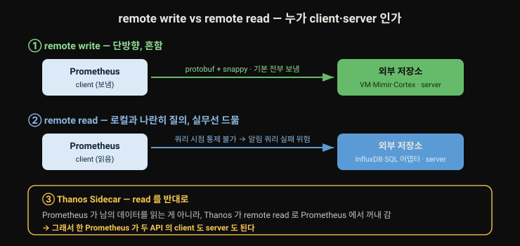
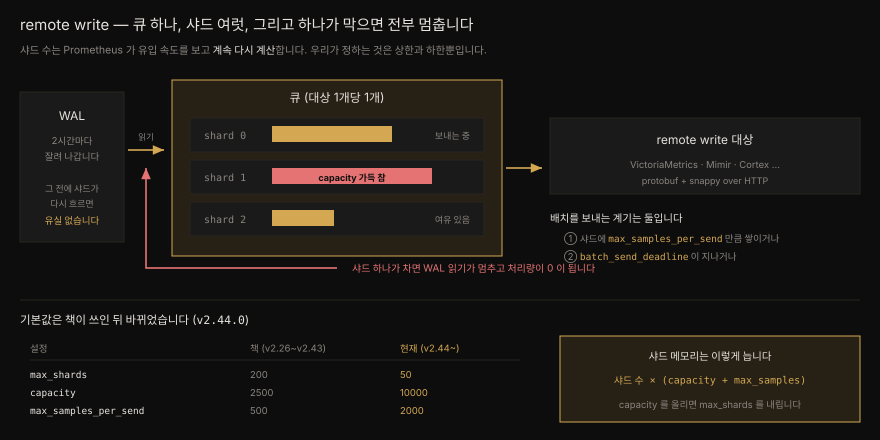
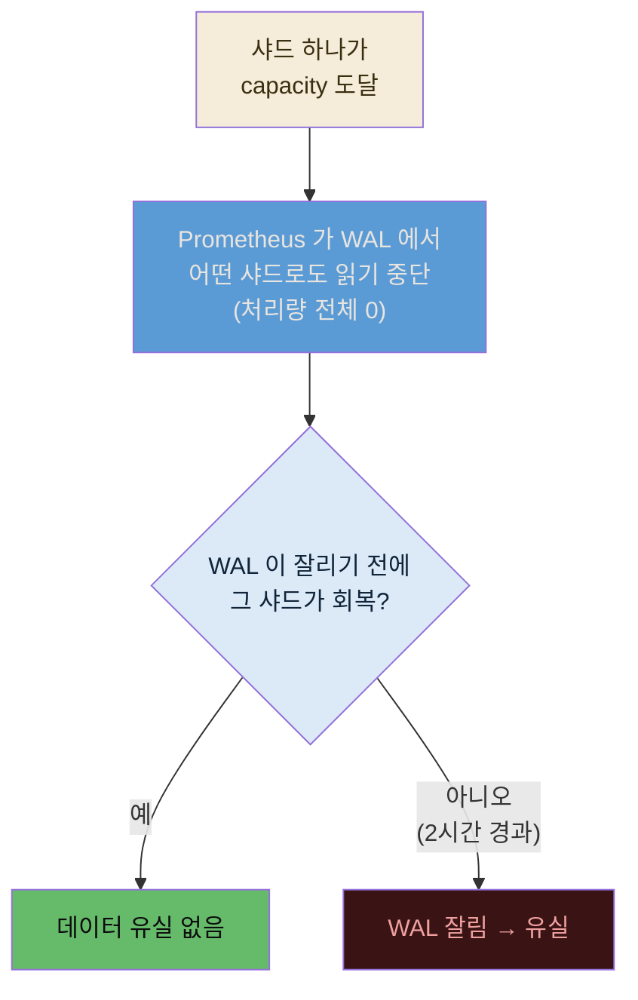

# remote write 와 remote read — 프로토콜·에이전트·튜닝

---

> Prometheus 는 일부러 기능을 좁게 잡았습니다. 저장소는 로컬 파일시스템에 묶여 있고 클러스터링도 복제도 없습니다. 대신 다른 저장 시스템과 이어 붙을 두 개의 원격 저장소 API 를 열어 뒀습니다. 9장 앞부분은 그 두 API 의 성격을 가르고 오직 remote write 만 하는 에이전트 모드를 살펴본 뒤, 큐와 샤드가 어떻게 데이터를 밀어내는지 들여다보며 튜닝 손잡이를 하나씩 만집니다.


## 핵심 요약

> remote read 와 remote write 는 둘 다 HTTP 위에서 protobuf 를 주고받고 snappy 로 압축합니다. remote read 는 유연하지만 쿼리 시점을 통제할 수 없어 실무에서 거의 쓰이지 않고 대개는 반대 방향으로 Prometheus 에서 데이터를 *꺼내 가는* 데 쓰입니다. remote write 는 기본적으로 **모든** 시계열을 보내므로 `write_relabel_configs` 로 줄이는 것이 첫 번째 튜닝입니다. 대상마다 큐가 하나 생기고 큐는 동적인 수의 샤드로 갈리는데, **샤드 하나만 가득 차도 WAL 읽기가 통째로 멈춥니다.** 에이전트 모드는 쿼리·알림·로컬 저장을 끄고 remote write 에만 전념합니다.

이 편은 프로토콜과 튜닝을 다룹니다. 그 API 를 실제로 받아 주는 두 시스템(VictoriaMetrics·Mimir)은 [`09-02`](./09-02.VictoriaMetrics%20와%20Grafana%20Mimir.md) 에서 견줍니다.


## 학습 목표

> 이 절을 읽고 나면 아래 여섯 가지를 스스로 해낼 수 있습니다.

1. remote read 와 remote write 의 방향과 쓰임을 가르고 왜 remote read 가 덜 쓰이는지 말할 수 있습니다.
2. 하나의 Prometheus 가 두 API 의 클라이언트이자 서버가 될 수 있다는 뜻을 Thanos Sidecar 사례로 설명할 수 있습니다.
3. 에이전트 모드가 무엇을 끄고 무엇을 얻는지 알고 WAL 이 2시간으로 제한되는 이유를 압니다.
4. `write_relabel_configs` 가 federation 과 다른 기본값(전부 보냄)을 갖는다는 점을 알고 필요한 시계열만 남길 수 있습니다.
5. 큐·샤드·capacity·max_samples_per_send 의 관계를 그리고 샤드가 막힐 때 무슨 일이 벌어지는지 설명할 수 있습니다.
6. 유입 샘플 속도를 재고 `min_shards` 를 계산하며 샤드 메모리를 어림할 수 있습니다.


## 본문 정리

### 1. 두 개의 원격 저장소 API

Prometheus 는 구현할 기능을 일부러 좁힙니다. 저장소가 로컬 파일시스템에 묶여 있고 인스턴스 사이의 클러스터링이나 복제가 없다는 것이 대표적입니다. 어느 규모에 이르면 이 한계를 넘고 싶어지는데, Prometheus 는 사용자를 자기 안에 가두는 대신 더 많은 기능을 갖춘(그리고 더 복잡한) 다른 메트릭 저장 시스템과 붙을 길을 내장해 뒀습니다.

방법은 두 개의 원격 저장소 API 입니다. 하나는 저장 시스템에서 데이터를 **읽고** 하나는 그리로 **씁니다.** 둘 다 HTTP 로 노출되고 통신에 프로토콜 버퍼(protobuf) 를 쓰며 요청과 응답 모두 **snappy** 로 압축합니다.

둘 중 remote write 가 훨씬 인기 있습니다. 더 큰 메트릭 시스템으로 데이터를 보내는 일이고 그쯤 되면 쿼리도 그쪽에 직접 던지게 되기 때문입니다.

### 2. remote read — 알아 두되 기대하지 마십시오

remote read 를 쓰면 로컬 Prometheus 에 저장된 메트릭과 **나란히 질의되는** 외부 저장 시스템을 붙일 수 있습니다. 다른 Prometheus 인스턴스일 수도, Mimir 나 InfluxDB 같은 외부 메트릭 저장소일 수도, 심지어 메트릭이 아닌 데이터 소스를 위한 커스텀 어댑터일 수도 있습니다.

remote read 요청을 받아 SQL 데이터베이스에 질의하고 결과를 Prometheus 메트릭 형식으로 돌려주는 어댑터를 짜는 것도 가능합니다. 유연하니 재미난 일을 벌일 수 있습니다.

그런데 실무에서 대부분의 사람은 외부 저장소를 Prometheus 에 붙여 *Prometheus 에서* 질의하지 않습니다. 반대로 Prometheus 를 다른 저장 시스템에 붙여 *그 저장 시스템을* 질의합니다.

이유의 일부는 설정한 remote read 엔드포인트로 쿼리가 언제 날아갈지 통제하기 어렵다는 데 있습니다. 붙여 둔 시스템에 문제가 생기면 내 쿼리가, 특히 **알림 쿼리가** 덩달아 실패하기 시작합니다.

그래도 흔한 용례가 있습니다. Thanos 는 Thanos Sidecar 컴포넌트를 통해 데이터를 질의할 때 Prometheus 의 remote read API 를 씁니다. 방향이 살짝 뒤집힌 상황입니다. Prometheus 가 다른 시스템에서 데이터를 가져오는 것이 아니라, remote read 로 **Prometheus 에서** 데이터를 꺼내 가는 쪽입니다.

> 이것이 두 API 의 재미난 성질입니다. 하나의 Prometheus 인스턴스는 두 API 각각에서 **클라이언트도 되고 서버도 됩니다.**

어쨌든 remote read 는 최초 릴리스 이후 개발이 그리 진척되지 않은 고급 기능입니다. 실무에서 이것을 깊이 고민할 일은 거의 없습니다. 다만 기능이 존재한다는 사실은 알아 둘 값어치가 있습니다.

### 3. remote write

remote write 는 훨씬 널리 쓰입니다. 보통 Prometheus 에서 외부 저장 시스템으로 데이터를 씁니다. AWS 의 Amazon Managed Service for Prometheus, Cortex, VictoriaMetrics, Grafana Mimir 같은 것이 목적지가 됩니다.

방향을 뒤집어 **Prometheus 로 데이터를 쓰는** 데도 쓸 수 있습니다. 프로세스를 띄울 때 `--web.enable-remote-write-receiver` 플래그를 주면 됩니다. 로그 플랫폼인 Grafana Loki 가 이것을 씁니다. 로그 데이터를 질의해 recording rule 을 평가하고 그 결과 메트릭을 Prometheus 인스턴스로 보냅니다.

federation 과 비슷하게 remote write 도 전부를 보내거나 일부만 보낼 수 있고 무엇을 보낼지는 relabel 설정으로 고릅니다.

> ⚠️ Prometheus **2.47.0** 에서 OpenTelemetry Line Protocol(OTLP) 로 데이터를 받는 기능이 추가됐다는 이야기를 들었을 수 있습니다. 이것은 다른 Prometheus 인스턴스로 remote write 하는 것과 **명백히 다른** 기능이며 14장에서 다룹니다.

두 API 의 방향과 클라이언트·서버 관계를 한 장으로 정리하면 이렇습니다. 같은 Prometheus 가 상황에 따라 양쪽 역할을 다 맡는다는 점이 핵심입니다.



### 4. 에이전트 모드

remote write 가 워낙 인기여서, Prometheus 는 **2.32.0** 에서 오로지 remote write 프로토콜로 메트릭을 보내는 데만 집중하는 "에이전트" 모드를 넣었습니다. 프로세스를 띄울 때 `--enable-feature=agent` 플래그를 주면 켜집니다.

에이전트 모드로 돌면 **쿼리·알림·로컬 저장이 전부 꺼집니다.** WAL 구현도 살짝 다릅니다. remote write 목적지로 성공적으로 보내진 데이터는 WAL 에서 곧바로 제거됩니다.

> ⚠️ 에이전트의 WAL 이 독자적이긴 해도 결국 Prometheus 의 기본 WAL 위에 얹혀 있습니다. 그래서 현재로선 WAL 에 **2시간치 데이터만** 버퍼링할 수 있습니다. 에이전트가 아닌 Prometheus 가 TSDB 블록을 디스크로 내리기 전까지 데이터를 쌓아 두는 기간이 딱 그만큼이기 때문입니다. 에이전트 모드에서 더 길게 버퍼링하자는 [이슈 #9607](https://github.com/prometheus/prometheus/issues/9607) 이 열려 있습니다.

에이전트 모드는 push 와 pull 의 균형을 잘 잡아 줍니다. pull 쪽에서는 스크레이프 대상에서 수집이 실제로 되고 있는지 알려 주는 `up` 메트릭 같은 장점을 그대로 얻고 push 쪽에서는 메트릭을 손쉽게 중앙으로 모아 전역 뷰를 갖되 저마다 데이터를 이고 있는 수십 수백 개의 상태 있는 Prometheus 를 건사하지 않아도 되는 장점을 얻습니다.

다만 이 책을 쓰는 시점에 에이전트 모드는 여전히 실험적입니다. Prometheus 바깥에 이미 성숙한 시계열 저장 플랫폼을 갖고 있지 않다면 필요할 일이 드문 고급 용례입니다. 저자 역시 아직 써 본 적이 없지만 팀이 그 방향으로 기울고 있다고 적습니다.

### 5. remote write 튜닝 (1) — write relabel configs

remote write 는 손잡이가 여럿입니다. TLS·인증 같은 평범한 설정을 빼면 셋에 집중합니다. **relabel 설정, 큐 설정, 메타데이터 설정** 입니다.

federation 은 무엇을 페더레이션할지 *명시하도록 강제* 하지만 remote write 는 다릅니다. **기본적으로 Prometheus 안의 모든 시계열과 샘플 값을 목적지로 보냅니다.** 그래서 각 remote write 설정 블록에는 `write_relabel_configs` 절이 있고 4장에서 본 `relabel_config` 와 문법이 같습니다.

`write_relabel_configs` 로는 메트릭 이름(`__name__` 라벨) 을 포함한 어떤 라벨을 기준으로도 보낼 메트릭을 추릴 수 있습니다. 자기 서비스 관련 메트릭만 자기 백엔드로 보내고 싶어 하는 팀이 있다면 이렇게 씁니다.

```yaml
remote_write:
  - url: https://teamMandalorian.o11y.example.com/api/prom/push
    write_relabel_configs:
      - action: keep
        source_labels: [ "team" ]
        regex: 'mandalore'
```

이 예에서 목적지로 보내지는 것은 다음 **두 조건을 모두** 만족하는 메트릭뿐입니다. `team` 라벨이 있어야 하고 그 값이 `mandalore` 여야 합니다.

이 relabeling 은 데이터 수집 **이후** 에, 심지어 `metric_relabel_configs` 보다도 뒤에 일어납니다. 그러니 Prometheus 안의 시계열에 붙어 있는 라벨이라면 무엇이든 `write_relabel_configs` 에서 쓸 수 있습니다.

remote write 가 쓰는 자원을 줄이는 가장 단순한 길은 보내는 데이터를 줄이는 쪽입니다. 튜닝은 여기서 시작합니다. 다만 보내는 메트릭 하나하나를 미세 최적화하려 들지는 마십시오. `metric_relabel_configs` 를 과하게 만질 때와 마찬가지로 수익이 금세 줄고 설정 파일만 읽기 어려워집니다.

### 6. remote write 튜닝 (2) — 큐와 샤드

보내는 양이 아니라 **보내는 방식** 을 손보는 것이 두 번째 길입니다. 그러려면 Prometheus 가 큐와 샤드로 어떻게 데이터를 나르는지 알아야 합니다.



설정된 remote write 목적지마다 Prometheus 는 메모리에 새 큐를 하나 만듭니다. 각 큐는 **동적인 수의 샤드** 로 나뉩니다.

샤드 수는 Prometheus 가 백그라운드에서 끊임없이 다시 계산하는데 근거가 셋입니다 — 데이터 **유입 속도**, 아직 보내지 못하고 쌓인 **미전송 샘플 수**, 샘플 하나를 보내는 데 걸리는 **소요 시간**. 유입만 보는 것이 아니라 목적지가 얼마나 빨리 받아 주는지도 함께 봅니다. 우리가 통제할 수 있는 것은 샤드 수의 최솟값과 최댓값뿐입니다.

모든 샤드는 자기 데이터를 목적지로 보내려고 **병렬로** 움직입니다. 그런데 **샤드가 하나라도 capacity 에 이르면 Prometheus 는 WAL 에서 어떤 샤드로도 데이터를 더 읽어 들이지 않고 멈춥니다.** 다만 WAL 이 잘려 나가기 전에 그 샤드가 다시 나아가기 시작하면 데이터 유실은 없습니다. 3장에서 봤듯 WAL 은 head 블록이 디스크로 내려간 뒤 2시간마다 잘립니다.

이 "한 샤드가 전체를 멈춘다" 는 성질이 remote write 뒤처짐의 핵심입니다. 유실 여부가 갈리는 분기까지 흐름으로 보면 이렇습니다.



여기서 반드시 기억할 것은, 이 설정을 바꾸면 목적지로의 처리량만이 아니라 **Prometheus 서버의 메모리 사용량도 함께 바뀐다** 는 점입니다.

#### 샤드 수

샤드 수는 대체로 건드릴 일이 없습니다. `max_shards` 는 기본 **200**, `min_shards` 는 **1** 입니다. `max_shards` 는 건드리지 않기를 권합니다. 반면 `min_shards` 는 올릴 만합니다. Prometheus 가 막 뜬 뒤 서버 부하를 보고 샤드를 얼마나 늘릴지 아직 계산하는 동안 뒤처지는 것을 막아 줍니다.

#### capacity 와 배치

`capacity` 는 샤드 하나가 담을 수 있는 샘플 수이고 기본 **2500** 입니다. 이 한도는 단순한 크기 제한이 아니라 **막히는 경계**입니다 — 앞서 본 "한 샤드가 차면 전체가 멈춘다" 가 성립하는 이유가 여기 있습니다. 초당 2,500 샘플 이상을 수집하고 있다면(이 책을 읽고 있다면 아마 그럴 겁니다) 초기 샤드 **1개** 로는 어림도 없습니다.

> **초당 몇 샘플이나 수집하고 있습니까**
> Prometheus 는 자기 TSDB 에 관한 메트릭도 내므로 아래 쿼리로 어림할 수 있습니다.
> ```pseudocode
> rate(prometheus_tsdb_head_samples_appended_total[5m])
> ```

`capacity` 와 함께 각 샤드는 `max_samples_per_send` 의 지배를 받습니다. 배치를 언제 보낼지 정하는 값이고, 두 가지 방아쇠가 있습니다.

- **샘플 수** — 샤드에 `max_samples_per_send`(기본 **500**) 만큼 차면 전송이 촉발됩니다.
- **시간** — 유입 속도가 샤드를 그만큼 빨리 채우지 못하면 `batch_send_deadline`(기본 **5초**) 이 정해진 주기마다 배치를 보냅니다.

볼륨이 낮은 Prometheus 가 아니라면 시간 데드라인에 걸리지 않는 것이 이상적입니다.

#### min_shards 를 정하는 법

저자는 앞서 잰 샘플 속도를 capacity 로 나눈 값 이상으로 `min_shards` 를 잡기를 권합니다.

```
min_shards = sample_rate / capacity
```

이러면 사용률 100% 근처에서 출발하게 되고 Prometheus 가 거기서 샤드를 빠르게 더 늘릴 수 있습니다.

처리량이 큰 시스템이라면 `max_samples_per_send` 와 `capacity` 를 함께 올려야 합니다. 규칙은 셋입니다.

1. `max_samples_per_send` 를 올릴 때는 **capacity 가 언제나 그 세 배 이상** 이도록 capacity 도 함께 올립니다.
2. 두 값을 올리면 메모리에 든 샘플이 늘어 Prometheus 메모리 사용량이 함께 오릅니다.
3. 그래서 메모리 부족을 피하려면 `max_shards` 를 오히려 낮추길 권합니다(여유가 넉넉하면 그대로 둬도 됩니다).

#### 재시도와 backoff

목적지로 보내다 오류가 나면 어떻게 될까요. 잠깐의 네트워크 단절이거나 목적지가 재시작 중일 수 있습니다. Prometheus 는 일정 간격으로 자동 재시도합니다. 첫 간격은 `min_backoff` 가 정하고 기본 **30ms** 입니다. 요청이 실패할 때마다 간격이 **두 배씩** 늘어 `max_backoff` 까지 갑니다. 기본 **5초** 입니다. `max_backoff` 에 이르면 성공할 때까지 그 간격으로 계속 재시도합니다.

backoff 설정은 대체로 건드릴 필요가 없습니다. 목적지가 레이트 리밋에 민감해서 첫 재시도 전에 더 오래 기다리게 하고 싶은 경우가 예외입니다.


## 심화 학습

책 밖에서 원본 소스로 확인한 내용입니다. 대상은 Prometheus 저장소의 `config/config.go`, `CHANGELOG.md`, 그리고 공식 remote write 튜닝 문서입니다.

### 큐 기본값 네 개가 책과 다릅니다 — 이미 낡은 값이었습니다

책이 제시하는 `max_shards: 200`, `capacity: 2500`, `max_samples_per_send: 500` 은 **현재 기본값이 아닙니다.** 태그를 훑어 확인한 값은 이렇습니다.

| 설정 | 책 | 현재 (v2.44.0~, v3.x 포함) |
|------|-----|--------------------------|
| `max_shards` | 200 | **50** |
| `min_shards` | 1 | 1 (동일) |
| `capacity` | 2500 | **10000** |
| `max_samples_per_send` | 500 | **2000** |
| `batch_send_deadline` | 5s | 5s (동일) |
| `min_backoff` | 30ms | 30ms (동일) |

흥미로운 것은 시점입니다. v2.43.0 까지는 `200 / 2500 / 500` 이고 **v2.44.0** 에서 `50 / 10000 / 2000` 으로 바뀝니다. 그런데 이 책은 본문에서 Prometheus **2.47.0** 의 OTLP 기능을 언급하고 kube-prometheus-stack **47.0.0** 을 씁니다. 둘 다 v2.44.0 보다 나중 판입니다.

> **이 세 값을 어디서 확인했는지 밝혀 둡니다.** CHANGELOG 에 적힌 것은 하나뿐입니다 — `[CHANGE] Remote-write: Raise default samples per send to 2,000. #12203`. `max_shards` 와 `capacity` 변경은 같은 PR 에 들어갔지만 CHANGELOG 에 남지 않았습니다. 그래서 이 둘은 CHANGELOG 가 아니라 **v2.43.0 과 v2.44.0 태그의 `config/config.go` 를 직접 비교해** 확정했습니다. CHANGELOG 만 뒤지면 절반은 찾을 수 없습니다.

그러니 적어도 원고의 어느 대목은 기본값이 바뀐 뒤에 쓰였습니다. 다만 이 사실만으로 저자가 낡은 값을 적었다고 단정할 수는 없습니다. 튜닝 절을 먼저 써 두고 나중에 다른 절에서 최신 버전을 언급했을 수도 있기 때문입니다. 확실한 것은 하나입니다. **지금 이 책을 읽는 독자가 마주하는 Prometheus 의 기본값은 책에 적힌 값이 아닙니다.**

실용적 함의가 작지 않습니다. 책의 조언 "초당 2,500 샘플을 넘으면 초기 샤드 1개로는 부족하다"는 현재 기본값에서 **초당 10,000 샘플** 이 기준선이 됩니다. `min_shards = sample_rate / capacity` 공식에 넣는 분모부터 네 배 달라집니다.

```go
// config/config.go (현재)
DefaultQueueConfig = QueueConfig{
    // With a maximum of 50 shards, assuming an average of 100ms remote write
    // time and 2000 samples per batch, we will be able to push 1M samples/s.
    MaxShards:         50,
    MinShards:         1,
    MaxSamplesPerSend: 2000,
    Capacity:          10000,
    BatchSendDeadline: model.Duration(5 * time.Second),
    MinBackoff:        model.Duration(30 * time.Millisecond),
}
```

주석이 설계 의도를 알려 줍니다. 샤드 50개 × 배치 2000 샘플 × 평균 100ms 전송이면 **초당 100만 샘플** 을 밀 수 있다는 계산입니다.

### "capacity 는 최소 3배" 는 맞되 절반만 옮겼습니다

책은 `max_samples_per_send` 를 올리면 `capacity` 가 그 **세 배 이상** 이도록 하라고 적습니다. 공식 문서의 문장은 이렇습니다.

> It is recommended to set capacity to **3-10 times** `max_samples_per_send`.
> — [Remote write tuning](https://prometheus.io/docs/practices/remote_write/#remote-write-tuning)

3배는 권장 구간의 **하한** 이고 상한은 10배입니다. 실제로 현재 기본값 `10000 / 2000` 은 정확히 5배로 구간 한가운데 있습니다. 책이 틀린 것은 아니지만 상한이 있다는 사실을 함께 알아야 "capacity 는 클수록 좋다"는 오해를 피합니다. 문서는 capacity 가 지나치면 메모리를 낭비하고 **리샤딩 때 큐를 비우는 시간이 길어진다** 고 경고합니다.

### 샤드 메모리 공식 — 책에 없는 계산

책은 "capacity 와 max_samples_per_send 를 올리면 메모리가 는다"고만 적고 얼마나 느는지는 말하지 않습니다. 문서에 공식이 있습니다.

> Shard memory is proportional to the `number of shards * (capacity + max_samples_per_send)`.
> … The default values for `capacity: 10000` and `max_samples_per_send: 2000` will constrain shard memory usage to less than **2 MB per shard**.

기본값이면 샤드당 2MB 미만, 샤드 50개면 100MB 미만입니다. 여기에 문서는 remote write 자체가 메모리를 **대략 25%** 늘린다고 덧붙입니다. WAL 안의 각 시계열마다 시계열 ID→라벨 값 매핑을 캐시하기 때문이고 그래서 **시계열 churn 이 심하면 메모리가 크게 뜁니다.**

뒤처지고 있는지 보는 메트릭도 문서가 알려 줍니다. 책은 언급하지 않습니다.

```pseudocode
prometheus_remote_storage_samples_pending
```

### 에이전트 모드는 더 이상 실험적이지 않습니다 (v3.0.0~)

책은 에이전트 모드가 "이 책을 쓰는 시점에 여전히 실험적"이라 적고 `--enable-feature=agent` 로 켠다고 안내합니다. 도입 버전 **2.32.0** 은 CHANGELOG 로 확인됩니다. 다만 그 뒤가 달라졌습니다.

> `[CHANGE] Agent mode has been promoted to stable. The feature flag `agent` has been removed. To run Prometheus in Agent mode, use the new `--agent` cmdline arg instead. #14747`
> — [CHANGELOG.md, 3.0.0 / 2024-11-14](https://github.com/prometheus/prometheus/blob/main/CHANGELOG.md)

정리하면 이렇습니다.

| 시기 | 상태 | 켜는 법 |
|------|------|---------|
| 2.32.0 (2021-12-09) | 실험적 도입 | `--enable-feature=agent` |
| 3.0.0 (2024-11-14) | **정식(stable)** | `--agent` |

Prometheus 3.x 를 쓰면서 책대로 `--enable-feature=agent` 를 주면 동작하지 않습니다. 반대로 2.x 에서 `--agent` 를 주어도 마찬가지입니다. 쓰는 판을 먼저 확인해야 합니다.

한편 WAL 이 2시간으로 묶여 있다는 책의 지적은 지금도 유효합니다. 저자가 근거로 든 [이슈 #9607](https://github.com/prometheus/prometheus/issues/9607) 은 2021년 10월에 열린 뒤 아직 **열려 있습니다.**

### OTLP 수신은 2.47.0 이 맞습니다

책이 remote write 와 명확히 구분하라고 당부한 OTLP 수신 기능은 CHANGELOG 상 **2.47.0 (2023-09-06)** 에 실험적으로 들어왔습니다.

> `This release adds an experimental OpenTelemetry (OTLP) Ingestion feature`
> `* [FEATURE] Web: Add OpenTelemetry (OTLP) Ingestion endpoint. #12571 #12643`

책의 서술이 정확합니다. 14장에서 다시 만납니다.

### 책에 없는 것 — Remote Write 2.0

이 책은 remote write 프로토콜을 하나로만 다룹니다. 책이 쓰인 뒤 **2.0** 이 나왔습니다. v2.54.0 에서 실험 기능으로 들어왔고, 사양은 여전히 `2.0-rc.4` 로 **실험 상태**입니다. 사양 문서 자체가 "큰 변경은 예상하지 않지만 필요하면 호환성을 깰 권리를 유보한다"고 적습니다.

바뀌는 것은 protobuf 메시지입니다. 1.0 의 `prometheus.WriteRequest` 가 `io.prometheus.write.v2.Request` 로 갈리고, 옛 메시지는 호환용으로만 남습니다.

| | 1.0 | 2.0 |
|---|-----|-----|
| 메시지 | `prometheus.WriteRequest` | `io.prometheus.write.v2.Request` |
| 문자열 | 매 시계열마다 반복 | **심볼 테이블로 인터닝** — 중복 제거 |
| 메타데이터 | 별도 경로 | 시계열에 타입·help·단위를 함께 실음 |
| 그 밖 | — | 네이티브 히스토그램·exemplar·시작 시각 |

실무에서 걸리는 지점은 **협상 방식**입니다. 어느 프로토콜로 보낼지는 `Content-Type` 이 정합니다.

```pseudocode
Content-Type: application/x-protobuf                                        # 1.0 호환
Content-Type: application/x-protobuf;proto=io.prometheus.write.v2.Request   # 2.0
```

수신 쪽이 2.0 을 모르면 1.0 으로 떨어지므로, 목적지가 무엇을 받는지 확인하고 맞춰야 합니다. 그리고 2.0 은 `X-Prometheus-Remote-Write-*-Written` 응답 헤더로 **실제로 받아들여진 개수** 를 돌려줍니다 — 1.0 에는 없던 확인 수단입니다.

> 이 절의 큐 기본값은 v3.6.0 까지 소스로 확인했습니다. 다만 Prometheus 는 그 뒤로도 계속 나오고 있으므로(2026년 8월 기준 3.13.x), 지금 쓰는 판의 `--help` 나 해당 태그의 `config/config.go` 로 확인하는 편이 언제나 정확합니다.


## 실무 적용

> 튜닝의 첫 수는 큐 파라미터가 아니라 relabel 입니다. 보낼 것을 먼저 줄이고 나서 큐를 만집니다.

**보내기 전에 줄입니다.** 튜닝의 첫 수는 큐가 아니라 relabel 입니다. 운영 환경 시계열만 보내려면 이렇게 씁니다.

```yaml
remote_write:
  - url: https://metrics.example.com/api/v1/write
    write_relabel_configs:
      - action: keep
        source_labels: [environment]
        regex: production
```

**min_shards 는 재고 나서 정합니다.** 유입 속도를 먼저 잰 다음, *지금 쓰는 판의* capacity 로 나눕니다. 기본값이 바뀌었으므로 분모를 확인하는 것이 먼저입니다.

```pseudocode
# 초당 유입 샘플 수
rate(prometheus_tsdb_head_samples_appended_total[5m])

# 뒤처지고 있는가
prometheus_remote_storage_samples_pending
```

초당 30,000 샘플이고 현재 기본 `capacity: 10000` 이라면 `min_shards: 3` 에서 출발합니다. 책이 기준한 판의 `2500` 으로 계산하면 12 입니다. 둘 다 각자의 버전에서는 맞는 값이니 어느 쪽이 틀린 것이 아니라, **분모가 네 배 달라졌으므로 쓰는 버전의 기본값을 확인하고 계산해야 한다**는 뜻입니다.

**capacity 를 올리면 max_shards 를 내립니다.** 샤드 메모리는 `샤드 수 × (capacity + max_samples_per_send)` 에 비례합니다. 한쪽만 올리면 최악의 경우 메모리가 곱으로 늡니다.

```yaml
    queue_config:
      min_shards: 3
      max_shards: 30          # capacity 를 올렸으니 상한을 낮춥니다
      capacity: 20000         # max_samples_per_send 의 5배 (권장 3~10배)
      max_samples_per_send: 4000
```

**에이전트 모드는 판을 먼저 확인합니다.** 중앙에 성숙한 시계열 저장소가 이미 있고 엣지에서는 수집만 하면 되는 구조에서만 값어치가 있습니다.

```bash
prometheus --version | head -1        # 3.x 인가 2.x 인가
prometheus --agent ...                # 3.0.0 이상
prometheus --enable-feature=agent ... # 2.32.0 ~ 2.x
```

**Spring 서비스 관점.** Micrometer 가 `/actuator/prometheus` 로 내는 메트릭은 Prometheus 가 긁어 간 *뒤에야* remote write 대상이 됩니다. 애플리케이션이 원격 저장소로 직접 밀어 넣는 구조가 아닙니다. 그래서 `write_relabel_configs` 에서 쓸 수 있는 라벨은 스크레이프와 `metric_relabel_configs` 를 모두 통과한 뒤의 라벨입니다. 팀별로 저장소를 가르고 싶다면 `MeterRegistryCustomizer` 의 `commonTags` 로 `team` 라벨을 심어 두면 그대로 `keep` 조건에 쓸 수 있습니다.


## 체크리스트

- [ ] remote read 와 remote write 가 각각 어느 방향으로 흐르는지 말할 수 있는가?
- [ ] 두 API 모두 protobuf + snappy over HTTP 라는 것을 아는가?
- [ ] remote read 가 실무에서 덜 쓰이는 이유(쿼리 시점 통제 불가, 알림 쿼리 실패 위험)를 대는가?
- [ ] Thanos Sidecar 가 remote read 를 *반대 방향* 으로 쓴다는 뜻을 설명할 수 있는가?
- [ ] remote write 의 기본값이 "전부 보냄" 이라는 것과 federation 과의 차이를 아는가?
- [ ] `write_relabel_configs` 가 `metric_relabel_configs` 보다 뒤에 적용된다는 것을 아는가?
- [ ] 샤드 하나가 가득 차면 WAL 읽기 전체가 멈춘다는 것을 아는가?
- [ ] 그럼에도 WAL 이 잘리기 전에 회복되면 유실이 없는 이유를 아는가?
- [ ] `min_shards = sample_rate / capacity` 를 계산하고 쓰는 판의 capacity 기본값을 확인하는가?
- [ ] capacity 를 올릴 때 `max_shards` 를 함께 내려야 하는 이유를 메모리 공식으로 설명하는가?
- [ ] 에이전트 모드가 무엇을 끄는지, 그리고 3.0.0 부터 플래그가 `--agent` 로 바뀐 것을 아는가?


## 면접 관점

**Q. Prometheus 의 remote write 와 remote read 는 각각 무엇입니까.**

A. Prometheus 가 외부 메트릭 저장 시스템과 붙기 위해 여는 두 개의 HTTP API 입니다. 둘 다 protobuf 로 통신하고 snappy 로 압축합니다. remote write 는 Prometheus 의 데이터를 외부 저장소로 보내는 쪽이고 remote read 는 외부 저장소의 데이터를 로컬 데이터와 나란히 질의하는 쪽입니다. 실무에서는 remote write 가 압도적으로 많이 쓰입니다. remote read 는 쿼리가 언제 원격 엔드포인트로 나갈지 통제하기 어려워, 원격 시스템에 장애가 나면 알림 쿼리까지 함께 실패할 위험이 있기 때문입니다.

**Q. 하나의 Prometheus 가 두 API 의 클라이언트이자 서버라는 말은 무슨 뜻입니까.**

A. Prometheus 는 remote write 로 데이터를 보낼 수도 있고 `--web.enable-remote-write-receiver` 를 켜서 받을 수도 있습니다. remote read 도 마찬가지여서, 외부 저장소를 읽을 수도 있고 반대로 외부에서 Prometheus 를 읽어 갈 수도 있습니다. 후자의 대표가 Thanos Sidecar 입니다. Prometheus 가 다른 시스템에서 데이터를 가져오는 것이 아니라, Thanos 가 remote read API 로 Prometheus 에서 데이터를 꺼내 갑니다.

**Q. remote write 로 데이터를 보내는데 Prometheus 메모리가 계속 오릅니다. 무엇을 봅니까.**

A. 먼저 뒤처지고 있는지를 `prometheus_remote_storage_samples_pending` 으로 확인합니다. 샤드 메모리는 `샤드 수 × (capacity + max_samples_per_send)` 에 비례하므로, capacity 나 배치 크기를 올린 적이 있다면 `max_shards` 를 함께 내렸는지 봅니다. 그리고 remote write 자체가 WAL 의 시계열마다 ID→라벨 매핑을 캐시하므로 시계열 churn 이 심하면 메모리가 크게 뜁니다. 근본 처방은 `write_relabel_configs` 로 보내는 시계열을 줄이는 쪽입니다.

**Q. 샤드 하나가 가득 차면 어떻게 됩니까.**

A. 그 샤드만 멈추는 것이 아니라 Prometheus 가 **WAL 에서 어떤 샤드로도 데이터를 더 읽지 않습니다.** 즉 처리량이 전체적으로 0 이 됩니다. 다만 WAL 이 잘려 나가기 전에 그 샤드가 다시 진행하면 데이터 유실은 없습니다. WAL 은 head 블록이 디스크로 내려간 뒤 2시간마다 잘리므로 그 안에 회복되면 됩니다.

**Q. 에이전트 모드는 언제 씁니까.**

A. 쿼리·알림·로컬 저장을 모두 끄고 remote write 만 하는 모드입니다. 중앙에 VictoriaMetrics 나 Mimir 같은 성숙한 시계열 저장소가 이미 있고 엣지의 Prometheus 는 수집해서 밀어 주기만 하면 되는 구조에서 값어치가 있습니다. pull 모델의 `up` 메트릭은 그대로 얻으면서 상태 있는 Prometheus 를 수십 대 건사하지 않아도 됩니다. 주의할 점은 WAL 이 여전히 2시간치만 버퍼링한다는 것과, 3.0.0 에서 정식 기능이 되며 플래그가 `--enable-feature=agent` 에서 `--agent` 로 바뀌었다는 점입니다.


## 참고 자료

- 원본: *Mastering Prometheus* (Packt, ISBN 9781805125662) — Chapter 9, Utilizing Remote Storage Systems with Prometheus
- [remote_write 설정](https://prometheus.io/docs/prometheus/latest/configuration/configuration/#remote_write) · [remote write 튜닝](https://prometheus.io/docs/practices/remote_write/#remote-write-tuning)
- [Prometheus Agent 발표 글](https://prometheus.io/blog/2021/11/16/agent/) · [이슈 #9607 — 에이전트 WAL 장기 버퍼링](https://github.com/prometheus/prometheus/issues/9607)
- [`config/config.go` — `DefaultQueueConfig`](https://github.com/prometheus/prometheus/blob/main/config/config.go) · [`CHANGELOG.md`](https://github.com/prometheus/prometheus/blob/main/CHANGELOG.md)
- [Prometheus "stringlabels"](https://prometheus.io/blog/2023/03/21/stringlabel/)
- 이어지는 편: [`09-02` VictoriaMetrics 와 Grafana Mimir](./09-02.VictoriaMetrics%20와%20Grafana%20Mimir.md)
