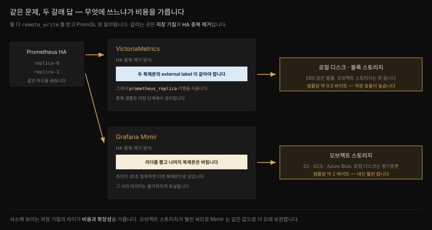

# VictoriaMetrics 와 Grafana Mimir

---

> 같은 문제를 두 갈래로 푼 답을 나란히 놓습니다. 단일 Prometheus 의 보존·확장 한계를 넘으려 할 때 고르게 되는 두 원격 저장소입니다. 둘 다 remote write 를 받고 PromQL 로 질의되지만 하나는 로컬 디스크에만 쓰고 다른 하나는 오브젝트 스토리지에만 씁니다. 사소해 보이는 이 차이가 비용과 확장성을 가릅니다.


## 핵심 요약

> VictoriaMetrics 는 자원 효율이 무기입니다. 샘플당 약 0.3 바이트로 Prometheus 의 1/7 디스크를 쓰지만 PromQL 100% 호환을 **목표로 삼지 않고** MetricsQL 이라는 상위집합을 씁니다. Mimir 는 효율을 내세우지 않는 대신 오브젝트 스토리지에 씁니다. 오브젝트 스토리지는 블록 스토리지보다 훨씬 싸서 같은 값으로 **몇 달이 아니라 몇 년** 을 보관합니다. HA 중복 제거 방식도 갈립니다. VictoriaMetrics 는 두 복제본의 external label 이 *같기를* 요구하고 Mimir 는 리더를 선출해 나머지 복제본의 데이터를 버립니다.

앞 편 [`09-01`](./09-01.remote%20write%20와%20remote%20read%20—%20프로토콜·에이전트·튜닝.md) 이 프로토콜과 튜닝을 다뤘다면 이 편은 그 프로토콜을 받아 주는 두 시스템을 견줍니다. Mimir 의 내부 컴포넌트 구조(Distributor·Ingester·Store Gateway·Compactor) 는 이미 [`02-05.Grafana Mimir`](../../02_LGTMStack/02-05.Grafana%20Mimir.md) 에 정리돼 있으므로 되풀이하지 않고 여기서는 **VictoriaMetrics 와의 대조** 에 집중합니다.


## 학습 목표

> 이 절을 읽고 나면 아래 다섯 가지를 스스로 해낼 수 있습니다.

1. VictoriaMetrics 를 고르는 첫 이유(자원 효율) 와 두 가지 걸림돌(오픈소스 모델·PromQL 호환) 을 말할 수 있습니다.
2. MetricsQL 이 PromQL 과 어디서 갈리는지 `rate`·`increase` 의 구간 해석으로 설명할 수 있습니다.
3. 단일 노드 VictoriaMetrics 가 감당하는 규모를 근거로 클러스터가 언제 필요한지 판단할 수 있습니다.
4. VictoriaMetrics 와 Mimir 의 저장 기질(블록 vs 오브젝트) 차이가 비용에 미치는 영향을 설명할 수 있습니다.
5. 두 시스템의 HA 중복 제거 방식 차이와 각각의 대가를 말할 수 있습니다.


## 본문 정리



### 1. VictoriaMetrics — 효율이라는 무기

VictoriaMetrics 는 Prometheus 메트릭의 원격 저장소 중 가장 인기 있고 자리 잡은 선택지입니다. 어떤 사람들과 프로젝트는 아예 Prometheus 를 **대체하는** 용도로 씁니다. `vmagent` 컴포넌트로 타깃을 직접 스크레이프할 수 있고 Prometheus 설정 파일과 대체로 호환되기 때문입니다. 다만 `remote_write`·`remote_read`·`rule_files`·`alerting` 절은 지원하지 않습니다.

사람들이 VictoriaMetrics 를 고르는 첫째 이유는 **자원 효율** 입니다. Prometheus 와의 정면 벤치마크에서 VictoriaMetrics 는 같은 양의 시계열과 샘플(활성 시계열 280만 개, 초당 28만 샘플) 을 두고 디스크는 **7배**, 메모리는 **5배** 적게 썼다고 주장합니다.

| 항목 | Prometheus | VictoriaMetrics |
|------|-----------|-----------------|
| 샘플당 디스크 | 약 2.1 바이트 | 약 0.3 바이트 |
| 메모리 | 약 23GB | 약 4.3GB |

> ⚠️ 이 벤치마크는 **2020년 11월** 자료이며 VictoriaMetrics 가 자사 블로그에 실었습니다. 그 뒤 Prometheus 도 메모리를 줄이는 개선을 여럿 했습니다. 메모리 사용을 줄인 `stringlabels` 자료구조로의 전환이 대표적입니다.

#### 걸림돌 하나 — 오픈소스 모델

VictoriaMetrics 의 코어는 오픈소스이고 GitHub 에 있습니다. 알려진 기능 대부분이 여기 들어 있습니다. 그렇지만 VictoriaMetrics 는 돈을 벌어야 하는 독립 회사이고 그래서 유료 비공개 "엔터프라이즈" 판을 팝니다. 크고 공유된 환경을 굴리는 이들이 탐낼 만한 기능이 그쪽에 있습니다. 과거 데이터 다운샘플링, 온전한 멀티테넌시, 머신러닝 기반 이상 탐지, 클러스터 배포 시 컴포넌트 간 mTLS 따위입니다.

빠진 기능만이 문제가 아닙니다. 오픈소스 제품 자체의 지속적 지원이라는 상존하는 우려가 있습니다. VictoriaMetrics 는 2019년 5월 단일 노드 판이 오픈소스로 풀린 이래 꾸준히 갱신돼 왔습니다. 그러나 최근 몇 해 Elasticsearch 나 Terraform 에서 보았듯, 영리 기업이 후원하는 오픈소스의 라이선스와 개발 방향은 언제든 바뀔 수 있습니다.

#### 걸림돌 둘 — PromQL 호환

두 번째로 알아 둘 것은 VictoriaMetrics 가 **PromQL 100% 호환이 아니며 그것을 목표로 삼지도 않는다** 는 점입니다. 자체 쿼리 언어 **MetricsQL** 을 구현하며 이는 PromQL 의 상위집합을 지향합니다. PromQL 의 모든 쿼리 함수를 구현하고 문법적으로 완전히 호환됩니다. REST API 엔드포인트도 Prometheus 와 같아서 Grafana 에서 "Prometheus" 데이터 소스로 쓸 수 있습니다.

문제는 **같은 쿼리가 다른 값을 돌려줄 수 있다** 는 점입니다. Prometheus v2.30.0 과 VictoriaMetrics v1.67.0 을 놓고 돌린 벤치마크에서 VictoriaMetrics 의 [PromQL 준수 점수](https://promlabs.com/promql-compliance-tests/)는 **72.78%** 에 그쳤습니다.

기능이 없어서가 아닙니다. 실패한 테스트는 전부 MetricsQL 의 **의도적 선택** 때문에 결과가 조금씩 달랐던 경우입니다. 예컨대 `round` 나 `predict_linear` 같은 함수를 쓸 때 VictoriaMetrics 는 결과에 메트릭 이름을 그대로 남기지만 Prometheus 는 지웁니다.

가장 흔한 차이는 `rate` 와 `increase` 의 구현입니다. **MetricsQL 은 지정한 구간이 시작되기 직전의 마지막 샘플 값까지 고려하는 반면, PromQL 은 구간 안의 값만 봅니다.** 계산에 쓰이는 데이터가 다르니 결과도 달라지기 쉽습니다. 실무에서 대개 문제가 되지는 않겠지만 어디서 쿼리를 돌렸느냐에 따라 결과가 왜 다른지 다른 사용자가 물어 올 수는 있습니다.

#### 단일 노드로 어디까지 가는가

VictoriaMetrics 는 단일 노드와 클러스터 두 방식으로 배포됩니다. 둘 다 오픈소스 판에 있습니다. "클러스터가 당연히 낫지"라고 건너뛰기 전에 단일 노드가 무엇을 감당하는지 봐야 합니다. VictoriaMetrics 문서가 사례 연구를 근거로 밝힌 단일 노드의 프로덕션 워크로드입니다.

| 항목 | 단일 노드가 감당하는 규모 |
|------|--------------------------|
| 유입 속도 | 초당 150만+ 샘플 |
| 활성 시계열 | 5,000만+ |
| 전체 시계열 | 50억+ |
| 시계열 churn | 하루 1억 5천만+ 신규 시계열 |
| 전체 샘플 수 | 10조+ |
| 쿼리 | 초당 200+ |
| 쿼리 지연(99분위) | 1초 |

한 대가 감당하는 규모치고는 큽니다. 대부분의 인프라는 이 선을 넘지 않으므로 단일 노드로 충분합니다. 클러스터를 쓸 첫째 이유는 이것으로 **중앙집중형 멀티테넌트 메트릭 데이터베이스** 를 지을 때입니다. 클러스터 판은 독립 컴포넌트를 여럿 굴려야 해서 운영 복잡도와 자원 오버헤드가 함께 늡니다. VictoriaMetrics 프로젝트 자신도 클러스터를 고려하기 전에 단일 노드를 **수직으로 최대한 키우라** 고 권합니다.

### 2. Grafana Mimir — 오브젝트 스토리지라는 선택

Mimir 는 이 생태계의 상대적 신참입니다. 2022년 발표됐고 CNCF 후원 프로젝트인 Cortex 의 정신적 후속작입니다. 시계열 저장에서 가장 확장성 있고 성능 좋은 선택지가 되기를 지향합니다.

> **Cortex 는 죽었습니까**
> 아닙니다. Cortex 는 여전히 활발히 개발되고 수많은 회사가 널리 씁니다. Mimir 에 끌리지만 AGPLv3 라이선스가 마음에 걸린다면 Cortex 를 써 보십시오. 경험과 아키텍처가 대체로 비슷합니다.

Mimir 는 목표에 **효율** 을 넣지 않았다는 점에 유의해야 합니다. VictoriaMetrics 같은 거대한 메모리·저장 효율 향상을 기대하고 접근하면 실망합니다. 다만 저장 효율은 Prometheus 를 직접 쓸 때와 비슷한 수준(샘플당 대략 2 바이트) 은 됩니다. 프로젝트가 성숙하며 효율은 나아지겠지만 뒤에서 더 많은 일을 하는 만큼 순정 Prometheus 보다 자원을 더 쓰는 것은 분명합니다.

#### VictoriaMetrics 와 견주면

저자가 보기에 가장 중요한 차이는 **데이터를 어디에 저장하느냐** 입니다. 둘 다 단일 노드로도 클러스터로도 돌고 읽기와 쓰기 경로를 따로 확장할 수 있으며 Prometheus 데이터를 받아 PromQL 로 질의합니다. 그런데 VictoriaMetrics 는 **로컬에 붙은 저장소** 에만 쓸 수 있습니다. 로컬 디스크나 AWS EBS 같은 블록 스토리지 볼륨입니다. 반면 Mimir 는 **오브젝트 스토리지** 에만 씁니다. S3, GCS, Azure Blob Storage 따위입니다.

> ⚠️ Mimir 도 단일 노드 "monolithic" 모드로 돌면 기술적으로는 로컬 디스크에 쓸 수 있습니다. 다만 흔치 않은 배포 형태로 여겨지며 주로 **평가 목적** 으로만 권장됩니다.

오브젝트 스토리지는 주요 클라우드 어디서나 블록 스토리지보다 **훨씬 쌉니다.** 그래서 같은 값으로 훨씬 많은 시계열을 보관할 수 있고, 메트릭을 **몇 달이 아니라 몇 년** 단위로 오래 두는 일이 가능해집니다. 회사가 Prometheus 데이터를 어떻게 쓰느냐에 따라 이것이 판을 바꿉니다. 다만 VictoriaMetrics 가 데이터를 훨씬 효율적으로 저장하므로 그만큼 비용이 상쇄되는 면은 있습니다.

성능은 예상대로 VictoriaMetrics 가 앞섭니다. 앞서의 벤치마크와 비슷한 방법론으로 VictoriaMetrics 는 Mimir 대비 저장 효율 **3배 이상**, CPU **1.7배**, 메모리 **5배** 개선을 보고합니다. 다만 **중앙값 쿼리 지연에서는 Mimir 가 이겼습니다.**

#### HA 중복 제거 — 정반대의 접근

6장에서 만든 HA Prometheus 는 복제본을 식별하는 external label 을 답니다.

```yaml
global:
  external_labels:
    prometheus: prometheus/mastering-prometheus-kube
    prometheus_replica: prometheus-mastering-prometheus-kube-0
```

그런데 이것이 VictoriaMetrics 의 중복 제거 방식과 **맞지 않습니다.** VictoriaMetrics 는 HA Prometheus 인스턴스들이 **동일한 external label** 을 갖기를 요구합니다. 그래서 `prometheus_replica` 를 지워야 합니다. kube-prometheus-stack 차트에서는 `replicaExternalLabelNameClear: true` 로 해결합니다.

Mimir 는 반대입니다. external label 을 굳이 같게 만들 필요가 없습니다. 대신 Mimir 가 HA Prometheus 복제본들 사이에서 **리더를 선출** 하고 그 리더에게서만 데이터를 받습니다. 선출되지 않은 복제본의 데이터는 그냥 버려집니다. 선출된 Prometheus 가 30초 동안(설정 가능) 데이터를 보내지 않으면 다른 복제본으로 넘어갑니다. 이 전환 과정에서 **약간의 데이터 유실은 불가피합니다.**

중복 제거를 조율하려면 Mimir 는 Consul 이나 etcd 같은 KV 저장소가 있어야 리더를 추적합니다. 실험용으로는 인메모리 저장소를 쓸 수 있지만 Mimir 복제본을 둘 이상 굴리는 어떤 프로덕션 배포에서도 이것은 쓸 수 없습니다.

Mimir 의 유연함에는 대가가 따릅니다. HA 쌍의 중복 제거를 켜는 데만 플래그 다섯 개를 세워야 합니다.

```yaml
args:
  - "-distributor.ha-tracker.enable-for-all-users=true"
  - "-distributor.ha-tracker.store=inmemory"
  - "-distributor.ha-tracker.enable=true"
  - "-distributor.ha-tracker.cluster=prometheus"
  - "-distributor.ha-tracker.replica=prometheus_replica"
```

#### 테넌트 헤더

Mimir 만의 독특한 점이 하나 더 있습니다. Prometheus 가 Mimir 로 보내는 모든 요청에 `X-Scope-OrgID` HTTP 헤더를 실어 데이터가 속한 Mimir "테넌트"를 밝혀야 합니다. Grafana 데이터 소스도 질의할 때 같은 헤더를 지정해야 합니다. 그리고 Mimir 에는 VictoriaMetrics 같은 자체 UI 가 없으므로 웹에서 질의하려면 Grafana 데이터 소스를 만들어야 합니다.

```yaml
prometheus:
  prometheusSpec:
    replicas: 2
    remoteWrite:
      - name: mimir
        url: http://…/api/v1/push
        headers:
          X-Scope-OrgID: mastering-prometheus
```

### 3. 배포 — 실습 요약

두 시스템 모두 2장에서 만든 쿠버네티스 클러스터에 올립니다.

**VictoriaMetrics** 는 Helm 차트가 여럿 있는데, 오퍼레이터의 CRD 를 설치하지 않는 `victoria-metrics-single` 차트로 단일 노드를 띄웁니다.

```bash
helm repo add vm https://victoriametrics.github.io/helm-charts/
helm repo update
helm install --namespace prometheus \
  --values mastering-prometheus/ch9/vm-values.yaml \
  --version 0.9.10 vmsingle vm/victoria-metrics-single
```

`http://localhost:8428/vmui` 로 질의 UI 에 들어갑니다. 경로에서 `/vmui` 를 빼면 VictoriaMetrics 가 노출하는 다른 엔드포인트 목록이 보입니다. 카디널리티 탐색기와 쿼리 추적 기능을 둘러볼 만합니다.

**Mimir** 는 monolithic 모드를 지원하는 Helm 차트를 Grafana Labs 가 (집필 시점에) 내지 않아, 직접 쓴 Deployment·Service 매니페스트를 씁니다. monolithic 모드가 프로덕션 권장이 아니라는 사실을 이것이 되짚어 줍니다.

```yaml
containers:
  - image: grafana/mimir:2.9.2
    args:
      - "-common.storage.filesystem.dir=/data"
      - "-blocks-storage.filesystem.dir=/data/ingester"
      - "-ingester.ring.replication-factor=1"
      # …그리고 위의 ha-tracker 플래그 다섯 개
```


## 심화 학습

책 밖에서 확인한 내용과, 확인할 수 없어 **책의 주장으로 남겨 둔** 것을 가릅니다.

### 이 편의 수치는 대부분 "VictoriaMetrics 가 발표한 것"입니다

이 장의 비교 수치는 성격을 구분해 읽어야 합니다.

| 수치 | 출처 | 성격 |
|------|------|------|
| 디스크 7배·메모리 5배 (vs Prometheus) | VictoriaMetrics 블로그, 2020-11 | **이해당사자 자체 벤치마크** |
| 저장 3배·CPU 1.7배·메모리 5배 (vs Mimir) | VictoriaMetrics 블로그 | **경쟁사가 낸 경쟁사 비교** |
| 중앙값 쿼리 지연은 Mimir 승 | 같은 자료 | 자기에게 불리한 항목이라 신뢰도 높음 |
| PromQL 준수 72.78% | PromLabs 준수 테스트 | 제3자, 단 **버전 고정** |
| 단일 노드 규모(150만 샘플/초 등) | VictoriaMetrics 공식 문서 | 자사 사례 연구 |

저자가 "VictoriaMetrics reports" 라고 조심스럽게 적은 대목을 그대로 옮겼습니다. 이 수치들을 *중립적 측정* 으로 읽으면 곤란합니다. 특히 vs Mimir 벤치마크는 VictoriaMetrics 가 자기 경쟁자를 재서 자기 블로그에 실었습니다. 저자가 "중앙값 쿼리 지연은 Mimir 가 이겼다"를 함께 옮긴 것은 그 자료가 최소한 불리한 결과를 감추지는 않았다는 방증입니다.

### PromQL 준수 점수 72.78% 는 **고정된 두 버전** 의 값입니다

책은 점수의 근거를 밝히면서 버전을 함께 적었습니다. Prometheus **v2.30.0** 과 VictoriaMetrics **v1.67.0** 입니다. v2.30.0 은 2021년 판이고 v1.67.0 도 그 무렵입니다. 즉 이 숫자는 **당시 두 버전 사이의 값** 이지 오늘의 값이 아닙니다.

이 숫자를 "VictoriaMetrics 의 PromQL 호환은 72.78% 다"라고 외우면 안 됩니다. 정확히 옮기면 이렇습니다. *2021년 무렵 그 두 버전을 PromLabs 준수 테스트로 재니 72.78% 였고 실패한 항목은 기능 부재가 아니라 MetricsQL 의 의도적 설계 차이였다.* 오늘의 값이 궁금하면 [PromLabs 준수 테스트](https://promlabs.com/promql-compliance-tests/) 를 직접 확인해야 합니다.

핵심은 점수가 아니라 **성격** 입니다. MetricsQL 은 PromQL 을 못 따라가는 것이 아니라 일부러 다르게 답하기로 한 언어입니다. 그러니 점수가 오르내리든 "같은 쿼리가 다른 값을 낼 수 있다"는 사실 자체는 남습니다.

### `rate` 구간 해석 차이가 실제로 뜻하는 것

책의 그림 9.1 이 말하는 바를 문장으로 옮기면 이렇습니다. `rate(x[5m])` 을 던졌을 때,

- **PromQL** 은 그 5분 구간 **안에 있는** 샘플만 봅니다.
- **MetricsQL** 은 구간이 시작되기 **직전의 마지막 샘플** 까지 끌어와 함께 계산합니다.

![rate(x[5m]) 계산 시 PromQL 은 구간 안 샘플만, MetricsQL 은 구간 직전 샘플까지 포함해 두 엔진의 값이 갈린다](./_assets/09-02-metricsql-rate-interval.svg)

왜 이것이 실무에서 대개 무해한지, 그러면서도 왜 값이 갈리는지 짚어 둡니다. 카운터의 증가분을 시간으로 나누는 계산에서 구간 경계 바로 앞의 점을 포함하면 **경계에 걸친 증가분** 이 계산에 들어옵니다. 스크레이프 간격이 구간에 비해 촘촘하면(예: 15초 간격, 5분 구간) 점 하나가 스무 개 중 하나이므로 영향이 작습니다. 반대로 스크레이프 간격이 성기거나 구간이 짧으면 그 한 점의 비중이 커져 두 엔진의 값이 눈에 띄게 갈립니다.

Prometheus 가 구간 안만 보는 탓에 생기는 유명한 부작용이 있습니다. 구간 경계에서 카운터 증가분의 일부를 놓쳐 `rate` 가 과소평가되는 문제입니다. MetricsQL 의 선택은 이 문제를 겨냥한 것으로 읽힙니다. 어느 쪽이 "옳다"기보다 **트레이드오프가 다르다** 고 이해하는 편이 정확합니다.

### VictoriaMetrics 가 지원하지 않는 설정 절

책은 VictoriaMetrics 가 Prometheus 설정 파일과 "대체로 호환"되지만 네 개 절을 지원하지 않는다고 적습니다. `remote_write`, `remote_read`, `rule_files`, `alerting` 입니다.

이 목록에는 일관된 뜻이 있습니다. VictoriaMetrics 를 *Prometheus 대체* 로 쓸 때 빠지는 것은 **다른 곳으로 데이터를 넘기는 기능** 과 **룰·알림 기능** 입니다. 앞의 둘이 없는 것은 VictoriaMetrics 자신이 종착지이기 때문입니다. 뒤의 둘, 곧 "Prometheus 를 그대로 들어내고 VictoriaMetrics 를 꽂으면 알림이 사라진다"는 함의를 저자는 명시하지 않습니다.

> 여기서부터는 책에 없는 내용입니다. 룰 평가와 알림은 VictoriaMetrics 본체가 아니라 [`vmalert`](https://docs.victoriametrics.com/vmalert/) 라는 별도 컴포넌트가 맡습니다. 프로젝트 저장소의 `app/` 아래 `vmagent`·`vminsert`·`vmselect` 등과 나란히 있는 독립 바이너리입니다. 드롭인 교체를 검토한다면 알림 경로를 어떻게 이을지 함께 계획해야 합니다.

### 오브젝트 스토리지가 싸다는 말의 크기

책은 "significantly cheaper" 라고만 적습니다. 정확한 단가는 클라우드·리전·요금제마다 달라 특정 숫자를 못박지 않겠지만, 구조적 이유는 분명합니다. 두 축이 다릅니다.

| | 블록 스토리지 | 오브젝트 스토리지 |
|---|---|---|
| 과금 대상 | **프로비저닝한 용량** (안 쓴 공간도 냄) | **실제로 넣은 바이트** 만 |
| 접근 | 한 인스턴스에 붙음 | 여러 컴포넌트가 함께 읽음 |

두 번째 축이 Mimir 의 강점을 낳습니다. Store Gateway 가 블록을 통째로 내려받지 않고 인덱스만 보고 필요한 청크를 골라 읽을 수 있는 것도 오브젝트 스토리지를 여럿이 공유하는 구조 덕입니다([`02-05`](../../02_LGTMStack/02-05.Grafana%20Mimir.md)).

여기에 VictoriaMetrics 의 저장 효율(샘플당 0.3 바이트 대 2 바이트, 약 7배) 이 겹칩니다. 단가가 7배 이상 차이 나지 않는다면 총비용에서 VictoriaMetrics 가 앞설 수 있다는 뜻입니다. 그래서 저자도 "일부 비용은 상쇄된다" 고 적습니다. 결론은 **둘 중 하나가 언제나 싸다고 말할 수 없다** 는 것이고 보존 기간이 길수록 오브젝트 스토리지 쪽으로 기웁니다.


## 실무 적용

> 성능만 보면 VictoriaMetrics 이지만 축이 하나가 아닙니다. 자원·보존 기간·PromQL 호환·라이선스를 함께 놓으면 답이 갈립니다.

**고르는 기준.** 성능만 보면 VictoriaMetrics 이지만 축이 하나가 아닙니다.

| 상황 | 고르는 쪽 | 이유 |
|------|----------|------|
| 자원(디스크·메모리) 이 최우선 | VictoriaMetrics | 샘플당 0.3 바이트 |
| 몇 년 단위 장기 보존 | Mimir | 오브젝트 스토리지 단가 |
| PromQL 결과가 Prometheus 와 **정확히** 같아야 함 | Mimir | MetricsQL 은 의도적으로 다름 |
| 순수 오픈소스 보장이 중요 | Mimir (AGPLv3) 또는 Cortex | VictoriaMetrics 는 엔터프라이즈 판이 별도 |
| 운영 인력이 적고 규모가 크지 않음 | VictoriaMetrics 단일 노드 | 초당 150만 샘플까지 한 대로 |
| 멀티테넌시가 필수 | Mimir 또는 VM 엔터프라이즈 | VM 의 온전한 멀티테넌시는 유료 |

**HA Prometheus 를 붙일 때 반드시 갈리는 지점.** 같은 HA 구성을 두고 설정이 정반대입니다.

```yaml
# VictoriaMetrics 로 보낼 때 — 복제본 라벨을 지웁니다
prometheus:
  prometheusSpec:
    replicas: 2
    replicaExternalLabelNameClear: true    # prometheus_replica 제거
```

```yaml
# Mimir 로 보낼 때 — 라벨을 남기고 Mimir 가 리더를 뽑습니다
prometheus:
  prometheusSpec:
    replicas: 2                            # replicaExternalLabelNameClear 없음
    remoteWrite:
      - name: mimir
        url: http://…/api/v1/push
        headers:
          X-Scope-OrgID: my-tenant
```

VictoriaMetrics 설정을 그대로 두고 Mimir 로 바꾸면 `prometheus_replica` 가 없어 HA tracker 가 리더를 가릴 수 없습니다. 반대로 Mimir 설정으로 VictoriaMetrics 에 보내면 복제본 라벨이 달라 **같은 샘플이 중복 저장** 됩니다.

**드롭인 교체를 검토한다면.** VictoriaMetrics 는 `rule_files` 와 `alerting` 을 지원하지 않습니다. 알림은 `vmalert` 로 옮겨야 하고 그 과정에서 알림 룰의 `rate` 결과가 미묘하게 달라질 수 있다는 점을 감안해야 합니다.

**Spring 서비스 관점.** 어느 쪽을 고르든 애플리케이션은 바뀌지 않습니다. Micrometer 는 여전히 `/actuator/prometheus` 를 낼 뿐이고 원격 저장소는 Prometheus 뒤에 있습니다. 다만 Grafana 대시보드를 Mimir 데이터 소스로 바꿀 때 `X-Scope-OrgID` 헤더를 빠뜨리면 데이터가 안 보입니다. VictoriaMetrics 로 바꾼 뒤 `rate` 기반 SLO 값이 미세하게 달라졌다면 장애가 아니라 MetricsQL 의 구간 해석 차이일 수 있습니다.


## 체크리스트

- [ ] VictoriaMetrics 의 자원 효율 수치가 **누가 낸 벤치마크** 인지 알고 인용하는가?
- [ ] MetricsQL 이 PromQL 과 `rate`·`increase` 에서 어떻게 갈리는지 설명할 수 있는가?
- [ ] 72.78% 라는 준수 점수가 특정 두 버전의 값이라는 것을 아는가?
- [ ] VictoriaMetrics 가 지원하지 않는 네 개 설정 절과 그 의미를 아는가?
- [ ] 단일 노드 VictoriaMetrics 가 감당하는 규모를 대고 클러스터가 필요한 경우를 말할 수 있는가?
- [ ] VictoriaMetrics 는 블록, Mimir 는 오브젝트 스토리지라는 차이와 그 비용 함의를 설명하는가?
- [ ] 두 시스템의 HA 중복 제거 방식이 정반대라는 것과 각각의 대가를 아는가?
- [ ] Mimir 의 `X-Scope-OrgID` 헤더가 무엇을 위한 것인지 아는가?
- [ ] Mimir 의 monolithic 모드가 왜 프로덕션 권장이 아닌지 아는가?


## 면접 관점

**Q. Prometheus 의 원격 저장소로 VictoriaMetrics 와 Mimir 중 무엇을 고르겠습니까.**

A. 보존 기간과 PromQL 정합성으로 가릅니다. 몇 년 단위 장기 보존이 목표라면 오브젝트 스토리지에 쓰는 Mimir 가 유리합니다. 오브젝트 스토리지는 넣은 바이트만큼만 값을 치르고 블록 스토리지보다 훨씬 쌉니다. 반대로 자원 효율이 최우선이면 VictoriaMetrics 입니다. 샘플당 0.3 바이트 대 2 바이트로 저장 효율이 크게 앞섭니다. 다만 VictoriaMetrics 는 PromQL 100% 호환을 목표로 하지 않는 MetricsQL 을 쓰므로, 기존 알림 룰의 값이 그대로 재현돼야 하는 환경이면 Mimir 쪽이 안전합니다.

**Q. MetricsQL 과 PromQL 은 어떻게 다릅니까.**

A. 문법은 완전히 호환되고 함수도 모두 구현돼 있습니다. 다른 것은 결과입니다. 대표적으로 `rate` 와 `increase` 에서 PromQL 은 지정한 구간 안의 샘플만 보는 반면 MetricsQL 은 구간 직전의 마지막 샘플까지 끌어와 계산합니다. 스크레이프 간격이 구간에 비해 성길수록 두 값의 차이가 커집니다. `round` 나 `predict_linear` 처럼 결과에서 메트릭 이름을 남기느냐 지우느냐도 다릅니다. 기능이 부족한 것이 아니라 의도적으로 다르게 답하기로 한 언어입니다.

**Q. HA Prometheus 두 대를 원격 저장소에 붙이면 데이터가 중복됩니다. 어떻게 처리합니까.**

A. 저장소마다 방식이 정반대입니다. VictoriaMetrics 는 두 복제본의 external label 이 **동일하기를** 요구합니다. 그래서 `prometheus_replica` 같은 복제본 식별 라벨을 지워야 하고 같아진 샘플을 저장 단계에서 중복 제거합니다. Mimir 는 라벨을 남겨 두고 HA tracker 가 복제본 중 **리더를 선출** 해 그쪽 데이터만 받고 나머지는 버립니다. 리더가 30초간 침묵하면 다른 복제본으로 넘기는데, 그 전환 동안 약간의 데이터 유실은 불가피합니다. 리더 추적을 위해 Consul 이나 etcd 같은 KV 저장소가 필요합니다.

**Q. Mimir 를 단일 Pod 로 띄우면 되지 않습니까.**

A. monolithic 모드로 가능하지만 프로덕션 권장이 아닙니다. 평가 목적으로만 권장되고 집필 시점에는 Grafana Labs 가 그 모드를 지원하는 Helm 차트조차 내지 않아 매니페스트를 직접 써야 했습니다. 또 monolithic 모드에서만 로컬 디스크에 쓸 수 있는데, Mimir 의 강점 자체가 오브젝트 스토리지에 있으므로 그 장점을 버리는 구성이 됩니다.


## 참고 자료

- 원본: *Mastering Prometheus* (Packt, ISBN 9781805125662) — Chapter 9, Utilizing Remote Storage Systems with Prometheus
- VictoriaMetrics: [공식 문서](https://docs.victoriametrics.com) · [vmalert (룰·알림 컴포넌트)](https://docs.victoriametrics.com/vmalert/) · [vs Prometheus 벤치마크(2020-11)](https://valyala.medium.com/prometheus-vs-victoriametrics-benchmark-on-node-exporter-metrics-4ca29c75590f) · [벤치마크 모음](https://docs.victoriametrics.com/Articles.html#benchmarks) · [유료 기능](https://victoriametrics.com/plans-features/) · [PromQL 준수 해설](https://medium.com/@romanhavronenko/victoriametrics-promql-compliance-d4318203f51e)
- [PromLabs — PromQL 준수 테스트](https://promlabs.com/promql-compliance-tests/)
- Mimir: [발표 글(2022)](https://grafana.com/blog/2022/03/30/announcing-grafana-mimir/) · [공식 문서](https://grafana.com/docs/mimir/latest/) · [HA 중복 제거 설정](https://grafana.com/docs/mimir/latest/configure/configure-high-availability-deduplication/) · [자원 계산기](https://o11y.tools/mimircalc/) · [VM 이 낸 Mimir 벤치마크](https://victoriametrics.com/blog/mimir-benchmark/)
- 저장소 내 관련 노트: [`02-05.Grafana Mimir`](../../02_LGTMStack/02-05.Grafana%20Mimir.md) (컴포넌트 구조) · [`09-01`](./09-01.remote%20write%20와%20remote%20read%20—%20프로토콜·에이전트·튜닝.md) (프로토콜·튜닝)
