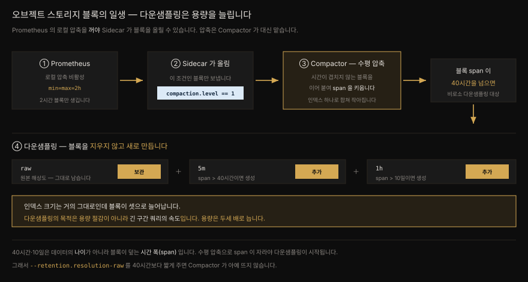

# Thanos 저장 경로 — Sidecar·Compactor·Store

---

> Thanos 는 VictoriaMetrics 나 Mimir 처럼 완성된 한 벌의 해법이 아닙니다. 필요한 것만 골라 끼우는 맥가이버 칼에 가깝습니다. 부품은 일곱이고 전부 `thanos` 바이너리의 서브커맨드입니다. 이 편은 그중 데이터가 오브젝트 스토리지로 흘러 들어갔다 나오는 경로를 따라갑니다. Sidecar 가 블록을 올리고 Compactor 가 압축하고 다운샘플링하며 Store 가 그것을 다시 꺼내 옵니다.


## 핵심 요약

> Thanos 의 세 목표는 **전역 쿼리 뷰·무제한 보존·컴포넌트 고가용성** 입니다. Sidecar 는 Prometheus 곁에 붙어 두 가지를 합니다. gRPC **StoreAPI** 를 열어 원격 쿼리를 중계하고 Prometheus 가 쓴 TSDB 블록을 그대로 오브젝트 스토리지에 올립니다. 이때 Prometheus 의 **로컬 압축을 반드시 꺼야** 합니다. 압축은 Compactor 가 대신 맡아 수평 압축과 다운샘플링을 수행하는데, **다운샘플링은 용량을 줄이는 기능이 아니라 늘리는 기능** 입니다. 긴 구간 쿼리를 빠르게 하려고 해상도가 다른 블록을 *추가로* 만들기 때문입니다. Store 는 오브젝트 스토리지의 게이트웨이로, `meta.json` 의 `thanos` 절을 보고 어떤 블록을 꺼낼지 정합니다.

이 편이 저장 경로라면 [`10-02`](./10-02.Thanos%20쿼리%20경로%20—%20Query·Query%20Frontend·Ruler·Receiver.md) 가 쿼리 경로입니다. 두 편이 함께 10장 전체를 덮습니다. Thanos 와 Mimir 가 같은 문제를 어떻게 다르게 푸는지는 [`09-02`](./09-02.VictoriaMetrics%20와%20Grafana%20Mimir.md) 에서 이미 대조해 뒀습니다.


## 학습 목표

> 이 절을 읽고 나면 아래 여섯 가지를 스스로 해낼 수 있습니다.

1. Thanos 의 세 목표를 말하고 왜 Thanos 를 확장의 첫걸음으로 권하는지 설명할 수 있습니다.
2. StoreAPI 가 무엇이고 어떤 컴포넌트가 그것을 구현하는지 압니다.
3. Sidecar 를 쓰려면 Prometheus 의 로컬 압축을 왜 꺼야 하는지, 어떻게 끄는지 압니다.
4. 수평 압축과 수직 압축의 차이를 그리고 수직 압축이 왜 위험한지 말할 수 있습니다.
5. 다운샘플링이 용량을 늘린다는 사실과 그럼에도 쓰는 이유를 설명할 수 있습니다.
6. Store 가 어떤 블록을 꺼낼지 정하는 근거와 파티셔닝·캐싱으로 확장하는 법을 압니다.


## 본문 정리

### 1. Thanos 개요

Thanos 프로젝트는 Improbable 에서 시작됐고 Prometheus 생태계의 두 인물 Bartłomiej Płotka 와 Fabian Reinartz 가 앞장섰습니다. 둘 다 Prometheus 자체와 여러 관련 프로젝트에 크게 기여한 사람들입니다. 얼마 뒤 프로젝트는 CNCF 에 기증됐고 지금은 **incubating** 등급입니다.

Thanos 가 내건 세 가지 목표는 이렇습니다.

1. 메트릭의 **전역 쿼리 뷰**
2. 메트릭의 **무제한 보존**
3. Prometheus 를 포함한 **컴포넌트의 고가용성**

핵심(원래의) 컴포넌트는 Sidecar·Store·Compact·Query 넷입니다. 각 컴포넌트는 `thanos` 바이너리의 **서브커맨드** 라서 부품마다 실행 파일을 따로 내려받을 필요가 없습니다. 이 부품들을 통해 Thanos 는 HA Prometheus 의 분산 쿼리, 오브젝트 스토리지에서의 장기 보존, remote write 수신, 여러 Prometheus 의 데이터셋을 가로지르는 룰 평가를 해냅니다.

> ⚠️ 집필 시점에 Thanos 는 아직 **1.0 을 내지 않았습니다.** 그래서 마이너 버전 사이의 안정성 보장이 없습니다. 다만 저자의 경험으로는 깨지는 변경이 드물고 최근 여덟 번의 마이너 릴리스에서 깨진 것은 대개 Thanos 가 노출하는 메트릭 이름 변경이었습니다. 이 장의 서술은 **v0.32.5** 기준입니다.

#### 왜 Thanos 인가

부품이 많아 복잡해 보이지만 저자는 지금까지 본 프로젝트 중 Thanos 가 **가장 단순하다** 고 말합니다. 각 부품의 기능 범위가 좁게 잘려 있어 이해하기 쉽고 전부 돌릴 필요도 없습니다. 저자는 모든 Thanos 컴포넌트를 실제로 다 쓰는 사람을 한 손에 꼽을 만큼밖에 못 봤다고 적습니다.

지속성 면에서도 든든합니다. 수백 명의 기여자를 둔 CNCF 프로젝트이니 라이선스나 기능을 유료화 쪽으로 비틀 위험이 없습니다. [`09-02`](./09-02.VictoriaMetrics%20와%20Grafana%20Mimir.md) 에서 본 VictoriaMetrics 의 걸림돌이 여기서는 문제가 되지 않습니다.

왜 Thanos 인가. **함께 자랄 수 있기 때문입니다.** 시작하는 수고가 적고 필요할 때 부품을 하나씩 더하면 됩니다. 그런 이유로 저자는 분산 쿼리나 장기 보존 같은 기능으로 Prometheus 환경을 넓히려는 사람에게 언제나 Thanos 를 첫 출발점으로 권합니다.

### 2. Thanos Sidecar

Sidecar 는 가장 근본적인 컴포넌트이고 Thanos 의 가장 인기 있는 두 기능을 가능하게 합니다. 중앙에서 여러 Prometheus 를 질의하는 일(Thanos Query 와 함께) 과 Prometheus TSDB 데이터를 오브젝트 스토리지에 백업하는 일입니다.

이름 그대로 Prometheus 서버 곁에서 "사이드카"로 돕니다. 엄밀히 말해 곁에 있어야만 하는 것은 **오브젝트 스토리지 업로드 기능을 쓸 때** 뿐이지만 쓰지 않더라도 곁에 두는 편이 좋습니다. Sidecar 와 Prometheus 사이의 지연을 최소로 줄이기 때문입니다.

#### StoreAPI — 네 개의 RPC

Sidecar 는 첫 번째 임무인 분산 쿼리를 **gRPC API** 를 열어 수행합니다. Thanos Query(또는 Ruler 같은 다른 컴포넌트) 가 여기에 말을 겁니다. 이 gRPC API 를 앞으로 **StoreAPI** 라 부릅니다. StoreAPI 는 Sidecar·Ruler·Receiver·Store·Query 다섯 컴포넌트가 구현하며 RPC 는 단 넷뿐입니다.

| RPC | 하는 일 |
|-----|---------|
| `Info` | 이 엔드포인트가 어떤 데이터를 갖고 있는지 알립니다 |
| `Series` | 실제 시계열 데이터를 스트림으로 돌려줍니다 |
| `LabelNames` | 라벨 이름 목록 |
| `LabelValues` | 라벨 값 목록 |

Thanos Query 는 StoreAPI 로 Sidecar 에 요청을 보내고 Sidecar 는 그 요청을 자기가 붙어 있는 Prometheus 로 넘깁니다. 이때 Sidecar 가 쓰는 것이 [9장에서 본](./09-01.remote%20write%20와%20remote%20read%20—%20프로토콜·에이전트·튜닝.md) Prometheus 의 **Remote Read API** 입니다. 그것으로 PromQL 쿼리를 실행해 결과를 돌려줍니다.

> 이 기능만 놓고 보면 Sidecar 는 사실상 프록시입니다. 그래서 Prometheus 와 같은 자리에 있지 않아도 됩니다. 노트북에서 Sidecar 를 띄우고 `--prometheus.url` 플래그를 아무 Prometheus 로나 겨눠도 동작합니다.

#### 블록 업로드 — 로컬 압축을 꺼야 합니다

Sidecar 의 다른 주 기능은 Prometheus 데이터를 오브젝트 스토리지로 보내는 일입니다. 이쪽은 Prometheus 가 TSDB 블록을 써 두는 데이터 디렉토리에 접근해야 하므로 **반드시 곁에 있어야** 합니다.

여기서 Thanos 의 성격이 드러납니다. Mimir 나 VictoriaMetrics 는 remote write 로 데이터를 보내면 그 소프트웨어의 규격에 맞춰 저장합니다. 반면 **Thanos 는 Prometheus 가 이미 써 놓은 TSDB 블록을 그대로 집어 올립니다.**

그러려면 Prometheus 의 내장 압축을 반드시 꺼야 합니다. 작은 블록 여럿을 큰 블록 하나로 합쳐 버리는 것을 막아야 하기 때문입니다. `--storage.tsdb.min-block-duration` 과 `--storage.tsdb.max-block-duration` 을 **같은 값** 으로 주면 됩니다(`2h` 권장). Thanos 는 `meta.json` 의 `compaction.level` 값이 1보다 큰 블록은 무시합니다.

> **압축된 블록 올리기**
> 기본적으로 Thanos 는 압축된 블록을 올리지 않지만 Sidecar 에 `--shipper.upload-compacted` 플래그를 주면 올립니다. 오직 **과거 데이터를 한 번 옮기는 일회성 작업** 에만 씁니다. 기존 압축 블록을 다 올린 뒤에는 플래그를 떼야 합니다.

#### 설정 리로더

Sidecar 의 마지막 기능은 디스크의 특정 파일이 바뀌면 Prometheus 를 자동으로 리로드하는 일입니다. Prometheus 에 `--web.enable-lifecycle` 플래그를 주면, Sidecar 가 설정 파일(`--reloader.config-file`) 이나 룰 파일(반복 가능한 `--reloader.rule-dir`) 의 변경을 감지해 Prometheus 에 리로드를 지시합니다.

리로더를 쓸 때는 설정 파일에 **변수 치환** 도 시킬 수 있습니다. `$(VARIABLE_NAME)` 꼴의 변수가 Sidecar 가 도는 서버·컨테이너의 환경변수 값으로 바뀝니다. 비밀 값을 설정에 꽂아 넣을 때 쓸모가 있습니다.

`--reloader.config-envsubst-file` 을 지정하면 Thanos 가 `--reloader.config-file` 을 읽어 치환한 결과를 그 경로에 씁니다. 이 구성에서 **Prometheus 는 `--reloader.config-envsubst-file` 이 가리키는 파일을 자기 설정 파일로 써야** 합니다.

#### 배포

kube-prometheus-stack 위에 얹습니다. Prometheus Operator 가 Thanos Sidecar 를 내장 지원하므로 값 몇 줄이면 됩니다.

```yaml
prometheus:
  prometheusSpec:
    thanos:
      objectStorageConfig:
        name: thanos-objstore-config
        key: "thanos.yaml"
  thanosServiceMonitor:
    enabled: true
```

오브젝트 스토리지 설정은 Secret 으로 넣습니다.

```yaml
apiVersion: v1
kind: Secret
metadata:
  name: thanos-objstore-config
  namespace: prometheus
stringData:
  thanos.yaml: |
    type: s3
    config:
      bucket: mastering-prometheus-thanos
      endpoint: us-ord-1.linodeobjects.com
      access_key: REDACTED
      secret_key: REDACTED
```

> 앞서 말한 `--storage.tsdb.min-block-duration`·`--storage.tsdb.max-block-duration` 을 **직접 끄지 않았다** 는 점에 주목합니다. Thanos Sidecar 를 켜면 **Prometheus Operator 가 알아서** 그렇게 해 줍니다.

`thanosServiceMonitor` 는 필수가 아니지만 Sidecar 용 ServiceMonitor 를 만들어 Prometheus 가 Sidecar 의 메트릭을 긁게 합니다. 메트릭은 많을수록 좋습니다.

Object Storage 버킷에 뭔가 보이기까지 **몇 시간** 걸릴 수 있습니다. Prometheus 가 압축되지 않은 새 블록을 써 내야 Sidecar 가 그것을 올리기 때문입니다.

### 3. Thanos Compactor

Compactor 는 오브젝트 스토리지에 놓인 TSDB 블록을 **압축하고 다운샘플링** 합니다. Prometheus 쪽 로컬 압축을 껐으니 누군가는 압축해야 하고 그 일을 이 부품이 맡습니다.

압축 방식 자체는 Prometheus 와 같습니다. 작은 블록 여럿을 가져와 인덱스와 샘플을 합쳐 더 큰 블록 하나를 만듭니다. 합쳐진 인덱스는 각 블록이 따로 인덱스를 갖고 있을 때보다 작습니다. **대부분의 시계열이 연속된 여러 블록에 걸쳐 존재한다** 는 전제에 기대는데, 거의 언제나 참입니다. 다른 점은 Compactor 가 압축하려면 블록을 오브젝트 스토리지에서 **내려받아야** 한다는 것뿐입니다.



#### 수평 압축과 수직 압축

지금까지 본 것은 전부 **수평 압축** 입니다. 블록들이 시간축(X축) 에서 겹치지 않고 연속한다는 사실에 근거해 합쳐집니다.

**수직 압축** 에서는 블록이 겹칩니다. 그럼에도 어떤 기준에 따라 함께 압축됩니다. 같은 스크레이프 대상을 같은 간격으로 긁는 Prometheus 가 여럿이라고 해 봅시다. Thanos Query 는 쿼리 시점에 HA 복제본의 결과를 중복 제거해 주지만 그 중복된 데이터를 오브젝트 스토리지에 죄다 쌓아 두는 것은 낭비로 보입니다. 저장 용량이 최소 두 배가 됩니다.

Compactor 에 아래 세 플래그를 주면 수직 압축이 켜집니다.

```bash
--compact.enable-vertical-compaction
--deduplication.replica-label=prometheus_replica
--deduplication.func=penalty
```

> ⚠️ 왜 플래그가 이렇게 많을까요. **수직 압축은 위험하고 파괴적일 수 있기 때문입니다.** 잘못 설정하면 과거 데이터를 심하게 망가뜨리거나 아예 쓸모없게 만들 수 있습니다. 비용 절감이 무엇보다 중요하고 위험을 감수할 수 있는 고급 용례에만 권장됩니다. **이 책만 읽고 켜지 마십시오.** 반드시 [공식 문서의 위험 항목](https://thanos.io/v0.32/components/compact.md/#vertical-compaction-risks) 을 읽어야 합니다.

#### 다운샘플링 — 용량을 줄이지 않습니다

Compactor 의 다른 핵심 기능은 다운샘플링입니다. 이것을 과거 메트릭의 저장 용량을 줄이는 수단으로 오해하는 일이 잦습니다. **정반대입니다. Thanos 의 다운샘플링을 쓰면 쓰는 용량이 늘어납니다.**

주된 목적은 **긴 시간 구간의 쿼리 성능** 을 높이는 데 있습니다. 샘플을 더 낮은 해상도로 합쳐 오브젝트 스토리지에서 가져와야 할 데이터의 양을 줄이는 방식입니다.

Thanos 는 설정할 수 없는 두 개의 해상도를 씁니다. **5분(5m)** 과 **1시간(1h)** 입니다. 적용 규칙은 이렇습니다.

1. 40시간보다 오래된 원본(raw) 데이터가 `5m` 해상도로 다운샘플링됩니다.
2. 10일보다 오래된 `5m` 해상도 데이터가 `1h` 해상도로 다운샘플링됩니다.

다운샘플링이 일어나면 새 해상도의 TSDB 블록이 **추가로** 만들어집니다. 그러니 Prometheus 에서 온 원본 블록에 더해 `5m` 블록과 `1h` 블록을 함께 갖게 됩니다.

> **해상도별 보존 정책**
> `--retention.resolution-raw`·`--retention.resolution-5m`·`--retention.resolution-1h` 로 해상도마다 다른 보존 기간을 줄 수 있습니다. 무엇을 하는지 완전히 이해한 것이 아니라면 **셋을 같은 값으로** 두십시오. 다르게 두면 예측하기 힘든 쿼리 동작을 만나기 쉽습니다.
> 예를 들어 raw 와 `5m` 은 90일, `1h` 는 365일을 보존한다면, 90일보다 오래된 데이터를 질의할 때 쿼리 step 이 **1시간 이상이어야** 합니다. 그러지 않으면 결과가 비어 돌아옵니다. 과거 데이터를 "확대"해 볼 능력이 크게 제약됩니다.

블록 안의 샘플 수가 줄어도 **인덱스 크기는 거의 그대로** 입니다. 그래서 다운샘플링을 쓰면 저장 용량이 최소 두 배, 아마 세 배가 되리라 예상해야 합니다. 긴 구간 쿼리의 속도 향상과 오브젝트 스토리지 요청 감소가 그만한 값어치가 있는지 저울질할 대목입니다. 다운샘플링을 아예 원치 않으면(권장하지 않습니다) `--downsampling.disable` 로 끕니다.

배포한 뒤 Compactor 는 최초 압축·다운샘플링을 마치고 나면 **5분마다**(`--wait-interval` 로 조정) 자동으로 계속 돕니다.

### 4. Thanos Store

Store 는 쓰기에 있어 아마 가장 단순한 컴포넌트입니다. 손볼 것이 많지 않고 자원도 별로 안 씁니다. 사실상 무상태이지만 오브젝트 스토리지의 블록 메타데이터를 채우는 시작 시간을 줄이려고 영속 저장소를 붙일 수는 있습니다.

Store 도 StoreAPI 를 구현하므로 Thanos Query 로 데이터를 끌어올 수 있습니다. 하는 일은 **오브젝트 스토리지로 가는 게이트웨이** 이고 그래서 "Store Gateway" 라 불리기도 합니다.

Sidecar 가 블록을 올릴 때, 그리고 Compactor 가 블록을 손볼 때, 그 블록의 `meta.json` 에 **`thanos` 절** 을 새로 씁니다(`meta.json` 자체는 3장 참조). Store 는 이 정보로 어떤 블록을 오브젝트 스토리지에서 꺼내야 할지 압니다. **external label 을 확인하고 블록의 시작·끝 시각을 확인하는** 두 가지를 조합합니다.

> 주의할 점이 하나 있습니다. **Thanos Sidecar 를 통해 로컬 Prometheus 에 그 데이터가 있더라도, 데이터는 여전히 오브젝트 스토리지에서 가져옵니다.** Thanos Query 가 쿼리와 관련 있을 법한 모든 StoreAPI 엔드포인트로 질의를 부채꼴로 뿌리기 때문입니다. 컴포넌트 종류를 가리지 않습니다.

오브젝트 스토리지 요청을 줄이고 싶다면 Store 에 `--max-time` 플래그를 줘서 겹침을 줄이는 것이 좋습니다. Prometheus 가 로컬에 7일치를 두도록 설정돼 있다면 Store 에 `--max-time="-7d"` 를 주어 최근 7일 데이터를 오브젝트 스토리지에서 끌어오지 않게 합니다. 물론 Prometheus 가 죽거나 데이터를 잃으면 그만큼 못 보게 될 위험은 있고 필요하면 언제든 플래그를 뗄 수 있습니다.

#### 확장 — 파티셔닝

Store 는 처음엔 단순하지만 오브젝트 스토리지에 쌓인 데이터가 많아지고 조회가 잦아지면 확장이 까다로워집니다. 몇 해치 데이터를 두고 주·달·해 단위 쿼리가 자주 날아들면 Store 하나로는 금세 병목이 됩니다.

파티셔닝은 Query Frontend 쪽보다 **수동적** 입니다. 자동으로 되지 않고 손으로 갈라야 합니다. 방법은 두 가지이고 함께 쓸 수도 있습니다.

**시간 기반.** Store 인스턴스마다 특정 시간 구간만 맡깁니다. 오브젝트 스토리지에 90일을 둔다면 Store 셋을 띄워 각각 0~29일 전, 30~59일 전, 60~90일 전을 맡깁니다. 인스턴스별 데이터셋을 줄여 자원 부담을 낮추고 여러 Store 가 독립적인 데이터셋 위에서 동시에 일해 쿼리를 더 병렬화합니다. `--min-time` 과 `--max-time` 으로 정하며 절대값(`2021-10-06T20:06:32Z`) 도 상대값(`-30d`) 도 됩니다.

**external label 기반.** 각 TSDB 블록은 자기가 나온 Prometheus 의 external label 을 `thanos` 절에 갖고 있습니다. 이것으로 샤딩합니다. `--selector.relabel-config-file` 또는 `--selector.relabel-config` 로 주며 지원하는 동작은 **`keep`·`drop`·`hashmod` 셋뿐** 입니다.

```yaml
# 특정 Prometheus 복제본의 블록만 다룹니다
- action: keep
  regex: "prometheus-mastering-prometheus-kube-0"
  source_labels:
    - prometheus_replica
```

특수 라벨 `__block_id` 로 hashmod 샤딩도 됩니다. [6장의 Prometheus 샤딩](./06-01.샤딩·페더레이션·고가용성.md) 과 같은 요령입니다.

```yaml
- action: hashmod
  source_labels: ["__block_id"]
  target_label: shard
  modulus: 3
- action: keep
  source_labels: ["shard"]
  regex: 0
```

modulus 3 이면 블록이 Store 세 대로 갈립니다. 각 Store 는 서로 다른 regex(`0`·`1`·`2`) 로 자기가 맡을 블록을 고릅니다.

#### 확장 — 캐싱

오브젝트 스토리지 요청이 잦으니 캐시가 값어치를 합니다. 비용으로도 지연으로도 이득입니다. Store 는 두 종류를 캐시하며 백엔드는 Memcached·Redis·인메모리 중 고릅니다.

- **인덱스 캐시** — TSDB 블록의 인덱스를 캐시해 posting 과 series 조회를 빠르게 합니다(3장 참조). 인덱스는 블록 안에서 가장 큰 단일 파일이라 캐시 효과가 큽니다.
- **청크 캐시** — 실제 TSDB 청크와 딸린 메타데이터를 담아 오브젝트 스토리지에서 다시 가져오지 않게 합니다. 인덱스 캐시와 따로 돕니다. **블록당 인덱스 파일은 하나뿐이지만 청크 세그먼트 파일은 여럿** 이므로, 요청 수를 줄이거나 레이트 리밋을 피하는 데는 이쪽 효과가 더 큽니다.


## 심화 학습

책 밖에서 원본 소스로 확인한 내용입니다. 대상은 책이 기준으로 밝힌 **Thanos v0.32.5** 입니다.

### 40시간·10일은 데이터의 "나이"가 아니라 블록의 "시간 폭"입니다

책은 다운샘플링 규칙을 이렇게 적습니다.

> 1. Raw data **older than** 40 hours is downsampled to the 5m resolution.
> 2. 5m resolution data **older than** 10 days gets downsampled to the 1h resolution.

값 자체는 맞습니다. 소스의 상수가 정확히 그렇습니다.

```go
// pkg/compact/downsample/downsample.go
const (
    ResLevel0 = int64(0)              // Raw data.
    ResLevel1 = int64(5 * 60 * 1000)  // 5 minutes in milliseconds.
    ResLevel2 = int64(60 * 60 * 1000) // 1 hour in milliseconds.
)

// Downsampling ranges i.e. minimum block size after which we start to downsample blocks
const (
    ResLevel1DownsampleRange = 40 * 60 * 60 * 1000      // 40 hours.
    ResLevel2DownsampleRange = 10 * 24 * 60 * 60 * 1000 // 10 days.
)
```

그런데 상수 위 주석이 "minimum **block size** after which we start to downsample" 이라고 말합니다. 실제 판정도 그렇습니다.

```go
// cmd/thanos/downsample.go
// Only downsample blocks once we are sure to get roughly 2 chunks out of it.
if m.MaxTime-m.MinTime < downsample.ResLevel1DownsampleRange {
    continue
}
```

비교 대상은 `m.MaxTime - m.MinTime`, 곧 **그 블록이 덮는 시간 폭** 입니다. 데이터가 얼마나 오래됐는지가 아닙니다. 주석이 이유까지 밝혀 둡니다. **블록에서 청크가 대략 2개는 나오도록 보장** 하려는 장치입니다.

실무적 차이가 있습니다. Prometheus 가 내놓는 블록은 2시간짜리이므로 갓 올라온 블록은 아무리 오래된 데이터를 담고 있어도 span 이 2시간이라 다운샘플링되지 않습니다. **수평 압축이 블록들을 이어 붙여 span 을 40시간 너머로 키운 뒤에야** 비로소 대상이 됩니다. 즉 다운샘플링은 압축의 *뒤* 를 따라옵니다. 순서가 거꾸로면 영영 일어나지 않습니다.

책의 서술은 결과적으로 얼추 맞습니다. 블록이 충분히 오래되면 대개 압축을 거쳐 span 도 커져 있기 때문입니다. 다만 "나이"로 외우면 Compactor 가 멈춰 있을 때 왜 다운샘플링이 안 되는지 설명하지 못합니다.

### `--retention.resolution-raw` 를 40시간보다 짧게 주면 Compactor 가 뜨지 않습니다

책은 해상도별 보존 정책을 다르게 주면 "예측하기 힘든 쿼리 동작"을 만난다고 경고합니다. 맞는 말이지만 소스에는 그보다 훨씬 단호한 **기동 시 검증** 이 있습니다.

```go
// cmd/thanos/compact.go
if retentionByResolution[compact.ResolutionLevelRaw].Milliseconds() != 0 {
    if !conf.disableDownsampling && retentionByResolution[compact.ResolutionLevelRaw].Milliseconds() < downsample.ResLevel1DownsampleRange {
        return errors.New("raw resolution must be higher than the minimum block size after which 5m resolution downsampling will occur (40 hours)")
    }
    ...
}
if retentionByResolution[compact.ResolutionLevel5m].Milliseconds() != 0 {
    if !conf.disableDownsampling && retentionByResolution[compact.ResolutionLevel5m].Milliseconds() < downsample.ResLevel2DownsampleRange {
        return errors.New("5m resolution retention must be higher than the minimum block size after which 1h resolution downsampling will occur (10 days)")
    }
    ...
}
```

바깥의 `!= 0` 이 중요합니다. 보존 기간 **`0` 은 "무제한"** 을 뜻하므로 검사를 아예 건너뜁니다. 곧 값을 주지 않았거나 `0` 으로 두면 걸리지 않고 **0 이 아닌 값을 너무 짧게 주었을 때만** 거부됩니다.

정리하면 다운샘플링이 켜져 있고(기본값입니다) 보존 기간을 명시했다면 이렇습니다.

| 플래그 | 최소값 | 어기면 |
|--------|--------|--------|
| `--retention.resolution-raw` | 40시간 | Compactor 가 **기동 실패** |
| `--retention.resolution-5m` | 10일 | Compactor 가 **기동 실패** |

"raw 를 1일만 보존하겠다"는 설정은 조용히 무시되는 것이 아니라 **에러로 거부됩니다.** 굳이 짧게 두려면 `--downsampling.disable` 을 함께 줘야 합니다(두 검사 모두 `!conf.disableDownsampling` 조건 아래 있습니다). 책이 "셋을 같은 값으로 두라"고 권한 것은 결과적으로 이 함정도 피하게 해 줍니다.

### StoreAPI 의 RPC 는 정확히 넷입니다

책은 StoreAPI 가 `Info`·`Series`·`LabelNames`·`LabelValues` 넷으로 이뤄진다고 적습니다. `rpc.proto` 가 그대로입니다.

```protobuf
service Store {
  rpc Info(InfoRequest) returns (InfoResponse);
  rpc Series(SeriesRequest) returns (stream SeriesResponse);
  rpc LabelNames(LabelNamesRequest) returns (LabelNamesResponse);
  rpc LabelValues(LabelValuesRequest) returns (LabelValuesResponse);
}

service WriteableStore {
  rpc RemoteWrite(WriteRequest) returns (WriteResponse) {}
}
```

주의할 점은 `RemoteWrite` 가 **별도 서비스(`WriteableStore`)** 라는 사실입니다. StoreAPI(`Store` 서비스) 에 속하지 않습니다. Receiver 가 remote write 를 받는 것은 이 다른 서비스를 구현하기 때문이지 StoreAPI 때문이 아닙니다. 책의 "네 개" 는 정확합니다.

`Series` 만 `stream` 인 것도 눈여겨볼 만합니다. 시계열 데이터는 양이 크므로 스트리밍으로 흘려보내고 나머지 셋은 단발 응답입니다.

### Sidecar 가 압축 블록을 거르는 코드

책의 "compaction.level 이 1보다 크면 무시한다"는 서술은 `shipper.go` 그대로입니다.

```go
// We only ship of the first compacted block level as normal flow.
if m.Compaction.Level > 1 {
    if !uploadCompacted {
        continue
    }
}
```

한 가지 표현을 바로잡아 둡니다. 책은 `--shipper.upload-compacted` 를 두고 "이 동작을 **비활성화(disable)** 할 수 있다"고 적는데, 코드상 이 플래그는 *건너뛰기* 를 비활성화합니다. 곧 **압축 블록 업로드를 활성화하는** 플래그입니다. 뜻은 통하지만 방향이 헷갈리기 쉽습니다.

또 하나, 압축 블록을 올릴 때는 겹침 검사가 따로 붙습니다.

```go
if m.Compaction.Level > 1 && !s.allowOutOfOrderUploads {
    if err := checker.IsOverlapping(ctx, m.BlockMeta); err != nil {
        return 0, errors.Errorf("Found overlap or error during sync, cannot upload compacted block, details: %v", err)
    }
}
```

일회성 과거 데이터 이관 중에 겹치는 블록을 만나면 업로드가 에러로 멈춥니다. 책이 "일회성 작업 뒤 플래그를 떼라"고 한 조언이 그냥 정리 정돈 차원이 아님을 알 수 있습니다.

### Compactor 의 `--wait-interval` 기본값

책은 "완료 후 5분마다 계속 돈다(`--wait-interval` 로 조정)"고 적습니다. 확인됩니다.

```go
cmd.Flag("wait-interval", "Wait interval between consecutive compaction runs and bucket refreshes. Only works when --wait flag specified.").
    Default("5m").DurationVar(&cc.waitInterval)
```

도움말이 덧붙이는 단서가 있습니다. **`--wait` 플래그를 함께 준 경우에만** 작동합니다. `--wait` 없이 띄우면 Compactor 는 한 번 돌고 끝납니다. 책은 이 조건을 적지 않습니다.


## 실무 적용

**Sidecar 를 붙이기 전 확인할 것.** Prometheus Operator 를 쓰면 로컬 압축이 자동으로 꺼지지만 직접 배포한다면 손으로 꺼야 합니다. 이것을 빠뜨리면 Sidecar 가 아무 블록도 올리지 않는데 에러도 나지 않아 원인 찾기가 고약합니다.

```bash
prometheus \
  --storage.tsdb.min-block-duration=2h \
  --storage.tsdb.max-block-duration=2h \
  --web.enable-lifecycle
```

**다운샘플링을 켤 때의 용량 계획.** 저장 용량이 두세 배가 된다는 것을 예산에 반영합니다. 그리고 보존 기간은 셋을 같게 두는 것이 안전합니다.

```bash
thanos compact \
  --wait \
  --retention.resolution-raw=90d \
  --retention.resolution-5m=90d \
  --retention.resolution-1h=90d
```

`--wait` 를 빠뜨리면 한 번 돌고 종료합니다. 그리고 raw 를 40시간보다, 5m 을 10일보다 짧게 주면 아예 기동하지 않습니다.

**오브젝트 스토리지 요청 줄이기.** Prometheus 로컬 보존 기간과 Store 의 `--max-time` 을 맞춥니다.

```bash
# Prometheus 가 로컬에 7일치를 둔다면
thanos store --max-time=-7d
```

**Store 를 세 대로 나누기.** 블록 단위 hashmod 샤딩이 가장 단순합니다. 각 Store 의 `regex` 만 바꿔 세 벌을 띄웁니다.

```yaml
- action: hashmod
  source_labels: ["__block_id"]
  target_label: shard
  modulus: 3
- action: keep
  source_labels: ["shard"]
  regex: 0        # 두 번째는 1, 세 번째는 2
```

**Spring 서비스 관점.** 여기까지는 애플리케이션이 전혀 관여하지 않습니다. Micrometer 는 `/actuator/prometheus` 를 낼 뿐이고 Prometheus 가 긁은 블록을 Sidecar 가 통째로 올립니다. 다만 애플리케이션이 만드는 **라벨 카디널리티가 곧 오브젝트 스토리지 비용** 이 됩니다. 다운샘플링은 샘플 수만 줄이고 **인덱스는 거의 그대로** 이므로, 카디널리티가 큰 메트릭은 다운샘플링으로 구제되지 않습니다. 줄이려면 `metric_relabel_configs` 로 스크레이프 단계에서 잘라야 합니다.


## 체크리스트

- [ ] Thanos 의 세 목표(전역 쿼리 뷰·무제한 보존·고가용성) 를 말할 수 있는가?
- [ ] 모든 컴포넌트가 `thanos` 바이너리의 서브커맨드라는 것을 아는가?
- [ ] StoreAPI 의 네 RPC 와 그것을 구현하는 다섯 컴포넌트를 말할 수 있는가?
- [ ] Sidecar 가 프록시로만 쓰일 때는 Prometheus 곁에 없어도 되는 이유를 아는가?
- [ ] Sidecar 로 블록을 올리려면 Prometheus 로컬 압축을 왜 꺼야 하는지 아는가?
- [ ] `compaction.level > 1` 인 블록이 왜 무시되는지 설명할 수 있는가?
- [ ] 수평 압축과 수직 압축의 차이를 그리고 수직 압축이 파괴적일 수 있는 이유를 아는가?
- [ ] 다운샘플링이 용량을 **늘린다** 는 것과 그럼에도 쓰는 이유를 아는가?
- [ ] 40시간·10일이 데이터의 나이가 아니라 블록의 시간 폭이라는 것을 아는가?
- [ ] 해상도별 보존 기간을 다르게 주면 무슨 일이 벌어지는지 아는가?
- [ ] Store 가 로컬 Prometheus 에 있는 데이터도 오브젝트 스토리지에서 가져온다는 것을 아는가?
- [ ] Store 의 relabel 이 `keep`·`drop`·`hashmod` 만 지원한다는 것을 아는가?


## 면접 관점

**Q. Thanos 는 VictoriaMetrics 나 Mimir 와 무엇이 다릅니까.**

A. 완성된 한 벌의 해법이 아니라 골라 끼우는 부품 모음입니다. 일곱 컴포넌트가 전부 `thanos` 바이너리의 서브커맨드이고 필요한 것만 돌리면 됩니다. 데이터를 받는 방식도 다릅니다. Mimir 나 VictoriaMetrics 는 remote write 로 받아 자기 규격으로 저장하지만 Thanos Sidecar 는 Prometheus 가 이미 써 놓은 TSDB 블록을 그대로 집어 오브젝트 스토리지에 올립니다. 그래서 시작하는 수고가 적고 필요할 때 부품을 더할 수 있습니다.

**Q. Thanos Sidecar 를 붙였는데 오브젝트 스토리지에 블록이 안 올라갑니다.**

A. 먼저 Prometheus 의 로컬 압축이 꺼져 있는지 봅니다. Thanos 는 `meta.json` 의 `compaction.level` 이 1보다 큰 블록을 무시하므로, Prometheus 가 작은 블록들을 큰 블록으로 합쳐 버리면 올릴 것이 없습니다. `--storage.tsdb.min-block-duration` 과 `--storage.tsdb.max-block-duration` 을 둘 다 `2h` 로 맞춥니다. Prometheus Operator 를 쓰면 Sidecar 를 켤 때 자동으로 처리됩니다. 그다음, Prometheus 가 압축되지 않은 새 블록을 써 내기까지 두 시간 넘게 걸릴 수 있다는 점도 감안합니다.

**Q. 다운샘플링을 켜면 저장 비용이 줄어듭니까.**

A. 아닙니다. 오히려 늘어납니다. 다운샘플링은 원본 블록을 지우지 않고 `5m` 해상도 블록과 `1h` 해상도 블록을 **추가로** 만듭니다. 샘플 수는 줄지만 인덱스 크기는 거의 그대로라 전체 용량이 두세 배가 됩니다. 목적은 용량 절감이 아니라 **긴 구간 쿼리의 속도** 입니다. 오브젝트 스토리지에서 읽어야 할 데이터가 줄어들기 때문입니다.

**Q. 다운샘플링은 언제 일어납니까.**

A. 흔히 "40시간 지난 데이터"라고 말하지만 정확히는 **블록이 덮는 시간 폭이 40시간을 넘을 때** 입니다. 소스의 판정이 `MaxTime - MinTime` 을 보고 이유는 그 블록에서 청크가 최소 두 개는 나오게 보장하기 위해서입니다. Prometheus 가 내놓는 블록은 2시간짜리이므로, Compactor 의 수평 압축이 블록을 이어 붙여 span 을 키운 뒤에야 다운샘플링 대상이 됩니다. 그래서 Compactor 가 멈춰 있으면 데이터가 아무리 오래돼도 다운샘플링되지 않습니다.

**Q. 해상도별로 보존 기간을 다르게 주면 어떻게 됩니까.**

A. 쿼리가 조용히 비어 돌아오는 일이 생깁니다. raw 와 `5m` 을 90일, `1h` 를 365일로 두면 90일보다 오래된 구간은 `1h` 블록만 남으므로 쿼리 step 이 1시간 이상이어야 결과가 나옵니다. 그보다 촘촘히 확대해 보면 빈 결과입니다. 게다가 raw 보존을 40시간보다, `5m` 보존을 10일보다 짧게 주면 Compactor 가 아예 기동하지 못하고 에러로 죽습니다. 특별한 이유가 없으면 셋을 같은 값으로 둡니다.

**Q. Thanos Store 가 이미 Prometheus 에 있는 최근 데이터까지 오브젝트 스토리지에서 가져옵니다. 왜 그렇습니까.**

A. Thanos Query 가 쿼리에 관련될 법한 모든 StoreAPI 엔드포인트로 질의를 부채꼴로 뿌리기 때문입니다. 컴포넌트 종류를 가리지 않으므로 Sidecar 와 Store 가 같은 구간을 중복해 응답합니다. 오브젝트 스토리지 요청을 줄이려면 Store 에 `--max-time` 을 줘서 겹치는 구간을 잘라 냅니다. Prometheus 가 로컬에 7일을 두면 `--max-time=-7d` 로 두는 식입니다. 대신 Prometheus 가 죽으면 그 구간을 못 보게 될 위험을 감수합니다.


## 참고 자료

- 원본: *Mastering Prometheus* (Packt, ISBN 9781805125662) — Chapter 10, Extending Prometheus Globally with Thanos
- [Thanos 공식 문서](https://thanos.io/) · [Sidecar](https://thanos.io/v0.32/components/sidecar.md) · [Compactor 수직 압축의 위험](https://thanos.io/v0.32/components/compact.md/#vertical-compaction-risks) · [Store 샤딩](https://thanos.io/v0.32/thanos/sharding.md/)
- 소스(v0.32.5): [`pkg/store/storepb/rpc.proto`](https://github.com/thanos-io/thanos/blob/v0.32.5/pkg/store/storepb/rpc.proto) · [`pkg/compact/downsample/downsample.go`](https://github.com/thanos-io/thanos/blob/v0.32.5/pkg/compact/downsample/downsample.go) · [`cmd/thanos/downsample.go`](https://github.com/thanos-io/thanos/blob/v0.32.5/cmd/thanos/downsample.go) · [`cmd/thanos/compact.go`](https://github.com/thanos-io/thanos/blob/v0.32.5/cmd/thanos/compact.go) · [`pkg/shipper/shipper.go`](https://github.com/thanos-io/thanos/blob/v0.32.5/pkg/shipper/shipper.go)
- [kube-thanos](https://github.com/thanos-io/kube-thanos) · [예제 코드](https://github.com/PacktPublishing/Mastering-Prometheus)
- 이어지는 편: [`10-02` 쿼리 경로 — Query·Query Frontend·Ruler·Receiver](./10-02.Thanos%20쿼리%20경로%20—%20Query·Query%20Frontend·Ruler·Receiver.md)
