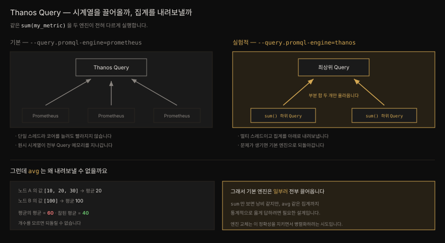
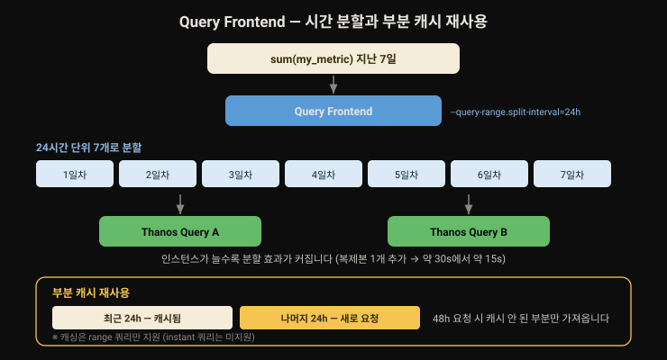
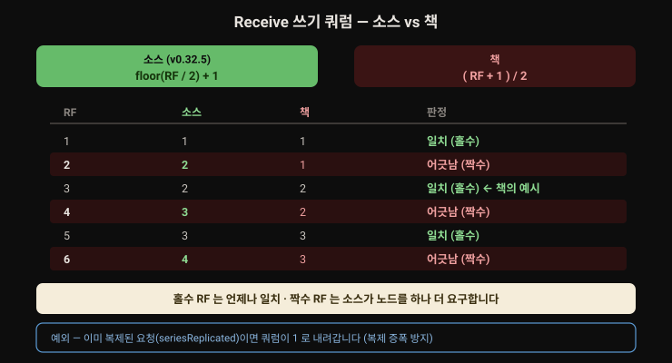

# Thanos 쿼리 경로 — Query·Query Frontend·Ruler·Receiver

---

> 앞 편이 데이터를 오브젝트 스토리지로 밀어 넣고 다시 꺼내는 경로였다면, 이 편은 그 데이터를 *읽는* 경로입니다. Query 가 StoreAPI 를 구현한 모든 엔드포인트로 질의를 부채꼴로 뿌리고 Query Frontend 가 그 앞에서 쿼리를 쪼개고 캐시하며 Ruler 가 여러 Prometheus 를 가로질러 룰을 평가합니다. 마지막 Receiver 는 방향을 뒤집어 remote write 를 받습니다.


## 핵심 요약

> Thanos Query 는 StoreAPI 엔드포인트들로 쿼리를 부채꼴로 뿌려 결과를 모읍니다. 기본 PromQL 엔진은 **단일 스레드이고 모든 시계열을 자기 메모리로 끌어온 뒤** 집계하는데, `avg` 처럼 내려보낼 수 없는 집계까지 정확히 답하려면 그래야 하기 때문입니다. Thanos 자체 엔진(실험적) 은 멀티 스레드이고 하위 Query 노드로 집계를 **내려보냅니다.** Query Frontend 는 앞단에서 시간 구간으로 쿼리를 쪼개고(기본 `24h`) 결과를 캐시합니다. Ruler 는 Thanos Query 를 통해 룰을 평가하므로 **Query 가 죽으면 룰도 죽습니다.** 그래서 로컬 Prometheus 의 룰 평가를 대체하지 말고 보태는 쪽으로 씁니다. Receiver 는 remote write 를 받고 Ketama 해시링으로 확장하며 **중복 제거 기능이 없습니다.**

앞 편 [`10-01`](./10-01.Thanos%20저장%20경로%20—%20Sidecar·Compactor·Store.md) 이 저장 경로를 다뤘습니다. remote write 프로토콜 자체는 [`09-01`](./09-01.remote%20write%20와%20remote%20read%20—%20프로토콜·에이전트·튜닝.md) 에 정리돼 있으므로 Receiver 절에서 되풀이하지 않습니다.


## 학습 목표

> 이 절을 읽고 나면 아래 여섯 가지를 스스로 해낼 수 있습니다.

1. Thanos Query 가 엔드포인트를 찾는 세 방식(정적·`dns+`·`dnssrv+`) 을 구분할 수 있습니다.
2. 기본 PromQL 엔진이 왜 모든 시계열을 끌어오는지 `avg` 를 예로 설명할 수 있습니다.
3. Query Frontend 의 시간 분할과 수직 샤딩이 각각 무엇을 쪼개는지 압니다.
4. Ruler 가 로컬 룰 평가를 대체하면 안 되는 이유를 가용성 관점에서 말할 수 있습니다.
5. Ruler 의 stateless 모드가 무엇을 포기하고 무엇을 얻는지 압니다.
6. Receiver 의 해시링·복제 계수·중복 제거 부재를 설명할 수 있습니다.


## 본문 정리

### 1. Thanos Query

Query 도 가장 근본적인 컴포넌트 중 하나입니다. 이것이 없으면 Sidecar 를 둘 이유가 별로 없습니다. 여러 데이터 소스를 가로질러 PromQL 쿼리를 실행하는 웹 UI 와 API 를 제공합니다. 데이터 소스란 Sidecar 를 통한 Prometheus, Store 를 통한 오브젝트 스토리지의 메트릭 같은 것들입니다.

웹 UI 는 Prometheus 웹 UI 를 써 본 사람에게 익숙합니다. 기능과 사용 경험이 사실상 같습니다. 쿼리 API 도 **100% PromQL 을 준수** 하므로 Grafana 에서 Prometheus 타입 데이터 소스로 쓸 수 있습니다. 저자가 다닌 회사들에서는 아예 Thanos Query 를 Grafana 의 기본 데이터 소스로 쓰는 경향이 있었다고 합니다.

> [`09-02`](./09-02.VictoriaMetrics%20와%20Grafana%20Mimir.md) 의 VictoriaMetrics 와 견주면 차이가 또렷합니다. MetricsQL 은 PromQL 의 상위집합이라 같은 쿼리가 다른 값을 낼 수 있지만 Thanos Query 는 PromQL 준수를 지향합니다.

#### 엔드포인트를 찾는 세 가지 방법

Query 는 StoreAPI 를 구현한 엔드포인트 하나 이상에 붙어 동작합니다. 반복 가능한 `--endpoint` 플래그로 지정하며 세 가지 형태를 지원합니다.

| 형태 | 예 | 동작 |
|------|-----|------|
| 정적 | `--endpoint=192.168.1.2:10901` | 주소를 그대로 씁니다 |
| `dns+` | `--endpoint=dns+thanos-sidecars.mycompany.com:10901` | A/AAAA 레코드를 조회해 반환된 모든 IP 를 엔드포인트로 더합니다 |
| `dnssrv+` | `--endpoint=dnssrv+_grpc._tcp.prometheus-operated.prometheus.svc.cluster.local` | SRV 레코드를 봅니다 |

쿠버네티스에서는 클러스터 DNS 의 Service SRV 레코드를 그대로 쓸 수 있어 `dnssrv+` 가 특히 유용합니다.

> **재미있는 사실**
> Thanos Query 자신도 StoreAPI 를 구현합니다. 그래서 **Thanos Query 를 다른 Thanos Query 에 붙일 수 있습니다.** 이 성질이 곧이어 볼 분산 쿼리 실행의 토대가 됩니다.

#### 기본 PromQL 엔진의 한계

역사적으로, 그리고 집필 시점에도 기본값으로, Thanos Query 는 Prometheus 가 쓰는 것과 같은 PromQL 엔진을 씁니다. 규모가 커지면 두 가지가 걸립니다.

첫째, Prometheus 의 PromQL 엔진은 **단일 스레드** 입니다. CPU 코어를 늘려 Query 인스턴스를 수직 확장해도 쿼리가 빨라지지 않습니다.

둘째, 더 두드러지는 문제로, Thanos Query 는 **집계를 수행하기 전에 관련된 모든 시계열을 자기 메모리로 끌어와야** 합니다. `sum(my_metric)` 을 던지면, 각 데이터 소스에서 `sum(my_metric)` 을 돌려 그 결과들을 합치는 것이 아니라, 모든 데이터 소스에서 `my_metric` 자체를 받아 온 뒤 비로소 `sum` 을 적용합니다.

`sum` 만 보면 낭비 같지만 **이것은 의도된 설계입니다.** `avg` 같은 다른 집계까지 통계적으로 정확하게 답하려면 그래야 하기 때문입니다. **평균의 평균은 참된 평균이 아니므로** `avg` 의 평가를 개별 Prometheus 로 내려보낼 수 없습니다.



#### Thanos 자체 PromQL 엔진

Query Frontend 의 쿼리 샤딩이나 query pushdown 같은 기능으로 특정 쿼리를 개선해 볼 수는 있습니다. 다만 둘 다 적용 범위가 좁고 수익이 금세 줄어듭니다. 저자는 그것들을 굴리느라 시간을 너무 쓰지 말라고 권합니다.

대신 Thanos 프로젝트는 **자체 PromQL 엔진** 을 만들고 있습니다. 최근 판의 Thanos 에는 모두 딸려 오고 `--query.promql-engine` 플래그로 고릅니다. 기본값은 `prometheus` 이고 `thanos` 로 바꿀 수 있습니다. 이 엔진은 **멀티 스레드** 이며 Thanos Query 인스턴스들을 가로지르는 **분산 실행** 을 가능하게 합니다.

앞서 Thanos Query 를 다른 Thanos Query 에 엔드포인트로 붙일 수 있다고 한 것이 여기서 빛납니다. 상위 Query 노드가 쿼리 실행의 일부를 하위 Query 노드에 **위임** 하기 때문입니다. 앞의 `sum(my_metric)` 이 이 엔진에서 도는 순서는 이렇습니다.

1. 하위 Query 노드 둘에서 각각 `sum(my_metric)` 을 실행합니다.
2. 각 하위 노드는 다시 자기 밑의 Prometheus 둘에서 `my_metric` 을 끌어와 합을 냅니다.
3. 최상위 Query 는 그 **두 부분 합만** 더하면 됩니다.

> ⚠️ 2023년 말 기준으로 Thanos PromQL 엔진은 여전히 **실험적** 입니다. 다만 쿼리 실행에 문제가 생기면 언제나 기본 Prometheus 엔진으로 되돌아가게 돼 있습니다.

### 2. Thanos Query Frontend

Query Frontend 는 Thanos Query 앞에 두어 쿼리 성능을 높이는 서비스입니다. 큰 구간의 쿼리를 작게 쪼개고 결과를 캐시합니다. Mimir 의 전신인 [Cortex](https://github.com/cortexproject/cortex) 가 구현한 비슷한 컴포넌트에 기반합니다. **쿼리의 전처리기** 로 생각하면 됩니다. 실제 작업 대부분은 여전히 하류의 Query 가 합니다.

#### 시간 기반 분할

`--query-range.split-interval` 이 기본 **`24h`** 로 잡혀 있습니다. 지난 일주일 구간으로 `sum(my_metric)` 을 던지면 Query Frontend 는 그것을 하루치씩 **일곱 개의 쿼리로 쪼개** 자기가 붙어 있는 Query 인스턴스들에 나눠 줍니다.

쿼리를 병렬화하고 하류 쿼리의 부담을 줄이는 효과가 있습니다. 큰 쿼리를 다루기 좋은 덩어리로 나누므로 **개별 Query 인스턴스가 OOM 으로 죽을 위험** 도 낮아집니다. 시계열이 수천만에서 수억 개인 큰 환경에서 의미 있는 개선입니다.



#### 수직 샤딩

시간이 아니라 **라벨** 로 쿼리를 쪼개는 것이 수직 샤딩입니다. 그래서 쿼리에 `by` 같은 **집계 연산자가 반드시 들어 있어야** 동작합니다. 그래야 프론트엔드가 StoreAPI 엔드포인트에 정보를 전파해 관련된 시계열의 부분집합만 돌려받을 수 있습니다.

```
up{pod="prometheus-0", region="us-east", role="infra"}
up{pod="prometheus-0", region="jp-osa", role="infra"}
up{pod="prometheus-1", region="us-east", role="apps"}
up{pod="prometheus-1", region="jp-osa", role="apps"}
```

`--query-frontend.vertical-shards` 를 `2` 로 두고 `count by (pod) (up)` 을 던지면, 쿼리가 `pod` 라벨 값을 기준으로 두 샤드로 갈립니다.

쿼리를 빠르게 하고 데이터 경로의 메모리를 줄이지만 **집계가 있어야만 쓸 수 있다는 제약** 때문에 적용 범위가 좁습니다. 저자는 앞서 본 자체 PromQL 엔진 쪽이 더 일관된 샤딩과 위임을 하므로 그쪽에서 더 큰 성능 이득을 볼 것이라 말합니다.

#### 캐싱

자주 보는 Grafana 대시보드를 여럿이 동시에 열어 두면 같은 쿼리를 몇 번이고 다시 도는 것이 낭비입니다. Query Frontend 는 결과를 캐시해 겹치는 구간의 후속 쿼리에 재사용합니다. **부분적으로만 캐시된 경우도 영리하게 처리** 합니다. 지난 24시간 결과가 캐시돼 있는데 48시간을 요청하면, 캐시되지 않은 나머지만 요청합니다.

> ⚠️ 캐싱은 **range 쿼리만** 지원합니다. instant 쿼리는 집필 시점에 지원하지 않습니다.

백엔드는 셋 중에 고릅니다. **인메모리·Memcached·Redis** 입니다. 인메모리 캐시는 Query Frontend 로컬에만 남아 여러 인스턴스가 공유할 수 없으므로 프로덕션에서는 Memcached 나 Redis 가 낫습니다.

쿼리 결과 말고 **StoreAPI 가 돌려준 라벨** 도 캐시합니다. Thanos 와 Grafana UI 의 쿼리 빌더 자동완성이 라벨 이름과 값을 채울 때 씁니다. 다만 설정이 따로입니다. 라벨은 `--labels.response-cache-config-file`, 쿼리 결과는 `--query-range.response-cache-config-file` 입니다. 백엔드는 같은 것을 써도 됩니다.

저자가 잰 결과, 1주일 구간에서 아래 쿼리가 Query Frontend 를 거치니 **33% 이상 빨라졌습니다**(약 30초 → 약 20초).

```pseudocode
histogram_quantile(0.99, rate(etcd_request_duration_seconds_bucket[5m]))
```

Query 복제본을 하나 더 늘리자 절반(약 30초 → 약 15초) 으로 줄었습니다. 쪼갠 쿼리를 받아 줄 인스턴스가 늘어야 분할의 효과가 나옵니다. 분할이 얼마나 일어나는지는 `thanos_frontend_split_queries_total` 로 봅니다.

### 3. Thanos Ruler

Ruler 는 고급 용례를 위한 독특한 기능을 엽니다. **여러 Prometheus 인스턴스를 가로질러 Prometheus 룰을 평가** 하는 일입니다. 서비스를 여러 리전에 배포하고 리전마다 Prometheus 를 두었다면, Ruler 로 그 전부를 아우르는 룰을 평가해 서비스의 총체적 그림을 얻습니다. **SLO** 같은 것을 재기에 좋습니다.

Ruler 는 Thanos Query 엔드포인트 하나 이상에 붙어 쿼리를 던집니다. 여럿을 지정하면 **라운드 로빈** 으로 분산합니다. 곧 룰의 쿼리가 지정된 모든 Query 에서 평가되는 것이 아니라, 쿼리마다 하나가 골라져 쓰입니다.

recording rule 평가로 만들어진 데이터는 Prometheus 에서와 같은 방식으로 **로컬 TSDB** 에 저장됩니다. 다만 Ruler 가 블록을 오래 들고 있으라고 만든 것은 아닙니다. 블록이 flush 되면(2시간마다, `--tsdb.block-duration`) 오브젝트 스토리지로 올라갑니다. 업로드 실패에 대비해 로컬에는 기본 **48시간** 남겨 둡니다(`--tsdb.retention`).

#### 룰 평가를 대체하지 말고 보태십시오

Ruler 는 Alertmanager 에 붙어 알림 룰을 평가하고 보낼 수도 있습니다. 다만 저자는 실무에서 이 용례를 덜 봤다고 합니다. **개별 Prometheus 의 로컬 룰 평가를 Ruler 로 대체하는 것을 권하지 않기** 때문입니다. Ruler 는 **대체(substitutive) 가 아니라 보완(additive)** 이어야 합니다.

이유는 가용성입니다. 룰 안의 PromQL 표현식은 쿼리가 유효하기만 하면 **Prometheus 로컬에서 돌 때 사실상 절대 실패하지 않습니다.** 반면 Thanos Ruler 는 Thanos Query 가 살아 있어야 하고 따라서 이행적으로 Thanos Sidecar 와 그 아래 Prometheus 들에도 닿을 수 있어야 합니다. 의존의 사슬이 길어진 만큼 깨질 곳이 많습니다.

알림 룰을 Ruler 에 아예 두지 말라는 말은 아닙니다. **어떤 알림 룰을 Ruler 에 두고 어떤 것을 개별 Prometheus 에 둘지 신중히 고르라** 는 뜻입니다.

#### stateless 모드

Ruler 의 기본 동작은 stateful 입니다. 쿼리 결과를 로컬 TSDB 에 저장하기 때문입니다. `--remote-write.config-file` 또는 `--remote-write.config` 로 remote write 설정을 주면 **stateless 모드** 로 돕니다. 문법은 [9장의 Prometheus remote write 설정](./09-01.remote%20write%20와%20remote%20read%20—%20프로토콜·에이전트·튜닝.md) 과 같습니다.

Ruler 를 수평 확장하면서 결과 시계열의 저장과 중복 제거를 안정적으로 해야 하는 용례에서 태어났고 그런 용례에 권장됩니다. 이 모드에서 Ruler 는 자기가 만든 시계열 데이터를 설정된 원격 저장소로 보냅니다. Prometheus remote write 프로토콜을 받는 곳이면 어디든 됩니다. 실제 Prometheus 인스턴스일 수도, 곧 볼 Thanos Receive 일 수도 있습니다.

이 모드에서 달라지는 것들이 있습니다.

- 로컬에 질의할 데이터가 없으므로 **StoreAPI 엔드포인트를 더 이상 노출하지 않습니다.**
- 따라서 오브젝트 스토리지에 블록도 올리지 않습니다.
- 대신 **Prometheus 의 에이전트 모드처럼 WAL 만 쓰는 저장** 방식을 씁니다.
- 그럼에도 Alertmanager 로 알림을 보내는 일은 계속합니다.

### 4. Thanos Receiver

Receiver("Receive") 는 마지막 컴포넌트이고 설정하기에 따라 스택에서 가장 복잡한 부품이 될 수 있습니다. 멀티테넌트와 대규모 용례를 위해 설정 항목이 지극히 많기 때문입니다. 다만 하는 일의 중심은 remote write 데이터를 받는 것이라, [9장](./09-01.remote%20write%20와%20remote%20read%20—%20프로토콜·에이전트·튜닝.md) 을 읽었다면 새로울 것이 적습니다.

다른 컴포넌트처럼 Receive 도 오브젝트 스토리지에 붙어 TSDB 블록을 올립니다. 데이터를 받는 동안 로컬 TSDB 를 유지하고 2시간마다 블록을 flush 해 올립니다. Ruler 와 달리 **로컬 복사본을 더 오래 둡니다.** 기본 **15일** 입니다(`--tsdb.retention`).

> ⚠️ **중복 제거에 관하여**
> VictoriaMetrics 나 Mimir 같은 다른 remote write 목적지와 달리 **Thanos Receive 에는 중복 제거 기능이 없습니다.** Receive 로 보낸 데이터를 중복 제거하려면 Compactor 의 **수직 압축** 을 설정해야 합니다([`10-01`](./10-01.Thanos%20저장%20경로%20—%20Sidecar·Compactor·Store.md) 참조). 그 위험도 함께 떠안는다는 뜻입니다.

#### 해시링과 Ketama

확장을 위해 Receive 는 **해시링** 을 구현해 들어오는 메트릭을 여러 Receive 백엔드로 흩뿌립니다. 기본은 우리가 다른 곳에서도 본 단순한 **hashmod** 입니다. 그런데 이것은 Receive 인스턴스 수를 늘리거나 줄일 때 문제가 됩니다. 시계열이 이전에 가던 백엔드로 더는 가지 않게 되기 때문입니다.

지금은 **Ketama 일관 해싱** 알고리즘이 권장됩니다. `--receive.hashrings-algorithm=ketama` 를 주면 됩니다. 일관 해싱의 자세한 내용은 이 책의 범위 밖이지만 요점은 Ketama 가 **인스턴스를 넣고 뺄 때 훨씬 덜 어지럽힌다** 는 데 있습니다.

해시링은 JSON 설정 파일로 정의합니다(`--receive.hashrings-file`). 멀티테넌시를 쓰면 해시링이 여럿일 수 있습니다.

```json
[
  {
    "endpoints": [
      "192.168.1.128:10901",
      "192.168.1.129:10901",
      "192.168.1.130:10901"
    ]
  }
]
```

#### 복제 계수와 쿼럼

remote write 백엔드를 굴릴 때 데이터 내구성은 무엇보다 중요합니다. 그래서 Receive 는 들어오는 데이터의 **복제 계수** 를 설정하게 합니다. 복제 계수를 주면 들어온 데이터가 그 안의 **과반수 노드** 에 성공적으로 쓰여야 합니다.

책은 이렇게 적습니다. 데이터가 `( REPLICATION_FACTOR + 1 ) / 2` 개 노드에 성공적으로 쓰이지 않으면 수집이 실패로 간주됩니다. 예컨대 복제 계수 3 이면 최소 두 개의 Receive 백엔드에 성공해야 전체 요청이 성공입니다. `--receive.replication-factor` 로 설정하고 기본값은 **1** 입니다.

> 이 공식은 홀수 복제 계수에서만 소스와 일치합니다. 아래 심화 학습에서 다룹니다.

멀티테넌시를 위한 나머지 설정은 Thanos 를 관리형 고객 서비스로 굴리는 것 같은 특수한 용례를 위한 것이라 이 책은 다루지 않습니다.

Receive 로 들어온 메트릭에는 `receive`·`replica`·`tenant_id` 라벨이 자동으로 붙습니다. `up{receive="true"}` 같은 쿼리로 걸러 볼 수 있습니다.

### 5. Thanos tools

`thanos` CLI 에는 `thanos tools` 서브커맨드가 있습니다. 오브젝트 스토리지 버킷과 그 안의 TSDB 블록을 다루는 여러 도구가 들어 있고 Ruler 가 쓰는 recording rule 과 alerting rule 을 검증하는 명령도 있습니다. 이미 자리 잡은 환경에서 주로 쓰는 것이라 책은 개별 설명을 생략합니다. 배포한 Thanos 파드 안에서 `thanos tools --help` 로 목록을 볼 수 있습니다.


## 심화 학습

책 밖에서 원본 소스로 확인한 내용입니다. 대상은 **Thanos v0.32.5** 입니다.

### 쿼럼 공식이 짝수 복제 계수에서 어긋납니다

책은 이렇게 적습니다.

> if data is not successfully written to `( REPLICATION_FACTOR + 1 ) / 2` nodes, then the ingestion will be considered to have failed.

소스의 계산은 다릅니다.

```go
// pkg/receive/handler.go
// writeQuorum returns minimum number of replicas that has to confirm write success
// before claiming replication success.
func (h *Handler) writeQuorum() int {
    return int((h.options.ReplicationFactor / 2) + 1)
}
```

`ReplicationFactor` 의 타입이 `uint64` 이므로 `/` 는 **버림 나눗셈** 입니다. 곧 실제 쿼럼은 `floor(RF/2) + 1` 입니다. 두 식을 나란히 놓으면 이렇습니다.

| 복제 계수 | 소스 `floor(RF/2)+1` | 책 `(RF+1)/2` | 일치 |
|-----------|---------------------|---------------|------|
| 1 | 1 | 1 | ✓ |
| 2 | **2** | 1 | ✗ |
| 3 | 2 | 2 | ✓ |
| 4 | **3** | 2 | ✗ |
| 5 | 3 | 3 | ✓ |
| 6 | **4** | 3 | ✗ |

**홀수에서는 언제나 같고 짝수에서는 언제나 다릅니다.** 책이 든 예(복제 계수 3 → 최소 2개) 는 홀수라서 옳습니다. 그러니 책의 *예시* 는 맞고 *공식* 은 틀렸습니다.



실무에서 복제 계수는 홀수로 잡는 것이 관례이므로 이 오차가 실제로 문제를 일으킬 일은 드뭅니다. 그래도 짝수를 쓴다면 책의 식보다 노드 하나가 더 필요하다는 것을 알아야 합니다. 복제 계수 4 는 3개 성공을 요구하지 2개가 아닙니다.

한 가지 덧붙이면, 코드에는 예외가 있습니다.

```go
quorum := h.writeQuorum()
if seriesReplicated {
    quorum = 1
}
```

이미 복제를 거쳐 전달된 요청(`seriesReplicated`) 이면 쿼럼이 1 로 내려갑니다. 복제본끼리 서로에게 다시 복제를 요구하는 무한 증폭을 막는 장치입니다.

### `--query.promql-engine` 과 분할 간격의 기본값

책이 밝힌 두 기본값을 확인했습니다. 모두 맞습니다.

```go
// cmd/thanos/query.go
defaultEngine := cmd.Flag("query.promql-engine", "Default PromQL engine to use.").
    Default(string(apiv1.PromqlEnginePrometheus)).
    Enum(string(apiv1.PromqlEnginePrometheus), string(apiv1.PromqlEngineThanos))

// cmd/thanos/query_frontend.go
cmd.Flag("query-range.split-interval", "...").
    Default("24h").DurationVar(&cfg.QueryRangeConfig.SplitQueriesByInterval)
```

같은 파일에서 책이 언급하지 않은 형제 플래그 둘을 봤습니다. `--query-range.min-split-interval` 과 `--query-range.max-split-interval` 인데 둘 다 기본 `0`(비활성) 입니다. 도움말이 못을 박아 둡니다.

> Using this parameter is not allowed with `query-range.split-interval`.

고정된 24시간 대신 쿼리 길이에 따라 분할 수를 정하고 싶을 때 쓰는, 나중에 추가된 방식입니다. 책의 서술이 틀린 것은 아니고 지금은 선택지가 하나 더 있다는 뜻입니다.

### Ruler 와 Receiver 의 보존 기본값

책이 든 세 숫자를 모두 확인했습니다.

| 컴포넌트 | 플래그 | 기본값 | 책 |
|---------|--------|--------|-----|
| Ruler | `--tsdb.block-duration` | `2h` | 2시간 ✓ |
| Ruler | `--tsdb.retention` | `48h` | 48시간 ✓ |
| Receive | `--tsdb.retention` | `15d` | 15일 ✓ |

Receive 의 도움말은 책에 없는 사실을 덧붙입니다.

> `0d` - disables the retention policy (i.e. infinite retention)

곧 `0d` 를 주면 보존 정책이 꺼지고 **무한 보존** 이 됩니다.

### Receive 의 해시링 기본값도 확인됩니다

```go
cmd.Flag("receive.hashrings-algorithm", "The algorithm used when distributing series in the hashrings. ...").
    Default(string(receive.AlgorithmHashmod)).
    EnumVar(&rc.hashringsAlgorithm, string(receive.AlgorithmHashmod), string(receive.AlgorithmKetama))

cmd.Flag("receive.replication-factor", "How many times to replicate incoming write requests.").
    Default("1").Uint64Var(&rc.replicationFactor)
```

기본 알고리즘이 `hashmod` 이고 `ketama` 가 대안이라는 것, 복제 계수 기본이 `1` 이라는 것 모두 책 그대로입니다. 도움말에 한 줄이 더 있습니다.

> Will be overwritten by the tenant-specific algorithm in the hashring config.

곧 해시링 설정 파일에 테넌트별 알고리즘을 적으면 **이 플래그를 덮어씁니다.**

### `avg` 를 왜 내려보낼 수 없는지 — 숫자로

책은 "평균의 평균은 참된 평균이 아니다"라고만 적고 넘어갑니다. 수를 넣어 보면 분명해집니다. 노드 A 가 `[10, 20, 30]`, 노드 B 가 `[100]` 을 갖고 있다고 합시다.

- 각 노드에서 `avg` 를 먼저 구하면 A 는 20, B 는 100. 이 둘의 평균은 **60**.
- 전부 모아 한 번에 구하면 `(10+20+30+100) / 4` = **40**.

차이의 원인은 **개수 정보가 소실** 되는 데 있습니다. 20 이라는 값만 받아서는 그것이 세 개의 평균인지 하나의 값인지 알 수 없습니다. `sum` 은 이 문제가 없습니다. 합의 합은 언제나 참된 합이기 때문입니다. `count` 도, `min`·`max` 도 마찬가지입니다.

여기서 분산 실행이 가능한 집계와 그렇지 않은 집계가 갈립니다. `avg` 를 굳이 내려보내려면 각 노드가 `(합, 개수)` 쌍을 함께 올려 보내야 합니다. Thanos 자체 엔진의 분산 실행이 하는 일도 결국 어떤 집계를 어떻게 쪼갤 수 있는지 판별하는 데 있습니다.

> 참고로 Prometheus 에서 이 함정을 피하려면 `avg` 를 직접 쓰는 대신 `sum(...) / count(...)` 로 풀어 쓰는 관용구가 흔합니다. 두 집계 모두 분해 가능하기 때문입니다.

### Ruler 의 의존 사슬을 그려 보면

책의 "Ruler 는 대체가 아니라 보완이어야 한다"는 조언은 가용성 계산으로 뒷받침됩니다. 로컬 Prometheus 에서 룰이 평가될 때 필요한 것은 자기 자신뿐입니다. Ruler 를 거치면 이렇게 늘어납니다.

```
Thanos Ruler → Thanos Query → Thanos Sidecar → Prometheus
                            ↘ Thanos Store   → 오브젝트 스토리지
```

사슬의 어느 고리가 끊겨도 룰 평가가 실패합니다. 특히 알림 룰이라면 **감시하려던 장애가 났을 때 그 알림 자체가 못 울릴** 수 있습니다. 알림 시스템은 감시 대상보다 의존이 적어야 한다는 원칙과 정면으로 부딪칩니다.

실무의 통상적 배치는 이렇습니다. **급박한 알림(페이지) 은 로컬 Prometheus 에**, 여러 리전을 가로질러야만 계산되는 것(전역 SLO, 크로스 리전 집계) 만 Ruler 에 둡니다. 후자는 대개 페이지가 아니라 티켓 수준이므로 지연이나 일시적 실패를 견딥니다.


## 실무 적용

**Query 를 쿠버네티스에 붙일 때.** Service 의 SRV 레코드를 쓰면 Sidecar 가 늘고 줄어도 설정을 안 고쳐도 됩니다.

```bash
thanos query \
  --endpoint=dnssrv+_grpc._tcp.prometheus-operated.prometheus.svc.cluster.local \
  --endpoint=dnssrv+_grpc._tcp.thanos-store.prometheus.svc.cluster.local
```

**Query Frontend 는 Query 를 늘려야 효과가 납니다.** 쪼갠 쿼리를 받아 줄 곳이 하나뿐이면 분할의 의미가 적습니다. 저자의 측정도 Query 복제본을 둘로 늘렸을 때 시간이 절반이 됐습니다.

```bash
kubectl scale deployment/thanos-query --replicas=2
```

분할이 실제로 일어나는지는 메트릭으로 확인합니다.

```pseudocode
rate(thanos_frontend_split_queries_total[5m])
```

**알림 룰을 어디에 둘지 고르기.** 의존 사슬의 길이로 가릅니다.

| 룰 | 두는 곳 | 이유 |
|----|---------|------|
| `up == 0`, 노드 다운, 디스크 가득 | 로컬 Prometheus | 사슬이 짧아야 장애 때 울립니다 |
| 전역 SLO, 여러 리전 합산 오류율 | Thanos Ruler | 로컬에서는 계산 자체가 불가능합니다 |
| 카나리 대 안정 버전 비교 | Thanos Ruler | 두 Prometheus 를 가로질러야 합니다 |

**Receive 를 여러 대로 굴린다면.** 처음부터 Ketama 로 시작합니다. hashmod 로 시작해 나중에 바꾸면 그 시점에 시계열의 목적지가 대거 바뀝니다.

```bash
thanos receive \
  --receive.hashrings-algorithm=ketama \
  --receive.hashrings-file=/etc/thanos/hashrings.json \
  --receive.replication-factor=3     # 홀수로
```

복제 계수는 홀수로 둡니다. 짝수는 쿼럼이 하나 더 필요해 내구성 대비 가용성이 나빠집니다. 그리고 **Receive 에는 중복 제거가 없으므로**, HA Prometheus 두 대가 같은 데이터를 보내면 그대로 두 벌 쌓입니다. Compactor 의 수직 압축을 켜거나, 애초에 Sidecar 로 올리는 편을 택합니다.

**Spring 서비스 관점.** Thanos Ruler 로 전역 SLO 를 계산할 때 쓰는 재료는 결국 Micrometer 가 낸 `http_server_requests_seconds_count` 같은 메트릭입니다. 여러 리전의 Prometheus 가 각자 긁은 것을 Ruler 가 한데 모아 오류율을 냅니다.

여기서 지켜야 할 규칙이 하나 있습니다. 리전마다 라벨이 다르면 합산이 되지 않으므로, `MeterRegistryCustomizer` 의 `commonTags` 로 심는 **라벨 이름을 리전 사이에 통일** 해야 합니다. 값만 다르고 이름은 같아야 합니다.


## 체크리스트

- [ ] Thanos Query 의 엔드포인트 지정 세 방식을 구분하는가?
- [ ] Thanos Query 자신이 StoreAPI 를 구현한다는 사실과 그 쓸모를 아는가?
- [ ] 기본 PromQL 엔진이 모든 시계열을 끌어오는 이유를 `avg` 로 설명할 수 있는가?
- [ ] `sum` 은 내려보낼 수 있는데 `avg` 는 왜 안 되는지 숫자로 보일 수 있는가?
- [ ] Thanos 자체 엔진이 실험적이며 실패 시 기본 엔진으로 되돌아간다는 것을 아는가?
- [ ] Query Frontend 의 시간 분할(기본 24h) 과 수직 샤딩의 차이를 아는가?
- [ ] 수직 샤딩이 집계 연산자를 요구하는 이유를 아는가?
- [ ] 캐싱이 range 쿼리만 지원한다는 것을 아는가?
- [ ] Ruler 를 로컬 룰 평가의 대체로 쓰면 안 되는 이유를 의존 사슬로 설명하는가?
- [ ] Ruler 의 stateless 모드에서 StoreAPI 가 사라진다는 것을 아는가?
- [ ] Receive 에 중복 제거가 없다는 것과 그 대안을 아는가?
- [ ] Ketama 를 hashmod 보다 권장하는 이유를 아는가?


## 면접 관점

**Q. Thanos Query 는 어떻게 여러 Prometheus 를 한 번에 질의합니까.**

A. StoreAPI 라는 gRPC 인터페이스를 구현한 엔드포인트들에 붙어 쿼리를 부채꼴로 뿌리고 결과를 모읍니다. 엔드포인트는 Sidecar 일 수도, Store 일 수도, Ruler 나 Receive 일 수도 있습니다. 심지어 다른 Thanos Query 일 수도 있는데, Query 자신도 StoreAPI 를 구현하기 때문입니다. 쿠버네티스에서는 `dnssrv+` 접두사로 Service 의 SRV 레코드를 조회하게 두면 인스턴스가 늘고 줄어도 설정을 고칠 필요가 없습니다.

**Q. `sum(my_metric)` 을 Thanos Query 에 던지면 내부에서 무슨 일이 벌어집니까.**

A. 기본 엔진에서는 연결된 모든 데이터 소스에서 `my_metric` **원시 시계열을 전부 자기 메모리로 끌어온 뒤** `sum` 을 적용합니다. 각 소스에서 미리 합을 구해 오지 않습니다. 낭비처럼 보이지만 의도된 설계입니다. `avg` 같은 집계는 각 노드에서 먼저 계산하면 통계적으로 틀린 답이 나오기 때문입니다. Thanos 자체 엔진을 켜면 하위 Query 노드로 집계를 내려보내는 분산 실행이 가능해지는데, 아직 실험적이고 문제가 생기면 기본 엔진으로 되돌아갑니다.

**Q. 평균의 평균이 왜 틀립니까.**

A. 개수 정보가 사라지기 때문입니다. 노드 A 가 `[10, 20, 30]`, 노드 B 가 `[100]` 을 갖고 있으면 각 노드의 평균은 20 과 100 이고 그 둘의 평균은 60 입니다. 그런데 참된 평균은 네 값을 모두 더해 넷으로 나눈 40 입니다. 20 이라는 값만 받아서는 그것이 세 값의 평균인지 한 값인지 알 수 없어 가중치를 줄 수 없습니다. `sum`·`count`·`min`·`max` 는 이런 문제가 없어 분산 실행이 가능합니다. 그래서 Prometheus 에서도 `avg` 대신 `sum(...) / count(...)` 로 풀어 쓰는 관용구가 흔합니다.

**Q. Thanos Ruler 로 모든 알림 룰을 옮기면 안 됩니까.**

A. 권하지 않습니다. 로컬 Prometheus 에서 룰이 평가될 때는 자기 자신만 살아 있으면 되고 쿼리가 유효한 한 사실상 실패하지 않습니다. 반면 Ruler 는 Thanos Query 에, Query 는 다시 Sidecar 와 각 Prometheus 에 의존합니다. 의존 사슬의 어느 고리가 끊겨도 룰 평가가 실패하므로, 정작 장애가 났을 때 알림이 못 울릴 수 있습니다. 알림 시스템은 감시 대상보다 의존이 적어야 한다는 원칙과 어긋납니다. 그래서 급박한 알림은 로컬 Prometheus 에 두고 여러 리전을 가로질러야만 계산되는 전역 SLO 같은 것만 Ruler 에 둡니다.

**Q. Thanos Receive 에 HA Prometheus 두 대가 remote write 를 보내면 데이터가 중복됩니다.**

A. Receive 에는 중복 제거 기능이 없습니다. VictoriaMetrics 나 Mimir 와 다른 점입니다. 중복을 없애려면 Thanos Compactor 의 수직 압축을 설정해야 하는데, 수직 압축은 잘못 설정하면 과거 데이터를 훼손할 수 있는 위험한 기능입니다. 그래서 실무에서는 remote write 대신 Sidecar 로 블록을 올리고 Query 시점에 중복 제거하는 쪽을 택하는 경우가 많습니다.

**Q. Receive 를 확장할 때 hashmod 대신 Ketama 를 쓰는 이유는 무엇입니까.**

A. hashmod 는 나머지 연산이라 인스턴스 수가 바뀌면 대부분의 시계열이 다른 백엔드로 재배치됩니다. 스케일 인/아웃 때마다 데이터가 이전에 가던 곳으로 가지 않게 되어 조회가 어그러집니다. Ketama 는 일관 해싱이라 인스턴스를 넣고 뺄 때 옮겨지는 키의 비율이 훨씬 작습니다. `--receive.hashrings-algorithm=ketama` 로 켜며 처음부터 이것으로 시작하는 편이 좋습니다. 나중에 바꾸면 그 전환 시점에 대규모 재배치가 한 번 일어납니다.


## 참고 자료

- 원본: *Mastering Prometheus* (Packt, ISBN 9781805125662) — Chapter 10, Extending Prometheus Globally with Thanos
- [Thanos StoreAPI (`rpc.proto`)](https://github.com/thanos-io/thanos/blob/v0.32.5/pkg/store/storepb/rpc.proto) · [DNS 서비스 디스커버리](https://thanos.io/v0.32/thanos/service-discovery.md/#dns-service-discovery)
- [분산 쿼리 실행 제안서](https://github.com/thanos-io/thanos/blob/main/docs/proposals-accepted/202301-distributed-query-execution.md) · [thanos-io/promql-engine](https://github.com/thanos-io/promql-engine)
- [Query Frontend](https://thanos.io/v0.32/components/query-frontend.md/) · [수직 샤딩 제안서](https://thanos.io/v0.32/proposals-accepted/202205-vertical-query-sharding/) · [instant 쿼리 캐싱 논의](https://github.com/thanos-io/thanos/discussions/6472)
- [Ruler](https://thanos.io/v0.32/components/rule.md/) · [Ruler stateless 모드 제안서](https://thanos.io/tip/proposals-done/202005-scalable-rule-storage.md/)
- [Ketama 일관 해싱](https://www.metabrew.com/article/libketama-consistent-hashing-algo-memcached-clients)
- 소스(v0.32.5): [`pkg/receive/handler.go`](https://github.com/thanos-io/thanos/blob/v0.32.5/pkg/receive/handler.go) · [`cmd/thanos/query.go`](https://github.com/thanos-io/thanos/blob/v0.32.5/cmd/thanos/query.go) · [`cmd/thanos/query_frontend.go`](https://github.com/thanos-io/thanos/blob/v0.32.5/cmd/thanos/query_frontend.go) · [`cmd/thanos/rule.go`](https://github.com/thanos-io/thanos/blob/v0.32.5/cmd/thanos/rule.go) · [`cmd/thanos/receive.go`](https://github.com/thanos-io/thanos/blob/v0.32.5/cmd/thanos/receive.go)
- 앞선 편: [`10-01` 저장 경로 — Sidecar·Compactor·Store](./10-01.Thanos%20저장%20경로%20—%20Sidecar·Compactor·Store.md)
