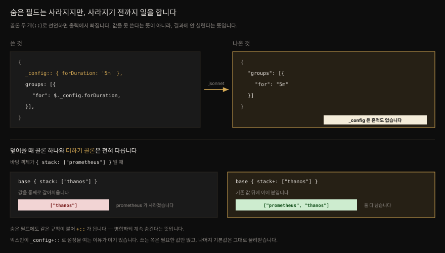

# Jsonnet — YAML 을 손으로 쓰지 않기 위한 언어

---


## 핵심 요약

> Jsonnet 은 JSON 의 상위 집합입니다. 모든 JSON 문서는 그대로 유효한 Jsonnet 프로그램이고 실행하면 똑같이 나옵니다. 여기에 변수·조건문·함수·임포트가 얹혀 있어서 반복이 많은 설정 파일을 짧게 줄일 수 있습니다.
>
> 이 언어의 핵심은 **숨은 필드**(`::`)와 **병합 연산자**(`+:`) 두 가지입니다. 숨은 필드는 출력에서 사라지지만 프로그램 안에서는 참조되므로 설정값을 담는 자리가 되고 병합 연산자는 남이 만든 객체를 덮어쓰지 않고 얹을 수 있게 합니다. 다음 편에서 볼 모니터링 믹스인은 이 둘로만 이루어져 있습니다.
>
> 검증은 Jsonnet 이 잘하는 일이 아닙니다. `assert` 로 조일수록 코드가 꼬이므로, 출력 검증은 `promtool` 같은 바깥 도구에 맡기는 편이 낫습니다.


## 학습 목표

> - JSON 과 Jsonnet 의 관계를 설명하고 Jsonnet 이 YAML 템플릿팅의 대안이 되는 이유를 말할 수 있습니다.
> - `local` 변수·문자열 보간·`|||` 블록으로 PromQL 이 든 알림 규칙의 중복을 줄일 수 있습니다.
> - 숨은 필드(`::`)가 출력에서 빠지는데도 쓸모 있는 이유를 설명할 수 있습니다.
> - `super`·`self`·`$` 가 각각 무엇을 가리키는지 구분할 수 있습니다.
> - `:` 와 `+:` 의 차이를 알고 라이브러리를 임포트해 일부만 바꿀 수 있습니다.
> - Jsonnet 으로 검증하지 말아야 할 선을 그을 수 있습니다.


## 본문 정리

### 왜 하필 Jsonnet 인가

YAML 을 템플릿팅하는 일은 고약합니다. Jinja 나 Go 템플릿 같은 언어는 공백을 직관과 다르게 다루고 하필 YAML 은 공백에 민감합니다. 템플릿 출력에 공백 한 칸이 잘못 끼는 것만으로 파일이 깨집니다. 그런데도 YAML 은 현재의 사실상 표준 설정 언어라서, 쿠버네티스에 앱을 배포하는 일부터 Prometheus 서버를 설정하는 일까지 전부 YAML 로 합니다.

Jsonnet 은 이 문제를 다른 각도에서 풉니다. 텍스트를 템플릿팅하는 대신 **데이터 구조를 만들고 마지막에 직렬화**합니다. 공백이 낄 자리가 없습니다. 구글에서 내부 설정 언어인 GCL(Google Configuration Language)을 개선하려던 엔지니어의 손에서 나왔고 2014년에 처음 공개되었습니다. 쿠버네티스와 같은 해입니다. 저자는 YAML 을 생성하는 도구와 YAML 을 가장 심하게 남용하는 물건이 같은 해에 나온 것을 두고 "구글이 주고 구글이 가져간다"고 씁니다.

Jsonnet 은 파이썬이나 Go 처럼 범용 언어가 되려 하지 않습니다. JSON 명세의 제약 안에서 움직여야 하므로 여기저기 기묘한 구석이 있습니다. 대신 **구조화된 데이터를 만드는 일**에 특화되어 있습니다.

### 모든 JSON 은 Jsonnet 이다

가장 단순한 Jsonnet 프로그램은 유효한 JSON 문서입니다. `vanilla.jsonnet` 에 평범한 JSON 을 넣고 돌리면 그대로 나옵니다.

```jsonnet
{
    "book": "Mastering Prometheus",
    "author": {
        "name": "Will Hegedus",
        "job": "SRE Manager",
        "favoriteColor": "orange"
    }
}
```

```bash
jsonnet vanilla.jsonnet
{
   "author": {
      "favoriteColor": "orange",
      "job": "SRE Manager",
      "name": "Will Hegedus"
   },
   "book": "Mastering Prometheus"
}
```

구성은 같은데 순서가 다릅니다. Jsonnet 은 키를 **알파벳순으로 정렬**해 내보냅니다. 사람이 읽기엔 원래 순서가 나을 때가 있지만 바꿀 방법이 없습니다. 정렬 순서를 지정하게 해 달라는 이슈가 열려 있고 여전히 닫히지 않았습니다.

> 책은 이 이슈가 "2018년부터 열려 있다"고 적었습니다. 실제로 [google/jsonnet#407](https://github.com/google/jsonnet/issues/407) 은 **2017년 11월 10일**에 열렸습니다. 지금도 open 인 것은 맞습니다.

### 변수와 문자열 보간

변수는 `local` 키워드로 선언하고 객체 안팎 어디에나 둘 수 있습니다. 한 번만 쓸 변수는 의미가 없으니, 알림 규칙에서 라벨 매처를 공유하는 경우를 봅니다.

```jsonnet
{
  groups: [
    {
      local matchers = 'service="prometheus",environment="prod"',
      name: "chapter11",
      rules: [
        {
          alert: "SSHDown",
          expr: 'last_over_time(probe_success{job="blackbox_ssh",%s}[5m]) != 1' % matchers,
          "for": "5m",
        },
        {
          alert: "ICMPDown",
          expr: 'last_over_time(probe_success{job="blackbox_icmp",%s}[5m]) != 1' % matchers,
          "for": "5m",
        }
      ]
    }
  ]
}
```

여기서 `for` 를 따옴표로 감싼 데는 이유가 있습니다. `for` 는 Jsonnet 에서 컴프리헨션을 뜻하는 예약어라, 그냥 쓰면 필드 이름으로 읽히지 않습니다.

`%s` 는 문자열 보간의 자리표시자입니다. 모듈로 연산자(`%`) 뒤의 값이 왼쪽부터 순서대로 들어갑니다. 문자열을 `+` 로 잇는 연결(concatenation)과는 다릅니다. 보간은 읽기 쉽고 무엇보다 형식 지정을 함께 할 수 있습니다.

| 자리표시자 | 뜻 | `12` 를 넣으면 |
|---|---|---|
| `%s` | 문자열 | `"12"` |
| `%d` | 정수 | `12` |
| `%f` | 부동소수점 | `12.000000` |
| `%.2f` | 소수점 두 자리 | `12.00` |
| `%x` | 16진수 | `c` |
| `%o` | 8진수 | `14` |

자리표시자가 여럿이면 순서를 맞추는 일이 금세 성가셔집니다. 그래서 객체를 넘기고 키 이름으로 꽂는 문법이 따로 있습니다. `%(program)s` 처럼 괄호 안에 키를 적습니다.

```jsonnet
{
    local _config = {
        program: "Jsonnet",
        os: "Linux"
    },
    inlineInterpolation: "I am using %(program)s on %(os)s to interpolate this string." % _config
}
```

긴 문자열은 `|||` 로 감싸 블록으로 씁니다. 따옴표 대신 쓰는 구분자라서, 여러 줄에 걸친 PromQL 을 모양 그대로 둘 수 있습니다.

```jsonnet
expr: |||
    last_over_time(
        probe_success{job="blackbox_ssh",%(matchers)s}[5m]
        ) != 1
||| % _config,
```

### 숨은 필드 — 출력에서 사라지는 설정 자리

`local` 변수에는 한계가 있습니다. **파일 스코프**라서 파일을 넘어 덮어쓸 수 없습니다. 외부 변수나 최상위 인자로 우회할 수 있지만 명령행 플래그가 줄줄이 붙습니다. 그래서 Jsonnet 에서는 **숨은 필드**를 씁니다.

숨은 필드는 키와 값 사이의 콜론을 두 개(`::`) 쓴 필드입니다. 객체 안에 멀쩡히 존재하고 참조도 되는데, 출력 JSON 에는 실리지 않습니다.

```jsonnet
{
    invisibleField:: "You can't see me!",
    normalField: "Boo!"
}
```

```bash
jsonnet hiddenFields.jsonnet
{
   "normalField": "Boo!"
}
```

앞서 `local matchers` 로 두었던 설정을 숨은 필드 `_config::` 로 옮기면, 객체 스스로가 자기 템플릿팅 설정을 들고 있는 모양이 됩니다. 이때 값을 꺼내는 방법이 바뀝니다. `$._config` 처럼 달러 기호를 씁니다.



### 객체 참조 세 가지 — `self`, `super`, `$`

Jsonnet 은 중첩 객체가 전부라, 서로를 가리키는 방법이 필요합니다. 셋뿐입니다.

- `self` — 참조가 일어나는 **그 객체**
- `super` — 객체 상속으로 합쳐졌을 때의 **부모 객체**. 중첩 한 단계 위의 객체를 가리키는 수단이 *아닙니다*. 이 구분을 놓치기 쉽습니다.
- `$` — 참조가 일어나는 객체의 **최상위 객체**

상속은 더하기 연산자로 합니다. `parentObject + { ... }` 가 곧 상속입니다.

```jsonnet
{
    local parentObject = {
        parentField:: "Hello, from the parent!"
    },
    topField:: "Hello, from the top!",
    child: parentObject + {
        childField:: "Hello from the child!",
        a: $.topField,
        b: super.parentField,
        c: self.childField,
        d: std.objectFieldsAll(self)
    }
}
```

```bash
jsonnet inheritance.jsonnet
{
   "child": {
      "a": "Hello, from the top!",
      "b": "Hello, from the parent!",
      "c": "Hello from the child!",
      "d": [ "a", "b", "c", "childField", "d", "parentField" ]
   }
}
```

`child` 가 `parentObject` 를 상속했으므로 숨은 필드 `parentField` 까지 물려받았습니다. `std.objectFieldsAll` 은 숨은 것까지 전부 보여주는 표준 라이브러리 함수라, 이를 눈으로 확인할 수 있습니다. 표준 라이브러리 함수는 모두 `std.` 로 시작하고 [공식 문서](https://jsonnet.org/ref/stdlib.html)에 목록이 있습니다.

### 임포트와 덮어쓰기

설정을 작게 쪼개 두었다가 합치는 일은 임포트로 합니다. 임포트될 목적으로 쓰인 파일은 관례상 `.libsonnet` 확장자를 씁니다. 강제는 아니고 라이브러리라는 표시입니다.

그냥 `import 'imported.libsonnet'` 라고 쓰면 파일 내용이 그 자리에 그대로 들어옵니다. 여러 임포트를 `+` 로 합칠 수도 있습니다. 그런데 라이브러리라면 대개 **고쳐 쓰려고** 가져옵니다. 그럴 때는 변수에 담습니다.

```jsonnet
local i = import 'imported.libsonnet';
i {
    monitoringStack+: ['thanos']
}
```

`monitoringStack+:` 의 `+` 가 핵심입니다. 필드를 통째로 갈아치우지 않고 **기존 값과 병합**합니다. 원본이 `["prometheus", "grafana"]` 였다면 결과는 `["prometheus", "grafana", "thanos"]` 입니다. 콜론 하나로 `monitoringStack: ['thanos']` 라고 썼다면 앞의 둘은 사라집니다. 숨은 필드에도 같은 규칙이 붙어 `+::` 가 되고 병합하면서 계속 숨긴다는 뜻이 됩니다.

이 병합 규칙 하나가 다음 편의 믹스인을 통째로 지탱합니다.

### 컴프리헨션과 조건문

리스트 컴프리헨션은 `$expr for $variable in $iterable` 꼴이고 뒤에 `if $condition` 을 붙일 수 있습니다. 객체 컴프리헨션은 필드 이름이 실행 전에 정해지지 않으므로 **계산된 필드 이름**을 대괄호로 감싸야 합니다.

```jsonnet
{
    foods:: [
        {name: "apple", kind: "fruit"},
        {name: "broccoli", kind: "vegetable"},
        {name: "banana", kind: "fruit"},
        {name: "carrot", kind: "vegetable"}
    ],
    fruits: [f.name for f in self.foods if f.kind != "vegetable"],
    groceryList: {
        [f.name]: {qty: if f.kind == "fruit" then 5 else 1}
        for f in self.foods
    }
}
```

`if/then/else` 는 값을 고르는 데 씁니다. `else` 는 생략할 수 있고 생략했는데 조건이 거짓이면 값은 `null` 이 됩니다.

### 함수

함수도 `local` 로 정의하고 파이썬식 인자 문법을 씁니다. 위치 인자·이름 인자·기본값을 모두 지원합니다. `return` 이 없고 함수 본문이 만들어 낸 값이 곧 반환값입니다. 본문을 중괄호로 감싸지 않으므로 **세미콜론이 정의의 끝**을 표시합니다.

```jsonnet
local IsPalindrome(word) =
    local chars = std.stringChars(word);
    local reversedChars = std.reverse(chars);
    chars == reversedChars;
{
    level: IsPalindrome("level"),
    prometheus: IsPalindrome("prometheus"),
    racecar: IsPalindrome("racecar"),
    thanos: IsPalindrome("thanos")
}
```

객체 안에서는 `function` 키워드로도 정의할 수 있는데, 반드시 **숨은 필드**여야 합니다. 함수는 JSON 으로 직렬화할 수 없기 때문입니다.

```jsonnet
{
    square:: function(x) x*x,
    foo: self.square(7)
}
```

콜론을 하나만 써서 `square:` 로 두면 이런 에러가 납니다.

```bash
jsonnet square_visible.jsonnet
RUNTIME ERROR: couldn't manifest function as JSON
	Field "square"
	During manifestation
```

라이브러리로 쓸 함수라면 `local` 로 두면 안 됩니다. `local` 은 파일 밖에서 보이지 않으니까요. 어디에 두고 어떻게 감출지는 그 함수를 남이 쓸 것인지에 달려 있습니다.

### 에러 — 그리고 어디까지만 검증할 것인가

에러를 내는 방법은 둘입니다. `error` 키워드로 직접 던지거나, `assert` 로 조건을 검사합니다.

`error` 의 재미있는 쓰임은 **덮어쓰기를 강제**하는 것입니다. 기본값 자리에 에러를 넣어 두면, 덮어쓰지 않은 채로 쓰는 순간 터집니다.

```jsonnet
local prometheusRuleGroup = {
    name: error "Must provide a name for the Prometheus rule group.",
    rules: []
};
{
    groups: [prometheusRuleGroup],
}
```

```bash
jsonnet errors.jsonnet
RUNTIME ERROR: Must provide a name for the Prometheus rule group.
```

`assert` 는 참이어야 하는 조건을 적고 콜론 뒤에 메시지를 답니다. 메시지는 넣는 편이 낫습니다. 무엇이 왜 실패했는지 알려 줍니다.

```jsonnet
local prometheusRuleGroup = {
    name: error "Must provide a name for the Prometheus rule group.",
    rules: [],
    assert std.type(self.rules) == "array" : "The rules field must be an array",
    assert std.length(self.rules) > 0 : "Why are you trying to define a rule group without any rules?",
};
{
    groups: [
        prometheusRuleGroup + { name: "general" }
    ],
}
```

```bash
jsonnet assert.jsonnet
RUNTIME ERROR: Why are you trying to define a rule group without any rules?
	assert.jsonnet:5:6-104
	Checking object assertions
	Array element 0
	Field "groups"
	During manifestation
```

여기서 저자가 선을 긋습니다. **Jsonnet 은 데이터 검증 언어가 아닙니다.** 검증을 촘촘히 할수록 코드가 꼬이고 디버깅이 어려워집니다. `rules` 배열의 모든 규칙을 순회하며 필수 필드를 확인하는 일 정도만 해도 금세 지저분해집니다. 출력의 정밀 검증은 `promtool check rules` 같은 외부 도구에 맡기고 템플릿팅 시점의 강한 검증이 끝내 필요하다면 [CUE](https://cuelang.org/) 나 [Nickel](https://nickel-lang.org/) 같은 다른 언어를 보라고 권합니다.

이 권고는 다음 편에서 실제로 지켜집니다. 믹스인이 뱉은 규칙 파일은 Jsonnet 이 아니라 `promtool` 이 검사합니다.


## 심화 학습

### 책의 `assert.jsonnet` 은 실행되지 않습니다

이 장에서 가장 확실한 정오표입니다. 책에 인쇄된 `assert.jsonnet` 코드는 `rules: []` 뒤에 **쉼표가 없습니다**.

```jsonnet
local prometheusRuleGroup = {
     name: error "Must provide a name for the Prometheus rule group.",
     rules: []
     assert std.type(self.rules) == "array" : "The rules field must be an array",
```

이 코드를 그대로 돌리면 책이 보여 주는 런타임 에러에 닿지 못합니다. 그 전에 **정적 구문 오류**로 멈춥니다.

```bash
jsonnet assert_asprinted.jsonnet
assert_asprinted.jsonnet:4:6-12 Expected a comma before next field
```

`rules: [],` 로 쉼표를 넣으면 그제야 책이 인쇄한 `RUNTIME ERROR: Why are you trying to define a rule group without any rules?` 가 나옵니다. 즉 **책의 출력은 책의 코드에서 나올 수 없습니다.**

한편 바로 앞의 `errors.jsonnet` 예제는 같은 자리에 쉼표가 없어도 **정상 동작합니다.** 거기서는 `rules: []` 가 객체의 마지막 필드라 뒤따르는 쉼표가 필요 없기 때문입니다. 쉼표가 반드시 있어야 하는 것은 **뒤에 `assert` 가 이어질 때**뿐입니다. 두 예제는 겉보기에 같아 보이지만 한쪽만 깨져 있습니다.

> 검증: go-jsonnet v0.22.0 으로 두 형태를 각각 실행해 확인했습니다.

같은 결의 사소한 흠이 하나 더 있습니다. 책은 숨은 함수 필드 예제의 출력을 `{ foo: 49 }` 라고 적었는데, Jsonnet 은 JSON 을 내보내므로 실제로는 키에 따옴표가 붙은 `{"foo": 49}` 입니다. 또 `RUNTIME ERROR: couldn't manifest function as JSON` 을 `ch11/functions.jsonnet` 을 돌린 결과로 제시했지만 그 파일은 팰린드롬 예제라 정상 렌더링됩니다.

### `local` 은 정말 덮어쓸 수 없는가

책은 "변수가 파일에 지역 스코프라 덮어쓸 수 없다"고 짧게 말하고 넘어갑니다. 이 문장이 숨은 필드로 넘어가는 다리이므로 조금 더 정확히 짚습니다.

`local` 로 묶인 이름은 **렉시컬 스코프**에 갇힙니다. 임포트한 쪽에서 그 이름에 손댈 방법이 없습니다. 반면 객체의 필드는 — 숨은 필드조차 — 객체 병합의 대상이라 밖에서 `+::` 로 얹을 수 있습니다. 그래서 "설정 가능한 라이브러리"를 쓰려면 설정을 `local` 이 아니라 필드에 두어야 합니다. 이것이 믹스인이 하필 `_config+::` 라는 형태를 갖는 이유입니다.

책이 언급하고 건너뛴 우회로인 외부 변수(`std.extVar`)와 최상위 인자(top-level arguments)는 명령행에서 값을 주입하는 방식이라, 파일이 늘어날수록 플래그가 길어집니다. 저자가 이들을 접고 믹스인으로 간 것은 취향이 아니라 규모의 문제입니다.

### `|||` 블록은 줄바꿈을 남깁니다

책의 예제를 실행해 보면 `expr` 값에 개행이 그대로 들어 있습니다.

```json
"expr": "last_over_time(\n    probe_success{job=\"blackbox_ssh\",...}[5m]\n    ) != 1\n"
```

들여쓰기와 끝의 개행이 문자열의 일부입니다. PromQL 은 개행을 신경 쓰지 않으므로 문제가 되지 않지만 이 값이 그대로 YAML 로 나갈 때 여러 줄 스칼라가 된다는 점은 알아 둘 만합니다. `|||` 는 "예쁘게 보이는 문자열"을 만드는 도구이지 공백을 지워 주는 도구가 아닙니다.


## 실무 적용

> 터미널이 아니라 파일로 뽑고, 여러 파일을 한 번에 만들고, 포맷과 린트를 걸어 두는 세 가지가 실무에서 먼저 필요합니다.

### 출력을 파일로, 그리고 YAML 로

터미널이 아니라 파일로 쓰려면 `-o` 를 줍니다. `-c` 를 함께 주면 없는 상위 디렉토리를 만들어 줍니다.

```bash
jsonnet -co ch11/out/rules.json ch11/variables_prometheus.jsonnet
```

결과는 JSON 인데, 그대로 Prometheus 규칙 파일로 써도 됩니다. **YAML 은 JSON 의 상위 집합**이기 때문입니다. `promtool` 로 확인할 수 있습니다.

```bash
promtool check rules ch11/out/rules.json
Checking ch11/out/rules.json
  SUCCESS: 2 rules found
```

그래도 규칙 파일을 열었는데 JSON 이 나오면 사람이 당황합니다. YAML 로 내보내려면 명령행 플래그가 아니라 **표준 라이브러리 함수**를 씁니다. 파일 자체를 고쳐야 한다는 뜻입니다.

```jsonnet
std.manifestYamlDoc((import 'variables_prometheus.jsonnet'))
```

이제 결과가 객체가 아니라 문자열이므로, `-S` 를 주어 문자열 그대로 쓰라고 알려야 합니다. 안 그러면 `\n` 이 그대로 박힌 한 줄이 나옵니다.

```bash
jsonnet -So ch11/out/rules.yaml ch11/yaml_rules.jsonnet
```

나온 YAML 은 키에 따옴표가 붙어 있습니다. YAML 의 기묘한 해석(가령 `on` 이 불리언이 되는 일)을 막으려는 기본 동작입니다. 거슬리면 `quote_keys=false` 를 넘깁니다.

> **인자 위치 주의.** 실제 시그니처는 `std.manifestYamlDoc(value, indent_array_in_object=false, quote_keys=true)` 입니다. `quote_keys` 는 **세 번째** 인자라, 두 번째 자리에 `false` 를 넣으면 `indent_array_in_object` 가 꺼질 뿐입니다. 반드시 이름을 붙여 넘겨야 합니다. 그리고 이 옵션은 **키만** 벗깁니다 — 값은 `name: "chapter11"` 처럼 따옴표를 유지합니다.
>
> 출처: go-jsonnet v0.22.0 의 `astgen/stdast.go` 에 박힌 `std.jsonnet` 원문.

문서 여러 개를 한 파일에 담으려면 `std.manifestYamlStream()` 을 씁니다. 책은 "`---` 로 구분한다"고만 적었는데, 실제로는 **첫 문서 앞에도** `---` 가 붙고 기본값(`c_document_end=true`)에 따라 **맨 끝에 `...` 문서 종료 표시**가 붙습니다.

### 파일 여러 개를 한 번에

출력 파일이 여러 개면 객체의 키를 파일 이름으로, 값을 파일 내용으로 두고 `-m` 을 줍니다.

```jsonnet
{
    'out/rulesA.yaml': std.manifestYamlDoc((import 'variables_prometheus.jsonnet')),
    'out/rulesB.yaml': std.manifestYamlDoc((import 'assert.jsonnet')),
}
```

```bash
jsonnet -Sm ch11/ ch11/multi_out.jsonnet
```

여기에 함정이 있습니다. `-m` 은 **디렉토리를 만들어 주지 않습니다.** `out/` 이 없으면 `openat out/rulesA.yaml: no such file or directory` 로 멈춥니다. 앞에서 배운 `-c` 를 같이 줘야 합니다(`-Scm`). 다음 편의 믹스인 렌더링 명령에서 이 문제가 실제로 터집니다.

### 포맷과 린트

`jsonnetfmt` 은 스타일을 통일하고 `jsonnet-lint` 는 렌더링 전에 흔한 실수를 잡습니다. 둘 다 선택이며 린터가 경고했다고 렌더링이 실패하는 것은 아닙니다. 혼자 시작할 때는 건너뛰어도 되지만 코드를 남과 나누기 시작하면 넣을 만합니다. Grafana Labs 가 관리하는 VS Code 플러그인과 language server 도 있습니다.


## 체크리스트

- [ ] 설정값을 `local` 이 아니라 `_config::` 같은 **숨은 필드**에 두었는가 (라이브러리로 쓸 것이라면 필수)
- [ ] 남의 객체를 얹을 때 `:` 가 아니라 `+:` 를 썼는가 (콜론 하나는 통째로 갈아치웁니다)
- [ ] 객체 안 함수를 `::` 로 숨겼는가 (안 그러면 manifest 단계에서 터집니다)
- [ ] `for` 처럼 예약어인 키는 따옴표로 감쌌는가
- [ ] 다중 출력(`-m`) 시 `-c` 를 함께 주어 디렉토리를 만들게 했는가
- [ ] `quote_keys=false` 를 **이름 붙여** 넘겼는가 (위치 인자로는 세 번째)
- [ ] 검증을 `assert` 로 과하게 조이는 대신 `promtool check rules` 로 넘겼는가


## 면접 관점

**Q. YAML 을 Jinja 로 템플릿팅하는 것과 Jsonnet 으로 생성하는 것은 무엇이 다릅니까?**

Jinja 는 **텍스트**를 다루므로 출력의 공백과 들여쓰기를 사람이 책임집니다. YAML 이 공백에 민감하니 실수가 곧 파싱 오류가 됩니다. Jsonnet 은 **데이터 구조**를 만들고 마지막에 직렬화하므로, 들여쓰기는 직렬화기가 정합니다. 대신 JSON 의 제약을 물려받아 키가 알파벳순으로 정렬되는 등의 제약이 생깁니다.

**Q. `super` 와 "한 단계 위의 객체"는 어떻게 다릅니까?**

`super` 는 **객체 상속**(`a + b`)에서 왼쪽 객체를 가리킵니다. 중첩 구조에서 물리적으로 바깥에 있는 객체를 가리키는 수단이 아닙니다. 바깥을 가리키려면 최상위를 뜻하는 `$` 를 쓰거나, `local` 로 이름을 붙여 두어야 합니다. 이 둘을 헷갈리면 `super.parentField` 가 왜 상속 없이는 동작하지 않는지 설명하지 못합니다.

**Q. 숨은 필드는 출력에 안 나오는데 왜 필요합니까?**

두 가지입니다. 첫째, **함수처럼 JSON 으로 직렬화할 수 없는 값**을 객체에 담으려면 숨겨야 합니다. 둘째, 설정을 객체의 필드로 두어야 밖에서 `+::` 로 덮어쓸 수 있습니다. `local` 변수는 파일 스코프라 임포트한 쪽에서 손댈 수 없습니다. 모니터링 믹스인의 `_config` 가 정확히 이 두 번째 이유로 숨은 필드입니다.

**Q. Jsonnet 으로 어디까지 검증해야 합니까?**

`error` 로 필수 필드의 덮어쓰기를 강제하고 `assert` 로 타입·길이 정도를 보는 선까지입니다. 그 이상 — 예컨대 배열의 모든 원소에 특정 필드가 있는지 순회 검사 — 은 코드를 빠르게 어지럽히고 디버깅을 어렵게 만듭니다. Jsonnet 은 검증 언어로 설계되지 않았습니다. 출력 검증은 `promtool` 같은 도메인 도구에 맡기고 템플릿팅 시점의 강한 타입 검증이 꼭 필요하면 CUE 나 Nickel 을 검토합니다.


## 참고 자료

- 원본: *Mastering Prometheus* (Packt, ISBN 9781805125662) 11장 — Jsonnet and Monitoring Mixins
- [Jsonnet 공식 문서](https://jsonnet.org/) · [표준 라이브러리 레퍼런스](https://jsonnet.org/ref/stdlib.html)
- [google/jsonnet#407 — Return the keys of dictionaries in order](https://github.com/google/jsonnet/issues/407) (2017-11-10 개설, 현재도 open)
- [google/go-jsonnet](https://github.com/google/go-jsonnet) — 본문의 실행 결과는 v0.22.0 기준
- [Taming the Beast: Comparing Jsonnet, Dhall, Cue](https://pv.wtf/posts/taming-the-beast)
- [CUE](https://cuelang.org/) · [Nickel](https://nickel-lang.org/) — 검증이 필요할 때의 대안
- 다음 편: [11-02.모니터링 믹스인 — 규칙과 대시보드를 패키지로](./11-02.모니터링%20믹스인%20—%20규칙과%20대시보드를%20패키지로.md)
