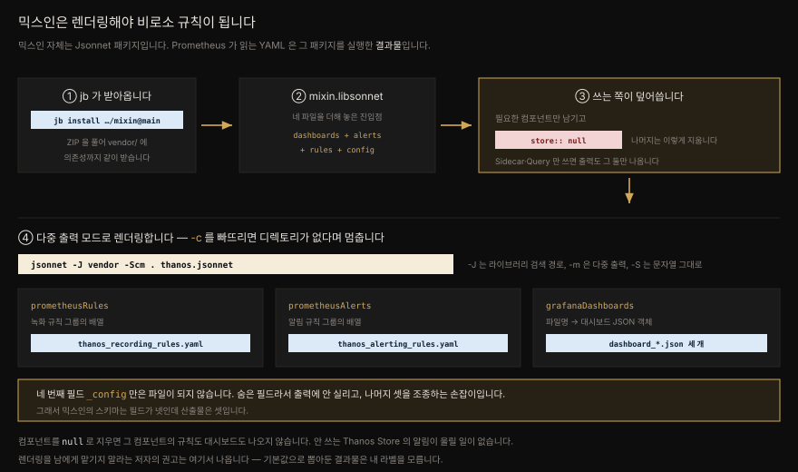

# 모니터링 믹스인 — 규칙과 대시보드를 패키지로

---


## 핵심 요약

> 모니터링 믹스인은 Prometheus 알림 규칙·녹화 규칙·Grafana 대시보드를 하나로 묶어 배포하는 **최소 규격**입니다. 소프트웨어를 만든 사람이 그 소프트웨어를 어떻게 감시해야 하는지 가장 잘 알고 있다는 전제에서 출발합니다.
>
> 규격이라고 해도 필드는 넷뿐입니다. `prometheusRules`·`prometheusAlerts`·`grafanaDashboards` 셋이 산출물이고 `_config` 는 숨은 필드라서 파일이 되지 않고 나머지 셋을 조종합니다. 앞 편에서 본 숨은 필드와 `+::` 병합이 여기 그대로 쓰입니다.
>
> Jsonnet 에는 공식 패키지 매니저가 없어 커뮤니티가 만든 `jsonnet-bundler`(`jb`)가 그 자리를 대신합니다. 믹스인은 받아서 렌더링해야 비로소 Prometheus 가 읽는 YAML 이 됩니다.
>
> 이미 쓰고 있을 가능성이 큽니다. `kube-prometheus` 는 쿠버네티스 믹스인을 기본으로 포함합니다. 문제는 쓰는 줄 모르고 쓴다는 점입니다.


## 학습 목표

> - 믹스인이 무엇을 표준화하려는 규격인지, 공급자와 소비자 각각에게 무엇을 주는지 설명할 수 있습니다.
> - 믹스인 스키마의 네 필드를 대고 `_config` 만 산출물이 되지 않는 이유를 앞 편의 숨은 필드로 설명할 수 있습니다.
> - `jb init` / `jb install` 로 믹스인과 그 의존성을 `vendor/` 에 받을 수 있습니다.
> - 안 쓰는 컴포넌트를 `null` 로 지우고 필요한 것만 렌더링할 수 있습니다.
> - 믹스인을 직접 렌더링해야 하는 이유를 말할 수 있습니다.


## 본문 정리

### 무엇을 표준화하려 했는가

모니터링 믹스인 프로젝트는 2018년에 시작했고 Prometheus 커뮤니티의 두 축인 Tom Wilkie(Grafana Labs CTO)와 Frederic Branczyk(Prometheus Operator 로 알려진 그 사람)가 주도했습니다. 목표는 이렇습니다.

> "Prometheus 알림, Prometheus 녹화 규칙, Grafana 대시보드를 함께 패키징하는 방법에 대한 최소한의 표준을 정의한다."

이 프로젝트는 두 부류의 사용자를 봅니다.

**공급자**는 소프트웨어를 만들고 유지하는 사람입니다. 자기 소프트웨어를 위한 설정 가능한 알림·녹화 규칙·대시보드 묶음을 일관된 방식으로 제공하고 싶어 합니다. 어떤 메트릭이 나오고 그중 무엇이 중요한지는 만든 사람이 가장 잘 압니다.

**소비자**는 그것을 여러 서비스에 걸쳐 예측 가능한 방식으로 가져다 쓰고 설정하고 싶어 합니다.

이 둘 사이의 공통 틀을 정한 것이 믹스인입니다. 요지는 **대시보드와 알림이 라벨에 대해 의견을 갖지 않아야 한다**는 것입니다. 라벨은 바깥에서 주입하는 설정이어야 합니다. 내 클러스터의 `job` 이름을 남이 알 리 없기 때문입니다.

Ceph, Thanos, Redis 를 비롯해 적잖은 프로젝트가 믹스인을 제공합니다. 그리고 이 책을 따라왔다면 **이미 쓰고 있습니다.** 배포에 써 온 `kube-prometheus` 헬름 차트가 [쿠버네티스 믹스인](https://github.com/kubernetes-monitoring/kubernetes-mixin)을 기본으로 품고 있습니다.

바로 여기에 문제가 있다고 저자는 말합니다. 사용자 상당수가 자기가 믹스인을 쓰는 줄 모릅니다. 무엇인지, 어떻게 설정하는지 모른 채로는 값을 다 못 뽑습니다. 잘해야 상투적인 규칙이 남고 나쁘면 **동작하지 않는 대시보드와 알림**이 남습니다.

### 스키마는 필드 넷뿐

믹스인은 본질적으로 설정 가능한 Prometheus 규칙과 Grafana 대시보드를 담은 Jsonnet 패키지입니다. 권장 스키마는 단순합니다.

| 필드 | 내용 |
|---|---|
| `prometheusRules` | Prometheus 녹화 규칙 그룹의 배열 |
| `prometheusAlerts` | Prometheus 알림 규칙 그룹의 배열 |
| `grafanaDashboards` | 대시보드 파일 이름 → 대시보드 JSON 정의의 객체 |
| `_config` | 위 셋을 설정하는 값들 |

> 책의 표(Table 11.2)는 `_config` 의 설명 자리에 **"Floating point limited to 2 decimal places"** 가 들어가 있습니다. 바로 앞 표(printf 자리표시자)의 `%.2f` 행 설명이 잘못 복사된 것으로, 명백한 오식입니다. 위 표의 설명은 [monitoring-mixins 공식 문서](https://github.com/monitoring-mixins/docs)를 근거로 적었습니다.

넷 다 대개 **숨은 필드**입니다. 파일로 뽑아내는 일은 쓰는 쪽 책임입니다. 합쳐 보면 이런 모양입니다.

```jsonnet
{
  _config+:: {
    selector: 'job="job_name"',
  },
  grafanaDashboards+:: {
    "dashboard-name.json": {...},
  },
  prometheusAlerts+:: [...],
  prometheusRules+:: [...],
}
```

`+::` 가 눈에 띕니다. **병합하되 계속 숨긴다**는 뜻입니다([11-01](./11-01.Jsonnet%20—%20YAML%20을%20손으로%20쓰지%20않기%20위한%20언어.md) 참조). 이 덕에 쓰는 쪽은 `_config` 전체를 다시 쓰지 않고 필요한 키만 얹을 수 있고 나머지 기본값은 그대로 물려받습니다. 믹스인이 "설정 가능"한 것은 이 연산자 하나 덕분입니다.

산출물이 셋인데 필드가 넷인 이유도 여기서 나옵니다. `_config` 는 숨은 필드이므로 렌더링해도 파일이 되지 않습니다. 손잡이지 결과물이 아닙니다.

### 패키지 매니저 — jsonnet-bundler

믹스인을 쓰려면 임포트해야 하고 임포트하려면 로컬에 있어야 합니다. 그런데 Jsonnet 에는 **공식 패키지 매니저가 없습니다.** 커뮤니티가 채웠고 사실상 유일한 구현이 `jsonnet-bundler`(`jb`)입니다. 믹스인 규격의 원저자 중 하나인 Frederic 이 만들었습니다.

`jb` 는 저장소의 ZIP 을 받아 `vendor/` 에 풀고 의존성 파일과 잠금 파일을 관리합니다. 다른 사람이 같은 버전으로 재현할 수 있게 하려는 장치입니다.

```bash
jb init
jb install github.com/thanos-io/thanos/mixin@main
```

Thanos 믹스인을 설치하면 **그 믹스인의 의존성까지** 함께 내려옵니다. 실제로 돌려 보면 이렇습니다.

```bash
$ jb install github.com/thanos-io/thanos/mixin@main
GET https://github.com/thanos-io/thanos/archive/c3f6dca....tar.gz 200
GET https://github.com/grafana/grafonnet-lib/archive/a1d61cc....tar.gz 200
GET https://github.com/grafana/jsonnet-libs/archive/8b721e2....tar.gz 200
```

Thanos 믹스인의 `jsonnetfile.json` 이 grafonnet-lib 와 grafana-builder 를 의존성으로 선언해 두었기 때문입니다. 대시보드를 만드는 데 쓰는 라이브러리입니다.

### 쓰고 덮어쓰기

믹스인 대부분은 `mixin.libsonnet` 을 진입점으로 둡니다. Thanos 의 경우 정확히 네 줄입니다.

```jsonnet
(import 'dashboards/dashboards.libsonnet') +
(import 'alerts/alerts.libsonnet') +
(import 'rules/rules.libsonnet') +
(import 'config.libsonnet')
```

설정 가능한 필드가 무엇인지는 `config.libsonnet` 을 보면 됩니다. 다만 저자는 `vendor/` 를 직접 뒤져 그 설정이 실제로 무엇을 하는지 보라고 권합니다. Thanos 믹스인은 컴포넌트마다 최상위 필드를 하나씩 두고 그 값을 **`null` 로 두면 해당 컴포넌트의 출력을 건너뜁니다.**

Sidecar 와 Query 만 굴리는 배포를 가정하고 나머지를 지웁니다.

```jsonnet
local thanos = (import 'github.com/thanos-io/thanos/mixin/mixin.libsonnet') {
  query+:: {
    selector: 'job=~".*thanos-query.*"',
    title: '%(prefix)sQuery' % $.dashboard.prefix,
  },
  sidecar+:: {
    selector: 'job=~".*thanos-sidecar.*"',
    thanosPrometheusCommonDimensions: 'namespace, pod',
    title: '%(prefix)sSidecar' % $.dashboard.prefix,
  },
  queryFrontend:: null,
  store:: null,
  receive:: null,
  rule:: null,
  compact:: null,
  bucketReplicate:: null,
};
{
  'out/thanos_recording_rules.yaml': std.manifestYamlDoc(thanos.prometheusRules),
  'out/thanos_alerting_rules.yaml': std.manifestYamlDoc(thanos.prometheusAlerts),
}
+
{
  ['out/dashboard_' + name]: std.manifestJson(thanos.grafanaDashboards[name])
  for name in std.objectFields(thanos.grafanaDashboards)
}
```

읽을 것이 많으니 나눠 봅니다.

먼저 `local thanos` 로 믹스인을 임포트하면서 곧바로 객체를 얹어 덮어씁니다. `query` 와 `sidecar` 에 준 값은 **믹스인의 기본값과 완전히 같습니다.** 저자가 굳이 적은 것은 덮어쓰는 방법을 보이기 위해서입니다(실제로 `config.libsonnet` 의 기본값과 대조해 확인했습니다). 안 쓰는 여섯 컴포넌트는 `null` 로 지웁니다.

다음으로 규칙 두 개를 파일로 만들고 대시보드는 객체 컴프리헨션으로 이름마다 파일을 만듭니다. 둘을 `+` 로 합칩니다. 객체 컴프리헨션 안에 다른 필드를 섞을 수 없다는 제약 때문에 이렇게 나눠 더합니다.



### 렌더링

Jsonnet 에게 `vendor/` 도 라이브러리 검색 경로라고 알려 줘야 합니다. `-J` 가 그 일을 합니다.

```bash
$ jsonnet -J ch11/vendor -Scm ch11/ ch11/thanos.jsonnet
ch11/out/dashboard_overview.json
ch11/out/dashboard_query.json
ch11/out/dashboard_sidecar.json
ch11/out/thanos_alerting_rules.yaml
ch11/out/thanos_recording_rules.yaml
```

컴포넌트를 여섯 개나 지웠는데 대시보드가 셋인 것은, Query·Sidecar 각각의 대시보드에 더해 `overview` 가 늘 따라 나오기 때문입니다.

> **`-c` 가 빠지면 실패합니다.** 책의 명령은 `jsonnet -J ch11/vendor -Sm ch11/ ch11/thanos.jsonnet` 인데, `out/` 디렉토리가 없으면 첫 파일에서 멈춥니다.
> ```console
> $ jsonnet -J vendor -Sm . thanos.jsonnet
> out/dashboard_overview.json
> openat out/dashboard_overview.json: no such file or directory
> ```
> `-m` 은 디렉토리를 만들지 않습니다. 책이 앞 절에서 가르친 `-c` 를 함께 줘야 합니다(위 명령의 `-Scm`). 미리 `mkdir out` 해 두어도 됩니다. 파일 목록 자체는 책이 인쇄한 다섯 개와 이름·순서까지 정확히 같습니다.

### 공짜로 얻는 것

렌더링된 알림 규칙을 열어 보면 gRPC 에 관한 알림이 줄줄이 나옵니다. Thanos Query 가 어떤 gRPC API 를 정의하는지 몰라도, 무엇을 감시해야 하는지 알 수 있습니다. 직접 만들지 않은 소프트웨어를 운영할 때 흔한 **"모르는 줄도 모르는 것"** 을 덜어 줍니다.

```yaml
- "alert": "ThanosQueryGrpcServerErrorRate"
  "annotations":
    "description": "Thanos Query {{$labels.job}} is failing to handle {{$value | humanize}}% of requests."
    "runbook_url": "https://github.com/thanos-io/thanos/tree/main/mixin/runbook.md#alert-name-thanosquerygrpcservererrorrate"
    "summary": "Thanos Query is failing to handle requests."
  "expr": |
    (
      sum by (job) (rate(grpc_server_handled_total{grpc_code=~"Unknown|ResourceExhausted|Internal|Unavailable|DataLoss|DeadlineExceeded", job=~".*thanos-query.*"}[5m]))
    /
      sum by (job) (rate(grpc_server_started_total{job=~".*thanos-query.*"}[5m]))
    * 100 > 5
    )
  "for": "5m"
  "labels":
    "severity": "warning"
```

> 책은 지면을 아끼려 이 알림을 줄여 실었습니다. 위는 실제 렌더링 결과 그대로입니다. 책이 생략한 `runbook_url` 과 `severity` 가 믹스인의 값을 잘 보여 줍니다. 실패한 gRPC 코드 여섯 개(`Unknown`·`ResourceExhausted`·`Internal`·`Unavailable`·`DataLoss`·`DeadlineExceeded`)를 골라 둔 것도, 이 목록을 스스로 추리려면 gRPC 를 꽤 알아야 합니다.

`5m` 창으로 에러율을 재고 5%를 넘으면 5분간 지속될 때 경고합니다. 분자는 실패로 볼 코드만 세고 분모는 시작된 전체 요청입니다.

### 렌더링을 남에게 맡기지 말 것

많은 프로젝트가 기본값으로 뽑아 둔 결과물을 함께 제공합니다. 편하지만 저자는 **직접 렌더링하라**고 권합니다. 언젠가는 반드시 고쳐야 하고 그때 처음부터 렌더링 체계를 세우는 것보다 처음에 세워 두는 편이 싸기 때문입니다. 기본값으로 뽑힌 규칙은 내 `job` 라벨을 모릅니다.

쓸 만한 믹스인을 찾는 출발점으로는 [Grafana 의 jsonnet-libs](https://github.com/grafana/jsonnet-libs/) 가 좋습니다. Prometheus exporter 가 온갖 것에 다 있듯, 믹스인도 놀랄 만큼 많습니다.


## 심화 학습

### 이 장이 10장과 이어지는 자리

이 장의 실습 대상이 하필 Thanos 믹스인인 것은 우연이 아닙니다. [10-01](./10-01.Thanos%20저장%20경로%20—%20Sidecar·Compactor·Store.md)·[10-02](./10-02.Thanos%20쿼리%20경로%20—%20Query·Query%20Frontend·Ruler·Receiver.md) 에서 컴포넌트로 뜯어본 그 Thanos 입니다. 믹스인이 컴포넌트마다 최상위 필드를 하나씩 갖는 구조는, 10장에서 본 "Thanos 는 한 바이너리의 서브커맨드 일곱 개"라는 사실을 그대로 반영합니다.

실제 `config.libsonnet` 의 최상위 컴포넌트 필드는 정확히 여덟입니다. `query`·`queryFrontend`·`store`·`receive`·`rule`·`compact`·`sidecar`·`bucketReplicate`. 앞의 일곱이 10장의 일곱 컴포넌트이고 `bucketReplicate` 는 `thanos_replicate_*` 메트릭을 그리는 것으로 보아 `thanos tools bucket replicate` 에 대응합니다. 책의 예제가 지우는 여섯과 남기는 둘을 합치면 정확히 이 여덟입니다.

그래서 이렇게 읽을 수 있습니다. **안 배포한 컴포넌트의 알림은 울릴 수 없습니다.** Store 를 안 띄웠는데 `ThanosStoreGrpcErrorRate` 가 규칙 파일에 들어 있으면, 영원히 데이터가 없거나 영원히 발화하지 않는 죽은 규칙이 됩니다. `null` 은 그 죽은 규칙을 없애는 스위치입니다.

그 스위치가 어떻게 구현되어 있는지 보면 앞 편이 한 번 더 쓰입니다. 대시보드 정의는 파일 이름 자체를 조건부 **계산된 필드 이름**으로 둡니다.

```jsonnet
// mixin/dashboards/bucket-replicate.libsonnet
[if thanos.bucketReplicate != null then 'bucket-replicate.json']:
  g.dashboard(thanos.bucketReplicate.title)
```

대괄호 안의 식이 `null` 로 평가되면 그 필드는 아예 생기지 않습니다. [11-01](./11-01.Jsonnet%20—%20YAML%20을%20손으로%20쓰지%20않기%20위한%20언어.md) 에서 객체 컴프리헨션을 위해 배운 계산된 필드 이름이, 여기서는 **필드를 통째로 없애는** 데 쓰입니다. 컴포넌트를 `null` 로 지우면 대시보드 파일이 안 나오는 이유가 이 한 줄입니다.

### `_config` 만 다른 취급을 받는 진짜 이유

네 필드 중 셋은 파일이 되고 하나는 안 됩니다. 왜 하필 `_config` 만 그런지는 Jsonnet 의 규칙만으로 설명됩니다. 넷 다 숨은 필드로 선언되지만 쓰는 쪽이 `thanos.prometheusRules` 처럼 **명시적으로 꺼내는** 셋만 `std.manifestYamlDoc()` 에 실려 파일이 됩니다. 숨은 필드는 *직렬화될 때* 빠지는 것이지, *참조가 안 되는* 것이 아닙니다.

바꿔 말하면 `_config` 도 마음만 먹으면 `std.manifestJson(thanos._config)` 로 뽑을 수 있습니다. 그럴 이유가 없을 뿐입니다. "설정은 결과물이 아니다"라는 규격의 의도가 언어의 기본 동작과 맞아떨어진 결과입니다.

### 믹스인의 한계 — 저자가 말하지 않은 쪽

저자는 믹스인 채택을 가로막는 요인으로 Jsonnet 이 낯설다는 점을 듭니다. 여기에 덧붙일 것이 있습니다. `jb` 가 기본으로 받는 것은 태그가 아니라 **브랜치**(`@main`)입니다. 위 실습에서도 `main` 브랜치의 특정 커밋 해시로 고정되었습니다. 잠금 파일이 재현성을 지켜 주지만 `jb update` 를 돌리는 순간 상류의 알림 규칙이 통째로 바뀔 수 있습니다. 규칙 변경은 곧 호출기가 울리는 조건의 변경이므로, 렌더링 결과를 형상 관리에 넣고 diff 를 사람이 읽는 절차가 필요합니다.

이 절차는 다음 장(12장, CI 파이프라인)의 주제와 정확히 맞물립니다. 렌더링한 규칙을 `promtool` 로 검사하고 `pint` 로 린트하고 diff 를 PR 로 리뷰하는 흐름입니다.

> 이 문단은 책 밖 관찰입니다. 근거는 위 `jb install` 실행 로그(브랜치가 커밋 해시로 고정되는 것)와 `jsonnetfile.lock.json` 의 존재입니다.


## 실무 적용

### 이미 쓰고 있는 믹스인을 찾아내기

`kube-prometheus` 로 배포했다면 쿠버네티스 믹스인이 이미 돌고 있습니다. 지금 뜨는 알림 중 어느 것이 믹스인에서 왔는지 확인하려면 규칙 이름을 보면 됩니다. `KubePodCrashLooping`, `KubeNodeNotReady` 처럼 `Kube` 로 시작하는 것 대부분이 그렇습니다.

값을 뽑으려면 설정을 열어야 합니다. 쿠버네티스 믹스인의 `config.libsonnet` 에는 알림 임계값과 라벨 선택자가 들어 있고 여기 손대지 않으면 남의 환경에 맞춘 기본값으로 삽니다.

### 믹스인을 렌더링해 형상 관리에 넣기

```bash
jb init
jb install github.com/thanos-io/thanos/mixin@main

# 렌더링 — -c 를 잊지 말 것
jsonnet -J vendor -Scm . thanos.jsonnet

# 규칙이 Prometheus 문법에 맞는지 검사
promtool check rules out/thanos_alerting_rules.yaml
promtool check rules out/thanos_recording_rules.yaml
```

`jsonnetfile.json` 과 `jsonnetfile.lock.json` 은 반드시 커밋합니다. `vendor/` 는 `jb install` 로 재현되므로 커밋하지 않아도 되지만 상류가 사라질 위험을 감수하고 싶지 않다면 넣습니다.

렌더링 결과물(`out/`)도 커밋하기를 권합니다. 그래야 `jb update` 이후의 diff 로 **어떤 알림이 어떻게 바뀌었는지** 사람이 읽고 승인할 수 있습니다. 앞 절의 `promtool` 검사는 이 시점에 CI 가 돌리기 좋은 게이트입니다.

### 컴포넌트를 지우는 판단

배포하지 않은 컴포넌트는 `null` 로 지웁니다. 판단 기준은 단순합니다.

| 상황 | 처리 |
|---|---|
| 그 컴포넌트를 아예 안 띄움 | `null` 로 지웁니다 |
| 띄우긴 했는데 `job` 라벨이 다름 | `selector` 를 덮어씁니다 |
| 알림은 원하는데 임계값이 안 맞음 | `_config` 의 해당 키를 덮어씁니다 |
| 알림 자체가 필요 없음 | 렌더링 후 지우지 말고 애초에 그 컴포넌트를 `null` 로 |

마지막 줄이 중요합니다. 렌더링 결과물을 손으로 고치면 다음 `jb update` 때 되살아납니다. 고칠 곳은 언제나 Jsonnet 쪽입니다.


## 체크리스트

- [ ] 지금 쓰는 헬름 차트가 믹스인을 품고 있는지 확인했는가 (`kube-prometheus` 는 품고 있습니다)
- [ ] `jsonnetfile.json` 과 `jsonnetfile.lock.json` 을 커밋했는가
- [ ] 렌더링 시 `-J vendor` 로 검색 경로를, `-c` 로 디렉토리 생성을 함께 줬는가
- [ ] 배포하지 않은 컴포넌트를 `null` 로 지웠는가 (죽은 알림 방지)
- [ ] `selector` 를 내 환경의 `job` 라벨에 맞게 덮어썼는가
- [ ] 렌더링된 규칙을 `promtool check rules` 로 검사했는가
- [ ] 결과물을 손으로 고치는 대신 Jsonnet 쪽을 고쳤는가
- [ ] `jb update` 후 규칙 diff 를 사람이 읽고 승인하는 절차가 있는가


## 면접 관점

**Q. 모니터링 믹스인이 푸는 문제는 무엇입니까?**

Prometheus 는 자유도가 높아 좋은 기본 감시 설정을 만들기 어렵습니다. 그런데 어떤 메트릭이 중요한지는 소프트웨어를 만든 사람이 가장 잘 압니다. 믹스인은 그 지식을 알림·녹화 규칙·대시보드 묶음으로 패키징해 배포하는 최소 규격입니다. 핵심 설계 원칙은 **대시보드와 알림이 라벨에 의견을 갖지 않는다**는 것으로, 라벨은 `_config` 로 주입받습니다. 그래야 남의 클러스터에서도 동작합니다.

**Q. 믹스인 스키마의 네 필드 중 왜 셋만 파일이 됩니까?**

넷 다 숨은 필드(`::`)로 선언되어 직렬화에서 빠집니다. 다만 쓰는 쪽이 `mixin.prometheusRules` 처럼 명시적으로 꺼내 `std.manifestYamlDoc()` 에 넘기는 셋만 파일이 됩니다. `_config` 는 꺼낼 이유가 없어서 안 꺼낼 뿐, 언어가 막는 것은 아닙니다. 설정은 결과물이 아니라는 규격의 의도와 숨은 필드의 동작이 여기서 맞아떨어집니다.

**Q. 믹스인이 제공하는 렌더링 완료본을 그냥 쓰면 안 됩니까?**

동작은 합니다. 다만 그 결과물은 만든 사람의 라벨 규약을 담고 있어 내 `job` 이름과 어긋나기 쉽고 임계값도 남의 환경 기준입니다. 게다가 언젠가 반드시 고쳐야 하는데, 그때 결과물을 직접 손대면 다음 업데이트에서 되살아납니다. 처음부터 `jb` 로 받아 직접 렌더링하는 편이 장기적으로 쌉니다.

**Q. `jb install ...@main` 의 위험은 무엇입니까?**

태그가 아니라 브랜치를 가리키므로, 상류가 알림 규칙을 바꾸면 다음 `jb update` 때 그대로 따라옵니다. 규칙 변경은 호출기가 울리는 조건의 변경입니다. 잠금 파일이 시점을 고정해 주므로 재현성 자체는 지켜지지만 업데이트를 무심코 돌리지 않도록 렌더링 결과물을 형상 관리에 넣고 diff 를 리뷰하는 절차가 필요합니다. 이 검증을 CI 에 얹는 것이 다음 장의 주제입니다.


## 참고 자료

- 원본: *Mastering Prometheus* (Packt, ISBN 9781805125662) 11장 — Jsonnet and Monitoring Mixins
- [monitoring-mixins/docs](https://github.com/monitoring-mixins/docs) — 규격과 설계 제안서. 네 필드의 정의 출처
- [Monitoring Mixins 웹사이트](https://monitoring.mixins.dev/)
- [jsonnet-bundler](https://github.com/jsonnet-bundler/jsonnet-bundler) — Frederic Branczyk 이 만든 사실상 유일한 Jsonnet 패키지 매니저
- [kubernetes-monitoring/kubernetes-mixin](https://github.com/kubernetes-monitoring/kubernetes-mixin) — `kube-prometheus` 가 기본 포함하는 그 믹스인
- [thanos-io/thanos `mixin/`](https://github.com/thanos-io/thanos/tree/main/mixin) — 본문의 실행 결과는 v0.32.5 기준
- [grafana/jsonnet-libs](https://github.com/grafana/jsonnet-libs/) — 믹스인을 찾는 출발점
- [Using Jsonnet to Package Together Dashboards, Alerts and Exporters — Tom Wilkie, KubeCon EU 2018](https://www.youtube.com/watch?v=b7-DtFfsL6E) — 규격이 처음 공개된 발표
- [Grafana Labs — Everything You Need to Know About Monitoring Mixins](https://grafana.com/blog/everything-you-need-to-know-about-monitoring-mixins/)
- 앞 편: [11-01.Jsonnet — YAML 을 손으로 쓰지 않기 위한 언어](./11-01.Jsonnet%20—%20YAML%20을%20손으로%20쓰지%20않기%20위한%20언어.md)
