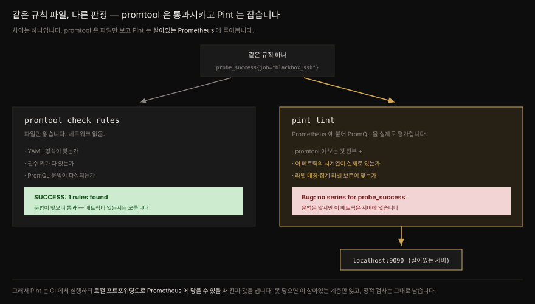

# CI 파이프라인으로 Prometheus 검증 — promtool·amtool·Pint


## 핵심 요약

> Prometheus 스택은 설정 파일·규칙 파일·Alertmanager 설정처럼 손으로 관리하는 YAML 이 많습니다. 코드 리뷰만으로는 오설정이 새어 나가므로, CI 파이프라인에서 자동으로 검증합니다.
>
> 검증 도구는 셋입니다. `promtool` 은 Prometheus 설정·규칙·룰 단위 테스트를, `amtool` 은 Alertmanager 설정과 라우팅 트리를 검사합니다. 이 둘은 파일을 **오프라인 문법 검사**만 합니다.
>
> `Pint` 는 결이 다릅니다. **살아있는 Prometheus 에 붙어 PromQL 을 실제로 평가**하므로, 문법은 맞지만 대응하는 시계열이 없는 규칙을 잡아냅니다. promtool 이 통과시킨 규칙을 Pint 는 잡습니다. 그래서 Pint 는 서버에 닿을 수 있을 때 진가를 냅니다.
>
> 이 편은 [11장 믹스인](./11-02.모니터링%20믹스인%20—%20규칙과%20대시보드를%20패키지로.md) 말미에서 예고한 "렌더링한 규칙을 `promtool`·`pint` 로 검사"의 실현입니다.


## 학습 목표

> - GitHub Actions 의 workflow·job·step·runner 를 구분하고 `act` 로 워크플로를 로컬에서 돌릴 수 있습니다.
> - `promtool` 의 `check config`·`check rules`·`test rules` 세 서브커맨드를 CI 단계로 옮길 수 있습니다.
> - `amtool check-config` 와 `amtool config routes test` 로 Alertmanager 설정과 라우팅을 검증할 수 있습니다.
> - Pint 가 promtool 과 무엇이 다른지 — 정적 검사 대 살아있는 평가 — 를 설명할 수 있습니다.
> - `.pint.hcl` 로 커스텀 규칙(라벨·주석 강제)을 정의하고 그 정규식이 실제로 무엇을 강제하는지 판별할 수 있습니다.


## 본문 정리

### GitHub Actions 용어 정리

이 장은 CI 도구 중 GitHub Actions 를 씁니다. 이유는 셋 — 흔하고 로컬 테스트가 편하고 이 책의 코드가 GitHub 에 있기 때문입니다. 워크플로가 YAML 로 쓰인다는 점도 있습니다. 저자는 "적어도 Jenkins 같은 Java 계열 언어를 배울 필요는 없다"고 농담합니다.

용어가 헷갈리기 쉬워 먼저 정리합니다.

- **workflow** — GitHub Actions 가 실행하는 단위. 이벤트(대개 PR 이나 push)에 반응해 도는 job 의 묶음입니다. GitHub Actions 가 돌리는 것은 "action" 이 아니라 workflow 입니다.
- **job** — 순차 실행되는 step 의 묶음. 한 workflow 에 job 이 여럿이면 **기본적으로 병렬**로 돕니다. 의존을 명시하면 순서를 줄 수 있습니다.
- **step** — 셸 명령이거나 action 호출. action 은 복잡하지만 반복 가능한 작업을 처리하는 GitHub Actions 전용 애플리케이션입니다.
- **runner** — job 을 실행하는 서버. GitHub 이 제공하거나(유료) 자체 호스팅할 수 있습니다.

이 장에서는 runner 대신 **`act`** 를 씁니다. `act` 는 Docker 컨테이너로 GitHub Actions runner 를 흉내 내, 특수 환경 변수 주입까지 처리해 대부분의 CI 워크플로를 로컬에서 돌리게 해 줍니다.

> 책은 GitHub Actions 가 "2018년에 CI 생태계에 자리 잡았다"고 적습니다. 정확히는 2018년 10월 GitHub Universe 에서 *워크플로 자동화* 도구로 **발표**되었고 이 장이 기대는 *CI/CD 서비스*로서의 정식 출시(GA)는 **2019년 11월**입니다(changelog 공지 2019-11-11). 큰 오류는 아니나 시점을 정확히 둡니다.

### promtool — Prometheus 쪽 검증

`promtool` 은 릴리스에 딸려 오는 만능 바이너리입니다. TSDB 직접 조작부터 pprof 프로파일까지 하지만 여기서는 검증 세 가지만 봅니다.

| 서브커맨드 | 검증 대상 |
|---|---|
| `promtool check config` | Prometheus 설정 파일 문법 |
| `promtool check rules` | 규칙 파일 문법 |
| `promtool test rules` | 규칙의 단위 테스트 (→ [5장](./05-02.견고한%20알림과%20룰%20단위%20테스트.md)) |

이 셋을 GitHub Actions workflow 로 옮깁니다. Prometheus 도커 이미지 안에서 돌리면 `promtool` 바이너리가 이미 있으므로, step 하나만 추가하면 됩니다.

```yaml
name: promtool
on: push
jobs:
  config:
    name: Validate Prometheus Config
    runs-on: ubuntu-latest
    container: quay.io/prometheus/prometheus:v2.46.0
    steps:
      - name: Checkout/clone code
        uses: actions/checkout@v4
      - name: Validate Prometheus config file
        run: promtool check config ch12/prometheus.yaml
```

`act -W ch12/workflows/promtool.yaml` 로 돌리면 `SUCCESS: ch12/prometheus.yaml is valid prometheus config file syntax` 가 나옵니다.

규칙 검증은 **별도 job** 으로 붙입니다. 설정 검증과 규칙 검증은 서로 의존하지 않으므로 병렬로 돌리는 편이 낫습니다.

```yaml
  rules:
    name: Validate Prometheus Rules
    runs-on: ubuntu-latest
    container: quay.io/prometheus/prometheus:v2.46.0
    steps:
      - name: Checkout/clone code
        uses: actions/checkout@v4
      - name: Validate Prometheus rules files
        run: promtool check rules ch12/rules/*.yaml
      - name: Run unit tests on Prometheus rules files
        run: promtool test rules ch12/tests/*.yaml
```

두 job 이 병렬로 돌아 출력이 뒤섞이지만 `SUCCESS: 57 rules found` 와 단위 테스트의 `Unit Testing: ... SUCCESS` 가 보이면 통과입니다. 저자는 파일을 혼자 고치는 사람에게도 이 세 단계를 권합니다.

### amtool — Alertmanager 쪽 검증

Alertmanager 파이프라인도 구조가 비슷합니다. 다만 서브커맨드 문법이 미묘하게 다릅니다. `amtool check-config` 가 `promtool check config` 에 대응하는데, 하이픈 위치가 다릅니다. 저자도 "왜 다른지 모르겠고 나도 거슬린다"고 적습니다.

```yaml
      - name: Validate Alertmanager config file
        run: amtool check-config ch12/alertmanager.yaml
```

돌리면 `SUCCESS` 와 함께 발견한 것(route, 0 inhibit rules, 4 receivers, 0 templates)을 요약해 줍니다.

여기서 한 발 더 나갑니다. Alertmanager 설정에서 가장 흔한 실수는 **라우팅 트리를 오해하는 것**입니다. 새 route 를 파일 끝에 그냥 붙이는 게 자연스럽지만 앞선 route 가 먼저 알림을 잡아채면 기대대로 동작하지 않습니다. `amtool` 의 덜 알려진 기능으로 라벨 매처 기반 라우팅을 테스트합니다.

```yaml
      - name: Validate Alertmanager Route
        run: |
          amtool config routes \
            --config.file=ch12/alertmanager.yaml \
            test --verify.receivers \
            pagerduty-devops \
            team=devops environment=production \
            service=jenkins
```

`--verify.receivers pagerduty-devops` 는 "이 라벨 조합의 알림이 정말 `pagerduty-devops` 로 가는가"를 검증합니다. 어긋나면 실패하므로, 라우팅 회귀를 CI 에서 잡습니다. 실무에서는 셸 스크립트로 여러 route·라벨 조합을 한 번에 검증하곤 합니다.

### Pint — 살아있는 검사

`promtool` 검증은 좋은 출발점이지만 한계가 있습니다. **파일만 봅니다.** 문법이 맞으면 통과시키므로, 존재하지 않는 메트릭을 물어도 통과합니다.

Pint 는 Cloudflare 에서 나온 도구입니다. 수백 개의 Prometheus 인스턴스를 다루는 팀이 다른 팀의 규칙 관리에 병목이 되지 않으려고 만들었습니다. `promtool` 과 구별되는 핵심은 하나입니다. **하나 이상의 살아있는 Prometheus 에 붙어, 규칙 안의 PromQL 을 실제로 평가**합니다. 그래서 잘못된 라벨 매처, 존재하지 않는 시계열, 좌우 라벨이 어긋나는 벡터 매칭(→ [3장](./03-02.PromQL%20기초.md))을 잡아냅니다.



Pint 설정은 HCL(HashiCorp Configuration Language)로 쓰고 기본 파일명은 `.pint.hcl` 입니다. 가장 먼저 검사에 쓸 Prometheus 인스턴스를 지정합니다. URL 만 있으면 됩니다.

```hcl
prometheus "mastering-prometheus" {
  uri = "http://localhost:9090"
}
```

이제 5장의 test rule 로 `pint lint` 를 돌리면, `promtool` 이 통과시켰던 바로 그 규칙에서 문제를 찾습니다.

```console
$ pint lint rules/test-rule.yaml
rules/test-rule.yaml:5-8 Bug: `mastering-prometheus` Prometheus server at http://localhost:9090 ...
```

`promtool` 은 문법만 보고 통과시켰지만 Pint 는 **그 메트릭의 시계열이 서버에 없다**는 사실을 잡았습니다. 테스트용이라 시계열이 없는 게 당연하다면, 규칙 항목 앞에 `# pint disable promql/series(probe_success)` 주석을 달아 그 검사만 끕니다.

### Pint 커스텀 규칙 — 라벨·주석 강제

`rule` 블록을 반복해 커스텀 검사를 더합니다. 흔한 예로, severity 라벨을 `critical`·`warning`·`info` 셋 중 하나로 강제해 봅니다.

```hcl
rule {
  match {
    kind = "alerting"
  }
  label "severity" {
    severity = "bug"
    value    = "(critical|warning|info)"
    required = true
  }
}
```

`match { kind = "alerting" }` 로 알림 규칙만 골라 그 안의 규칙을 강제합니다. `severity` 라벨이 있어야 하고 `value` 정규식과 맞아야 합니다.

> **정규식 자동 앵커링.** Prometheus 처럼 Pint 도 정규식 앞뒤에 `^`·`$` 를 자동으로 붙여 줄 전체가 맞아야 합니다. 실제로 Pint 오류 메시지를 보면 `value = "[A-Z].+..."` 로 준 것이 `^[A-Z].+...$` 로 표시됩니다. 여러 패턴을 허용하려면 `value` 대신 `values` 로 리스트를 줍니다(하나만 맞아도 통과).

11장에서 본 [모니터링 믹스인](./11-02.모니터링%20믹스인%20—%20규칙과%20대시보드를%20패키지로.md) 규격은 모든 알림에 severity 라벨과 함께 `summary`·`description` 주석을 요구합니다. 이를 Pint 로 강제합니다.

```hcl
  annotation "summary" {
    severity = "bug"
    required = true
    value = "[A-Z][^{.]+.\\."
  }
  annotation "description" {
    severity = "bug"
    required = true
    value = "[A-Z].+\\{\\{.*\\}\\}.*\\."
  }
```

원래 test rule 은 `summary` 가 없고 `description` 이 마침표로 끝나지 않아 두 개의 Bug 가 잡힙니다. 주석을 고쳐 `summary: "No successful SSH probes in the last 5 minutes."`, `description: "Cannot SSH to {{ $labels.instance }}."` 로 두면 통과합니다.


## 심화 학습

### 책의 summary 정규식은 설명만큼 엄격하지 않습니다

이 장에서 가장 파고들 만한 지점입니다. 책은 `summary` 정규식 `[A-Z][^{.]+.\.` 이 다음을 강제한다고 설명합니다 — "대문자로 시작, 마침표로 끝, **한 문장(마침표·느낌표·물음표를 안에 못 씀)**, 템플릿 값 없음". 이 중 **느낌표·물음표 금지는 사실이 아닙니다.**

Pint v0.50.0 을 실제로 빌드해 이 정규식을 여러 문자열에 돌려 확인했습니다.

| summary 값 | 책의 설명대로면 | 실제 Pint 판정 |
|---|---|---|
| `No successful SSH probes in the last 5 minutes.` | 통과 | ✅ 통과 |
| `First sentence. Second sentence.` | 거부(내부 마침표) | ✅ 거부 |
| `Why? This is down.` | 거부(내부 물음표) | ❌ **통과** |
| `Is it down? Yes.` | 거부(내부 물음표) | ❌ **통과** |
| `Abc!d.` | 거부(느낌표) | ❌ **통과** |
| `Host {{ $labels.instance }} is down.` | 거부(템플릿) | ✅ 거부 |
| `Ab.` | ? | ❌ 거부(길이 부족) |

정규식을 뜯어보면 이유가 분명합니다. `^[A-Z][^{.]+.\.$` 에서 문자 클래스 `[^{.]` 가 금지하는 것은 **`{` 와 마침표뿐**입니다. 느낌표·물음표는 여기에 걸리지 않고 그 뒤 `.` 은 *임의의 한 글자*라 무엇이든 받습니다. 그래서 내부 물음표·느낌표가 통과합니다. 또 `[^{.]+`(1글자 이상) + `.`(1글자) + `\.`(마침표) 구조라 **대문자 뒤에 최소 2글자가 더 있어야** 하므로 `Ab.`(3글자)는 거부되고 `Abc.`(4글자)부터 통과합니다 — 책이 언급하지 않는 최소 길이 제약입니다.

정리하면 이 정규식이 실제로 강제하는 것은 "대문자 시작 · 마침표 끝 · **내부 마침표 없음** · `{` 없음 · 최소 4글자" 이지, "한 문장(`!`·`?` 금지)"이 아닙니다. 템플릿을 막는 것(`{` 금지)과 내부 마침표를 막는 것은 맞지만 `!`·`?` 금지는 책이 자기 정규식보다 과하게 설명한 대목입니다.

> 검증: Pint v0.50.0(`go install github.com/cloudflare/pint/cmd/pint@v0.50.0`)로 각 문자열을 규칙에 넣어 `pint lint` 를 돌리고 Python `re` 로 교차 확인했습니다. `Abc!d.` → 통과, `Why? This is down.` → 통과.

정규식으로 문장 규칙을 강제하려는 시도가 왜 어려운지 보여 주는 사례입니다. 자연어 제약을 정규식으로 옮기면 이렇게 틈이 생깁니다. summary 를 진짜 한 문장으로 강제하고 싶다면 `[^{.!?]` 처럼 클래스에 `!?` 를 명시해야 합니다.

### description 정규식이 템플릿을 강제하는 이유

`description` 정규식 `[A-Z].+\{\{.*\}\}.*\.` 은 summary 와 대칭입니다. `\{\{ ... \}\}` 를 **반드시 포함**하도록 강제합니다. 저자의 논리는 명확합니다 — 템플릿 값(`{{ $labels.instance }}`·`{{ $value }}`)이 하나도 없으면 description 이 summary 와 다를 게 없기 때문입니다. summary 는 템플릿을 *금지*(`[^{.]`)하고 description 은 템플릿을 *요구*(`\{\{.*\}\}`)하는 대비가 규격의 의도를 정규식으로 옮긴 결과입니다.

이 대비는 실측으로도 확인됩니다. 원래 test rule 의 description `"Cannot SSH to {{ $labels.instance }}"` 은 템플릿은 있지만 **마침표가 없어** 거부되고 고친 뒤 `"Cannot SSH to {{ $labels.instance }}."` 은 통과합니다.

### promtool 과 Pint 는 대체가 아니라 계층입니다

저자는 "Pint 를 넣으면 규칙에 대한 promtool 검증은 대부분 건너뛰어도 된다"고 말하지만 이 문장을 오해하면 안 됩니다. Pint 는 promtool 의 문법 검사를 **포함**한 위에 살아있는 평가를 더한 것입니다. 그래서 Pint 가 서버에 닿을 수 있을 때만 그 상위 계층이 작동합니다.

바로 여기에 CI 구성의 제약이 있습니다. 책의 Prometheus 환경은 외부에서 접근할 수 없어 GitHub Actions runner 가 쿼리를 못 날립니다. 그래서 저자는 Pint 의 쿼리 기반 검사(`promql/series` 등)는 **로컬에서** 돌리라고 못 박습니다. 다만 서버에 못 닿아도 Pint 가 promtool 수준으로 내려앉는 것은 아닙니다. `--offline` 으로 돌려도 주석·라벨·정규식 같은 **정적 검사는 그대로 살아 있습니다** — 실제로 `pint --offline lint` 는 이 장의 test rule 에서 `summary` 누락과 `description` 정규식 위반을 여전히 잡아냅니다. promtool 은 이 검사를 못 합니다. 서버에 못 닿을 때 잃는 것은 딱 **살아있는 쿼리 계층**(`promql/series` 처럼 시계열 존재·라벨 매칭을 서버에 물어보는 검사)뿐입니다.

이 제약이 곧 아키텍처 판단으로 이어집니다. Pint 의 살아있는 검사를 CI 에서 쓰려면 CI runner 가 Prometheus 에 닿을 경로(사내 러너, 포트포워딩, 프록시)를 확보하거나, 살아있는 검사는 로컬·야간 파이프라인으로 분리해야 합니다.


## 실무 적용

### Pint 를 CI 에 통합하기

Pint 는 CI 실행을 전제로 설계되어, CI 에서만 되는 기능이 있습니다. PR 의 문제 라인에 **코멘트를 자동으로 달고**, PR 에서 **바뀐 파일만** 검사해 무관한 오류로 사용자를 괴롭히지 않습니다.

CI 설정은 같은 `.pint.hcl` 에 `ci` 블록으로 넣습니다.

```hcl
ci {
  include = [ ".github/pint/test-rule.yaml" ]
  baseBranch = "main"
}
```

> **`ci` 블록은 PR 에만 적용됩니다.** push 에 Pint 를 걸면 발견 가능한 *모든* 파일을 검사합니다. 그래서 push 에서 특정 파일만 보게 하려면 workflow step 의 `working-directory` 를 규칙 디렉토리로 두거나, push 에서는 Pint 를 아예 안 돌립니다. `repository` 블록은 대개 불필요합니다 — GitHub Actions runner 의 환경 변수에서 값이 자동 유도됩니다.

워크플로에서는 Pint 저자가 만든 재사용 action 을 씁니다.

```yaml
name: pint
on:
  pull_request:
    branches: [ "main" ]
    paths: [ ".github/pint/test-rule.yaml" ]
jobs:
  pint:
    name: Pint CI test
    runs-on: ubuntu-latest
    steps:
      - name: Checkout/clone code
        uses: actions/checkout@v4
      - name: Run pint
        uses: prymitive/pint-action@v1
        with:
          token: ${{ github.token }}
          config: '.github/pint/pint.hcl'
```

> `prymitive/pint-action` 은 Pint 저자(`prymitive`)가 만든 action 입니다. Pint 공식 문서(`cloudflare/pint`)가 이 action 을 CI 통합 방법으로 직접 안내하는 것으로 확인했습니다.

### 세 계층으로 배치하기

| 계층 | 도구 | 어디서 | 무엇을 |
|---|---|---|---|
| 문법 | `promtool check config/rules`, `amtool check-config` | CI(push·PR) | 파일이 파싱되는가 |
| 동작 | `promtool test rules`, `amtool config routes test` | CI(push·PR) | 규칙·라우팅이 의도대로인가 |
| 살아있는 검사 | `pint lint` | 서버에 닿는 곳(로컬·사내 러너·PR) | 메트릭이 실제로 있는가 |

앞 두 계층은 서버가 없어도 되므로 어디서나 돌립니다. 세 번째만 Prometheus 접근이 필요합니다. 이 구분이 CI 설계의 뼈대입니다.


## 체크리스트

- [ ] 설정·규칙·룰 테스트를 각각 `promtool check config`·`check rules`·`test rules` 로 검증하는가
- [ ] 설정 검증과 규칙 검증을 **별도 job** 으로 두어 병렬로 돌리는가
- [ ] Alertmanager 는 `amtool check-config` 로 설정을, `amtool config routes test --verify.receivers` 로 라우팅을 검증하는가
- [ ] Pint 의 살아있는 검사가 필요한 CI 라면 runner 가 Prometheus 에 닿을 경로를 확보했는가
- [ ] 닿지 못하는 CI 에서는 Pint 가 살아있는 쿼리 검사만 잃고 정적 검사(주석·라벨·정규식)는 유지함을 인지하고 쿼리 검사는 로컬로 분리했는가
- [ ] Pint 정규식이 실제로 강제하는 것을 문자열로 확인했는가 (설명과 정규식이 다를 수 있음)
- [ ] `ci` 블록이 PR 에만 적용됨을 알고 push 검사 범위를 `working-directory` 로 제한했는가


## 면접 관점

**Q. promtool 로 규칙을 검증하는데 왜 Pint 가 더 필요합니까?**

promtool 은 파일을 **오프라인 문법 검사**만 합니다. YAML 형식이 맞고 PromQL 이 파싱되면 통과시키므로, 존재하지 않는 메트릭을 물어도 넘어갑니다. Pint 는 **살아있는 Prometheus 에 붙어 PromQL 을 실제로 평가**하므로, 문법은 맞지만 대응 시계열이 없는 규칙, 라벨 매처 오류, 벡터 매칭 불일치를 잡습니다. 즉 Pint 는 promtool 의 검사를 포함한 위에 통합 테스트 계층을 얹은 것입니다. 다만 서버에 닿을 수 있을 때만 그 상위 계층이 작동합니다.

**Q. Pint 를 CI 에 넣을 때 주의할 점은 무엇입니까?**

Pint 의 진짜 가치는 살아있는 쿼리 검사인데, CI runner 가 Prometheus 에 닿지 못하면 이 계층만 무력화됩니다. 이때도 주석·라벨·정규식 같은 정적 검사는 그대로 살아 있어(offline 모드에서도 동작) promtool 보다는 여전히 많이 잡습니다. 그래서 CI runner 가 Prometheus 에 닿을 경로를 확보하거나, 살아있는 쿼리 검사만 로컬·사내 러너로 분리하는 판단이 필요합니다. 또 `ci` 블록의 파일 제한은 PR 에만 적용되므로, push 에서는 `working-directory` 로 범위를 좁혀야 무관한 파일까지 검사하는 일을 막습니다.

**Q. Alertmanager 라우팅을 CI 에서 어떻게 검증합니까?**

`amtool config routes --config.file=... test --verify.receivers <수신자> <라벨=값...>` 으로 "이 라벨 조합의 알림이 정말 그 수신자로 가는가"를 검증합니다. 라우팅 트리는 앞선 route 가 알림을 먼저 잡아채는 구조라, 새 route 를 끝에 붙이면 기대와 다르게 동작할 수 있습니다. 이 명령을 CI 에 넣으면 라우팅 회귀를 배포 전에 잡습니다.

**Q. 정규식으로 알림 주석 규칙을 강제할 때의 함정은?**

자연어 제약을 정규식으로 옮기면 틈이 생깁니다. 이 책의 summary 정규식 `^[A-Z][^{.]+.\.$` 은 "한 문장, 느낌표·물음표 금지"를 의도했다고 설명하지만 문자 클래스 `[^{.]` 는 `{` 와 마침표만 막을 뿐이라 내부 `!`·`?` 는 통과합니다(실제로 `Why? This is down.` 이 통과). 정규식이 무엇을 강제하는지는 설명이 아니라 실제 입력으로 확인해야 합니다.


## 참고 자료

- 원본: *Mastering Prometheus* (Packt, ISBN 9781805125662) 12장 — Utilizing Continuous Integration (CI) Pipelines with Prometheus
- [GitHub Actions workflow 문법](https://docs.github.com/en/actions/using-workflows/workflow-syntax-for-github-actions)
- [GitHub Actions is generally available — GitHub Changelog (2019-11-11)](https://github.blog/changelog/2019-11-11-github-actions-is-generally-available/) — CI/CD GA 시점
- [nektos/act](https://github.com/nektos/act) — GitHub Actions 로컬 실행
- [cloudflare/pint](https://github.com/cloudflare/pint) · [Pint 설정 문서](https://cloudflare.github.io/pint/configuration.html) — 본문의 실행 결과는 v0.50.0 기준
- [How Cloudflare runs Prometheus at scale](https://blog.cloudflare.com/how-cloudflare-runs-prometheus-at-scale) · [Monitoring our monitoring](https://blog.cloudflare.com/monitoring-our-monitoring/) — Pint 탄생 배경
- [Monitoring Mixins — alert names, labels, annotations 가이드](https://github.com/monitoring-mixins/docs#guidelines-for-alert-names-labels-and-annotations)
- 앞 편: [11-02.모니터링 믹스인 — 규칙과 대시보드를 패키지로](./11-02.모니터링%20믹스인%20—%20규칙과%20대시보드를%20패키지로.md) · 룰 단위 테스트: [05-02.견고한 알림과 룰 단위 테스트](./05-02.견고한%20알림과%20룰%20단위%20테스트.md)
