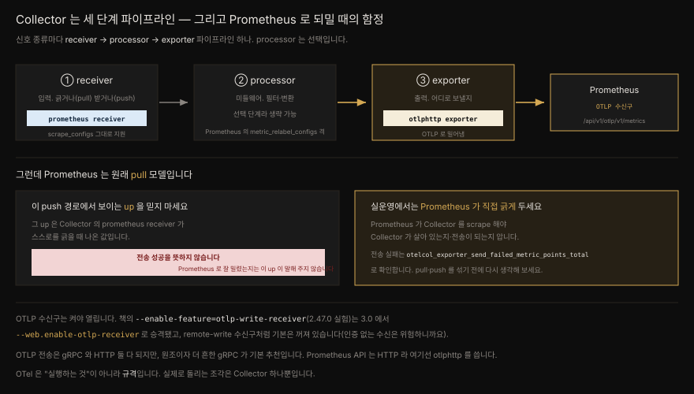

# Prometheus 와 OpenTelemetry 통합 — 규격·Collector·OTLP 수신구

---


## 핵심 요약

> OpenTelemetry(OTel)는 실행하는 기술이 아니라 **규격**입니다. 텔레메트리(메트릭·로그·트레이스)를 어떻게 정의·명명·전송할지 정한 명세(API·SDK·시맨틱 컨벤션)와, 그것을 실어 나르는 프로토콜 OTLP 로 이루어집니다. 벤더 종속을 풀려던 OpenCensus·OpenTracing 두 표준이 2019년 CNCF 아래에서 합쳐진 결과입니다.
>
> 실제로 "돌리는" 조각은 **Collector** 하나뿐입니다. Collector 는 신호 종류마다 **receiver → processor → exporter** 파이프라인을 두고 텔레메트리를 받아 변환해 다른 곳으로 보냅니다.
>
> Prometheus 와의 통합은 두 방향입니다. `prometheus receiver` 로 Prometheus 메트릭을 Collector 로 **긁어 들이고**, `otlphttp` exporter 로 Prometheus 의 OTLP 수신구로 **밀어 넣습니다**. 다만 Prometheus 는 원래 pull 모델이라, 이 push 는 의도를 갖고 써야 합니다 — 무분별한 대체가 아니라.
>
> 이 책이 쓰인 시점의 OTLP 수신구는 실험 기능(`--enable-feature=otlp-write-receiver`, v2.47.0)이었으나, **Prometheus 3.0 에서 `--web.enable-otlp-receiver` 로 승격**됐습니다(기본은 꺼짐). 이 편은 OTel 규격과 Prometheus-OTLP 축을 다루고 305P 애플리케이션에 OTel 을 붙이는 실무는 [`03-11`](../../03_Project/03-11.305P%20OpenTelemetry%20도입%20고려사항.md) 이 맡습니다.


## 학습 목표

> - OTel 이 "규격"이라는 말의 뜻과, API·SDK·시맨틱 컨벤션·OTLP 의 역할을 구분할 수 있습니다.
> - OTel 이 왜 SNMP 이래 드문 표준 통합 사례인지, OpenCensus·OpenTracing 합병 맥락으로 설명할 수 있습니다.
> - Collector 의 receiver·processor·exporter 파이프라인을 Prometheus 개념(scrape·metric_relabel_configs)에 대응시킬 수 있습니다.
> - `prometheus receiver` 로 긁고 `otlphttp` exporter 로 Prometheus OTLP 수신구에 보내는 흐름을 구성할 수 있습니다.
> - OTLP push 경로에서 `up` 메트릭이 왜 오해를 부르는지 설명하고 pull 을 유지할 근거를 댈 수 있습니다.


## 본문 정리

### OTel 은 실행하는 것이 아니라 규격입니다

이 장의 출발점이 여기입니다. Prometheus·Thanos·쿠버네티스는 손에 잡히는, 돌리는 기술입니다. OTel 은 그렇지 않습니다. **명세(specification)** 입니다. 저자는 SNMP 이래 이만큼 널리 채택된 텔레메트리 표준화 노력을 본 적이 없다고 씁니다. 벤더 종속의 최대 가해자였던 클라우드 관측·APM 벤더들조차 자기 독점 프로토콜을 버리고 OTel 을 받아들였습니다.

OTel 은 드문 사건에서 태어났습니다 — **경쟁하던 두 오픈소스 표준의 합병**입니다. 구글이 후원한 **OpenCensus**(2017 시작, 트레이스+메트릭)와 CNCF 프로젝트 **OpenTracing**(2016 시작, 트레이스 중심)이 각자 벤더 종속 문제를 풀려다, 2019년 CNCF 아래에서 **OpenTelemetry** 로 합쳤습니다. 표준이 난립하면 표준이 하나 더 느는 것뿐이라는 [XKCD 927](https://xkcd.com/927) 을 피한, 드문 예외입니다.

> OTel 의 본질("규약 + SDK·Collector 묶음, 저장처는 안 정함")은 [`03-11`](../../03_Project/03-11.305P%20OpenTelemetry%20도입%20고려사항.md) §2 에서도 다룹니다. 그쪽은 305P Spring 앱에 붙이는 관점, 이쪽은 규격 자체와 Prometheus 수신 관점입니다.

### 규격의 구조 — API · SDK · 시맨틱 컨벤션

OTel 명세는 여러 하위 명세로 나뉩니다. 대상 독자가 다릅니다.

| 부분 | 대상 |
|---|---|
| API | OTel SDK 를 만드는 개발자 |
| SDK | 자기 코드를 계측(instrument)해 텔레메트리를 내보내는 애플리케이션 개발자 |
| 시맨틱 컨벤션 | 텔레메트리의 생산자와 소비자 모두 — 이름·값·메타데이터를 일관되게 |

API·SDK 는 **코드를 어떻게 계측할지**를 다룹니다. 8장의 `client_golang` 같은 Prometheus 클라이언트 라이브러리와 결이 비슷합니다. SRE 입장에서는 이 둘의 주 독자가 아닙니다.

저자가 가장 아끼는 부분은 **시맨틱 컨벤션**입니다. 메트릭·로그·트레이스를 어떻게 포맷·명명하고 어떤 메타데이터를 어떤 키로 붙일지 방대하게 정합니다. 여러 팀·서비스에서 Prometheus 를 쓸 때 가장 성가신 문제를 푸는 열쇠입니다. 메트릭과 라벨 이름이 팀마다 어긋나는 문제입니다. 모든 팀이 HTTP 메트릭을 같은 이름으로 노출하고 서비스 구분은 라벨로 하면 좋겠지만 현실은 메트릭 이름으로 서비스를 구분하곤 합니다. 시맨틱 컨벤션이 그 규율을 줍니다.

> **메트릭은 여전히 Prometheus 클라이언트로 낼 수 있습니다.** OTel SDK 도 메트릭을 낼 수 있지만 Prometheus 메트릭에는 Prometheus 클라이언트 라이브러리를 쓰는 게 여전히 흔합니다. OTel 과 Prometheus 의 메트릭 정의가 다르기 때문입니다 — 예컨대 **OTel 에서는 counter 가 단조(monotonic)일 필요가 없습니다.** Prometheus counter 는 단조 증가가 전제입니다.

### OTLP — 텔레메트리를 실어 나르는 프로토콜

규격이 "데이터를 어떻게 정의하나"를 정했다면, **OTLP**(OpenTelemetry line protocol)는 "어떻게 전송하나"를 정합니다. 별도 명세이고 책 집필 시점 버전은 1.1.0 입니다. 주 명세는 1.29.0 입니다. New Relic 같은 관측 SaaS 는 이미 OTLP 를 텔레메트리 수신의 선호 방식으로 삼았습니다. 포맷이 일관되므로, 사용자는 코드를 안 고치고 백엔드 목적지만 바꿔 다른 곳으로 보낼 수 있습니다. OTLP 는 세 신호(메트릭·로그·트레이스)를 다 지원해, 무엇을 보내는지는 수신 서버가 파싱 시점에 판별합니다.

사용자로서 알 것은 OTLP 의 두 구현뿐입니다 — **gRPC 와 HTTP**. 저자는 둘 중 고민되면 gRPC 를 권합니다. OTLP 의 원조 구현이라 더 흔하고 선호됩니다(HTTP 전송은 나중에 추가).

> **"OTLP over HTTP" 의 함정.** gRPC 는 기술적으로 이미 HTTP 위에서 돕니다 — 단 HTTP/2 이상을 지원하는 서버에서만. 그래서 "OTLP over HTTP" 라고 하면 대개 **HTTP/1.1** 로 보낸다는 뜻입니다(호환성 때문). gRPC 냐 HTTP 냐의 갈림은 HTTP/2 vs HTTP/1.1 의 갈림이기도 합니다.

### Collector — 유일하게 돌리는 조각

OTel 에서 실제로 실행하는 것은 **Collector**(otelcol) 하나뿐입니다. 텔레메트리 생산자와 저장 백엔드 사이의 중개 에이전트입니다. 받아서 고치고 내보냅니다 — receive · process · export.

신호 종류마다 **파이프라인**이 하나씩 있고 세 컴포넌트로 이루어집니다.



- **receiver** — 입력. 능동(pull, Prometheus 처럼 긁기)일 수도, 수동(push, 앱이 OTLP 로 밀어넣기)일 수도 있습니다.
- **processor** — 미들웨어. 필터·변환을 합니다. **선택 단계**라 없어도 됩니다. Prometheus 의 `metric_relabel_configs` 와 비슷한 자리 — 저장·전송 직전에 이미 받은 데이터를 손보는 역할입니다.
- **exporter** — 출력. 처리된 데이터를 어디로 보낼지 정합니다.

Prometheus 를 받거나 보내는 컴포넌트는 메인 Collector 저장소에 없습니다. **contrib 저장소**(`opentelemetry-collector-contrib`)에 수십 개 플러그인이 있습니다. 저장소를 나눈 건 바이너리 비대화를 막기 위해서입니다. 다만 Prometheus receiver·exporter 를 포함한 최소 부분집합은 **core 릴리스**(`-contrib` 없는 `otelcol`)에도 들어 있어, 이 장에는 core 로 충분합니다.

> **core·contrib 사이의 중간 길.** "전부 아니면 전무" 대신, 원하는 컴포넌트만 넣어 Collector 를 직접 빌드하는 [collector builder](https://github.com/open-telemetry/opentelemetry-collector/tree/main/cmd/builder) 가 있습니다. 다만 성숙한 배포용이라, 시작 단계에서는 모든 컴포넌트가 있는 `otelcol-contrib` 를 권합니다. (책 본문 예제는 core `otelcol` 로 진행하나, 실험 단계 일반 권고는 contrib 입니다.)

### Prometheus 메트릭을 Collector 로 긁어 들이기

첫 통합은 데이터를 Collector 안으로 넣는 것입니다. `prometheus receiver` 는 Prometheus 의 `scrape_configs` 를 **그대로**(서비스 디스커버리까지) 지원하므로 설정이 쉽습니다. Collector 가 자기 자신을 긁게 하고 아직 Prometheus 로 보내는 대신 `debug` exporter 로 터미널에 뿌려 봅니다.

```yaml
receivers:
  prometheus:
    config:
      scrape_configs:
        - job_name: "otel-collector"
          scrape_interval: 15s
          static_configs:
            - targets: ["127.0.0.1:8888"]
exporters:
  debug:
    verbosity: detailed
service:
  pipelines:
    metrics:
      receivers: [prometheus]
      exporters: [debug]
```

Collector 는 자기 메트릭을 8888 포트의 `/metrics` 에 자동 노출하므로 추가 설정이 없습니다. 몇 초 뒤 첫 스크레이프가 돌면, OTel 내부 표현이 그대로 찍힙니다.

```pseudocode
Metric #9
Descriptor:
  -> Name: otelcol_process_runtime_heap_alloc_bytes
  -> DataType: Gauge
Data point attributes:
  -> service_name: Str(otelcol)
  -> service_version: Str(0.92.0)
Value: 9899336.000000
```

여기서 OTel 이 메트릭을 Prometheus 와 다르게 표현하는 지점이 보입니다. `Gauge` 는 Prometheus gauge 로 그대로 매핑되지만 **Prometheus counter 는 OTel 에서 `Sum`** 으로 표현됩니다. 그리고 `Data point attributes` 의 키들이 곧 **Prometheus 라벨**로 매핑됩니다 — 이 데이터를 Prometheus 로 보낼 때 각 키가 라벨 이름이 됩니다.

### Collector 에서 Prometheus 로 OTLP 로 밀어넣기

반대 방향입니다. exporter 만 바꾸면 됩니다. Prometheus API 가 HTTP 기반이므로 `otlphttp` exporter 를 씁니다.

```yaml
exporters:
  otlphttp:
    endpoint: http://localhost:9090/api/v1/otlp
service:
  pipelines:
    metrics:
      receivers: [prometheus]
      exporters: [otlphttp]
```

> **endpoint 는 절반만 씁니다.** `otlphttp` exporter 는 URL 에 접미사를 자동으로 붙입니다(`/v1/metrics` 등). 그래서 `endpoint` 에는 `/api/v1/otlp` 까지만 주는데, 실제로 데이터가 가는 완전한 경로는 `/api/v1/otlp/v1/metrics` 입니다.

Prometheus 쪽은 OTLP 수신구를 켜야 합니다(다음 절). 켜고 나면 Collector 메트릭이 Prometheus 에 들어와 조회됩니다.


## 심화 학습

### OTLP 수신 플래그는 3.0 에서 승격됐습니다 — 정오표 겸 버전 드리프트

이 장에서 가장 확실한 버전 드리프트입니다. 책은 Prometheus 의 OTLP 수신을 실험 기능으로 소개하고 다음 플래그를 씁니다.

```yaml
# 책의 Helm values — v2.49.1 + 실험 플래그
prometheusSpec:
  enableFeatures:
    - otlp-write-receiver
  image:
    tag: v2.49.1
```

책 본문대로면 프로세스에 `--enable-feature=otlp-write-receiver` 가 붙습니다. 저자는 이 기능이 "책을 쓰는 중에(Prometheus **2.47.0**) 나왔다"고 밝힙니다.

그런데 **Prometheus 3.0 에서 이 실험 플래그가 승격**됐습니다. 지금은 feature flag 가 아니라 전용 플래그입니다.

```bash
# 현재 (Prometheus 3.0+)
--web.enable-otlp-receiver
```

feature_flags 문서를 직접 확인하니 `otlp-write-receiver` 는 목록에 없고 대신 delta 관련 플래그(`otlp-deltatocumulative`·`otlp-native-delta-ingestion`)만 남아 있습니다. 기본 OTLP 수신 자체는 feature flag 를 졸업했다는 뜻입니다. 그리고 이 수신구는 **기본으로 꺼져** 있습니다. [9장](./09-01.remote%20write%20와%20remote%20read%20—%20프로토콜·에이전트·튜닝.md)의 remote-write 수신구와 같은 이유입니다 — Prometheus 는 인증 없이도 도는데, 인증 없는 수신구를 기본으로 열면 위험하기 때문입니다.

지금 이 장을 따라 한다면 `--enable-feature=otlp-write-receiver` 가 아니라 `--web.enable-otlp-receiver` 를 켜야 합니다. remote-write 수신구가 `--web.enable-remote-write-receiver` 인 것과 나란히 놓으면 규칙이 보입니다 — **수신구 계열은 `--web.enable-*-receiver`** 입니다.

> 검증: [Prometheus feature flags 문서](https://prometheus.io/docs/prometheus/latest/feature_flags/)에 `otlp-write-receiver` 부재 확인. 승격 시점(3.0)과 새 플래그명은 [Prometheus OpenTelemetry 가이드](https://prometheus.io/docs/guides/opentelemetry/)·[Grafana — Prometheus 3.0 and OpenTelemetry](https://grafana.com/blog/prometheus-3-0-and-opentelemetry-a-practical-guide-to-storing-and-querying-otel-data/) 로 확인. 완전한 수신 경로 `/api/v1/otlp/v1/metrics` 도 같은 문서로 재확인.

### `up` 을 믿지 말라 — pull·push 를 섞을 때의 함정

책이 흥분을 가라앉히고 던지는 경고가 이 장의 핵심 통찰입니다. Collector 가 OTLP 로 Prometheus 에 메트릭을 밀어넣으면, Prometheus 에서 `up` 메트릭이 보입니다. **그 `up` 을 전송 성공의 신호로 오해하면 안 됩니다.**

그 `up` 은 Collector 의 `prometheus receiver` 가 자기 자신을 긁을 때 나온 값입니다. Collector 가 Prometheus 로 데이터를 잘 밀었는지와는 아무 상관이 없습니다. 그러니 전송 성공 여부를 이 `up` 으로 알림 걸면 안 됩니다.

실운영이라면, Collector 로 push 하도록 구성했더라도 **Prometheus 가 Collector 를 직접 scrape** 하게 두는 편이 낫습니다. 그래야 Collector 가 살아 있는지, push 가 실제로 성공하는지를 (`otelcol_exporter_send_failed_metric_points_total` 로) 신뢰성 있게 압니다.

여기서 저자가 한 발 더 나갑니다. pull 과 push 를 둘 다 섞는 지점에 오면, "그냥 전부 pull 로 하는 게 낫지 않나"를 진지하게 따져야 합니다. **새 OTLP 수신 기능이 생겼어도 Prometheus 는 여전히 pull 시스템으로 설계**됐고 거기서 벗어나는 데는 그럴 만한 이유가 있어야 합니다.

이 결론은 [9장](./09-01.remote%20write%20와%20remote%20read%20—%20프로토콜·에이전트·튜닝.md)의 remote-write 논의와 정확히 같은 결입니다. Prometheus 를 push 수신구로 쓰는 것은 되지만 pull 이 안 되는 특수한 이유(에페메럴 배치, 방화벽 격리 등)가 있을 때의 예외이지 기본이 아닙니다.

### 305P 관점과의 분업

이 편은 OTel **규격과 Prometheus 수신** 축입니다. 같은 OTel 을 305P Spring 애플리케이션에 붙이는 실무는 [`03-11.305P OpenTelemetry 도입 고려사항`](../../03_Project/03-11.305P%20OpenTelemetry%20도입%20고려사항.md) 이 다룹니다. Kafka 트레이스 전파, tail sampling, Loki/Tempo exporter, MDC traceId, Alloy DaemonSet 배치가 거기 있습니다. 특히 03-11 §10 은 "앱이 곧장 Loki/Tempo 로 보낼지, Collector 를 통할지"를 305P 폐쇄망 가정 아래 결정하는데, 이 책이 준 Collector 파이프라인 이해가 그 결정의 토대가 됩니다.

한 가지 이어지는 사실. 03-11 은 **Alloy 가 OTel Collector 코드 위에 Grafana 컴포넌트 모델을 얹은 수집기**라고 적습니다([02-02](../../02_LGTMStack/02-02.Grafana%20Alloy.md) 참조). 즉 이 장에서 배운 receiver·processor·exporter 파이프라인은 Alloy 를 쓸 때도 그대로 유효합니다 — Alloy 설정이 곧 Collector 파이프라인의 Grafana 방언입니다.


## 실무 적용

> 책의 실험 플래그 대신 현행 Prometheus 3.0+ 기준으로 켜는 법을 적습니다. 그다음 push 를 쓸지, 어느 라이브러리로 메트릭을 낼지를 판단합니다.

### Prometheus 를 OTLP 백엔드로 켜기 (현행)

책의 v2.49.1 + 실험 플래그 대신, 현행 Prometheus 3.0+ 기준으로 정리합니다.

1. Prometheus 프로세스에 `--web.enable-otlp-receiver` 를 켭니다(기본 꺼짐). Helm 이면 프로세스 args 로 주입합니다.
2. 수신 경로는 `/api/v1/otlp/v1/metrics` 입니다. `otlphttp` exporter 의 `endpoint` 에는 `/api/v1/otlp` 까지만 줍니다(접미사 자동).
3. 인증 없는 수신구이므로, 외부 노출 시 앞단에 인증·네트워크 격리를 둡니다(remote-write 수신구와 동일 원칙).
4. 여러 replica 에 push 할 때의 복잡성을 피하려면 single replica 로 시작합니다(책의 선택).

### push 를 쓸지 판단하기

| 상황 | 권장 |
|---|---|
| 일반적인 상시 서비스 | pull 유지 — Prometheus 가 Collector·타깃을 직접 scrape |
| Collector 생존·전송 성공 모니터링 | Prometheus 가 Collector 를 scrape (`otelcol_exporter_send_failed_metric_points_total` 관측) |
| pull 이 근본적으로 불가(에페메럴·격리) | OTLP push 예외 허용 |
| 전송 성공 알림 | `up` 금지 — 그 `up` 은 Collector 의 self-scrape 값 |

### 메트릭을 낼 때 어느 라이브러리를

Prometheus 메트릭은 Prometheus 클라이언트(`client_golang` 등)로 내는 편이 여전히 안전합니다. OTel SDK 로도 낼 수 있지만 메트릭 모델이 달라(예: OTel counter 는 비단조 허용), Prometheus 로 넘어올 때 counter→Sum 같은 매핑을 거칩니다. 트레이스·로그는 OTel SDK 가 자연스럽고 메트릭만 당분간 Prometheus 클라이언트를 병행하는 절충이 흔합니다.


## 체크리스트

- [ ] OTLP 수신을 켤 때 현행 플래그 `--web.enable-otlp-receiver` 를 쓰는가(책의 `otlp-write-receiver` 아님)
- [ ] 수신구가 기본 꺼짐이고 인증이 없음을 알고 노출 시 앞단 보호를 두었는가
- [ ] `otlphttp` endpoint 에 `/api/v1/otlp` 까지만 주고 접미사 자동 부착을 이해했는가
- [ ] push 경로의 `up` 을 전송 성공 신호로 오해하지 않는가
- [ ] Collector 생존·전송을 Prometheus 가 직접 scrape 해 확인하는가
- [ ] pull 로 충분한데 push 를 쓰고 있지는 않은가(예외에는 근거가 있는가)
- [ ] Collector 파이프라인(receiver·processor·exporter)을 305P/Alloy 맥락([`03-11`](../../03_Project/03-11.305P%20OpenTelemetry%20도입%20고려사항.md))과 이어 이해했는가


## 면접 관점

**Q. OpenTelemetry 는 Prometheus 를 대체합니까?**

아닙니다. OTel 은 실행하는 기술이 아니라 텔레메트리를 정의·전송하는 **규격**입니다. Prometheus 와는 대체가 아니라 통합 관계입니다 — Collector 의 `prometheus receiver` 로 Prometheus 메트릭을 긁고 `otlphttp` exporter 로 Prometheus 의 OTLP 수신구에 보낼 수 있습니다. 저자도 OTel 을 Prometheus 의 pull 모델을 통째로 갈아치우는 용도가 아니라 의도를 갖고 쓰라고 강조합니다.

**Q. Collector 의 receiver·processor·exporter 는 Prometheus 의 무엇에 대응합니까?**

receiver 는 입력으로, pull(scrape)이거나 push(OTLP 수신)일 수 있어 Prometheus 의 `scrape_configs` 와 remote-write 수신을 합친 자리입니다. processor 는 선택적 미들웨어로, Prometheus 의 `metric_relabel_configs` 처럼 저장·전송 직전 데이터를 필터·변환합니다. exporter 는 출력으로, 어느 백엔드로 보낼지 정합니다. 신호 종류마다 이 파이프라인이 하나씩 있습니다.

**Q. OTLP push 로 Prometheus 에 넣을 때 `up` 을 왜 못 믿습니까?**

그 `up` 은 Collector 의 `prometheus receiver` 가 자기 자신을 scrape 할 때 나온 값이라, Collector→Prometheus 전송 성공과 무관합니다. 전송 성공을 알려면 Prometheus 가 Collector 를 직접 scrape 하고 `otelcol_exporter_send_failed_metric_points_total` 을 봐야 합니다. 근본적으로 Prometheus 는 pull 시스템이라, push 를 섞는 순간 이런 관측 공백이 생깁니다.

**Q. 책의 OTLP 활성화 방법을 그대로 따라도 됩니까?**

버전 드리프트가 있습니다. 책의 `--enable-feature=otlp-write-receiver`(v2.47.0 실험)는 **Prometheus 3.0 에서 `--web.enable-otlp-receiver` 로 승격**됐고 기본은 꺼져 있습니다. remote-write 수신구가 `--web.enable-remote-write-receiver` 인 것과 같은 계열입니다. 그래서 현행에서는 새 플래그를 써야 합니다.


## 참고 자료

- 원본: *Mastering Prometheus* (Packt, ISBN 9781805125662) 14장 — Integrating Prometheus with OpenTelemetry
- [OpenTelemetry 명세](https://opentelemetry.io/docs/specs/otel/) · [OTLP 명세](https://opentelemetry.io/docs/specs/otlp/) · [시맨틱 컨벤션](https://opentelemetry.io/docs/specs/semconv/)
- [What is OpenTelemetry](https://opentelemetry.io/docs/what-is-opentelemetry/) — CNCF·OpenCensus+OpenTracing 합병
- [Using Prometheus as your OpenTelemetry backend](https://prometheus.io/docs/guides/opentelemetry/) · [Prometheus feature flags](https://prometheus.io/docs/prometheus/latest/feature_flags/) — `--web.enable-otlp-receiver` 확인
- [Grafana — Prometheus 3.0 and OpenTelemetry](https://grafana.com/blog/prometheus-3-0-and-opentelemetry-a-practical-guide-to-storing-and-querying-otel-data/) — 플래그 승격 시점
- [opentelemetry-collector](https://github.com/open-telemetry/opentelemetry-collector) · [collector-contrib](https://github.com/open-telemetry/opentelemetry-collector-contrib) · [collector builder](https://github.com/open-telemetry/opentelemetry-collector/tree/main/cmd/builder)
- 저장소 내: [`03-11.305P OpenTelemetry 도입 고려사항`](../../03_Project/03-11.305P%20OpenTelemetry%20도입%20고려사항.md) — 305P 애플리케이션 계측·Alloy·Kafka 트레이스 축 · [`02-02.Grafana Alloy`](../../02_LGTMStack/02-02.Grafana%20Alloy.md) — Alloy = OTel Collector 기반
- 앞 편: [13-01.SLO 를 Prometheus 로 정의하고 알림하기](./13-01.SLO%20를%20Prometheus%20로%20정의하고%20알림하기%20—%20요청·윈도우%20기반과%20Sloth·Pyrra.md) · remote-write 수신구: [09-01](./09-01.remote%20write%20와%20remote%20read%20—%20프로토콜·에이전트·튜닝.md)
