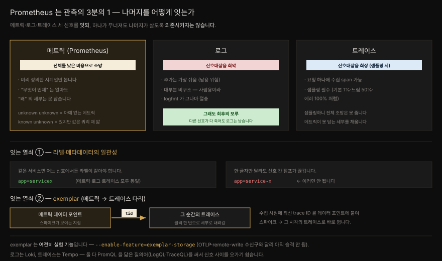

# Prometheus 너머 — 세 신호를 잇는 관측 가능성과 exemplar

---


## 핵심 요약

> Prometheus 는 관측 가능성의 **3분의 1** 입니다. 세 핵심 신호가 메트릭·로그·트레이스라면, Prometheus 만으로는 온전한 관측에 3분의 1만 다다릅니다. 이 마지막 장은 나머지 둘을 어떻게 붙일지 묻습니다.
>
> **로그**는 신호대잡음이 가장 나쁩니다. 추가는 가장 쉬워 남용되기 쉽고 대부분 비구조입니다. 그래도 다른 신호가 다 죽어도 남는 **최후의 보루**입니다. **트레이스**는 샘플링하면 신호대잡음이 가장 좋지만 샘플링 탓에 전체 조망은 못 줍니다 — 메트릭이 못 담는 세부를 채우는 역할입니다.
>
> 세 신호를 잇는 두 열쇠는 **라벨·메타데이터의 일관성**(같은 서비스는 어느 신호에서든 같은 라벨)과 **exemplar**(메트릭 데이터 포인트에 trace ID 를 붙여 스파이크에서 트레이스로 바로 점프)입니다. 원칙은 하나 — **잇되 서로 의존시키지 않는다.** 로그 수집이 깨져도 메트릭은 봐야 합니다.
>
> 도구로는 로그에 Loki, 트레이스에 Tempo(둘 다 Grafana Labs, PromQL 을 닮은 LogQL·TraceQL). 이 편은 그 *철학*과 Prometheus 쪽 exemplar 기제를 다루고 Loki·Tempo 내부는 [`02-03`](../../02_LGTMStack/02-03.Grafana%20Loki.md)·[`02-04`](../../02_LGTMStack/02-04.Grafana%20Tempo.md) 가 맡습니다.


## 학습 목표

> - Prometheus 가 왜 관측의 3분의 1인지, "unknown unknown" 개념으로 설명할 수 있습니다.
> - 세 신호의 신호대잡음 특성(로그 최악·트레이스 최상)과 각자의 자리를 구분할 수 있습니다.
> - 로그에서 메트릭을 추출하지 말고 메트릭을 직접 더해야 하는 이유를 댈 수 있습니다.
> - "잇되 의존시키지 않는다" 원칙을 라벨 일관성·exemplar 로 구체화할 수 있습니다.
> - exemplar 의 Prometheus 쪽 기제(`--enable-feature=exemplar-storage`)와 그 현행 상태를 압니다.


## 본문 정리

### Prometheus 는 관측의 3분의 1입니다

관측 가능성(observability)의 핵심은 **"unknown unknown"** 을 설명해 내는 능력입니다. 모르는 줄도 모르는 것을 말합니다. 시스템이 어떻게 깨질지 미리 알지 못해도 효과적으로 관측할 수 있어야 한다는 뜻입니다. 이 표현은 미국 국방장관 도널드 럼스펠드가 널리 퍼뜨렸습니다.

Prometheus 에 대응시키면, **unknown unknown 은 아예 존재하지 않는 메트릭**이고 **known unknown 은 존재하되 값이 쿼리 시점까지 알려지지 않는 메트릭**입니다. Prometheus 는 수백만 시계열을 모아 unknown 을 known 으로 바꿔 주지만 본질적으로 **메트릭을 미리 정의**해야 합니다. 아무리 많이 정의해도 예상 못 한 것은 반드시 남습니다.

더 동적인 텔레메트리가 필요하고 그래서 로그와 트레이스로 눈을 돌립니다. 세 신호가 메트릭·로그·트레이스라면 Prometheus 는 그중 하나 — 3분의 1입니다.



### 로그 — 최악의 신호대잡음, 그래도 최후의 보루

저자는 로그와의 관계를 "복잡하다"고 표현합니다. 로그는 가장 접근하기 쉬운 신호입니다. 현대 모니터보다 오래됐고 종이에 출력하던 시절로 거슬러 올라가, 모든 개발자·SRE 가 무엇인지 압니다. 동시에 세 신호 중 **신호대잡음이 명백히 최악**입니다. 수천 줄 건초더미에서 바늘을 찾는 시간이 곧 로그와 보낸 시간입니다.

근본 문제는 대부분의 로그가 **비구조**라는 점입니다. 사람이 읽으라고 만들어져 가독성이 파싱 편의보다 우선합니다. 구조화 로깅(JSON 등)이 늘고 있지만 사람 가독성과 기계 파싱을 완벽히 맞추는 지점은 오지 않을 것 같다고 저자는 봅니다. 그나마의 절충이 **logfmt** 입니다 — Heroku 가 퍼뜨리고 여러 Go 프로젝트가 쓰는, 공백으로 구분된 `key=value` 스타일입니다. Prometheus 자신의 로그 포맷이기도 합니다.

```pseudocode
ts=2024-01-27T03:00:01.861Z caller=head.go:1287 level=info component=tsdb msg="WAL ..."
```

기계 파싱과 사람 가독성을 어느 정도 함께 잡지만 `"WAL checkpoint complete."` 만 찍는 것보다는 읽기 어렵습니다. 그래서 비구조에서 logfmt 로 옮기는 것조차 저항을 받습니다.

그럼에도 로그는 **최후의 보루**입니다. 트레이스가 오브젝트 스토리지에서 사라지고 Prometheus 가 무너져도 로컬 로그는 남습니다. 그리고 Prometheus 메트릭과 결합될 때 더 빛납니다 — 메트릭에서 스파이크를 보고 그 구간으로 줌인해 해당 서비스의 로그로 바로 뛰는 편의는, 한번 맛보면 없이 못 삽니다.

### 로그에서 메트릭을 뽑지 마세요

엔지니어는 "이미 로그가 있는데 메트릭을 또 더해야 하나" 하며 **로그에서 메트릭을 추출**하려 듭니다. 저자의 답은 단호합니다 — 그건 **항상 지양**해야 합니다.

이유는 로그가 본질적으로 메트릭보다 더 자주 바뀌기 때문입니다. 맥락이 추가되고 포맷이 달라지면 패턴 파싱이 깨지고 파싱 오류로 관측 공백이 생깁니다. 이 취약한 번역 계층은 로그 생산 팀과 로그 저장·파싱 운영 팀 양쪽에 디버깅 부담을 장기적으로 지웁니다.

**메트릭은 직접 더하는 편이 항상 낫습니다.** 로그 한 줄마다 메트릭을 증가시키는 게 중복처럼 느껴져도, 그 몇 줄의 코드값은 충분합니다. 이것이 이 장 전체를 관통하는 원칙의 첫 사례입니다. **신호는 이어지되 서로 의존하지 않아야 합니다.** 로그 수집·파싱에 문제가 생겨도 메트릭까지 잃으면 안 됩니다. 다만 한 신호에서 다른 신호로 같은 시점을 여러 각도에서 보도록 **점프는 쉬워야** 합니다.

### 트레이스 — 최상의 신호대잡음, 그러나 샘플링

로그가 가장 오래된 신호라면 트레이스는 가장 새롭습니다(지속 프로파일링 같은 신호가 떠오르고 있지만 아직 "핵심"은 아닙니다). 저자조차 가장 경험이 적다고 고백하지만 제대로 쓰면 인생이 바뀐다고 합니다.

트레이스는 **샘플링을 제대로 하면 신호대잡음이 가장 좋습니다.** 서비스 요청·작업마다 대개 트레이스 하나가 나오고 한 트레이스에 수십 개의 자식 span 이 들 수 있어 요청당 로그 줄보다 span 이 많기 쉽습니다. 그래서 저장·쿼리 비용이 큽니다.

**샘플링**이 그 비용을 다스립니다. 예컨대 기본 1% 를 저장하되, 특정 시간을 넘긴 요청은 50%, 에러가 난 요청은 100% 로 둘 수 있습니다. 소음을 걸러 남은 트레이스의 가치를 높입니다. 다만 고volume 서비스에는 샘플링이 사실상 필수라, 트레이스는 Prometheus 가 주는 **전체 조망을 대체할 수 없습니다.** 메트릭이 본질적으로 생략하는 세부를 채울 뿐입니다.

### 점을 잇기 — 메타데이터 일관성

세 신호를 엮는 가장 의미 있는 방법은 **텔레메트리에 붙는 메타데이터의 일관성**입니다. Prometheus 맥락에서는 라벨 키·값을 말합니다. ServiceX 의 메트릭에 `app=servicex` 라벨이 붙었다면, 그 서비스의 로그에도 `app=service-x` 가 아니라 **똑같이 `app=servicex`** 가 붙어야 합니다. 한 글자만 달라도 신호 사이 점프가 끊깁니다.

Prometheus 의 라벨·라벨 매처 개념은 새 관측 시스템들에 크게 영향을 줬습니다. 그들의 질의어가 PromQL 을 닮아, 시스템 간 이동 시 필터를 바꿀 필요가 줄었습니다. 그 대표가 로그의 **Loki**, 트레이스의 **Tempo** — 둘 다 Grafana Labs 입니다.

- **Loki** 는 자신을 Prometheus 에 빗대는 걸 피하지 않습니다. GitHub 설명이 아예 *"Like Prometheus, but for logs"* 입니다. 비슷한 라벨, WAL, PromQL 을 닮은 **LogQL**, Prometheus 같은 TSDB 인덱스를 씁니다. Elastic Stack(ELK)보다 운영이 훨씬 단순하고(단일 바이너리 모드), 오브젝트 스토리지를 써 수 TB 디스크가 필요 없습니다. 저자 팀은 초당 수십만 로그 줄 규모로 Loki 를 돌립니다.
- **Tempo** 는 Prometheus·Loki 와 깊이 통합된 확장형 트레이싱입니다. 역시 PromQL 을 닮은 **TraceQL** 을 씁니다.

> **LGTM 스택.** 세 신호를 덮는 Grafana 제품군 — Loki·Grafana·Tempo·Mimir — 을 흔히 LGTM 스택이라 부릅니다. PR 리뷰의 "looks good to me" 를 딴 말장난입니다. Loki·Tempo·Mimir 는 모두 AGPLv3 라이선스입니다([9장](./09-02.VictoriaMetrics%20와%20Grafana%20Mimir.md) 의 Mimir 참조).
>
> 이 도구들의 내부는 저장소에 이미 있습니다 — [`02-03.Grafana Loki`](../../02_LGTMStack/02-03.Grafana%20Loki.md)·[`02-04.Grafana Tempo`](../../02_LGTMStack/02-04.Grafana%20Tempo.md)·[`02-05.Grafana Mimir`](../../02_LGTMStack/02-05.Grafana%20Mimir.md). 이 편은 "왜 이들을 잇는가"의 관점만 담습니다.

### exemplar — 메트릭에서 트레이스로 뛰는 다리

신호 간 점프의 가장 자연스러운 방법은 질의어 유사성이 아니라 Prometheus 에 내장된 **exemplar** 입니다. exemplar 는 메트릭의 높은 조망과 트레이스의 드릴다운을 잇습니다.

원리는 단순합니다. Prometheus 가 시계열 데이터 포인트를 수집할 때 **최신 trace ID 를 그 포인트에 붙입니다.** 나중에 그 데이터를 시각화하면(Prometheus 나 Grafana 에서), 사용자에게 그 트레이스로 가는 링크가 뜹니다. 메트릭에서 스파이크를 보고 그 시각의 트레이스로 바로 뛰는 것 — 트레이스가 특정 요청으로 파고드는 데 특화됐으니, 이 점프가 트레이스의 유용성을 한층 키웁니다.

> **exemplar 는 여전히 실험 기능입니다.** `--enable-feature=exemplar-storage` 로 켭니다. 흥미롭게도, [9장](./09-01.remote%20write%20와%20remote%20read%20—%20프로토콜·에이전트·튜닝.md)의 remote-write 수신구나 [14장](./14-01.Prometheus%20와%20OpenTelemetry%20통합%20—%20규격·Collector·OTLP%20수신구.md)의 OTLP 수신구가 3.0 에서 전용 플래그로 **승격된 것과 달리**, exemplar-storage 는 지금도 feature flag 로 남아 있습니다. 즉 이 기능만큼은 책의 서술이 그대로 유효합니다.


## 심화 학습

### 세 신호의 신호대잡음 순서 — 로그 최악, 트레이스 최상

이 장의 뼈대는 세 신호를 신호대잡음(signal-to-noise)으로 줄 세운 것입니다. 직관과 어긋날 수 있어 정리합니다. 책이 명시하는 것은 두 극단뿐 — **로그가 최악, 트레이스가 최상**입니다. 메트릭은 그 사이라는 순위를 책이 따로 말하지는 않으므로, 아래 표의 메트릭 칸은 두 극단에서 미루어 둔 자리입니다.

| 신호 | 신호대잡음 | 특성 | 자리 |
|---|---|---|---|
| 로그 | **최악** (책 명시) | 추가 쉬움·대부분 비구조·남용 위험 | 최후의 보루, 다른 신호와 결합 시 가치 |
| 메트릭 | (그 사이로 추정) | 미리 정의 필요·저비용 전체 조망 | 시스템의 높은 뷰 (Prometheus) |
| 트레이스 | **최상**(샘플링 시, 책 명시) | 요청당 수십 span·비쌈·샘플링 필수 | 세부 드릴다운, 조망은 못 줌 |

핵심은 **어느 하나가 다른 둘을 대체하지 못한다**는 것입니다. 트레이스가 신호대잡음이 좋다고 메트릭을 대신할 수 없습니다. 샘플링하기 때문입니다. 메트릭이 저비용이라고 로그의 세부를 담지 못합니다 — 미리 정의하니까요. 세 신호는 경쟁이 아니라 **역할 분담**입니다.

### "잇되 의존시키지 않는다" — 이 책의 마지막 원칙

이 원칙은 두 얼굴을 가집니다. **잇는다**는 것은 같은 시점을 여러 각도로 보도록 점프가 쉬워야 한다는 뜻입니다. 라벨 일관성과 exemplar 가 그 수단입니다. **의존시키지 않는다**는 것은 한 신호의 수집·파싱이 깨져도 나머지가 살아야 한다는 뜻 — 그래서 로그에서 메트릭을 뽑는 취약한 번역 계층을 금합니다.

이 이중 원칙이 앞 장들과 이어집니다. [14장](./14-01.Prometheus%20와%20OpenTelemetry%20통합%20—%20규격·Collector·OTLP%20수신구.md)에서 OTLP push 의 `up` 을 믿지 말라던 것도 같은 결입니다 — 신호를 잇되(OTLP 로 보내되) 그 전송 성공을 별도 신호(직접 scrape)로 독립 검증하라는 것이니까요. 관측 시스템은 서로를 보완하되 서로의 단일 장애점이 되면 안 됩니다.

### exemplar 가 왜 안 승격됐을까 — 추정과 사실의 구분

remote-write·OTLP 수신구는 3.0 에서 `--web.enable-*-receiver` 로 승격됐는데 exemplar-storage 는 여전히 feature flag 입니다. feature_flags 문서를 직접 확인해 이 **사실**은 검증했습니다. 다만 "왜 승격이 늦는가"는 문서가 답하지 않는 회색지대라, 추정을 사실처럼 적지 않습니다.

관측할 수 있는 사실만 적으면 — 문서는 exemplar 저장을 "고정 크기 순환 버퍼(fixed size circular buffer)에 메모리로 저장"이라 설명합니다. 메모리 고정 버퍼라 오래된 exemplar 가 밀려나는 구조이고 이는 수신구(네트워크 입력 경로)와 성격이 다른 저장 기능입니다. 승격 판단 기준이 기능마다 다를 수 있다는 정도까지가 사실이 뒷받침하는 범위입니다.

> 검증: [Prometheus feature flags 문서](https://prometheus.io/docs/prometheus/latest/feature_flags/)에서 `exemplar-storage` 가 여전히 실험 목록에 있고 순환 버퍼로 구현됨을 확인. Loki 태그라인·AGPLv3 는 [grafana/loki](https://github.com/grafana/loki) 로 확인.


## 실무 적용

> 세 신호를 붙일 때 지킬 것은 라벨 통일입니다. 그리고 로그로 다 하려는 남용을 어디서 끊을지가 나머지 절반입니다.

### 관측 스택을 세 신호로 채울 때

| 신호 | 도구(저장소 내 참조) | 이 편의 관점 |
|---|---|---|
| 메트릭 | Prometheus / [Mimir](../../02_LGTMStack/02-05.Grafana%20Mimir.md) | 전체 조망. 미리 정의 |
| 로그 | [Loki](../../02_LGTMStack/02-03.Grafana%20Loki.md) | 최후의 보루. logfmt·구조화, 하지만 메트릭 추출은 금지 |
| 트레이스 | [Tempo](../../02_LGTMStack/02-04.Grafana%20Tempo.md) | 세부 드릴다운. 샘플링 설계가 핵심 |

세 신호를 붙일 때 지킬 두 가지.

1. **라벨을 통일합니다.** ServiceX 는 메트릭·로그·트레이스 어디서든 같은 라벨 키·값을 씁니다. 이 일관성이 신호 간 점프의 전제입니다. 305P 라벨 카탈로그 결정([`03-09`](../../03_Project/03-09.305P%20관측%20운영기록.md))도 이 원칙의 적용입니다.
2. **exemplar 로 메트릭→트레이스를 잇습니다.** Prometheus 에 `--enable-feature=exemplar-storage` 를 켜고 Grafana datasource 에서 trace ID 목적지를 지정합니다(그 wiring 은 [`02-01`](../../02_LGTMStack/02-01.Grafana%20Core.md) §exemplar 참조).

### 로그 남용을 막는 판단

| 유혹 | 왜 나쁜가 | 대신 |
|---|---|---|
| 함수마다 로그 줄 여러 개 → 트레이스 대용 | 로그는 span 구조·인과를 못 담음 | 트레이스를 직접 추가 |
| 패턴 매칭 로그 줄 세기 → 메트릭 대용 | 로그 포맷 변경 시 파싱 깨짐 | 메트릭을 직접 추가 |
| 로그에서 지표 추출 | 취약한 번역 계층·관측 공백 | 신호를 독립적으로 생산 |

핵심 질문은 하나 — "이 신호가 깨지면 다른 신호도 함께 잃는가?" 그렇다면 잘못된 결합입니다.


## 체크리스트

- [ ] 세 신호(메트릭·로그·트레이스)를 각자의 자리로 이해하고 하나로 나머지를 대체하려 하지 않는가
- [ ] 로그에서 메트릭·트레이스를 추출하는 취약한 번역 계층을 만들지 않았는가
- [ ] 같은 서비스의 라벨이 모든 신호에서 동일한가(`app=servicex` vs `app=service-x`)
- [ ] 신호를 이었지만 서로의 단일 장애점이 되지 않게 독립적으로 생산하는가
- [ ] 트레이스 샘플링을 (기본%·느린 요청%·에러 100% 처럼) 가치 위주로 설계했는가
- [ ] exemplar 로 메트릭→트레이스 점프를 연결했는가(`--enable-feature=exemplar-storage`, 여전히 실험)
- [ ] Loki·Tempo 내부는 [`02-03`](../../02_LGTMStack/02-03.Grafana%20Loki.md)·[`02-04`](../../02_LGTMStack/02-04.Grafana%20Tempo.md) 로 깊이 보는가


## 면접 관점

**Q. "Prometheus 만으로는 관측이 3분의 1" 이라는 말의 뜻은?**

핵심 관측 신호가 메트릭·로그·트레이스 셋이라면, Prometheus 는 메트릭 하나를 담당합니다. 게다가 메트릭은 미리 정의해야 하므로 "unknown unknown"(존재하지 않는 메트릭)을 못 잡습니다. 로그와 트레이스가 그 동적 세부를 채워야 온전한 관측에 가까워집니다. 다만 어느 신호도 나머지를 대체하지 못하고 역할이 다릅니다.

**Q. 로그에서 메트릭을 추출하면 왜 안 됩니까?**

로그는 맥락 추가·포맷 변경으로 메트릭보다 자주 바뀝니다. 그 위에 패턴 파싱으로 메트릭을 얹으면, 로그가 바뀔 때마다 파싱이 깨져 관측 공백이 생깁니다. 이 취약한 번역 계층은 생산·운영 양쪽에 디버깅 부담을 지웁니다. 메트릭은 코드에서 직접 더하는 편이 항상 낫습니다 — 몇 줄의 비용으로 신호를 독립적으로 지킵니다.

**Q. 신호를 "잇되 의존시키지 않는다" 는 무슨 뜻입니까?**

잇는다는 것은 같은 시점을 여러 각도로 보도록 점프가 쉬워야 한다는 것 — 라벨 일관성과 exemplar 가 수단입니다. 의존시키지 않는다는 것은 한 신호의 수집·파싱이 깨져도 나머지가 살아야 한다는 것입니다. 그래서 로그→메트릭 추출 같은 결합을 금합니다. 관측 시스템은 서로를 보완하되 서로의 단일 장애점이 되면 안 됩니다.

**Q. exemplar 는 무엇이고 어떻게 동작합니까?**

메트릭 데이터 포인트에 최신 trace ID 를 붙이는 Prometheus 기능입니다. 수집 시점에 trace ID 를 얹어 두면, 시각화 시 그 트레이스로 가는 링크가 떠서 메트릭 스파이크에서 그 시각의 트레이스로 바로 뜁니다. 메트릭의 조망과 트레이스의 드릴다운을 잇는 다리입니다. 현재도 실험 기능이라 `--enable-feature=exemplar-storage` 로 켜야 하며 고정 크기 순환 버퍼에 메모리로 저장됩니다.


## 참고 자료

- 원본: *Mastering Prometheus* (Packt, ISBN 9781805125662) 15장 — Beyond Prometheus (마지막 장)
- [Prometheus feature flags](https://prometheus.io/docs/prometheus/latest/feature_flags/) — `exemplar-storage` 가 여전히 실험임을 확인
- [grafana/loki](https://github.com/grafana/loki) — "Like Prometheus, but for logs" 태그라인·AGPLv3 확인 · [grafana/tempo](https://github.com/grafana/tempo)
- [logfmt](https://brandur.org/logfmt) — Heroku 발 로그 스타일
- OpenTelemetry 권장서: Boten *Cloud-Native Observability With OpenTelemetry* (Packt, 2022) · Parker·Young *Learning OpenTelemetry* (O'Reilly, 2024) · Majors et al. *Observability Engineering* (O'Reilly, 2022)
- 저장소 내: [`02-03.Grafana Loki`](../../02_LGTMStack/02-03.Grafana%20Loki.md) · [`02-04.Grafana Tempo`](../../02_LGTMStack/02-04.Grafana%20Tempo.md) · [`02-05.Grafana Mimir`](../../02_LGTMStack/02-05.Grafana%20Mimir.md) · [`02-01.Grafana Core`](../../02_LGTMStack/02-01.Grafana%20Core.md) (exemplar wiring) · [`01-03.시그널 모델`](../../01_Foundations/01-03.시그널%20모델%20—%20Golden%20Signals,%20RED,%20USE.md)
- 앞 편: [14-01.Prometheus 와 OpenTelemetry 통합](./14-01.Prometheus%20와%20OpenTelemetry%20통합%20—%20규격·Collector·OTLP%20수신구.md) — 이 책의 마지막 두 장이 함께 "Prometheus 너머"를 그립니다
