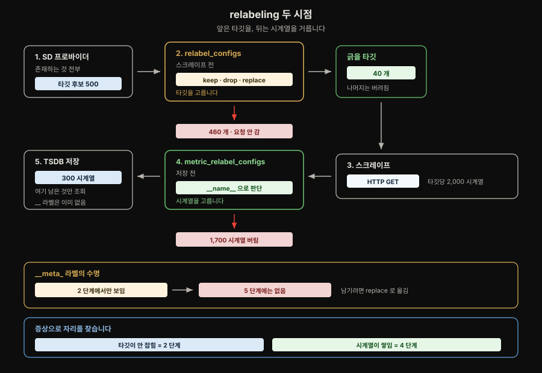

# 서비스 디스커버리와 relabeling

> 서비스 디스커버리는 스크레이프할 **후보**를 찾고, relabeling은 그 후보를 실제 타깃으로 다듬습니다. 핵심은 두 relabeling의 실행 시점과 `__meta_*` 라벨의 수명을 구분하는 것입니다.

## 핵심 요약

> 서비스 디스커버리와 relabeling은 하나의 파이프라인입니다. 타깃이 안 잡히면 스크레이프 전 단계를, 불필요한 시계열이 쌓이면 스크레이프 후 단계를 확인합니다.

1. 서비스 디스커버리(SD)는 주소와 메타데이터를 담은 **후보 타깃 목록**을 반환합니다.
2. `relabel_configs`는 스크레이프 전에 후보를 고르고 라벨을 붙입니다.
3. `metric_relabel_configs`는 스크레이프 후 저장 전에 시계열을 버리거나 수정합니다.
4. `__meta_*`와 `__address__` 같은 내부 라벨은 타깃 relabeling 뒤 **최종 시계열 라벨에서 제외**됩니다. 확정된 주소는 스크레이프에 사용되며, 시계열에 남길 값은 일반 라벨로 옮겨야 합니다.[^prom-meta-labels]




## 1. 서비스 디스커버리는 후보를 찾습니다

> 동적으로 변하는 환경에서는 타깃 주소를 고정 목록으로 관리하기 어렵습니다. SD는 현재 존재하는 후보를 가져오고, 무엇을 실제로 긁을지는 relabeling에 맡깁니다.

`static_configs`에서는 적어 둔 주소가 곧 타깃입니다. 반면 Kubernetes의 `role: pod` 같은 SD 질의는 메트릭을 노출하지 않는 Pod까지 넓게 발견할 수 있습니다. 따라서 SD 결과를 그대로 스크레이프하면 연결 거부나 404가 대량으로 발생할 수 있습니다.

SD 프로바이더는 각 후보에 다음 정보를 붙입니다.

- `__address__`: Prometheus가 접속할 주소입니다.
- `__meta_<provider>_*`: Kubernetes namespace나 Pod annotation처럼 필터링과 라벨 생성에 사용할 메타데이터입니다.
- 일반 라벨: 프로바이더가 결정하지 않습니다. 사용자가 relabeling으로 만듭니다.

이 분리는 프로바이더가 사실을 제공하고 사용자가 운영 의미를 결정하게 합니다. 

- 예를 들어 Kubernetes SD는 Pod의 namespace를 `__meta_kubernetes_namespace`로 제공하지만, 이를 최종 시계열의 `namespace` 라벨로 남길지는 사용자가 정합니다.


## 2. 두 relabeling은 실행 시점이 다릅니다

> 표준 relabeling은 **타깃**을 다루고, 메트릭 relabeling은 **시계열**을 다룹니다. 서로 읽을 수 있는 라벨도 다릅니다.

| 구분 | 설정 파일 | Operator 필드 | 실행 시점 | 주된 용도 |
|---|---|---|---|---|
| 타깃 relabeling | `relabel_configs` | `relabelings` | 스크레이프 전 | 타깃 선택, 주소 변경, 라벨 생성 |
| 메트릭 relabeling | `metric_relabel_configs` | `metricRelabelings` | 스크레이프 후·저장 전 | 시계열 제거, 메트릭 라벨 수정 |

라벨의 수명도 실행 시점에 맞춰 봐야 합니다.

| 라벨 | 타깃 relabeling | 메트릭 relabeling |
|---|---|---|
| `__meta_*` | 읽을 수 있음 | 이미 제거됨 |
| `__address__` | 읽고 쓸 수 있음 | 이미 제거됨 |
| `__name__` | 아직 없음 | 읽을 수 있음 |
| `job`, `instance` 같은 일반 라벨 | 읽고 쓸 수 있음 | 읽고 쓸 수 있음 |

잘못된 단계의 라벨을 참조해도 설정 오류가 나지 않을 수 있습니다. 예를 들어 `metricRelabelings`에서 `__meta_kubernetes_pod_name`을 읽으면 이미 제거된 뒤라 빈 값이 됩니다. 반대로 타깃 relabeling 시점에는 메트릭을 받기 전이므로 `__name__`이 없습니다.

```yaml
scrape_configs:
  - job_name: k8s-pods
    kubernetes_sd_configs:
      - role: pod

    relabel_configs:
      - source_labels: [__meta_kubernetes_pod_annotation_prometheus_io_scrape]
        regex: "true"
        action: keep

    metric_relabel_configs:
      - source_labels: [__name__]
        regex: go_gc_duration_seconds.*
        action: drop
```

- 메트릭 relabeling은 해당 잡이 수집한 시계열에만 적용됩니다. 규칙을 추가한 뒤에는 실제로 버릴 시계열이 그 잡에 존재하는지 적용 전후 개수를 확인해야 합니다.


## 3. relabel 규칙은 위에서 아래로 실행됩니다

> `keep`과 `drop`은 후보 수를 줄이고, `replace`는 값을 옮깁니다. 필터가 새로 만든 라벨에 의존하지 않는다면 먼저 타깃을 거른 뒤 남은 타깃에 라벨을 붙이는 편이 명확합니다.

규칙은 보통 네 필드로 읽습니다.

| 필드 | 의미 | 기본값 또는 주의점 |
|---|---|---|
| `source_labels` | 읽을 라벨 목록 | 여러 값은 기본 구분자 `;`로 연결됩니다 |
| `regex` | 연결된 값에 적용할 패턴 | `(.*)` |
| `action` | 매칭될 때 수행할 동작 | `replace` |
| `target_label` | 결과를 쓸 라벨 | `replace`에서 필요합니다 |

실무에서 자주 쓰는 액션은 다음과 같습니다.

| 액션 | 결과 | 용도 |
|---|---|---|
| `keep` | 매칭된 후보만 유지 | 허용 조건으로 타깃 선택 |
| `drop` | 매칭된 후보 제거 | 특정 상태나 대상 제외 |
| `replace` | 후보 수는 유지하고 값 기록 | `__meta_*`를 일반 라벨로 승격 |
| `labeldrop` | 이름이 매칭된 라벨 제거 | 불필요한 라벨과 카디널리티 축소 |
| `labelkeep` | 이름이 매칭된 라벨만 유지 | 허용할 라벨을 제한 |

```yaml
relabel_configs:
  # 메트릭 수집을 명시한 Pod만 남깁니다.
  - source_labels: [__meta_kubernetes_pod_annotation_prometheus_io_scrape]
    regex: "true"
    action: keep

  # 종료된 Pod를 제외합니다.
  - source_labels: [__meta_kubernetes_pod_phase]
    regex: (Failed|Succeeded)
    action: drop

  # 살아남은 타깃에 namespace 라벨을 붙입니다.
  - source_labels: [__meta_kubernetes_namespace]
    target_label: namespace
```

- 규칙 하나가 버린 후보는 뒤 규칙에서 되살릴 수 없습니다. 뒤의 필터가 새로 만든 라벨을 참조하지 않는다면 선택도가 높은 `keep`·`drop`을 앞에 두고, `replace`처럼 값을 붙이는 규칙을 뒤에 두는 편이 이해하기 쉽습니다.


## 4. Operator에서는 설정이 두 경로로 들어갑니다

> Kubernetes 타깃은 Operator가 CR을 Prometheus 설정으로 번역합니다. Kubernetes 밖의 SD는 `additionalScrapeConfigs`를 통해 직접 추가합니다.

| 대상 | 작성 위치 | Operator의 처리 |
|---|---|---|
| Kubernetes Service·Pod | `ServiceMonitor`·`PodMonitor` | selector를 `kubernetes_sd_configs`와 relabel 규칙으로 번역 |
| 블랙박스 프로빙 대상 | `Probe` | 대응하는 SD와 스크레이프 설정 생성 |
| EC2, Eureka, 사내 SD 등 | Prometheus CR의 `additionalScrapeConfigs` | Secret의 키에 저장한 스크레이프 잡을 생성 설정 뒤에 추가 |

`ServiceMonitor`에서는 엔드포인트마다 두 종류의 규칙을 지정합니다.[^promop-relabel]

```yaml
spec:
  endpoints:
    - port: http-metrics
      relabelings:
        - sourceLabels: [__meta_kubernetes_namespace]
          targetLabel: namespace
      metricRelabelings:
        - sourceLabels: [__name__]
          regex: node_scrape_collector_.*
          action: drop
```

- Operator는 selector와 포트 정보를 위해 자체 relabel 규칙도 생성합니다. 최종 설정에서는 Operator가 만든 selector·엔드포인트 규칙, 사용자 규칙, 샤딩 규칙 순으로 이어지므로 Operator 규칙이 먼저 버린 후보를 사용자 규칙으로 되살릴 수 없습니다. 
- 문제가 생기면 최종 Prometheus 설정이나 `/service-discovery` 화면에서 전체 결과를 확인해야 합니다.


## 5. 디버깅은 증상에 따라 시작점을 고릅니다

> 발견과 필터링 문제는 `/service-discovery`, 스크레이프 연결 문제는 `/targets`에서 확인합니다. `up=0`만으로는 원인을 구분할 수 없습니다.

| 증상 | 먼저 볼 곳 | 확인할 내용 |
|---|---|---|
| 타깃이 아예 없음 | `/service-discovery` | SD가 발견했는지, `keep`·`drop`에 의해 버려졌는지 |
| 타깃 라벨이 예상과 다름 | `/service-discovery` | relabeling 전후 라벨과 덮어쓴 규칙 |
| 타깃은 있으나 DOWN | `/targets` | `lastError`, 주소, 포트, 경로, timeout |
| 불필요한 시계열이 쌓임 | 메트릭 relabeling과 PromQL | 해당 잡에 버릴 시계열이 실제로 있는지 |

자주 보는 `lastError`는 다음처럼 해석합니다.

| 오류 | 의미 | 확인할 곳 |
|---|---|---|
| `connection refused` | 주소와 포트에서 프로세스가 수신하지 않음 | 바인딩 주소와 포트 |
| `404 Not Found` | 서버에는 도달했지만 경로가 틀림 | `metrics_path` |
| `context deadline exceeded` | 제한 시간 안에 응답하지 못함 | 대상 부하와 `scrape_timeout` |
| `no such host` | DNS 조회 실패 | 호스트명과 DNS |

`/service-discovery`에서 타깃이 정상인데 `/targets`에서 DOWN이라면 relabeling은 이미 제 역할을 한 것입니다. 이 경우 대상 애플리케이션의 리스닝 주소나 네트워크 경로를 확인합니다.


## 6. SD 방식은 데이터의 출처로 고릅니다

> 내장 프로바이더가 있으면 먼저 사용하고, 조직 전용 인벤토리처럼 내장될 수 없는 소스에 `http_sd`를 사용합니다. 변하지 않는 소수 타깃에는 SD 자체가 필요하지 않습니다.

| 상황 | 선택 |
|---|---|
| Kubernetes Service·Pod | `ServiceMonitor`·`PodMonitor` |
| Prometheus가 지원하는 클라우드·서비스 레지스트리 | 내장 `<type>_sd_configs` |
| 조직 전용 CMDB·인벤토리 API | `http_sd` |
| 신뢰할 수 있는 도구가 타깃 파일을 관리 | `file_sd` |
| 적고 변하지 않는 타깃 | `static_configs` |

`http_sd` 응답은 static config와 같은 구조의 JSON 배열입니다. 엔드포인트는 HTTP 200, `Content-Type: application/json`, UTF-8을 지켜야 합니다.[^prom-http-sd]

```json
[
  {
    "targets": ["10.0.1.5:8080", "10.0.1.6:8080"],
    "labels": {"job": "order-api", "environment": "production"}
  }
]
```

- 타깃이 0개일 때는 오류가 아니라 `200`과 빈 배열 `[]`을 반환합니다. 오류 응답은 “목록이 없다”가 아니라 “갱신에 실패했다”는 뜻이므로 Prometheus가 직전 목록을 계속 사용합니다. 
- 갱신 실패가 조용히 누적되지 않도록 `prometheus_sd_refresh_failures_total`도 모니터링해야 합니다.


## 7. 내부 주소와 표시 이름을 분리할 수 있습니다

> `__address__`는 실제 접속 주소이고 `instance`는 시계열에 남는 식별자입니다. 기본값은 같지만 운영 목적에 따라 분리할 수 있습니다.

`instance`를 따로 설정하지 않으면 타깃 relabeling 뒤의 `__address__` 값이 들어갑니다.[^prom-instance] 접속에는 IP와 포트를 쓰고 `instance`에는 `order-api-prod-3`처럼 사람이 읽기 쉬운 이름을 넣으면, DNS 장애가 스크레이프 장애로 번지는 위험을 줄이면서 대시보드와 알림의 가독성을 유지할 수 있습니다.


## 실무 체크리스트

> 아래 여섯 항목을 구분할 수 있으면 서비스 디스커버리와 relabeling의 핵심을 이해한 것입니다.

- [ ] SD가 반환하는 것은 메트릭이 아니라 후보 주소와 메타데이터임을 설명할 수 있습니다.
- [ ] 타깃 문제와 시계열 문제를 두 relabeling 단계로 나눌 수 있습니다.
- [ ] 남길 `__meta_*` 값을 스크레이프 전에 일반 라벨로 옮길 수 있습니다.
- [ ] `keep`·`drop`과 `replace`가 후보 수에 미치는 차이를 설명할 수 있습니다.
- [ ] `/service-discovery`와 `/targets` 중 증상에 맞는 화면을 고를 수 있습니다.
- [ ] 내장 SD, `http_sd`, `file_sd`, `static_configs`의 선택 기준을 말할 수 있습니다.


## 관련 문서

> 배포 구조와 라벨 모델을 더 깊게 볼 때 이어서 읽을 문서입니다.

| 문서 | 연결 지점 |
|---|---|
| [원본 상세 노트](04-01.서비스%20디스커버리와%20relabeling.md) | 프로바이더 구현, Operator 생성 규칙, Spring·Eureka 예시와 면접 문답 |
| [02-01. Prometheus 배포](../02-01.Prometheus%20배포%20—%20스택%20구성요소와%20Operator.md) | `ServiceMonitor`와 Prometheus CR의 배치 구조 |
| [03-01. 데이터 모델](../03-01.데이터%20모델.md) | `job`, `instance`, `__name__` 라벨의 의미 |

[^prom-meta-labels]: Prometheus Configuration은 `__`로 시작하는 라벨이 타깃 relabeling 후 제거되며, `__meta_*`는 relabeling 단계에서 사용할 수 있다고 규정합니다. <https://prometheus.io/docs/prometheus/latest/configuration/configuration/#relabel_config>

[^promop-relabel]: Prometheus Operator API의 `Endpoint`는 `relabelings`를 스크레이프 전 타깃 처리에, `metricRelabelings`를 수집 후 저장 전 샘플 처리에 사용합니다. <https://prometheus-operator.dev/docs/api-reference/api/#monitoring.coreos.com/v1.Endpoint>

[^prom-http-sd]: Prometheus HTTP SD 문서는 성공 응답 형식과 타깃이 없을 때 `200`과 빈 배열을 반환해야 한다는 계약을 설명합니다. <https://prometheus.io/docs/prometheus/latest/http_sd/>

[^prom-instance]: Prometheus `scrape_config`는 relabeling 후 `instance`가 없으면 `__address__` 값을 기본으로 사용합니다. <https://prometheus.io/docs/prometheus/latest/configuration/configuration/#scrape_config>
