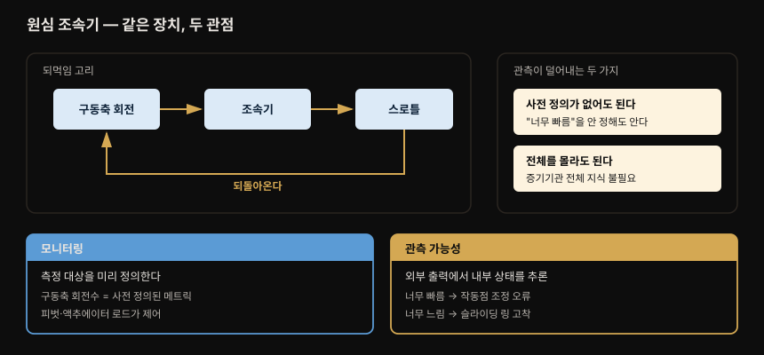
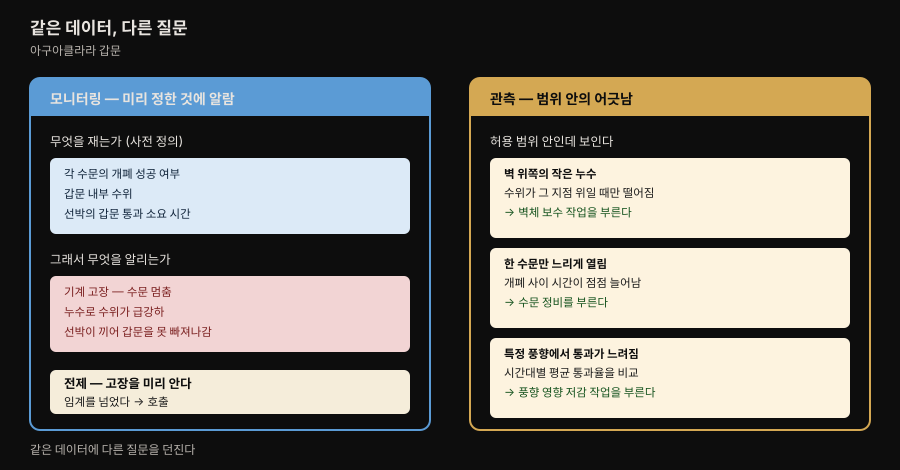
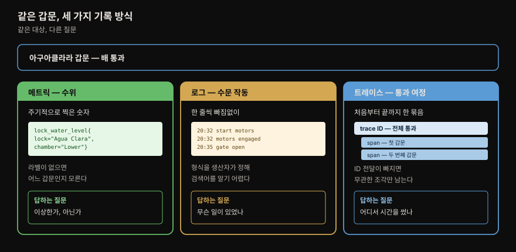
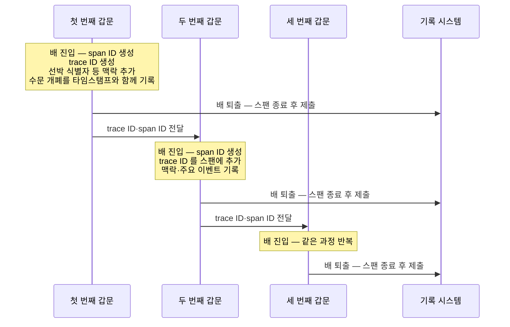
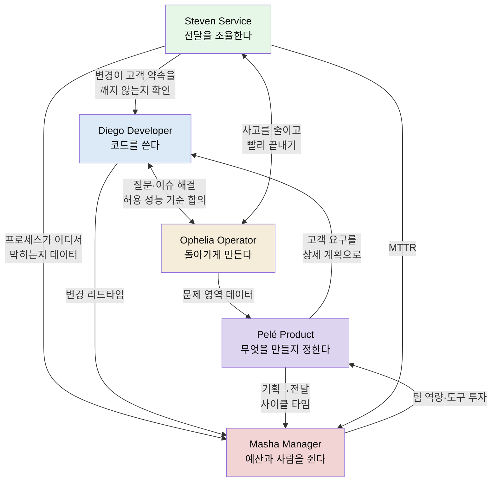
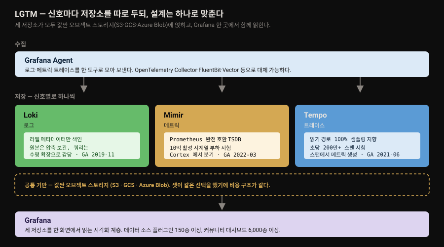

# 관측 가능성과 Grafana 스택

---


## 핵심 요약

> 이 장이 붙들고 있는 생각은 **관측 가능성은 도구를 사는 일이 아니라 질문을 바꾸는 일**이라는 것입니다. 저자들은 그 사실을 소프트웨어가 아닌 파나마 운하 갑문에서 먼저 보여줍니다.
>
> 출발점은 시스템 이론의 구분입니다. 복잡한(complicated) 시스템과 복합적인(complex) 시스템은 다릅니다. 엔진은 부품 사이 인과가 분명하지만 도시의 교통 흐름은 구성요소의 상호작용에서 창발 행동이 나옵니다. 현대 시스템은 후자로 넘어갔고, 그래서 미리 정한 항목만 감시하는 방식으로는 붙잡히지 않습니다.
>
> 이어 저자들은 관측을 *기술* 이 아니라 *고객* 의 문제로 다시 세웁니다. 개발자·운영자·서비스 관리자·프로덕트·경영진 다섯 페르소나가 같은 데이터에 서로 다른 질문을 들고 오며, 이 다섯은 책 전체에서 계속 호출됩니다. 마지막으로 Grafana 스택(LGTM)의 각 제품이 어느 신호를 맡고 왜 셋 다 오브젝트 스토리지 위에 서는지를 짚습니다.

이 장은 개념의 좌표계를 세우는 자리이므로, 형제 폴더 [`mastering_prometheus/01-01`](../mastering_prometheus/01-01.관측%20가능성·모니터링·Prometheus의%20자리.md) 과 주제가 겹칩니다. 관측 가능성의 제어 이론 유래·모니터링과의 구분·신호 3종의 성질은 그 편이 더 깊게 다루므로 여기서는 **이 책에서만 나오는 것**에 무게를 둡니다. 겹치는 대목마다 위임 링크를 답니다.


## 학습 목표

> 이 장을 읽고 나면 아래 다섯 가지를 스스로 해낼 수 있습니다.

1. complicated 와 complex 를 시스템 이론의 정의로 구분하고, 현대 시스템이 왜 후자인지 설명할 수 있습니다.
2. 파나마 운하 갑문 사례로 모니터링과 관측 가능성의 경계를 예를 들어 말할 수 있습니다.
3. 메트릭·로그·트레이스가 같은 대상을 어떻게 다르게 기록하는지 운하 예시로 대응시킬 수 있습니다.
4. 다섯 페르소나가 관측 데이터에 던지는 질문이 어떻게 다른지 구분하고, 그 차이가 왜 설계에 영향을 주는지 말할 수 있습니다.
5. LGTM 네 제품의 역할을 각각 대고, 세 저장소가 공유하는 설계 선택 하나를 지목할 수 있습니다.


## 1. complicated 가 아니라 complex 입니다

> 부품 사이 인과가 분명한 시스템과 상호작용에서 창발 행동이 나오는 시스템은 다릅니다. 현대 시스템은 후자로 넘어갔습니다.

저자들은 장을 열면서 용어 두 개를 시스템 이론의 정의대로 구분합니다. 일상에서는 섞어 쓰지만 이 책에서는 다릅니다.

| 구분 | 정의 | 예 |
|------|------|-----|
| complicated | 구성요소 사이에 **분명한 인과 관계**가 있음 | 엔진 |
| complex | 구성요소의 상호작용에서 **창발 행동**이 나옴 | 도시의 교통 흐름 |

엔진은 부품이 아무리 많아도 어느 부품이 어디에 영향을 주는지 추적할 수 있습니다. 반면 교통 흐름은 차 한 대의 행동 규칙을 다 알아도 정체가 어디서 왜 생기는지 설명되지 않습니다. 규칙에서 곧바로 도출되지 않는 현상이 상호작용에서 솟아오르기 때문입니다.

저자들의 진단은 **현대 시스템이 이 선을 넘어갔다**는 것입니다. 상호작용하는 변수의 수가 많아져 궁극적으로 알 수 없고 통제할 수 없는(ultimately unknowable and uncontrollable) 영역에 들어섰다고 적습니다.

이 진단이 돈 이야기로 이어집니다. Ponemon Institute 의 2016년 추정으로 다운타임 평균 비용은 **분당 9,000달러**입니다. 복합성이 방치되면 그만한 손실로 이어지므로 관측 가능성이 위험을 줄이는 방법이 됩니다.

⚠️ 다만 저자들은 같은 문단에서 반대편도 못 박습니다. **관측 가능성을 잘못 구현하거나 명확한 비즈니스 목표 없이 도입하면 그 자체가 재무 위험이 됩니다.** 관측을 도입하는 일이 무조건 이득이라는 전제를 이 책은 처음부터 거부합니다. 이 경고가 뒤의 페르소나 절과 이어집니다 — 누가 무엇을 묻는지 모르면 비싼 데이터만 쌓입니다.

> 💬 **여기서 잠깐** — 이 저장소의 305P 운영기록([03-10. LGTM·Loki 운영 관점](../../03_Project/03-10.LGTM·Loki%20운영%20관점.md))이 label explosion 과 7일 보존을 다루는 이유가 바로 이 경고의 실물입니다. 목표 없이 라벨을 늘리면 비용이 먼저 늘어납니다.


## 2. 모니터링과 관측 가능성의 경계

> 모니터링은 무언가 잘못됐을 때 알람을 울리는 능력이고, 관측 가능성은 시스템을 이해해 무엇이 왜 잘못됐는지 판단하는 능력입니다.



저자들의 정의는 짧고 대구를 이룹니다. **모니터링은 잘못됐을 때 알람을 울리는 능력**(the ability to raise an alarm when something is wrong)이고, **관측 가능성은 시스템을 이해하고 무엇이 잘못됐는지 그리고 왜 그런지를 판단하는 능력**(to understand a system and determine whether something is wrong, and why)입니다.

용어가 제어 이론에서 왔다는 것, 1800년대 후반 증기기관 원심 조속기(centrifugal governor) 연구에서 형식화됐다는 것도 이 책이 짚습니다. 조속기의 회전 속도가 스로틀을 조절하고 그 스로틀이 다시 회전 속도를 조절하는 되먹임 구조를 그림으로 보여줍니다.

여기서 이 책의 서술이 갈리는 지점이 있습니다. 저자들은 조속기에서 **모니터링과 관측이 각각 어떻게 나타나는지**를 같은 장치 위에서 대비합니다.

- **모니터링** — 관심 있는 메트릭이나 이벤트를 *미리 정의* 합니다. 조속기는 구동축 회전수라는 사전 정의된 메트릭을 측정하고, 피벗과 액추에이터 로드가 스로틀 제어를 담당합니다.
- **관측 가능성** — 시스템의 **내부 상태를 외부 출력으로부터 추론** 하게 하는 것입니다. 조속기가 너무 빠르거나 느리게 돈다면 작동점 조정이 잘못됐거나 슬라이딩 링이 고착돼 기름칠이 필요하다는 뜻일 수 있습니다.

저자들이 강조하는 대목은 그다음입니다. **이 통찰은 "너무 빠름"이 무엇인지 미리 정의하지 않고도 얻을 수 있고, 증기기관 전체를 알지 못해도 얻을 수 있습니다.** 사전 정의와 전체 지식, 두 가지 요구를 동시에 덜어낸다는 것이 관측 가능성의 값입니다.

> 제어 이론 유래와 "세 기둥" 용어 비판을 더 깊게 보려면 [`mastering_prometheus/01-01` §4](../mastering_prometheus/01-01.관측%20가능성·모니터링·Prometheus의%20자리.md) 가 정본입니다. 그 편은 같은 뿌리를 Nagios 계보와 함께 다룹니다.

마지막으로 저자들은 둘을 갈라놓고 끝내지 않습니다. **근본적으로 모니터링과 관측 가능성은 모두 대상 시스템의 신뢰성과 성능을 개선하는 데 쓰입니다.** 목적이 같으므로 어느 하나를 버리는 선택이 아닙니다.


## 3. 파나마 운하 갑문 — 같은 데이터, 다른 질문

> 이 책이 이 장에서 가장 공들인 사례입니다. 알람을 울린 그 데이터로 알람이 울리지 않은 문제까지 조사할 수 있다는 것이 핵심입니다.

저자들은 소프트웨어 밖의 예를 골랐습니다. 파나마 운하의 아구아클라라(Agua Clara) 갑문을 통과하는 배입니다. 소프트웨어 용어를 몰라도 이해되는 사례를 먼저 세워, 개념이 도구에 종속되지 않게 하려는 배치입니다.



먼저 **감시할 만한 것**이 셋 있습니다. 각 수문의 개폐 성공 여부, 갑문 내부 수위, 배가 갑문을 통과하는 데 걸리는 시간입니다.

이것들을 감시하면 **알림받아야 할 상황**이 드러납니다.

- 기계 고장으로 수문이 열린 채 멈춤
- 누수로 수위가 급격히 떨어짐
- 배가 끼어 갑문을 빠져나가지 못해 시간이 너무 걸림

여기까지가 모니터링입니다. 임계를 넘으면 알립니다.

이 장의 결정적인 대목은 그다음입니다. **감시 중인 데이터가 허용 범위 안에 있는데도 정상에서 벗어난 무언가가 관측되는 경우**가 있습니다. 저자들은 셋을 듭니다.

1. **갑문 벽 위쪽에 작은 누수가 생겼습니다.** 수위가 그 누수 지점보다 높을 때만 수위가 떨어지는 것으로 보입니다. 벽체 보수 작업을 부를 근거가 됩니다.
2. **한 갑문의 수문이 정비가 필요해 느리게 열립니다.** 수문을 열고 닫는 사이의 시간이 길어지는 것으로 보입니다. 수문 정비를 부를 근거가 됩니다.
3. **특정 방향에서 바람이 불 때 배의 통과 시간이 길어집니다.** 시간대별 평균 통과율을 비교하면 드러납니다. 그 풍향의 영향을 줄이는 작업을 부를 근거가 됩니다.

세 경우 모두 **새 계측을 추가하지 않았습니다.** 처음에 정한 세 가지 측정값 그대로입니다. 달라진 것은 던진 질문입니다. "임계를 넘었는가"가 아니라 "정상 범위 안에서 무엇이 어긋나 있는가"를 물었습니다.

저자들이 장 끝 요약에서 핵심 시사점으로 다시 꼽는 문장이 이것입니다. **시스템이 중대한 문제에 대해 알람을 내고 있을 때에도, 같은 데이터로 다른 잠재적 문제를 관측하고 조사할 수 있습니다.**

### 왜 하필 운하인가

이 사례가 잘 작동하는 이유가 있습니다. 세 가지 관측이 각각 **다른 종류의 어긋남**을 보여주기 때문입니다.

| 사례 | 어긋남의 성격 | 소프트웨어 대응 |
|------|--------------|----------------|
| 벽 위쪽 누수 | **조건부** — 특정 상태에서만 나타남 | 특정 입력 크기에서만 터지는 버그 |
| 수문이 느려짐 | **추세** — 값이 서서히 이동함 | 커넥션 누수로 응답이 점점 느려짐 |
| 풍향과 통과 시간 | **상관** — 외부 변수와 함께 움직임 | 배포 직후 오류율이 오름 |

임계 기반 알람은 셋 다 놓칩니다. 값이 임계 안에 있기 때문입니다. 조건부·추세·상관을 읽으려면 값을 *상태 라벨로 누르지 않고* 시계열로 남겨야 하는데, 그 논리는 [`mastering_prometheus/01-01` §1](../mastering_prometheus/01-01.관측%20가능성·모니터링·Prometheus의%20자리.md) 이 체크 기반 모니터링의 한계로 다룹니다.


## 4. 텔레메트리 — 운하로 옮겨 본 세 신호

> 메트릭·로그·트레이스가 같은 갑문을 각각 어떻게 기록하는지 대응시켜 보면 세 신호의 성격 차이가 선명해집니다.



저자들은 텔레메트리를 "관측 도구의 지루하지만 중요한 부분"이라 부릅니다. 하는 일은 셋입니다.

1. 쓸모 있는 데이터를 붙잡습니다.
2. 그것을 이곳저곳으로 보냅니다.
3. 조직에 가치를 주는 시각화·알림·리포트를 만듭니다.

주된 신호는 셋입니다. 이 책의 좋은 점은 셋을 **같은 갑문 위에서** 설명한다는 것입니다.

### 메트릭

**메트릭**은 특정 시점에 기록되고 분석을 위해 라벨 또는 차원으로 풍부해진 숫자 데이터입니다. 자주 생성되고 검색이 쉬워, 무언가 잘못됐거나 이상한지 판정하는 데 적합합니다.

운하로 옮기면 각 갑문의 **수위**가 메트릭입니다. 일정 간격으로 측정하며, 데이터를 제대로 쓰려면 라벨을 붙입니다.

```pseudocode
lock_water_level{lock="Agua Clara", chamber="Lower lock", canal="Panama Canal"}
```

- 갑문 이름 — Agua Clara
- 갑문 체임버 — Lower lock
- 운하 — Panama Canal

라벨이 왜 필요한지가 이 예시로 곧장 드러납니다. 수위 숫자 하나만으로는 어느 갑문의 어느 체임버인지 알 수 없어 비교도 집계도 못 합니다.

### 로그

**로그**는 비구조적 문자열 데이터로 간주됩니다. 특정 시점에 기록되며 대개 무슨 일이 일어나는지를 한 줄 단위로 빠짐없이 담습니다. 저자들이 단서를 답니다 — 로그가 구조화될 수는 있지만 **그 구조가 유지된다는 보장이 없습니다.** 로그의 구조를 통제하는 쪽이 로그 생산자이기 때문입니다.

운하에서는 수문을 열고 닫는 동안 벌어지는 개별 작업들이 로그가 됩니다.

```pseudocode
Jun 26 2016 20:31:01 pc-ac-g1 gate-events no obstructions seen
Jun 26 2016 20:32:01 pc-ac-g1 gate-events starting motors
Jun 26 2016 20:32:30 pc-ac-g1 gate-events motors engaged successful
Jun 26 2016 20:35:30 pc-ac-g1 gate-events stopping motors
Jun 26 2016 20:35:30 pc-ac-g1 gate-events gate open complete
```

거의 모든 시스템이 로그를 만들고, 앞의 다섯 줄처럼 단계마다 무엇을 했는지까지 남깁니다. 무슨 일이 있었는지 되짚는 데는 이만한 것이 없습니다. 다만 데이터 양이 두 가지 문제를 만듭니다.

1. **검색이 비효율적이고 느릴 수 있습니다.**
2. **텍스트 형식이라 무엇을 검색해야 할지 알기 어렵습니다.** 저자들의 예가 정확합니다 — `error occurred`, `process failed`, `action did not complete successfully` 는 전부 실패를 서술하지만 **공유하는 문자열이 없어** 한 번에 검색할 방법이 없습니다.

### 분산 트레이스

**분산 트레이스**는 한 행위의 처음부터 끝까지의 여정을 보여줍니다. 행위를 완료하기까지 거치는 모든 단계에서 포착됩니다.

운하 예시가 트레이스 구조를 설명하기에 특히 좋습니다. 배가 갑문 시스템을 통과하는 과정을 트레이스로 보면, 한 번의 전체 통과가 **trace ID** 를 받고 개별 갑문 하나의 진입과 퇴출이 **스팬(span)** 이 되어 **span ID** 를 받습니다. 각 스팬은 전체 트레이스의 trace ID 를 참조해 서로 묶입니다.



여기서 **맥락 전파(context propagation)** 가 왜 트레이싱의 핵심 난제인지가 드러납니다. 갑문 사이에 trace ID 를 넘겨주는 단계가 빠지면 세 개의 무관한 스팬만 남고 "이 배의 전체 통과"라는 이야기가 사라집니다. 소프트웨어에서 서비스 경계를 넘을 때 헤더로 trace ID 를 실어 보내야 하는 이유가 같습니다.

### 그 밖의 신호 — 프로파일과 이벤트

저자들은 메트릭·로그·트레이스를 "세 기둥" 또는 "관측 가능성의 황금 삼각형"이라 부른다고 소개합니다. 그러면서 곧바로 단서를 답니다. 관측 가능성이 시스템을 이해하는 능력인 이상 **셋이 필요한 신호의 전부는 아니며, 어느 추상 계층에서 관측하느냐에 따라 달라진다**는 것입니다.

계층에 따라 알고 싶은 것이 갈립니다. 아주 상세한 수준에서는 CPU·RAM 수준의 스택 트레이스가 궁금합니다. 반대로 CI/CD 파이프라인 실행이 관심사라면 배포가 일어났는지 여부만 알아도 충분합니다.

- **프로파일링 데이터(스택 트레이스)** — CPU 사이클·메모리 같은 자원 사용을 함수 호출 단위까지 내려가 보여줍니다. 클라우드 서비스가 이 자원들에 시간당 과금하는 경우가 많으므로 이런 분석이 **비용 절감**으로 쉽게 이어집니다.
- **이벤트** — CI/CD 같은 플랫폼에서 소비할 수 있으며 **MTTR(Mean Time to Recovery)** 을 줄이는 통찰을 줍니다. 야간 알림을 받았는데 문제 발생 직전에 새 버전이 배포된 것이 보이는 상황을 떠올리면 됩니다. 더 나아가 배포 프로세스가 실패를 감지해 자동 롤백한다면 아예 깨지 않아도 됩니다.

이벤트와 로그의 구분을 저자들이 명확히 합니다. **이벤트는 하나의 행위 전체를 나타낸다는 점에서만 로그와 다릅니다.** 앞의 로그 예시에서 다섯 줄을 만들었지만 그 다섯 줄은 모두 같은 하나의 이벤트(수문 열기)의 단계들이었습니다. 다만 event 라는 단어가 워낙 일반적이라 다른 의미로도 쓰인다고 덧붙입니다.

> 신호별 상세도와 비용의 트레이드오프, 이벤트를 "임의로 넓은" 레코드로 보는 Charity Majors 의 정의는 [`mastering_prometheus/01-01` §5](../mastering_prometheus/01-01.관측%20가능성·모니터링·Prometheus의%20자리.md) 가 다섯 신호를 한 축에 놓고 정리합니다.


## 5. 다섯 페르소나 — 관측의 고객은 누구인가

> 이 절이 이 책을 다른 관측 책과 가르는 대목입니다. 같은 데이터에 다른 질문을 들고 오는 다섯 사람을 세워 두고, 책 전체에서 계속 호출합니다.

저자들은 "시스템을 이해한다"는 말이 무슨 뜻인지 되묻는 것으로 이 절을 엽니다. 단순한 답은 단일 애플리케이션이나 인프라 구성요소의 상태를 아는 것입니다. 하지만 그것으로 충분하지 않다는 것이 이 절의 전제입니다. **사람들이 관측 시스템으로 답하려는 질문의 종류가 서로 다르기** 때문입니다.

다섯 페르소나는 책 전체에서 예시로 반복 등장합니다. 이름의 머리글자가 역할과 맞아떨어지게 지어졌습니다.

| 페르소나 | 실제 역할 | 핵심 관심 | 가장 아픈 곳 |
|----------|----------|----------|-------------|
| **Diego** Developer | 프론트엔드·백엔드·풀스택 등 | 잘 테스트되고 고객의 실제 요구를 다루는 소프트웨어 | 데이터가 너무 많아 신호와 잡음을 못 가름 · 상류의 도구 변경 결정 때문에 코드를 고쳐야 함 |
| **Ophelia** Operator | SRE·DevOps·DevSecOps·고객성공 등 | 제품이 기대대로 동작하는 것, 새벽에 안 깨는 것 | 계속 알림은 오는데 **근본 원인을 고칠 권한이 없음** — 동료의 번아웃을 봤고 그럴 때 조직을 떠나고 싶어짐 |
| **Steven** Service | 서비스 관리자 | 서비스가 매끄럽게 전달되는 것, 사고의 신속한 조율 | 사고 중 **적임자를 찾는 일** · 시스템을 비교하고 누가 고칠지 논쟁하는 동안 사고가 길어짐 |
| **Pelé** Product | 프로덕트 매니저·오너 | 고객을 이해하고 다시 찾게 만드는 제품 | 고객이 무엇을 하는지 **높은 수준에서 못 봄** — 어디에 시간과 자원을 쓸지 모름 |
| **Masha** Manager | 관리자·중간관리·시니어 리더십 | 조직이 매끄럽게 굴러가는 것, 예산 균형 | 높은 실패율과 긴 복구 시간 탓에 **고객에게 사과 전화**를 해야 함 · 클라우드 가시성 부족으로 인한 과다 지출 |

이 표에서 놓치기 쉬운 것이 **페르소나 사이의 상호작용**입니다. 저자들은 각 인물의 Goals·Interactions·Needs·Pain points 를 나눠 서술하는데, Interactions 항목이 특히 촘촘합니다. 다섯이 서로를 어떻게 호출하는지 정리하면 이렇습니다.



화살표가 Masha 로 몰리는 것이 우연이 아닙니다. 저자들이 그에게 흘러가는 데이터로 꼽는 것은 셋입니다.

- **기획부터 전달까지의 사이클 타임** — Pelé 가 제공
- **변경 리드 타임** — Diego 가 제공
- **MTTR** — Steven 이 제공

셋 다 개별 요청의 지연이 아니라 **전달 과정 전체를 재는 지표**입니다. 관측 데이터가 기술 지표에서 조직 지표로 번역되는 경로가 이 그림에 들어 있습니다.

> 이 가운데 **변경 리드 타임과 MTTR 은 DORA 4 지표**(배포 빈도·변경 리드 타임·변경 실패율·서비스 복구 시간)에 그대로 대응합니다. 다만 기획부터 전달까지의 사이클 타임은 DORA 4 지표에 속하지 않으며, **원문은 DORA 를 언급하지 않습니다.** 이 대응은 책 밖에서 덧붙인 참고입니다.

### 이 다섯을 왜 세우는가

페르소나가 장식이 아닌 이유는 §1 의 경고와 이어지기 때문입니다. 명확한 비즈니스 목표 없는 관측 도입은 재무 위험이라고 했는데, **"누가 무슨 질문을 하는가"가 바로 그 목표의 구체형** 입니다.

같은 대시보드도 누구를 위한 것이냐에 따라 달라집니다. Diego 에게 필요한 것은 **몇 줄 추가하면 결과가 나오는 계측 라이브러리**입니다. 저자들은 그가 전문가가 될 시간이 없다고 못 박습니다. 반면 Masha 는 개별 요청 지연이 아니라 **비즈니스 인텔리전스 시스템에서 소비할 수 있는 형태**를 원합니다. 하나의 도구로 둘을 동시에 만족시키려 하면 양쪽 다 실패합니다.

Pelé 의 Needs 에 이 긴장이 가장 잘 드러납니다. 그는 Diego·Ophelia 와 **공통 언어가 되는 데이터**를 원하는데, 때때로 그들이 요청에서 몇 밀리초를 깎는 데 너무 몰두한다고 봅니다. **나쁜 워크플로를 개선하는 편이 고객 경험을 훨씬 크게 개선할 텐데도** 그렇습니다. 기술 지표의 국소 최적화가 제품 관점의 큰 개선을 가린다는 지적입니다.

> 💬 **한 줄로** — 관측 시스템을 설계할 때 "무엇을 수집할까"보다 "누가 무엇을 물을까"를 먼저 정하라는 것이 이 절의 실천 지침입니다.


## 6. Grafana 스택 — LGTM 과 그 주변

> 세 저장소가 신호를 나눠 맡되 모두 값싼 오브젝트 스토리지 위에 서고, Grafana 한 곳에서 함께 읽힙니다.

Grafana 는 2013년 한 개발자가 Graphite 의 메트릭을 표시할 새 UI 를 찾다가 태어났습니다. 처음에는 **Kibana 에서 포크**됐습니다. 빠르고 상호작용적인 대시보드를 쉽게 만들자는 목적으로 발전했습니다.

2014년에는 Grafana Labs 가 설립되면서 오픈소스에 대한 강한 약속을 핵심 가치로 삼았습니다. 현재는 **100만 개 이상의 활성 설치**를 지원하는 회사로 성장했습니다.



### 핵심 스택 — LGTM

핵심 스택은 Mimir·Loki·Tempo·Grafana 넷이며 머리글자를 따 **LGTM** 이라 부릅니다.

**Mimir** 는 메트릭 데이터 저장용 시계열 데이터베이스(TSDB)입니다. S3·GCS·Azure Blob Storage 같은 저비용 오브젝트 스토리지를 씁니다. 2022년 3월 GA 로, 여기서 다루는 네 제품 중 가장 최근입니다. 다만 저자들이 짚듯 Mimir 는 **2016년 시작된 Cortex 에서 포크**됐고, **Cortex 의 일부는 Loki 와 Tempo 의 코어도 이룹니다.** 세 저장소가 형제인 셈입니다.

Mimir 는 Prometheus 와 완전히 호환되며 대량의 메트릭 저장·검색에서 흔히 부딪히는 확장성 문제를 다룹니다. 2021년 **10억 개 활성 시계열**로 부하 시험을 했습니다. 여기서 활성 시계열이란 **최근 20분 안에 샘플을 보고한, 값과 고유 라벨을 가진 메트릭**입니다.

**Loki** 는 완전한 기능의 로깅 스택을 제공하는 구성요소 모음입니다. S3·GCS 같은 저비용 오브젝트 스토리지를 쓰며 **라벨 메타데이터만 색인** 합니다. 2019년 11월 GA 입니다.

저자들이 여기서 로그 집계 도구 일반의 구조를 먼저 설명하는 것이 좋습니다. 보통 두 자료구조를 씁니다 — 원본 데이터의 위치 참조와 검색 가능한 메타데이터를 담은 **인덱스**, 그리고 압축된 형태로 저장된 **원본 데이터** 자체입니다. Loki 가 다른 도구와 갈리는 지점은 **인덱스를 상대적으로 작게 유지하고, 검색 기능은 쿼리 구성요소의 수평 확장으로 감당** 한다는 데 있습니다.

**Tempo** 는 대규모 분산 트레이스 텔레메트리를 위한 저장 백엔드이며 **읽기 경로의 100% 샘플링을 지향** 합니다. 2021년 6월 GA 입니다. 1.0 릴리스 때 **초당 200만 스팬 이상(초당 약 350MB)** 의 지속 수집으로 시험했습니다. 스팬이 수집되는 동안 **스팬에서 메트릭을 생성** 하는 기능도 제공하며, 이 메트릭은 Prometheus remote write 를 지원하는 아무 백엔드에나 쓸 수 있습니다.

**Grafana** 는 2014년부터 데이터 시각화의 주력이었습니다. TSDB 부터 관계형 데이터베이스, 다른 관측 도구까지 폭넓게 연결하는 능력을 겨냥해 왔습니다. **데이터 소스 플러그인 150종 이상**이 있고, 커뮤니티가 **6,000개 이상의 대시보드**를 지원해 대부분의 기술에 대해 최소한의 시간으로 출발점을 얻을 수 있습니다.

**Grafana Agent** 는 로그·메트릭·트레이스를 수집하는 도구 모음입니다. 저자들은 Grafana 가 다른 수집 도구와도 잘 통합되며, 수집 도구마다 장단점이 다르지만 그 비교는 이 책의 주제가 아니라고 선을 긋습니다.

⚠️ **버전 드리프트** — 이 책이 말하는 Grafana Agent 는 이후 **Grafana Alloy** 로 대체됐습니다. Grafana Labs 는 Alloy 를 OpenTelemetry Collector 배포판으로 규정하고 Agent 는 지원 종료 수순을 밟았습니다([Grafana Alloy 문서](https://grafana.com/docs/alloy/latest/)).

이 저장소의 [02-02. Grafana Alloy](../../02_LGTMStack/02-02.Grafana%20Alloy.md) 가 현재 상태를 다루므로, 책의 Agent 서술은 **역사적 맥락**으로 읽습니다.

### 세 저장소가 공유하는 설계

Mimir·Loki·Tempo 를 나란히 놓으면 반복되는 패턴이 보입니다. 저자들이 명시적으로 정리하지는 않지만 서술에서 그대로 드러납니다.

| 공통점 | 내용 | 그래서 얻는 것 |
|--------|------|---------------|
| 저비용 오브젝트 스토리지 | 셋 다 얹힘. 단 원문이 Azure Blob 을 명시한 것은 Mimir·Tempo 이고 Loki 는 S3·GCS 만 듭니다 | 보존 비용이 저장 용량에 선형으로 붙지 않음 |
| Cortex 혈통 | Mimir 는 포크, Loki·Tempo 는 코어 일부를 공유 | 분산 아키텍처와 운영 방식이 서로 닮음 |

이 공통점이 실무에서 갖는 의미는 **셋을 따로 배운 만큼의 비용이 들지 않는다**는 것입니다. 하나의 운영 감각이 나머지에 옮겨 갑니다.

⚠️ 다만 공통점을 과장하지 않도록 선을 그어 둡니다. **쿼리 구성요소의 수평 확장은 원문이 Loki 에 대해서만 말합니다.** 그것도 Loki 가 다른 로그 집계 도구와 갈리는 지점으로 제시한 것입니다.

Mimir·Tempo 가 저장과 쿼리를 어떻게 분리하는지는 이 장에 나오지 않습니다. 세 제품의 공통 설계로 묶어 읽으면 원문에 없는 주장이 됩니다. 각 제품의 실제 구조는 5·6장과 이 저장소의 [02-05. Grafana Mimir](../../02_LGTMStack/02-05.Grafana%20Mimir.md) 편에서 확인합니다.

### Enterprise 플러그인과 사고 대응

**Enterprise 플러그인**은 Cloud Pro·Cloud Advanced·Enterprise 라이선스의 일부로 유료 구독에 포함됩니다. 크게 두 갈래입니다.

**데이터 소스 플러그인** 은 조직이 쓰는 다른 저장 도구에서 데이터를 읽게 합니다.

- 개발 도구 — GitLab · Azure DevOps
- BI 도구 — Snowflake · Databricks · Looker
- 다른 관측 도구 — 조직이 포괄적 운영 커버리지를 갖추면서도 개별 팀에는 도구 선택권을 주게 함

**프리미엄 도구** 는 로그·메트릭·트레이스 각각을 겨냥합니다.

- 민감정보 보호를 위한 로그 접근 정책과 토큰
- 클라우드 스택 수집·저장의 심층 헬스 모니터링
- 테넌트 관리

**사고 대응·관리(IRM)** 영역에는 세 제품이 있습니다.

1. **알림 룰(alerting rules)** 이 IRM 의 토대이며, 메시징 앱·이메일 또는 Grafana OnCall 로 통지합니다.
2. **Grafana OnCall** 은 알림 그룹핑과 에스컬레이션 라우팅을 중앙화하는 온콜 일정 관리 시스템입니다.
3. **Grafana Incident** 는 챗봇 기능으로, 필요한 사고 공간을 만들고 사후 검토용 타임라인을 모으며 메시징 서비스에서 직접 사고를 관리할 수도 있습니다.

이 셋이 §5 의 Steven Service 가 겪는 통증에 정확히 대응합니다. 사고 중 적임자를 찾는 문제는 OnCall 의 에스컬레이션 라우팅이, 사후 기록 문제는 Incident 의 타임라인 수집이 겨냥합니다.

### 그 밖의 도구 — Faro·k6·Pyroscope

Grafana Labs 는 이 분야의 여러 회사를 인수해 기존 도구를 보완하는 제품을 냈습니다.

- **Faro** — 프론트엔드 웹 애플리케이션에 넣는 JavaScript 에이전트로, 브라우저에서 텔레메트리를 수집해 **RUM(real user monitoring)** 을 가능하게 합니다. 백엔드와 인프라가 이미 계측된 환경에 RUM 을 더하면 **전체 애플리케이션 스택을 가로지르는 데이터 탐색**이 가능해집니다. 다섯 가지 core web vitals 를 기본 지원하며 2022년 11월 GA 입니다.
- **k6** — 자체 인프라에서 돌리는 패키지 도구와 SaaS 를 함께 제공하는 부하 테스트 도구입니다. 특히 CI/CD 파이프라인의 일부로 쓸 때 부하 상황의 성능을 보고 최적화와 리팩터링을 평가하게 해 줍니다. 2016년 시작돼 2021년 6월 Grafana Labs 에 인수됐습니다.
- **Pyroscope** — 2023년 3월 합류한 최근 인수 건으로, 애플리케이션의 시스템 자원 사용(CPU·메모리 등)을 **연속 프로파일링** 하게 합니다. 성능 오버헤드 약 **2~5%** 로 **10초마다** 샘플을 수집할 수 있다고 표방합니다. 2022년 시작된 Grafana Labs 프로젝트 Phlare 와 합쳐졌습니다.

k6 와 Pyroscope 를 짝지어 쓰면 비기술 팀원도 성능 문제를 눈으로 확인할 수 있는 수준까지 간다고 저자들은 적습니다.


## 7. 대안 도구와 배포 방식

> 관측 도구 지형은 1970~80년대의 `ps`·`top` 까지 거슬러 올라갈 만큼 넓습니다. 저자들은 전수 목록이 아니라 탐색의 출발점으로 표를 냅니다.

저자들은 모든 도구를 나열하려는 것이 아니라고 분명히 합니다. 호기심을 가진 사람에게 영감의 출처가 되거나, 사용 가능한 도구의 빠른 참조가 되기를 노립니다. 저자들 자신도 몇 번 그렇게 썼다고 덧붙입니다.

### 수집 도구

소스에서 텔레메트리를 수집하는 에이전트들입니다. 신호 커버리지로 묶으면 성격이 드러납니다.

| 커버리지 | 도구 |
|----------|------|
| 메트릭·로그·트레이스 | OpenTelemetry Collector · FluentBit · Vector · 벤더별 에이전트 |
| 메트릭·로그 | Beats 계열 |
| 메트릭 전용 | Prometheus · Telegraf · StatsD · Collectd · Carbon |
| 로그 전용 | Syslog-ng · Rsyslog · Fluentd · Flume |
| 트레이스 전용 | Zipkin Collector |

세 신호를 모두 다루는 쪽이 목록 위쪽에 몰려 있습니다. 아래로 갈수록 단일 신호 전용이고 대체로 더 오래된 도구입니다. **수집기가 신호별로 갈라져 있던 시대에서 하나로 합쳐지는 방향**으로 흐름이 움직였다는 것이 표에서 읽힙니다. 그 흐름의 도착점이 OpenTelemetry 이며, Grafana Agent 를 대체한 Alloy 가 OTel Collector 배포판인 것도 같은 맥락입니다.

### 저장·처리·시각화 도구

저자들은 저장·처리·시각화를 한데 묶었습니다. 셋 사이에 겹치는 부분이 많기 때문입니다. 보안 모니터링을 함께 제공하는 도구들도 밀접하게 관련되지만, 보안은 이 책의 범위 밖이라 **보안 전용 도구는 제외** 했습니다.

목록에는 AppDynamics·Datadog·Dynatrace·New Relic·Splunk 같은 상용 APM 부터 Elastic·OpenSearch·ClickHouse·Graphite·InfluxDB·OpenTSDB·VictoriaMetrics·Thanos·Prometheus 같은 저장소, Jaeger·Zipkin·SkyWalking·SigNoz 같은 트레이싱, Nagios·Zabbix·Sensu·NetData 같은 전통 모니터링, AWS CloudWatch·Azure Application Insights·GCP Cloud Operations Suite 같은 클라우드 네이티브까지 48개가 들어 있습니다.

> 이 표에 있는 이름 중 이 저장소가 이미 다룬 것이 여럿입니다. OpenSearch 는 형제 폴더 [`dgos_opensearch/`](../dgos_opensearch/README.md), Thanos·VictoriaMetrics·Cortex 는 [`mastering_prometheus/`](../mastering_prometheus/README.md) 의 9~10장이 다룹니다. 목록을 훑을 때 아는 이름이 어디에 정리돼 있는지 표시해 두면 나중에 되찾기 쉽습니다.

### 배포 — SaaS 인가 셀프호스팅인가

Grafana Labs 는 오픈소스 제공자로서의 역사를 온전히 받아들입니다. LGTM 스택은 대부분의 다른 구성요소와 함께 오픈소스이며, 일부 부가가치 구성요소만 엔터프라이즈 구독으로 제공됩니다.

**SaaS** 로는 Loki·Mimir·Tempo 의 저장소 접근과 외부 데이터 소스용 100개 이상의 통합을 제공합니다. SaaS 고객은 다른 도구들까지 한데 모아 **단일 창(single pane of glass)** 으로 볼 수 있습니다. 조직이 플랫폼 운영 부담과 플랫폼 자체의 SLA 확보 없이 완전한 기능의 관측 플랫폼을 쓸 수 있다는 것이 이점입니다.

**셀프호스팅** 도 가능합니다. Linux·Windows 배포용 여러 형식으로 패키징돼 있고 컨테이너 버전도 제공되며, 각 도구마다 **Helm 과 Tanka 설정 래퍼**를 제공합니다.

⚠️ **이 책의 전제를 기억해 둡니다.** 저자들은 **주로 SaaS 를 다루겠다**고 명시합니다. 무료 티어로 시작하기 쉽기 때문입니다. 로컬 설치가 도움이 되는 영역은 11장(아키텍처)과 14장(DevOps 프로세스)에서 일부 다룬다고 예고합니다.

이 저장소의 305P 운영기록은 셀프호스팅이므로 전제가 반대입니다. 이 책의 실습을 따라갈 때 **비용·SLA·업그레이드 책임이 어느 쪽에 있는지**가 달라진다는 점을 염두에 둡니다.


## 책 밖으로 잇기

> 이 장의 개념을 이 저장소의 다른 노트와 1차 자료로 잇습니다. 본문 논리를 이어받는 보론은 각 절 안에 두었습니다.

**Loki 의 "라벨만 색인" 이 실무에서 만드는 함정.** 본문은 Loki 가 인덱스를 작게 유지한다는 설계 *이점* 만 말합니다. 그 이점의 뒷면이 **label explosion** 입니다.

기전은 단순합니다. 라벨 조합 하나가 스트림 하나가 됩니다. 그래서 카디널리티가 높은 값을 라벨로 올리면 스트림이 폭증해 성능과 비용이 함께 무너집니다. 요청 ID·사용자 ID·타임스탬프가 대표적인 지뢰입니다.

Grafana 공식 문서도 라벨은 값의 종류가 제한적이고 미리 알 수 있는 것으로 유지하라고 안내합니다([Loki — Labels](https://grafana.com/docs/loki/latest/get-started/labels/)). 이 저장소에서는 [03-10. LGTM·Loki 운영 관점](../../03_Project/03-10.LGTM·Loki%20운영%20관점.md) 이 305P 환경에서 이 문제를 실제로 다룹니다.

**"세 기둥" 대신 무엇으로 볼 것인가.** 저자들은 세 기둥이라는 표현을 소개하되 추상 계층에 따라 필요한 신호가 달라진다는 단서를 답니다. 이 저장소의 대안 프레임은 신호 *종류* 가 아니라 *증상* 으로 재는 쪽입니다. [01-03. 시그널 모델](../../01_Foundations/01-03.시그널%20모델%20—%20Golden%20Signals,%20RED,%20USE.md) 이 그것입니다.

페르소나별로 다른 질문을 한다는 §5 의 논지와 나란히 놓으면 한 걸음 더 갑니다. 어느 신호 모델을 고를지도 결국 "누가 묻는가"에 달렸습니다.

**로그를 신호로 승격시키는 규격.** 본문은 로그의 비구조성을 문제로 지적하고 멈춥니다. 그 뒤 업계가 택한 방향은 로그에도 trace ID 를 실어 신호 사이를 잇는 것입니다. OpenTelemetry 의 로그 데이터 모델이 그 규격입니다([OpenTelemetry — Logs](https://opentelemetry.io/docs/specs/otel/logs/)).

이 저장소에서는 두 편이 나눠 맡습니다. 도입 관점은 [03-11. 305P OpenTelemetry 도입 고려사항](../../03_Project/03-11.305P%20OpenTelemetry%20도입%20고려사항.md) 이, 규격 자체는 [`mastering_prometheus/14-01`](../mastering_prometheus/14-01.Prometheus%20와%20OpenTelemetry%20통합%20—%20규격·Collector·OTLP%20수신구.md) 이 다룹니다.

**이 책이 이어서 갈 곳.** 페르소나는 책 전체에서 계속 호출되며, 특히 8장(대시보드)이 "청중의 요구를 고려한 표현"을 다룰 때 이 절이 근거가 됩니다. LGTM 각 제품의 내부는 4~6장에서, 배포 자동화는 10장에서, 플랫폼 아키텍처는 11장에서 본격화합니다.


## 결정 치트시트

> 이 장이 남기는 판단 기준을 표로 압축합니다.

| 상황 | 선택 | 이유 |
|------|------|------|
| 미리 아는 방식의 고장을 잡아야 함 | 모니터링(임계 알람) | 사전 정의된 메트릭·이벤트에 알람을 거는 것이 본래 목적 |
| 정상 범위 안인데 뭔가 어긋난 느낌 | 관측 가능성(같은 데이터에 다른 질문) | 새 계측 없이 조건부·추세·상관을 읽을 수 있음 |
| 무언가 이상한지 빠르게 판정 | 메트릭 | 자주 생성되고 검색이 쉬움 |
| 무슨 일이 있었는지 상세히 확인 | 로그 | 정보량이 많음. 단 검색 효율과 문자열 불일치를 감수 |
| 여러 단계를 지나는 한 행위의 여정 추적 | 분산 트레이스 | trace ID·span ID 로 단계를 묶음. 맥락 전파가 필수 조건 |
| 자원 사용(CPU·메모리)을 파고들어 비용 절감 | 프로파일링 | 시간당 과금 자원의 낭비를 찾아냄 |
| 배포와 장애의 시간적 관계 확인 | 이벤트 | MTTR 단축. 이벤트는 행위 *전체* 를 하나로 표현 |
| 관측 시스템을 새로 설계 | 페르소나부터 정의 | 목표 없는 도입은 저자들이 지목한 재무 위험 |
| 로그 라벨을 어디까지 쪼갤지 | 값의 종류가 제한적인 것만 | 카디널리티가 높은 값은 스트림 폭증을 부름 |
| 플랫폼 운영 부담을 지기 어려움 | SaaS(Grafana Cloud) | 플랫폼 SLA 확보 책임이 넘어감. 이 책의 기본 전제 |
| 데이터 주권·망 분리 요건이 있음 | 셀프호스팅(Helm·Tanka) | 컨테이너·패키지·설정 래퍼가 제공됨 |


## Spring 앱 개발 관점

> 이 장에는 Spring 예제가 없습니다. 아래는 이 장의 개념(신호 3종·수집 에이전트)이 Spring Boot 에서 어디에 대응하는지 **공식 문서로 보강** 한 내용입니다.

이 장은 도구 이름을 나열하지만 "그래서 내 애플리케이션은 무엇을 해야 하나"는 2장으로 미룹니다. 그 공백을 Spring 관점에서 미리 채워 두면 이후 장이 수월해집니다.

Spring Boot 앱 하나가 세 신호를 내보내는 경로는 이렇게 갈립니다.

| 신호 | Spring 쪽 담당 | LGTM 쪽 도착지 |
|------|---------------|---------------|
| 메트릭 | Micrometer + Actuator 의 `/actuator/prometheus` | Mimir (또는 Prometheus) |
| 트레이스 | Micrometer Tracing 이 span 생성·전파 | Tempo |
| 로그 | Logback 이 구조화해 출력 | Loki |

여기서 §4 의 **맥락 전파** 논의가 실무로 내려옵니다. 운하 예시에서 갑문 사이에 trace ID 를 넘기지 않으면 트레이스가 끊긴다고 했는데 Spring 에서도 같습니다. HTTP 클라이언트나 메시지 프로듀서가 trace ID 를 헤더에 실어 보내야 서비스 경계를 넘어 하나의 트레이스로 묶입니다.

Micrometer Tracing 이 `RestTemplate`·`WebClient` 같은 표준 통합에서는 이를 자동으로 처리합니다. 다만 **비동기 경계나 커스텀 스레드 풀에서는 컨텍스트가 유실되기 쉽습니다.** 이 저장소의 [03-07. 실전 프로젝트 5(Outbox E2E 트레이스 연결)](../../03_Project/03-07.실전%20프로젝트%205(Outbox%20E2E%20트레이스%20연결).md) 가 Outbox 패턴에서 트레이스를 잇는 구체적 사례를 다룹니다.

로그 쪽도 이 장의 논리를 그대로 받습니다. 저자들이 지적한 "공유하는 문자열이 없어 검색할 수 없다"는 문제는 Logback 기본 패턴을 그대로 쓸 때 정확히 발생합니다. 로그를 관측 신호로 쓰려면 구조화해 키/값을 뽑을 수 있게 해야 하며, 그 배경은 [01-05. Logback 기초](../../01_Foundations/01-05.Logback%20기초.md) 에 있습니다.

수집 쪽에서는 §6 의 버전 드리프트가 걸립니다. 책은 Grafana Agent 를 말하지만 현재 표준은 Alloy 이므로, 새로 구성한다면 [02-02. Grafana Alloy](../../02_LGTMStack/02-02.Grafana%20Alloy.md) 를 기준으로 삼습니다.


## 면접에서 받을 만한 질문

> 아래 질문에 **먼저 스스로 답해 보세요.** 자답이 끝나면 이어지는 §정답 (자답 후 펼치기) 으로 내려갑니다.

1. complicated 와 complex 는 어떻게 다르며, 이 구분이 관측과 무슨 상관입니까?
2. 모니터링과 관측 가능성을 각각 한 문장으로 정의한다면 어떻게 말하겠습니까?
3. 파나마 운하 갑문 예시에서 "관측"에 해당하는 상황 하나를 들고, 왜 그것이 알람으로는 안 잡히는지 설명해 보세요.
4. 트레이스에서 trace ID 와 span ID 는 각각 무엇을 식별하며, 둘을 어떻게 묶습니까?
5. 이벤트와 로그는 무엇이 다릅니까?
6. LGTM 은 무엇의 약자이고 각각 어느 신호를 맡습니까? 세 저장소가 공유하는 설계 선택은 무엇입니까?
7. 관측 시스템 설계에서 페르소나를 먼저 정의하라는 조언의 근거는 무엇입니까?


## 정답 (자답 후 펼치기)

> 위 §면접에서 받을 만한 질문 의 7개에 *먼저 자답한 뒤* 아래를 읽으세요. 자답 없이 먼저 읽으면 학습 효과가 0 입니다. 질문 번호와 1:1 로 대응합니다.

### 정답 1 — complicated 대 complex

complicated 한 시스템은 엔진처럼 구성요소 사이의 인과 관계가 분명합니다. complex 한 시스템은 도시의 교통 흐름처럼 구성요소의 상호작용에서 창발 행동이 나옵니다.

현대 시스템은 후자로 넘어갔고, 상호작용하는 변수가 많아 궁극적으로 알 수 없고 통제할 수 없는 상태가 됐습니다. 인과를 미리 짚어 체크를 걸어 두는 방식이 작동하지 않게 되므로, 외부 출력에서 내부 상태를 추론하는 접근이 필요해집니다.

### 정답 2 — 두 정의

- **모니터링** — 무언가 잘못됐을 때 알람을 울리는 능력
- **관측 가능성** — 시스템을 이해하고 무엇이 잘못됐는지, 그리고 왜 그런지를 판단하는 능력

둘은 대립하지 않습니다. 근본적으로 모두 시스템의 신뢰성과 성능을 개선하는 데 쓰입니다.

### 정답 3 — 운하의 관측 사례

셋 중 아무거나 들면 됩니다. 예를 들어 **갑문 벽 위쪽의 작은 누수**는 수위가 그 지점보다 높을 때만 수위 하락으로 나타납니다.

알람으로 안 잡히는 이유는 **값이 허용 범위 안에 있기** 때문입니다. 임계 기반 판정은 선을 넘었는지만 보므로, 정상 범위 안에서 벌어지는 조건부 어긋남을 통과시킵니다. 이 어긋남을 읽으려면 같은 데이터에 "정상 범위 안에서 무엇이 어긋나 있는가"라는 다른 질문을 던져야 합니다.

### 정답 4 — trace ID 와 span ID

- **trace ID** — 한 행위의 전체 여정을 식별합니다. 운하 예시에서는 배의 전체 통과 한 번입니다.
- **span ID** — 그 여정을 이루는 개별 작업 단위를 식별합니다. 운하 예시에서는 갑문 하나의 진입과 퇴출입니다.

묶는 방법은 **각 스팬이 전체 트레이스의 trace ID 를 참조** 하는 것입니다. 그래서 갑문 사이에 trace ID 를 넘겨주는 단계(맥락 전파)가 빠지면 무관한 스팬들만 남고 하나의 여정이 사라집니다.

### 정답 5 — 이벤트와 로그

**이벤트는 하나의 행위 전체를 나타낸다는 점에서만 로그와 다릅니다.** 저자들의 예시에서 수문을 여는 동안 로그는 다섯 줄이 나왔지만, 그 다섯 줄은 모두 "수문 열기"라는 하나의 이벤트의 단계들이었습니다.

이벤트가 유용한 자리는 CI/CD 같은 플랫폼입니다. 배포가 일어났다는 사실 하나가 장애와 시간적으로 겹치는지 보여주면 MTTR 이 크게 줄어듭니다.

### 정답 6 — LGTM

네 제품의 머리글자입니다.

- **L**oki — 로그
- **G**rafana — 시각화
- **T**empo — 트레이스
- **M**imir — 메트릭

공유하는 설계 선택은 **저비용 오브젝트 스토리지**(S3·GCS·Azure Blob)입니다. 세 저장소가 모두 여기에 얹히므로 보존 비용 구조가 같습니다. 혈통도 겹칩니다 — Mimir 는 Cortex 에서 포크됐고 Cortex 의 일부가 Loki·Tempo 의 코어도 이룹니다.

### 정답 7 — 페르소나를 먼저 정의하는 이유

저자들이 장 초반에 **관측을 잘못 구현하거나 명확한 비즈니스 목표 없이 도입하면 그 자체가 재무 위험**이라고 못 박기 때문입니다. "누가 무슨 질문을 하는가"가 그 목표의 구체형입니다.

같은 데이터라도 Diego 는 몇 줄로 쓸 수 있는 계측 라이브러리를 원하고 Masha 는 BI 시스템에서 소비할 형태를 원합니다. 이를 구분하지 않으면 한 도구로 양쪽을 만족시키려다 둘 다 실패하고, 목적 없는 데이터만 비용으로 쌓입니다.


## 핵심 개념 체크리스트

> 위 §정답 을 덮고, 각 항목을 소리 내어 설명할 수 있는지 점검합니다. 막히는 자리가 이 장의 재학습 지점입니다.

- [ ] complicated 와 complex 를 각각 예를 들어 구분할 수 있는가?
- [ ] 관측 가능성을 잘못 도입하면 왜 재무 위험이 되는지 말할 수 있는가?
- [ ] 모니터링과 관측 가능성을 각각 한 문장으로 정의할 수 있는가?
- [ ] 조속기에서 모니터링과 관측이 각각 어떻게 나타나는지 설명할 수 있는가?
- [ ] 운하 사례의 관측 상황 셋을 대고, 각각이 어떤 종류의 어긋남인지 구분할 수 있는가?
- [ ] "알람을 울린 그 데이터로 다른 문제도 조사할 수 있다"는 말의 의미를 설명할 수 있는가?
- [ ] 메트릭에 라벨이 왜 필요한지 운하 예시로 말할 수 있는가?
- [ ] 로그의 두 가지 문제(검색 효율·검색어 불일치)를 예를 들어 설명할 수 있는가?
- [ ] trace ID 와 span ID 의 관계, 맥락 전파가 왜 필수인지 말할 수 있는가?
- [ ] 이벤트가 로그와 다른 한 가지를 정확히 짚을 수 있는가?
- [ ] 다섯 페르소나의 이름과 각자의 핵심 관심을 댈 수 있는가?
- [ ] Masha 에게 흘러가는 세 데이터(사이클 타임·리드 타임·MTTR)가 무엇을 뜻하는지 아는가?
- [ ] LGTM 네 제품의 역할과 세 저장소의 공통 설계를 말할 수 있는가?
- [ ] Grafana Agent 와 Alloy 의 관계를 설명할 수 있는가?
- [ ] 이 책이 SaaS 를 기본 전제로 삼는다는 사실과 그것이 무엇을 바꾸는지 아는가?


## 참고 자료

> 원서 1장과, 본문의 사실을 대조한 1차 자료 목록입니다.

- 원본: *Observability with Grafana* (Packt, ISBN 9781803248004) 1장 — Introducing Observability and the Grafana Stack.
- 원문 그림 1.1 출처: James Watt 증기기관 원심 조속기 — `mpoweruk.com` (원서가 명시한 출처)
- 다운타임 분당 9,000달러 추정: Ponemon Institute, 2016 (원서 인용)
- [Grafana Loki — Labels](https://grafana.com/docs/loki/latest/get-started/labels/) — §6 "라벨만 색인" 의 실무 함정 근거
- [Grafana Alloy 문서](https://grafana.com/docs/alloy/latest/) — §6 Grafana Agent 의 버전 드리프트 근거
- [OpenTelemetry — Logs 데이터 모델](https://opentelemetry.io/docs/specs/otel/logs/) — 로그를 신호로 승격시키는 규격


## 관련 문서

> 이 편은 관측 가능성의 좌표계를 세우고 그 안에서 LGTM 각 제품의 자리를 확정합니다. 겹치는 개념은 형제 폴더로, 각 제품의 내부는 카테고리 노트로 이어집니다.

- [README (책 MOC)](README.md) — 《Observability with Grafana》 15장 전체 지도
- [mastering_prometheus 01-01. 관측 가능성·모니터링·Prometheus의 자리](../mastering_prometheus/01-01.관측%20가능성·모니터링·Prometheus의%20자리.md) — 같은 개념을 메트릭 축에서 더 깊게. §2·§4 의 위임 대상
- [01-03. 시그널 모델 — Golden Signals, RED, USE](../../01_Foundations/01-03.시그널%20모델%20—%20Golden%20Signals,%20RED,%20USE.md) — §4 "세 기둥" 단서의 대안 프레임
- [02-02. Grafana Alloy](../../02_LGTMStack/02-02.Grafana%20Alloy.md) — §6 Grafana Agent 의 현재 후속
- [03-10. LGTM·Loki 운영 관점](../../03_Project/03-10.LGTM·Loki%20운영%20관점.md) — §6 Loki 라벨 색인 설계가 운영에서 만드는 label explosion
- [03-07. 실전 프로젝트 5(Outbox E2E 트레이스 연결)](../../03_Project/03-07.실전%20프로젝트%205(Outbox%20E2E%20트레이스%20연결).md) — §4 맥락 전파의 구체적 구현 사례
