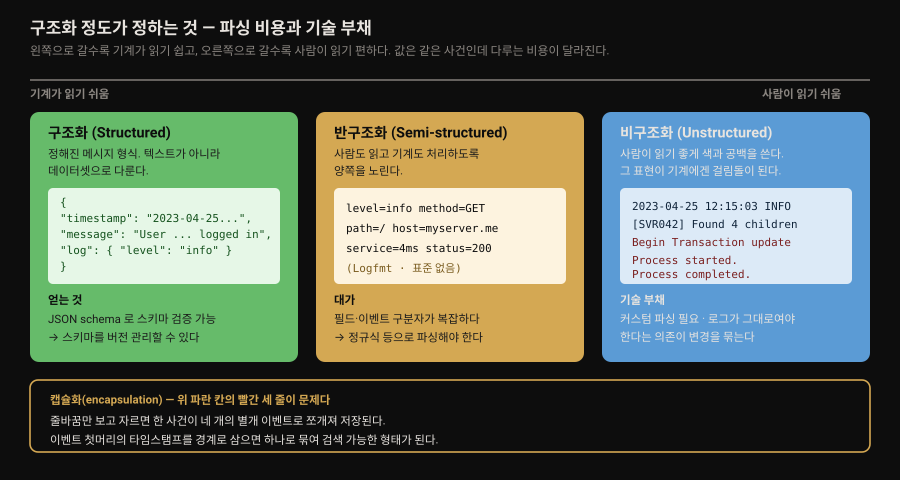
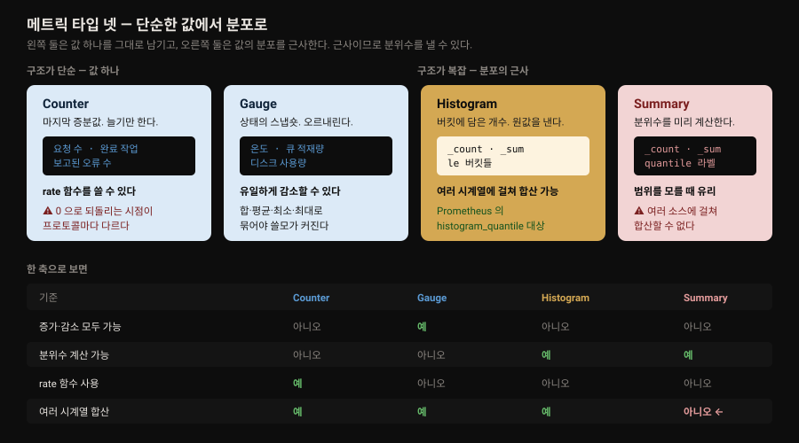
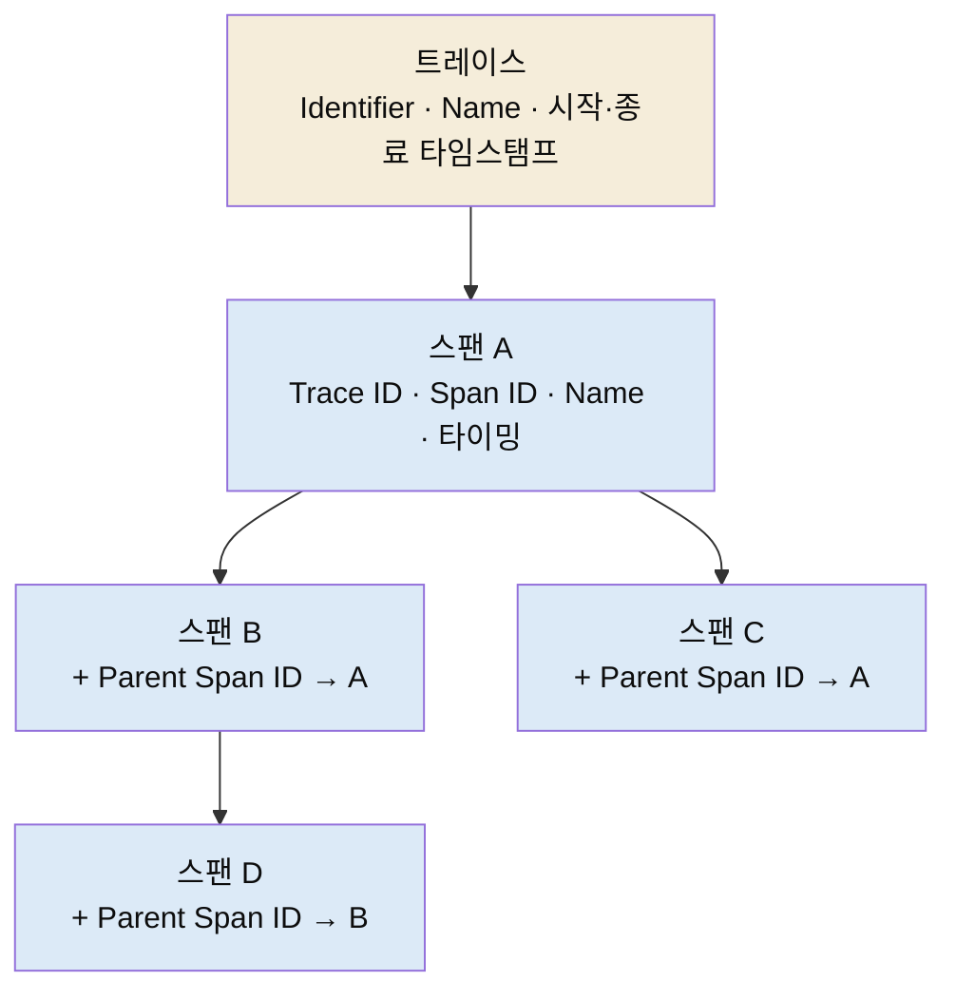

# 계측 — 애플리케이션과 인프라

---


## 핵심 요약

> 이 장은 **참조용 카탈로그**입니다. 1장이 관측 가능성이 무엇인지 물었다면 2장은 그 신호가 실제로 어떤 모양으로 흘러다니는지를 형식·타입·프로토콜 단위로 늘어놓습니다. 저자들 자신이 "빠르게 찾아볼 수 있는 자료"로 쓰라고 밝힙니다.
>
> 늘어놓기만 하는 장은 아닙니다. 표 사이에 반복해서 박히는 경고가 하나 있습니다. **같은 이름의 개념이 프로토콜마다 다르게 동작한다**는 것입니다. counter 를 0 으로 되돌리는 시점이 StatsD 와 Prometheus 에서 다르고, gauge 도 histogram 도 구현마다 정의가 갈립니다. 그래서 저자들은 타입을 고르기 전에 목표를 먼저 정하라고 말합니다.
>
> 나머지 축은 비용입니다. 카디널리티를 관리하라, 트레이스는 샘플링·필터링·보존으로 비용을 깎으라, 자동 계측은 쉽지만 통제를 잃으면 관측 플랫폼 자체를 쓸모없게 만든다는 경고가 이어집니다. 1장이 "목표 없는 관측 도입은 재무 위험"이라고 한 말의 구체형입니다.

이 장은 이 저장소의 기존 노트와 겹치는 폭이 넓습니다. 메트릭 타입의 의미론은 [`mastering_prometheus/03-01`](../mastering_prometheus/03-01.데이터%20모델.md) 이, Micrometer 는 [01-02. 마이크로미터와 메트릭](../../05_SpringActuator/01-02.마이크로미터와%20메트릭%20—%20Counter·Gauge·Timer.md) 이 이미 더 깊게 다룹니다.

그래서 여기서는 **이 장에만 있는 것**에 무게를 둡니다. 세 가지입니다.

- 로그 형식 카탈로그
- 프로토콜 사이의 정의 차이
- 인프라 계층의 오래된 표준


## 학습 목표

> 이 장을 읽고 나면 아래 다섯 가지를 스스로 해낼 수 있습니다.

1. 구조화·반구조화·비구조화 로그를 구분하고 각각이 수집 파이프라인에 어떤 비용을 지우는지 설명할 수 있습니다.
2. 멀티라인 로그에서 캡슐화가 없으면 무엇이 깨지는지 예를 들어 말할 수 있습니다.
3. 메트릭 타입 넷을 증가·감소 가능성, 분위수 계산, 합산 가능성 세 축으로 구분할 수 있습니다.
4. 카디널리티가 왜 비용 문제인지 차원 선택의 예로 설명할 수 있습니다.
5. 자동 계측과 수동 계측의 트레이드오프를 말하고, 트레이싱 비용을 줄이는 세 가지 방법을 댈 수 있습니다.


## 1. 로그에는 정답 형식이 없습니다

> 저자들은 로그가 어떻게 생겼든 상관없다고 먼저 못 박습니다. 다만 어떤 형식을 다루는지 *아는 것* 은 수집·파싱·저장 설계에 반드시 필요합니다.

로그 파일은 컴퓨터 시스템의 표준 구성요소이며 개발자(Diego)와 운영자(Ophelia)에게 필수 도구입니다. 인프라의 성능·용량 모니터링, 소프트웨어의 버그 탐지, 근본 원인 분석, 사용자 행동 추적을 받칩니다.

저자들의 태도가 흥미롭습니다. **로그에 완벽한 레시피는 없고 로그가 어떻게 생겼는지는 중요하지 않다**고 말합니다. 다만 몇 가지 지침을 따르면 나중에 로그를 분석해야 할 미래의 자신에게 도움이 된다고 덧붙입니다.

그러면서도 조건을 답니다. 관측 솔루션을 설계하고 구축할 때는 **내가 다루는 로그 형식을 이해하는 것이 중요합니다.** 그래야 데이터를 쓸모 있게 수집·파싱·저장할 수 있기 때문입니다. 형식에 정답은 없지만 형식을 모르는 것은 문제라는 뜻입니다.

로그 형식은 대체로 세 가지를 밝힙니다. 구조화 여부, 사용하는 데이터 타입, 인코딩이나 구분자의 사용 여부입니다.

### 구조화 정도가 가르는 것



**구조화 로그**는 미리 정해진 메시지 형식을 가져 텍스트가 아니라 **데이터셋으로 다룰 수 있습니다.** 사람이 쉽게 이해하고 기계가 효율적으로 처리할 수 있는 패턴으로 데이터를 제시하는 것이 목적입니다. 쉼표·공백·하이픈 같은 문자로 구분하거나, 등호·콜론으로 키-값 쌍을 잇습니다(`name=Diego`, `city=Berlin`).

구조화의 추가 이점 하나를 저자들이 짚는데, 이 대목이 이 절에서 가장 값집니다. **JSON schema 같은 도구로 데이터가 스키마에 맞는지 검증할 수 있습니다.** 그러면 스키마 변경을 버전 관리할 수 있게 되고, 바로 이 지점에서 **로그와 이벤트 버스 기술이 겹칩니다.**

> 💬 **왜 중요한가** — 로그를 "사람이 읽는 텍스트"로 보면 형식 변경은 자유입니다. 그런데 스키마를 검증하고 버전 관리하기 시작하면 로그는 사실상 *계약* 이 됩니다. 생산자가 마음대로 바꿀 수 없는 인터페이스가 되는 것이며, 이는 [1장](01-01.관측%20가능성과%20Grafana%20스택%20—%20파나마%20운하·페르소나·LGTM.md) 이 "로그 생산자가 구조를 통제하므로 구조 유지 보장이 없다"고 한 문제에 대한 답이기도 합니다.

**반구조화 로그**는 비구조화와 구조화 사이를 메우려 하며, 그 결과 꽤 복잡해질 수 있습니다. 사람이 읽기 쉽게 설계하되 기계도 처리할 수 있는 스키마를 갖습니다. 필드와 이벤트 구분자가 복잡하고 보통 수집·파싱을 돕는 정의된 패턴이 따라옵니다. 파싱은 대개 정규식이나 별도 코드로 합니다.

**비구조화 로그**는 사람이 읽기는 쉽지만 기계가 처리하기 어려운 텍스트 형식입니다. 가독성을 높이려고 색을 입히고 공백을 넣는데, **바로 그 표현이 기계 처리의 걸림돌이 됩니다.** 데이터를 올바로 파싱하고 나누는 과정에서 이벤트와 그 식별 메타데이터 사이의 연결이 끊어집니다.

저자들은 여기서 **기술적 부채(technical liability)** 라는 표현을 씁니다. 비구조화 로그는 커스텀 파싱이 필요하고 데이터에 대한 깊은 지식을 요구하며 엔지니어(Ophelia)에게 추가 작업을 만듭니다. 그리고 **로그가 그대로 유지되어야 한다는 의존이 개발자의 로그 변경을 제약합니다.** 바꾸면 파싱이 깨지기 때문입니다.

### 캡슐화 — 한 사건이 네 개로 쪼개지는 문제

비구조화 로그를 기계가 처리하도록 돕는 장치가 **캡슐화(encapsulation)** 입니다. 스택 트레이스 같은 항목이 엉뚱한 위치에서 잘리는 것을 막습니다.

저자들이 든 예가 정확합니다. 줄바꿈만 보고 자르는 순진한 캡슐화를 쓰면 아래 로그는 로깅 시스템에 **네 개의 별개 이벤트로** 나타납니다.

```pseudocode
2023-04-25 12:15:03,006 INFO [SVR042] UserMembershipsIterable Found 4 children for
Begin Transaction update record.
Process started.
Process completed.
```

이벤트 첫머리의 **타임스탬프를 기준으로** 캡슐화하면 하나로 묶여 검색 가능한 형태로 저장됩니다.

이 문제가 실무에서 자주 걸리는 자리가 자바 스택 트레이스입니다. 예외 하나가 수십 줄로 뻗는데, 줄 단위로 쪼개지면 `Caused by:` 가 원래 예외와 분리되어 어느 요청에서 난 오류인지 추적할 수 없게 됩니다.

### 알아 둘 만한 로그 형식 일곱

저자들이 표로 정리한 형식들입니다. 전부 외울 것이 아니라 **마주쳤을 때 무엇인지 알아보는 것** 이 목적입니다.

| 형식 | 원문이 말하는 성격 |
|------|-------------------|
| **CEF** (Common Event Format) | ArcSight 가 만든 개방형 로깅·감사 형식. 보안 관련 이벤트를 기록하는 단순한 인터페이스를 지향 |
| **NCSA CLF** (Common Log Format) | 웹 서버가 요청 정보를 기록하는 데 역사적으로 쓰임. user-agent 와 referer 를 더하는 확장이 있음 |
| **W3C Extended** | Windows IIS 서버(웹 서버)가 흔히 쓰는 로그 형식 |
| **Windows Event Log** | Windows OS 의 표준 로그 형식. System·Application·Security·Setup·Forwarded 로 분류 |
| **JSON** | 구조화 로그 이벤트를 쉽게 파싱하는 데 유용한 개방형 표준 파일 형식 |
| **Syslog** | 네트워크·컴퓨트·스토리지 등 여러 하드웨어 장비에 쓰이는 표준. 리눅스 커널의 로깅에도 쓰임 |
| **Logfmt** | 정의된 표준은 없으나 널리 쓰이는, 사람이 읽을 수 있는 구조화 로깅 |

> 원문 표는 각 형식의 *성격* 만 적고 "어디서 만나는가"는 따로 말하지 않습니다. 참고로 덧붙이면, Logfmt 는 Go 진영에서 흔하고 [1장](01-01.관측%20가능성과%20Grafana%20스택%20—%20파나마%20운하·페르소나·LGTM.md) 에서 본 대로 Prometheus 자신이 이 형식을 씁니다. 이 대응은 책 밖에서 붙인 것입니다.

몇 가지 세부는 기억해 둘 값이 있습니다.

- **NCSA CLF 는 고칠 수 없습니다** — 웹 서버가 쓴 가장 오래된 형식 중 하나이며 **고정 형식 텍스트 구조라 커스터마이즈가 전혀 안 됩니다.** 반대로 W3C Extended 는 포함 필드를 완전히 통제할 수 있어, 로그 파일이 가장 관련 있는 데이터만 담게 만들 수 있습니다.
- **NCSA CLF 의 결측 표기** — 데이터가 없으면 하이픈(`-`)이 자리를 채우고, 지원하지 않는 문자는 `+` 로 바뀝니다. 로그를 파싱할 때 하이픈을 값으로 읽지 않도록 주의해야 하는 근거입니다.
- **Windows Event Log 의 두 축** — 범주는 system·application·security·setup 네 가지에 forwarded events 가 더해지고, 유형은 information·warning·error·success audit·failure audit 다섯 가지입니다. 이벤트 ID 가 문서화·검색 가능하다는 점이 디버깅 정확도를 높입니다.
- **Syslog 의 포트** — 기본 네트워크 포트는 **514**, 암호화용은 **6514** 입니다.
- **Logfmt 에 표준이 없다는 것** — 저자들은 이를 단점이 아니라 확장 용이성으로 씁니다. 개발자가 키-값 쌍을 더 붙이기만 하면 되기 때문입니다.


## 2. 메트릭 — 같은 이름, 다른 동작

> 타입 넷의 의미론보다 이 장이 실제로 기여하는 것은 **프로토콜마다 정의가 다르다** 는 반복된 경고입니다.

메트릭은 시간에 따른 수치 데이터를 담습니다. CPU·RAM 사용량, 큐의 메시지 수, 수신한 HTTP 요청 수가 예입니다. 자주 생성되고 라벨·속성·차원으로 쉽게 풍부해지므로 검색이 효율적이고, 무언가 잘못됐거나 평소와 다른지 판정하는 데 적합합니다.

메트릭이 보통 갖는 필드는 셋입니다.

- **이름(Name)** — 메트릭을 유일하게 식별합니다.
- **데이터 포인트 값** — 저장되는 데이터는 메트릭 타입마다 다릅니다.
- **차원(Dimensions)** — 분석을 돕는 추가 라벨이나 속성입니다.

저자들이 짚는 관점 하나가 좋습니다. **메트릭은 자기가 대표하는 데이터의 행동 방식을 담습니다.** CPU 사용률은 0%에서 100% 사이를 오르내리지만 수신한 HTTP 요청 수는 무한히 늘어날 수 있습니다. 타입은 바로 이 행동 방식을 붙잡기 위한 장치입니다.



### 타입 넷과 그 능력

| 타입 | 무엇을 담는가 | 예 |
|------|--------------|-----|
| **Counter** | 마지막 증분값. 직전 기록 이후의 증분이거나 기록 시작 이후 총 증분 | 처리한 요청 수, 완료한 작업, 보고된 오류 |
| **Gauge** | 상태의 스냅숏. 계속 보고되는 값을 재는 데 씀 | 온도, 큐 적재량, 디스크 사용량, 동시 요청 수 |
| **Histogram** | 값 집합의 통계적 분포. 설정 가능한 버킷에 담아 **원값** 을 냄 | 요청 지속시간, 응답 크기 |
| **Summary** | 값 집합의 표본. 슬라이딩 시간 창에서 **백분위수** 를 계산 | 요청 지속시간, 응답 크기 |

Prometheus 기준으로 히스토그램은 세 조각으로 구성됩니다.

- `_count` — 총 측정 개수
- `_sum` — 값의 합
- 버킷 여러 개 — 정의된 값 이하(`le`)인 이벤트 개수

서머리도 `_count` 와 `_sum` 을 갖습니다. 다만 나머지 묶음이 버킷이 아니라 **분위수(quantile)** 이며, 값은 그 시점 해당 분위수의 값입니다. 분위수 0.99 에 값 3.2148 이면 표본의 99%가 3.2148 보다 작았다는 뜻입니다.

능력 비교는 표로 압축됩니다.

| 기준 | Counter | Gauge | Histogram | Summary |
|------|---------|-------|-----------|---------|
| 구조 | 단순 | 단순 | 복잡 | 복잡 |
| 증가·감소 모두 가능 | 아니오 | **예** | 아니오 | 아니오 |
| 근사값인가 | 아니오 | 아니오 | **예** | **예** |
| 분위수 계산 가능 | 아니오 | 아니오 | **예** | **예** |
| rate 함수 사용 | **예** | 아니오 | 아니오 | 아니오 |
| `histogram_quantile` 로 조회 | 아니오 | 아니오 | **예** | 아니오 |
| 여러 시계열에 걸쳐 합산 | **예** | **예** | **예** | **아니오** |

마지막 행이 실무에서 가장 아픈 자리입니다. 저자들도 따로 짚습니다. **Prometheus 에서 서머리 메트릭은 여러 소스에 걸쳐 합산할 수 없다는 점이 현대 시스템에서 중대한 결점입니다.** 인스턴스가 여러 개인 서비스에서 서머리로 p99 를 재면 각 인스턴스의 p99 는 알아도 서비스 전체의 p99 는 구할 수 없습니다.

> 분위수가 무엇인지, 꼬리 지연이 왜 평균으로 안 잡히는지, 히스토그램과 서머리가 *어디서* 계산하느냐로 갈리는 구조는 [`mastering_prometheus/03-01` §2](../mastering_prometheus/03-01.데이터%20모델.md) 가 정본입니다. 이 절은 그 위에 **프로토콜 간 차이** 만 얹습니다.

### 이 장의 핵심 경고 — 정의는 구현마다 다릅니다

저자들은 타입을 설명할 때마다 같은 단서를 답니다. 나열하면 패턴이 보입니다.

- **Counter** — 값을 0 으로 되돌리는 방식이 수집 프로토콜에 달렸습니다. **StatsD 는 값을 flush 할 때마다 카운터를 리셋** 하고, **Prometheus 는 애플리케이션 프로세스가 재시작할 때** 리셋합니다.
- **Gauge** — 카운터와 마찬가지로 정의가 구현마다 다르니, 고른 프로토콜이 게이지를 어떻게 보고하는지 반드시 확인하라고 말합니다.
- **Histogram** — 정의가 구현마다 다를 수 있으며, 예로 Prometheus 에는 히스토그램에서 백분위수를 계산하는 `histogram_quantile` 함수가 있다고 듭니다.
- **Summary** — 역시 정의가 다를 수 있으니 메트릭으로 이루려는 목표를 정해 그 능력이 선택한 프로토콜에서 지원되는지 확인하라고 합니다.

이 경고가 왜 중요한지는 counter 리셋 차이 하나만 봐도 드러납니다. 같은 "카운터"라는 이름을 쓰는데 **한쪽은 수집 주기마다 0 으로 돌아가고 다른 쪽은 프로세스가 살아 있는 한 계속 누적됩니다.** 프로토콜을 옮기면서 이 차이를 고려하지 않으면 같은 쿼리가 다른 값을 냅니다.

> 원문은 리셋 *시점* 만 말하고 그것이 쿼리에 어떤 영향을 주는지는 다루지 않습니다. Prometheus 가 카운터의 단조 증가를 전제하고 `rate()` 가 리셋 구간을 어떻게 처리하는지는 [`mastering_prometheus/03-04. PromQL 기초`](../mastering_prometheus/03-04.PromQL%20기초.md) 가 다룹니다.

### 프로토콜 넷

| 프로토콜 | 지원 타입 |
|----------|----------|
| **StatsD** | Counters · Gauges · Timers · Histograms · Meters |
| **DogStatsD** | StatsD 프로토콜 구현에 Datadog 확장을 더함 — Histogram 타입, Service checks, Events, Tagging |
| **OTLP** (OpenTelemetry Protocol) | Counters · Gauges · Histograms · Summaries(레거시 지원) |
| **Prometheus** | Counters · Gauges · Cumulative histograms · Summaries |

표에서 눈에 띄는 것은 두 가지 표기입니다. OTLP 는 서머리를 **레거시 지원**으로 적었고, Prometheus 는 히스토그램을 **누적(cumulative)** 이라고 명시했습니다. 원문은 이 표기의 배경을 설명하지 않으므로, 왜 그런지는 각 규격 문서에서 확인할 몫으로 남습니다.

### 메트릭 모범 사례 셋

저자들이 자기 경험에서 뽑았다고 밝힌 세 가지입니다. 범위 확대·비용·트레이스 연결을 다룹니다.

1. **목표를 정하라(Set your objectives).** 메트릭으로 무엇을 이루려는지 먼저 정합니다. 프로토콜 사이 구현 차이가 있으므로, 어떤 메트릭을 특정 방식으로 쓸 생각인데 그 미묘한 차이를 고려하지 않았다면 큰 영향을 받습니다. 이 작업은 SLI·SLO 정의에도 도움이 되며 9장으로 이어집니다.
2. **카디널리티를 관리하라(Manage cardinality).** 카디널리티는 집합 안 고유 원소의 수입니다. 높은 카디널리티는 더 풍부한 데이터를 주지만 모니터링 성능 저하나 저장 비용 증가를 대가로 치릅니다. 저자들의 비교가 명료합니다 — **서버 이름으로 차원을 나누면 표본이 수백 개** 수준이지만 **사용자로 나누면 수백만** 이 될 수 있고, 메트릭 증가량은 기하급수적입니다. 이 증가는 부하와 저장에 직접 영향을 줍니다. 아울러 관측 백엔드의 과금 체계·제한·저장·성능을 이해하는 데 시간을 들이라고 권합니다.
3. **맥락을 더하라(Add context).** 메트릭과 트레이스를 상관짓는 능력이 **exemplar** 로 Grafana 와 OpenTelemetry 에 도입됐습니다. 메트릭 데이터 포인트와 특정 트레이스 스팬을 빠르게 시각화하고 연결해 줍니다.

> 카디널리티 경고는 이 저장소의 [03-10. LGTM·Loki 운영 관점](../../03_Project/03-10.LGTM·Loki%20운영%20관점.md) 이 다루는 label explosion 과 같은 뿌리입니다. 로그 라벨이든 메트릭 차원이든 "고유 조합의 수"가 비용을 정한다는 원리는 같습니다.


## 3. 트레이싱 — 스팬과 트레이스, 그리고 비용

> 트레이스는 부모, 스팬은 자식입니다. 이 관계를 유지하는 맥락 전파가 깨지면 트레이싱의 이점이 통째로 사라집니다.

분산 트레이싱은 시스템의 서비스 사이를 오가는 애플리케이션 요청을 추적합니다. 요청 하나를 시스템 전체에 걸쳐 따라가거나, 요청들의 집계 데이터를 보고 분산 동작을 이해할 수 있습니다.

1장의 페르소나로 말하면 개발자 Diego, 운영자 Ophelia, 서비스 관리자 Steven 셋이 수혜자입니다. 문제 해결에 필수인 논리 흐름의 이해를 얻습니다.

### 트레이스와 스팬의 관계

**트레이스 레코드는 부모 객체**로, 관측 대상 시스템을 지나는 데이터 흐름 또는 실행 경로를 나타냅니다. 각 트레이스는 논리적 작업을 나타내는 **스팬 레코드를 하나 이상** 담습니다. 저자들은 이 관계를 **스팬의 유향 비순환 그래프(directed acyclic graph)** 로 생각할 수 있다고 표현합니다.



필드를 나란히 놓으면 부모-자식 관계가 어떻게 성립하는지 보입니다.

| 트레이스가 보고하는 것 | 스팬이 보고하는 것 |
|----------------------|-------------------|
| **Identifier** — 트레이스를 유일 식별 | **Trace identifier** — 트레이스와의 관계를 성립시킴 |
| **Name** — 기록되는 전체 작업을 서술 | **Identifier** — 스팬을 유일 식별 |
| **Timing details** — 전체 트레이스의 시작·종료 타임스탬프 | **Parent span identifier** — 부모 관계를 성립시킴 |
| | **Name** — 기록되는 작업을 서술 |
| | **Timing details** — 시작·종료 타임스탬프 |

두 가지가 이 표에서 읽힙니다. 첫째, **트레이스 ID 는 호출 연산에서 받지 못했으면 자동 생성** 되고 각 애플리케이션이 다음으로 넘깁니다. 둘째, 스팬에만 있는 `Parent span identifier` 가 그래프의 간선을 만듭니다. 이것이 없으면 스팬들은 평평한 목록이 되어 호출 깊이를 잃습니다.

시작·종료 타임스탬프는 **어느 단계가 시간을 가장 많이 쓰는지** 식별하게 해 줍니다. 다른 서비스에 대한 의존과 그것이 전체 트레이스 시간에 얼마나 기여하는지까지 파고들 수 있습니다.

### 프로토콜 셋

| 프로토콜 | 특징 | 눈여겨볼 점 |
|----------|------|------------|
| **OTLP** | 추가 필드 · Span attributes · **맥락 전파** · Span events · **Span links** · Span kind | Span links 가 스팬 사이 인과 관계를 표현 |
| **Zipkin** | 추가 필드 · Span tags · 맥락 전파 · Span annotations · Span kind | 이름만 다를 뿐 OTLP 와 대응 관계가 뚜렷함 |
| **Jaeger** | Thrift·Proto 두 형식. **Proto 는 OTLP 를 위해 단종**됨 | **맥락 전파가 Thrift 에만 있고 Proto 는 지원하지 않음** |

Jaeger 행이 중요합니다. 맥락 전파는 트레이싱의 핵심인데 Jaeger Proto 가 이를 지원하지 않고, 그 Proto 는 OTLP 로 대체되며 단종됐습니다. 신규 구축에서 Jaeger 프로토콜을 고를 이유가 사실상 없다는 뜻으로 읽힙니다.

### 비용을 어떻게 깎는가

저자들은 트레이스를 만들 때 **추가로 얻는 가시성을 비용·성능 영향과 견주어 보라**고 말합니다. 세 축으로 나눕니다.

**성능** — 트레이스 정보를 생성하는 과정은 애플리케이션 수준에서 성능 오버헤드를 낳을 수 있습니다. 여기에 자동 계측의 낮은 통제력이 섞이면 문제가 커집니다. 고려할 영향은 셋입니다.

- 지연 증가(Increased latency)
- 메모리 오버헤드(Memory overhead)
- 기동 시간 지연(Slower startup time)

최근 관측 에이전트들은 설정 가능한 옵션으로 이 문제를 많이 해결했습니다. 예로 **OpenTelemetry Collector 는 스팬의 0%에서 100%를 수집 도구로 보내는 샘플링 설정**을 제공합니다. 이 샘플링 구현은 **부모가 자기 스팬을 샘플링했다는 사실을 하위 서비스에 알려** 전체 트레이스가 온전히 수집되게 합니다.

> 이 마지막 문장이 샘플링 설계의 핵심입니다. 각 서비스가 독립적으로 1% 를 뽑으면 한 요청의 스팬들이 서로 다른 서비스에서 뽑히거나 빠져 **트레이스가 조각납니다.** 부모의 결정을 전파해야 "뽑힌 요청은 끝까지 온전히" 남습니다.

**비용** — 네트워크와 저장 비용이 증가 요인이 되며 관측 솔루션 설계 시 제약으로 고려해야 합니다. 완화 방법은 셋입니다.

- **샘플링(Sampling)** — 트레이스의 일정 비율만 보냅니다.
- **필터링(Filtering)** — 어떤 트레이스를 전송·저장할지 제한합니다.
- **보존(Retention)** — 최적의 데이터 보관 기간을 설정합니다.

**정확도** — 트레이싱의 주요 이점을 살리려면 **맥락 전파가 제대로 동작하는지 확인하는 것이 중요합니다.** 연산 사이의 관계가 성립하지 않으면 **스팬들이 여러 트레이스에 걸쳐 쪼개집니다.** 이 문제를 검증하고 해결하면 빠른 문제 해결을 위한 트레이싱의 사용성과 채택률이 올라갑니다.


## 4. 계측 방식 — 자동이냐 수동이냐

> 자동 계측은 빠르지만 통제를 잃습니다. 저자들은 설정과 설계 없이 쓰면 관측 플랫폼 자체가 쓸모없어질 수 있다고 경고합니다.

애플리케이션 코드를 계측해 로그·메트릭·트레이스를 내보내는 일은 복잡하고 시간이 들고 유지보수가 어렵습니다. 해결 방식은 크게 둘입니다.

**자동 계측(Automatic instrumentation)** 은 구현이 가장 간단하지만 관측 플랫폼을 구축할 때 자주 필요한 수준의 통제력이 부족할 수 있습니다. 아주 짧은 시간에 애플리케이션 가시성을 제공하고 관측 질문에 답하기 시작하게 해 줍니다.

⚠️ 다만 저자들의 경고 강도가 셉니다. **세심한 설정과 설계 없이 쓰면 성능·비용 문제 같은 다른 문제로 이어지고, 최악의 경우 관측 플랫폼을 쓸모없게 만듭니다.**

방식은 언어마다 다릅니다.

- **Java** — 컴파일 시점이나 런타임의 **코드 조작(code manipulation)** 을 주로 씁니다.
- **Python·JavaScript** — 런타임에 동작을 동적으로 바꾸는 **몽키 패칭(monkey patching)** 을 주로 씁니다.

**수동 계측(Manual instrumentation)** 은 대상 시스템에 따라 꽤 복잡할 수 있습니다. 애플리케이션 코드에 대한 깊은 지식을 요구하는 대신, **정확히 어떤 텔레메트리를 원하는지 지정할 수 있다는 이점** 이 있습니다. 더해서 다루는 관측 API 도 이해해야 합니다. SDK 와 라이브러리가 이를 단순화했지만 구현을 이해하는 데 여전히 많은 작업이 필요합니다.

### 라이브러리 지형 — OpenTelemetry 로 수렴

수년간 여러 텔레메트리 솔루션·SDK·라이브러리가 있었지만, 최근에는 **OpenTelemetry 표준 지원으로 정렬하려는 공동의 노력** 이 있었습니다. 벤더 중립적인 표준 SDK·API·도구 집합을 제공한다는 목표에는 분명한 이점이 있습니다.

⚠️ 저자들은 이 수렴의 부작용도 답니다. **집중된 개발 노력이 빠르게 변하는 지형을 만들기 때문에, 릴리스 안정성에 주의하고 변경·개선을 계속 지켜봐야 합니다.**

| 언어 | SDK·라이브러리 | 비고 |
|------|---------------|------|
| JavaScript | OpenTelemetry JavaScript SDK | Node.js·브라우저 구현을 다루는 자료와 예제가 다수 |
| JavaScript | OpenTelemetry JavaScript Contrib | 코어 저장소·코어 배포에 속하지 않는 기여를 담는 별도 저장소 |
| Python | OpenTelemetry Python SDK | **집필 시점 기준** 트레이스·메트릭은 안정, 로그는 실험 단계 |
| Python | OpenTelemetry Python Contrib | **집필 시점 기준** Contrib 라이브러리는 베타이며 활발히 개발 중 |
| Java | OpenTelemetry Java SDK | 지원 라이브러리·프레임워크 목록이 길고 문서가 좋음 |
| Java | Spring Boot / Micrometer | **Spring Boot 3 부터 Micrometer 의 기본 exporter 가 OTLP** |

마지막 행이 이 저장소의 Spring 문서와 직접 이어집니다. 다만 "집필 시점 기준"이라는 단서가 붙은 항목은 지금 값이 다를 수 있으므로 아래 §책 밖으로 잇기 에서 따로 확인합니다.

저자들은 계측을 더 읽고 싶으면 Packt 의 Alex Boten, *Cloud-Native Observability with OpenTelemetry* 에 이 주제를 다룬 훌륭한 절이 있다고 안내합니다.


## 5. 인프라 — 추상화 아래의 오래된 표준

> 클라우드와 컨테이너 아래에는 물리 부품이 있고, 그 텔레메트리는 수십 년째 크게 바뀌지 않았습니다.

저자들은 장의 앞부분이 클라우드·컨테이너 기술에 맞는 구현에 집중했다고 인정하면서, 모든 추상화 아래에 물리 구성요소가 있다고 말합니다. 워크로드를 돌리는 서버, 통신을 처리하는 네트워크·보안 장비, 그것들을 계속 돌게 하는 전원·냉각 부품입니다. **이들은 시간이 지나도 크게 바뀌지 않았고 로그와 메트릭이 보고하는 텔레메트리도 마찬가지입니다.**

| 범주 | 수집 방식 | 대표 텔레메트리 |
|------|----------|----------------|
| **컴퓨트 / 베어메탈** | OS 에 에이전트를 돌려 메트릭을 긁거나 로그 파일을 읽어 수신기로 전송. 가상 OS 바깥으로도 데이터를 보낼 수 있음 | 시스템 온도 · CPU 사용률 · 전체·잔여 디스크 · 메모리 사용량과 여유 |
| **네트워크 장비** | 스위치·방화벽이 **SNMP** 로 전송. 방화벽은 **Syslog** 형식 로그를 보내기도 함 | 지연 · 처리량 · 패킷 손실 · 대역폭 |
| **전원 부품** | **SNMP** 로 전송. 일부 구형 부품은 **Modbus** 프로토콜로 레지스터를 노출해 읽게 함 | 전원 공급 상태 · 백업 전원 상태 · 전압 · 전력 · 전류 |

컴퓨트에서 얻는 데이터는 문제 진단·대응뿐 아니라 **앞으로 생길 용량 문제를 예측** 하는 데도 쓰입니다. 네트워크 쪽 텔레메트리는 연결 문제 진단을 돕는데, 저자들의 지적대로 **지연과 처리량은 하드웨어 정보 없이는 조사하기 어렵습니다.** 전원 계층의 텔레메트리는 단순하지만 데이터센터 운영에는 필수입니다. 백업 전원으로 돌고 있다면 시스템을 보호하거나 다른 완화 조치를 촉발하도록 빠르게 반응해야 하기 때문입니다.

### Syslog 와 SNMP

**Syslog** 는 1980년대부터 있었고 인프라 구성요소 대부분이 이 형식을 말합니다. **Eric Allman 이 Sendmail 프로젝트의 일부로 만들었고** 빠르게 채택되어 유닉스 계열 플랫폼의 표준 로깅 솔루션이 됐습니다. 쓰기 쉬워서 인기가 많습니다.

쓰려면 데이터를 받을 클라이언트가 필요하고 각 장비가 그리로 보내도록 설정되어야 합니다. 흔한 클라이언트는 RSyslog 와 Syslog-ng 이며 **OpenTelemetry Collector 도 이 프로토콜을 지원합니다.**

Syslog 메시지 형식은 구조화된 틀을 제공해 조직이 벤더별 확장을 넣을 수 있게 했고, 이 점이 성공과 장수에 기여했습니다. 대부분의 현대 관측 도구 공급자가 여전히 Syslog 메시지를 받는 인터페이스를 제공합니다.

**SNMP** 는 IETF 가 정의한 원래 인터넷 프로토콜 스위트의 일부이며 네트워킹 인프라에서 흔히 쓰입니다. 저자들의 관점이 실용적입니다. **프로토콜의 상당 부분은 관측에 관심 대상이 아니지만, SNMP Trap 은 장비가 중요한 이벤트를 관리자에게 알리게 해 줍니다.**

SNMP 가 다른 텔레메트리 수신기와 다른 점은 **네트워크상 장비에 대한 더 구체적인 지식과 메트릭 수집을 위한 개별 설정을 요구한다** 는 것입니다. 수집 가능한 데이터의 예는 이렇습니다.

| 데이터 종류 | 수집되는 메트릭 예 |
|------------|-------------------|
| 네트워크 데이터 | 프로세스 · 가동 시간 · 처리량 |
| 장비 데이터 | 메모리 사용량 · CPU 사용량 · 온도 |

> [1장](01-01.관측%20가능성과%20Grafana%20스택%20—%20파나마%20운하·페르소나·LGTM.md) 이 관측 도구 지형을 훑을 때 Syslog-ng·Rsyslog 가 로그 전용 수집기로 등장했습니다. 이 절이 그 배경입니다. 오래된 표준이 사라지지 않는 이유는 그것을 말하는 장비가 아직 랙에 꽂혀 있기 때문입니다.


## 책 밖으로 잇기

> 이 장의 "집필 시점 기준" 항목은 지금 값이 다를 수 있어 1차 자료로 확인합니다.

**Spring Boot 의 기본 exporter 가 OTLP 라는 서술을 조심해서 읽습니다.** 표의 문장은 "As of Spring Boot 3, the default exporter for Micrometer is OTLP" 입니다.

실제로는 Spring Boot 가 Micrometer 레지스트리를 **클래스패스에 있는 의존성에 따라 자동 구성** 합니다. `micrometer-registry-prometheus` 를 넣으면 Prometheus 형식으로 노출되고, OTLP 는 `micrometer-registry-otlp` 로 지원되는 선택지 중 하나입니다.

"기본"이라는 말을 "다른 선택을 하지 않으면 OTLP 로 나간다"로 읽으면 실제 구성과 어긋날 수 있습니다. 현재 버전 문서([Spring Boot — Actuator Metrics](https://docs.spring.io/spring-boot/reference/actuator/metrics.html))로 확인하고 쓰는 편이 안전합니다.

**OpenTelemetry 로그 신호의 상태가 바뀌었습니다.** 표는 Python SDK 기준으로 "로그는 실험 단계"라고 적습니다. OpenTelemetry 의 로그 데이터 모델 자체는 이후 안정화 궤도에 올랐고, 언어별 SDK 의 성숙도는 각기 다르게 진행됐습니다. 특정 언어의 현재 상태는 [OpenTelemetry 명세](https://opentelemetry.io/docs/specs/otel/metrics/data-model/)와 각 언어 저장소의 상태 표로 확인해야 합니다. 저자들 스스로 "빠르게 변하는 지형이니 릴리스 안정성을 지켜보라"고 한 경고가 자기 책의 이 표에도 적용됩니다.

**서머리를 피하라는 권고의 1차 근거.** 본문은 서머리가 여러 소스에 걸쳐 합산 불가라고만 말합니다. Prometheus 공식 문서는 이를 더 분명히 하며, 분위수의 평균은 의미가 없으므로 여러 인스턴스의 서머리 분위수를 집계할 수 없다고 설명합니다([Prometheus — Histograms and summaries](https://prometheus.io/docs/practices/histograms/)). 실무 결론은 단순합니다. **인스턴스가 여러 개인 서비스의 지연 분위수가 필요하면 히스토그램을 씁니다.**

**로그를 계약으로 다루는 흐름.** §1 의 "스키마 검증과 버전 관리, 그리고 이벤트 버스와의 겹침"은 이 저장소의 메시징 노트와 이어집니다. 스키마를 버전 관리하는 문제는 Avro·Schema Registry 가 이미 푼 문제이며, 로그를 데이터셋으로 다루기 시작하면 같은 질문(호환성·진화 규칙)이 그대로 따라옵니다.


## 결정 치트시트

> 이 장이 남기는 판단 기준을 표로 압축합니다.

| 상황 | 선택 | 이유 |
|------|------|------|
| 새 애플리케이션의 로그 형식을 고름 | 구조화(JSON·Logfmt) | 키-값 추출이 가능하고 스키마 검증까지 열림 |
| 스택 트레이스가 여러 이벤트로 쪼개짐 | 타임스탬프 기준 캡슐화 | 줄바꿈 기준은 한 사건을 네 개로 나눔 |
| 늘기만 하는 값을 잰다 | Counter | rate 함수를 쓸 수 있는 유일한 타입 |
| 오르내리는 현재값을 잰다 | Gauge | 감소할 수 있는 유일한 타입 |
| 여러 인스턴스의 지연 분위수가 필요 | **Histogram** | 서머리는 여러 소스에 걸쳐 합산 불가 |
| 값의 범위를 예측할 수 없음 | Summary | 버킷 경계를 미리 정하지 않아도 정확한 분위수를 냄 |
| 프로토콜을 바꾸는데 카운터 대시보드가 있음 | 리셋 시점을 먼저 확인 | StatsD 는 flush 마다, Prometheus 는 프로세스 재시작 시 리셋 |
| 메트릭 차원을 무엇으로 나눌지 | 값의 종류가 제한적인 것 | 사용자 단위는 수백만, 서버 단위는 수백 — 부하와 저장에 직결 |
| 빠르게 가시성을 얻어야 함 | 자동 계측 | 단 설정·설계 없이 쓰면 플랫폼이 쓸모없어질 수 있음 |
| 정확히 원하는 텔레메트리만 필요 | 수동 계측 | 통제력을 얻고 구현 이해 비용을 치름 |
| 트레이싱 비용이 부담됨 | 샘플링·필터링·보존 | 세 축이 각각 전송량·대상·기간을 줄임 |
| 샘플링해도 트레이스가 온전해야 함 | 부모 결정을 하위로 전파 | 서비스마다 독립 추출하면 트레이스가 조각남 |
| 네트워크 장비·전원 부품을 관측 | SNMP(일부 구형은 Modbus) | 장비별 지식과 개별 설정이 필요 |


## Spring 앱 개발 관점

> 이 장의 개념이 Spring Boot 에서 어디에 대응하는지 정리합니다. 원문 표의 Spring 항목은 위 §책 밖으로 잇기 에서 확인한 단서를 함께 적용합니다.

이 장의 세 축이 Spring 앱에서는 이렇게 갈립니다.

| 이 장의 축 | Spring 쪽 대응 |
|-----------|---------------|
| 로그 형식 | Logback 인코더 설정. 기본 패턴은 비구조화이므로 JSON 인코더로 바꿔야 구조화가 됨 |
| 메트릭 타입 | Micrometer 의 `Counter`·`Gauge`·`Timer`·`DistributionSummary` |
| 계측 방식 | 자동 계측(OTel Java agent) 또는 수동 계측(Micrometer API 직접 호출) |

메트릭 타입 대응에서 한 가지 주의가 필요합니다. **Micrometer 의 `Timer` 는 이 장의 타입 넷에 1:1 로 대응하지 않습니다.**

`Timer` 는 시간과 횟수를 함께 재는 추상입니다. 어떤 레지스트리로 내보내느냐에 따라 Prometheus 에서는 히스토그램 계열로, 다른 백엔드에서는 서머리 계열로 표현될 수 있습니다. 이 장이 반복해서 경고한 **"같은 이름이 구현마다 다르게 동작한다"** 가 Micrometer 추상 계층에서도 그대로 나타나는 셈입니다.

Micrometer 세 타입의 사용법은 [01-02. 마이크로미터와 메트릭](../../05_SpringActuator/01-02.마이크로미터와%20메트릭%20—%20Counter·Gauge·Timer.md) 이 정본입니다.

분위수를 쓸 때 이 장의 결론이 그대로 적용됩니다. Micrometer 에서 백분위수를 켜는 방법이 둘인데, 선택이 갈립니다.

```yaml
# application.yml
management:
  metrics:
    distribution:
      # (A) 클라이언트가 계산한 분위수 — 서머리 성격. 인스턴스별로만 유효
      percentiles:
        http.server.requests: 0.95, 0.99
      # (B) 버킷을 내보내 서버가 계산 — 히스토그램 성격. 여러 인스턴스 합산 가능
      percentiles-histogram:
        http.server.requests: true
```

인스턴스가 여러 개인 서비스라면 **(B)** 를 켜야 합니다. (A) 는 각 인스턴스가 자기 p99 를 계산해 내보내므로, 서비스 전체의 p99 를 구하려고 그것들을 평균 내면 틀린 값이 나옵니다. 본문 §2 의 "서머리는 여러 소스에 걸쳐 합산할 수 없다"가 Spring 설정 한 줄로 내려온 자리입니다.

로그 쪽은 §1 의 기술 부채 논의가 그대로 적용됩니다. Logback 기본 패턴으로 찍힌 로그를 정규식으로 파싱하기 시작하면, 그 패턴이 **바꾸면 안 되는 계약** 이 됩니다. 개발자가 로그 메시지를 다듬는 순간 파이프라인이 조용히 깨집니다. 구조화 인코더로 바꿔 필드를 명시하면 이 결합이 끊어집니다. 배경은 [01-05. Logback 기초](../../01_Foundations/01-05.Logback%20기초.md) 에 있습니다.


## 면접에서 받을 만한 질문

> 아래 질문에 **먼저 스스로 답해 보세요.** 자답이 끝나면 이어지는 §정답 (자답 후 펼치기) 으로 내려갑니다.

1. 구조화·반구조화·비구조화 로그를 구분하고, 비구조화 로그가 만드는 "기술 부채"가 무엇인지 설명해 보세요.
2. 멀티라인 로그에서 캡슐화가 없으면 어떤 일이 벌어집니까?
3. 메트릭 타입 넷 중 감소할 수 있는 것과 rate 함수를 쓸 수 있는 것은 각각 무엇입니까?
4. 히스토그램과 서머리 중 여러 인스턴스를 가진 서비스의 p99 를 구하려면 무엇을 써야 하며, 왜 그렇습니까?
5. 카디널리티가 왜 비용 문제입니까? 예를 들어 설명해 보세요.
6. 트레이스와 스팬은 어떤 관계이며, 스팬에만 있고 트레이스에는 없는 필드는 무엇입니까?
7. 트레이스를 샘플링할 때 부모의 샘플링 결정을 하위 서비스에 알려야 하는 이유는 무엇입니까?
8. 자동 계측의 이점과 저자들이 경고하는 최악의 결과는 무엇입니까?


## 정답 (자답 후 펼치기)

> 위 §면접에서 받을 만한 질문 의 8개에 *먼저 자답한 뒤* 아래를 읽으세요. 자답 없이 먼저 읽으면 학습 효과가 0 입니다. 질문 번호와 1:1 로 대응합니다.

### 정답 1 — 세 가지 로그와 기술 부채

- **구조화** — 미리 정해진 형식이 있어 텍스트가 아니라 데이터셋으로 다룹니다. 스키마 검증과 버전 관리까지 열립니다.
- **반구조화** — 사람도 읽고 기계도 처리하도록 노립니다. 구분자가 복잡해 정규식 파싱이 필요합니다.
- **비구조화** — 사람이 읽기 좋게 만들었고 그 표현이 기계 처리를 막습니다.

기술 부채는 **로그가 그대로 유지되어야 한다는 의존** 입니다. 커스텀 파서가 특정 형식에 묶이므로 개발자가 로그를 바꾸지 못하게 되거나, 바꾸면 파싱과 리포팅이 깨질 위험을 안습니다.

### 정답 2 — 캡슐화가 없으면

**한 사건이 여러 개의 별개 이벤트로 쪼개져 저장됩니다.** 줄바꿈만 보고 자르는 순진한 방식이면 네 줄짜리 로그가 네 개 이벤트가 됩니다.

이벤트 첫머리의 타임스탬프를 경계로 삼으면 하나로 묶여 올바로 검색됩니다. 실무에서는 자바 스택 트레이스가 대표적인 피해자로, `Caused by:` 가 원래 예외와 분리되면 추적이 불가능해집니다.

### 정답 3 — 감소와 rate

- **감소할 수 있는 것** — Gauge 하나뿐입니다.
- **rate 함수를 쓸 수 있는 것** — Counter 하나뿐입니다.

둘이 갈리는 이유는 각 타입이 담는 행동 방식이 다르기 때문입니다. 카운터는 늘기만 하므로 증가 속도를 물을 수 있고, 게이지는 오르내리는 스냅숏이라 속도가 아니라 현재값이 관심사입니다.

### 정답 4 — 히스토그램을 써야 합니다

**서머리는 여러 소스에 걸쳐 합산할 수 없기** 때문입니다. 서머리는 각 인스턴스가 자기 분위수를 미리 계산해 내보내는데, 분위수의 평균은 분위수가 아니므로 인스턴스별 p99 를 모아도 서비스 전체 p99 가 나오지 않습니다.

히스토그램은 버킷에 담긴 **원값(개수)** 을 내보내므로 여러 인스턴스의 버킷을 더한 뒤 서버 쪽에서 분위수를 계산할 수 있습니다. Prometheus 의 `histogram_quantile` 이 그 함수입니다.

### 정답 5 — 카디널리티와 비용

카디널리티는 집합 안 고유 원소의 수입니다. 높으면 데이터는 풍부해지지만 모니터링 성능과 저장 비용을 대가로 치릅니다.

저자들의 예가 명료합니다. 메트릭을 **서버 이름으로** 차원화하면 표본이 수백 개 수준이지만, **사용자로** 차원화하면 수백만이 될 수 있습니다. 생성되는 메트릭 수의 증가가 기하급수적이고 이는 부하와 저장에 직접 영향을 줍니다.

### 정답 6 — 트레이스와 스팬

트레이스가 **부모 객체**로 실행 경로 전체를 나타내고, 각 트레이스는 논리적 작업을 나타내는 **스팬을 하나 이상** 담습니다. 저자들은 이를 스팬의 유향 비순환 그래프로 표현합니다.

스팬에만 있는 필드는 **`Parent span identifier`** 와 **`Trace identifier`** 입니다. 특히 부모 스팬 식별자가 그래프의 간선을 만들며, 이것이 없으면 스팬들이 평평한 목록이 되어 호출 깊이를 잃습니다.

### 정답 7 — 샘플링 결정의 전파

**전파하지 않으면 트레이스가 조각나기** 때문입니다. 각 서비스가 독립적으로 1%를 뽑으면 한 요청의 스팬들이 서비스마다 뽑히거나 빠져, 어느 트레이스도 끝까지 온전하지 않게 됩니다.

OpenTelemetry Collector 의 샘플링 구현은 부모가 자기 스팬을 샘플링했다는 사실을 하위 서비스에 알려 전체 트레이스가 수집되게 합니다. 표본을 줄이되 *온전한 것만* 남기는 설계입니다.

### 정답 8 — 자동 계측의 양면

**이점** 은 구현이 가장 간단하고 아주 짧은 시간에 애플리케이션 가시성을 얻어 관측 질문에 답하기 시작할 수 있다는 것입니다.

**최악의 결과** 는 저자들의 표현대로 **관측 플랫폼을 쓸모없게 만드는 것(render the observability platform useless)** 입니다. 세심한 설정과 설계 없이 쓰면 성능과 비용 문제가 따라오기 때문입니다. 통제력이 부족하다는 점이 근본 원인입니다.


## 핵심 개념 체크리스트

> 위 §정답 을 덮고, 각 항목을 소리 내어 설명할 수 있는지 점검합니다. 막히는 자리가 이 장의 재학습 지점입니다.

- [ ] 로그 형식에 정답이 없다면서도 형식을 알아야 한다고 말하는 이유를 설명할 수 있는가?
- [ ] 구조화 로그가 스키마 검증·버전 관리로 이어지고 이벤트 버스와 겹치는 지점을 말할 수 있는가?
- [ ] 비구조화 로그의 기술 부채가 무엇인지, 누구의 자유를 묶는지 설명할 수 있는가?
- [ ] 캡슐화 기준이 줄바꿈일 때와 타임스탬프일 때의 차이를 예로 들 수 있는가?
- [ ] 로그 형식 일곱 개를 보고 각각이 어디서 쓰이는지 알아볼 수 있는가?
- [ ] 메트릭의 세 필드(이름·값·차원)를 대고 차원이 왜 필요한지 말할 수 있는가?
- [ ] 타입 넷을 증가·감소, 분위수, rate, 합산 네 축으로 구분할 수 있는가?
- [ ] counter 리셋 시점이 StatsD 와 Prometheus 에서 어떻게 다른지 아는가?
- [ ] 서머리의 합산 불가가 실무에서 어떤 문제로 나타나는지 설명할 수 있는가?
- [ ] 카디널리티 관리가 왜 비용 문제인지 서버 대 사용자 예로 말할 수 있는가?
- [ ] 트레이스와 스팬의 필드 차이, 부모 스팬 식별자의 역할을 아는가?
- [ ] Jaeger Proto 를 신규로 고르지 않는 이유 두 가지를 댈 수 있는가?
- [ ] 트레이싱 비용 완화 셋(샘플링·필터링·보존)을 대고 각각이 무엇을 줄이는지 아는가?
- [ ] 맥락 전파가 깨지면 스팬에 무슨 일이 생기는지 말할 수 있는가?
- [ ] 자동 계측이 언어마다 다른 방식(코드 조작·몽키 패칭)을 쓴다는 것을 아는가?
- [ ] Syslog 의 기본 포트와 만든 사람·프로젝트를 아는가?
- [ ] SNMP 가 다른 수신기와 다른 점(장비별 지식·개별 설정)을 말할 수 있는가?


## 참고 자료

> 원서 2장과, 본문의 사실을 대조한 1차 자료 목록입니다.

- 원본: *Observability with Grafana* (Packt, ISBN 9781803248004) 2장 — Instrumenting Applications and Infrastructure.
- 원문이 권한 더 읽을거리: Alex Boten, *Cloud-Native Observability with OpenTelemetry* (Packt) — 애플리케이션 계측 전용 절
- [Prometheus — Histograms and summaries](https://prometheus.io/docs/practices/histograms/) — §2 서머리 합산 불가의 1차 근거
- [OpenTelemetry — Metrics 데이터 모델](https://opentelemetry.io/docs/specs/otel/metrics/data-model/) — 프로토콜별 타입 정의 확인
- [Spring Boot — Actuator Metrics](https://docs.spring.io/spring-boot/reference/actuator/metrics.html) — 원문 표의 "기본 exporter 는 OTLP" 서술 확인용


## 관련 문서

> 이 편은 신호가 실제로 취하는 형식·타입·프로토콜을 카탈로그로 정리합니다. 각 신호의 의미론과 저장은 형제 폴더로, 실제 구현은 카테고리 노트로 이어집니다.

- [README (책 MOC)](README.md) — 《Observability with Grafana》 15장 전체 지도
- [01-01. 관측 가능성과 Grafana 스택](01-01.관측%20가능성과%20Grafana%20스택%20—%20파나마%20운하·페르소나·LGTM.md) — 앞 편. 이 장의 페르소나(Diego·Ophelia·Steven)와 신호 3종의 출처
- [mastering_prometheus 03-01. 데이터 모델](../mastering_prometheus/03-01.데이터%20모델.md) — §2 메트릭 타입의 의미론 정본(분위수·꼬리 지연·히스토그램 대 서머리)
- [01-02. 마이크로미터와 메트릭 — Counter·Gauge·Timer](../../05_SpringActuator/01-02.마이크로미터와%20메트릭%20—%20Counter·Gauge·Timer.md) — §Spring 관점의 Micrometer 정본
- [01-05. Logback 기초](../../01_Foundations/01-05.Logback%20기초.md) — §1 구조화 로깅이 Spring 앱에서 걸리는 자리
- [03-10. LGTM·Loki 운영 관점](../../03_Project/03-10.LGTM·Loki%20운영%20관점.md) — §2 카디널리티 경고가 라벨에서 나타나는 실제 사례
