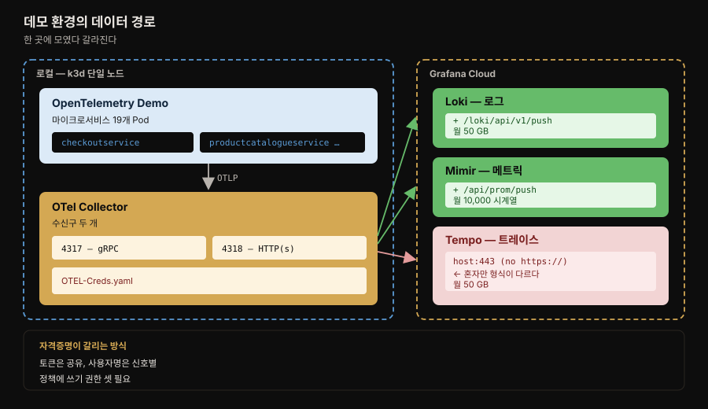

# 학습 환경 구축

---


## 핵심 요약

> 이 장은 앞의 두 장과 성격이 다릅니다. 개념이 아니라 **손을 움직이는 절차**이며, 화면 캡처를 따라 클릭하는 설치 안내서입니다. 그래서 이 노트는 클릭 순서를 옮기지 않습니다. 옮겨도 화면이 이미 달라졌기 때문입니다.
>
> 대신 세 가지를 남깁니다. 첫째는 **데이터가 흐르는 경로** 입니다. 데모 앱이 Collector 로 보내고 Collector 가 신호별로 다른 엔드포인트에 밀어 넣는 구조는 버전이 바뀌어도 그대로입니다. 둘째는 **자격증명이 갈리는 방식** 으로, 인증 실패의 대부분이 여기서 납니다. 셋째는 **트러블슈팅 순서** 이며 자격증명 → Collector 로그 → 디버그 상세도라는 계단이 이 장의 실질입니다.
>
> 무료 티어의 한도(월 메트릭 10,000·로그 50GB·트레이스 50GB)와 Tempo 엔드포인트만 형식이 다르다는 함정도 함께 적어 둡니다.

⛔ **이 장의 버전은 전부 낡았습니다.** 책은 2023년 기준이며 확인 결과 격차가 큽니다. 아래 §1 의 표에 실측값을 적었으니, **책의 `helm install --version` 명령을 그대로 복사하지 마십시오.** 3년 전 스택이 설치됩니다.


## 학습 목표

> 이 장을 읽고 나면 아래 다섯 가지를 스스로 해낼 수 있습니다.

1. 데모 환경에서 텔레메트리가 어느 경로로 흘러 Grafana Cloud 에 닿는지 그림으로 그릴 수 있습니다.
2. 신호 셋의 자격증명 가운데 무엇이 공유되고 무엇이 갈리는지 구분할 수 있습니다.
3. Tempo 엔드포인트가 나머지 둘과 다른 점을 말하고 왜 이것이 흔한 실수인지 설명할 수 있습니다.
4. 데이터가 안 보일 때 어떤 순서로 원인을 좁혀야 하는지 세 단계로 말할 수 있습니다.
5. 내 애플리케이션을 이 환경에 붙이려면 어디에 무엇을 보내야 하는지 답할 수 있습니다.


## 1. 이 장을 읽는 법 — 버전 드리프트부터

> 책이 고정한 버전과 지금의 값을 먼저 맞춰 둡니다. 이 확인 없이 명령을 복사하면 3년 전 스택이 설치됩니다.

저자들은 기술 요구사항 절에서 버전을 못 박습니다. **OpenTelemetry Collector 0.73.1** 과 **OpenTelemetry Demo 0.26.0** 을 쓴다고 적었고, 별도 알림 상자로 **이 장의 정보와 화면 캡처는 2023년 10월에 릴리스된 Grafana 10.2 기준** 이라고 밝힙니다. 저자들 자신이 "Grafana Labs 는 정기적으로 변경을 도입한다"고 경고한 셈입니다.

그 경고가 지금 그대로 적중했습니다. 2026-08-01 에 각 저장소의 최신 릴리스를 조회한 결과입니다.

| 구성요소 | 책의 값 (2023) | 실측 최신 (2026-07) | 격차 |
|----------|---------------|--------------------|------|
| Grafana | 10.2 | **13.1.1** | 메이저 3단계 |
| OTel Collector | 0.73.1 | **0.157.0** | 마이너 84단계 |
| OTel Demo | 0.26.0 | **3.0.0** | 메이저 승격 |
| Docker (예시 출력) | 20.10.24 | — | 예시일 뿐 요구사항 아님 |
| k3s (예시 출력) | v1.25.7+k3s1 | — | 예시일 뿐 요구사항 아님 |

그렇다고 이 장이 쓸모없어지지는 않습니다. **Helm 차트 이름은 그대로입니다.** 확인해 보면 `opentelemetry-collector` 와 `opentelemetry-demo` 가 여전히 공식 차트 저장소에 있습니다. 즉 *구조* 는 살아 있고 *숫자* 만 죽었습니다.

그래서 이 노트는 이렇게 나눕니다.

- **그대로 쓸 수 있는 것** — 데이터 경로, 자격증명 구조, 엔드포인트 경로 규칙, 트러블슈팅 순서, 무료 티어 한도의 성격
- **확인하고 써야 하는 것** — 모든 버전 번호, Grafana UI 의 메뉴 이름과 위치, 화면 캡처에 의존하는 클릭 순서

> 💬 **실습 코드는 어디에 두는가** — 이 저장소의 규약상 `write/` 는 다시 읽을 이론만 담고 실습 코드는 밖에 둡니다. 이 장을 실제로 따라 한다면 `~/observability-practice/` 같은 별도 경로에 `OTEL-Creds.yaml` 과 Helm values 를 두고, 이 노트에서는 경로만 참조합니다. 책의 예제 저장소는 [PacktPublishing/Observability-with-Grafana](https://github.com/PacktPublishing/Observability-with-Grafana) 입니다.


## 2. 데이터가 흐르는 경로

> 데모 앱이 Collector 한 곳으로 보내고, Collector 가 신호별로 다른 엔드포인트에 밀어 넣습니다. 이 구조가 이 장에서 가장 오래 살아남는 지식입니다.

저자들이 고른 데이터 생산자는 **OpenTelemetry Demo** 입니다. 망원경과 천체 관측 장비를 파는 데모 웹 상점(Astronomy Shop)이며, **여러 언어로 작성된 서비스들이 메트릭·로그·분산 트레이스를 모두 만들도록 계측** 되어 있습니다. 설치하면 약 19개의 Pod 가 뜹니다.



로컬 쪽 구성은 이렇게 쌓입니다.

| 계층 | 도구 | 저자들이 고른 이유 |
|------|------|-------------------|
| 컨테이너 런타임 | Docker 또는 Podman | 그 위에 단일 노드 쿠버네티스를 돌리는 것이 목적 |
| 단일 노드 쿠버네티스 | **k3d** | KinD·Minikube·MicroK8s 도 있으나 **운영체제를 가리지 않고 설치가 쉬워서** |
| 패키지 관리자 | Helm | OpenTelemetry 가 Helm 차트를 제공하므로 |
| OS 보조 도구 | WSL2(Windows) · Homebrew(macOS) | 운영체제 사이에 표준 명령 집합을 맞추려고 |

저자들은 Docker 라이선스 문제를 짚어 둡니다. **2021년에 도입해 2023년 1월에 완전히 발효된 라이선스 변경** 이 회사 소유 장비를 쓰는 독자에게 영향을 줄 수 있다는 것입니다. 설명은 Docker 기준으로만 하되 이 문제를 알려 둔다고 밝히고, **리눅스 사용자에게는 네이티브 지원이 더 나은 Podman Desktop 을 고려하라** 고 권합니다.

Grafana Cloud 쪽은 하나의 스택이 다음 설치본으로 구성됩니다.

- **시각화** — Grafana 인스턴스
- **메트릭** — Prometheus remote write 엔드포인트, Graphite 엔드포인트, Mimir 백엔드 저장소
- **로그** — Loki 엔드포인트, Loki 백엔드 저장소
- **트레이스** — Tempo 엔드포인트, Tempo 백엔드 저장소
- **알림** — Prometheus 기반 알림을 관리하는 Alerting 인스턴스
- **부하 테스트** — k6 클라우드 러너
- **프로파일링** — Pyroscope 엔드포인트와 백엔드 저장소

[1장](01-01.관측%20가능성과%20Grafana%20스택%20—%20파나마%20운하·페르소나·LGTM.md) 에서 제품별로 소개한 것들이 하나의 스택으로 묶여 나오는 자리입니다. 엔드포인트와 백엔드 저장소가 쌍으로 적혀 있다는 점이 눈에 띕니다. 받는 입구와 쌓는 곳이 분리돼 있다는 뜻이며, 1장에서 본 "세 저장소가 모두 오브젝트 스토리지에 얹힌다"는 설계와 이어집니다.


## 3. 자격증명 — 무엇이 공유되고 무엇이 갈리는가

> 인증 실패의 대부분이 이 구분을 놓쳐서 납니다. 토큰은 하나로 공유하되, 사용자명과 엔드포인트는 신호마다 다릅니다.

접근 토큰은 데모 애플리케이션이 Grafana Cloud 스택으로 데이터를 안전하게 보내게 해 줍니다. 만드는 절차의 요지는 이렇습니다.

1. Cloud Portal 의 Security 절에서 **Access Policies** 를 고릅니다.
2. 접근 정책을 만들며 **Realm 을 All Stacks** 로 둡니다.
3. **메트릭·로그·트레이스에 Write 스코프** 를 줍니다.
4. 그 정책에 토큰을 추가하고 이름과 만료일을 정한 뒤, 토큰을 복사해 안전하게 보관합니다.

여기서 3번이 나중에 문제를 만드는 자리입니다. 셋 중 하나라도 쓰기 권한이 빠지면 그 신호만 조용히 안 들어옵니다.

`OTEL-Creds.yaml` 에 채우는 값은 셋인데, **성격이 서로 다릅니다.**

| 항목 | 신호마다 다른가 | 형태 |
|------|----------------|------|
| **Password** | **아니오 — 셋이 공유** | 앞에서 저장한 API 토큰. 긴 영숫자 문자열 |
| **Username** | **예 — 신호마다 다름** | 보통 여섯 자리 숫자 |
| **Endpoint** | **예 — 신호마다 다름** | 아래 규칙대로 가공한 URL |

엔드포인트는 Cloud Portal 이 보여주는 URL 을 그대로 쓰지 않고 **가공** 해야 합니다. 이 가공 규칙이 이 절의 핵심입니다.

| 신호 | 가공 방법 | 결과 예시 |
|------|----------|----------|
| 로그(Loki) | URL 끝에 `/loki/api/v1/push` 를 붙임 | `https://logs-prod-006.grafana.net/loki/api/v1/push` |
| 메트릭(Prometheus) | URL 끝에 `/api/prom/push` 를 붙임 | `https://prometheus-prod-13-prod-us-east-0.grafana.net/api/prom/push` |
| 트레이스(Tempo) | **`https://` 를 떼고 끝에 `:443` 을 붙임** | `tempo-prod-04-prod-us-east-0.grafana.net:443` |

⚠️ 저자들이 이 대목에만 별도 알림 상자를 답니다. **Tempo 의 OTLP 엔드포인트는 나머지와 형식이 다릅니다.** 앞의 둘은 경로를 *더하는* 일인데 트레이스만 스킴을 *떼고* 포트를 붙입니다. 앞의 둘을 처리한 손버릇 그대로 트레이스에도 `https://` 를 남겨 두면 인증이 아니라 연결 단계에서 실패합니다.


## 4. 무료 티어의 한도

> 개인 실습에는 넉넉하지만 한도의 *단위* 가 신호마다 다르다는 점을 봐 둘 만합니다.

Cloud Free 구독이 주는 월 한도입니다.

| 항목 | 한도 |
|------|------|
| 메트릭 | **10,000** |
| 로그 | **50 GB** |
| 트레이스 | **50 GB** |
| 프로파일 | **50 GB** |
| IRM 사용자 | 3명 |
| k6 가상 사용자 시간 | 500 VUh |

메트릭만 숫자로 세고 나머지는 용량으로 잽니다. 원문은 "10,000 metrics" 라고만 적고 그 10,000 이 무엇의 개수인지는 밝히지 않습니다.

> **책 밖 — 이 단위가 왜 중요한가.** 원문은 여기까지만 말하지만, [2장](02-01.계측%20—%20로그%20형식·메트릭%20타입·트레이싱%20프로토콜·인프라%20표준.md) 의 카디널리티 논의와 겹쳐 읽으면 함의가 보입니다. 메트릭 계열 한도가 용량이 아니라 *개수* 로 매겨지면, 데이터 양이 늘기 전에 차원 조합의 수가 먼저 한도를 칠 수 있습니다. 사용자 ID 처럼 고유값이 많은 것으로 차원을 나누는 경우가 그렇습니다. 다만 Grafana Cloud 가 이 10,000 을 정확히 어떤 단위로 세는지는 이 장에 없으므로, 실제로 한도를 다룰 때는 과금 문서에서 확인해야 합니다.

저자들은 이 구독이 책에서 쓰는 데모 애플리케이션과 비슷한 규모의 개인 용도 설치에는 충분하다고 적습니다. 더 큰 설치를 위해 Cloud Pro 와 Cloud Advanced 두 티어가 있고, Cloud Advanced 는 엔터프라이즈급 설치를 겨냥합니다. 과금은 영역별 수집량과 활성 사용자 기준입니다.

무료 구독에서는 **스택을 하나만** 가질 수 있습니다. Pro 나 Advanced 를 구독하면 계정 안에 여러 스택을 만들 수 있고 스택마다 리전을 다르게 둘 수 있습니다. 처음 가입하면 **Cloud Pro 14일 체험** 이 함께 주어집니다.


## 5. 트러블슈팅 — 좁혀 가는 순서

> 이 장에서 가장 오래 쓸모 있는 부분입니다. 자격증명 → Collector 로그 → 디버그 상세도 순으로 계단을 올라갑니다.

저자들은 이 절이 전수가 아니라고 먼저 밝히고, 사전 도구는 모두 올바로 설치됐다고 가정합니다. 그리고 **가장 흔한 문제는 접근 자격증명** 이라고 못 박습니다.

### 1단계 — 자격증명 형식을 본다

Collector 가 인증 오류를 내거나 데이터가 안 들어오면 자격증명 형식이 틀렸을 가능성이 큽니다. 확인할 항목은 §3 의 표 그대로이며, 저자들이 토큰에 대해 덧붙이는 고려사항이 둘 있습니다.

- **같은 토큰을 모든 exporter 가 공유할 수 있습니다.** 신호마다 토큰을 따로 만들 필요가 없습니다.
- **그 토큰에 묶인 접근 정책이 로그·메트릭·트레이스를 모두 쓸 수 있어야 합니다.** Cloud Portal 에서 확인할 수 있습니다.

고쳤다면 변경을 반영해야 합니다. `helm upgrade` 로 `OTEL-Creds.yaml` 의 변경을 배포하거나, `helm uninstall` 후 원래 절차로 다시 설치합니다.

### 2단계 — Collector 로그를 읽는다

자격증명이 맞는데도 안 되면 다음은 Collector 로그입니다. 쿠버네티스는 Pod 의 로그를 직접 읽게 해 주므로 **전체 Pod 이름** 이 필요합니다.

```bash
# 1) 인스턴스 라벨로 Pod 을 찾아 전체 이름을 얻습니다
kubectl get pods --selector=app.kubernetes.io/instance=owg

# 2) 그 이름으로 로그를 읽습니다
kubectl logs owg-opentelemetry-collector-567579558c-std2x
```

**warning 이나 error 수준 이벤트** 를 찾으면 무슨 일이 벌어지는지 실마리가 나옵니다.

### 3단계 — 디버그 상세도를 올린다

기본 로깅으로 부족하면 Collector 의 디버그 로깅을 켤 수 있습니다. 대개 장황하지만 문제를 이해하는 데 도움이 됩니다.

`OTEL-Creds.yaml` 끝에 디버그 exporter 를 관리하는 절이 있고, verbosity 를 **`detailed`·`normal`·`basic`** 중에서 고릅니다. 저자들의 경험칙은 이렇습니다. **대부분은 `normal` 로 충분하고, 그래도 안 잡히면 `detailed`** 로 올립니다.

⚠️ 이 옵션을 바꾸면 Helm 차트를 다시 배포해야 하고, **그러면 Pod 이 재시작되므로 Pod ID 가 바뀝니다.** 2단계에서 쓰던 이름이 더 이상 유효하지 않으니 새 ID 를 다시 얻어야 합니다.

### 데이터가 보이기까지 걸리는 시간

트러블슈팅에 들어가기 전에 확인할 것이 하나 더 있습니다. Grafana 첫 화면의 사용량 표시가 로그·메트릭·트레이스 모두 0 보다 커야 하는데, 저자들은 **완전히 표시되기까지 몇 분, 때로는 한 시간까지 걸릴 수 있다** 고 적습니다. 설치 직후 0 이라고 바로 설정을 뒤집지 않아도 된다는 뜻입니다.


## 6. 데이터를 들여다보는 자리 — Explore

> 데이터 소스가 Grafana 의 최상위 개념이며, 셋 다 같은 반복 구조를 씁니다.

Grafana 에서 **가장 높은 수준의 개념은 데이터 소스(data source)** 입니다. 각 데이터 소스는 Grafana 인스턴스에서 Grafana 스택의 구성요소나 다른 도구로 가는 연결이며 **각각 독립적** 입니다. 이 장에서 다루는 셋은 프로비저닝한 스택에 대응합니다.

| 데이터 소스 | 대응 구성요소 | 이 장의 예시 쿼리 |
|------------|--------------|------------------|
| `grafanacloud-<team>-logs` | Loki | Label filters 에 `exporter = OTLP` |
| `grafanacloud-<team>-prom` | Mimir | Metric 에서 `kafka_consumer_commit_rate` |
| `grafanacloud-<team>-traces` | Tempo | Query type=Search, Service Name=`checkoutservice` |

저자들이 짚는 것은 **Grafana 가 데이터를 질의할 때 비슷한 반복 블록을 쓴다** 는 점입니다. 위는 쿼리 영역, 아래는 결과 영역이라는 구조가 셋에 공통이며, 그래서 하나를 익히면 나머지가 쉬워집니다.

신호별로 다른 점만 추리면 이렇습니다.

- **로그(Loki)** — 화면 가운데에 **시간에 따른 로그 volume** 이 나옵니다. 한눈에 맥락을 주는 정보입니다. 결과 영역에서는 타임스탬프 표시, 고유 라벨 강조, 줄바꿈, JSON 정렬을 조절하고 **중복 제거(deduplication)** 를 적용할 수 있으며 `.txt`·`.json` 으로 내려받을 수 있습니다.
- **메트릭(Mimir)** — **Options** 절이 추가됩니다. Format 으로 Time series·Table·Heatmap 을 고르고, Type 으로 구간·최신 시점·둘 다를 고릅니다. **Exemplars 슬라이더가 각 메트릭에 연결된 트레이스 데이터를 보여줍니다.**
- **트레이스(Tempo)** — 질의가 두 단계입니다. 먼저 트레이스를 찾아 고르고, 그다음 그 안의 스팬을 자세히 봅니다.

Exemplar 가 여기서 UI 로 등장하는 것이 앞의 두 장과 이어집니다. 2장은 exemplar 를 "메트릭과 트레이스를 상관짓는 능력"이라고 소개했습니다. 그 상관이 실제로는 슬라이더 하나로 켜지는 것입니다.

트레이스 화면에서 저자들이 설명하는 것 하나가 유용합니다. **분할 뷰(split view)** 는 어느 데이터 소스에서도 접근할 수 있습니다. **연결된 데이터 포인트로 로그·메트릭·트레이스 사이를 오가며 같은 시점이나 사건을 각 신호에서 보게** 해 줍니다.

트레이스의 각 줄은 스팬입니다. 막대는 그 스팬이 걸린 총 시간을 나타내며 상대적 시작·종료 시각을 표현하도록 쌓입니다. 예시에서는 `productcatalogueservice` 가 트랜잭션 시간의 상당 부분을 차지하는 것이 보인다고 적습니다.


## 7. 내 애플리케이션을 붙이려면

> 수신구는 이미 열려 있습니다. 컨테이너로 패키징해 배포하면 됩니다.

이 데모 설치에 자기 애플리케이션을 더하는 것이 가능합니다. **OpenTelemetry Collector 가 OTLP 형식 데이터를 받는 수신구를 두 개 열어 둔 상태로 배포** 되어 있기 때문입니다.

| 포트 | 프로토콜 |
|------|----------|
| **4317** | gRPC |
| **4318** | HTTP(s) |

배포하려면 애플리케이션을 컨테이너로 패키징한 뒤 쿠버네티스 표준 배포 방식을 따르면 됩니다.

⚠️ 저자들이 다는 단서가 하나 있습니다. **k3d 는 의견이 강한(opinionated) 도구라 기본으로 네트워킹에 Flannel 을, 인그레스에 Traefik 을 씁니다.** 다른 CNI 나 인그레스 컨트롤러를 전제한 매니페스트를 그대로 가져오면 어긋날 수 있다는 뜻입니다.

두 포트 번호는 [2장](02-01.계측%20—%20로그%20형식·메트릭%20타입·트레이싱%20프로토콜·인프라%20표준.md) 의 계측 논의와 만납니다. Spring 앱이라면 OTLP exporter 의 목적지를 이 주소로 두면 되고, 브라우저 스팬을 보내려면 책이 안내한 대로 4318 로 포트 포워딩을 열어 둡니다.


## 책 밖으로 잇기

> 이 장의 절차를 지금 따라 할 때 달라지는 지점을 1차 자료로 확인합니다.

**버전은 반드시 새로 확인합니다.** §1 의 표가 그 실측입니다. 조회는 각 저장소의 릴리스 API 로 했습니다.

```bash
# 최신 릴리스 태그를 직접 확인합니다 — 책의 숫자를 믿지 않습니다
curl -s https://api.github.com/repos/open-telemetry/opentelemetry-demo/releases/latest | grep '"tag_name"'
curl -s https://api.github.com/repos/open-telemetry/opentelemetry-collector/releases/latest | grep '"tag_name"'
```

**차트 이름은 살아 있습니다.** 공식 Helm 차트 저장소를 조회하면 책이 쓰던 두 차트가 그대로 있습니다. 그 밖에 함께 있는 차트는 이렇습니다.

- `opentelemetry-collector` · `opentelemetry-demo` — 이 장이 쓰는 둘
- `opentelemetry-operator` · `opentelemetry-kube-stack` — 쿠버네티스 통합 배포 계열
- `opentelemetry-ebpf-instrumentation` · `opentelemetry-target-allocator` 등

책의 두 차트는 여전히 유효합니다. 다만 지금 새로 구축한다면 Operator 나 kube-stack 계열이 더 나은 선택일 수 있으니 [차트 저장소](https://github.com/open-telemetry/opentelemetry-helm-charts)에서 현재 권장 경로를 확인하는 편이 좋습니다.

**이 저장소의 셀프호스팅 경로와 대비됩니다.** 책은 Grafana Cloud(SaaS)를 전제하지만 이 저장소의 [02-07. LGTM K8s 통합 배포](../../02_LGTMStack/02-07.LGTM%20K8s%20통합%20배포.md) 와 305P 운영기록은 셀프호스팅입니다. 무엇이 달라지는지만 짚어 두면 이 장을 읽을 때 헷갈리지 않습니다.

| 축 | 이 장(SaaS) | 이 저장소의 305P(셀프호스팅) |
|----|------------|---------------------------|
| 엔드포인트 | Grafana 가 발급, 신호마다 형식이 다름 | 내가 배포한 서비스 주소 |
| 인증 | 접근 정책 + API 토큰 | 클러스터 내부 통신이면 생략되기도 함 |
| 한도 | 구독 티어가 정함(메트릭 10,000 등) | 내가 준 스토리지와 보존 기간이 정함 |
| 업그레이드 책임 | Grafana Labs | 나 |

**k3d 의 대안.** 저자들은 설치 편의로 k3d 를 골랐다고 밝혔습니다. 이미 로컬에 다른 클러스터가 있다면 그것을 써도 무방하되, §7 의 Flannel·Traefik 전제가 달라진다는 점만 기억합니다.


## 결정 치트시트

> 이 장이 남기는 판단 기준을 표로 압축합니다.

| 상황 | 선택 | 이유 |
|------|------|------|
| 이 장을 지금 따라 하려 함 | 버전을 먼저 실측 | 책의 값은 2023년 기준이며 메이저 단위로 벌어짐 |
| 로컬 쿠버네티스를 고름 | k3d(책 기준) 또는 이미 쓰는 것 | 설치 편의가 선택 이유였을 뿐 강제 아님 |
| 리눅스에서 컨테이너 런타임 | Podman Desktop 고려 | 네이티브 지원이 더 낫다고 저자들이 권함 |
| 회사 장비에서 Docker 사용 | 라이선스 확인 | 2021년 변경이 2023년 1월 완전 발효 |
| 신호별로 토큰을 나눌까 | 하나로 공유 | 같은 토큰을 모든 exporter 가 쓸 수 있음 |
| 트레이스만 안 들어옴 | 엔드포인트 형식부터 확인 | Tempo 만 `https://` 를 떼고 `:443` 을 붙임 |
| 특정 신호만 안 들어옴 | 접근 정책의 쓰기 스코프 확인 | 셋 중 빠진 것이 있으면 그 신호만 조용히 실패 |
| 설치 직후 사용량이 0 | 최대 한 시간 기다림 | 완전히 표시되기까지 시간이 걸림 |
| 자격증명이 맞는데 데이터가 없음 | Collector 로그 → 디버그 상세도 | 순서대로 좁힘. `normal` 로 대개 충분 |
| 메트릭 한도에 먼저 걸림 | 차원(라벨)을 줄임 | 메트릭만 용량이 아니라 **개수** 로 제한 |
| 내 앱을 붙임 | 4317(gRPC) 또는 4318(HTTP) | 수신구가 이미 열려 배포돼 있음 |


## Spring 앱 개발 관점

> 이 장에는 Spring 예제가 없습니다. 아래는 이 데모 환경에 Spring 앱을 붙일 때 걸리는 지점을 정리한 것이며, 책 밖의 내용입니다.

§7 이 말한 두 수신구가 Spring 앱에는 이렇게 대응합니다. Micrometer 의 OTLP 레지스트리나 OpenTelemetry Java agent 를 쓰면 목적지를 이 주소로 지정합니다.

```yaml
# application.yml — 클러스터 안에서 Collector 서비스를 가리킵니다
management:
  otlp:
    metrics:
      export:
        url: http://owg-opentelemetry-collector:4318/v1/metrics
    tracing:
      endpoint: http://owg-opentelemetry-collector:4318/v1/traces
```

주의할 점이 둘입니다.

- **경로까지 써야 합니다.** Collector 가 여는 것은 `4318` 포트이지만 HTTP 수신구는 신호별 경로(`/v1/metrics`·`/v1/traces`)를 갖습니다. 포트만 적고 경로를 빠뜨리면 404 가 납니다.
- **클러스터 안과 밖의 주소가 다릅니다.** 앱을 같은 클러스터에 배포하면 서비스 이름으로 닿지만, 로컬에서 직접 띄워 시험한다면 책이 안내한 `kubectl port-forward` 로 `localhost:4318` 을 열어야 합니다.

계측 방식 선택은 [2장 §4](02-01.계측%20—%20로그%20형식·메트릭%20타입·트레이싱%20프로토콜·인프라%20표준.md) 의 자동 대 수동 논의가 그대로 적용됩니다. Java 는 자동 계측이 코드 조작 방식이라 agent 를 붙이는 것만으로 상당한 범위가 잡히지만, 저자들이 경고한 대로 통제력이 부족하다는 대가가 따릅니다.


## 면접에서 받을 만한 질문

> 아래 질문에 **먼저 스스로 답해 보세요.** 자답이 끝나면 이어지는 §정답 (자답 후 펼치기) 으로 내려갑니다.

1. 이 데모 환경에서 텔레메트리가 어느 경로로 흘러 Grafana Cloud 에 닿습니까?
2. 신호 셋의 자격증명 가운데 공유되는 것과 갈리는 것은 각각 무엇입니까?
3. Tempo 엔드포인트는 나머지 둘과 무엇이 다르며 왜 흔한 실수가 됩니까?
4. 특정 신호 하나만 데이터가 안 들어온다면 무엇부터 의심합니까?
5. 데이터가 안 보일 때 어떤 순서로 원인을 좁힙니까?
6. 무료 티어에서 메트릭 한도가 나머지와 다른 점은 무엇이며 그것이 왜 중요합니까?
7. 내 애플리케이션을 이 환경에 붙이려면 어디로 데이터를 보냅니까?


## 정답 (자답 후 펼치기)

> 위 §면접에서 받을 만한 질문 의 7개에 *먼저 자답한 뒤* 아래를 읽으세요. 자답 없이 먼저 읽으면 학습 효과가 0 입니다. 질문 번호와 1:1 로 대응합니다.

### 정답 1 — 데이터 경로

k3d 로 띄운 단일 노드 쿠버네티스 클러스터 안에서 **OpenTelemetry Demo 의 마이크로서비스들이 OTLP 로 Collector 에 보냅니다.** Collector 가 그 데이터를 신호별로 갈라 Grafana Cloud 의 서로 다른 엔드포인트로 밀어 넣습니다. 로그는 Loki, 메트릭은 Mimir, 트레이스는 Tempo 로 갑니다.

### 정답 2 — 공유되는 것과 갈리는 것

- **공유** — Password(API 토큰) 하나를 신호 셋이 함께 씁니다.
- **갈림** — Username(보통 여섯 자리 숫자)과 Endpoint 는 신호마다 다릅니다.

토큰을 신호마다 따로 만들 필요가 없다는 것이 저자들의 명시입니다.

### 정답 3 — Tempo 엔드포인트

로그와 메트릭은 URL 끝에 **경로를 더합니다**(`/loki/api/v1/push`, `/api/prom/push`). 트레이스만 **`https://` 스킴을 떼고 끝에 `:443` 을 붙입니다.**

흔한 실수가 되는 이유는 앞의 둘을 처리한 손버릇이 그대로 이어지기 때문입니다. 셋을 연달아 설정하다 보면 트레이스에도 스킴을 남긴 채 경로만 손보게 됩니다. 저자들이 이 대목에만 별도 알림 상자를 단 것도 그래서입니다.

### 정답 4 — 신호 하나만 안 들어올 때

**접근 정책의 쓰기 스코프** 를 먼저 봅니다. 토큰에 묶인 정책이 로그·메트릭·트레이스 셋 모두에 쓰기 권한을 가져야 하는데, 하나가 빠지면 그 신호만 조용히 실패합니다. 토큰 자체는 유효하므로 인증이 통째로 깨지지 않아 알아채기 어렵습니다.

그다음이 그 신호의 엔드포인트 형식이며, 트레이스라면 정답 3 의 함정을 확인합니다.

### 정답 5 — 트러블슈팅 순서

1. **자격증명 형식** — 가장 흔한 원인. 사용자명·토큰·엔드포인트와 접근 정책의 스코프를 봅니다. 고쳤으면 `helm upgrade` 로 반영합니다.
2. **Collector 로그** — `kubectl get pods --selector=...` 로 전체 Pod 이름을 얻고 `kubectl logs` 로 warning·error 를 찾습니다.
3. **디버그 상세도** — `OTEL-Creds.yaml` 의 debug exporter verbosity 를 `normal` 로, 그래도 부족하면 `detailed` 로 올립니다. 재배포하면 Pod 이 재시작되므로 **새 Pod ID 를 다시 얻어야** 합니다.

단, 설치 직후라면 이 계단을 오르기 전에 시간을 줍니다. 사용량이 완전히 표시되기까지 몇 분에서 한 시간까지 걸립니다.

### 정답 6 — 메트릭 한도의 단위

로그·트레이스·프로파일은 **용량(50 GB)** 으로 재는데 메트릭만 **숫자(10,000)** 로 셉니다. 원문은 그 10,000 이 무엇의 개수인지는 밝히지 않습니다.

이 차이가 중요한 이유는 2장의 카디널리티 논의와 이어지기 때문입니다. 한도가 용량이 아니라 개수로 매겨지면 **데이터 양이 적어도 차원 조합의 수가 먼저 한도를 칠 수 있습니다.** 다만 정확한 계산 단위는 이 장에 없으므로 과금 문서로 확인해야 한다는 단서가 붙습니다.

### 정답 7 — 내 앱을 붙이는 곳

Collector 가 이미 OTLP 수신구를 열어 둔 상태로 배포돼 있습니다. **gRPC 는 4317, HTTP(s) 는 4318** 입니다. 애플리케이션을 컨테이너로 패키징해 쿠버네티스 표준 방식으로 배포하면 됩니다.

단서로, **k3d 가 기본으로 Flannel(네트워킹)과 Traefik(인그레스)을 쓴다** 는 점을 기억해야 합니다. 다른 전제의 매니페스트를 그대로 가져오면 어긋납니다.


## 핵심 개념 체크리스트

> 위 §정답 을 덮고, 각 항목을 소리 내어 설명할 수 있는지 점검합니다. 막히는 자리가 이 장의 재학습 지점입니다.

- [ ] 책의 버전이 지금과 얼마나 벌어졌는지, 그럼에도 무엇이 살아 있는지 말할 수 있는가?
- [ ] 로컬 쪽 네 계층(런타임·쿠버네티스·Helm·OS 도구)과 각각의 역할을 댈 수 있는가?
- [ ] 저자들이 k3d 를 고른 이유를 말할 수 있는가?
- [ ] Grafana 스택이 엔드포인트와 백엔드 저장소를 쌍으로 갖는다는 것이 무슨 뜻인지 아는가?
- [ ] 자격증명 셋 중 공유되는 것과 갈리는 것을 구분할 수 있는가?
- [ ] 신호별 엔드포인트 가공 규칙 셋을 적을 수 있는가?
- [ ] Tempo 만 형식이 다른 이유와 그 함정을 설명할 수 있는가?
- [ ] 무료 티어에서 메트릭만 단위가 다른 점과 그 함의를 말할 수 있는가?
- [ ] 트러블슈팅 세 단계를 순서대로 댈 수 있는가?
- [ ] 디버그 verbosity 세 값과 재배포 시 주의점을 아는가?
- [ ] 데이터 소스가 Grafana 의 최상위 개념이라는 말의 의미를 아는가?
- [ ] exemplar 가 UI 에서 어디에 나타나는지, 무엇을 이어 주는지 말할 수 있는가?
- [ ] 내 앱을 붙일 두 포트와 k3d 의 기본 네트워킹 전제를 아는가?


## 참고 자료

> 원서 3장과, 버전을 대조한 1차 자료 목록입니다.

- 원본: *Observability with Grafana* (Packt, ISBN 9781803248004) 3장 — Setting Up a Learning Environment with Demo Applications.
- 책의 예제 저장소: [PacktPublishing/Observability-with-Grafana](https://github.com/PacktPublishing/Observability-with-Grafana) — `chapter3` 디렉토리에 설정 파일
- [OpenTelemetry Demo](https://github.com/open-telemetry/opentelemetry-demo) — §1 버전 실측(2026-08-01 조회: 3.0.0)
- [OpenTelemetry Collector](https://github.com/open-telemetry/opentelemetry-collector) — §1 버전 실측(2026-08-01 조회: 0.157.0)
- [OpenTelemetry Helm charts](https://github.com/open-telemetry/opentelemetry-helm-charts) — 차트 이름 유효성 확인
- [k3d](https://k3d.io/stable/) · [Helm 설치](https://helm.sh/docs/intro/install/) — 원문이 안내한 설치 문서


## 관련 문서

> 이 편은 앞 두 장의 개념을 실제로 흐르게 만드는 환경을 다룹니다. 개념은 앞 편으로, 셀프호스팅 구축은 카테고리 노트로 이어집니다.

- [README (책 MOC)](README.md) — 《Observability with Grafana》 15장 전체 지도
- [02-01. 계측 — 로그 형식·메트릭 타입·트레이싱 프로토콜·인프라 표준](02-01.계측%20—%20로그%20형식·메트릭%20타입·트레이싱%20프로토콜·인프라%20표준.md) — 앞 편. §4 한도가 걸리는 카디널리티, §7 OTLP 수신구의 배경
- [01-01. 관측 가능성과 Grafana 스택](01-01.관측%20가능성과%20Grafana%20스택%20—%20파나마%20운하·페르소나·LGTM.md) — §2 Grafana 스택 구성의 제품별 소개
- [02-07. LGTM K8s 통합 배포](../../02_LGTMStack/02-07.LGTM%20K8s%20통합%20배포.md) — 같은 스택을 셀프호스팅으로 올리는 경로
- [03-11. 305P OpenTelemetry 도입 고려사항](../../03_Project/03-11.305P%20OpenTelemetry%20도입%20고려사항.md) — Collector 를 실제 운영 환경에 넣을 때의 판단
