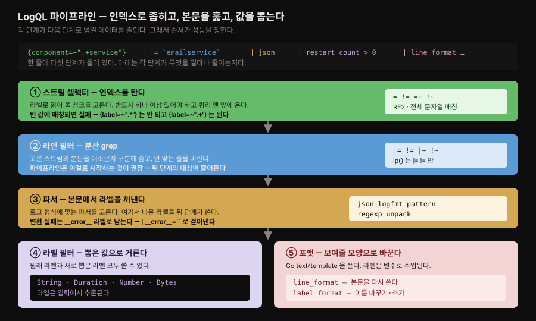

# Loki 와 LogQL

---


## 핵심 요약

> 이 장은 Loki 를 *쓰는* 장입니다. 설계 사상에서 출발해 LogQL 문법 전반을 훑고, 마지막에 아키텍처로 내려가 "왜 이렇게 써야 빠른가"를 설명합니다.
>
> Loki 의 설계 목표는 네 줄로 요약됩니다. 개발자·운영자를 염두에 두고, 사전 파싱 없이 그대로 받고, **메타데이터만 색인** 하고, 전부 오브젝트 스토리지에 넣습니다. 이 중 세 번째가 나머지 모든 것을 결정합니다. 본문은 색인되지 않으므로 라벨이 곧 인덱스이고, 라벨 설계가 곧 쿼리 성능입니다.
>
> LogQL 은 PromQL 에서 영감을 받았고 구조도 닮았습니다. 스트림 셀렉터로 청크를 고른 뒤 파이프라인으로 걸러 나가며, 마지막에는 **로그에서 메트릭을 만들어** 대시보드와 알림으로 넘깁니다. 이 마지막 능력이 Loki 를 단순 로그 저장소와 가르는 지점입니다.

이 저장소에는 이미 [02-03. Grafana Loki](../../02_LGTMStack/02-03.Grafana%20Loki.md) 가 있고 그쪽이 더 최신입니다(Loki 3.6 기준). 겹치는 부분은 그쪽으로 위임하고, 여기서는 **그 편이 다루지 않는 것** 에 무게를 둡니다. 파서 5종의 구분, 값 타입과 `__error__` 처리, 메트릭 쿼리 두 갈래, 아키텍처 내부 컴포넌트가 그것입니다.


## 학습 목표

> 이 장을 읽고 나면 아래 다섯 가지를 스스로 해낼 수 있습니다.

1. Loki 가 무엇을 색인하고 무엇을 색인하지 않는지 말하고, 그것이 라벨 설계에 미치는 영향을 설명할 수 있습니다.
2. LogQL 파이프라인 다섯 단계를 순서대로 대고 각 단계가 무엇을 줄이는지 말할 수 있습니다.
3. 로그 형식에 맞는 파서를 고르고 파싱 오류를 걸러낼 수 있습니다.
4. 로그 범위 집계와 unwrap 범위 집계를 구분하고 각각 언제 쓰는지 판단할 수 있습니다.
5. 좋은 라벨과 나쁜 라벨을 기준을 들어 구분할 수 있습니다.


## 1. Loki 의 설계 목표

> 넷 중 "메타데이터만 색인한다"가 나머지 전부를 결정합니다.

Grafana Loki 는 처음부터 **확장 가능한 멀티테넌트 로깅 솔루션** 으로 설계됐고 Prometheus 의 영향을 크게 받았습니다. 저자들이 꼽는 주요 목표는 넷입니다.

1. **개발자와 운영자를 염두에 둔다** — 1장의 Diego 와 Ophelia 입니다.
2. **수집이 단순하다** — 사전 파싱(pre-parsing)이 필요 없습니다.
3. **로그에 대한 메타데이터만 색인한다.**
4. **모든 것을 오브젝트 스토어에 저장한다.**

2번과 3번이 짝을 이룹니다. 들어올 때 파싱하지 않으니 무슨 형식이든 받을 수 있습니다. 대신 검색할 수 있는 것은 색인된 메타데이터뿐입니다.

저자들이 "Loki 는 모든 소스에서 로그를 받는다"고 반복하는 근거가 여기 있습니다. 복잡한 환경에 여러 시스템과 하드웨어가 섞여 있어도 상관없으며, 심지어 Loki API 로 직접 보낼 수도 있습니다.

### 로그 하나의 구조

Loki 는 로그를 **로그 스트림(log stream)** 으로 저장하며, 각 항목은 셋으로 이뤄집니다.

| 구성 | 내용 | 색인 여부 |
|------|------|----------|
| **Timestamp** | 정확도를 위해 나노초 정밀도 | — |
| **Labels** | 데이터 식별·검색에 쓰는 키-값 쌍 | **색인됨 — 이것이 Loki 인덱스** |
| **Content** | 원본 로그 라인 | **색인 안 됨 — 압축된 청크로 저장** |

라벨의 성질은 네 줄로 정리됩니다.

- **고유한 라벨·값 조합 하나가 로그 스트림 하나를 만듭니다.**
- 한 스트림의 로그들은 batch·압축되어 청크로 저장됩니다.
- 라벨이 Loki 로그 스트림의 인덱스입니다.
- 라벨로 로그를 검색합니다.

첫 줄이 뒤의 §5 카디널리티 경고로 곧장 이어집니다. 조합 하나가 스트림 하나라면, 값의 가짓수가 많은 라벨을 넣는 순간 스트림이 곱셈으로 늘어납니다.


## 2. LogQL 파이프라인 — 다섯 단계

> 기본 쿼리는 스트림 셀렉터 하나 이상과 선택적 로그 파이프라인으로 이뤄집니다. 각 단계가 다음 단계로 넘길 데이터를 줄입니다.

LogQL 은 Grafana 가 PromQL 을 참고해 만든 Loki 의 쿼리 언어입니다. Loki 는 로그 *내용* 을 색인하지 않으므로, LogQL 쿼리를 실행한다는 것은 **로그 스트림에 대한 일종의 분산 필터링을 호출** 하는 일입니다.



표로 옮기면 이렇습니다.

| 단계 | 문법 | 연산자 | 역할 |
|------|------|--------|------|
| **스트림 셀렉터** | `{label="value", foo!="bar"}` | `=` `!=` `=~` `!~` | 가져올 로그 스트림 선택. **최소 하나는 반드시 있어야 함** |
| **라인 필터** | ``\|= `error` `` | `\|=` `!=` `\|~` `!~` | 매칭되는 로그 라인만 남김 |
| **파서** | `\| json` | json · logfmt · pattern · regexp · unpack | 로그 내용에서 라벨을 추출 |
| **라벨 필터** | `\| label="value"` | `=` `!=` `=~` `!~` `<` `<=` `>` `>=` | 원래 라벨과 새로 뽑은 라벨로 필터 |
| **라인 포맷** | `\| line_format "{{.label}}"` | — | 표시용으로 로그 라인 내용을 다시 씀 |
| **라벨 포맷** | `\| new_label="{{.label}}"` | — | 라벨 이름 변경·수정·추가 |

### 스트림 셀렉터 — 빈 값에 걸리면 실패합니다

스트림 셀렉터는 쿼리의 **맨 앞** 에 오고 중괄호로 감쌉니다. 여러 개를 쉼표로 이을 수 있습니다.

⚠️ 저자들이 명시하는 제약이 하나 있습니다. 셀렉터는 **빈 값에 매칭되지 않도록 써야 합니다.**

```logql
{label=~".*"}   # 실패 — 0개 이상 수량자라 빈 값에도 매칭됨
{label=~".+"}   # 통과 — 1개 이상 수량자
```

정규식은 **Golang RE2 문법** 이며, 이는 **전체 문자열에 대해 매칭해야 한다** 는 뜻입니다. 개행도 포함되므로 정규식 필터가 안 걸리면 이 점을 확인해 볼 만합니다.

셀렉터를 세밀하게 쓸수록 검색할 스트림 수가 줄어 쿼리 성능이 좋아집니다. 왜 그런지는 §4 아키텍처에서 드러납니다.

### 라인 필터 — 분산 grep

Grafana 는 라인 필터를 **매칭된 로그 스트림의 집계 로그에 대한 분산 grep** 이라고 설명합니다. 실질적으로는 로그 라인 내용을 **대소문자를 구분해** 검색하고 안 맞는 줄을 버리는 일입니다.

**파이프라인은 라인 필터로 시작하는 것이 모범 사례입니다.** 뒤따르는 표현식의 결과 집합을 줄여 쿼리 성능을 높이기 때문입니다.

이 절에 딸린 두 기능이 실무에서 유용합니다.

**IP 주소 매칭** — 복잡한 정규식 없이 `ip("<pattern>")` 문법을 씁니다. IPv4·IPv6, 주소 범위, CIDR 을 모두 지원합니다.

```logql
ip("192.168.0.22")                      # 단일 주소 (IPv6 은 ip("::1"))
ip("192.168.0.1-192.189.10.12")         # 범위
ip("192.52.100.0/24")                   # CIDR (IPv6 은 ip("2001:db8::/32"))
```

⚠️ 구현상 단서가 붙습니다. **라인 필터에서는 `|=` 와 `!=` 만 허용** 됩니다. 라벨 필터에서도 마찬가지로 `=` 와 `!=` 만 됩니다.

**decolorize** — 2장에서 비구조화 로그가 가독성을 위해 색을 입힌다고 했습니다. Loki 같은 집계 시스템에서는 그 색 코드가 그대로 보이며, 원문 표기로 빨강은 `\u001b[31m` 으로 나타납니다. 이 ANSI 시퀀스를 걷어내는 표현식입니다.

```logql
{name="emailservice"} | decolorize
```

### 파서 — 로그 형식에 맞는 것을 고릅니다

저자들은 여기서 [2장](02-01.계측%20—%20로그%20형식·메트릭%20타입·트레이싱%20프로토콜·인프라%20표준.md) 의 논지를 되풀이합니다. 로그가 어떻게 생겼든 상관없지만, **내가 다루는 형식을 이해하는 것은 중요** 합니다. 파서 선택이 바로 그 이해의 결과물입니다.

| 파서 | 대상 로그 | 핵심 동작 |
|------|----------|----------|
| **json** | 구조화·반구조화 JSON | 단독으로 쓰면 모든 JSON 속성을 라벨로 추출. **중첩 속성은 `_` 로 이어 단일 라벨** 로 표현. **배열은 전부 건너뜀** |
| **logfmt** | 구조화된 단일 레벨 키-값 | 단독으로 쓰면 모든 키-값 쌍을 추출 |
| **pattern** | 비구조화 | `<` `>` 로 감싼 캡처와 리터럴로 로그 라인 구조를 명시해 필드 추출 |
| **regexp** | 비구조화 | Golang RE2 정규식. **최소 하나의 서브매치가 있어야 유효**, 서브매치마다 다른 라벨을 추출 |
| **unpack** | Promtail 의 pack 기능으로 만든 로그 | 내장 라벨을 풀어냄. 원본 로그 라인은 `_entry` 키에 있고 이 값이 로그 라인을 대체 |

json 과 logfmt 는 **표현식을 넘겨 필요한 라벨만 뽑을 수 있습니다.** 전부 뽑을 이유가 없다면 이쪽이 낫습니다.

```logql
| json label1="expression", label2="expression"
| logfmt label1="expression", label2="expression"
```

json 파서의 배열 처리에 주의가 필요합니다. 단독으로 쓰면 배열은 건너뛰지만, **표현식으로 명시하면 배열도 반환** 되며 JSON 형식의 라벨로 할당됩니다.

### 라벨 필터 — 값 타입이 추론됩니다

라벨 필터의 서술부를 **predicate** 라 부르며 라벨 식별자·연산·값으로 이뤄집니다. **왼쪽에서 오른쪽으로 처리되므로 라벨 식별자가 predicate 를 시작해야 합니다.**

값 타입은 쿼리 입력에서 **추론** 됩니다. 네 가지입니다.

| 타입 | 형태 | 예 |
|------|------|-----|
| **String** | 큰따옴표 또는 백틱 | `"emailservice"` · `` `emailservice` `` |
| **Duration** | 십진수 + 단위 접미사. 여러 단위 조합 가능 | `"280ms"` · `"1.3h"` · `"2h30m"`<br>단위: `ns` `us`(`µs`) `ms` `s` `m` `h` |
| **Number** | 표준 부동소수점 | `357` · `98.421` |
| **Bytes** | 십진수 + 단위 접미사 | `"36MB"` · `"2.4Kib"` · `"18b"`<br>단위: `b` `kib` `kb` `mib` `mb` `gib` `gb` `tib` `tb` `pib` `pb` `eib` `eb` |

String 은 스트림 셀렉터와 같은 `=` `!=` `=~` `!~` 를 씁니다. 나머지 셋(Duration·Number·Bytes)은 같은 규칙을 따르며 `=`(또는 `==`) `!=` `>` `>=` `<` `<=` 로 비교합니다.

**`__error__` 라벨** 이 여기서 나옵니다. Loki 는 필요하면 값을 연산자에 맞게 변환하려 시도하는데, **변환에 오류가 생기면 로그 라인에 `__error__` 라벨을 붙입니다.** 그래서 관용구처럼 쓰이는 것이 이것입니다.

```logql
| __error__=``    # 포맷·파싱 오류가 붙은 라인을 걷어냅니다
```

predicate 여러 개는 `and` 와 `or` 로 이을 수 있고, **`and` 는 쉼표·파이프·공백으로도 표현** 됩니다. 아래 넷은 모두 같은 결과를 냅니다.

```logql
| quantity >= 2 and productId!~"OLJ.*"
| quantity >= 2 | productId!~"OLJ.*"
| quantity >= 2 , productId!~"OLJ.*"
| quantity >= 2 productId!~"OLJ.*"
```

### 포맷 — 라벨이 변수로 주입됩니다

Golang `text/template` 형식의 템플릿 함수를 전부 쓸 수 있습니다. 템플릿 엔진이 데이터에 접근하는 방법은 셋입니다.

- **라벨을 변수로** — `.` 로 참조합니다. `{{ .component }}`
- **로그 라인 자체** — `__line__` 으로 접근합니다. `` `{{ __line__ | lower }}` ``
- **타임스탬프** — `__timestamp__` 로 접근합니다.

`line_format` 은 로그 라인 내용을 다시 씁니다. 큰따옴표나 백틱을 받는데, **백틱을 쓰면 이스케이프를 피할 수 있습니다.**

원문은 먼저 일반 설명으로 "라벨이 `method=sent`·`status=200`·`duration=15ms` 라면 `sent 200 15ms` 를 반환한다"고 적고, 이어서 아래 쿼리를 예로 듭니다.

```logql
{instance="owg-demo", component="featureflagservice"} |= `Sent`
| json
| regexp "(?P<method>Sent) (?P<status>\\d+?) in\\s(?P<duration>.*?ms)"
| line_format "{{.method}} {{.status}} {{.duration}}"
```

두 대목의 대소문자가 어긋납니다. 앞 설명은 `method=sent` 로 소문자를 들었는데, 이 쿼리의 `regexp` 는 대문자로 시작하는 `Sent` 를 캡처합니다. 이 쿼리만 놓고 보면 결과의 첫 항목은 `Sent` 입니다.

`label_format` 은 라벨을 이름 변경·수정·생성합니다. 쉼표로 구분한 목록을 받아 여러 연산을 동시에 수행합니다. 여기에 **원본 라벨 보존 여부** 라는 미묘한 차이가 있습니다.

```logql
| label_format target=source            # source 내용을 target 으로 옮기고 source 를 버림
| label_format target="{{.source}}"     # 템플릿을 쓰면 source 를 보존한 채 복사
```

⚠️ 저자들이 별도 알림 상자로 못 박는 제약이 있습니다. **한 표현식에 같은 라벨 이름은 한 번만** 쓸 수 있습니다.

```logql
| label_format foo=bar,foo="new"              # 실패
| label_format foo=bar | label_format foo="new"   # 표현식을 나누면 됨
```

라벨을 아예 없애려면 `drop` 을 씁니다. `user=diego`·`status=200`·`duration=1000(ms)` 이 있을 때 `| drop user` 는 `user` 를 지우고 나머지 둘을 남깁니다.


## 3. 로그에서 메트릭 만들기

> 이 능력이 Loki 를 단순 로그 저장소와 가릅니다. 오류율이나 상위 10개 로그 소스를 계산해 대시보드와 알림으로 넘깁니다.

저자들은 이것을 **Loki 와 LogQL 의 가장 강력한 기능 중 하나** 로 꼽습니다. 앞서 본 파서·포매터와 결합하면 **로그 라인 안의 표본 데이터에서 메트릭을 계산** 할 수 있습니다. 지연이나 요청 크기를 로그에서 뽑아 메트릭으로 쓰는 식입니다.

시간 간격 단위는 일곱 개입니다 — `ms` `s` `m` `h` `d` `w` `y`. `6h`·`1h30m`·`10m`·`20s` 처럼 조합합니다.

집계는 두 갈래입니다.

### 갈래 1 — 로그 범위 집계

LogQL 쿼리 뒤에 기간을 붙이고 함수를 적용합니다. **기간은 스트림 셀렉터 뒤 또는 파이프라인 끝** 에 놓을 수 있습니다.

| 함수 | 무엇을 계산하는가 |
|------|------------------|
| `rate(range)` | 초당 항목 수 |
| `count_over_time(range)` | 주어진 범위에서 로그 스트림별 항목 수 |
| `bytes_rate(range)` | 로그 스트림별 초당 바이트 수. **로그 양의 변화 감지** 에 유용 |
| `bytes_over_time(range)` | 로그 스트림이 쓴 바이트 양. **로그 데이터 볼륨 계산** 에 유용 |
| `absent_over_time(range)` | 범위에 원소가 있으면 빈 벡터를, 없으면 값 1 인 단일 원소 벡터를 반환. **일정 시간 동안 시계열·스트림이 없을 때 알림** 에 유용 |

```logql
# currencyservice 의 최근 10분 로그 라인 수
count_over_time({component="currencyservice"}[10m])

# 최근 1분 컴포넌트별 오류 초당 발생률 합
sum by (component) (rate({component=~".+service"} |= "error" [1m]))
```

`absent_over_time` 의 쓰임새를 놓치기 쉽습니다. **로그가 오지 않는 것 자체를 알림 조건으로** 삼는 함수입니다.

> **책 밖 —** 원문은 이 함수의 동작과 용도까지만 적습니다. 덧붙이자면, 로그가 끊긴 상황은 오류 로그가 늘어나는 상황과 성격이 달라서 후자를 감시하는 룰로는 잡히지 않습니다. 이 대비는 원문에 없는 제 정리입니다.

### 갈래 2 — unwrap 범위 집계

`unwrap` 함수로 **값을 꺼내** 집계에 씁니다. `by`·`without` 절로 그룹화할 수 있습니다. `without` 은 지정한 라벨을 결과 벡터에서 제거하고 나머지를 보존하며, `by` 는 지정하지 않은 라벨을 버립니다.

| 함수 | 무엇을 반환하는가 |
|------|------------------|
| `rate(unwrapped-range)` | 구간 내 모든 값의 합의 초당 비율 |
| `rate_counter(unwrapped-range)` | 값들을 **카운터 메트릭으로 취급** 한 초당 비율 |
| `sum_over_time` | 구간 내 모든 값의 합 |
| `avg_over_time` | 구간 내 모든 점의 평균 |
| `max_over_time` · `min_over_time` | 최댓값 · 최솟값 |
| `first_over_time` · `last_over_time` | 첫 값 · 마지막 값 |
| `stdvar_over_time` · `stddev_over_time` | 모분산 · 모표준편차 |
| `quantile_over_time(scalar, range)` | 지정한 분위수 |
| `absent_over_time` | 로그 범위 집계와 동일 |

⚠️ **`sum_over_time`·`absent_over_time`·`rate`·`rate_counter` 는 그룹화에서 제외** 됩니다.

```logql
# webserver 컨테이너 request_time 의 99분위수를 path 별로, JSON 오류는 제외
quantile_over_time(0.99,
  {container="webserver"}
    | json
    | __error__ = ""
    | unwrap duration_seconds(request_time) [1m]) by (path)

# metrics 문자열을 포함한 로그에서 org_id 별 처리 바이트 수
sum by (org_id) (
  sum_over_time(
    {container="webserver"}
      |= "metrics"
      | logfmt
      | unwrap bytes(bytes_processed) [1m])
)
```

두 예시에서 `duration_seconds()`·`bytes()` 로 감싼 것이 §2 의 값 타입과 이어집니다. 라벨 값은 문자열이므로 숫자로 다루려면 변환이 필요하고, 그 변환이 실패하면 `__error__` 가 붙습니다. 첫 예시가 `| __error__ = ""` 를 넣은 이유입니다.

### 내장 집계 연산자

LogQL 은 PromQL 내장 집계 연산자의 **부분집합** 을 지원합니다. 단일 벡터의 원소를 집계해 원소 수가 적은 새 벡터를 만듭니다.

`sum` · `avg` · `min` · `max` · `stddev` · `stdvar` · `count` · `topk` · `bottomk` · `sort` · `sort_desc`

```logql
# 최근 10분 로그 처리량 상위 10개 애플리케이션
topk(10, sum(rate({region="us-west1"}[10m])) by (name))

# 최근 10초 /hello 엔드포인트 GET 요청의 리전별 평균 비율
avg(rate(({container="webserver"} |= "GET" | json | path="/hello")[10s])) by (region)
```


## 4. 아키텍처 — 왜 그렇게 써야 빠른가

> 쓰기·읽기·저장이 갈리고 각각 독립적으로 확장됩니다. 라벨 기반 인덱스로 샤딩하는 구조가 Loki 를 빠르고 싸게 만듭니다.

Loki 는 **완전한 마이크로서비스 아키텍처** 이며 단일 바이너리로도, 단순 확장 배포로도, 모든 컴포넌트를 별개 프로세스로 돌리는 완전 마이크로서비스 배포로도 실행할 수 있습니다. **쓰기와 읽기 기능은 필요에 따라 독립적으로 확장** 됩니다.

| 경로 | 컴포넌트 | 하는 일 |
|------|---------|--------|
| **쓰기** | **Distributor** | 데이터 샤딩·파티셔닝 담당. 각 스트림 집합의 **라벨·타임스탬프·로그 라인 크기를 검증** 한 뒤 청크를 여러 ingester 로 배치 전송 |
| **쓰기** | **Ingester** | 복원력을 위해 **WAL(write-ahead log)** 에 쓰고 최종적으로 오브젝트 스토리지 백엔드로 |
| **읽기** | **Query frontend** | 쿼리 실행 가속. 큰 쿼리를 여러 querier 에 분산하고 **실패 시 재시도 보장** |
| **읽기** | **Querier** | LogQL 을 파싱하고 하위 시스템에 질의. **최신 데이터는 ingester, 오래된 데이터는 오브젝트 스토리지**. 나노초 타임스탬프·라벨·내용이 같은 데이터는 **중복 제거** |
| **저장** | **오브젝트 스토리지** | 배치된 로그가 저장되는 곳 |
| **저장** | **Compactor** | 데이터 유지 관리. 오브젝트 스토리지를 감시하며 중복 제거와 오래된 로그 삭제 |
| **백엔드** | **Ruler** | 쿼리를 평가하고 결과에 따라 동작. **기록 규칙**(LogQL 쿼리로 새 메트릭 생성) 또는 알림 |
| **백엔드** | **Query scheduler** | (핵심 컴포넌트 목록에 포함) |

querier 와 ruler 는 **둘 다 ingester 를 읽어** 최신 데이터에 접근하고, querier 는 오브젝트 스토리지에도 접근합니다.

⚠️ 저자들이 짚는 경계가 하나 있습니다. **알림 매니저는 Loki 에 포함되지 않습니다.** 알림 발생과 전송은 Loki 밖의 책임입니다.

이 장 전체의 논리가 여기서 닫힙니다. 저자들의 표현으로, **distributor 가 데이터를 샤딩하고 라벨 기반 Loki 인덱스로 저장하는 그 방식이 Loki 를 빠르고 저렴하게 만듭니다.** 그래서 좋은 라벨링 전략이 저장·검색, 결국 쿼리 성능을 좌우한다는 것이 확인됩니다.


## 5. 라벨 설계와 도구

> 카디널리티가 높으면 스트림과 청크가 배수로 늘어납니다. 라벨은 내용 설명이 아니라 **위치 지시자** 로 생각합니다.

### 모범 사례 둘

**필터를 먼저(Filter first).** Loki 는 원본 로그를 압축된 청크로 오브젝트 스토리지에 저장합니다. 그래서 속도 관점에서 일찍 거르는 것이 중요합니다. 파싱 같은 무거운 작업은 이미 줄어든 데이터셋에 수행해야 합니다.

> ⚠️ **원문 오류로 보이는 대목.** 이 항목의 마지막 문장은 원문에 "Processing complex parsing on smaller datasets will **increase** the response time" 으로 적혀 있습니다. 그대로 읽으면 "작은 데이터셋에 파싱하면 응답 시간이 *늘어난다*"가 되어, 바로 앞의 "일찍 걸러라"는 주장과 어긋납니다. 문맥상 응답 *속도* 가 나아진다는 뜻으로 쓴 것으로 보이나, 원문 표현은 반대이므로 여기 적어 둡니다.

**카디널리티(Cardinality).** 저자들은 높은 카디널리티가 Loki 에 해롭다고 못 박습니다. 변동이 큰 데이터가 라벨에 들어가면 **로그 스트림 수, 따라서 저장 청크 수가 그 배수만큼 늘어납니다.**

저자들이 주는 판단 기준이 좋습니다. **라벨을 내용 설명자(content descriptor)가 아니라 위치 지시자(locator)로 생각하면** 구분이 쉬워집니다. 내용은 어차피 파서로 로그 라인에서 뽑아낼 수 있습니다.

| 좋은 라벨 (한정된 값) | 나쁜 라벨 (값이 무한) |
|---------------------|---------------------|
| `namespace` · `cluster` · `job` | `userid` · `traceid` |
| `app` · `instance` · `filename` | `path` · `status code` · `date` |

> **책 밖 —** `status code` 가 나쁜 라벨 목록에 있는 것이 처음엔 뜻밖입니다. 값이 수십 개뿐인데도 그렇습니다. 원문은 나쁜 라벨을 "값이 무한하고 모호한 것" 이라고만 묶고 항목별 이유는 달지 않습니다. §1 의 "조합 하나가 스트림 하나" 정의에 비춰 보면 값 가짓수가 적어도 다른 라벨과 곱해지며, 상태 코드는 파서로 본문에서 뽑아 쓸 수 있습니다. 이 설명은 원문에 없는 제 해석입니다.

> 이 저장소의 [03-10. LGTM·Loki 운영 관점](../../03_Project/03-10.LGTM·Loki%20운영%20관점.md) 이 305P 환경에서 겪은 label explosion 이 정확히 이 문제입니다. [2장](02-01.계측%20—%20로그%20형식·메트릭%20타입·트레이싱%20프로토콜·인프라%20표준.md) 의 메트릭 카디널리티 경고와도 같은 뿌리입니다.

### 도구 둘

**LogQL Analyzer** — Grafana 웹사이트에서 LogQL 쿼리를 연습하는 인터페이스입니다. 샘플 로그 항목에 대해 쿼리가 수행하는 동작의 상세한 설명을 봅니다. 저자들은 **쿼리 빌더의 Explain query 기능보다 훨씬 자세하다** 고 적으므로, 배우는 동안에는 이쪽이 낫습니다.

**LogCLI** — 터미널에서 쓰는 Loki 명령줄 인터페이스입니다. 로그 질의, 단일 시점의 메트릭 쿼리 평가, Loki 라벨 식별과 값 통계 조회, 라벨 매처로 시간 창의 로그 스트림 반환을 할 수 있습니다.


## 책 밖으로 잇기

> 원문에 없거나 지금은 달라진 지점만 따로 적습니다.

**이 저장소의 Loki 노트가 더 최신입니다.** [02-03. Grafana Loki](../../02_LGTMStack/02-03.Grafana%20Loki.md) 는 Loki 3.6(2026-02 릴리스) 기준이며 **Native OTLP 로그 수집 지원** 같은 이 책 이후의 변화를 담고 있습니다. 이 책은 그 이전 세대를 기준으로 쓰였으므로, 배포·운영 판단은 그쪽을 먼저 봅니다. 이 노트는 **LogQL 문법과 아키텍처 개념** 쪽이 강합니다.

**Promtail 이 unpack 파서의 전제라는 점.** `unpack` 은 Promtail 의 pack 기능으로 만든 로그를 푸는 파서입니다. 원문이 "Grafana Agent 또는 Promtail 같은 호환 로깅 에이전트"라고 적는데, [1장 노트](01-01.관측%20가능성과%20Grafana%20스택%20—%20파나마%20운하·페르소나·LGTM.md) 에서 확인했듯 Grafana Agent 는 Alloy 로 대체됐고 Promtail 도 이후 수명 주기가 달라졌습니다. **이 파서를 쓸 계획이라면 현재 수집기가 pack 기능을 제공하는지부터 확인** 해야 합니다.

**LogQL 문서는 활발히 바뀝니다.** 저자들 자신이 기술 요구사항 절에서 "Loki 는 활발히 개발 중이니 새 기능을 자주 확인할 가치가 있다"고 적었습니다. 함수 목록은 [공식 LogQL 문서](https://grafana.com/docs/loki/latest/query/)를 정본으로 봅니다.


## 결정 치트시트

> 이 장이 남기는 판단 기준을 표로 압축합니다.

| 상황 | 선택 | 이유 |
|------|------|------|
| 쿼리가 느림 | 스트림 셀렉터를 좁힘 | 검색할 스트림·청크 수가 줄어듦 |
| 파이프라인 순서를 정함 | 라인 필터를 먼저 | 뒤 표현식의 대상 집합이 줄어듦 |
| 셀렉터 정규식이 실패함 | `.*` 대신 `.+` | 빈 값에 매칭되면 셀렉터가 거부됨 |
| 정규식이 예상대로 안 걸림 | RE2 전체 문자열 매칭 확인 | 개행 포함 전체를 매칭함 |
| JSON 로그에서 필드 추출 | `\| json` (필요하면 표현식 지정) | 전부 뽑을 필요 없으면 지정이 나음 |
| 중첩 JSON 접근 | `_` 로 이어진 라벨명 | 중첩 속성은 `_` 로 평탄화됨 |
| JSON 배열이 필요함 | 표현식으로 명시 | 단독 `\| json` 은 배열을 건너뜀 |
| 비구조화 로그 파싱 | pattern 또는 regexp | pattern 이 더 간단, regexp 는 서브매치 필수 |
| 파싱 오류가 결과를 더럽힘 | `\| __error__=\`\`` | 변환 실패 라인에 붙는 라벨을 걸러냄 |
| 로그에 ANSI 색 코드가 보임 | `\| decolorize` | 집계 시스템에서는 색 코드가 그대로 노출됨 |
| IP 주소로 필터 | `ip("<pattern>")` | 단 `\|=` `!=` (라벨 필터는 `=` `!=`) 만 허용 |
| 원본 라벨을 남기며 복사 | `target="{{.source}}"` | `target=source` 는 원본을 버림 |
| 같은 라벨을 두 번 다룸 | 표현식을 나눔 | 한 표현식에 같은 라벨명은 한 번만 |
| 로그가 끊긴 것을 알림 | `absent_over_time` | 없음을 조건으로 삼는 유일한 함수 |
| 로그 양 변화를 감지 | `bytes_rate` · `bytes_over_time` | 건수가 아니라 바이트로 잼 |
| 로그 속 숫자로 분위수 계산 | `unwrap` + `quantile_over_time` | 값을 꺼내야 수치 집계가 가능 |
| 라벨을 고름 | 값의 가짓수가 한정된 것 | 조합 하나가 스트림 하나 — 곱셈으로 늘어남 |
| 상태 코드로 필터하고 싶음 | 라벨이 아니라 파서로 추출 | 라벨에 넣으면 스트림이 배로 늘어남 |
| LogQL 을 배우는 중 | LogQL Analyzer | Explain query 보다 설명이 자세함 |


## Spring 앱 개발 관점

> 이 장에는 Spring 예제가 없습니다. 아래는 Spring 앱 로그를 Loki 로 다룰 때 걸리는 지점이며, 책 밖의 내용입니다.

[2장](02-01.계측%20—%20로그%20형식·메트릭%20타입·트레이싱%20프로토콜·인프라%20표준.md) 에서 Logback 기본 패턴이 비구조화라 파싱이 어렵다고 했습니다. 이 장의 파서 표에 대입하면 선택이 갈립니다.

| Logback 설정 | 쓸 파서 | 대가 |
|-------------|--------|------|
| 기본 패턴 (비구조화) | `pattern` 또는 `regexp` | 패턴이 로그 형식에 묶임 — 형식을 바꾸면 쿼리가 깨짐 |
| JSON 인코더 | `\| json` | 인코더 의존성 추가. 사람이 raw 로그를 읽기는 불편해짐 |
| logfmt 형식 | `\| logfmt` | 단일 레벨만 가능 |

구조화로 가면 §2 의 `__error__` 처리가 덜 필요해집니다. 형식이 일정하니 변환 실패가 줄기 때문입니다.

라벨 설계에서 Spring 앱이 특히 조심할 것이 있습니다. **MDC 에 넣은 값을 그대로 Loki 라벨로 올리지 않는 것** 입니다. MDC 는 요청별 맥락(traceId·userId·requestId)을 담는 자리인데, 이것들은 §5 의 "나쁜 라벨" 목록과 정확히 겹칩니다. 라벨로 올리면 요청 하나당 스트림 하나가 생깁니다.

```logql
# MDC 의 traceId 는 라벨이 아니라 본문에서 뽑아 씁니다
{namespace="prod", app="order-api"}    # 라벨은 위치 지시자만
  | json
  | traceId="4bf92f3577b34da6"          # 추출한 라벨로 필터
```

MDC·Logback 설정의 배경은 [01-05. Logback 기초](../../01_Foundations/01-05.Logback%20기초.md) 에 있습니다.


## 면접에서 받을 만한 질문

> 아래 질문에 **먼저 스스로 답해 보세요.** 자답이 끝나면 이어지는 §정답 (자답 후 펼치기) 으로 내려갑니다.

1. Loki 는 무엇을 색인하고 무엇을 색인하지 않습니까? 그 선택이 무엇을 결정합니까?
2. 로그 스트림 하나는 무엇으로 정의됩니까?
3. LogQL 파이프라인에서 라인 필터를 앞에 두라는 권고의 근거는 무엇입니까?
4. `{label=~".*"}` 는 왜 실패합니까?
5. 파서 다섯 중 비구조화 로그에 쓰는 것은 무엇이며 서로 어떻게 다릅니까?
6. `__error__` 라벨은 언제 붙고 어떻게 처리합니까?
7. 로그 범위 집계와 unwrap 범위 집계는 무엇이 다릅니까?
8. `status code` 를 라벨로 쓰면 안 되는 이유는 무엇입니까?


## 정답 (자답 후 펼치기)

> 위 §면접에서 받을 만한 질문 의 8개에 *먼저 자답한 뒤* 아래를 읽으세요. 자답 없이 먼저 읽으면 학습 효과가 0 입니다. 질문 번호와 1:1 로 대응합니다.

### 정답 1 — 색인 대상

**라벨(메타데이터)만 색인하고 로그 내용은 색인하지 않습니다.** 내용은 압축된 청크로 저장됩니다.

이 선택이 나머지를 결정합니다. 사전 파싱 없이 어떤 형식이든 받을 수 있게 되고, 대신 검색은 라벨로만 시작할 수 있습니다. 그래서 **라벨이 곧 인덱스이고 라벨 설계가 곧 쿼리 성능** 입니다.

### 정답 2 — 로그 스트림의 정의

**고유한 라벨과 값의 조합 하나가 로그 스트림 하나** 를 만듭니다. 한 스트림의 로그들은 batch·압축되어 청크로 저장됩니다.

이 정의가 카디널리티 문제의 근원입니다. 라벨 하나를 추가하면 스트림 수가 그 라벨의 값 가짓수만큼 곱해집니다.

### 정답 3 — 라인 필터를 먼저 두는 이유

**뒤따르는 표현식의 결과 집합을 줄여 쿼리 성능을 높이기** 때문입니다.

배경은 저장 구조에 있습니다. Loki 는 원본 로그를 압축된 청크로 오브젝트 스토리지에 두므로, 파싱 같은 무거운 작업을 작은 데이터셋에 수행해야 응답이 빨라집니다.

### 정답 4 — `.*` 가 실패하는 이유

**0개 이상 수량자라 빈 값에도 매칭되기** 때문입니다. 스트림 셀렉터는 빈 값에 매칭되지 않도록 써야 한다는 제약이 있습니다.

`{label=~".+"}` 는 1개 이상 수량자이므로 통과합니다.

### 정답 5 — 비구조화용 파서 둘

**pattern** 과 **regexp** 입니다.

- **pattern** — `<` `>` 로 감싼 캡처와 리터럴로 로그 라인의 *구조를 그려* 필드를 뽑습니다. 정규식보다 읽기 쉽습니다.
- **regexp** — Golang RE2 정규식을 받습니다. **최소 하나의 서브매치가 있어야 유효** 하며 서브매치마다 다른 라벨이 나옵니다.

나머지 셋은 대상이 이렇게 갈립니다.

- **json** — 구조화·반구조화 JSON
- **logfmt** — 단일 레벨 키-값
- **unpack** — Promtail 의 pack 기능으로 만든 로그

### 정답 6 — `__error__`

Loki 가 라벨 값을 연산자에 맞게 **변환하려다 오류가 나면** 로그 라인에 붙습니다. 예를 들어 숫자가 아닌 값에 `> 0` 을 적용하는 경우입니다.

처리는 `| __error__=\`\`` 로 걸러냅니다. 파싱·포맷 오류가 붙은 라인을 결과에서 제외하는 관용구입니다.

### 정답 7 — 두 집계의 차이

- **로그 범위 집계** — 로그 *줄 자체* 를 셉니다. 건수(`count_over_time`), 초당 비율(`rate`), 바이트(`bytes_rate`) 같은 것입니다. 로그 내용을 숫자로 볼 필요가 없습니다.
- **unwrap 범위 집계** — `unwrap` 으로 **로그 안의 값을 꺼내** 그 값으로 계산합니다. 지연 시간의 분위수나 처리 바이트의 합처럼, 로그가 담고 있는 수치가 대상입니다.

즉 전자는 "얼마나 많이 찍혔나", 후자는 "찍힌 값이 얼마인가"를 묻습니다.

### 정답 8 — `status code` 가 나쁜 라벨인 이유

원문이 대는 근거는 **나쁜 라벨은 대체로 모호하고 값이 무한하다** 는 한 줄뿐이며, 항목별 이유는 달지 않습니다.

원칙 쪽이 답에 가깝습니다. 라벨을 **내용 설명자가 아니라 위치 지시자로** 생각하는 것입니다. 상태 코드는 내용이므로 파서로 본문에서 뽑아 쓸 수 있습니다. 값이 수십 개뿐이어도 §1 의 "조합 하나가 스트림 하나" 정의에 따라 다른 라벨과 곱해진다는 점까지 덧붙이면 설명이 되지만, 이 부분은 원문에 없는 해석입니다.


## 핵심 개념 체크리스트

> 위 §정답 을 덮고, 각 항목을 소리 내어 설명할 수 있는지 점검합니다. 막히는 자리가 이 장의 재학습 지점입니다.

- [ ] Loki 설계 목표 네 가지를 대고 그중 무엇이 나머지를 결정하는지 말할 수 있는가?
- [ ] 로그 항목의 세 구성과 각각의 색인 여부를 구분할 수 있는가?
- [ ] 로그 스트림이 무엇으로 정의되는지, 그것이 왜 카디널리티 문제로 이어지는지 아는가?
- [ ] LogQL 파이프라인 다섯 단계를 순서대로 대고 각각이 무엇을 줄이는지 말할 수 있는가?
- [ ] 스트림 셀렉터의 빈 값 제약과 RE2 전체 문자열 매칭을 설명할 수 있는가?
- [ ] 파서 다섯을 로그 형식에 맞춰 고를 수 있는가?
- [ ] json 파서의 중첩 처리와 배열 처리를 아는가?
- [ ] 값 타입 넷과 각각의 단위 표기를 아는가?
- [ ] `__error__` 가 언제 붙고 어떻게 걸러내는지 아는가?
- [ ] `and` 를 표현하는 네 가지 방법을 아는가?
- [ ] `label_format` 에서 원본 보존 여부가 갈리는 두 표기를 구분할 수 있는가?
- [ ] 로그 범위 집계와 unwrap 범위 집계를 구분하고 각각의 대표 함수를 댈 수 있는가?
- [ ] `absent_over_time` 이 무엇을 감시하는 함수인지 아는가?
- [ ] 쓰기·읽기·저장 경로의 컴포넌트를 대고 각각의 역할을 말할 수 있는가?
- [ ] querier 가 최신 데이터와 오래된 데이터를 어디서 각각 읽는지 아는가?
- [ ] 좋은 라벨과 나쁜 라벨의 판단 기준을 한 문장으로 말할 수 있는가?


## 참고 자료

> 원서 4장과, 본문의 사실을 대조한 1차 자료 목록입니다.

- 원본: *Observability with Grafana* (Packt, ISBN 9781803248004) 4장 — Looking at Logs with Grafana Loki.
- [LogQL 공식 문서](https://grafana.com/docs/loki/latest/query/) — 원문이 정본으로 안내. 함수 목록은 여기가 최신
- [LogQL Analyzer](https://grafana.com/docs/loki/latest/query/analyzer/) — 쿼리 연습 도구
- [Golang RE2 문법](https://github.com/google/re2/wiki/Syntax) — 스트림 셀렉터·regexp 파서의 정규식 규격
- 책의 예제 저장소: [PacktPublishing/Observability-with-Grafana](https://github.com/PacktPublishing/Observability-with-Grafana) — `chapter4` 에 라벨을 늘린 Collector 설정


## 관련 문서

> 이 편은 Loki 를 쿼리하는 방법을 다룹니다. 배포·운영은 카테고리 노트가, 카디널리티의 실제 사례는 운영기록이 맡습니다.

- [README (책 MOC)](README.md) — 《Observability with Grafana》 15장 전체 지도
- [03-01. 학습 환경](03-01.학습%20환경%20—%20Grafana%20Cloud·OTel%20데모·자격증명과%20트러블슈팅.md) — 앞 편. 이 장의 쿼리를 돌릴 환경
- [02-03. Grafana Loki](../../02_LGTMStack/02-03.Grafana%20Loki.md) — **더 최신(Loki 3.6)**. 배포 모드·Helm·OTLP 수집은 이쪽이 정본
- [02-01. 계측 — 로그 형식·메트릭 타입·트레이싱 프로토콜·인프라 표준](02-01.계측%20—%20로그%20형식·메트릭%20타입·트레이싱%20프로토콜·인프라%20표준.md) — §2 파서 선택의 전제가 되는 로그 형식 분류
- [03-10. LGTM·Loki 운영 관점](../../03_Project/03-10.LGTM·Loki%20운영%20관점.md) — §5 카디널리티 경고가 305P 에서 실제로 터진 기록
- [03-12. 로그 대시보드 설계](../../03_Project/03-12.로그%20대시보드%20설계%20—%20레벨%20구성·분리·레이아웃.md) — 이 장의 LogQL 을 패널로 옮기는 단계
