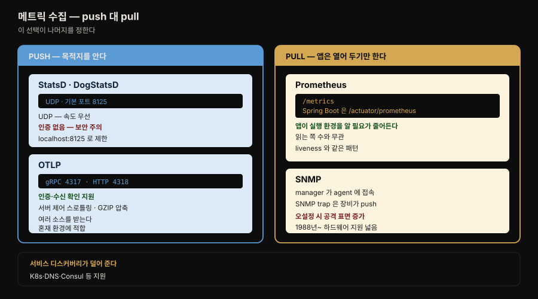

# 메트릭 — Mimir 와 Prometheus

---


## 핵심 요약

> 이 장은 네 덩어리입니다. PromQL 소개, 수집 프로토콜 비교, 저장 아키텍처(Graphite → Prometheus → Mimir), 그리고 exemplar 입니다.
>
> 이 저장소 기준으로 보면 **앞 절반은 이미 더 깊게 정리돼 있고 뒤 절반이 새롭습니다.** PromQL 문법과 TSDB 블록 구조는 형제 폴더 `mastering_prometheus` 가 장 하나씩을 통째로 썼고, Mimir 는 카테고리 노트가 3.0 기준으로 다룹니다. 그래서 이 노트는 그쪽으로 위임하고 **이 장에만 있는 것** 에 무게를 둡니다.
>
> 남는 것이 셋입니다. 프로토콜 넷을 **push·pull 축으로 갈라 보안·설정 부담까지 비교** 한 절, Graphite 의 Whisper 가 왜 한계에 부딪혔고 그것이 Prometheus 를 낳았다는 **계보**, 그리고 exemplar 를 Grafana UI 에서 실제로 켜고 Tempo 로 건너가는 **조작 경로** 입니다.

이 장은 저자들 자신이 "PromQL 을 소개한다"고 밝힌 입문 성격입니다. 같은 언어를 다루는 [`mastering_prometheus/03-04`](../mastering_prometheus/03-04.PromQL%20기초.md) 는 staleness·서브쿼리·`_info` 조인까지 들어가므로, PromQL 을 제대로 익히려면 그 편이 정본입니다.


## 학습 목표

> 이 장을 읽고 나면 아래 다섯 가지를 스스로 해낼 수 있습니다.

1. 메트릭·시계열·샘플의 관계를 `__name__` 과 라벨을 근거로 구분할 수 있습니다.
2. push 프로토콜과 pull 프로토콜의 차이가 설정·인증·확장에 어떤 영향을 주는지 설명할 수 있습니다.
3. StatsD·OTLP·Prometheus 와 SNMP 를 상황에 맞게 고를 수 있습니다.
4. Graphite·Prometheus·Mimir 의 저장 구조를 한 계보로 잇고 각 단계가 무엇을 해결했는지 말할 수 있습니다.
5. exemplar 가 무엇을 잇는지 설명하고 Grafana 에서 켜는 경로를 말할 수 있습니다.


## 1. 데이터 구조 — 무엇이 무엇을 만드는가

> 라벨이 메트릭·시계열·샘플 세 층을 만듭니다. 이 장이 PromQL 에 들어가기 전에 세우는 전제입니다.

Prometheus 는 2012년 SoundCloud 가 처음 개발했고, **2016년 CNCF 가 쿠버네티스에 이어 두 번째 인큐베이팅 프로젝트로** 받아들였으며 그 직후 1.0 이 나왔습니다.

Prometheus 호환 시스템은 **타임스탬프·키-값 라벨·샘플 값** 을 받습니다. 라벨이 만들어 내는 것이 셋입니다.

| 무엇이 | 무엇을 만드는가 |
|--------|----------------|
| 고유한 `__name__` 값 하나 | **메트릭** 하나 |
| 고유한 라벨 집합 하나 | **시계열** 하나 |
| 시간이 흐르며 쌓이는 값들 | 각기 다른 타임스탬프를 가진 **샘플** 여럿 |

메트릭 라벨의 고유값 개수를 **카디널리티** 라 부르며, 저자들은 **카디널리티가 높은 라벨은 메트릭의 저장 비용을 크게 올리므로 피해야 한다** 고 적습니다. [4장](04-01.Loki%20와%20LogQL%20—%20파이프라인·메트릭%20쿼리·아키텍처.md) 에서 본 Loki 의 스트림 폭증과 같은 구조가 메트릭 쪽에도 있는 셈입니다.

> 이 3층 구조를 `HELP`·`TYPE` 메타데이터까지 포함해 더 파고든 것이 [`mastering_prometheus/03-01`](../mastering_prometheus/03-01.데이터%20모델.md) 입니다.

### PromQL 은 이 장에서 어디까지 다루는가

저자들은 데이터 타입 셋(순간 벡터·범위 벡터·스칼라), 선택 연산자 다섯(메트릭 셀렉터·범위 셀렉터·라벨 셀렉터·`offset`·`@`), 데이터셋 결합 연산자, 함수 약 60개의 존재를 소개하고, 실제 쿼리 두 개를 만들어 봅니다.

이 가운데 실무에서 바로 쓸 만한 조각 셋만 옮겨 둡니다.

**범위 벡터 쿼리는 Instant 로 실행해야 합니다.** 저자들이 명시하는 Grafana 사용상의 제약입니다. 쿼리 타입을 `Range` 나 기본값 `Both` 로 두면 **오류가 납니다.**

**`__name__` 은 특별한 라벨입니다.** 검색 시 대안으로 쓸 수 있어 `metric_name{}` 과 `{__name__="metric_name"}` 이 동등합니다.

**`$__rate_interval` 은 Grafana 기능입니다.** PromQL 문법이 아니라, 선택한 데이터 소스의 스크레이프 주기에 맞춰 Grafana 가 적절한 구간을 고르게 하는 변수입니다. rate 구간을 손으로 정하는 기술적 부담을 덜어 줍니다.

```promql
# HTTP 성공률 SLI — 2xx 응답을 전체 요청으로 나눕니다
sum by (instance) (rate(app_frontend_requests_total{status=~"2[0-9]{2}"}[5m]))
/
sum by (instance) (rate(app_frontend_requests[5m]))
```

저자들의 해설에서 눈여겨볼 것은 **왜 `sum by (instance)` 인가** 입니다. method·target 같은 라벨에는 관심이 없고, **특정 인스턴스가 실패하고 있는지** 를 알고 싶기 때문입니다. 실패하는 인스턴스 하나가 정상 인스턴스 여럿에 가려질 수 있어서입니다. 결과는 대부분 성공이면 1 에 가깝고 실패가 늘수록 0 쪽으로 내려갑니다.

```promql
# 95 분위수 응답 시간 — _bucket 접미사가 히스토그램의 표식입니다
histogram_quantile(
  0.95, sum(rate(http_server_duration_milliseconds_bucket{}[$__rate_interval])) by (le)
)
```

`le`(less than or equal to) 라벨로 계산하며, 저자들은 **평균을 쓰고 싶어질 수 있지만 분위수가 데이터를 더 세밀하게 이해하게 해 준다** 고 덧붙입니다. 95 분위수는 표본의 95% 가 그 값 이하라는 뜻입니다.

> 벡터 매칭(`on`·`ignoring`·`group_left`), 논리 연산자(`and`·`or`·`unless`), staleness, 서브쿼리는 [`mastering_prometheus/03-04`](../mastering_prometheus/03-04.PromQL%20기초.md) 가 정본입니다. 그 편은 `_info` 메트릭의 값이 항상 1 이라 곱셈을 조인 수단으로 안전하게 쓸 수 있다는 데까지 들어갑니다.


## 2. 수집 프로토콜 — push 냐 pull 이냐

> 이 장의 고유 기여입니다. [2장](02-01.계측%20—%20로그%20형식·메트릭%20타입·트레이싱%20프로토콜·인프라%20표준.md) 이 프로토콜별 지원 타입을 표로 늘어놓았다면, 여기서는 수집 방식·보안·설정 부담으로 비교합니다.

원문이 세는 방식을 먼저 맞춰 둡니다. 저자들은 [2장](02-01.계측%20—%20로그%20형식·메트릭%20타입·트레이싱%20프로토콜·인프라%20표준.md) 에서 소개한 **공통 프로토콜 넷**을 `StatsD 와 DogStatsD`·`OTLP`·`Prometheus` 로 묶고, **SNMP 는 네트워킹·컴퓨트 영역용으로 따로** 소개했다고 적습니다. 아래에서는 이 넷과 SNMP 를 함께 다룹니다.

두 방식의 정의는 간단합니다. **push 는 애플리케이션·인프라에 보낼 목적지를 설정** 해야 하고, **pull 은 다른 서비스가 요청할 수 있도록 메트릭을 노출** 하도록 설정합니다. 저자들은 둘 다 장단점이 있으며 **잠재적 보안 함의를 아는 것이 중요** 하다고 짚습니다.



### StatsD·DogStatsD — 속도를 택하고 보장을 내줌

StatsD 는 push 이며 기본 설정에서 **UDP 8125 포트** 를 씁니다. 고려할 점이 둘입니다.

- **UDP 를 쓰므로 전달 보장보다 전송 속도를 우선** 합니다.
- **애플리케이션과 수신 서비스 사이의 인증을 지원하지 않습니다.** 환경에 따라 보안 문제가 될 수 있습니다.

⚠️ 저자들이 실무 관행을 하나 적어 둡니다. **특히 쿠버네티스에서는 StatsD 수신기를 `localhost:8125` 에 노출** 하는 것이 일반적입니다. 노출 범위를 제한하면서 애플리케이션이 쓸 표준을 제공하는 방법입니다.

지원 폭은 넓습니다. OTel Collector·FluentBit·Vector·Beats·Telegraf·StatsD 데몬이 모두 지원하며, Prometheus 는 StatsD 형식을 받아 스크레이프 엔드포인트로 노출하는 exporter 를 제공합니다. 저자들은 이것을 **Prometheus 로 완전히 옮겨 가는 중간 단계로 권장** 합니다.

DogStatsD 는 파생된 StatsD 보다 지원이 좁습니다. 네이티브 지원은 **Vector 와 Datadog 자체 에이전트** 뿐이고, **OTel Collector 는 현재 지원이 없으나** 추가 논의가 진행 중이며 Datadog 이 OpenTelemetry 프로젝트에 적극 참여하므로 바뀔 가능성이 큽니다.

### OTLP — 인증과 수신 확인이 있음

OTLP 도 push 라 목적지를 알아야 합니다. StatsD 처럼 표준 수신 엔드포인트를 흔히 씁니다.

- **`localhost:4317`** — gRPC
- **`localhost:4318`** — HTTP

두 전송 방식을 모두 지원하며 **클라이언트-서버 간 인증과 수신 확인(acknowledgment)** 을 제공합니다. 서버 제어 스로틀링과 GZIP 압축 같은 편의 기능도 있습니다.

저자들이 덧붙이는 판단이 실무에 유용합니다. 다른 수집 도구들이 OTLP 입력을 지원하지 않는 데 반해 **OTel Collector 는 여러 소스의 입력을 지원** 하므로, **혼재된 환경(mixed estate)을 받치기에 이상적** 입니다. Vector 도 같은 다재다능함을 제공합니다.

### Prometheus — pull 이 설정을 오히려 줄임

Prometheus 는 pull 입니다. 클라이언트가 엔드포인트로 메트릭을 제공하도록 설정하면, Prometheus 호환 스크레이퍼가 정해진 주기로 수집합니다. 보통 **`/metrics`** 에 노출하지만 프레임워크마다 다릅니다. 저자들이 든 예가 **Spring Boot 의 `/actuator/prometheus`** 입니다.

pull 이 설정 단계를 늘리는 것처럼 보이지만 저자들의 반론이 설득력 있습니다. **pull 은 애플리케이션이 자기 실행 환경에 대해 알아야 할 정보를 줄입니다.** 메트릭을 읽는 클라이언트가 0개든 10개든 애플리케이션 설정은 그대로입니다.

저자들은 이 패턴이 **쿠버네티스의 liveness·readiness 엔드포인트 패턴과 닮았다** 고 덧붙입니다. 앱은 상태를 열어 두고, 확인하는 쪽이 주기적으로 찾아온다는 구조가 같습니다.

서버 쪽 설정은 서비스 디스커버리가 돕습니다. 쿠버네티스·DNS·Consul 등 여러 플랫폼을 지원하며, 특정 이름 매칭이나 **라벨이 있을 때만 수집** 하는 옵션까지 있어 복잡한 아키텍처도 가능합니다.

수집기 지원도 넓습니다. Prometheus·OTel Collector·Grafana Agent·Vector·Beats·Telegraf 가 모두 이 형식을 수집합니다.

### SNMP — 감시는 pull, trap 은 push

SNMP 는 다른 것들보다 복잡합니다. 스위치·물리 서버 같은 네트워크 연결 장비의 관리·감시 기능을 많이 포함하기 때문입니다.

구조가 양방향인 점이 특징입니다. **감시 측면은 pull** 이며 manager 인스턴스가 장비의 agent 소프트웨어에 접속해 데이터를 당겨 옵니다. 반면 **SNMP trap 은 장비가 manager 에게 알리는 push** 이며, 저자들은 이 trap 이 메트릭으로 추적할 만한 관심 대상인 경우가 많다고 적습니다.

⚠️ 보안 경고가 붙습니다. 설정 방식에 따라 우려가 될 수 있으며 **잘못 설정하면 상당한 공격 표면(significant attack surface)을 제공** 합니다.

1988년부터 활발히 쓰였고 하드웨어 벤더 지원이 좋습니다.


## 3. 저장 아키텍처의 계보

> Graphite 의 한계가 Prometheus 를 낳고, Prometheus 의 한계가 Mimir 를 낳았습니다. 이 장은 그 인과를 한 줄로 잇습니다.

### Graphite — 시계열 하나가 파일 하나

Graphite 의 저장 컴포넌트는 **Whisper** 입니다. **평면 파일 구조** 를 쓰며 **고유한 시계열 하나가 고정 크기 파일 하나** 입니다. 크기는 Whisper 에 설정한 해상도와 보존 기간이 정합니다.

여기서 두 한계가 나옵니다.

- **검색을 위해 데이터를 모으려면 이 파일들을 각각 읽어야 하고, 디스크 I/O 비용이 빠르게 커집니다.**
- **데이터 중복성을 관리하는 내장 장치가 없어** 기록된 데이터가 손실·손상으로부터 보호된다고 보장하지 못합니다.

2008년에 나온 이른 사례이며, **여기서 온 질의 속도와 데이터 무결성의 한계가 Prometheus 의 탄생으로 이어졌습니다.** 다만 Graphite 가 도입한 쓰기 프로토콜은 낡았어도 여전히 유효해서, Grafana Cloud 는 이 기술을 이미 쓰는 팀을 위해 Graphite 수집·질의 엔드포인트를 제공합니다.

### Prometheus — 불변 블록과 head 블록

Prometheus 는 데이터를 **불변 블록(immutable block)** 에 저장하며 블록 하나가 **기본 2시간** 의 고정 시간 범위를 덮습니다. 블록 안에는 **512 MB 상한** 의 chunk 여럿이 있고 여기에 샘플 값이 들어갑니다. 그 옆에 메타데이터 파일 둘이 놓입니다.

| 파일 | 담는 것 |
|------|--------|
| **index** | 블록에 담긴 라벨과, 그 라벨을 가진 모든 샘플의 chunk 내 위치 참조 |
| **meta.json** | 블록의 최소·최대 타임스탬프, 샘플·시리즈·chunk 통계, 사용 버전 |

⚠️ 카디널리티 경고가 여기서 다시 나옵니다. **카디널리티가 높은 메트릭 라벨은 index 파일 크기를 크게 키우고 읽기 성능을 떨어뜨립니다.**

받는 즉시 처리하기 위해 **head 블록** 을 함께 씁니다. 저장용 블록과 비슷하되 **쓰기가 가능** 합니다. 구성은 원본 데이터를 담는 **WAL** 과 무엇을 받았는지 기록하는 `meta.json` 입니다. 2시간이 차면 새 head 블록이 만들어지고 **옛 head 블록은 index 와 chunk 를 만들며 표준 블록으로 바뀝니다.**

한계는 분명합니다. **Prometheus 자체의 TSDB 구현은 로컬 스토리지를 쓰며 네이티브로 클러스터링·복제되지 않습니다.** 개선의 여지는 있으나 **읽기와 쓰기를 단일 노드가 수행한다는 근본 제약** 이 남습니다. 저자들은 적절한 상황에서는 이 제약이 전혀 문제없다고 균형을 잡되, **활성 시계열이 많아지도록 확장할 때는 변화가 필요** 하다고 정리합니다.

> 블록·chunk·역색인·mmap 을 내부까지 파고든 것은 [`mastering_prometheus/03-03`](../mastering_prometheus/03-03.TSDB%20저장%20구조.md), 쓰기 경로는 [`03-02`](../mastering_prometheus/03-02.TSDB%20쓰기%20경로.md) 입니다.

### Mimir — 같은 구조를 오브젝트 스토리지 위로

Mimir 는 **같은 근본 TSDB 저장 구조를 씁니다.** 다른 점은 **오브젝트 스토어를 블록 파일 저장소로 네이티브 지원** 한다는 것입니다. Amazon S3·Google Cloud Storage·Microsoft Azure Storage·OpenStack Swift 를 지원합니다.

확장 방식이 쓰기와 읽기 양쪽으로 갈립니다.

**쓰기** — 오브젝트 스토리지가 대규모 확장이 가능하므로, **데이터 수집 서비스의 인스턴스를 새로 추가** 하는 것으로 Prometheus 의 확장 문제를 다룹니다. 들어오는 스트림을 **테넌트별 TSDB 로 분리** 하고 각각을 ingester 인스턴스에 할당합니다. Prometheus 처럼 ingester 가 메모리와 WAL 에 쓰고 블록이 완성되면 오브젝트 스토리지로 넘깁니다. **복원력을 위해 각 스트림을 여러 ingester 에 쓰고**, compactor 서비스가 오브젝트 스토리지의 중복 블록을 병합하고 중복 샘플을 제거합니다.

**읽기** — 들어온 쿼리를 **더 짧은 시간 범위로 쪼개** 여러 querier 인스턴스에 분산합니다. 이렇게 해서 다시 오브젝트 스토리지의 이점을 살려 데이터를 빠르게 돌려받습니다.

> Mimir 를 VictoriaMetrics 와 나란히 놓고 비용·HA 중복 제거 방식까지 비교한 것은 [`mastering_prometheus/09-02`](../mastering_prometheus/09-02.VictoriaMetrics%20와%20Grafana%20Mimir.md), 배포와 3.0 변경사항은 [02-05. Grafana Mimir](../../02_LGTMStack/02-05.Grafana%20Mimir.md) 입니다.


## 4. exemplar — 집계에서 단일 요청으로

> 메트릭은 집계된 값을 보여줍니다. exemplar 는 그 값이 이상할 때 표본 하나를 꺼내 보게 해 줍니다.

저자들의 정의가 간결합니다. **exemplar 는 메트릭이 주는 시스템의 집계된 관점에서 트레이스가 주는 단일 요청의 상세한 관점으로 건너뛰게 하는 기능** 입니다.

전제 조건이 하나 붙습니다. **exemplar 는 수집 계층에서 설정되고 저장 계층으로 전송되어야 합니다.** 쿼리 시점에 켜는 것이 아니라 파이프라인이 이미 실어 보내고 있어야 한다는 뜻입니다.

Grafana 에서 보는 경로는 이렇습니다.

1. 쿼리 아래 **Options** 를 열고 **Exemplars** 슬라이더를 켭니다.
2. exemplar 가 메트릭 차트에 **별(star) 모양** 으로 나타납니다.
3. 개별 exemplar 에 마우스를 올리면 트레이스 정보가 메트릭 뷰 안에서 펼쳐집니다. 저자들이 주목할 필드로 꼽는 것은 **프로세스 런타임의 이름과 버전, 그리고 `span_id`** 이며, 순수한 메트릭 뷰에서는 보통 볼 수 없는 값들입니다.
4. **Query with Tempo** 버튼으로 그 트레이스로 건너갑니다.

앞 장들에서 개념으로만 나왔던 exemplar 가 여기서 실제 조작으로 내려옵니다. 2장이 "메트릭과 트레이스를 상관짓는 능력"이라고 소개했고, 3장에서 슬라이더의 존재를 봤습니다. 이 장은 그 위에 무엇이 실려 오는지까지 확인합니다.


## 책 밖으로 잇기

> 이 장의 서술 가운데 지금 확인이 필요하거나 다른 편이 더 잘 다루는 지점만 적습니다.

**PromQL 함수 개수는 시점 값입니다.** 원문은 "약 60개" 라고 적고 공식 문서를 안내합니다. 형제 폴더의 [`03-04`](../mastering_prometheus/03-04.PromQL%20기초.md) 는 다른 책을 근거로 70개라고 적습니다. 두 숫자가 다른 것은 집필 시점 차이이며, 정확한 목록은 [Prometheus 함수 문서](https://prometheus.io/docs/prometheus/latest/querying/functions/)가 정본입니다. 이 노트는 어느 쪽 숫자도 현재값으로 쓰지 않습니다.

**DogStatsD 의 OTel Collector 지원은 바뀌었을 수 있습니다.** 원문이 "현재 지원 없음, 논의 진행 중, 바뀔 가능성이 크다"고 명시적으로 유동적이라 적은 항목입니다. 실제로 구성할 때는 Collector 의 현재 receiver 목록을 확인해야 합니다.

**Graphite 를 지금 새로 고를 이유는 거의 없습니다.** 원문도 이미 Graphite 를 *역사* 로 서술하며, Grafana Cloud 의 지원 이유를 "이미 쓰는 팀"으로 한정합니다. 이 절의 값은 도구 선택이 아니라 **왜 다음 세대가 나왔는지의 인과** 에 있습니다.

**Spring Boot 의 엔드포인트 표기.** 원문은 `/actuator/Prometheus` 로 대문자 P 를 썼는데, 실제 경로는 소문자 `/actuator/prometheus` 입니다. 원문의 단순 오타로 보이며, 이 노트에서는 바로잡아 적었습니다.


## 결정 치트시트

> 이 장이 남기는 판단 기준을 표로 압축합니다.

| 상황 | 선택 | 이유 |
|------|------|------|
| 전송 실패를 감수하더라도 빨라야 함 | StatsD | UDP 라 보장보다 속도 |
| 인증이 필요함 | OTLP 또는 Prometheus | StatsD 는 인증 미지원 |
| 여러 형식이 섞인 환경 | OTel Collector(또는 Vector) | 여러 소스 입력을 받아 혼재 환경에 적합 |
| StatsD 에서 Prometheus 로 옮기는 중 | Prometheus StatsD exporter | 저자들이 권하는 중간 단계 |
| 앱이 실행 환경을 덜 알게 하고 싶음 | pull(Prometheus) | 읽는 쪽 수가 변해도 앱 설정 불변 |
| 쿠버네티스 환경 | pull | liveness·readiness 패턴과 일치 |
| 쿠버네티스에서 StatsD 를 써야 함 | `localhost:8125` 로 노출 | 노출 범위 제한 + 앱이 쓸 표준 제공 |
| 네트워크 장비 감시 | SNMP | 단 설정을 틀리면 공격 표면이 커짐 |
| 범위 벡터 쿼리가 오류남 | 쿼리 타입을 Instant 로 | Range·Both 는 오류 |
| rate 구간을 정하기 어려움 | `$__rate_interval` | Grafana 가 스크레이프 주기에 맞춰 고름 |
| 인스턴스별 실패를 보고 싶음 | `sum by (instance)` | 실패 인스턴스가 정상 다수에 가려짐 |
| 응답 시간을 대표값으로 요약 | 평균보다 분위수 | 분위수가 데이터를 더 세밀하게 드러냄 |
| 단일 노드 한계에 부딪힘 | Mimir | 오브젝트 스토리지 + ingester 수평 확장 |
| 메트릭 값이 이상해 원인을 봐야 함 | exemplar → Tempo | 집계에서 단일 요청으로 건너뜀 |
| exemplar 가 안 보임 | 수집 계층 설정부터 확인 | 쿼리에서 켜는 게 아니라 실려 와야 함 |


## Spring 앱 개발 관점

> 이 장에서 Spring 이 직접 언급되는 곳은 `/actuator/prometheus` 한 줄입니다. 아래는 그 한 줄이 함의하는 바를 정리한 것이며 책 밖의 내용입니다.

저자들이 Prometheus 절에서 "프레임워크마다 엔드포인트가 다르다"는 예로 Spring Boot 를 든 것은 정확합니다. Micrometer 의 Prometheus 레지스트리는 관례적인 `/metrics` 가 아니라 Actuator 경로 아래로 붙습니다.

이 장의 push·pull 대비를 Spring 관점으로 옮기면 선택이 이렇게 갈립니다.

| 방식 | Spring 쪽 구성 | 이 장의 논리대로면 |
|------|---------------|-------------------|
| **pull** | `micrometer-registry-prometheus` + Actuator 노출 | 앱은 목적지를 모르고 열어 두기만 함 |
| **push** | `micrometer-registry-otlp` + 엔드포인트 지정 | 앱이 Collector 주소를 알아야 함 |

[2장 노트](02-01.계측%20—%20로그%20형식·메트릭%20타입·트레이싱%20프로토콜·인프라%20표준.md) §책 밖으로 잇기 에서 확인했듯, 원서 2장이 "Spring Boot 3 부터 Micrometer 의 기본 exporter 는 OTLP" 라고 적은 것은 조심해서 읽어야 합니다. 실제로는 **클래스패스에 있는 레지스트리 의존성이 결정** 하므로, 위 표의 둘 중 무엇을 넣었는지가 곧 push·pull 선택이 됩니다.

exemplar 를 쓰려면 조건이 더 붙습니다. 이 장이 "수집 계층에서 설정되어야 한다"고 한 것이 Spring 에서는 **Micrometer Tracing 이 붙어 있어야 `SpanContext` 가 생긴다** 는 뜻으로 내려옵니다. 트레이싱 없이 메트릭만 있는 앱에서는 exemplar 슬라이더를 켜도 별이 뜨지 않습니다. 근거는 [`mastering_prometheus/01-01`](../mastering_prometheus/01-01.관측%20가능성·모니터링·Prometheus의%20자리.md) §책 밖으로 잇기 에 정리돼 있습니다.


## 면접에서 받을 만한 질문

> 아래 질문에 **먼저 스스로 답해 보세요.** 자답이 끝나면 이어지는 §정답 (자답 후 펼치기) 으로 내려갑니다.

1. 메트릭·시계열·샘플은 각각 무엇이 만듭니까?
2. push 와 pull 의 차이를 설명하고, pull 이 오히려 설정을 줄인다는 주장의 근거를 대 보세요.
3. StatsD 를 쓸 때 고려해야 할 두 가지는 무엇입니까?
4. Graphite 의 Whisper 가 가진 두 한계는 무엇이며 그것이 무엇을 낳았습니까?
5. Prometheus 의 head 블록은 일반 블록과 무엇이 다릅니까?
6. Prometheus TSDB 의 근본 제약은 무엇이고 Mimir 는 그것을 어떻게 풉니까?
7. exemplar 를 쓰려면 무엇이 선행되어야 합니까?


## 정답 (자답 후 펼치기)

> 위 §면접에서 받을 만한 질문 의 7개에 *먼저 자답한 뒤* 아래를 읽으세요. 자답 없이 먼저 읽으면 학습 효과가 0 입니다. 질문 번호와 1:1 로 대응합니다.

### 정답 1 — 세 층을 만드는 것

- **메트릭** — 고유한 `__name__` 값 하나가 만듭니다.
- **시계열** — 고유한 라벨 집합 하나가 만듭니다.
- **샘플** — 한 시계열 안에서 타임스탬프마다 쌓이는 값들입니다.

라벨의 고유값 개수가 **카디널리티** 이며, 높으면 저장 비용이 크게 오릅니다.

### 정답 2 — push 와 pull

**push** 는 애플리케이션이 보낼 목적지를 설정해야 하고, **pull** 은 다른 서비스가 요청할 수 있도록 노출만 하면 됩니다.

pull 이 설정을 줄인다는 근거는 **애플리케이션이 자기 실행 환경에 대해 알아야 할 정보가 줄어든다** 는 점입니다. 메트릭을 읽는 클라이언트가 0개든 10개든 앱 설정은 그대로입니다. 쿠버네티스의 liveness·readiness 패턴과도 같은 모양입니다.

### 정답 3 — StatsD 의 두 고려사항

1. **UDP 를 쓰므로 전달 보장보다 속도를 우선** 합니다.
2. **애플리케이션과 수신 서비스 사이의 인증을 지원하지 않습니다.**

그래서 쿠버네티스에서는 수신기를 `localhost:8125` 에 노출해 범위를 제한하는 것이 관행입니다.

### 정답 4 — Whisper 의 두 한계

1. **고유 시계열 하나가 고정 크기 파일 하나** 이므로, 검색하려면 파일들을 각각 읽어야 하고 **디스크 I/O 비용이 빠르게 커집니다.**
2. **데이터 중복성을 관리하는 내장 장치가 없어** 손실·손상으로부터의 보호를 보장하지 못합니다.

이 **질의 속도와 데이터 무결성의 한계가 Prometheus 의 탄생으로 이어졌습니다.**

### 정답 5 — head 블록의 차이

**쓰기가 가능하다** 는 점입니다. 일반 블록은 불변입니다.

head 블록은 원본 데이터를 담는 **WAL** 과 무엇을 받았는지 기록하는 `meta.json` 으로 구성되며, 2시간이 차면 새 head 블록이 만들어지고 옛 head 블록은 index 와 chunk 를 만들며 표준 블록으로 바뀝니다.

### 정답 6 — 제약과 해법

**제약** 은 Prometheus 의 TSDB 구현이 로컬 스토리지를 쓰고 네이티브로 클러스터링·복제되지 않는다는 것이며, 근본적으로 **읽기와 쓰기를 단일 노드가 수행** 합니다.

**Mimir 의 해법** 은 같은 TSDB 구조를 유지하되 오브젝트 스토어를 네이티브 지원하는 것입니다. 쓰기는 수집 서비스 인스턴스를 추가해 확장하고 테넌트별 TSDB 로 분리하며, 복원력을 위해 여러 ingester 에 쓰고 compactor 가 중복을 정리합니다. 읽기는 쿼리를 짧은 시간 범위로 쪼개 여러 querier 에 분산합니다.

### 정답 7 — exemplar 의 선행 조건

**수집 계층에서 설정되어 저장 계층으로 전송되어야 합니다.** 쿼리 화면의 슬라이더는 이미 실려 온 것을 보여줄 뿐이므로, 파이프라인이 exemplar 를 싣고 있지 않으면 켜도 아무것도 나오지 않습니다.


## 핵심 개념 체크리스트

> 위 §정답 을 덮고, 각 항목을 소리 내어 설명할 수 있는지 점검합니다. 막히는 자리가 이 장의 재학습 지점입니다.

- [ ] 메트릭·시계열·샘플을 만드는 것이 각각 무엇인지 말할 수 있는가?
- [ ] 카디널리티가 저장 비용과 index 크기에 미치는 영향을 설명할 수 있는가?
- [ ] 범위 벡터 쿼리를 Instant 로 실행해야 하는 제약을 아는가?
- [ ] `$__rate_interval` 이 PromQL 문법이 아니라 Grafana 기능임을 아는가?
- [ ] 성공률 SLI 쿼리에서 `sum by (instance)` 를 쓰는 이유를 말할 수 있는가?
- [ ] push 와 pull 의 차이, 그리고 pull 이 설정을 줄인다는 논리를 설명할 수 있는가?
- [ ] StatsD 의 포트·전송 방식·인증 부재를 아는가?
- [ ] OTLP 가 StatsD 대비 갖는 이점 둘을 댈 수 있는가?
- [ ] SNMP 가 pull 과 push 를 어떻게 나눠 갖는지 아는가?
- [ ] Whisper 의 파일 구조가 만든 두 한계를 말할 수 있는가?
- [ ] Prometheus 블록의 기본 시간 범위와 chunk 상한을 아는가?
- [ ] index 와 meta.json 이 각각 무엇을 담는지 구분할 수 있는가?
- [ ] head 블록이 일반 블록과 다른 점과 전환 과정을 설명할 수 있는가?
- [ ] Mimir 가 쓰기와 읽기를 각각 어떻게 확장하는지 말할 수 있는가?
- [ ] exemplar 가 무엇을 잇고 무엇이 선행되어야 하는지 아는가?


## 참고 자료

> 원서 5장과, 본문의 사실을 대조한 1차 자료 목록입니다.

- 원본: *Observability with Grafana* (Packt, ISBN 9781803248004) 5장 — Monitoring with Metrics Using Grafana Mimir and Prometheus.
- [Prometheus 함수 문서](https://prometheus.io/docs/prometheus/latest/querying/functions/) — 원문이 안내한 정본. 함수 개수는 시점마다 다름
- 책의 예제 저장소: [PacktPublishing/Observability-with-Grafana](https://github.com/PacktPublishing/Observability-with-Grafana) — `chapter5` 에 메트릭 라벨을 늘린 Collector 설정


## 관련 문서

> 이 편은 수집 프로토콜과 저장 계보에 무게를 둡니다. PromQL 문법과 TSDB 내부, Mimir 운영은 모두 다른 편이 정본입니다.

- [README (책 MOC)](README.md) — 《Observability with Grafana》 15장 전체 지도
- [04-01. Loki 와 LogQL](04-01.Loki%20와%20LogQL%20—%20파이프라인·메트릭%20쿼리·아키텍처.md) — 앞 편. LogQL 이 PromQL 에서 무엇을 빌려 왔는지 대조하면 좋음
- [mastering_prometheus 03-04. PromQL 기초](../mastering_prometheus/03-04.PromQL%20기초.md) — **PromQL 정본**. 벡터 매칭·staleness·서브쿼리까지
- [mastering_prometheus 03-03. TSDB 저장 구조](../mastering_prometheus/03-03.TSDB%20저장%20구조.md) — §3 블록·chunk·index 의 내부
- [mastering_prometheus 09-02. VictoriaMetrics 와 Grafana Mimir](../mastering_prometheus/09-02.VictoriaMetrics%20와%20Grafana%20Mimir.md) — §3 Mimir 를 경쟁 제품과 비교
- [02-05. Grafana Mimir](../../02_LGTMStack/02-05.Grafana%20Mimir.md) — Mimir 배포와 3.0 변경사항
