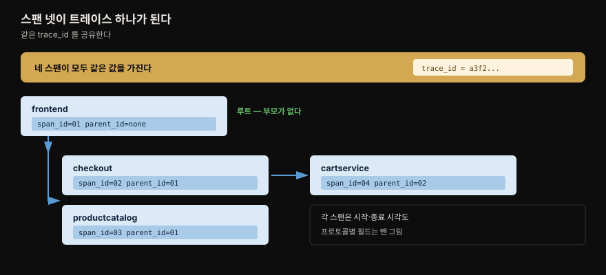
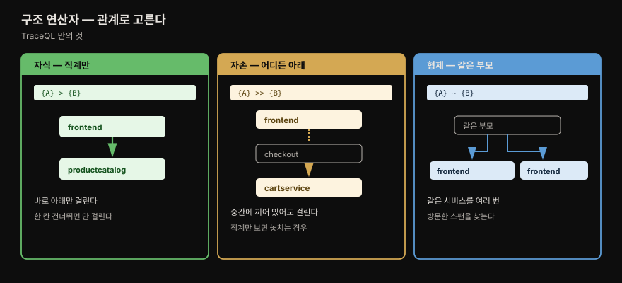
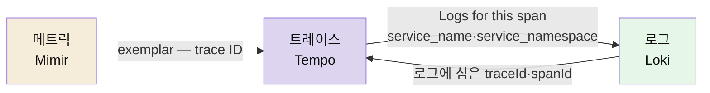
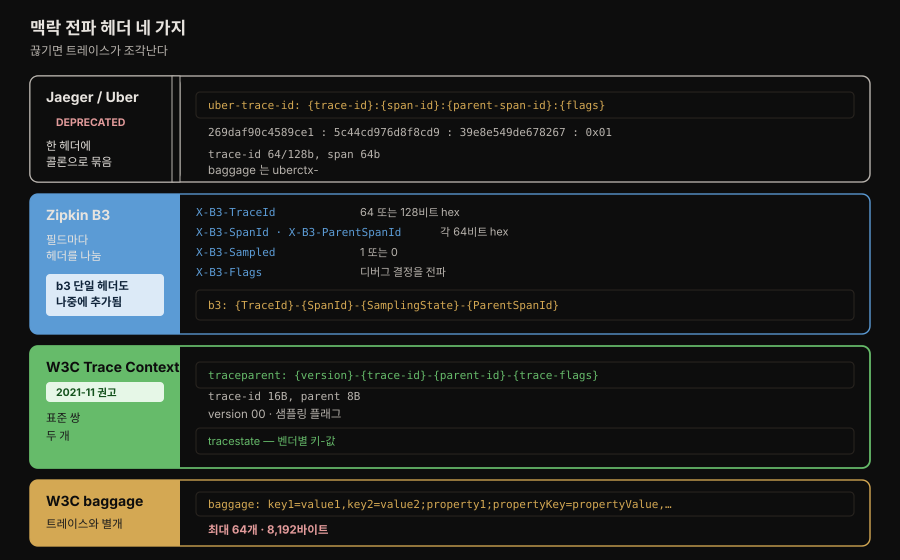
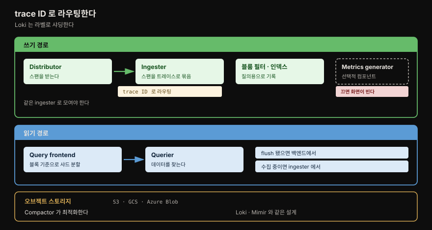

# Tempo 와 TraceQL

---


## 핵심 요약

> 이 장은 셋으로 나뉩니다. TraceQL 소개, 트레이싱 프로토콜과 **전파 헤더**, 그리고 Tempo 아키텍처입니다.
>
> 이 저장소 기준으로 가장 새로운 것은 가운데입니다. [02-04. Grafana Tempo](../../02_LGTMStack/02-04.Grafana%20Tempo.md) 와 [03-08. Tempo 분산 트레이싱 시각화](../../03_Project/03-08.Tempo%20분산%20트레이싱%20시각화.md) 가 Tempo 내부 구조와 TraceQL 활용을 이미 다루고, 03_Project 의 여러 편이 `traceparent` 를 *쓰지만*, **헤더의 형식 자체를 규격 수준으로 적어 둔 편은 없습니다.**
>
> 그래서 이 노트는 전파 헤더 네 형식(Jaeger·B3·W3C Trace Context·baggage)의 필드 구성과, TraceQL 에만 있는 **구조 연산자**(부모·자식·형제 관계로 스팬을 찾는 문법)에 무게를 둡니다.

⚠️ **이 장은 TraceQL 의 한계를 스스로 밝힙니다.** 저자들은 집필 시점 Tempo **v2.3.x** 기준으로 **선택은 되지만 분석 기능은 없다** 고 적습니다. LogQL·PromQL 과 나란히 놓으면 성숙도가 다르다는 뜻이며, 이후 버전에서 달라졌을 수 있으니 §책 밖으로 잇기 를 함께 봅니다.


## 학습 목표

> 이 장을 읽고 나면 아래 다섯 가지를 스스로 해낼 수 있습니다.

1. 트레이스의 기본 필드 넷을 대고 스팬들이 어떻게 하나의 트레이스로 묶이는지 설명할 수 있습니다.
2. TraceQL 의 intrinsic 필드와 attribute 필드를 구분하고, span·resource 접두사를 왜 붙이는지 말할 수 있습니다.
3. 구조 연산자 셋(`>`·`>>`·`~`)의 차이를 예로 들어 설명할 수 있습니다.
4. 전파 헤더 네 형식의 차이를 말하고 지금 무엇을 골라야 하는지 판단할 수 있습니다.
5. Tempo 의 쓰기·읽기 경로 컴포넌트를 대고 각각의 역할을 말할 수 있습니다.


## 1. 트레이스의 구조

> 스팬 넷이 같은 `trace_id` 를 공유하고 `parent_id` 로 서로를 가리키며 하나의 트레이스가 됩니다.



[2장](02-01.계측%20—%20로그%20형식·메트릭%20타입·트레이싱%20프로토콜·인프라%20표준.md) 에서 트레이스의 공통 필드를 봤고, 이 장은 그 구조를 그림으로 다시 확인합니다. 스팬 넷이 든 예시에서 관계는 이렇게 성립합니다.

| 필드 | 역할 |
|------|------|
| `trace_id` | **트레이스 전체의 고유 식별자.** 네 스팬이 모두 같은 값을 가짐 |
| `span_id` | 각 스팬의 고유 식별자 |
| `parent_id` | **자기가 어디서 왔는지** 기록 |
| start·end time | 시작·종료 시각 |

저자들은 이 그림이 단순화된 것이며 **OTLP·Zipkin·Jaeger 가 맥락 정보를 담는 데 쓰는 여러 필드를 제외했다** 고 밝힙니다. 그 필드들이 §3 의 프로토콜 절에서 나옵니다.

트레이스는 **여러 애플리케이션에서 수집** 되며, 각 애플리케이션이 스팬을 수집 아키텍처로 보내고 최종적으로 Tempo 가 저장·질의합니다.


## 2. TraceQL — 선택은 되지만 분석은 아직

> 필드는 intrinsic 과 attribute 둘로 갈리고, TraceQL 만의 무기는 스팬 사이 **관계** 로 검색하는 구조 연산자입니다.

TraceQL 도 LogQL 처럼 PromQL 을 참고해 만들었고, 개발자와 운영자에게 익숙한 필터·집계·수학 도구를 제공합니다.

⚠️ 다만 저자들이 성숙도를 분명히 합니다. **현재는 트레이스 데이터를 *선택* 하는 능력만 제공하며, 선택 도구는 강력하지만 분석을 수행할 도구는 없습니다.** 그런 기능이 제품의 궁극적 목표이나 **집필 시점 v2.3.x 의 현재 상태** 를 밝혀 둔다고 적습니다.

> **원문 오타.** 이 대목의 원문은 "Currently, **PromQL** only offers the ability to select trace data" 로 PromQL 이라고 적혀 있습니다. 바로 앞 문장이 LogQL·PromQL 을 4·5장에서 소개했다고 말하고 뒷 문장이 Tempo v2.3.x 를 가리키므로 **TraceQL 의 오기** 로 읽는 것이 문맥상 맞습니다. 위 본문은 그렇게 읽어 옮겼습니다.

### 필드 두 종류

**intrinsic 필드** 는 스팬과 트레이스의 근본 정보이며 트레이스 뷰에 정보를 보여주는 데 쓰입니다.

| 필드 | 값 |
|------|-----|
| `status` | `error` · `ok` · `unset`(null) |
| `statusMessage` | 상태를 부연하는 선택적 텍스트 |
| `duration` | 스팬의 시작과 종료 사이 시간 |
| `name` | 연산 또는 스팬 이름 |
| `kind` | `server` · `client` · `producer` · `consumer` · `internal` · `unspecified`(폴백 값) |
| `traceDuration` | 트레이스 내 **모든 스팬**의 시작과 종료 사이 밀리초 |
| `rootName` | 트레이스 **첫 스팬**의 이름 |
| `rootServiceName` | 트레이스 **첫 서비스**의 이름 |

**attribute 필드** 는 애플리케이션이나 수집 도구가 스팬에 추가한 커스터마이즈 가능한 필드입니다. **OpenTelemetry 구현에서 유래한 구분** 으로 둘로 갈립니다.

- **span 속성** — 스팬을 제출하는 애플리케이션이 추가. `span.http.method`, `span.app.ads.ad_response_type`
- **resource 속성** — 텔레메트리를 만드는 **개체(entity)** 를 나타냄. `resource.container.id`, `resource.k8s.node.name`

⚠️ 성능 조언이 붙습니다. **효율적인 질의를 위해 속성 질의에는 항상 `span.` 과 `resource.` 를 포함하는 것이 모범 사례** 입니다. 다만 어느 쪽인지 확신이 없으면 **앞에 점 하나만 붙여** 질의할 수 있습니다(`.http.method`·`.k8s.node.name`).

### 선택 연산자와 구조 연산자



| 이름 | 문법 | 연산자 | 범위 |
|------|------|--------|------|
| 필드 셀렉터 | `{field = "value"}` | `=` `!=` `>` `>=` `<` `<=` `=~` `!~` | 필드 값으로 스팬 선택 |
| 필드 표현식 | `{field1="value1" && field2="value2"}` | `&&` `\|\|` | 여러 필드 값으로 선택 |
| 논리 연산자 | `{…} && {…}` | `&&` `\|\|` | 스팬 집합 사이 논리 검사가 참인 스팬 |
| **구조 연산자** | `{…} > {…}` | `>` `>>` `~` | 첫 필터와 **관계된** 스팬을 둘째 필터에서 찾음 |

마지막 행이 TraceQL 을 다른 두 언어와 가르는 지점입니다. **트레이스에서 조건이 상류(부모)나 하류(자식) 어디서 충족되는지를 고려한 질의** 를 가능하게 합니다.

```traceql
# > 자식 연산자 — 직계 자식
# frontend 가 바로 위 부모인 productcatalogservice 의 스팬
{.service.name="frontend"} > {.service.name="productcatalogservice"}

# >> 자손 연산자 — 중간에 다른 서비스를 거쳐도 됨
# frontend 가 트레이스 안 어딘가의 부모인 cartservice 의 스팬
{.service.name="frontend"} >> {.service.name="cartservice"}

# ~ 형제 연산자 — 같은 부모를 공유
# frontend 를 여러 번 방문한 스팬
{.service.name="frontend"} ~ {.service.name="frontend"}
```

`>>` 의 예시 설명이 이 연산자의 값을 잘 보여줍니다. cartservice 스팬을 찾되 **frontend 와 사이에 checkout 같은 다른 서비스가 끼어 있어도** 걸립니다. 직계만 보는 `>` 로는 놓치는 경우입니다.

### 집계와 산술

| 이름 | 문법 | 연산자 |
|------|------|--------|
| count 집계 | `\| count() > 10` | `count()` |
| 수치 집계 | `\| avg(duration) > 20ms` | `avg()` `max()` `min()` `sum()` |
| 산술 연산자 | `{field1 < field2 * 10}` | `+` `-` `*` `/` `^` |

저자들은 **TraceQL 이 활발히 개발 중이라 이 연산자 목록이 늘어날 것으로 예상된다** 고 덧붙입니다.

### 신호 사이를 건너뛰기

Tempo 질의 화면은 **Logs for this span** 링크를 제공해 Loki 질의를 엽니다. 이 기능은 트레이스의 **`service_name` 과 `service_namespace` 필드로 Loki 를 질의** 합니다.

반대 방향도 됩니다. 서비스가 로그 출력에 **트레이스 컨텍스트(`traceId`·`spanId`)를 주입** 하면 Loki 를 설정해 Tempo 트레이스 뷰로 이어지는 맥락 링크를 제공할 수 있습니다. 메트릭 쪽은 [5장](05-01.메트릭%20—%20수집%20프로토콜·저장%20아키텍처·exemplar.md) 의 exemplar 가 담당합니다.

세 신호가 서로를 가리키는 고리가 여기서 닫힙니다.



### 검색 모드와 서비스 그래프

Tempo 화면은 **질의 편집기(왼쪽)와 트레이스 뷰(오른쪽)** 로 나뉘며, 트레이스 뷰는 trace ID 나 span ID 를 클릭해야 열립니다. 결과 패널은 문맥에 따라 달라집니다. TraceQL 검색이면 매칭된 트레이스·스팬 목록이, 특정 trace ID 검색이면 트레이스 뷰가 나옵니다.

검색 모드가 여럿입니다.

- **Basic Search** — 드롭다운으로 고르는 방식. Tempo 를 처음 쓰는 사람이 데이터를 빨리 보는 데 유용하나, 저자들은 이 책에서 다루지 않으며 ⚠️ **Grafana 10.3 에서 폐기 예정** 이라고 밝힙니다.
- **TraceQL** — 기본 검색 모드.
- **Loki Search** — 트레이스·스팬 ID 를 담은 로그와 전체 트레이스 뷰 사이를 빠르게 오감.
- **JSON File** — JSON 으로 저장한 트레이스를 가져와 직접 봄. 내보내기 기능과 합치면 흥미로운 트레이스를 보존·공유할 수 있고, **내보낸 JSON 을 뜯어보는 것이 트레이싱의 기반 데이터 구조를 이해하는 좋은 연습** 이라고 권합니다.
- **Service Graph** — 서비스 사이 연결을 시각화합니다. 메트릭과 트레이스를 함께 활용하며 **오류 요청은 빨강, 성공 요청은 초록** 으로 표시합니다. 요청률과 평균 지연도 함께 보이고 그래프 위에는 **RED(Requests·Errors·Duration) 메트릭** 이 나옵니다.

> 서비스 그래프와 스팬 메트릭을 실제로 켜고 읽는 법은 [02-04. Grafana Tempo](../../02_LGTMStack/02-04.Grafana%20Tempo.md) §Service Graph와 Span Metrics 와 [03-08. Tempo 분산 트레이싱 시각화](../../03_Project/03-08.Tempo%20분산%20트레이싱%20시각화.md) 가 다룹니다.


## 3. 프로토콜과 전파 헤더

> 이 장의 고유 기여입니다. 트레이싱 프로토콜은 **계측된 애플리케이션이 HTTP 요청에 붙이는 헤더 집합** 이며, 그 헤더가 스팬 정보를 하류로 전파합니다.

저자들의 정의가 명료합니다. **트레이싱 프로토콜은 계측된 애플리케이션이 만드는 HTTP 요청에 추가되는 헤더 집합으로 이뤄집니다.** 이 헤더들이 개별 스팬의 정보를 하류 서비스로 전파하고, 그렇게 수집된 스팬들이 모여 완전한 분산 트레이스를 이룹니다.

### 프로토콜 셋

| 프로토콜 | 언어 지원 | 전파 헤더 | 수집기 지원 |
|----------|----------|----------|------------|
| **OTLP** | C++·.NET·Erlang·Go·Java·JavaScript·PHP·Python·Ruby·Rust·Swift | **W3C TraceContext·B3·Jaeger** 네이티브 + W3C baggage | OTel Collector · Grafana Agent · FluentBit(플러그인) · Telegraf(플러그인) |
| **Zipkin** | 지원 라이브러리: C#·Go·Java·JavaScript·Ruby·Scalar·PHP<br>커뮤니티: C++·C·Clojure·Elixir·Lua·Scala | **B3 만** 네이티브 | OTel Collector · Grafana Agent · Zipkin 자체 도구 |
| **Jaeger** | 2022년 1월 이전 SDK: Java·Python·Node.js·Go·C#·C++ | Jaeger·Zipkin·W3C TraceContext | 폭넓지 않았음. OTel Collector·Grafana Agent 가 receiver 제공 |

OTLP 는 Spring·Django·ASP.NET·Gin 같은 인기 프레임워크에서 지원이 좋고, 저자들은 **대개 의존성 몇 줄 추가로 계측이 끝난다** 고 적습니다.

⚠️ **B3·Jaeger 헤더 지원의 의미** — OTLP 가 이 둘을 네이티브 지원하므로 **Zipkin·Jaeger 라이브러리로 계측된 애플리케이션이 네이티브로 지원됩니다.** 다만 AWS X-Ray 같은 다른 헤더는 메인라인 배포판에서 유지되지 않으므로, 쓴다면 해당 벤더의 OpenTelemetry 배포판(예: AWS Distro for OpenTelemetry)을 쓰라고 권합니다.

⛔ **Jaeger 는 새로 채택하지 않습니다.** 저자들이 명시적으로 **역사적 이유로 포함했을 뿐 채택을 권하지 않는다** 고 적습니다. Uber 가 개발했고 SDK 는 OpenTracing API 를 지원했는데, **OpenTelemetry 가 OpenTracing 과 OpenCensus 의 병합으로 만들어졌고** 이제 Jaeger 자신이 계측에 OpenTelemetry SDK 사용을 권합니다. 기존 사용자를 위한 마이그레이션 가이드도 OpenTelemetry 가 제공합니다.

### 전파 헤더 네 형식

분산 트레이싱은 웹 기술에서 비교적 새롭습니다. **W3C 가 Trace Context 를 권고 표준으로 만든 것이 2021년 11월** 이고, **Baggage 형식은 아직 작업 초안(working draft) 상태** 입니다.

트레이싱이 정보를 기록하는 방식은 둘로 뚜렷이 갈립니다.

1. 각 애플리케이션이 **수집 에이전트로 트레이스·스팬을 보냅니다.**
2. 애플리케이션끼리 **HTTP·gRPC 헤더로 데이터를 공유** 하고 받는 쪽이 집어 갑니다.

공식 표준이 정해지기 전에 비공식 형식 몇 가지가 쓰였고, 그 계보가 이렇습니다.



**Jaeger/Uber 헤더** — ⛔ **W3C Trace Context 를 위해 폐기된 것으로 봐야 합니다.** HTTP 헤더 둘을 씁니다.

```text
uber-trace-id: {trace-id}:{span-id}:{parent-span-id}:{flags}
uberctx-{baggage-key}: {baggage-value}

예: uber-trace-id: 269daf90c4589ce1:5c44cd976d8f8cd9:39e8e549de678267:0x01
```

- `trace-id` — **64비트 또는 128비트** 난수, hex 인코딩
- `span-id`·`parent-span-id` — **각 64비트** 난수, hex 인코딩
- `flags` — 샘플링 여부 같은 추가 정보. 예시에서는 `0x01`
- baggage 쪽 `baggage-value` 는 **percent-encoding** 됩니다

**Zipkin B3 헤더** — Uber 와 달리 **필드마다 헤더를 따로 둡니다.**

```text
X-B3-TraceId: {TraceId}          # 64 또는 128비트 hex
X-B3-ParentSpanId: {ParentSpanId} # 64비트 hex
X-B3-SpanId: {SpanId}             # 64비트 hex
X-B3-Sampled: {bool}              # 1 또는 0 (초기 구현은 true/false)
X-B3-Flags: 1 또는 헤더 없음        # 디버그 결정 전파
b3: {TraceId}-{SpanId}-{SamplingState}-{ParentSpanId}
```

마지막 `b3` 헤더의 유래가 흥미롭습니다. **Zipkin 이 W3C Trace Context 표준보다 앞섰기에**, 새로 합의된 표준으로 옮겨 가는 것을 돕기 위해 도입했습니다. 이후 버전의 Zipkin 은 이 헤더들과 W3C Trace Context 헤더 양쪽으로 전파할 수 있습니다.

> **원문의 한 문장은 옮기지 않았습니다.** 원문은 이어서 "the `b3` header **exactly matches the `tracestate` header** used in W3C Trace Context and represents the other headers combined into one mapping" 이라고 적습니다. 앞부분("다른 헤더들을 하나로 합친 매핑")은 위 문법과 맞지만, **`b3` 가 `tracestate` 와 정확히 일치한다는 서술은 두 헤더의 정의와 어긋납니다.** `tracestate` 는 벤더별 정보를 담는 쉼표 구분 키-값 목록이고 `b3` 는 하이픈으로 이은 고정 필드열입니다. 확인이 필요하면 [W3C Trace Context](https://www.w3.org/TR/trace-context/) 의 `tracestate` 절을 봅니다.

**W3C Trace Context** — 표준 헤더 쌍입니다.

```text
traceparent: {version}-{trace-id}-{parent-id}-{trace-flags}
tracestate: 벤더별 트레이스 정보
```

- `trace-id` — hex 인코딩된 **16바이트 배열(128비트)**
- `parent-id` — hex 인코딩된 **8바이트 배열(64비트)**
- `version` — hex 인코딩 8비트. **현재 `00` 만 존재**
- `trace-flags` — hex 인코딩 8비트. version `00` 에서 **유일한 플래그는 샘플링 여부**

`parent-id` 의 의미에 미묘한 차이가 있습니다. Jaeger·B3 의 `span-id`·`SpanId` 에 해당하며 **헤더를 생성한 서비스가 쓰는 스팬 ID** 를 나타냅니다. **B3 의 `ParentSpanId` 와는 다릅니다.** 후자는 트레이스된 프로세스를 시작한 더 상류의 서비스를 나타낼 수 있기 때문입니다.

`tracestate` 는 벤더별 정보를 인코딩합니다. `traceparent` 가 고정 형식이고 표준을 채택한 벤더에게 필수인 반면, `tracestate` 는 벤더가 원하는 대로 쓰고 인코딩할 여지를 줍니다. **유일한 요구사항은 내용이 쉼표로 구분된 키-값 목록이라는 것** 입니다.

**W3C baggage** — 트레이스와 **관련은 있지만 다른 개념** 입니다. 애플리케이션 사이에 전달되는 맥락 데이터를 담습니다.

저자들의 예가 이 개념을 정확히 설명합니다. 최상위에 `tenantId` 개념이 있는데 하류 애플리케이션은 요청 처리에 그것을 알 필요가 없을 수 있습니다. baggage 헤더는 이 `tenantId` 를 하류로 전파해, 하류 애플리케이션이 **자기 데이터 모델을 무관한 필드로 오염시키지 않으면서** 관측 계측에 쓰게 해 줍니다. 저자들은 이것을 **관측 관심사와 애플리케이션 관심사의 분리** 라고 표현합니다.

```text
baggage: key1=value1,key2=value2;property1;propertyKey=propertyValue,…
```

제약이 셋입니다.

- 모든 필드는 **percent-encoding** 되어야 합니다.
- 전체 헤더는 **64개 이하의 멤버** 를 가져야 합니다.
- 최대 크기는 **8,192바이트** 입니다.

⚠️ 보안 경고가 붙습니다. **baggage 헤더의 데이터는 네트워크 트래픽을 들여다보는 누구에게나 노출될 수 있으므로 민감정보 공유에 쓰면 안 됩니다.**


## 4. Tempo 아키텍처

> Loki·Mimir 와 같은 설계입니다. 오브젝트 스토리지 위에서 읽기·쓰기 경로가 각각 수평 확장합니다.



Tempo 도 Amazon S3·Google Cloud Storage·Microsoft Azure Blob Storage 같은 오브젝트 스토어를 활용합니다. **읽기·쓰기 양쪽 컴포넌트가 수평 확장** 되므로 데이터 양이 늘어도 확장할 수 있습니다.

| 경로 | 컴포넌트 | 역할 |
|------|---------|------|
| **쓰기** | **Distributor** | 스팬을 받아 **그 스팬의 trace ID 를 기준으로** 올바른 ingester 인스턴스로 라우팅 |
| **쓰기** | **Ingester** | 스팬을 트레이스로 묶고, 여러 트레이스를 블록으로 배치하고, 질의용 **블룸 필터와 인덱스** 를 기록. 블록이 완성되면 백엔드로 flush |
| **쓰기** | **Metrics generator** | **선택적 컴포넌트.** distributor 에서 스팬을 받아 **서비스 그래프와 스팬 메트릭**(rate·error duration 등)을 만들어 메트릭 백엔드에 기록 |
| **읽기** | **Query frontend** | 질의를 받아 **읽어야 할 블록 기준으로 더 작은 샤드로 분할**. 그 샤드를 querier 에 큐잉 |
| **읽기** | **Querier** | 요청된 데이터를 찾음. **블록이 flush 됐으면 백엔드에서, 아직 수집 중이면 ingester 에서 직접** |
| **독립** | **Compactor** | 백엔드 스토리지 사용을 최적화 |

Distributor 가 **trace ID 로** 라우팅하는 것이 핵심입니다. 한 트레이스의 스팬들이 같은 ingester 로 모여야 트레이스로 묶을 수 있기 때문입니다. Loki 의 distributor 가 라벨로 샤딩하는 것과 대비됩니다.

**Metrics generator 가 선택적** 이라는 점도 눈여겨볼 만합니다. §2 에서 본 서비스 그래프와 RED 메트릭이 여기서 나오므로, 이 컴포넌트를 켜지 않으면 그 화면들이 채워지지 않습니다.

> Tempo 내부 구조를 더 파고든 것은 [02-04. Grafana Tempo](../../02_LGTMStack/02-04.Grafana%20Tempo.md) §내부 구조 이며, 그 편은 Tempo 2.10(2026-03) 기준이라 더 최신입니다.


## 책 밖으로 잇기

> 이 장은 스스로 "집필 시점" 단서를 여러 번 답니다. 그 지점들을 확인합니다.

**TraceQL 의 분석 기능 부재는 v2.3.x 시점 서술입니다.** 저자들이 버전을 명시했으므로 이 한계는 그 시점의 것입니다.

이 저장소의 [02-04. Grafana Tempo](../../02_LGTMStack/02-04.Grafana%20Tempo.md) 는 **Tempo 2.10(2026-03)** 기준으로 더 최신입니다.

TraceQL 로 지금 무엇이 되는지는 그 편과 [공식 TraceQL 문서](https://grafana.com/docs/tempo/latest/traceql/)로 확인합니다. 이 노트의 §2 는 **책이 기록한 그 시점의 상태** 로 읽습니다.

**Basic Search 폐기 예정도 시점 서술입니다.** "Grafana 10.3 에서 폐기 예정" 이라 적혀 있고, [3장 노트](03-01.학습%20환경%20—%20Grafana%20Cloud·OTel%20데모·자격증명과%20트러블슈팅.md) 에서 확인했듯 현재 Grafana 는 13.x 대입니다. 이미 폐기됐다고 보는 편이 안전합니다.

**W3C Baggage 의 상태가 달라졌습니다.** 원문은 baggage 를 **작업 초안(working draft)** 이라고 적습니다. Trace Context 는 2021년 11월 권고가 됐다고 원문도 밝히고 있으니, baggage 의 현재 표준화 단계는 [W3C Trace Context](https://www.w3.org/TR/trace-context/) 와 Baggage 명세 페이지에서 확인해야 합니다. 이 노트는 원문의 서술을 그대로 두되 시점 표시를 답니다.

**Jaeger 마이그레이션 경로.** 원문이 안내한 [OpenTelemetry 의 OpenTracing 마이그레이션 가이드](https://opentelemetry.io/docs/migration/opentracing/)가 여전히 1차 자료입니다. Jaeger 클라이언트 라이브러리를 쓰는 기존 애플리케이션이 있다면 여기서 시작합니다.

**Grafana Agent 는 Alloy 로 대체됐습니다.** §3 의 수집기 지원 표에 Grafana Agent 가 반복 등장하는데, [1장 노트](01-01.관측%20가능성과%20Grafana%20스택%20—%20파나마%20운하·페르소나·LGTM.md) §6 에서 확인한 대로 Agent 는 지원 종료 수순을 밟았고 Alloy 가 후속입니다. 표는 원문 기록으로 읽고, 새로 구성한다면 [02-02. Grafana Alloy](../../02_LGTMStack/02-02.Grafana%20Alloy.md) 를 봅니다.


## 결정 치트시트

> 이 장이 남기는 판단 기준을 표로 압축합니다.

| 상황 | 선택 | 이유 |
|------|------|------|
| 새 애플리케이션에 트레이싱을 붙임 | **OTLP** | 언어·프레임워크 지원이 가장 넓고 헤더 셋을 네이티브 지원 |
| Jaeger 를 새로 도입할까 | **하지 않음** | 저자들이 역사적 이유로만 포함, 채택 비권장. Jaeger 자신이 OTel SDK 를 권함 |
| Zipkin·Jaeger 로 이미 계측된 앱이 있음 | OTLP 로 수용 가능 | B3·Jaeger 헤더를 네이티브 지원 |
| AWS X-Ray 를 쓰는 환경 | 벤더 배포판(AWS Distro) | 메인라인은 X-Ray 헤더를 유지하지 않음 |
| 전파 헤더를 새로 고름 | **W3C Trace Context** | 2021-11 권고 표준. Jaeger/Uber 헤더는 폐기 취급 |
| 하류로 맥락 값을 넘겨야 함 | baggage 헤더 | 하류 데이터 모델을 오염시키지 않고 전파 |
| baggage 에 무엇을 담을까 | **민감정보 금지** | 네트워크 관찰자에게 노출됨. 64멤버·8,192바이트 상한도 있음 |
| 직계 자식만 찾고 싶음 | `>` | 중간에 다른 서비스가 끼면 안 걸림 |
| 중간 서비스를 거쳐도 찾고 싶음 | `>>` | 트레이스 안 어디든 조상이면 걸림 |
| 같은 부모를 공유한 스팬 | `~` | 한 서비스를 여러 번 방문한 경우 탐지 |
| 속성 질의 성능이 나쁨 | `span.`·`resource.` 명시 | 접두사 생략(`.`)은 확신 없을 때만 |
| 서비스 그래프가 비어 있음 | Metrics generator 확인 | 선택적 컴포넌트라 꺼져 있으면 안 나옴 |
| 트레이스에서 로그로 가고 싶음 | Logs for this span | `service_name`·`service_namespace` 로 Loki 질의 |
| 로그에서 트레이스로 가고 싶음 | 로그에 `traceId`·`spanId` 주입 | Loki 쪽에 맥락 링크를 설정 |
| 트레이싱 데이터 구조를 익히고 싶음 | JSON 내보내기 후 열어 보기 | 저자들이 권하는 학습 방법 |


## Spring 앱 개발 관점

> 이 장의 헤더 규격이 Spring 에서 어디에 대응하는지 정리합니다. 이 저장소에 이미 관련 편이 여럿 있어 링크로 잇습니다.

원문이 OTLP 지원 프레임워크로 **Spring** 을 첫 번째로 꼽습니다. Micrometer Tracing 이 이 역할을 맡으며, 이 장의 헤더 논의는 Spring 에서 **전파 형식 선택** 문제로 나타납니다.

Spring Boot 는 전파 형식을 `management.tracing.propagation` 아래 설정으로 고르게 합니다. **다만 정확한 프로퍼티 키와 허용 값은 버전마다 다를 수 있어 이 노트에 적지 않습니다.** 확인은 [Spring Boot Actuator — Tracing](https://docs.spring.io/spring-boot/reference/actuator/tracing.html) 과 쓰는 버전의 `application-properties` 부록에서 합니다. 확인 없이 값을 넣으면 조용히 기본값으로 동작하는데, 트레이스가 끊긴 뒤에야 드러나므로 알아채기 어렵습니다.

고르는 기준은 §3 의 헤더 표 그대로입니다. **기존 시스템이 Zipkin 계열이라 B3 를 기대한다면** 그 형식에 맞춰야 트레이스가 이어지고, 새로 짜는 계통이면 W3C Trace Context 가 표준입니다.

> Spring 문서가 짚는 단서가 하나 더 있습니다. **baggage 는 W3C 전파를 쓸 때는 네트워크로 자동 전파되지만 B3 전파에서는 자동으로 전파되지 않습니다.** §3 에서 본 baggage 를 쓸 계획이라면 전파 형식 선택이 그 동작까지 바꿉니다.

실무에서 이 장의 논의가 가장 자주 걸리는 자리는 **HTTP 가 아닌 경계** 입니다. 저자들이 "프로토콜은 HTTP 요청에 추가되는 헤더 집합"이라고 정의했는데, Kafka 메시지나 Outbox 패턴처럼 요청-응답이 아닌 경로에서는 이 자동 전파가 끊깁니다. 이 저장소가 그 문제를 실제로 다룬 기록이 있습니다.

- [03-07. 실전 프로젝트 5(Outbox E2E 트레이스 연결)](../../03_Project/03-07.실전%20프로젝트%205(Outbox%20E2E%20트레이스%20연결).md) — outbox 발행 시점에 `traceparent` 를 캡처해 DB 에 저장하고 나중에 복원
- [03-04. 실전 프로젝트 2(스프링 상세 설정)](../../03_Project/03-04.실전%20프로젝트%202(스프링%20상세%20설정).md) — `KafkaTemplate.send()` 가 헤더를 심고 `@KafkaListener` 가 복원하는 경로
- [03-11. 305P OpenTelemetry 도입 고려사항](../../03_Project/03-11.305P%20OpenTelemetry%20도입%20고려사항.md) — Kafka 경계에서 컨텍스트가 자동으로 이어지지 않는 문제

baggage 는 Spring 에서도 별도 설정이 필요합니다. 이 장이 설명한 "관측 관심사와 애플리케이션 관심사의 분리"를 실제로 쓰려면 remote field 로 등록해야 하며, 그러면 하류 서비스가 그 값을 로그·스팬 속성에 넣을 수 있습니다.


## 면접에서 받을 만한 질문

> 아래 질문에 **먼저 스스로 답해 보세요.** 자답이 끝나면 이어지는 §정답 (자답 후 펼치기) 으로 내려갑니다.

1. 스팬 넷이 하나의 트레이스로 묶이는 기전을 필드로 설명해 보세요.
2. TraceQL 의 intrinsic 필드와 attribute 필드는 무엇이 다릅니까?
3. 속성 질의에 `span.`·`resource.` 를 붙이라는 권고의 이유는 무엇입니까?
4. 구조 연산자 `>`·`>>`·`~` 는 각각 무엇을 찾습니까?
5. W3C Trace Context 의 `parent-id` 는 B3 의 `ParentSpanId` 와 무엇이 다릅니까?
6. baggage 헤더는 무엇에 쓰며 무엇을 담으면 안 됩니까?
7. Jaeger 를 새로 채택하지 않는 이유는 무엇입니까?
8. Tempo 의 distributor 는 무엇을 기준으로 라우팅하며 왜 그래야 합니까?


## 정답 (자답 후 펼치기)

> 위 §면접에서 받을 만한 질문 의 8개에 *먼저 자답한 뒤* 아래를 읽으세요. 자답 없이 먼저 읽으면 학습 효과가 0 입니다. 질문 번호와 1:1 로 대응합니다.

### 정답 1 — 트레이스로 묶이는 기전

**네 스팬이 모두 같은 `trace_id` 를 가집니다.** 각 스팬은 자기 `span_id` 로 식별되고, `parent_id` 로 자기가 어디서 왔는지를 기록합니다. 여기에 시작·종료 시각이 붙습니다.

`trace_id` 가 소속을 정하고 `parent_id` 가 그 안의 계층을 만드는 구조입니다.

### 정답 2 — 두 필드 종류

- **intrinsic** — 스팬과 트레이스의 근본 정보이며 트레이스 뷰에 표시됩니다. `status`·`duration`·`name`·`kind`·`traceDuration`·`rootName`·`rootServiceName` 등입니다.
- **attribute** — 애플리케이션이나 수집 도구가 추가한 커스터마이즈 가능한 필드입니다. **OpenTelemetry 구현에서 유래한 구분** 으로 span 속성과 resource 속성으로 갈립니다.

span 속성은 스팬을 제출하는 애플리케이션이 붙이고, resource 속성은 **텔레메트리를 만드는 개체** 를 나타냅니다.

### 정답 3 — 접두사를 붙이는 이유

**효율적인 질의를 위해서** 입니다. 저자들이 모범 사례로 명시합니다.

접두사를 생략하고 점 하나만 붙이는 방식(`.http.method`)도 가능하지만, 이는 **그 필드가 span 인지 resource 인지 확신이 없을 때** 쓰는 방법입니다. 어느 쪽인지 안다면 명시하는 편이 낫습니다.

### 정답 4 — 구조 연산자 셋

- **`>` 자식** — **직계 자식** 만 찾습니다. 첫 필터가 바로 위 부모여야 합니다.
- **`>>` 자손** — 트레이스 안 **어디든 조상** 이면 됩니다. 중간에 다른 서비스를 거쳐도 걸립니다.
- **`~` 형제** — **같은 부모를 공유** 하는 스팬입니다. 한 서비스를 여러 번 방문한 경우를 찾을 수 있습니다.

이 연산자들이 TraceQL 을 LogQL·PromQL 과 가릅니다. 스팬 사이의 *관계* 로 검색하기 때문입니다.

### 정답 5 — `parent-id` 와 `ParentSpanId`

**W3C 의 `parent-id` 는 헤더를 생성한 서비스가 쓰는 스팬 ID** 이며, Jaeger·B3 의 `span-id`·`SpanId` 에 해당합니다.

**B3 의 `ParentSpanId` 는 다릅니다.** 트레이스된 프로세스를 시작한 **더 상류의 서비스** 를 나타낼 수 있습니다.

이름이 비슷해 혼동하기 쉬운 자리입니다. W3C 쪽 이름의 "parent" 는 *받는 쪽 입장에서 부모* 라는 뜻으로 읽어야 합니다.

### 정답 6 — baggage 의 용도와 금지

**용도** 는 애플리케이션 사이에 맥락 데이터를 전달하는 것입니다. 저자들의 예로 `tenantId` 를 하류 애플리케이션에 넘기면, 그 애플리케이션이 **자기 데이터 모델을 무관한 필드로 오염시키지 않으면서** 관측 계측에 쓸 수 있습니다. 관측 관심사와 애플리케이션 관심사의 분리입니다.

**금지** 는 민감정보입니다. baggage 헤더의 데이터는 **네트워크 트래픽을 들여다보는 누구에게나 노출** 될 수 있습니다. 그 밖에 64개 멤버·8,192바이트 상한이 있고 모든 필드는 percent-encoding 됩니다.

### 정답 7 — Jaeger 를 피하는 이유

저자들이 **역사적 이유로 포함했을 뿐 채택을 권하지 않는다** 고 명시합니다.

근거는 계보에 있습니다. Jaeger SDK 는 OpenTracing API 를 지원했는데, **OpenTelemetry 가 OpenTracing 과 OpenCensus 의 병합으로 만들어졌습니다.** 이제 Jaeger 자신이 계측에는 OpenTelemetry SDK 를 쓰라고 권하며, 기존 사용자를 위한 마이그레이션 가이드도 나와 있습니다.

[2장](02-01.계측%20—%20로그%20형식·메트릭%20타입·트레이싱%20프로토콜·인프라%20표준.md) 에서 본 "Jaeger Proto 는 OTLP 를 위해 단종됐고 맥락 전파를 지원하지 않는다"도 같은 흐름입니다.

### 정답 8 — distributor 의 라우팅 기준

**스팬의 trace ID** 를 기준으로 올바른 ingester 인스턴스에 보냅니다.

그래야 하는 이유는 ingester 의 역할에 있습니다. ingester 가 **스팬을 트레이스로 묶는** 일을 하므로, 한 트레이스에 속한 스팬들이 같은 ingester 로 모여야 합니다. 라벨로 샤딩하는 Loki 의 distributor 와 대비되는 지점입니다.


## 핵심 개념 체크리스트

> 위 §정답 을 덮고, 각 항목을 소리 내어 설명할 수 있는지 점검합니다. 막히는 자리가 이 장의 재학습 지점입니다.

- [ ] 트레이스 필드 넷과 스팬이 묶이는 기전을 설명할 수 있는가?
- [ ] TraceQL 이 집필 시점에 무엇을 못 했는지, 어느 버전 기준인지 아는가?
- [ ] intrinsic 필드 여덟 개를 대고 `kind` 의 값 여섯을 말할 수 있는가?
- [ ] span 속성과 resource 속성의 차이와 접두사 권고를 설명할 수 있는가?
- [ ] 구조 연산자 셋을 예로 구분할 수 있는가?
- [ ] 신호 셋이 서로를 가리키는 세 경로를 말할 수 있는가?
- [ ] 검색 모드 다섯을 대고 폐기 예정인 것을 아는가?
- [ ] 서비스 그래프가 무엇을 색으로 구분하고 위에 어떤 메트릭이 뜨는지 아는가?
- [ ] 프로토콜 셋의 전파 헤더 지원 차이를 말할 수 있는가?
- [ ] Jaeger/Uber 헤더의 필드 구성과 비트 폭을 아는가?
- [ ] B3 가 Uber 와 구조적으로 다른 점, `b3` 단일 헤더의 유래를 아는가?
- [ ] `traceparent` 의 네 필드와 각 비트 폭을 말할 수 있는가?
- [ ] `tracestate` 의 유일한 형식 요구사항을 아는가?
- [ ] baggage 의 제약 셋과 보안 경고를 말할 수 있는가?
- [ ] Tempo 쓰기 경로 컴포넌트 셋과 읽기 경로 둘을 대고 역할을 말할 수 있는가?
- [ ] Metrics generator 가 선택적이라는 사실과 그 함의를 아는가?


## 참고 자료

> 원서 6장과, 본문의 사실을 대조한 1차 자료 목록입니다.

- 원본: *Observability with Grafana* (Packt, ISBN 9781803248004) 6장 — Tracing Technicalities with Grafana Tempo.
- [W3C Trace Context](https://www.w3.org/TR/trace-context/) — §3 `traceparent`·`tracestate` 규격. 2021-11 권고
- [OpenTelemetry — OpenTracing 마이그레이션 가이드](https://opentelemetry.io/docs/migration/opentracing/) — 원문이 Jaeger 사용자에게 안내한 경로
- [AWS Distro for OpenTelemetry](https://aws.amazon.com/otel/) — X-Ray 를 쓰는 환경의 벤더 배포판
- 책의 예제 저장소: [PacktPublishing/Observability-with-Grafana](https://github.com/PacktPublishing/Observability-with-Grafana) — `chapter6` 에 트레이싱 설정을 더한 Collector 설정


## 관련 문서

> 이 편은 전파 헤더 규격과 TraceQL 구조 연산자에 무게를 둡니다. Tempo 운영과 실전 활용은 카테고리 노트가 정본입니다.

- [README (책 MOC)](README.md) — 《Observability with Grafana》 15장 전체 지도
- [05-01. 메트릭 — 수집 프로토콜·저장 아키텍처·exemplar](05-01.메트릭%20—%20수집%20프로토콜·저장%20아키텍처·exemplar.md) — 앞 편. exemplar 가 메트릭에서 트레이스로 건너가는 경로
- [02-04. Grafana Tempo](../../02_LGTMStack/02-04.Grafana%20Tempo.md) — **더 최신(Tempo 2.10)**. 내부 구조·배포·Service Graph 는 이쪽이 정본
- [03-08. Tempo 분산 트레이싱 시각화](../../03_Project/03-08.Tempo%20분산%20트레이싱%20시각화.md) — TraceQL 로 실제 병목을 분석한 기록
- [03-07. 실전 프로젝트 5(Outbox E2E 트레이스 연결)](../../03_Project/03-07.실전%20프로젝트%205(Outbox%20E2E%20트레이스%20연결).md) — §Spring 관점의 맥락 전파가 끊기는 경계와 그 해법
- [02-01. 계측 — 로그 형식·메트릭 타입·트레이싱 프로토콜·인프라 표준](02-01.계측%20—%20로그%20형식·메트릭%20타입·트레이싱%20프로토콜·인프라%20표준.md) — §3 프로토콜 셋의 기능 비교표
