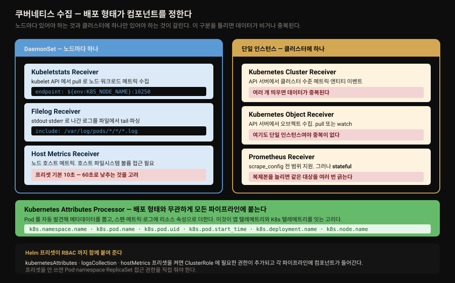
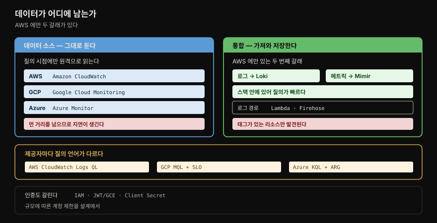

# 인프라 관측

---


## 핵심 요약

> Part 2 의 마지막 장입니다. 4~6장이 *애플리케이션이 내보내는* 신호를 다뤘다면, 이 장은 *인프라가 내보내는* 신호를 받습니다.
>
> 내용의 무게가 앞뒤로 크게 갈립니다. **앞의 쿠버네티스 절은 OTel 수집기 일곱 개를 YAML 과 운영 제약까지 짚어** 실질이 있는 반면, **뒤의 클라우드 3사 절은 화면 캡처를 따라가는 UI 안내** 에 가깝습니다. 그래서 이 노트도 그 비중을 따릅니다.
>
> 쿠버네티스 절의 핵심은 하나로 요약됩니다. **배포 형태가 컴포넌트를 정합니다.** 노드마다 있어야 하는 것(DaemonSet)과 클러스터에 하나만 있어야 하는 것이 갈리고, 이 구분을 틀리면 데이터가 비거나 중복됩니다.

이 저장소에는 K8s·클라우드 노트가 [`08_cloud/`](../../../08_cloud/README.md) 에 따로 있고 [02-02. Grafana Alloy](../../02_LGTMStack/02-02.Grafana%20Alloy.md) 가 수집 파이프라인을 다룹니다. 다만 **OTel 의 쿠버네티스 수집기 일곱 개를 정리한 편은 없어서**, 이 장의 앞 절반이 새 내용입니다.


## 학습 목표

> 이 장을 읽고 나면 아래 다섯 가지를 스스로 해낼 수 있습니다.

1. 쿠버네티스 수집기 일곱 개를 대고 각각이 무엇을 어디서 가져오는지 말할 수 있습니다.
2. DaemonSet 으로 띄울 것과 단일 인스턴스로 띄울 것을 구분하고 그 이유를 설명할 수 있습니다.
3. Kubernetes Attributes Processor 가 왜 상관관계의 전제인지 말할 수 있습니다.
4. 클라우드 텔레메트리를 원격 조회할지 가져올지 판단 기준을 들어 고를 수 있습니다.
5. 인프라 관측 설계에서 성능·비용·제약·보안 네 축을 점검할 수 있습니다.


## 1. 쿠버네티스 — 수집기 일곱 개

> 저자들의 첫 문장이 전제를 세웁니다. **쿠버네티스는 모니터링되도록 설계됐습니다.**

[3장](03-01.학습%20환경%20—%20Grafana%20Cloud·OTel%20데모·자격증명과%20트러블슈팅.md) 에서 띄운 OTel Collector 가 여기서 본격적으로 쓰입니다. 수집과 보강(enrichment)을 위한 receiver·processor·exporter 를 제공합니다.

| 컴포넌트 | 무엇을 하는가 |
|----------|--------------|
| **Kubernetes Attributes Processor** | 텔레메트리에 쿠버네티스 메타데이터를 덧붙여 **상관관계에 필요한 맥락** 을 제공 |
| **Kubeletstats Receiver** | kubelet API 에서 **pull** 로 Pod 메트릭 획득. 설치된 각 노드에서 노드·워크로드 메트릭 수집 |
| **Filelog Receiver** | **stdout·stderr** 로 쓰인 쿠버네티스·워크로드 로그 수집 |
| **Kubernetes Cluster Receiver** | 쿠버네티스 API 로 **클러스터 수준** 메트릭과 엔티티 이벤트 수집 |
| **Kubernetes Object Receiver** | 쿠버네티스 API 에서 오브젝트(예: 이벤트) 수집 |
| **Prometheus Receiver** | Prometheus `scrape_config` 설정으로 메트릭 스크레이프 |
| **Host Metrics Receiver** | 쿠버네티스 **노드** 에서 메트릭 스크레이프 |



### Kubernetes Attributes Processor — 상관관계의 전제

이 프로세서가 이 절에서 가장 중요합니다. **Pod 를 자동 발견하고 메타데이터를 뽑아 스팬·메트릭·로그에 리소스 속성으로 추가** 합니다. 그래야 애플리케이션의 메트릭·이벤트·로그·트레이스를 **Pod 메트릭 같은 쿠버네티스 텔레메트리와 상관지을 수 있습니다.**

기본 연결 방식은 **들어오는 요청의 IP 주소로 Pod 를 찾는 것** 이며, 다른 규칙도 설정할 수 있습니다.

Helm 차트의 `kubernetesAttributes` 프리셋을 켜면 **ClusterRole 에 필요한 RBAC 역할이 추가되고** 각 파이프라인에 `k8sattributesprocessor` 가 들어갑니다.

```yaml
presets:
  kubernetesAttributes:
    enabled: true
```

이때 기본으로 붙는 속성이 여섯입니다.

| 속성 | 내용 |
|------|------|
| `k8s.namespace.name` | Pod 가 배포된 네임스페이스 |
| `k8s.pod.name` | Pod 이름 |
| `k8s.pod.uid` | Pod 의 고유 ID |
| `k8s.pod.start_time` | Pod 생성 타임스탬프. **Pod 재시작을 파악할 때 유용** |
| `k8s.deployment.name` | 애플리케이션의 디플로이먼트 이름 |
| `k8s.node.name` | Pod 가 도는 노드 이름. **쿠버네티스가 Pod 를 전 노드에 분산하므로 특정 노드만 문제인지 파악하는 데 중요** |

여기에 더해 **Pod·네임스페이스의 라벨과 애노테이션으로 커스텀 리소스 속성** 을 만듭니다. 방법은 둘입니다.

```yaml
k8sattributes:
  auth_type: 'serviceAccount'
  extract:
  pod_association:
```

- **`extract`** — 메타데이터·애노테이션·라벨을 리소스 속성으로 씁니다. `metadata` 는 `k8s.namespace.name` 같은 값을, `annotations` 와 `labels` 는 키로 값을 뽑아 속성으로 넣습니다. **애노테이션과 라벨은 정규식으로 값의 일부만 뽑을 수도** 있습니다.
- **`pod_association`** — 데이터를 해당 Pod 에 연결합니다. **여러 소스를 설정하면 순서대로 시도하고 매칭되면 멈춥니다.**

```yaml
pod_association:
  - sources:
      - from: resource_attribute
        name: k8s.pod.ip
  - sources:
      - from: resource_attribute
        name: k8s.pod.uid
  - sources:
      - from: connection
```

⚠️ **프리셋을 쓰지 않으면 권한을 직접 줘야 합니다.** 저자들은 대개 **Pod·네임스페이스·ReplicaSet 리소스 접근이면 충분** 하지만 클러스터 설정에 따라 다르다고 적습니다.

### 배포 형태가 갈리는 지점

이 절에서 실무 사고로 이어지는 구분입니다.

**DaemonSet 이 선호되는 것 — Kubeletstats Receiver.** kubelet API 에 붙어 **노드와 그 노드에서 도는 워크로드의 메트릭** 을 수집하므로, 노드마다 하나씩 있어야 합니다. 기본은 Pod 와 노드 메트릭이고 **컨테이너와 볼륨 메트릭도 추가 설정** 할 수 있습니다.

```yaml
receivers:
  kubeletstats:
    collection_interval: 60s
    auth_type: 'serviceAccount'
    endpoint: '${env:K8S_NODE_NAME}:10250'
    insecure_skip_verify: true
    metric_groups:
      - node
      - pod
      - container
```

⛔ **단일 인스턴스여야 하는 것 — Cluster Receiver 와 Object Receiver.** 둘 다 쿠버네티스 API 서버에서 가져오므로 **여러 개를 띄우면 데이터가 중복됩니다.** 저자들이 두 receiver 모두에 이 경고를 답니다.

Cluster Receiver 는 Pod 단계(phase), 노드 조건 등 클러스터 수준 정보를 얻는 데 씁니다.

```yaml
k8s_cluster:
  auth_type: serviceAccount
  node_conditions_to_report:
    - Ready
    - MemoryPressure
  allocatable_types_to_report:
    - cpu
    - memory
  metrics:
    k8s.container.cpu_limit:
      enabled: false
  resource_attributes:
    container.id:
      enabled: false
```

뒤의 `metrics` 와 `resource_attributes` 블록이 보여주는 것은 **개별 메트릭·속성을 끌 수 있다** 는 점입니다. 수집량을 줄이는 손잡이가 receiver 안에 있는 셈입니다.

Object Receiver 는 **pull 과 watch 두 방식** 이 있고 이 선택이 성격을 가릅니다.

- **pull** — 주기적으로 API 를 폴링해 클러스터의 모든 오브젝트를 나열합니다. **각 오브젝트가 자기 로그로 변환** 됩니다.
- **watch** — API 와 스트림을 만들어 오브젝트가 바뀔 때마다 업데이트를 받습니다. 저자들은 이쪽이 **가장 흔한 사용 사례** 라고 적습니다.

```yaml
k8sobjects:
  auth_type: serviceAccount
  objects:
    - name: pods
      mode: pull
      label_selector: environment in (prod)
      field_selector: status.phase=Running
      interval: 15m
    - name: events
      mode: watch
      group: events.k8s.io
      namespaces: [default]
```

⚠️ **Prometheus Receiver 는 stateful 입니다.** 이 성질이 확장에 제약을 만듭니다.

- 복제본을 여러 개 두어도 **스크레이프 과정을 자동 확장할 수 없습니다.**
- **같은 설정으로 복제본을 여러 개 돌리면 대상을 여러 번 긁습니다.**
- 수동으로 확장하려면 **복제본마다 다른 스크레이프 설정** 을 줘야 합니다.

### 로그와 호스트 메트릭

**Filelog Receiver** 는 쿠버네티스 전용은 아니지만 **쿠버네티스에서 가장 인기 있는 로그 수집 방식** 입니다. 연산자(operator)를 이어 붙여 로그를 tail·파싱합니다. `logsCollection` 프리셋이 RBAC 과 receiver 를 함께 붙여 줍니다.

```yaml
filelog:
  include:
    - /var/log/pods/*/*/*.log
  exclude:
    - /var/log/pods/*/otel-collector/*.log
  start_at: beginning
  include_file_path: true
  include_file_name: false
```

`exclude` 에 자기 자신(otel-collector)의 경로가 들어간 것이 눈에 띕니다. 원문은 이 설정을 "무엇을 포함하고 무엇을 제외하는지 보여주는 기본 예"로만 소개하고 그 이유는 적지 않습니다.

파서는 여섯 종류입니다.

- `json_parser` — JSON 파싱
- `regex_parser` — 정규식 파싱
- `csv_parser` — 쉼표 구분 값
- `key_value_parser` — 구조화된 키-값 쌍
- `uri_parser` — 구조화된 웹 경로
- `syslog_parser` — 표준 syslog 형식

2장의 로그 형식 카탈로그와 4장의 LogQL 파서가 여기서 만납니다. 수집 시점에 파싱할지 질의 시점에 파싱할지가 선택지가 됩니다.

**Host Metrics Receiver** 는 여러 스크레이퍼로 호스트 메트릭을 모으며 **호스트 파일시스템 볼륨에 접근할 수 있어야** 동작합니다.

| 스크레이퍼 | 수집 대상 | hostMetrics 프리셋 기본 포함 |
|-----------|----------|---------------------------|
| CPU | CPU 사용률 | **예** |
| Disk | 디스크 I/O | **예** |
| Load | CPU 부하 | **예** |
| Filesystem | 파일시스템 사용률 | **예** |
| Memory | 메모리 사용률 | **예** |
| Network | 네트워크 인터페이스 I/O·TCP 연결 | **예** |
| Paging | 페이징·스왑 사용률과 I/O | 아니오 |
| Processes | 프로세스 수 | 아니오 |
| Process | 프로세스별 CPU·메모리·디스크 I/O | 아니오 |

⚠️ 저자들이 명시적으로 경고하는 기본값이 있습니다. **프리셋은 기본으로 10초마다 스크레이프하는데, 백엔드에 메트릭이 너무 많이 생길 수 있으니 60초로 덮어쓰는 것을 고려** 하라고 적습니다. [5장](05-01.메트릭%20—%20수집%20프로토콜·저장%20아키텍처·exemplar.md) 의 무료 티어 메트릭 한도를 생각하면 실제로 걸리는 자리입니다.


## 2. 클라우드 3사 — 원격 조회냐 가져오기냐

> 화면 캡처 위주의 절이라 클릭 순서는 옮기지 않습니다. 대신 **판단이 갈리는 축** 만 남깁니다.



이 절에서 오래 남는 것은 **AWS 에만 두 갈래 선택지가 있다** 는 사실과 그 트레이드오프입니다.

| 방식 | 데이터 위치 | 성격 |
|------|------------|------|
| **Amazon CloudWatch 데이터 소스** | **AWS 에 그대로 남음.** Grafana 가 질의 시점에 원격으로 읽음 | 저장하지 않고 **질의 시점에만 조회** |
| **AWS 통합(integration)** | **Grafana Cloud 로 보내지거나 스크레이프되어 저장됨**(로그는 Loki, 메트릭은 Mimir) | 데이터가 스택 안에 있어 **질의 시간 이점** |

GCP 와 Azure 는 이 장에서 **데이터 소스 방식만** 소개됩니다. 둘 다 "Grafana 에 텔레메트리를 저장하지 않고 질의 시점에만 가져온다"고 명시합니다.

| 제공자 | 데이터 소스 이름 | 인증 | 질의 언어·방식 |
|--------|----------------|------|---------------|
| **AWS** | Amazon CloudWatch | IAM 권한 + 인증 정보 | 메트릭은 Builder, 로그는 **CloudWatch Logs Query Language** |
| **GCP** | Google Cloud Monitoring | **JWT** 또는 **GCE 기본 서비스 계정** | 메트릭은 Builder 또는 **MQL**(Monitoring Query Language), 그리고 **SLO 쿼리** |
| **Azure** | Azure Monitor | **Azure Client Secret** | 메트릭·로그(**KQL**, Kusto Query Language)·트레이스·**ARG**(Azure Resource Graph) |

세 제공자 모두 **미리 만들어진 대시보드 세트** 를 데이터 소스 Settings 의 Dashboards 탭에서 가져올 수 있습니다.

각 클라우드의 고유한 점만 짚으면 이렇습니다.

**AWS 통합의 제약** — CloudWatch 메트릭 통합은 수집기나 에이전트를 설치하지 않고 스크레이프할 수 있지만, ⚠️ **태그가 있는 AWS 리소스만 메트릭이 발견됩니다.** 로그 쪽은 **Logs with Lambda**(Lambda 함수가 CloudWatch 로그를 Loki 로 전달)와 **Logs with Firehose** 두 선택지가 있습니다.

**GCP 의 SLO 쿼리** — Google Cloud Monitoring 데이터 소스는 메트릭과 **GCP 서비스 수준 목표(SLO)** 를 모두 질의할 수 있고 둘 다 시계열을 반환합니다. SLO 쿼리 빌더는 SLO 데이터를 시계열 형태로 시각화하는 것을 돕습니다.

**Azure 의 ARG** — Azure Resource Graph 는 Azure Resource Manager 를 확장해 **여러 구독에 걸친 질의** 를 확장성 있게 제공합니다. 큰 규모의 Azure 배포를 질의·분석하는 데 적합합니다.

```kusto
Resources | project name, type, location | order by name asc
```

**Azure 의 트레이스는 Application Insights** — 저자들의 표현으로 Azure Monitor 트레이스 질의는 **"내부적으로 Azure Application Insights 라고 볼 수 있습니다."** APM 기능을 제공하는 서비스입니다.

⚠️ 규모 관련 단서도 하나 있습니다. GCP 절에서 **배포 규모에 따라 토큰이나 서비스 계정에 걸린 제한을 설계 단계에서 고려해야** 한다고 적습니다.


## 3. 모범 사례 네 축

> 이 장이 클라우드 통합 전반에 주는 점검 축입니다. 특정 제공자에 매이지 않아 오래 갑니다.

**성능(Performance)** — 텔레메트리를 가져오는 과정 자체가 성능 부담을 만들 수 있습니다. 원격 Grafana 데이터 소스는 **질의 시점에 먼 거리를 넘어 데이터를 가져오므로**, Loki·Mimir·Tempo 처럼 Grafana 질의 엔진 가까이 저장된 데이터에 비해 **지연이 생깁니다.** 성능이 중요하고 텔레메트리를 Grafana 로 실어 보낼 수 있다면 그쪽이 나은 선택일 수 있습니다. 여러 데이터 소스가 **캐싱 옵션** 을 제공하기도 합니다.

**비용(Cost)** — Grafana Cloud 로 데이터를 보내는 네트워크·저장 비용에 더해, **클라우드 제공자 API 를 질의할 때도 비용이 발생** 할 수 있습니다. 어디서 요금이 발생하는지 파악해 설계에 반영해야 합니다.

**제약(Constraints)** — 인프라 플랫폼은 시스템 보호를 위해 제약을 걸어 둡니다. **완화 가능한 soft limit 일 수도, hard limit 일 수도** 있습니다. 특정 플랫폼의 방식을 확정하기 전에 요구사항과 예상 데이터·질의 트랜잭션 양을 문서화된 한도, API 키 사용량, 네트워크 egress 양과 견줘 봐야 합니다.

**보안(Security)** — 이 장의 설정 옵션 대부분이 **관심사 분리(separation of concerns)** 를 만들도록 구성될 수 있습니다. 데이터 소스를 나누거나 질의·수집되는 데이터에 통제를 두면 보안 태세가 나아집니다.

> 이 네 축이 [5장](05-01.메트릭%20—%20수집%20프로토콜·저장%20아키텍처·exemplar.md) 의 push·pull 논의와 겹칩니다. "원격 조회냐 가져오기냐"는 결국 **데이터를 어디에 둘 것인가** 의 문제이고, 성능·비용·제약이 그 답을 정합니다.


## 책 밖으로 잇기

> 이 장은 UI 화면과 제품 기능에 크게 기대므로, 지금 달라졌을 지점을 표시해 둡니다.

**클라우드 절의 화면은 이미 다릅니다.** [3장 노트](03-01.학습%20환경%20—%20Grafana%20Cloud·OTel%20데모·자격증명과%20트러블슈팅.md) §1 에서 실측했듯 책은 Grafana 10.2 기준이고 현재는 13.x 대입니다. 메뉴 이름·버튼 위치·통합 목록은 확인하고 써야 하며, 이 노트가 클릭 순서를 옮기지 않은 이유이기도 합니다. **판단 축(원격 조회 대 가져오기, 인증 방식, 질의 언어)은 그대로 유효합니다.**

**PDC 는 책이 스스로 예고한 공백입니다.** 저자들이 별도 알림 상자로 **책이 출간에 가까워질 무렵 Grafana Labs 가 private data source connect(PDC) 를 출시** 했고, 관리자가 **호스팅 위치와 무관하게 네트워크로 보호된 데이터 소스에 연결** 할 수 있게 해 준다고 적습니다. **다루지 못했지만 독자가 관심을 가질 만하다** 고 밝혀 두었으므로, 방화벽 뒤 데이터 소스를 붙여야 한다면 여기서 시작합니다.

**수집기 이름과 설정 키는 확인이 필요합니다.** OTel Collector 는 3장 노트에서 확인한 대로 책의 0.73.1 에서 0.157.0 대로 올라갔습니다.

이 장에 나오는 YAML 키와 프리셋 이름은 **현재 문서에서 대조** 하고 쓰는 편이 안전합니다. 정본은 [OpenTelemetry — Kubernetes Collector 컴포넌트](https://opentelemetry.io/docs/kubernetes/collector/components/) 입니다.

**Alloy 를 쓴다면 대응이 달라집니다.** 이 저장소의 수집 계층 정본은 [02-02. Grafana Alloy](../../02_LGTMStack/02-02.Grafana%20Alloy.md) 이며 Alloy 는 OTel Collector 배포판입니다. 이 장의 receiver 개념은 그대로 옮겨 가지만 **설정 문법이 Alloy 컴포넌트 문법으로 바뀝니다.** 개념은 이 노트로, 실제 설정은 그 편으로 봅니다.


## 결정 치트시트

> 이 장이 남기는 판단 기준을 표로 압축합니다.

| 상황 | 선택 | 이유 |
|------|------|------|
| 노드·워크로드 메트릭을 모음 | Kubeletstats(DaemonSet) | kubelet API 에 붙으므로 노드마다 필요 |
| 클러스터 수준 상태를 모음 | Cluster Receiver **단일 인스턴스** | 여러 개면 데이터 중복 |
| 쿠버네티스 오브젝트를 모음 | Object Receiver **단일 인스턴스** | 여기도 중복 위험 |
| 오브젝트 변화를 실시간으로 봄 | `watch` 모드 | 저자들이 가장 흔한 사용 사례로 꼽음 |
| 특정 조건의 오브젝트를 주기적으로 훑음 | `pull` + selector | 각 오브젝트가 로그로 변환됨 |
| Prometheus Receiver 를 확장 | 복제본마다 **다른 스크레이프 설정** | stateful 이라 자동 확장 불가, 같은 설정이면 중복 스크레이프 |
| 컨테이너 로그를 모음 | Filelog(+`logsCollection` 프리셋) | K8s 에서 가장 널리 쓰이는 방식 |
| 수집기가 자기 로그를 되먹임함 | `exclude` 에 수집기 경로 추가 | 예시 설정이 그렇게 되어 있음 |
| 호스트 메트릭이 너무 많음 | 스크레이프 주기를 **60초로** | 프리셋 기본이 10초 |
| 앱 신호와 K8s 신호를 잇고 싶음 | Attributes Processor | 상관관계에 필요한 맥락을 리소스 속성으로 붙임 |
| 프리셋을 안 씀 | RBAC 직접 부여 | Pod·네임스페이스·ReplicaSet 접근이 대개 충분 |
| 클라우드 데이터를 어디 둘까 | 성능 우선이면 **가져오기** | 원격 조회는 질의 시점에 먼 거리를 넘음 |
| 저장 비용을 피하고 싶음 | 데이터 소스(원격 조회) | 텔레메트리를 Grafana 에 저장하지 않음 |
| CloudWatch 메트릭이 안 보임 | **리소스 태그** 확인 | 태그가 있는 리소스만 발견됨 |
| 여러 Azure 구독을 가로질러 조회 | ARG | Resource Manager 를 확장해 다중 구독 질의 |
| 방화벽 뒤 데이터 소스를 붙임 | PDC 조사 | 책이 다루지 못했다고 밝힌 영역 |


## Spring 앱 개발 관점

> 이 장은 인프라 계층이라 Spring 예제가 없습니다. 아래는 앞 장들과 이어지는 지점을 정리한 것이며 책 밖의 내용입니다.

이 장의 Attributes Processor 가 Spring 앱 개발자에게 갖는 의미는 **내가 코드에서 아무것도 하지 않아도 붙는 맥락** 이라는 점입니다.

[2장](02-01.계측%20—%20로그%20형식·메트릭%20타입·트레이싱%20프로토콜·인프라%20표준.md) 에서 본 대로 계측에는 자동과 수동이 있고, 애플리케이션이 내보내는 속성은 대개 코드나 SDK 설정이 정합니다. 그런데 `k8s.pod.name`·`k8s.node.name` 같은 값은 **애플리케이션이 알 필요도 없고 알기도 번거로운** 정보입니다. 수집 계층이 그것을 붙여 주므로, 앱은 자기 도메인 정보만 신경 쓰면 됩니다.

실무에서 이 구분이 중요해지는 자리가 **장애 조사** 입니다. 같은 서비스의 Pod 여럿 중 하나만 느릴 때, 앱이 내보낸 트레이스에는 그 구분이 없지만 `k8s.pod.name`·`k8s.node.name` 이 붙어 있으면 **특정 노드의 문제인지** 를 바로 물을 수 있습니다. 저자들이 `k8s.node.name` 설명에 "쿠버네티스가 Pod 를 전 노드에 분산하므로 특정 노드만 문제인지 파악하는 것이 중요하다"고 적은 이유입니다.

로그 쪽에서는 선택지가 하나 생깁니다. Filelog Receiver 가 파서 여섯을 제공하므로 **수집 시점에 파싱** 할 수 있고, LogQL 파서로 **질의 시점에 파싱** 할 수도 있습니다.

Spring 앱이 JSON 으로 로그를 내보낸다면 어느 쪽이든 됩니다. 다만 수집 시점 파싱은 라벨 카디널리티를 늘릴 수 있으므로 [4장](04-01.Loki%20와%20LogQL%20—%20파이프라인·메트릭%20쿼리·아키텍처.md) §5 의 라벨 원칙과 함께 판단해야 합니다.


## 면접에서 받을 만한 질문

> 아래 질문에 **먼저 스스로 답해 보세요.** 자답이 끝나면 이어지는 §정답 (자답 후 펼치기) 으로 내려갑니다.

1. Kubernetes Attributes Processor 는 무엇을 하며 왜 중요합니까?
2. Kubeletstats Receiver 의 선호 배포 모드는 무엇이고 그 이유는 무엇입니까?
3. 단일 인스턴스로 띄워야 하는 receiver 는 무엇이며 어기면 무슨 일이 생깁니까?
4. Prometheus Receiver 가 stateful 이라는 것이 확장에 어떤 제약을 만듭니까?
5. Kubernetes Object Receiver 의 pull 과 watch 는 어떻게 다릅니까?
6. hostMetrics 프리셋에서 주의할 기본값은 무엇입니까?
7. CloudWatch 데이터 소스와 AWS 통합은 무엇이 다릅니까?
8. 인프라 관측 설계에서 점검할 네 축은 무엇입니까?


## 정답 (자답 후 펼치기)

> 위 §면접에서 받을 만한 질문 의 8개에 *먼저 자답한 뒤* 아래를 읽으세요. 자답 없이 먼저 읽으면 학습 효과가 0 입니다. 질문 번호와 1:1 로 대응합니다.

### 정답 1 — Attributes Processor

**Pod 를 자동 발견해 메타데이터를 뽑고, 스팬·메트릭·로그에 리소스 속성으로 추가** 합니다.

중요한 이유는 **상관관계** 입니다. 이 맥락이 있어야 애플리케이션의 메트릭·이벤트·로그·트레이스를 Pod 메트릭 같은 쿠버네티스 텔레메트리와 이어 볼 수 있습니다. 기본 연결은 들어오는 요청의 IP 로 Pod 를 찾는 방식이며 규칙을 바꿀 수 있습니다.

### 정답 2 — Kubeletstats 의 배포 모드

**DaemonSet** 이 선호됩니다.

kubelet API 에 붙어 **그 노드와 노드에서 도는 워크로드의 메트릭** 을 수집하기 때문입니다. 노드마다 kubelet 이 있으므로 수집기도 노드마다 있어야 전체가 덮입니다.

### 정답 3 — 단일 인스턴스 대상

**Kubernetes Cluster Receiver** 와 **Kubernetes Object Receiver** 입니다.

둘 다 쿠버네티스 API 서버에서 데이터를 가져오므로, 여러 개를 띄우면 **같은 데이터를 중복 수집** 하게 됩니다. 저자들이 두 receiver 설명에 각각 이 경고를 답니다.

### 정답 4 — stateful 의 제약

세 가지입니다.

1. 복제본을 여러 개 두어도 **스크레이프 과정이 자동 확장되지 않습니다.**
2. **같은 설정으로 여러 복제본을 돌리면 대상을 여러 번 긁습니다.**
3. 수동 확장하려면 **복제본마다 다른 스크레이프 설정** 을 줘야 합니다.

### 정답 5 — pull 과 watch

- **pull** — 주기적으로 쿠버네티스 API 를 폴링해 클러스터의 모든 오브젝트를 나열합니다. **각 오브젝트가 자기 로그로 변환** 됩니다.
- **watch** — API 와 스트림을 만들어 **오브젝트가 바뀔 때 업데이트를 받습니다.** 저자들이 가장 흔한 사용 사례로 꼽습니다.

pull 은 스냅숏을 반복해 찍는 방식이고 watch 는 변화를 구독하는 방식입니다.

### 정답 6 — hostMetrics 기본값

**기본 스크레이프 주기가 10초** 라는 점입니다. 저자들은 이것이 백엔드 시스템에 메트릭을 너무 많이 만들 수 있으니 **60초로 덮어쓰는 것을 고려하라** 고 적습니다.

프리셋이 기본 포함하는 스크레이퍼는 CPU·Disk·Load·Filesystem·Memory·Network 여섯이고, Paging·Processes·Process 셋은 기본 제외입니다.

### 정답 7 — 데이터 소스와 통합

- **CloudWatch 데이터 소스** — 텔레메트리가 **AWS 에 그대로 남고** Grafana 가 **질의 시점에 원격으로 읽습니다.** Grafana 에 저장하지 않습니다.
- **AWS 통합** — CloudWatch 데이터가 **Grafana Cloud 로 보내지거나 스크레이프되어 저장됩니다**(로그는 Loki, 메트릭은 Mimir). 데이터가 스택 안에 있어 **질의 시간에 이점** 이 있고 LogQL·PromQL 로 질의합니다.

즉 **어디에 데이터를 둘 것인가** 의 선택이며, §3 의 성능·비용 축이 그 답을 정합니다.

### 정답 8 — 네 축

**성능·비용·제약·보안** 입니다.

- **성능** — 원격 조회는 질의 시점에 먼 거리를 넘어 지연이 생깁니다.
- **비용** — 저장·네트워크뿐 아니라 **클라우드 API 질의에도** 요금이 붙을 수 있습니다.
- **제약** — soft limit 인지 hard limit 인지 확인하고 예상 사용량과 견줍니다.
- **보안** — 데이터 소스 분리 등으로 관심사를 나눠 보안 태세를 개선합니다.


## 핵심 개념 체크리스트

> 위 §정답 을 덮고, 각 항목을 소리 내어 설명할 수 있는지 점검합니다. 막히는 자리가 이 장의 재학습 지점입니다.

- [ ] 쿠버네티스 수집기 일곱 개를 대고 각각의 데이터 출처를 말할 수 있는가?
- [ ] Attributes Processor 가 붙이는 기본 속성 여섯을 아는가?
- [ ] `extract` 와 `pod_association` 이 각각 무엇을 하는지 구분할 수 있는가?
- [ ] `pod_association` 이 여러 소스를 어떻게 처리하는지 아는가?
- [ ] DaemonSet 이 맞는 것과 단일 인스턴스가 맞는 것을 구분할 수 있는가?
- [ ] Prometheus Receiver 의 stateful 제약 셋을 댈 수 있는가?
- [ ] Object Receiver 의 pull 과 watch 차이를 설명할 수 있는가?
- [ ] Filelog 파서 여섯 종을 아는가?
- [ ] 수집 시점 파싱과 질의 시점 파싱의 선택지를 인식하는가?
- [ ] hostMetrics 프리셋의 기본 포함·제외 스크레이퍼를 구분할 수 있는가?
- [ ] 프리셋의 기본 주기와 권고 조정값을 아는가?
- [ ] 프리셋을 안 쓸 때 필요한 RBAC 범위를 아는가?
- [ ] CloudWatch 데이터 소스와 AWS 통합의 차이를 말할 수 있는가?
- [ ] GCP·Azure 의 질의 언어(MQL·KQL·ARG)를 구분할 수 있는가?
- [ ] CloudWatch 메트릭 발견에 태그가 필요하다는 제약을 아는가?
- [ ] 모범 사례 네 축을 대고 각각의 요점을 말할 수 있는가?


## 참고 자료

> 원서 7장과, 본문의 사실을 대조한 1차 자료 목록입니다.

- 원본: *Observability with Grafana* (Packt, ISBN 9781803248004) 7장 — Interrogating Infrastructure with Kubernetes, AWS, GCP, and Azure.
- [OpenTelemetry — Kubernetes Collector 컴포넌트](https://opentelemetry.io/docs/kubernetes/collector/components/) — §1 수집기 이름·설정 키의 현재 정본
- [AWS — CloudWatch Logs Query Syntax](https://docs.aws.amazon.com/AmazonCloudWatch/latest/logs/CWL_QuerySyntax.html) — 원문이 안내한 로그 질의 문법
- [Google Cloud — MQL](https://cloud.google.com/monitoring/mql) · [SLO 모니터링](https://cloud.google.com/stackdriver/docs/solutions/slo-monitoring) — 원문이 안내한 GCP 문서
- [Microsoft — KQL 개요](https://learn.microsoft.com/en-us/azure/data-explorer/kusto/query/) · [Azure Monitor 참조](https://learn.microsoft.com/en-us/azure/azure-monitor/monitor-reference) — 원문이 안내한 Azure 문서


## 관련 문서

> 이 편으로 Part 2(신호별 구현)가 닫힙니다. 수집 설정의 실제 문법과 클라우드 인프라는 다른 카테고리가 정본입니다.

- [README (책 MOC)](README.md) — 《Observability with Grafana》 15장 전체 지도
- [06-01. Tempo 와 TraceQL](06-01.Tempo%20와%20TraceQL%20—%20구조%20연산자·전파%20헤더·아키텍처.md) — 앞 편. Part 2 의 신호 셋 중 마지막
- [02-02. Grafana Alloy](../../02_LGTMStack/02-02.Grafana%20Alloy.md) — **수집 계층 정본**. 이 장의 receiver 개념이 Alloy 문법으로 옮겨 가는 자리
- [02-07. LGTM K8s 통합 배포](../../02_LGTMStack/02-07.LGTM%20K8s%20통합%20배포.md) — 셀프호스팅으로 스택을 올리는 경로
- [04-01. Loki 와 LogQL](04-01.Loki%20와%20LogQL%20—%20파이프라인·메트릭%20쿼리·아키텍처.md) — §1 Filelog 파서와 대비되는 질의 시점 파싱
- [05-01. 메트릭 — 수집 프로토콜·저장 아키텍처·exemplar](05-01.메트릭%20—%20수집%20프로토콜·저장%20아키텍처·exemplar.md) — §3 성능·비용 축이 push·pull 논의와 만나는 지점
