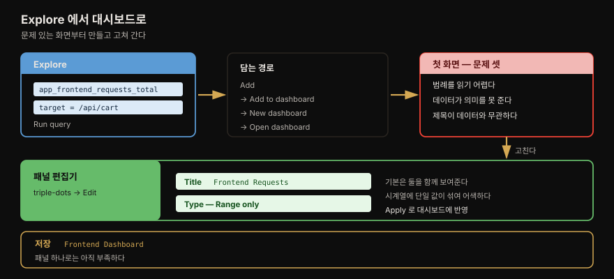
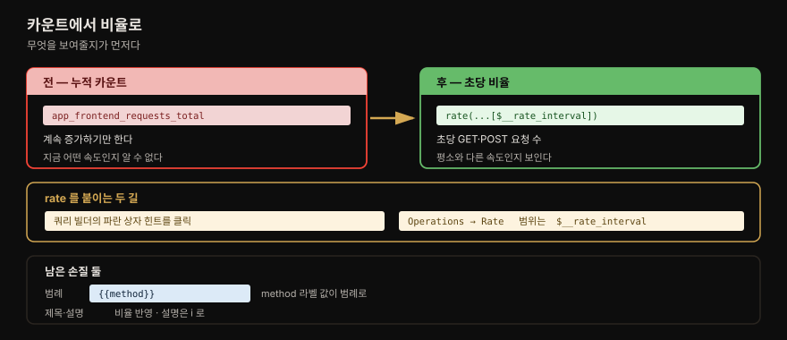
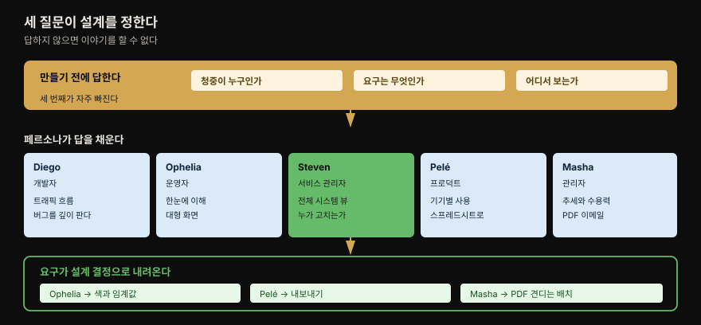
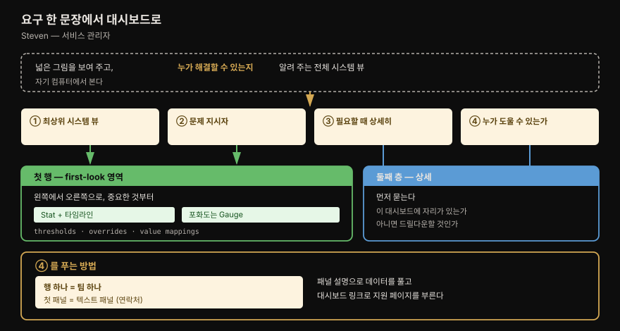

# 대시보드

---

## 핵심 요약

> **대시보드는 질문에 답하거나 이야기를 해야 하고, 그러려면 만들기 전에 청중을 정해야 합니다.** 이 장은 앞의 일곱 장과 성격이 다릅니다. 데이터를 *모으는* 이야기가 끝나고 *보여주는* 이야기가 시작됩니다.
>
> 기술적 난도는 낮지만 판단이 어렵습니다. 저자들은 클릭 순서보다 **"누가 보는가·무엇을 원하는가·어디서 보는가"** 세 질문을 먼저 세우고, 1장의 페르소나 다섯을 그 답으로 씁니다.
>
> 오래 남는 것은 **인지 부하(cognitive load)를 줄이는 장치들**입니다. 행으로 팀을 묶고 첫 패널에 연락처를 두는 식입니다. 대시보드가 "누가 고칠 수 있는가"까지 답하게 만드는 설계입니다.

## 학습 목표

1. 대시보드를 만들기 전에 던져야 할 세 질문을 말할 수 있습니다.
2. 카운트와 비율(rate) 중 무엇을 보여줘야 하는지 판단할 수 있습니다.
3. 패널 설정 일곱 가지가 각각 무엇을 통제하는지 구분할 수 있습니다.
4. 페르소나의 요구를 대시보드 설계 결정으로 옮길 수 있습니다.
5. 인지 부하를 줄이는 배치 기법을 예로 들 수 있습니다.

## 1. 첫 대시보드 — 문제부터 보게 만듭니다

> 저자들은 잘 만든 예시가 아니라 **문제가 있는 첫 화면**을 먼저 보여줍니다. 그 문제를 하나씩 고치는 것이 이 절의 구조입니다.

시작은 Explore 입니다. Prometheus 데이터 소스(`grafanacloud-<team>-prom`)를 고르고, 메트릭 드롭다운에서 `app_frontend_requests_total` 을, 라벨 필터에서 `target = /api/cart` 를 골라 Run query 를 누릅니다. 데모 상점의 장바구니 API 요청만 남습니다.

이걸 대시보드로 옮기는 경로가 **Add → Add to dashboard → New dashboard → Open dashboard** 입니다.

여기서 저자들의 서술이 인상적입니다. 새 대시보드를 열자마자 **문제 셋을 스스로 지적합니다.**

- 범례를 읽기 어렵습니다.
- 데이터가 별 의미를 주지 못합니다.
- 패널 제목이 데이터와 관계가 없습니다.

고치는 순서도 그대로 따라갑니다. 패널 편집기에서 제목을 `Frontend Requests` 로 바꿉니다. 이어서 **Type 을 Range only 로** 바꿉니다. 기본값이 Range 와 Instant 를 함께 보여주는데, 시계열 시각화에서는 타임라인 옆에 홀로 뜬 단일 값이 어색해 보이기 때문입니다.

마지막으로 대시보드 이름을 `Frontend Dashboard` 로 저장합니다. 그러고도 저자들은 만족하지 않습니다. **패널 하나로는 온라인 상점에 무슨 일이 벌어지는지 알 수 없다**고 적습니다.

## 2. 카운트에서 비율로 — 무엇을 보여줄지가 먼저입니다

> 요청 수가 늘어나는 그래프는 정보가 적습니다. 초당 몇 건이 들어오는지를 보여야 속도를 읽을 수 있습니다.

저자들이 이 절에 붙인 전제가 이 장 전체를 관통합니다. **대시보드를 진행 중인 작업(work in progress)으로 보고 메시지를 다듬어 가며 반복하는 것이 핵심**이라는 것입니다.

개선은 셋입니다.

쿼리 빌더가 **rate 를 더하라는 힌트를 파란 상자로** 보여줍니다. 그것을 클릭하면 제안된 집계가 기존 쿼리에 붙습니다. 힌트가 안 뜨면 Operations 버튼에서 Rate 를 고르고 범위를 `$__rate_interval` 로 둡니다. 이제 그래프는 초당 몇 건의 GET·POST 요청이 상점에 들어오는지 보여줍니다.

범례는 여전히 혼란스럽습니다. Options 절을 펼쳐 Legend 필드를 **커스텀 라벨 식별자 `{{method}}`** 로 바꿉니다. `method` 라벨의 값이 범례로 올라옵니다.

제목도 손봅니다. 이제 카운트가 아니라 비율을 보여주므로 제목이 그것을 반영해야 합니다. 설명(description)을 더하면 패널 옆에 **`i` 아이콘**이 생겨 마우스를 올렸을 때 뜹니다.

> 💬 **여기서 잠깐** — `$__rate_interval` 은 Grafana 가 제공하는 내장 변수입니다. 스크레이프 간격과 패널 폭을 함께 고려해 `rate()` 의 범위를 정해 주므로, 고정값(`[5m]` 등)을 하드코딩하는 것보다 안전합니다. 뒤 §5 의 "값을 하드코딩하지 마라"와 같은 이야기입니다.

## 3. 시각화 고르기와 패널 설정 일곱

> 메트릭 타입이 시각화 후보를 좁힙니다. 그다음은 패널 설정 일곱 가지를 아는 만큼 표현이 자유로워집니다.

저자들이 제시하는 대응은 단순합니다.

| 데이터 | 어울리는 시각화 |
|--------|----------------|
| counter · gauge 메트릭 타입 | **Stat** 또는 **Gauge** |
| histogram | **Bar chart** 또는 **Gauge** |
| 로그 | **Table**, 또는 로그에서 메트릭을 만들어 **시계열 차트** |

마지막 행이 [4장](04-01.Loki%20와%20LogQL%20—%20파이프라인·메트릭%20쿼리·아키텍처.md) 의 로그 범위 집계와 만납니다. 로그를 표로만 보지 않고 `count_over_time` 같은 함수로 메트릭을 만들면 시계열 차트에 올릴 수 있습니다.

전체 목록은 [Grafana 패널 플러그인 페이지](https://grafana.com/grafana/plugins/panel-plugins/)에 있습니다. 저자들이 특히 권하는 곳은 **[play.grafana.org](https://play.grafana.org)** 입니다. 모든 패널 시각화의 예시가 다양한 데이터 타입과 함께 올라와 있어, 직접 만들기 전에 시험해 볼 수 있습니다.

패널 설정은 일곱 가지로 정리됩니다. 이 목록이 이 절에서 가장 오래 쓸모 있습니다.

| 설정 | 무엇을 하는가 |
|------|--------------|
| **Title · Description** | 제목은 데이터를 이해하게 돕고, 설명은 제목을 보완하거나 살을 붙입니다 |
| **Legend** | 맥락과 명료함을 주어 해석을 돕습니다. 서식을 줄 수 있고, **뷰와 상호작용해 선택한 항목으로 필터**됩니다 |
| **Standard options** | 단위·최댓값·최솟값·소수 자릿수·표시 이름·색 구성 |
| **패널별 옵션** | 시각화마다 자기 설정을 가집니다 |
| **Thresholds** | 임계값 도달·초과 여부로 **색·배경·표시값**을 통제합니다 |
| **Overrides** | 특정 데이터에만 커스텀 설정을 적용합니다 (예: 소수점 제거, 단위 식별자 표시) |
| **Value mappings** | 반환값을 색이나 다른 값으로 **치환**합니다. 범위와 정규식 매칭을 지원합니다 |

Thresholds·Overrides·Value mappings 셋이 뒤 §6 의 "가장 중요한 정보로 시선을 끄는" 장치로 다시 나옵니다.

## 4. 목적 정의 — 세 질문과 페르소나

> 대시보드에는 목표가 있어야 합니다. 목표를 찾는 방법이 세 질문이고, 답을 채우는 재료가 페르소나입니다.

저자들이 던지는 세 질문입니다.

1. **청중이 누구인가?**
2. **그들의 요구는 무엇인가?**
3. **어디서 보게 되는가?** (대형 화면인가 휴대폰인가)

그리고 못을 박습니다. **대시보드는 이야기를 하거나 질문에 답해야 하는데, 위 셋에 답하지 않고는 둘 다 할 수 없습니다.**

세 번째 질문이 이 장의 값입니다. 같은 데이터라도 벽걸이 대형 화면에서 볼 것과 이메일 PDF 로 받을 것은 다르게 만들어야 합니다. 저자들은 **그 표현 요구대로 실제로 검증하라**고 덧붙입니다.

1장의 페르소나 다섯이 여기서 요구사항 표로 돌아옵니다. 이 책이 페르소나를 장식으로 두지 않았다는 것이 이 표에서 확인됩니다.

| 페르소나 | 원하는 것 | 어디서 |
|---------|----------|--------|
| **Diego** Developer | 자기가 개발한 시스템을 흐르는 트래픽. 고객이 제품을 어떻게 쓰는지 알려 주고 개선에 쓰입니다. **버그 조사와 오류를 훨씬 상세히 파고드는** 일이 잦습니다 | — |
| **Ophelia** Operator | 문제를 벌어지는 즉시. **명확한 지시자와 색**으로 시스템 상태를 표현. **한눈에 이해**되어야 합니다 | 보통 대형 화면, 조사 중일 땐 자기 컴퓨터 |
| **Steven** Service Manager | 넓은 그림을 보게 해 주는 전체 시스템 뷰. 문제가 있으면 **누가 해결할 수 있는지** 식별할 정보 | 자기 컴퓨터 |
| **Pelé** Product Manager | 제품이 **어떤 기기로** 어떻게 쓰이는지 보여 주는 명확한 메트릭. 종종 **스프레드시트로 내보내** 추가 분석 | 자기 컴퓨터 |
| **Masha** Manager | 집계된 데이터. **복구율과 수용력**의 추세로 미리 계획 | 자기 컴퓨터, **주기적 PDF 리포트 이메일**이 도움 |

> 페르소나 다섯의 배경과 각자의 고충은 [1장 §5](01-01.관측%20가능성과%20Grafana%20스택%20—%20파나마%20운하·페르소나·LGTM.md) 가 정본입니다. 여기서는 **그 요구가 대시보드 설계 결정으로 어떻게 내려오는지**만 봅니다.

표를 세로로 읽으면 설계 결정이 갈리는 축이 보입니다.

- **Ophelia** — 색과 임계값이 중요합니다.
- **Pelé** — 내보내기가 필요합니다.
- **Masha** — PDF 렌더링을 견디는 배치가 필요합니다.

같은 데이터를 다섯 벌로 만들라는 뜻이 아닙니다. **하나를 만들 때 누구를 위한 것인지 정하라는 뜻입니다.**

## 5. 배치와 기능 — 인지 부하를 줄이는 장치들

> 이 절이 이 장에서 가장 실무적입니다. 대부분 Grafana 에 매이지 않는 정보 설계 원칙입니다.

저자들은 배치 요령과 기술 팁을 나눠 제시합니다.

### 배치 요령

- Overview 패널의 **상단 제목을 짧게** 해 읽기 쉽게 합니다.
- **사용법과 대상 독자를 설명(description)에 적어** 데이터를 이해할 최선의 기회를 줍니다.
- 핵심 지표는 **스파크라인을 붙인 Stat** 같은 시각화로 부르고, **대시보드 맨 위에 먼저** 둡니다.
- 패널을 **격자(grid)로 배치**해 시선을 유도하고 초점을 통제합니다.
- **한 대시보드에 패널을 너무 많이 넣지 않습니다.** 소화하기 어려워집니다. 대신 **데이터 링크로 다른 대시보드**로 보내 데이터를 나눕니다.
- **투명 패널**로 시각적 여백을 만들어 핵심 데이터가 돋보이게 합니다.
- **행(row)으로 관련 패널을 묶어** 데이터에 맥락을 만듭니다.
- 행의 **접기 기능**으로 로드 시 일부 데이터를 숨깁니다. ⚠️ 여기에 **성능 이점**이 따라옵니다 — 행을 펼치기 전까지 그 쿼리들이 실행되지 않습니다.
- **비슷한 시각화를 모아** 처리하기 쉽게 만듭니다.

접기의 성능 이점은 저자들이 지나가듯 적지만 실무에서 큽니다. 패널이 수십 개인 대시보드가 열릴 때마다 모든 쿼리를 던지면 데이터 소스에 부담이 갑니다.

### 기술 팁

- 자주 저장하거나 **JSON 을 내보내 백업**합니다.
- 변경 메시지를 유용하게 적습니다. **미래의 자신**이 변경을 되짚을 때 도움이 됩니다.
- **대시보드 버전이 저장되며 비교할 수 있습니다.** 대시보드에 스며든 문제를 디버깅할 때 씁니다.
- 상호작용하고 동적인 대시보드를 만들어 메시지를 더 잘 전달합니다.
- **대시보드 변수**를 써서 보는 사람이 관심 있는 데이터를 고르게 합니다. 대시보드 상단에 입력으로 표시됩니다.
- ⚠️ **패널과 쿼리에 값을 하드코딩하지 않습니다.** 감시 대상 시스템이 늘고 새 데이터가 더해질수록 이 결정이 값을 합니다.
- **상대 시간 범위를 기본값**으로 둬 초기 화면을 표준화합니다. 예를 들어 from 을 `now-15m` 으로 두면 최근 15분을 보여줍니다.
- **변환(transformation)** 으로 데이터를 더 소화하기 좋은 형태로 만듭니다.
- **주석(annotation)** 으로 그래프에 지점을 표시합니다. 다른 데이터 소스의 풍부한 이벤트를 쓰거나 수동으로 달아 핵심 사건을 전달합니다.

## 6. 폴더·태그·권한

> 대시보드와 팀이 늘면 관리 장치가 필요합니다. 셋은 목적이 다릅니다.

메인 Dashboards 화면에서 폴더를 만들고 대시보드를 옮기거나 지우고 즐겨찾기(star)할 수 있습니다. 개별 대시보드의 태그는 Settings 화면에서 더하고 뺍니다.

| 장치 | 무엇을 위한 것인가 |
|------|------------------|
| **폴더** | 쉬운 정리와 그룹화 · **폴더 수준에서 권한을 분리**해 보안 강화 |
| **태그** | 관련 대시보드를 **검색**할 때 유용 · 시각적 인식을 위해 **색상 코드** |
| **권한** | 폴더와 그 안 대시보드의 접근 통제 · 편집이 필요 없는 사람에겐 **뷰어 권한만** · **알 필요 없는 폴더는 숨김** · 개별 사용자와 팀 양쪽에 적용 |

폴더가 정리 수단이면서 동시에 **권한 경계**라는 점이 설계에 영향을 줍니다. 정리를 위해 폴더를 나누다 보면 권한 구조도 함께 정해집니다.

## 7. 사례 연구 — Steven 을 위한 전체 시스템 뷰

> 앞 절들이 이 사례에서 한 번에 쓰입니다. 요구 한 문장이 네 조각으로 쪼개지고 각각이 설계 결정이 됩니다.

Steven 의 요구는 §4 에서 이렇게 기록됐습니다.

> *"Overall, a system view that helps me see the wider picture. If there is a problem, I need the information to identify who can solve it. I will view this on my computer."*

저자들은 이것을 넷으로 쪼갭니다.

1. 최상위 시스템 뷰
2. **문제 지시자** (이슈를 강조)
3. 필요할 때 더 상세히
4. **누가 도울 수 있는지 식별하도록 돕기**

그다음이 정보 수집입니다. 문서를 읽고 대화를 나눕니다. 이 책이 계속 써 온 OpenTelemetry 데모는 [아키텍처 다이어그램이 공개](https://opentelemetry.io/docs/demo/architecture/)돼 있어 시스템을 이해하는 데 쓸 수 있습니다. 저자들은 그 대안으로 **Diego 에게 물어보는 길**을 나란히 둡니다.

혼자 탐색한다면 저자들이 권하는 것이 **연구용 대시보드(research dashboard)** 입니다. 탐색하며 흥미로운 데이터를 발견할 때마다 패널을 더해 가는 것입니다. 이 장 앞부분에서 프론트엔드 요청으로 시작해 비율로 개선한 것이 바로 그 과정이었습니다. 저자들의 표현으로는 **스크랩북 대시보드**를 쌓되 **지금은 배치나 시각화를 신경 쓰지 말라**고 합니다.

어떤 메트릭을 고를지는 방법론이 돕습니다. 이 장이 드는 것은 Google SRE 핸드북의 **Four Golden Signals** 입니다.

| 신호 | 정의 |
|------|------|
| **Latency** | 요청을 처리하는 데 걸린 시간 |
| **Traffic** | 시스템에 가해지는 수요의 양 |
| **Errors** | 실패하는 요청의 비율 |
| **Saturation** | 시스템 서비스가 얼마나 꽉 찼는가 |

> 이 장은 네 신호를 정의만 하고 넘어갑니다. **성공·실패 지연을 분리해야 하는 이유, 암묵적·정책적 실패까지 Errors 에 넣어야 하는 이유, 100% 전에 시스템이 열화하는 이유**는 [01-03. 시그널 모델](../../01_Foundations/01-03.시그널%20모델%20—%20Golden%20Signals,%20RED,%20USE.md) 이 정본입니다. USE·RED 와의 비교와 결정 매트릭스도 그쪽에 있습니다. 저자들도 USE·RED 는 다음 장에서 다룬다고 미룹니다.

### 두 층으로 만듭니다

**첫 번째 행이 first-look 영역**입니다. 시스템을 흐르는 트래픽을 담은 메트릭을 골라 **타임라인을 붙인 Stat** 으로 눈에 띄게 합니다. 저자들의 지침이 구체적입니다 — **왼쪽에서 오른쪽으로, 가장 중요한 정보를 먼저 두어 Steven 을 이끕니다.** 포화도는 **Gauge** 가 어울립니다.

시선을 확실히 끌기 위해 **thresholds·overrides·value mappings** 로 패널을 강화하고, 일부 패널에는 **주석으로 맥락을 덧씌웁니다.** §3 에서 본 설정 셋이 여기서 쓰입니다.

**두 번째 층은 상세 정보**입니다. 여기서 저자들은 질문 두 개로 판단을 나눕니다.

1. 이 대시보드 안에 상세 정보를 담을 자리가 있는가?
2. 별도의 더 좁은 대시보드로 드릴다운해야 하는가?

이 사례에서는 같은 대시보드에 담기로 합니다. 그리고 4번 요구를 푸는 방법이 이 장에서 가장 기억할 만합니다.

- **행 하나를 팀 하나로 삼고, 그 행의 첫 패널을 텍스트 패널로 만들어 연락처와 참여 방법을 적습니다.** 저자들은 이렇게 하면 **인지 부하가 크게 줄어 Steven 이 문제를 더 빨리 푼다**고 적습니다.
- 패널 설명으로 데이터 이해를 돕고, **대시보드 링크로 지원 페이지**를 부릅니다.
- 상세 정보는 **테이블 패널과 색상 코딩**으로 더 빨리 처리되게 합니다.

저자들이 이 사례를 닫는 문장이 이 장의 결론이기도 합니다. **쓸 만한 대시보드를 만들려면 여러 번의 반복이 필요하고, 텔레메트리만으로 되는 일이 아닙니다.**

## 책 밖으로 잇기

> 이 장의 절차를 지금 따라 할 때 달라지는 지점을 1차 자료로 확인합니다.

이 장은 2023년 집필 시점의 Grafana UI 를 전제합니다. 화면 구성은 바뀌었을 수 있으나 **패널 설정 일곱 가지와 배치 원칙은 UI 개편과 무관하게 유지**됩니다. 클릭 순서가 안 맞으면 개념 이름으로 찾는 편이 빠릅니다.

`play.grafana.org` 는 지금도 운영 중이며, 시각화를 고르기 전에 실제 동작을 보는 용도로 이 장의 권고가 그대로 유효합니다.

> **책 밖 —** 대시보드를 코드로 관리하는 방법(프로비저닝·Terraform·Grafonnet)은 이 장이 다루지 않습니다. 저자들은 JSON 내보내기를 백업 수단으로만 언급합니다. 10장(Automation with Infrastructure as Code)이 그 주제이므로, 이 장의 "자주 저장하고 JSON 을 내보내라"는 임시 방편으로 읽는 것이 맞습니다. 이 판단은 원문에 없는 제 정리입니다.

## 결정 치트시트

> 대시보드를 만들 때 갈리는 지점만 모았습니다.

| 상황 | 선택 | 근거 |
|------|------|------|
| 요청 수를 보여주려 함 | **비율(rate)로 바꾼다** | 누적 카운트는 속도를 못 보여줌 |
| `rate()` 범위를 정해야 함 | **`$__rate_interval`** | 하드코딩 금지 원칙과 정합 |
| counter·gauge 메트릭 | **Stat · Gauge** | 단일 값 강조에 적합 |
| histogram | **Bar chart · Gauge** | 분포 표현 |
| 로그를 시계열로 보고 싶음 | 로그에서 **메트릭 생성** | 4장 로그 범위 집계 |
| 임계 도달 시 색을 바꾸고 싶음 | **Thresholds** | 값 기준 색·배경 통제 |
| 특정 계열만 다르게 표시 | **Overrides** | 데이터별 커스텀 설정 |
| 반환값을 다른 표현으로 치환 | **Value mappings** | 범위·정규식 매칭 지원 |
| 패널이 너무 많아짐 | **데이터 링크로 분리** | 한 화면에 몰면 소화 불가 |
| 로드 시 쿼리 부담을 줄이고 싶음 | **행 접기** | 펼치기 전까지 쿼리 미실행 |
| 관련 패널을 묶고 싶음 | **행(row)** | 맥락 형성 · 팀 단위로도 씀 |
| 사고 시 담당자를 알려야 함 | **행 = 팀, 첫 패널 = 텍스트 패널** | 연락처와 참여 방법 |
| 정리와 권한을 함께 잡아야 함 | **폴더** | 폴더 수준 권한 분리 |
| 관련 대시보드를 찾게 하고 싶음 | **태그** | 검색 · 색상 코드 |

## Spring 앱 개발 관점

> 이 장은 UI 조작이 주된 내용이라 코드가 거의 없습니다. 대신 대시보드가 요구하는 것이 앱 쪽 계측에 무엇을 남기는지 봅니다.

이 장의 예시 메트릭 `app_frontend_requests_total` 은 이름 자체가 규약을 따릅니다. Prometheus 관례로 카운터는 `_total` 접미사를 갖고, 예시의 `target`·`method` 처럼 **집계 축이 될 라벨**을 가집니다.

`{{method}}` 로 범례를 만들 수 있었던 것은 **앱이 `method` 를 라벨로 붙여 두었기 때문**입니다. 대시보드에서 무엇으로 나눠 보고 싶은지가 계측 시점의 라벨 설계로 거슬러 올라갑니다. Spring 이라면 Micrometer 의 `Counter.builder(...).tag("method", ...)` 단계에서 결정됩니다.

⚠️ 다만 앞선 두 장의 카디널리티 경고가 여기서 균형을 잡습니다. [4장](04-01.Loki%20와%20LogQL%20—%20파이프라인·메트릭%20쿼리·아키텍처.md) 과 [5장](05-01.메트릭%20—%20수집%20프로토콜·저장%20아키텍처·exemplar.md) 이 그 정본입니다. **"나눠 보고 싶다"는 이유만으로 라벨을 늘리면 시계열이 곱셈으로 늘어납니다.** 사용자 ID 나 요청 ID 를 라벨로 두면 대시보드는 편해지지만 저장 비용이 폭증합니다. 대시보드 요구와 카디널리티 예산 사이에서 정하는 문제입니다.

> **책 밖 —** 위 Micrometer API 이름과 카디널리티 균형 논의는 원문에 없는 제 보강입니다. 원문은 앱 쪽 계측을 다루지 않습니다.

## 면접에서 받을 만한 질문

1. 대시보드를 만들기 전에 던져야 할 세 질문은 무엇입니까?
2. 요청 카운트 대신 비율을 보여주는 것이 왜 낫습니까?
3. Thresholds·Overrides·Value mappings 는 각각 무엇을 합니까?
4. 행 접기가 주는 성능 이점은 무엇입니까?
5. 사고 시 "누가 고칠 수 있는가"를 대시보드로 어떻게 답하게 만듭니까?
6. 폴더와 태그는 목적이 어떻게 다릅니까?
7. Four Golden Signals 넷은 무엇입니까?

## 정답 (자답 후 펼치기)

### 정답 1 — 세 질문

**청중이 누구인가**, **그들의 요구는 무엇인가**, **어디서 보게 되는가**입니다. 세 번째가 자주 빠지는데, 대형 벽화면인지 이메일 PDF 인지에 따라 배치와 글자 크기가 달라집니다. 저자들은 그 표현 요구대로 실제 검증하라고 덧붙입니다. 이 셋에 답하지 않으면 대시보드가 이야기를 하거나 질문에 답할 수 없습니다.

### 정답 2 — 카운트 대 비율

누적 카운트는 계속 증가하기만 해서 **지금 어떤 속도로 들어오는지** 알려주지 않습니다. `rate()` 를 씌우면 초당 몇 건인지 보이고, 평소와 다른 속도인지 판단할 수 있습니다. 범위는 `$__rate_interval` 로 두어 하드코딩을 피합니다.

### 정답 3 — 세 가지 설정

- **Thresholds** — 임계값 도달·초과 여부로 색·배경·표시값을 통제합니다.
- **Overrides** — 특정 데이터에만 커스텀 시각화 설정을 적용합니다(소수점 제거, 단위 표시 등).
- **Value mappings** — 반환값 자체를 색이나 다른 값으로 치환합니다. 범위와 정규식 매칭을 지원합니다.

셋 다 "가장 중요한 정보로 시선을 끄는" 장치로 사례 연구에서 함께 쓰입니다.

### 정답 4 — 행 접기

접힌 행은 **펼치기 전까지 그 안의 쿼리를 실행하지 않습니다.** 로드 시 화면을 단순하게 하는 효과와 데이터 소스 부담을 줄이는 효과를 함께 얻습니다.

### 정답 5 — 담당자 식별

**행 하나를 팀 하나로 삼고, 그 행의 첫 패널을 텍스트 패널로 만들어 연락처와 참여 방법을 적습니다.** 패널 설명과 지원 페이지로 가는 대시보드 링크를 함께 씁니다. 저자들은 이것이 인지 부하를 크게 줄여 문제를 더 빨리 풀게 한다고 적습니다.

### 정답 6 — 폴더와 태그

**폴더**는 정리·그룹화 수단이면서 동시에 **권한 경계**입니다. 폴더 수준에서 권한을 분리하고, 알 필요 없는 폴더는 숨길 수 있습니다. **태그**는 관련 대시보드를 **검색**하기 위한 것이며 색상 코드로 시각적 인식을 돕습니다. 하나는 접근 통제, 다른 하나는 발견성입니다.

### 정답 7 — Four Golden Signals

넷은 이렇습니다.

- **Latency** — 요청 처리에 걸린 시간
- **Traffic** — 시스템에 가해지는 수요
- **Errors** — 실패하는 요청의 비율
- **Saturation** — 시스템이 얼마나 꽉 찼는가

이 장은 정의만 하고 넘어갑니다. 각 신호의 함정과 USE·RED 비교는 [01-03. 시그널 모델](../../01_Foundations/01-03.시그널%20모델%20—%20Golden%20Signals,%20RED,%20USE.md) 이 정본입니다.

## 핵심 개념 체크리스트

- [ ] 대시보드를 만들기 전 세 질문을 던질 수 있는가?
- [ ] 카운트와 비율 중 무엇을 보여줄지 판단할 수 있는가?
- [ ] `$__rate_interval` 을 쓰는 이유를 말할 수 있는가?
- [ ] `{{method}}` 같은 커스텀 라벨 식별자로 범례를 만들 수 있는가?
- [ ] 패널 설정 일곱 가지를 구분할 수 있는가?
- [ ] Thresholds·Overrides·Value mappings 의 차이를 말할 수 있는가?
- [ ] 페르소나의 요구를 설계 결정으로 옮길 수 있는가?
- [ ] 행 접기의 성능 이점을 설명할 수 있는가?
- [ ] 행을 팀 단위로 쓰는 기법의 목적을 말할 수 있는가?
- [ ] 폴더와 태그의 목적 차이를 말할 수 있는가?
- [ ] 연구용(스크랩북) 대시보드가 무엇인지 아는가?
- [ ] Four Golden Signals 넷을 말할 수 있는가?

## 참고 자료

- 원본 — 《Observability with Grafana》(Packt, ISBN 9781803248004) Ch8. Displaying Data with Dashboards
- [Google SRE Book — Monitoring Distributed Systems: The Four Golden Signals](https://sre.google/sre-book/monitoring-distributed-systems/#xref_monitoring_golden-signals)
- [Grafana 패널 플러그인 목록](https://grafana.com/grafana/plugins/panel-plugins/)
- [play.grafana.org](https://play.grafana.org) — 시각화 예시
- [OpenTelemetry 데모 아키텍처](https://opentelemetry.io/docs/demo/architecture/)

## 관련 문서

- [README](README.md) — 이 책의 정독 노트 목차
- [07-01 인프라 관측](07-01.인프라%20관측%20—%20쿠버네티스%20수집기와%20클라우드%203사%20연결.md) — Part 2 마지막, 데이터를 모으는 이야기의 끝
- [01-01 관측 가능성과 Grafana 스택](01-01.관측%20가능성과%20Grafana%20스택%20—%20파나마%20운하·페르소나·LGTM.md) — 페르소나 다섯의 정본
- [01-03 시그널 모델](../../01_Foundations/01-03.시그널%20모델%20—%20Golden%20Signals,%20RED,%20USE.md) — Golden Signals·RED·USE 정본
- [04-01 Loki 와 LogQL](04-01.Loki%20와%20LogQL%20—%20파이프라인·메트릭%20쿼리·아키텍처.md) — 로그에서 메트릭 만들기
