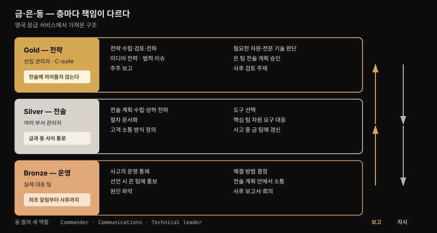
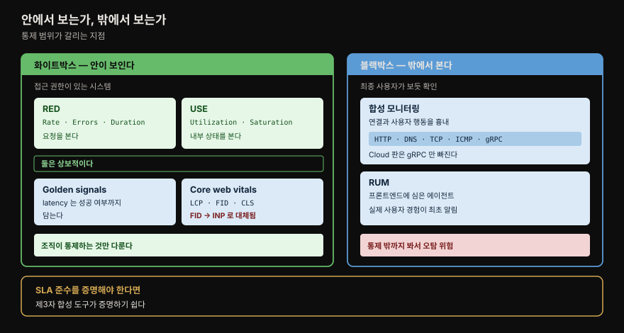
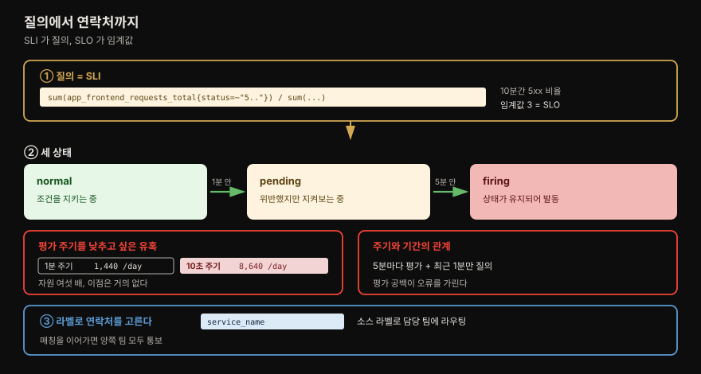
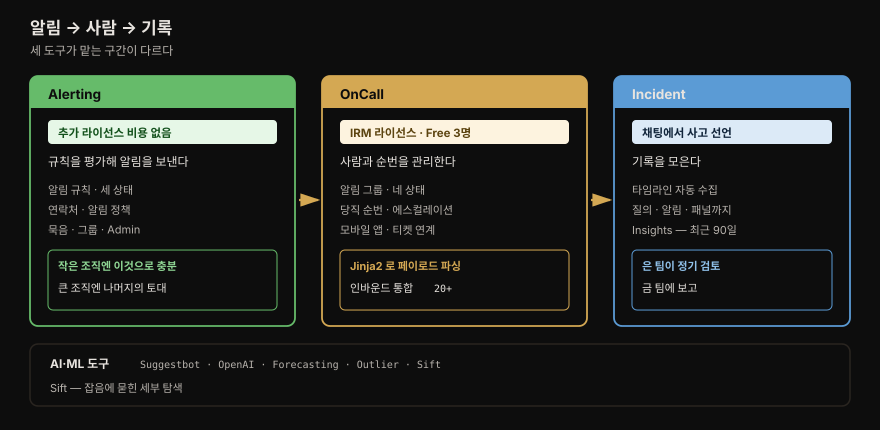

# 사고 관리

---


## 핵심 요약

> **이 장의 절반은 도구가 아니라 조직 이야기입니다.** 저자들은 나쁜 사고 관리가 불안·우울·번아웃을 넘어 **심장마비와 뇌졸중 위험까지 높인다**고 적으며 시작합니다. 관측 도구는 그 부담을 줄이는 수단이지 목적이 아닙니다.
>
> 기술 부분에서 오래 남는 것은 **SLI 를 3~5개로 줄이라**는 규칙과, 알림 평가 주기를 낮출수록 좋다는 직관이 **왜 틀리는지**입니다. 10초마다 평가하면 하루 8,640회로 자원만 여섯 배 듭니다.
>
> Grafana 의 IRM 도구는 셋으로 갈립니다. **Alerting**(규칙과 알림), **OnCall**(당직·에스컬레이션·모바일), **Incident**(타임라인과 사후 검토). Alerting 은 **추가 라이선스 비용이 없고**, OnCall 은 **IRM 사용자 라이선스**에 포함됩니다.


## 학습 목표

1. 금·은·동 지휘 구조에서 각 층이 무엇을 책임지는지 말할 수 있습니다.
2. 화이트박스와 블랙박스 모니터링의 차이와 각자의 한계를 설명할 수 있습니다.
3. SLI 개수를 적게 유지해야 하는 이유를 말할 수 있습니다.
4. 알림 규칙의 세 상태와 평가 주기 설정의 트레이드오프를 판단할 수 있습니다.
5. Alerting·OnCall·Incident 가 각각 어느 문제를 맡는지 구분할 수 있습니다.


## 1. 사고 전 — 역할을 먼저 정합니다

> 사고는 어지럽고 빠르게 변합니다. 누가 무엇을 하는지 그때 정하려 들 자리가 아닙니다.



저자들은 바퀴를 다시 발명하지 말라며 기존 프레임워크 넷을 듭니다 — **ITIL**, **SRE**, **NIST**, **SANS** 사고 대응 프레임워크입니다. 이 넷 모두에 공통으로 나오는 핵심 역할이 셋입니다.

| 역할 | 하는 일 |
|------|--------|
| **Commander** | 결정 권한을 가진 사람. 적임자를 소집하고, 고객 커뮤니케이션을 승인하며, 선임 리더십과의 내부 소통을 맡습니다. **사고 전체를 통제하고 다른 모든 역할이 이 사람에게 보고**합니다 |
| **Communications** | 내부·외부 커뮤니케이션 책임자. 제3자 소통과 고객 대면 소통이 모두 이 역할입니다 |
| **Technical leader** | 여러 팀의 기술 인력을 지휘합니다. **기술적 판단을 한 사람이 내리는 것**이 중요하고, 누가 무엇을 보고 있으며 언제 결과가 나오는지 파악합니다 |

### 금·은·동 — 영국 응급 서비스에서 가져온 구조

저자들이 지적하는 한계가 있습니다. **위 프레임워크의 역할들은 운영 수준에 치우쳐 있습니다.** 그래서 영국 응급 서비스의 **gold–silver–bronze** 지휘 구조를 함께 소개합니다. 전술과 전략 수준의 책임까지 정하는 체계입니다.

이유가 실용적입니다. **조직에 심각한 해를 끼치는 대형 사고를 감당할 계획을 미리 갖는 편이, 사고 중에 그런 계획이 필요하다는 걸 깨닫는 것보다 낫습니다.**

| 층 | 구성 | 책임 |
|----|------|------|
| **Gold — 전략** | 선임 관리자·C-suite | 사고 관리 **전략** 수립·검토·전파 · 필요한 자원과 전문 기술 판단 · **미디어 전략** · **법적 이슈** 고려 · 주주 보고 · **은 팀의 전술 계획 승인** · 사후 검토 주재 |
| **Silver — 전술** | 여러 부서의 관리자 | 전술 계획 수립과 상하 전파 · **절차 문서화** · 고객 소통 방식 정의 · **도구 선택** · 어느 팀이 어느 전략 목표를 맡는지 파악 · 핵심 팀의 자원 요구 대응 · 사고 중 금 팀에 정보 갱신 |
| **Bronze — 운영** | 실제 대응 팀 | 사고의 **운영 통제** · 사고 선언 시 은 팀에 통보 · **원인 파악** · 해결 방법 결정 · 전술 계획 안에서 내외부 소통 · **사후 보고서와 회의** 완수 |

⚠️ 저자들이 금 팀에 붙이는 단서가 날카롭습니다. **금 팀 구성원은 항상 전략 수준에 초점을 유지하고 전술적 결정에 끌려들어 가지 말아야 합니다.** 경영진이 사고 현장에 내려와 기술 결정을 내리기 시작하면 구조가 무너진다는 뜻입니다.

은 팀이 **금과 동 사이 정보가 흐르는 통로** 역할을 한다는 것도 이 구조의 핵심입니다.


## 2. 잡음을 줄여야 신호가 보입니다

> 사고가 언제 어떻게 날지는 알 수 없습니다. 그래서 잡음을 미리 줄여 둡니다.

잡음이 생기는 자리가 둘입니다.

**첫째는 관측 시스템 자체**입니다. 이걸 줄이려면 서비스에 대한 지식이 필요하고, 그래서 **사고가 나기 전에 해 두는 것이 최선**입니다. 저자들이 드는 방법은 넷입니다.

- **핵심 SLI 를 식별하고 문서화**합니다.
- **분산 트레이스**를 써서 모든 호출을 서비스 그래프에서 봅니다.
- **이해하기 쉬운 로그 메시지**를 씁니다.
- **실패를 처리하되 메시지를 폭증시키지 않는 로그**를 씁니다.

이것이 Diego 같은 개발자의 **도메인 지식**을 Ophelia·Steven 같은 사람의 **시스템 경험**과 잇는 장치입니다.

⚠️ AIOps 에 대한 단서가 붙습니다. 많은 도구가 데이터 흐름을 지켜보다 평소와 벗어나면 표시해 주는 기능을 제공하지만, 저자들은 **이것을 핵심 신호를 식별하지 않아도 되는 이유로 삼지 말라**고 못 박습니다. 경험상 **그런 도구가 특정 도메인 지식을 대체하지 못하기 때문**입니다.

**둘째는 커뮤니케이션 채널의 부적절한 사용**입니다. 사고 알림 전용 Slack·Teams 채널에 "지금 사이트 죽었나요?"가 올라오는 상황입니다. 고객 쪽에서도 같은 문제가 생깁니다 — 사소한 이상마다 알리거나, 더 흔하게는 **사고가 났는데 안 알리는** 쪽입니다.

관행 다섯이 제시됩니다.

- **사고 선언과 심각도 판정 권한을 특정 그룹**에 줍니다.
- 사고 선언 시 **커뮤니케이션 대응을 자동화**합니다 (고객용 상태 페이지 갱신, 내부 전용 채널 게시).
- 동 팀을 위한 **보호된 내부 채널**을 둡니다.
- **동↔은, 은↔금 사이 보호된 채널**을 둡니다.
- **상태 메시지를 미리 작성**해 두어 사고 팀이 고르기만 하게 합니다.


## 3. 사고 중 — 화이트박스와 블랙박스

> 서비스가 정상인지 판단할 정보가 있어야 문제를 식별할 수 있습니다. 그 정보를 얻는 방식이 둘로 갈립니다.



**화이트박스 모니터링**은 접근 권한이 있는 시스템을 들여다보는 것입니다. 서비스 상태를 상세히 알려 줍니다. 저자들이 드는 표현 방식이 넷입니다.

| 방식 | 무엇을 보는가 | 어디에 맞는가 |
|------|--------------|--------------|
| **RED** — Rate·Errors·Duration | **요청** 으로 구동되는 서비스. Duration 은 백분위수나 히스토그램으로 표현 | 웹 서버처럼 **요청에 응답하는** 모든 서비스 |
| **USE** — Utilization·Saturation·Errors | 서비스의 **내부 상태**. Saturation 은 자원 부족으로 처리 못한 작업량 | **자원을 제공하는** 서비스 — 스토리지, 쿠버네티스 클러스터 |
| **Golden signals** — latency·traffic·errors·saturation | 위 둘과 강하게 겹칩니다 | 구글 SRE 책 |
| **Core web vitals** — LCP·FID·CLS | **최종 사용자 브라우저**에서 수집. Faro 같은 RUM 에이전트가 수집 | 웹 애플리케이션의 사용자 경험 |

저자들이 RED 와 USE 를 **상보적**이라고 정리하는 대목이 명확합니다. **RED 는 서비스로 오는 요청을 보고, USE 는 서비스의 내부 상태를 봅니다.**

Golden signals 와 RED 의 미묘한 차이도 짚습니다. Traffic 은 RED 의 Rate 와 같고 Latency 는 Duration 과 비슷하지만, **Latency 는 요청의 성공 여부까지 담습니다.** 그래서 **오류가 빠르게 반환돼 duration 이 낮은 상황**과 **서비스가 오류를 주는 데 오래 걸리는 더 곤란한 상황**을 구분할 수 있습니다.

> RED·USE·Golden Signals 의 함정과 결정 매트릭스는 [01-03. 시그널 모델](../../01_Foundations/01-03.시그널%20모델%20—%20Golden%20Signals,%20RED,%20USE.md) 이 정본입니다. 이 장은 **사고 대응 맥락에서 무엇을 고를지**만 봅니다.

Core web vitals 셋은 이렇습니다.

- **LCP**(Largest Contentful Paint) — 페이지의 가장 큰 요소가 렌더된 시점. 예전에 쓰이던 First Contentful Paint·Load·SpeedIndex 등을 대신하는 **현재 web.dev 팀의 권고**입니다.
- **FID**(First Input Delay) — 사용자가 처음 상호작용한 시점부터 브라우저가 이벤트 핸들러를 처리할 수 있게 되기까지.
- **CLS**(Cumulative Layout Shift) — 다른 요소가 렌더되면서 이미 그려진 콘텐츠의 위치가 얼마나 자주 바뀌는가.

### 블랙박스 — 밖에서 본 모습

**블랙박스 모니터링**은 서비스를 미지의 것으로 두고 **최종 사용자가 보듯** 동작하는지 확인합니다. 두 갈래입니다.

**합성 모니터링(synthetic monitoring)** 은 설정 가능한 서비스로 연결과 사용자 행동을 흉내 냅니다. Prometheus 의 **black-box exporter** 가 HTTP·HTTPS·DNS·TCP·**ICMP**(흔히 ping)·**gRPC** 로 엔드포인트에 접속할 수 있습니다.

⚠️ **SLA 준수가 계약 의무일 때** 제3자 합성 도구를 쓰면 SLA 를 지켰는지(혹은 못 지켰는지) 증명하기 쉽습니다. Grafana Cloud 는 이것을 **Synthetic Monitoring** 이라는 관리형 서비스로 제공하며, **gRPC 호출을 제외한 모든 기능**을 지원합니다.

**RUM** 은 프론트엔드 코드에 심은 에이전트로 실제 사용자 데이터를 모읍니다. 블랙박스 모니터링보다 훨씬 넓은 기능을 주지만, **실제 사용자 경험에 근거한 최초 알림**을 주는 데도 쓸 수 있습니다.

⚠️ 블랙박스에는 **오탐 위험**이 따릅니다. 화이트박스가 조직이 통제하는 것만 다루는 반면, **블랙박스는 외부 인터넷 제공자 네트워크나 DNS 처럼 통제 밖 영역까지 포함**하기 때문입니다.

### 영웅 문화에서 벗어나기

저자들이 이 절을 닫는 대목이 이 장의 정서를 보여줍니다. 런북과 견고한 사후 절차가 지식을 옮기고, 그것이 조직을 **영웅 문화(hero culture)** 에서 벗어나게 합니다.

영웅 문화는 **소수가 모든 사고에 대응하며 시스템을 굴러가게 하는 상태**이고, 저자들은 **종종 그들의 건강을 대가로** 한다고 적습니다. 성숙한 조직은 잦은 사고의 혼돈에서 벗어나, 의욕 있는 개인과 조직 전체에 **성장할 여지를 주는** 조직입니다.


## 4. 에스컬레이션과 커뮤니케이션

> 당직자 혼자 빨리 푸는 것이 이상적입니다. 그러지 못할 때를 위해 정책이 필요합니다.

에스컬레이션 정책이 답해야 할 질문들을 저자들이 나열합니다.

- 자동 시스템이 문제를 식별하면 **누구에게** 알리는가?
- 그것이 **업무 시간과 시간 외**에 달라지는가?
- **심각도**에 따라 달라지는가?
- 최초 대응자가 **부재중이면** 누구에게?
- 최초 대응자가 혼자 못 풀면 **누가 인계받는가?** 그 판단 기준은 사고의 **지속 시간·심각도·시각** 중 무엇인가?
- 인계는 **어떻게** 이뤄지는가?
- **여러 사고가 동시에** 나면?

⚠️ 여기에 리더십(Masha)의 책임이 둘 붙습니다. 하나는 **당직자 전원이 정책을 알게 하는 것**입니다. 저자들이 특히 짚는 대상은 **주니어 엔지니어** — 선임 동료를 방해하면 안 된다고 느낄 수 있기 때문입니다. 다른 하나는 **당직 일정을 정기적으로 감사해** 엔지니어를 과로와 번아웃에서 보호하는 것입니다.

커뮤니케이션은 세 갈래로 나뉩니다.

| 갈래 | 핵심 |
|------|------|
| **사고 팀 내부** | 소집 채널은 무엇인가 · **전용 화상 회의 브리지**가 있는가(알림에 접속 정보를 포함) · **기대 응답 시간**은 얼마인가 · 사후 검토를 위해 **어떻게 기록**하는가 |
| **내부** | 커뮤니케이션 리드 책임. 전술 계획이 **갱신 주기**를 정함. 상세할 필요 없음 — **"아직 조사 중이며 해결 중입니다"가 침묵보다 낫습니다** |
| **고객** | 아마 가장 중요. 상태 페이지·이메일·소셜 미디어·SMS·티켓 포털 |

응답 시간에 대한 단서가 인상적입니다. 그것이 **복구 시간에 영향을 주는 동시에**, 사고에 자주 불려 나오는 사람들의 **건강과 웰빙에도 영향**을 주므로 **감시되어야 한다**고 적습니다.

고객 소통에서 저자들이 권하는 것은 **미리 생성해 승인받은 메시지 모음**입니다. 이유가 구체적입니다 — **커뮤니케이션 리드가 새벽 3시에 막 깨어났더라도** 메시지의 톤과 결이 유지되기 때문입니다. **문제가 있을 수 있으나 조사 중**임을 알리는 메시지도 유용합니다. 알림은 받았지만 고객에게 실제 영향이 있는지 확신이 없을 때를 위한 것입니다.


## 5. 사고 후 — 비난 없는 사후 검토

> 사고에서 가장 중요한 것은 조직 전체가 취약점과 절차의 빈틈을 배우는 것입니다.

저자들의 진단이 직설적입니다. 사고가 나면 **비난할 사람이나 부서를 찾는 것이 자연스러운 인간의 경향**이지만, 이것은 **조직의 최선의 이익과 정면으로 배치**됩니다.

비난이 낳는 것이 셋입니다. **부담스러운 절차**, **혁신의 부재**, 그리고 궁극적으로 **조직의 정체**입니다. 직원이 정직하기를 멈추고 **비난받거나 강등되거나 해고되지 않는 것**을 좇게 되기 때문입니다.

**비난 없는 사후 검토(blameless postmortem)** 는 무슨 일이 있었는지 정직하고 객관적으로 살피는 자리이며, 목표는 **진짜 근본 원인을 이해하는 것**입니다. 모든 직원과 부서의 **선의를 전제**해야 합니다.

⚠️ 여기서 저자들이 오해를 명확히 끊습니다. **비난 없는 사후 검토의 목표는 개인이나 팀에게서 책임(accountability)을 없애는 것이 아닙니다.** 책임이 **질책·실직·공개적 망신에 대한 두려움과 함께 오지 않게** 하는 것입니다.

중요한 요소가 넷입니다.

- 실수를 삶의 일부로 받아들이는 **열린 소통**
- **정직함과 실패의 수용**을 권장
- **사건 타임라인의 상세 정보 공유** — 사고 중 내부 소통과 시스템 로그로 뒷받침
- 개선을 **결정하고 승인받기**


## 6. SLI 와 SLO 로 좋은 알림 쓰기

> 알림을 잘 쓰는 일은 SLI 와 목표에 합의하는 순간 훨씬 단순해집니다.

**SLI** 는 현재 서비스 수준을 나타내는 측정값입니다. 예로 저자들이 드는 것은 **15분 동안의 오류 수**입니다.

⚠️ 이 장에서 가장 실무적인 규칙이 여기 있습니다. **SLI 개수를 적게 유지하는 것이 모범 사례이며, 서비스당 3~5개가 좋은 경험칙**입니다. 이유가 셋입니다.

- 혼란이 줄고 팀이 **자기 서비스에 중요한 것에 집중**합니다.
- **가짜 알림(spurious alerts)의 가능성**이 줄어듭니다.
- 지속적 감시의 영향이 작게 유지되어, **도구를 확장하고 운영비를 늘리지 않고도 더 많은 서비스를 감시**할 수 있습니다.

SLI 를 **프랙탈 개념**으로 볼 수 있다는 관점도 나옵니다. 서비스 팀이 더 큰 시스템의 한 구성요소에 대한 지표를 갖듯, **시스템 자체도 소수의 SLI 로 추적**할 수 있습니다 — 예를 들어 **SLO 를 못 지키고 있는 서비스의 개수**입니다.

앞서 본 RED·USE·golden signals·core web vitals 가 **좋은 SLI 후보**입니다. 유일한 선택지는 아니지만 업계 채택률이 높고 잘 이해되어 있으므로, 저자들은 **다른 것을 써야 하는지 팀이 깊이 생각해 보라**고 권합니다.

합의가 되면 알림 작성은 단순해집니다. 구현자는 **SLI 의 비즈니스 서술("15분간 오류 수")을 LogQL 이나 PromQL 질의로 옮기고, 설정된 목표에 근거해 임계값을 만들면** 됩니다. 이렇게 쓴 알림은 **이해하기도 쉽습니다.**

| 용어 | 정의 | 예시 |
|------|------|------|
| **SLI** | 현재 서비스 수준을 나타내는 **측정값** | 15분 동안의 오류 수 |
| **SLO** | SLI 에 대해 **내부적으로 합의한** 허용 목표 | 10분 동안 오류 응답이 **3% 이하** |
| **SLA** | 클라이언트·사용자와 맺은 **합의**. 법적 계약일 수 있음. 여러 SLI·SLO 로 구성 | 가동률 **99.9%** |

**에러 버짓**도 언급됩니다. 저자들의 정의로는 **다른 SLO 들의 충족 여부를 측정하는 SLO** 입니다. 초과하면 서비스가 어떤 식으로든 불안정하다는 좋은 지표이고, 팀의 에너지를 **개선에 집중시키는 방아쇠**가 되어야 합니다.

반대 방향이 흥미롭습니다. **에러 버짓이 넉넉하면 팀에 실험할 여지를, 심지어 계획적으로 서비스를 내려 볼 여지를** 줍니다. 계획되지 않은 장애에서 봤다면 치명적이었을 문제를 드러낼 좋은 기회이기 때문입니다.

> 에러 버짓 계산, **Burn Rate 알림**(SRE Workbook Ch.5 표준 패턴), Symptom-based 대 Cause-based 알람, alertmanager 룰 YAML 한 벌은 [01-04. SLO와 알림](../../01_Foundations/01-04.SLO와%20알림%20—%20Error%20Budget,%20Burn%20Rate.md) 이 정본입니다. 이 장은 개념 정의와 사고 대응 연결까지만 다룹니다.


## 7. Grafana Alerting — 규칙·연락처·정책

> IRM 도구 셋 중 첫째이며 **추가 라이선스 비용이 없습니다.** 작은 조직엔 그 자체로 해답이고, 큰 조직에선 나머지의 토대입니다.



메인 메뉴의 **Alerts & IRM** 탭에서 접근합니다. Grafana Alerting 은 사용자가 만든 알림 규칙을 **지속적으로 평가**해 알림 상태를 판정하고, 정해진 단계를 따라 선택된 채널로 메시지를 보냅니다.

### 알림 규칙 만들기

4장·5장에서 LogQL 과 PromQL 을 익혔다면 익숙하게 느껴질 화면입니다. 저자들이 예로 드는 질의가 이렇습니다.

```promql
sum(app_frontend_requests_total{status=~"5.."}) / sum(app_frontend_requests_total)
```

기간은 10분입니다. **전체 요청 중 5xx 로 끝난 비율**을 계산하며, **이것이 SLI** 입니다.

**Expressions** 절에서 반환된 시계열을 어떻게 축약할지 정합니다. 이 예에서는 마지막 이벤트를 쓰지만, **엔드포인트별 오류를 본다면 최댓값**을 골라 가장 높은 오류율을 보게 할 수도 있습니다. **Threshold** 로 알림 발동 시점을 정하는데, 여기서는 **오류 비율이 3 을 넘을 때**이고 **이것이 SLO** 입니다.

### 세 상태와 평가 주기

알림 규칙은 **normal · pending · firing** 세 상태를 가집니다. 평가 그룹은 같은 평가 주기로 그룹 내 규칙을 **순차 평가**합니다.

저자들의 예시 설정이 구체적입니다. 프론트엔드 서비스의 RED 메트릭을 담은 `frontend` 그룹을 만듭니다. 업무상 중요하므로 **평가 주기는 1분, pending 주기는 5분**입니다. 오류 비율이 3 을 넘으면 **1분 안에 pending 으로 들어갑니다.** 그 상태가 유지되면 **5분 안에 알림이 발동**합니다.

⚠️ 이 절에서 가장 실무적인 경고가 나옵니다. **이 값들을 가능한 한 낮게(10초) 두고 싶은 유혹이 크지만 의도치 않은 결과를 낳습니다.**

| 평가 주기 | 하루 질의 수 |
|----------|-------------|
| 1분마다 | **1,440회** |
| 10초마다 | **8,640회** |

**연산 자원은 상대적으로 싸지만 Grafana 가 요구하는 자원이 여섯 배로 늘고, 아마 이점은 거의 없습니다.**

또 하나는 **평가 주기와 질의 기간의 상호작용**입니다. **5분마다 평가하는데 질의가 최근 1분만 본다면 평가되지 않는 시간이 생기고, 그것이 진짜 간헐적 오류를 가릴 수 있습니다.**

### 주석과 알림 설정

**Annotations** 는 알림 발동 시 연락처로 보낼 정보를 담습니다. 모범 사례가 명확합니다.

- **어느 서비스이고 무엇이 문제인지** 담은 읽기 쉬운 요약
- description 에 더 상세한 설명
- **런북 URL 과 대시보드 링크**

대응자가 문제를 빨리 이해하고 복구 단계를 따라갈 수 있게 하는 것이 목적입니다.

**Configure notifications** 에서는 라벨을 답니다. 라우팅 관리에 쓰이며, **Preview Routing** 버튼으로 현재 설정에서 알림이 어떻게 라우팅될지 볼 수 있습니다.

### 연락처·알림 정책·묵음

| 개념 | 하는 일 |
|------|--------|
| **Contact points** | 관리자가 설정. **이름 + 하나 이상의 통합**. 보통 문제를 처리할 팀 단위. webhook·Kafka 메시지 큐 통합으로 단순 알림을 넘는 연계도 가능. **알림 템플릿**으로 여러 연락처의 메시지 구조를 표준화 |
| **Notification policies** | 알림 규칙에서 발동한 알림을 연락처에 연결. **중첩 가능**하고 **mute timing** 으로 업무 외 시간 묵음 |
| **Silences** | 알림이 생성되지 않는 정해진 기간. **유지보수 기간** 관리용 |

⚠️ 알림 정책의 값진 기능 하나를 저자들이 짚습니다. **Loki 나 Prometheus/Mimir 소스의 라벨로 알림을 매칭**할 수 있다는 것입니다. 소스 텔레메트리의 라벨을 그대로 써서 **그 서비스를 책임지는 팀에 라우팅**할 수 있습니다 — OpenTelemetry 데모라면 `service_name` 라벨로 팀을 가르는 식입니다.

**같은 중첩 수준의 규칙은 매칭을 계속 이어갈 수 있어**, 서비스 팀과 중앙 운영 팀 **양쪽에 동시 통보**하는 구성이 가능합니다.

**Groups** 는 그룹화된 알림을 보여주며, 알림이 정의됐지만 **데이터를 보내지 않는 데이터 소스**도 여기 표시됩니다. **Admin** 페이지는 Alertmanager 설정을 JSON 으로 제공해 **다른 인스턴스로 옮기거나 백업**할 수 있게 합니다.


## 8. Grafana OnCall 과 Incident

> Alerting 이 규칙이라면 OnCall 은 사람의 문제이고, Incident 는 기록의 문제입니다.



### OnCall — 당직과 에스컬레이션

Alerting 위에 얹혀 다음을 더합니다.

- **외부 감시 시스템들**의 알림 소비
- 사고 중 잡음을 줄이는 **알림 그룹화**
- 알림 그룹이 **언제 통보할지** 지정
- **당직 순번과 에스컬레이션 경로** 정의
- 알림 채널 확장 — **ServiceNow·Jira·Zendesk 티켓 생성·갱신**, 현재 당직자 직접 통보, **엔지니어용 모바일 앱**

라이선스는 IRM 사용자 라이선스에 포함됩니다. **Cloud Free 는 3명**, **Pro·Advanced 는 5명**이며 집필 시점 기준 **추가 사용자는 월 20달러**입니다.

**알림 그룹**은 하나 이상의 개별 알림으로 구성되고, 그룹화 동작은 적용된 **통합 템플릿**이 정합니다. 상태는 **firing · acknowledged · silenced · resolved** 넷입니다. 당직 엔지니어나 에스컬레이션 체인의 행동이 상태를 바꿉니다.

웹 화면의 기능은 **통합 소통 채널·모바일 앱·전화·SMS** 에서도 그대로 쓸 수 있습니다. 엔지니어는 추가 대응자를 부르거나, **Incident 의 절차를 발동시키기 위해 사고를 선언**하거나, 관련 알림 그룹들을 **합칠** 수 있습니다.

**인바운드 통합**은 현재 **20개 이상**이고 인바운드 webhook 으로 어떤 시스템과도 연계됩니다. **Prometheus 호환 alert manager** 라면 무엇이든 통합할 수 있으며 Grafana Cloud 에는 `Grafana` 라는 기본 alert manager 가 설정돼 있습니다.

**Templates** 블록은 OnCall 이 JSON 페이로드를 파싱하는 방식을 보여주며 **Jinja2** 를 씁니다. Grafana Alerting 템플릿에서는 `payload.groupKey` 값으로 그룹화 ID 필드를 만들고, `payload.status` 가 resolved 면 알림 그룹도 해소됩니다. **알림 소스가 해소 갱신까지 보낼 수 있다**는 뜻입니다.

Jinja 문법에서 저자들이 짚는 것은 **반복문·조건문·함수·공백 관리** 넷입니다. Grafana 가 추가한 함수도 있습니다 — `time`·`tojson_pretty`·`iso8601_to_time`·`datetimeformat`·`regex_replace`·`regex_match`·`b64decode`.

공백 관리가 실무에서 자주 걸립니다. 블록 앞뒤에 **빼기 기호(`-`)** 를 붙이면 그 앞뒤 공백이 제거되고, **더하기 기호(`+`)** 는 유지를 뜻합니다.

**에스컬레이션 체인**의 단계들이 이 도구의 값입니다.

- **Wait** — 지정 시간 대기 후 다음 단계
- **Notify users** / **Notify users from on-call schedule**
- **Resolve incident automatically** — 즉시 해소 처리
- **Notify whole Slack channel** / **Notify Slack User Group**
- **Trigger outgoing webhook**
- **Notify users one by one (round robin)** — 순차·라운드로빈
- **Continue escalation if current time is in range** — **업무 외 시간 에스컬레이션 중지**에 쓰임
- **Continue escalation if >X alerts per Y minutes** (베타)
- **Repeat escalation from beginning** — **최대 5회** 반복

⚠️ 사용자에게 통보가 갈 때는 **그 사용자의 개인 통보 단계**를 따릅니다. 사용자 페이지가 전원의 통보 단계 상태를 보여주고, **설정하지 않은 사용자는 경고로 표시**됩니다.

**스케줄**은 표준 순환과 예외(override)를 지원하며, **현재 당직 교대와 배정되지 않은 교대를 Slack 채널에 통보**합니다.

### Incident — 타임라인과 사후 검토

셋째 도구입니다. Slack 같은 채팅 도구와 통합해 **거기서 사고를 선언**할 수 있게 합니다.

선언되면 **설정된 통합에 따라** 여러 일이 자동으로 일어납니다. 저자들이 예로 드는 것이 셋입니다.

- **화상 회의 시작**
- **상태 페이지 도구 갱신**
- **GitHub 맥락을 타임라인에 추가**

원문은 여기에 "등(and so on)"을 붙여 목록을 열어 둡니다. 구성원은 역할을 정하고 작업을 배정할 수 있습니다.

**사고 중** — commander 와 여러 investigator 를 지정하고, 미리 정의한 태그와 심각도를 붙입니다. investigator 는 텍스트 갱신과 함께 **실행한 질의·발동한 알림·방문한 패널**까지 타임라인에 기록합니다.

**사고 후** — 수집된 정보가 타임라인으로 정리됩니다. **Insights** 페이지는 기본으로 **최근 90일** 전체 사고의 상위 수준 지표를 보여줍니다.

⚠️ 저자들이 여기에 조직 절차를 붙입니다. **은 팀이 이 페이지를 정기 공식 절차의 일부로 검토하고 금 팀에 보고하는 것이 모범 사례**입니다. 사고가 잘 처리되고 개선 작업이 일정에 잡히는지 확인해, 사고의 빈도와 영향을 줄이기 위함입니다.

AI·ML 도구도 딸려 옵니다.

| 도구 | 하는 일 |
|------|--------|
| **Suggestbot** | NLP 로 사고 중 대화를 분석해 **관련 제목의 대시보드를 제안** |
| **OpenAI 통합** (집필 시점 공개 프리뷰) | 타임라인을 요약으로 증류. **사고 요약·사건 타임라인·조치 내역** 생성. OpenAI 계정 필요 |
| **ML Forecasting** | 과거 상태 모델로 미래 상태 예측. **메트릭 데이터 전용**(Prometheus·Graphite·Loki 메트릭 질의) |
| **ML Outlier Detection** | 정상 범위 모델을 만들어 벗어난 지점 강조 |
| **ML Sift** (공개 프리뷰) | 잡음에 묻힐 세부를 찾아냄 — **오류 로그 패턴, K8s 클러스터 크래시, 부하 높은 노드, 자원 스로틀링 컨테이너, 최근 배포, Tempo 의 느린 요청** |


## 책 밖으로 잇기

> 이 장의 내용을 지금 적용할 때 달라지는 지점을 확인합니다.

**FID 는 이미 대체됐습니다.** 이 책은 Core Web Vitals 로 LCP·FID·CLS 셋을 듭니다. 그러나 **2024년 3월 12일 INP(Interaction to Next Paint)가 Core Web Vital 이 되면서 FID 를 대체**했습니다. FID 는 그날 Search Console 에서 바로 제거됐고, PageSpeed Insights·CrUX 등 나머지 도구는 **6개월 유예** 후 정리됐습니다. 지금 이 셋을 SLI 로 잡는다면 **LCP·INP·CLS** 가 맞습니다.

> **책 밖 —** 위 INP 전환은 원문에 없습니다. 집필 시점(2023) 이후의 변화이며 2026-08-02 에 1차 자료로 확인했습니다. 출처: [web.dev — INP](https://web.dev/articles/inp) (INP 가 stable Core Web Vital 이며 FID 의 후속), [web.dev — INP becomes a Core Web Vital](https://web.dev/blog/inp-cwv-march-12) (날짜와 유예 기간).

**가격과 라이선스는 확인이 필요합니다.** OnCall 의 "추가 사용자 월 20달러", "Free 3명 / Pro·Advanced 5명"은 저자들이 **집필 시점 기준**이라고 명시한 값입니다. 지금 도입을 검토한다면 Grafana 공식 가격 페이지로 다시 확인해야 합니다.

**OpenAI 통합과 Sift 는 당시 공개 프리뷰**였습니다. 정식 출시 여부와 기능 범위가 달라졌을 수 있습니다.


## 결정 치트시트

> 사고 관리를 설계할 때 갈리는 지점만 모았습니다.

| 상황 | 선택 | 근거 |
|------|------|------|
| 요청 기반 서비스를 감시 | **RED** | 웹 서버 등 요청에 응답하는 것 |
| 자원 제공 서비스를 감시 | **USE** | 스토리지·K8s 클러스터 |
| 오류를 빨리 뱉는 것과 느리게 뱉는 것을 구분 | **Golden signals 의 latency** | duration 과 달리 성공 여부를 담음 |
| 웹 사용자 경험을 감시 | **Core web vitals** + RUM | 브라우저에서 수집 |
| SLA 준수를 증명해야 함 | **제3자 합성 모니터링** | 계약 의무 입증에 유리 |
| 통제 밖 영역(외부 DNS 등)까지 봐야 함 | **블랙박스** | 단 오탐 위험 감수 |
| SLI 개수를 정해야 함 | **서비스당 3~5개** | 가짜 알림·감시 비용 억제 |
| 평가 주기를 정해야 함 | **1분** 수준에서 출발 | 10초는 하루 8,640회, 자원 6배 |
| 질의 기간과 평가 주기 | **기간 ≥ 주기** | 5분 평가 + 1분 질의는 공백을 만듦 |
| 알림을 팀별로 보내야 함 | **소스 라벨 매칭** | `service_name` 등으로 라우팅 |
| 서비스 팀과 중앙 팀 모두 통보 | **같은 수준 규칙의 continue matching** | 중첩 정책 |
| 업무 외 시간 에스컬레이션 중지 | **Continue escalation if time in range** | OnCall 체인 단계 |
| 유지보수 중 알림 억제 | **Silences**(Alerting) 또는 **maintenance**(OnCall) | 목적이 같고 층이 다름 |
| 사후 검토 자료를 남겨야 함 | **Grafana Incident 타임라인** | 질의·알림·패널까지 자동 수집 |


## Spring 앱 개발 관점

> 이 장은 조직 절차와 SaaS 도구가 중심이라 코드가 거의 없습니다. 앱 쪽에서 준비할 것만 짚습니다.

알림 규칙의 예시 질의가 `app_frontend_requests_total{status=~"5.."}` 였습니다. **`status` 가 라벨로 붙어 있어야 5xx 만 골라낼 수 있습니다.** 8장에서 본 `method` 와 같은 이야기입니다 — **알림에서 무엇으로 가를지가 계측 시점의 라벨 설계로 거슬러 올라갑니다.**

알림 정책의 라벨 매칭도 같습니다. `service_name` 으로 팀을 가르려면 그 라벨이 **텔레메트리에 실려 있어야** 합니다. 7장에서 본 Kubernetes Attributes Processor 가 붙이는 속성이 여기서 쓰입니다.

런북 URL 을 주석에 넣으라는 권고는 앱 쪽에도 함의가 있습니다. **알림 하나마다 대응 문서가 있어야 한다**는 뜻이고, 그것은 곧 **알림을 함부로 늘리지 못한다**는 제약이 됩니다. SLI 를 3~5개로 줄이라는 규칙과 같은 방향입니다.

> **책 밖 —** 위 세 문단의 연결(라벨 설계·7장 Processor·런북과 알림 개수의 관계)은 원문에 없는 제 정리입니다.


## 면접에서 받을 만한 질문

1. 금·은·동 지휘 구조에서 각 층은 무엇을 책임집니까?
2. 화이트박스와 블랙박스 모니터링의 차이는 무엇이고, 블랙박스의 위험은 무엇입니까?
3. RED 와 USE 는 어떻게 상보적입니까?
4. Golden signals 의 latency 가 RED 의 duration 과 다른 점은 무엇입니까?
5. SLI 를 3~5개로 유지하라는 이유는 무엇입니까?
6. 알림 평가 주기를 10초로 두면 무엇이 문제입니까?
7. 비난 없는 사후 검토가 책임을 없애는 것이 아니라는 말은 무슨 뜻입니까?
8. Alerting·OnCall·Incident 는 각각 어느 문제를 맡습니까?


## 정답 (자답 후 펼치기)

### 정답 1 — 금·은·동

- **금 — 전략**: 선임 관리자·C-suite. 전략 수립, 미디어 전략, 법적 이슈, 주주 보고, 은 팀의 전술 계획 승인, 사후 검토 주재.
- **은 — 전술**: 부서 관리자들. 전술 계획과 절차 문서화, 도구 선택. **금과 동 사이 정보 통로** 역할.
- **동 — 운영**: 실제 대응 팀. 운영 통제, 원인 파악, 해결 결정, 사후 보고.

핵심은 **금 팀이 전술적 결정에 끌려들어 가지 않아야 한다**는 것입니다.

### 정답 2 — 화이트박스와 블랙박스

**화이트박스**는 접근 권한이 있는 시스템을 상세히 들여다봅니다(RED·USE·golden signals·core web vitals). **블랙박스**는 서비스를 미지의 것으로 두고 **최종 사용자가 보듯** 확인합니다(합성 모니터링·RUM).

블랙박스의 위험은 **오탐**입니다. 화이트박스가 조직 통제 아래 것만 다루는 반면, 블랙박스는 **외부 인터넷 제공자 네트워크나 DNS 처럼 통제 밖 영역**까지 포함하기 때문입니다.

### 정답 3 — RED 와 USE

**RED 는 서비스로 들어오는 요청을 보고, USE 는 서비스의 내부 상태를 봅니다.** 그래서 상보적입니다. RED 는 요청에 응답하는 서비스(웹 서버)에, USE 는 자원을 제공하는 서비스(스토리지·K8s 클러스터)에 맞습니다.

### 정답 4 — latency 대 duration

**latency 는 요청의 성공 여부까지 담습니다.** 그래서 **오류가 빠르게 반환돼 duration 이 낮은 상황**과 **서비스가 오류를 주는 데 오래 걸리는 더 곤란한 상황**을 구분할 수 있습니다. duration 만 보면 둘이 섞입니다.

### 정답 5 — SLI 를 적게

셋입니다.

- **혼란이 줄어** 팀이 중요한 것에 집중합니다.
- **가짜 알림 가능성**이 줄어듭니다.
- 지속 감시의 영향이 작아 **도구를 확장하거나 운영비를 늘리지 않고도 더 많은 서비스를 감시**할 수 있습니다.

경험칙은 **서비스당 3~5개**입니다.

### 정답 6 — 10초 평가

**하루 질의가 1,440회에서 8,640회로 늘어 Grafana 가 요구하는 자원이 여섯 배가 되지만 이점은 거의 없습니다.** 별개로 **평가 주기와 질의 기간의 관계**도 봐야 합니다. 5분마다 평가하는데 질의가 최근 1분만 보면 **평가되지 않는 시간**이 생겨 간헐적 오류를 가립니다.

### 정답 7 — 비난 없는 사후 검토

**책임(accountability)을 없애는 것이 아닙니다.** 책임이 **질책·실직·공개적 망신에 대한 두려움과 함께 오지 않게** 하는 것입니다. 비난은 부담스러운 절차와 혁신 부재, 조직 정체를 낳습니다. 직원이 정직하기를 멈추기 때문입니다.

### 정답 8 — 도구 셋

- **Alerting** — 알림 규칙 평가와 통보. **추가 라이선스 비용 없음**. 작은 조직엔 그 자체로, 큰 조직엔 토대.
- **OnCall** — 외부 시스템 알림 수용, 그룹화, **당직 순번과 에스컬레이션 경로**, 모바일 앱, 티켓 시스템 연계.
- **Incident** — 채팅 도구에서 사고 선언, **타임라인 자동 수집**(질의·알림·패널), Insights 로 사후 검토.


## 핵심 개념 체크리스트

- [ ] 금·은·동 각 층의 책임을 말할 수 있는가?
- [ ] 금 팀이 전술 결정에 끼어들면 안 되는 이유를 아는가?
- [ ] 사고 전에 잡음을 줄이는 네 가지 실천을 말할 수 있는가?
- [ ] AIOps 가 도메인 지식을 대체하지 못한다는 단서를 아는가?
- [ ] RED·USE·golden signals·core web vitals 를 구분할 수 있는가?
- [ ] 합성 모니터링과 RUM 의 차이를 말할 수 있는가?
- [ ] 블랙박스의 오탐 위험이 어디서 오는지 아는가?
- [ ] 영웅 문화가 무엇이고 왜 문제인지 말할 수 있는가?
- [ ] SLI·SLO·SLA 를 예로 구분할 수 있는가?
- [ ] SLI 를 3~5개로 유지하는 세 가지 이유를 아는가?
- [ ] 알림 규칙의 세 상태를 말할 수 있는가?
- [ ] 평가 주기와 질의 기간의 관계를 설명할 수 있는가?
- [ ] 소스 라벨로 팀에 라우팅하는 방법을 아는가?
- [ ] 비난 없는 사후 검토의 목표를 정확히 말할 수 있는가?
- [ ] Alerting·OnCall·Incident 의 경계를 그을 수 있는가?


## 참고 자료

- 원본 — 《Observability with Grafana》(Packt, ISBN 9781803248004) Ch9. Managing Incidents Using Alerts
- [Emergency response and recovery (UK 정부)](https://www.gov.uk/government/publications/emergency-response-and-recovery) — 금·은·동 구조의 출처
- [Atlassian Incident Handbook](https://www.atlassian.com/incident-management/handbook)
- [ServiceNow — What is incident management?](https://www.servicenow.com/uk/products/itsm/what-is-incident-management.html)
- [Google SRE — Managing Incidents](https://sre.google/sre-book/managing-incidents/) · [Incident Response](https://sre.google/workbook/incident-response/)
- [Grafana — 알림 템플릿 설정 가이드](https://grafana.com/docs/grafana/latest/alerting/manage-notifications/template-notifications/)
- [Jinja 공식 사이트](https://jinja.palletsprojects.com)
- [web.dev — INP](https://web.dev/articles/inp) · [INP becomes a Core Web Vital (2024-03-12)](https://web.dev/blog/inp-cwv-march-12) — FID 대체 (책 밖)


## 관련 문서

- [README](README.md) — 이 책의 정독 노트 목차
- [08-01 대시보드](08-01.대시보드%20—%20목적%20정의·시각화%20선택·인지%20부하%20줄이기.md) — 8장이 미룬 USE·RED 가 여기서 나옵니다
- [01-03 시그널 모델](../../01_Foundations/01-03.시그널%20모델%20—%20Golden%20Signals,%20RED,%20USE.md) — RED·USE·Golden Signals 정본
- [01-04 SLO와 알림](../../01_Foundations/01-04.SLO와%20알림%20—%20Error%20Budget,%20Burn%20Rate.md) — 에러 버짓·Burn Rate·알림 룰 YAML 정본
- [07-01 인프라 관측](07-01.인프라%20관측%20—%20쿠버네티스%20수집기와%20클라우드%203사%20연결.md) — 라벨을 붙이는 K8s Attributes Processor
