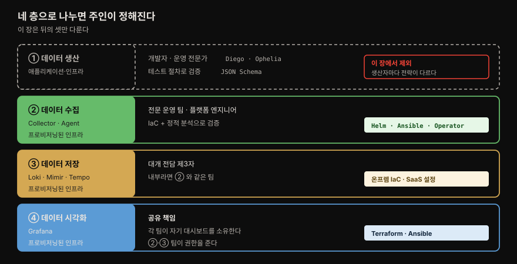
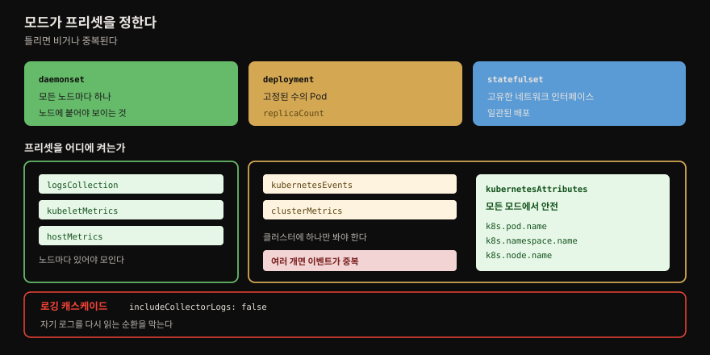
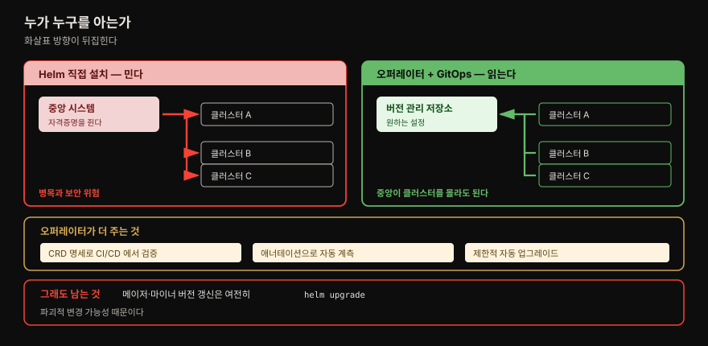
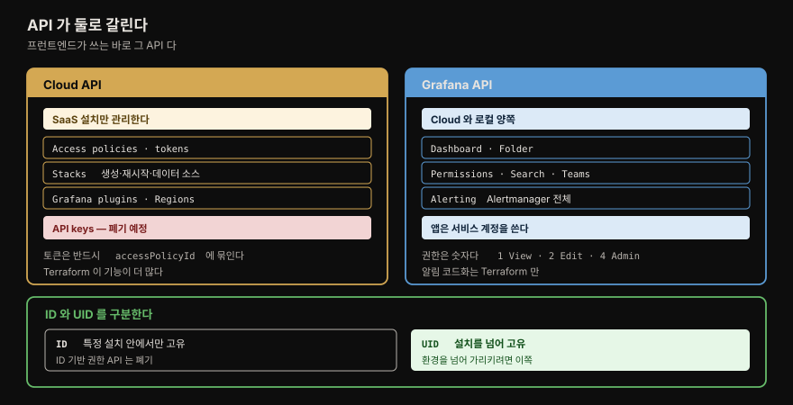

# 코드형 인프라

---


## 핵심 요약

> **관측 플랫폼을 네 층으로 쪼개면 누가 무엇을 자동화할지가 정해집니다.** 생산·수집·저장·시각화이고, 이 장은 **뒤의 셋만** 다룹니다. 생산 계층은 데이터 생산자 종류마다 전략이 달라 너무 넓기 때문입니다.
>
> 기술적으로 오래 남는 것은 **Helm 의 `--values` 우선순위 규칙**입니다. 여러 파일을 겹쳐 비밀을 분리할 수 있지만, **마지막 파일이 이기고 배열은 병합되지 않습니다.**
>
> 나머지 절반은 Grafana 를 코드로 관리하는 이야기입니다. API 가 둘로 갈리고(**Cloud API** 와 **Grafana API**), Terraform 과 Ansible 이 그 위에 얹힙니다. **알림 관리는 Terraform 만 됩니다** — Ansible 컬렉션이 따라오지 못했습니다.


## 학습 목표

1. 관측 플랫폼의 네 계층과 각 계층의 책임 주체를 말할 수 있습니다.
2. 수집기 배포 모드 셋과 프리셋의 대응 관계를 판단할 수 있습니다.
3. Helm 의 값 파일 우선순위 규칙과 그 함정을 설명할 수 있습니다.
4. Helm 직접 설치와 오퍼레이터 방식의 차이를 말할 수 있습니다.
5. Cloud API 와 Grafana API 의 경계를 구분할 수 있습니다.


## 1. 자동화가 무엇을 바꾸는가

> 자동화의 값은 반복 노동을 줄이는 데 그치지 않습니다. **전문가의 시간을 옮기는** 것이 핵심입니다.

저자들이 드는 이점입니다. 원문은 "여러 이점이 있으며 그중에는" 이라고 열어 두므로 아래가 전부는 아닙니다.

- **수작업 절차의 위험을 줄입니다.**
- **도메인 전문가가 개발자를 위한 자동화를 제공**합니다. 개발 팀은 낯선 시스템을 올바로 쓰고 있다는 확신을 얻습니다. 이때 옮겨지는 지식이 셋입니다 — 텔레메트리의 **데이터 아키텍처**, 반복 가능한 **시스템 아키텍처**, 데이터 시각화 관리의 **모범 사례**.
- 자동화를 제공함으로써 **도메인 전문가는 더 값진 일에 집중**할 수 있습니다. 팀이 더 단순하고 친절한 시스템으로 스스로 처리하게 되기 때문입니다.
- **골든 패스(golden path)** 를 제공해 개발 팀이 관측을 쉽고 빠르게 채택하게 합니다.
- **모범 사례와 운영 절차의 확장**이 쉬워집니다. ⚠️ 저자들이 특히 짚는 것은 **성장하는 조직**입니다. 팀이 몇 개일 때 통하던 절차가 수십 개로 늘면 통하지 않습니다.
- **비용 정보가 항상 귀속 가능**해집니다.

두 번째와 세 번째가 짝을 이룹니다. 자동화는 전문가가 일을 *덜 하는* 장치가 아니라, **반복적이고 값이 낮은 일을 조직의 다른 곳으로 옮기는** 장치입니다.


## 2. 네 층으로 나눕니다

> 어느 층을 이야기하는지 분명히 하려는 분할입니다. 층마다 **관심 있는 청중이 다릅니다.**



| 계층 | 누가 관리하는가 | 자동화는 무엇으로 |
|------|----------------|------------------|
| **① 데이터 생산** | 개발자(Diego) 또는 운영 전문가(Ophelia) | 애플리케이션·컴포넌트 테스트 절차의 일부로 검증. 데이터 스키마를 쓴다면 **JSON Schema** 같은 도구로 확인 |
| **② 데이터 수집** | 전문 운영 팀 · 관측 엔지니어 · SRE · 플랫폼 엔지니어 | **프로비저닝된 인프라**. IaC 도구와 **정적 분석 도구**(가능한 경우)로 인프라 검증 |
| **③ 데이터 저장** | 대개 전담 제3자. 조직 내부라면 보통 **수집 계층과 같은 팀** | IaC 로 온프렘 자원을 프로비저닝하거나, Grafana Labs 같은 SaaS 를 IaC 설정으로 |
| **④ 데이터 시각화** | **공유 책임.** 시스템을 관리하는 개발자·운영자가 자기 대시보드를 소유하도록 권한을 받음 | ③ 과 동일 |

⚠️ 이 장은 **②·③·④ 만 다룹니다.** ① 이 중요하지 않아서가 아니라 **영역이 넓고 데이터 생산자 유형마다 자동화 전략이 다르기** 때문입니다. 저자들은 대부분의 경우 팀이 **사용하는 라이브러리나 제3자 시스템이 이미 수행한 테스트에 기댈 수 있다**고 정리합니다.

④ 의 책임 서술이 이 표에서 가장 값집니다. **수집·저장 계층을 관리하는 팀이 조직의 나머지에게 권한을 주는 팀**이라는 구도입니다. 시각화를 중앙 팀이 독점하지 않고 각 팀이 자기 대시보드를 갖게 만드는 것이 목표입니다.


## 3. 수집 계층 — 모드가 프리셋을 정합니다

> Helm 은 쿠버네티스, Ansible 은 가상·베어메탈. 도구는 배포 대상이 정합니다.



두 도구의 성격이 이렇습니다.

- **Helm** — 쿠버네티스 애플리케이션을 패키징·관리합니다. 차트 하나가 애플리케이션에 필요한 여러 쿠버네티스 컴포넌트의 설정 파일을 모두 담고, 보통 변수 설정까지 처리합니다.
- **Ansible** — 운영을 반복 가능한 **플레이북**으로 표준화합니다. 단순한 YAML 로 취할 행동을 정의하고 **OpenSSH 로 대상 서버에 접속**합니다. 이 장에서는 가상·베어메탈 환경에 쓰지만 쿠버네티스 관리에도 쓸 수 있습니다.

### 배포 모드 셋

`mode` 블록이 수집기가 쿠버네티스에 어떻게 배포될지를 정합니다.

```yaml
mode: deployment
```

| 모드 | 어떻게 배포되는가 |
|------|------------------|
| **deployment** | **고정된 수의 Pod** 로 배포됩니다(쿠버네티스 용어로 `replicaCount`) |
| **daemonset** | 클러스터의 **모든 노드마다** 수집기 하나 |
| **statefulset** | **고유한 네트워크 인터페이스**와 일관된 배포 |

저자들이 이 책의 참조 시스템에 `deployment` 를 쓴 이유가 구체적입니다. **단일 노드 클러스터에 배포될 것을 알기 때문**이고, 그래야 **다중 노드 클러스터에서라면 따로 썼을 프리셋들을 한데 묶을 수 있기** 때문입니다.

> 모드 선택 기준은 11장(아키텍처)에서 다룬다고 저자들이 미룹니다. 모드는 **조합해서** 특정 기능을 낼 수도 있습니다.

### 프리셋과 모드의 대응

```yaml
presets:
  logsCollection:
    enabled: true
    includeCollectorLogs: false
  kubernetesAttributes:
    enabled: true
  kubernetesEvents:
    enabled: true
  clusterMetrics:
    enabled: true
  kubeletMetrics:
    enabled: true
  hostMetrics:
    enabled: true
```

켜고 끄는 것뿐이지만 **어느 모드에서 켜야 하는지가 갈립니다.** 이것이 이 절의 핵심입니다.

| 프리셋 | 무엇을 모으는가 | 권장 모드 |
|--------|----------------|----------|
| **logsCollection** | 컨테이너 표준 출력의 로그 | **daemonset** 에서만 쓰기를 권장 |
| **kubernetesAttributes** | 로그·메트릭·트레이스 수신 시 K8s 메타데이터(`k8s.pod.name`·`k8s.namespace.name`·`k8s.node.name`) | **모든 모드에서 안전** |
| **kubernetesEvents** | 클러스터 이벤트를 로그 파이프라인에 발행 | **deployment 또는 statefulset** — 이벤트 중복 방지 |
| **clusterMetrics** | 클러스터 전체 | **deployment 또는 statefulset** |
| **kubeletMetrics** | kubelet 이 관리하는 노드·Pod·컨테이너 | **daemonset** |
| **hostMetrics** | 호스트에서 직접 — CPU·메모리·디스크 사용량 | **daemonset** |

⚠️ `includeCollectorLogs: false` 에 붙은 이유가 재밌습니다. **로깅 캐스케이드(logging cascade)** 를 막기 위함입니다 — 수집기가 자기 로그 출력을 읽어 그 출력에 다시 쓰고, 그걸 또 읽는 순환입니다.

> 7장의 수집기 일곱 개와 배포 형태 논의가 [07-01](07-01.인프라%20관측%20—%20쿠버네티스%20수집기와%20클라우드%203사%20연결.md) 에 있습니다. 그 편이 수신기 단위였다면 이 장은 **Helm 프리셋 단위**입니다.

### config 블록의 구성

파이프라인은 넷으로 이뤄집니다.

| 요소 | 자리 |
|------|------|
| **receivers** | 파이프라인의 **시작**. 데이터를 받아 다른 컴포넌트가 쓸 수 있게 변환해 넣습니다 |
| **processors** | 파이프라인 **중간**. 여러 기능을 수행하며 지원 프로세서와 기여 프로세서가 있습니다 |
| **exporters** | 파이프라인의 **끝**. 내부 형식의 데이터를 받아 내보낼 형태로 변환합니다 |
| **connectors** | receiver 와 exporter 를 **합쳐 파이프라인끼리 잇습니다.** 한 파이프라인에서는 exporter 로 데이터를 내보내고, 다른 파이프라인에서는 receiver 로 그 데이터를 받습니다 |

파이프라인과 별개로 **extensions** 가 있습니다. 수집기에 기능을 더하되 **파이프라인의 텔레메트리 데이터에 접근할 필요가 없는** 것들입니다. 이 책의 설정에서 쓰는 유일한 확장이 `health_check` 이고, 쿠버네티스의 **liveness·readiness 프로브에 쓸 엔드포인트**를 엽니다.

커넥터 둘이 이 장에서 실제로 쓰입니다.

```yaml
config:
  connectors:
    spanmetrics:
      dimensions:
        - name: http.method
          default: GET
        - name: http.status_code
      namespace: traces.spanmetrics
    servicegraph:
      latency_histogram_buckets: [1,2,3,4,5]
```

- **spanmetrics** — 스팬 데이터에서 **RED 메트릭**을 뽑습니다. 9장에서 본 그 RED 입니다.
- **servicegraph** — 서비스 사이 **관계를 서술하는 메트릭**을 만듭니다. Tempo 에서 서비스 그래프를 보이게 하는 것이 이 메트릭입니다.

둘 다 **트레이스 파이프라인에서 데이터를 내보내 메트릭 파이프라인에서 받습니다.** 커넥터가 무엇인지를 보여주는 실물입니다.

메트릭 파이프라인이 가장 복잡합니다.

```yaml
metrics:
  receivers:
    - otlp
    - spanmetrics
    - servicegraph
  processors:
    - memory_limiter
    - filter/ottl
    - transform
    - batch
  exporters:
    - prometheusremotewrite
    - logging
```

⚠️ `filter/ottl` 의 슬래시 표기가 눈여겨볼 만합니다. `processor/name` 문법이며, **같은 프로세서를 다른 설정으로 여러 번 써야 할 때** 유용합니다. 프로세서는 **나열된 순서대로** 적용됩니다.


## 4. Helm 의 우선순위 — 비밀을 분리하는 방법

> 이 장에서 실무에 가장 오래 남을 규칙입니다. 파일을 겹치되 어느 것이 이기는지 알아야 합니다.

위 메트릭 파이프라인에서 **exporter 가 `OTEL-Collector.yaml` 에 정의돼 있지 않습니다.** `OTEL-Creds.yaml` 에 있습니다. 저자들이 이것을 Helm 의 쓸모 있는 기능으로 소개합니다 — **기능에 따라 설정 파일을 분리하는 능력**입니다.

```bash
helm install owg open-telemetry/opentelemetry-collector \
  --values chapter3/OTEL-Collector.yaml \
  --values OTEL-Creds.yaml
```

`-f` 또는 `--values` 는 **여러 번 쓸 수 있습니다.** 이렇게 구조를 짜면 **API 키 같은 비밀을 보호하면서 주 설정은 쉽게 열람**하게 만들 수 있고, 테스트 환경에서 기본 설정을 덮어쓰는 데도 씁니다.

⚠️ 규칙 둘을 반드시 기억해야 합니다.

- **충돌하면 마지막에 쓴 파일이 이깁니다.**
- **중복된 배열은 병합되지 않습니다.**

두 번째가 함정입니다. 리스트를 두 파일에 나눠 적으면 합쳐질 것 같지만 뒤엣것이 앞엣것을 통째로 대체합니다.

### Helm 직접 설치의 한계

⚠️ 저자들이 짚는 제약이 명확합니다. **설정이 바뀌거나 수집기 새 버전을 설치할 때마다 Helm install 또는 upgrade 를 해야 합니다.** 그러면 **수집기가 배포될 각 클러스터를 알고 접근할 수 있는 시스템**이 필요해지고, 이것이 **병목과 보안 위험**을 만듭니다.

이 문제의 답이 오퍼레이터입니다.


## 5. 오퍼레이터 — 중앙이 클러스터를 아는 대신, 클러스터가 저장소를 읽습니다

> 쿠버네티스 오퍼레이터는 CRD 로 쿠버네티스 API 를 확장합니다. 이 장이 드는 이점은 이렇습니다.



OpenTelemetry 는 수집기 관리와 **워크로드 자동 계측**을 위한 오퍼레이터를 제공합니다. 저자들은 **아직 활발히 개발 중이며 기능이 늘어날 것**이라고 단서를 답니다.

원문이 "이점에는 다음이 포함된다" 며 드는 것이 넷입니다.

- **복잡한 로직을 OpenTelemetry 프로젝트 전문가들이 설계**합니다. 설치를 관리하는 사람은 **CI/CD 파이프라인에서 제안된 설정을 검증할 CRD 명세**를 얻습니다.
- **제한적인 자동 업그레이드**가 됩니다. ⚠️ 단 **마이너·메이저 버전 갱신은 여전히 Helm upgrade** 로 해야 합니다. 파괴적 변경 가능성 때문입니다.
- **GitOps 도구와 결합**할 수 있습니다. 이것이 앞 절 병목의 직접적인 답입니다 — **중앙 시스템이 각 클러스터를 알고 자격증명을 가져야 하는 구조**에서, **각 클러스터가 중앙의 버전 관리 저장소에서 원하는 설정을 읽어 가는 구조**로 바뀝니다.
- **자동 계측을 애너테이션 추가만으로** 애플리케이션에 붙일 수 있습니다. 저자들은 **대부분의 경우 자동 계측이 애플리케이션을 이해할 만큼 충분한 메트릭·트레이스를 준다**고 적습니다.

> 쿠버네티스 오퍼레이터 패턴과 CRD 자체는 [`mastering_prometheus/02-01`](../mastering_prometheus/02-01.Prometheus%20배포%20—%20스택%20구성요소와%20Operator.md) 이 정본입니다. Prometheus Operator 를 예로 더 깊게 다룹니다.

### Ansible 로 설치할 때

OpenTelemetry 는 **공식 Ansible 컬렉션을 제공하지 않습니다.** 대신 Alpine·Debian·Red Hat 계열용 `.apk`·`.deb`·`.rpm` 패키지를 제공하므로, `community.general.apk`·`ansible.builtin.apt`·`ansible.builtin.yum` 으로 설치합니다.

```yaml
- name: Install OpenTelemetry Collector
  ansible.builtin.apt:
    deb: https://github.com/open-telemetry/opentelemetry-collector-releases/releases/...
```

설치 후 할 일은 **설정 파일 적용 하나**입니다. 기본 설정 파일은 **`/etc/otelcol/config.yaml`** 이고 systemd 가 수집기를 시작할 때 씁니다.

```yaml
- name: Copy OpenTelemetry Collector Configuration
  ansible.builtin.copy:
    src: /srv/myfiles/OTEL-Collector.yaml
    dest: /etc/otelcol/config.yaml
    owner: root
    group: root
    mode: '0644'
```

### Grafana Agent 쪽

Grafana 는 차트를 **둘** 제공합니다. `grafana-agent` 차트는 직접 설치, `agent-operator` 차트는 CRD 를 배포하고 그 정의에 따라 상태를 관리합니다. 집필 시점 기준 **Agent Operator 는 메트릭과 로그 수집용 CRD** 를 제공합니다.

⚠️ OpenTelemetry 와 달리 **Grafana 는 Ansible 컬렉션을 직접 관리합니다.** `grafana_agent` 롤이 Red Hat·Ubuntu·Debian·CentOS·Fedora 에 에이전트를 설치합니다.

```yaml
- name: Install Grafana Agent
  ansible.builtin.include_role:
    name: grafana_agent
  vars:
    grafana_agent_logs_config:
      <CONFIG>
    grafana_agent_metrics_config:
      <CONFIG>
    grafana_agent_traces_config:
      <CONFIG>
```


## 6. API 가 둘로 갈립니다

> Cloud API 는 SaaS 설치를 관리하고, Grafana API 는 Grafana 자체를 관리합니다. 경계를 알아야 어느 도구를 쓸지 정해집니다.



⚠️ 저자들이 짚는 사실 하나가 이 절의 전제입니다. **이 API 는 프런트엔드가 쓰는 바로 그 API** 입니다. 그래서 화면에서 하는 일을 스크립트나 IaC 로 그대로 할 수 있습니다.

### Cloud API — SaaS 설치를 관리

| 엔드포인트 | 하는 일 |
|-----------|--------|
| **Access policies · tokens** | 인증·인가 자원. 정책과 토큰의 CRUD. ⚠️ **토큰은 반드시 `accessPolicyId` 에 묶여야** 합니다 |
| **Stacks** | 스택 CRUD · 특정 스택의 Grafana 재시작 · 데이터 소스 목록 |
| **Grafana plugins** | 스택에 딸린 인스턴스의 플러그인 CRUD |
| **Regions** | 스택을 둘 수 있는 Cloud 리전 목록 조회 |
| **API keys** | ⚠️ **폐기 예정.** 접근 정책과 토큰 방식으로 옮겨 갔고 향후 제거됩니다 |

모든 Cloud 엔드포인트에는 **연결된 접근 정책**이 있고, 쓰는 토큰이 그 정책으로 인가돼 있어야 응답이 성공합니다.

### Grafana API — 인스턴스를 관리

Cloud 판과 로컬 설치 **양쪽에** 쓸 수 있습니다. 인증에서 차이가 하나 있습니다 — **서비스 계정(service account)** 이라는 선택지가 추가되며, 저자들은 **Grafana 와 상호작용해야 하는 모든 애플리케이션에 서비스 계정을 쓰라**고 권합니다.

| 엔드포인트 | 요점 |
|-----------|------|
| **Dashboard · Folder** | 대시보드·폴더 CRUD, 태그 CRUD. ⚠️ **ID 는 특정 설치 안에서만 고유하고, UID 는 설치를 넘어 고유합니다** |
| **Dashboard · Folder Permissions** | 접근 통제. **권한은 숫자** — `1 = View`, `2 = Edit`, `4 = Admin`. 사용자 역할 또는 `teamId` 에 설정 |
| **Folder/Dashboard Search** | 질의 파라미터로 복잡한 검색. 응답에 객체의 **UID** 포함 |
| **Teams** | 팀 CRUD · 멤버 조회·추가·제거 · 팀 환경설정 |
| **Alerting** | Grafana Alertmanager 의 모든 것 — 알림·규칙·그룹·묵음·수신자·템플릿 CRUD |

ID 와 UID 의 구분이 실무에서 중요합니다. **환경을 넘어 같은 대시보드를 가리키려면 UID 를 써야** 합니다. 권한 엔드포인트도 UID 를 쓰며, ID 로 대시보드 권한을 바꾸는 엔드포인트는 폐기됐습니다.


## 7. 대시보드와 알림을 코드로

> 대시보드는 JSON 객체입니다. Terraform 과 Ansible 이 그 사실 위에 얹힙니다.

⚠️ 저자들이 먼저 다는 모범 사례가 있습니다. 대시보드는 보통 **서비스나 애플리케이션을 책임지는 팀이 관리**하므로, **대시보드를 배포하는 도구를 관측 인프라를 관리하는 도구와 분리하는 것**이 좋습니다. 실무적 사정은 14장에서 다룬다고 미룹니다.

```hcl
resource "grafana_dashboard" "top_level" {
  config_json = file("top-level.json")
  overwrite   = true
}
```

Terraform 의 **`fileset` 함수와 `for_each`** 로 JSON 파일 묶음을 순회할 수 있습니다. 팀이 **올바른 폴더에 대시보드를 저장하는 것만으로** 전부 자동 관리됩니다.

Ansible 도 같은 방식입니다.

```yaml
- name: Create Top Level Dashboard
  grafana.grafana.dashboard:
    dashboard: "{{ lookup('ansible.builtin.file', 'top-level.json') }}"
    grafana_url: "{{ grafana_url }}"
    grafana_api_key: "{{ grafana_api_key }}"
    state: present
```

이쪽은 **`with_fileglob`** 로 순회합니다.

### 알림은 Terraform 만

⚠️ 이 절에서 가장 실무적인 제약입니다. **Grafana 의 최근 알림 변경을 Ansible 컬렉션이 따라오지 못해 알림 관리를 지원하지 않습니다.** Terraform 으로는 대시보드와 거의 같은 방식으로 관리할 수 있습니다.

```hcl
resource "grafana_rule_group" "ateam_alert_rule" {
  name             = "A Team Alert Rules"
  folder_uid       = grafana_folder.rule_folder.uid
  interval_seconds = 240
  org_id           = 1
  rule {
    name = "Alert Rule 1"
  }
  rule {
    name = "Alert Rule 2"
  }
}
```

저자들은 규칙 두 개의 전체 설정을 싣지 않았습니다 — **설정 블록이 너무 커서**입니다. 대신 Terraform 문서의 [rule_group 예시](https://registry.terraform.io/providers/grafana/grafana/latest/docs/resources/rule_group)를 가리킵니다.

`grafana_rule_group` 도 **동적 블록(dynamic block)** 으로 순회해 각 규칙을 JSON 같은 다른 소스에서 채울 수 있습니다.

### Cloud 스택을 만드는 실제 코드

```hcl
data "grafana_cloud_stack" "preprod" {
  slug = "acme-preprod"
}

resource "grafana_cloud_access_policy" "collector-write" {
  region       = "us"
  name         = "collector-write"
  display_name = "Collector write policy"
  scopes       = ["logs:write", "metrics:write", "traces:write"]
  realm {
    type       = "stack"
    identifier = data.grafana_cloud_stack.preprod.id
  }
}

resource "grafana_cloud_access_policy_token" "collector-token" {
  region           = "us"
  access_policy_id = grafana_cloud_access_policy.collector-write.policy_id
  name             = "preprod-collector-write"
  display_name     = "Preprod Collector Token"
  expires_at       = "2023-01-01T00:00:00Z"
}
```

`scopes` 에 **로그·메트릭·트레이스 쓰기 권한 셋을 모두** 지정한 것이 눈에 띕니다.

> **책 밖 —** 이 셋이 3장에서 본 자격증명 요구와 맞물린다는 연결은 원문에 없는 제 정리입니다.

토큰은 `grafana_cloud_access_policy_token.collector-token.token` 에서 읽습니다. 저자들이 덧붙이는 실무 관행이 유용합니다 — **보통 다른 프로바이더와 결합해 이 토큰을 AWS Secrets Manager 나 HashiCorp Vault 같은 비밀 관리 도구에 기록**하고, 수집기를 배포할 때마다 거기서 가져옵니다.

Ansible 컬렉션은 Cloud 관리 면에서 **Terraform 프로바이더만큼 기능이 많지 않습니다.** 다만 Cloud API 기능 상당수를 **URI 모듈**로 접근할 수 있습니다.

```yaml
- name: Create preprod stack
  grafana.grafana.cloud_stack:
    name: acme-preprod
    stack_slug: acme-preprod
    cloud_api_key: "{{ grafana_cloud_api_key }}"
    region: us
    org_slug: acme
    state: present
```

`name` 과 `stack_slug` 를 **같은 문자열로 두는 것이 관례**입니다.


## 책 밖으로 잇기

> 이 장의 코드를 지금 그대로 쓸 때 확인할 것을 정리합니다.

⚠️ **버전이 명시된 장입니다.** 저자들이 스스로 밝힌 집필 기준은 **Grafana Terraform 프로바이더 2.6.1**, **Grafana Ansible 컬렉션 2.2.3** 입니다. 리소스 이름과 인자는 메이저 버전에서 바뀌므로 [Terraform Registry](https://registry.terraform.io/providers/grafana/grafana/latest/docs)에서 현재 스키마를 확인해야 합니다.

**Grafana Agent 에는 후속이 있습니다.** 이 장이 다루는 `grafana-agent`·`agent-operator` 차트 이후 **Grafana Alloy** 가 나왔고, 공식 문서가 **Grafana Agent Operator·Grafana Agent Static·Grafana Agent Flow 에서 Alloy 로 가는 마이그레이션 경로**를 제공합니다. Alloy 자체는 "OTel Collector 의 벤더 중립 배포판"으로 소개됩니다. 이 저장소의 [02-02. Grafana Alloy](../../02_LGTMStack/02-02.Grafana%20Alloy.md) 가 그 후속을 다룹니다.

> **책 밖 —** Alloy 는 원문에 없습니다. 집필 시점(2023) 이후의 변화이며 2026-08-02 에 [Alloy 공식 문서](https://grafana.com/docs/alloy/latest/)에서 마이그레이션 경로 제공을 확인했습니다. 다만 **Grafana Agent 의 유지보수 종료 시점은 이 조회로 확정하지 못했습니다** — 도입을 결정한다면 공식 릴리스 노트로 직접 확인하십시오.

**API keys 는 이미 폐기 경로에 있습니다.** 저자들도 "향후 제거된다"고 적었으므로, 새로 만드는 자동화는 **접근 정책과 토큰**으로 시작해야 합니다.


## 결정 치트시트

> 자동화 도구를 고를 때 갈리는 지점만 모았습니다.

| 상황 | 선택 | 근거 |
|------|------|------|
| 쿠버네티스에 수집기 배포 | **Helm** | 차트가 K8s 컴포넌트를 묶어 줌 |
| 가상·베어메탈에 배포 | **Ansible** | OpenSSH 로 접속, 플레이북으로 표준화 |
| 클러스터마다 설정을 바꿔야 함 | **오퍼레이터 + GitOps** | 중앙이 클러스터를 알 필요가 없어짐 |
| 메이저·마이너 버전 업그레이드 | **Helm upgrade** | 오퍼레이터 자동 업그레이드는 제한적 |
| 자동 계측을 쉽게 붙이고 싶음 | **오퍼레이터** | 애너테이션만 추가 |
| 노드마다 로그·호스트 메트릭 | **daemonset** + logsCollection·kubeletMetrics·hostMetrics | 노드별 수집 |
| 클러스터 이벤트·전체 메트릭 | **deployment/statefulset** + kubernetesEvents·clusterMetrics | 중복 방지 |
| K8s 메타데이터를 붙이고 싶음 | **kubernetesAttributes** | 모든 모드에서 안전 |
| 비밀을 설정에서 분리 | **`--values` 여러 개** | 마지막 파일이 이김, 배열은 병합 안 됨 |
| 같은 프로세서를 다르게 두 번 | **`processor/name`** | 예: `filter/ottl` |
| Cloud 스택·정책·토큰 관리 | **Cloud API** (Terraform 우선) | Ansible 은 기능이 덜함 |
| 대시보드·폴더·팀 관리 | **Grafana API** | Cloud·로컬 양쪽 |
| 환경을 넘어 대시보드를 가리킴 | **UID** | ID 는 설치 안에서만 고유 |
| 알림을 코드로 관리 | **Terraform 만** | Ansible 컬렉션 미지원 |
| 애플리케이션이 Grafana 를 호출 | **서비스 계정** | 저자들의 권고 |


## Spring 앱 개발 관점

> 이 장은 인프라 도구가 중심이라 앱 코드가 없습니다. 대신 앱 팀이 무엇을 소유하게 되는지를 봅니다.

네 계층 표에서 앱 팀의 자리가 둘입니다. **① 데이터 생산**은 앱 자체이고 **④ 시각화**는 공유 책임입니다. 이 장의 구도대로라면 플랫폼 팀이 수집·저장을 자동화해 주고, **앱 팀은 자기 대시보드를 소유**합니다.

그래서 대시보드 JSON 을 **애플리케이션 저장소에 함께 두는 선택**이 자연스러워집니다. Terraform 의 `fileset` + `for_each` 나 Ansible 의 `with_fileglob` 이 폴더를 통째로 순회하므로, 앱 저장소의 `dashboards/` 디렉토리가 그대로 배포 단위가 됩니다.

저자들이 권한 **도구 분리**도 같은 맥락입니다. 관측 인프라 배포 파이프라인과 대시보드 배포 파이프라인을 나누면, 앱 팀이 대시보드를 고칠 때 인프라 파이프라인을 건드리지 않아도 됩니다.

⚠️ 다만 **알림은 사정이 다릅니다.** 알림 규칙은 SLO 와 묶이고, SLO 는 9장에서 봤듯 팀 사이 합의물입니다. 알림을 앱 저장소에 두면 소유는 명확해지지만 **합의 없이 임계값이 바뀔 수 있습니다.** 이 균형은 조직 구조에 달렸습니다.

> **책 밖 —** 위 두 문단(앱 저장소에 대시보드를 두는 구성, 알림의 소유권 균형)은 원문에 없는 제 정리입니다. 원문은 도구 분리를 권하고 실무 사정은 14장으로 미룹니다.


## 면접에서 받을 만한 질문

1. 관측 플랫폼의 네 계층은 무엇이고, 이 장이 다루지 않는 것은 무엇입니까?
2. 수집기 배포 모드 셋의 차이는 무엇입니까?
3. `logsCollection` 을 daemonset 에서만 권장하는 이유는 무엇입니까?
4. `includeCollectorLogs: false` 는 무엇을 막습니까?
5. Helm 의 `--values` 를 여러 번 쓸 때 주의할 점 둘은 무엇입니까?
6. Helm 직접 설치의 한계와 오퍼레이터가 그것을 어떻게 푸는지 설명하십시오.
7. Cloud API 와 Grafana API 는 어떻게 다릅니까?
8. 대시보드의 ID 와 UID 는 어떻게 다릅니까?


## 정답 (자답 후 펼치기)

### 정답 1 — 네 계층

**데이터 생산 · 수집 · 저장 · 시각화**입니다. 이 장은 **생산 계층을 다루지 않습니다.** 영역이 넓고 데이터 생산자 유형마다 자동화 전략이 다르기 때문입니다. 대부분의 경우 팀이 쓰는 라이브러리나 제3자 시스템이 이미 한 테스트에 기댈 수 있다는 이유도 있습니다.

### 정답 2 — 배포 모드 셋

- **deployment** — 고정된 수의 Pod(`replicaCount`)
- **daemonset** — 클러스터의 모든 노드마다 하나
- **statefulset** — 고유한 네트워크 인터페이스와 일관된 배포

모드는 조합할 수도 있고, 선택 기준은 11장에서 다룹니다.

### 정답 3 — logsCollection 과 daemonset

로그는 **각 노드의 컨테이너 표준 출력**에서 나옵니다. 원문은 "실제 설정에서는 daemonset 모드에서만 쓰기를 권장한다"고만 적고 이유를 대지 않습니다. 노드마다 수집기가 있어야 그 노드의 로그에 닿는다는 것이 자연스러운 해석이지만, 이 이유 부분은 원문에 없는 제 추론입니다.

### 정답 4 — includeCollectorLogs

**로깅 캐스케이드**를 막습니다. 수집기가 자기 로그 출력을 읽어 그 출력에 다시 쓰고, 그것을 또 읽는 순환입니다.

### 정답 5 — --values 주의점

**충돌하면 마지막 파일이 이깁니다.** 그리고 **중복된 배열은 병합되지 않습니다.** 두 번째가 함정으로, 리스트를 두 파일에 나눠 적으면 뒤엣것이 앞엣것을 통째로 대체합니다.

### 정답 6 — Helm 의 한계와 오퍼레이터

설정 변경이나 새 버전 설치 때마다 **Helm install/upgrade 를 해야** 하고, 그러려면 **수집기가 배포될 각 클러스터를 알고 접근할 수 있는 중앙 시스템**이 필요합니다. 이것이 병목과 보안 위험을 만듭니다.

오퍼레이터는 **GitOps 와 결합**해 방향을 뒤집습니다. 중앙이 클러스터를 아는 대신, **각 클러스터가 중앙의 버전 관리 저장소에서 원하는 설정을 읽어 갑니다.** 단 메이저·마이너 버전 업그레이드는 여전히 Helm upgrade 입니다.

### 정답 7 — 두 API

**Cloud API** 는 Grafana Cloud SaaS 설치만 관리합니다. 접근 정책·토큰, 스택, 플러그인, 리전이 대상입니다. **Grafana API** 는 Grafana 자체를 관리하며 **Cloud 와 로컬 설치 양쪽에** 쓸 수 있습니다. 대시보드·폴더·권한·팀·알림이 대상입니다.

인증에서도 갈립니다. Grafana API 는 **서비스 계정**이라는 선택지를 추가로 제공하며, 애플리케이션이 Grafana 를 호출할 때 이것을 쓰라고 권합니다.

### 정답 8 — ID 와 UID

**ID 는 특정 Grafana 설치 안에서만 고유**하고, **UID 는 설치를 넘어 고유**합니다. 그래서 환경을 넘어 같은 대시보드를 가리키려면 UID 를 씁니다. 권한 엔드포인트도 UID 를 쓰며 ID 기반 엔드포인트는 폐기됐습니다.


## 핵심 개념 체크리스트

- [ ] 네 계층과 각 층의 책임 주체를 말할 수 있는가?
- [ ] 이 장이 생산 계층을 빼는 이유를 아는가?
- [ ] 배포 모드 셋을 구분할 수 있는가?
- [ ] 프리셋 여섯과 권장 모드의 대응을 말할 수 있는가?
- [ ] 로깅 캐스케이드가 무엇인지 아는가?
- [ ] receivers·processors·exporters·connectors 의 자리를 말할 수 있는가?
- [ ] 커넥터가 파이프라인을 잇는 방식을 설명할 수 있는가?
- [ ] `processor/name` 문법을 언제 쓰는지 아는가?
- [ ] `--values` 우선순위와 배열 함정을 아는가?
- [ ] Helm 직접 설치의 병목이 무엇인지 아는가?
- [ ] 오퍼레이터 + GitOps 가 방향을 어떻게 뒤집는지 설명할 수 있는가?
- [ ] Cloud API 와 Grafana API 의 경계를 그을 수 있는가?
- [ ] ID 와 UID 의 차이를 아는가?
- [ ] 알림을 코드로 관리할 때 Ansible 을 못 쓰는 이유를 아는가?


## 참고 자료

- 원본 — 《Observability with Grafana》(Packt, ISBN 9781803248004) Ch10. Automation with Infrastructure as Code
- [OpenTelemetry Collector Helm 차트](https://github.com/open-telemetry/opentelemetry-helm-charts/tree/main/charts/opentelemetry-collector)
- [Grafana Terraform 프로바이더 (Terraform Registry)](https://registry.terraform.io/providers/grafana/grafana/latest/docs) · [rule_group 리소스](https://registry.terraform.io/providers/grafana/grafana/latest/docs/resources/rule_group)
- [Grafana Ansible 컬렉션](https://docs.ansible.com/ansible/latest/collections/grafana/grafana/)
- [Grafana Cloud API 레퍼런스](https://grafana.com/docs/grafana-cloud/developer-resources/api-reference/cloud-api/)
- [Grafana HTTP API 레퍼런스](https://grafana.com/docs/grafana/latest/developers/http_api/)


## 관련 문서

- [README](README.md) — 이 책의 정독 노트 목차
- [09-01 사고 관리](09-01.사고%20관리%20—%20금은동%20지휘·SLI%20알림·IRM%20도구%20셋.md) — spanmetrics 가 뽑는 RED 의 출처
- [07-01 인프라 관측](07-01.인프라%20관측%20—%20쿠버네티스%20수집기와%20클라우드%203사%20연결.md) — 수신기 단위로 본 같은 주제
- [mastering_prometheus 02-01](../mastering_prometheus/02-01.Prometheus%20배포%20—%20스택%20구성요소와%20Operator.md) — 오퍼레이터 패턴과 CRD 정본
- [02-02 Grafana Alloy](../../02_LGTMStack/02-02.Grafana%20Alloy.md) — Grafana Agent 의 후속
