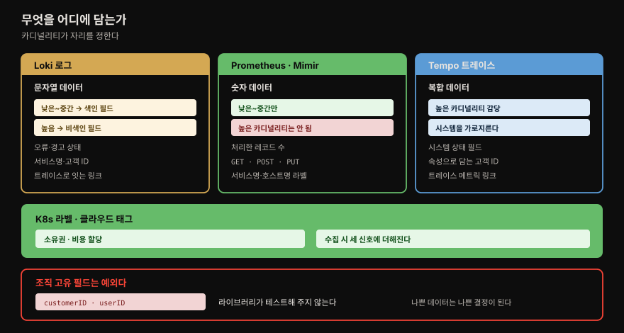
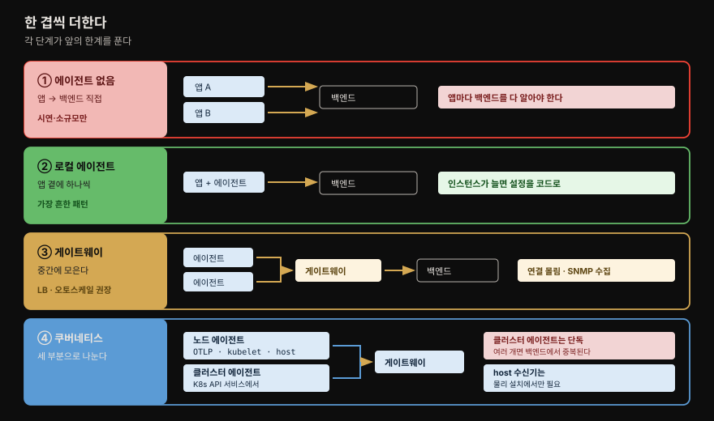
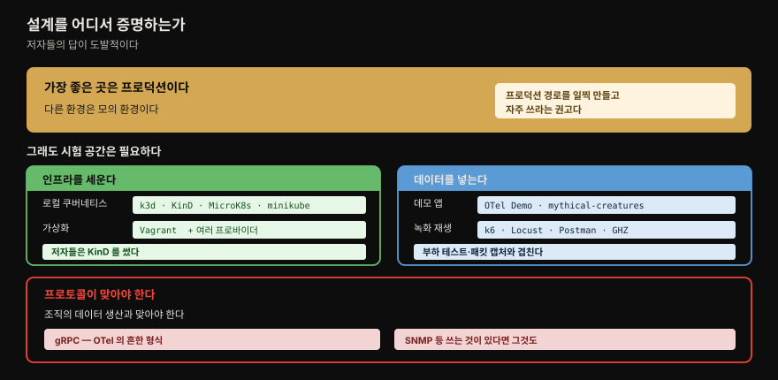
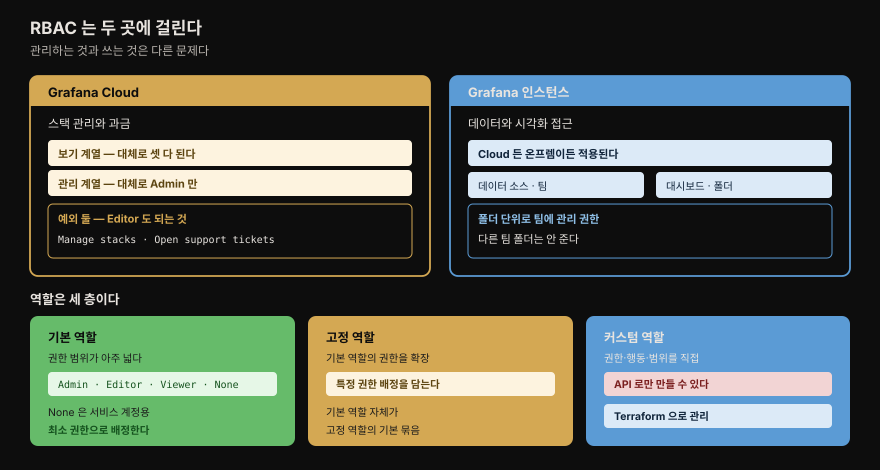

# 플랫폼 설계

---

## 핵심 요약

> **가장 저평가된 단계는 기술이 아니라 문제 정의입니다.** 저자들은 조직이 풀려는 문제를 이해하고 표현하는 일이 **가장 중요하면서 가장 저평가된** 부분이라고 적으며 시작합니다.
>
> 실무에 오래 남는 것은 **수집 참조 아키텍처 넷**입니다. 에이전트 없음 → 로컬 에이전트 → 게이트웨이 → 쿠버네티스 세 부분 구성으로 복잡도가 올라가고, 각 단계가 어떤 한계를 푸는지가 명확합니다.
>
> 저자들이 든 개인 일화가 이 장의 논지를 압축합니다. `tenantID` 와 `customerID` 가 같은 것인지 다른 것인지 회의를 반복했고, 결국 다르다고 결론 나자 **두 시스템 모두 몇 달의 작업**이 필요했습니다. 데이터 모델 책임자가 처음부터 있었다면 **통째로 피할 수 있던** 일입니다.

## 학습 목표

1. 관측 플랫폼이 푸는 조직 문제 넷을 말할 수 있습니다.
2. 텔레메트리 종류별로 어떤 데이터가 어울리는지 판단할 수 있습니다.
3. 수집 참조 아키텍처 넷의 차이와 각자의 적용 상황을 구분할 수 있습니다.
4. 저장소 배포 모드 셋 중 무엇을 프로덕션에 쓸지 고를 수 있습니다.
5. 기본 역할과 고정·커스텀 역할의 관계를 설명할 수 있습니다.

## 1. 문제 정의가 먼저입니다

> 조직마다 다릅니다. 그래서 Masha 같은 선임 리더십과 **비즈니스 요구를 이해하는 단계**가 자주 빠지고, 나중에 복잡한 문제로 돌아옵니다.

저자들이 드는 흔한 문제가 넷입니다.

- **고객에게 영향을 주는 사고** — 다운타임부터 데이터 유출까지. **규정 준수·운영·평판** 위험이 됩니다. 고객은 조직 내부일 수도 외부일 수도 있습니다.
- **조직의 KPI 이해** — 지금 잘 되고 있는지, 손봐야 할 것이 있는지를 말해 주는 지표입니다.
- **고객이 제품을 어떻게 쓰는지 이해** — 고충 지점을 찾아 더 나은 경험으로 이끕니다. 좋은 제품은 경쟁 우위가 됩니다.
- **고객에게 서비스하는 재무 비용 이해** — 흔히 **COGS**(매출원가)와 **OPEX**(운영비)로 부릅니다.

⚠️ 저자들이 첫 문단에서 못 박는 것이 이 장 전체의 전제입니다. **조직이 풀려는 문제를 이해하고 표현하는 일이 잘 설계된 관측 플랫폼에서 가장 중요하면서 가장 저평가된 측면입니다.**

## 2. 데이터 아키텍처 — 이름이 맞아야 합칠 수 있습니다

> 관측 시스템은 본질적으로 데이터 시스템입니다. **다른 데이터 시스템과 호환될 때** 조직 전체에 가장 값집니다.

데이터 아키텍처는 조직의 데이터 자산을 정의하고 **데이터가 시스템을 어떻게 흐르는지** 그립니다. 대부분의 조직에 이미 있으므로 담당 팀과 이야기할 만합니다.

핵심은 하나입니다. **조직 전체의 데이터 아키텍처를 누가 책임지는지 찾아내는 것**입니다. 그런 자리가 없다면, 선임 리더십에게 **그들이 풀려는 문제의 걸림돌**로 제기할 수 있습니다.

### 저자의 일화 — 이름 하나가 몇 달을 만듭니다

⚠️ 저자가 주니어 엔지니어 시절 겪은 일을 직접 적습니다. `tenantID` 와 `customerID` 가 **다른 필드인지 아닌지** 논의하는 회의를 여러 번 했습니다. 두 시스템이 다른 이름을 쓰고 있었기 때문입니다.

결국 **다른 개념**으로 결정됐습니다. 회사의 고객인 **모회사와 자회사**라는 개념을 담기 위해서였습니다. 그러자 **두 시스템 모두 몇 달의 작업**이 필요했고, **로깅 플랫폼도 이 새 개념을 담으려 데이터 모델을 많이 다시 만들어야** 했습니다.

저자들의 결론이 단호합니다. **데이터 모델을 책임지는 사람이 있고 요구사항을 일찍 정의했다면 이 작업은 통째로 피할 수 있었습니다.**

### 요구사항을 옮기는 단계

조직의 다른 영역에서 온 데이터 모델을 쓰는 일이 흔합니다. 이때 **아키텍트가 완료해야 할 단계**가 있습니다 — 외부 요구사항을 **어느 필드를 어디에 기록할지 상세히 적은 요구사항 문서로 옮기는** 일입니다.

예를 들어 재무 데이터 모델이 **비용 센터(cost center)** 기록을 요구한다면, 달성 방법이 여럿입니다.

- 모든 로그 라인·메트릭·트레이스에 그 정보를 포함하도록 요구
- 모든 서비스에 `organization.costcenter` 라벨을 붙이도록 요구
- **서비스 이름 ↔ 비용 센터 조회 표**를 유지

⚠️ 요구사항 가이드는 이것을 **어떻게 달성할지 명확해야** 합니다. 저자들이 권하는 문서 구조가 **MoSCoW** 입니다 — Must have · Should have · Could have · Won't have.

### 텔레메트리 종류마다 맞는 데이터가 다릅니다

| 종류 | 어울리는 데이터 |
|------|----------------|
| **Loki 의 로그 필드** | **문자열** 데이터 — 오류·경고 같은 애플리케이션 상태(문자열 형식) · 서비스 이름·고객 ID·사용자 ID 같은 조직·비즈니스 필드 · **낮은~중간 카디널리티 색인 필드** · **높은 카디널리티 비색인 필드** · 트레이스로 이어지는 링크 |
| **Prometheus·Mimir 의 메트릭 필드** | **숫자** 데이터 — 시작 이후 처리된 레코드 수 같은 상태 · 서비스 이름·호스트명을 담은 라벨 · **낮은~중간 카디널리티** 필드(HTTP 메서드 GET·POST·PUT 등) |
| **Tempo 의 트레이스 필드** | **복합** 데이터 — 시스템 상태 필드 · **높은 카디널리티** 필드 · 속성으로 더한 조직·비즈니스 필드(고객 ID·사용자 ID) · **시스템을 가로지르는** 필드 |
| **쿠버네티스 라벨** | 키-값 객체 — **소유권과 비용 할당** 같은 핵심 조직 필드 · 애플리케이션과 인프라를 잇기. 수집 시 로그·메트릭·트레이스에 더할 수 있습니다 |
| **클라우드 벤더 태그** | 인프라에 붙는 태그 — 소유권·비용 할당. 마찬가지로 수집 시 세 신호에 더할 수 있습니다 |

카디널리티가 갈리는 축이 눈에 띕니다. **로키는 색인 여부로 높고 낮은 카디널리티를 모두 받고, 메트릭은 낮은~중간만, 트레이스는 높은 카디널리티를 감당합니다.** 4장·5장의 카디널리티 경고와 정확히 맞물립니다.

### 조직 고유 필드는 테스트되지 않습니다

⚠️ 이 절에서 가장 실무적인 경고입니다. 표준 데이터를 만드는 라이브러리는 잘 테스트돼 있지만, **테스트되지 않는 영역이 하나 있습니다 — 조직 고유 필드**입니다. 사용자 ID·고객 ID 가 흔한 예입니다.

이 필드들은 조직이 쓸 때 중요해져 **경영진이 정기적으로 검토하기까지** 합니다. 그래서 **나쁜 데이터가 나쁜 결정으로 이어집니다.** 데이터 아키텍처 문서는 이 필요를 강조해야 합니다.

저자들은 기술적 상세를 이 책에서 다루지 않는 대신 [Martin Fowler 의 Domain-Oriented Observability 글](https://martinfowler.com/articles/domain-oriented-observability.html)을 권합니다.

## 3. 시스템 아키텍처 — 네 가지 질문 묶음

> 데이터를 어떻게 만들고·모으고·저장하고·보일지. 각 묶음에 딸린 질문이 설계를 정합니다.

저자들이 던지는 질문들입니다.

**어떻게 생산하는가** — 어떤 텔레메트리 종류를 쓰는가 · Diego 같은 개발자에게 **라이브러리 표준**을 줄 것인가 · **시스템·상태 데이터를 비즈니스 데이터와 분리**할 것인가

**어떻게 수집하는가** — 어떤 시스템에서 모아야 하는가 · **도구를 바꾸면 모든 애플리케이션을 고쳐야 하는가** · 얼마나 많은 데이터를 모으는가

**어떻게 저장하는가** — 로컬 저장소를 제공하는가, 한다면 규모와 비용은 어떻게 관리하는가 · **클러스터·환경별인가 중앙 집중인가** · Grafana Cloud 같은 제3자를 쓴다면 **비용은 어떻게 배분하는가**

**어떻게 시각화를 관리하는가** — 완전히 열어 누구나 어느 대시보드든 고칠 수 있게 할 것인가 · **팀마다 자기 대시보드를 책임질 것인가** · 팀이 대시보드를 관리하도록 **IaC 도구를 제공할 것인가**

⚠️ 저자들이 이 넷 모두에 덧붙이는 질문이 하나 있습니다. **그 시스템이 실패를 어떻게 다루는가.**

### 애플리케이션 데이터 생산 표준

OpenTelemetry 는 상대적으로 젊지만 **대부분의 벤더와 시스템이 채택하면서 관측의 표준으로 부상**하고 있습니다. 저자들이 제안하는 모범 사례는 **해당 OpenTelemetry SDK 로 계측을 더하는** 것입니다.

| 신호 | 어디로 |
|------|--------|
| **로그** | `stdout` 과 `stderr` 로 |
| **메트릭** | **Prometheus 스크레이프 엔드포인트**와 OpenTelemetry 수신기 **양쪽**으로 — gRPC `4317` 또는 HTTP `4318` |
| **트레이스** | OpenTelemetry 수신기로, 같은 포트 |

⚠️ 메트릭을 **양쪽으로** 보내라는 권고에 이유가 있습니다. 저자들이 뒤 §6 에서 밝히는데, **자동 확장(autoscaling)** 때문입니다.

## 4. 수집 참조 아키텍처 넷

> 가장 단순한 것에서 시작해 한계가 드러날 때마다 한 겹씩 더합니다. 각 단계가 무엇을 푸는지가 핵심입니다.

| 구성 | 어떻게 | 언제 |
|------|--------|------|
| **① 에이전트 없음** | 각 애플리케이션이 **백엔드로 직접** 보냅니다 | 시연이나 작은 설치에는 충분합니다. ⚠️ 다만 **각 애플리케이션이 각 백엔드 서비스를 알아야** 해서 확장이 잘 안 됩니다 |
| **② 로컬 에이전트** | 애플리케이션 곁에 에이전트를 둡니다 | **가장 흔한 패턴**이며 많은 환경에 좋습니다. 복잡도가 조금 늘지만 **애플리케이션 팀의 부담을 크게 덜어냅니다** |
| **③ 게이트웨이** | 에이전트들이 게이트웨이로 보내고 게이트웨이가 백엔드로 | **로컬 인스턴스가 많아 백엔드에 열린 연결이 몰릴 때** 부하를 여러 에이전트 인스턴스로 분산합니다. **SNMP 같은 시스템에서 모으는 것이 목표일 때**도 좋습니다 |
| **④ 쿠버네티스 세 부분** | 노드 에이전트 + 게이트웨이 + 클러스터 에이전트 | 클러스터와 노드를 가로질러 모아야 할 때 |

⚠️ ② 에 붙는 단서가 실무적입니다. **에이전트 인스턴스 수가 늘면 설정을 코드형(configuration-as-code)으로 배포해야** 합니다 — Ansible·Salt, 쿠버네티스라면 Helm 입니다.

⚠️ ③ 에는 모범 사례가 둘 붙습니다. **게이트웨이 앞에 로드 밸런서**를 두고, 가능하면 **자동 확장**을 구현합니다.

### 쿠버네티스 구성을 세 부분으로 나눠 봅니다

- **노드마다 로컬 에이전트** — OTLP 메트릭을 gRPC·HTTP 로 받고, **kubelet 에 노드 관련 통계를 질의**합니다. 호스트 수신기도 설정하는데 이것은 **물리 설치에서만 필요**합니다.
- **게이트웨이 에이전트** — 각 노드와 클러스터 에이전트에서 데이터를 모읍니다. 여기서 **처리(processing)를 수행**할 수도 있습니다.
- **클러스터 에이전트** — **쿠버네티스 API 서비스에서 모으는 독립 인스턴스**입니다. ⚠️ 이 일을 모든 노드나 게이트웨이 에이전트에 맡기면 **각 인스턴스가 데이터를 모아 백엔드에서 중복**됩니다. 독립 인스턴스로 두면 **단일 데이터 스트림**을 얻고, 이 인스턴스도 노드 에이전트처럼 게이트웨이를 활용할 수 있습니다.

7장·10장에서 본 "단일 인스턴스여야 중복이 없다"가 여기서 **아키텍처 층위로** 다시 나옵니다.

### 로컬이냐 원격이냐

로컬 저장은 **관리 부담과 비용**을 더하지만 어떤 환경에서는 요구사항입니다. 원격 저장은 관리 비용을 줄이지만 ⚠️ **애플리케이션 메트릭으로 환경 선택을 내리는 선택지를 없앨 수 있습니다.** 저자들이 드는 예가 Prometheus **HorizontalPodAutoscaler(HPA)** 입니다.

저자들이 실제로 써 온 구성이 이렇습니다 — **수명이 짧은 휘발성 로컬 저장소**를 그런 용도로 두고, **오래 보관할 것은 원격 제3자 인프라**에. 그런 설정이 잘 동작한다고 적습니다.

### 실패를 다루는 법

에이전트 실패는 **재시작이 유일한 실질적 선택지**입니다. 그러나 **수집 파이프라인이 실패하면 버퍼링**으로 다룰 수 있습니다.

| 대상 | 무엇으로 |
|------|---------|
| 메모리 버퍼 | **batch 프로세서** 설정 |
| 디스크 버퍼 | **file storage 확장** |

⚠️ 버퍼링을 설계할 때 볼 것은 **시스템이 실패를 얼마나 오래 견뎌야 하는가**입니다. 이것과 데이터 처리량이 **얼마나 많은 메모리·디스크가 필요한지**를 정합니다.

저자들이 덧붙이는 관행이 좋습니다. **이 계산을 데이터 수집 계층의 SLI 로 보고**하면 시스템의 복원력이 공개적으로 드러납니다.

## 5. 저장소 배포 모드 셋

> Mimir·Loki·Tempo 가 공유하는 선택지입니다. **프로덕션 권장이 제품마다 다릅니다.**

| 모드 | 어떻게 | 프로덕션 권장 |
|------|--------|--------------|
| **Monolithic** | 모든 마이크로서비스를 **단일 인스턴스**로 배포하고 오브젝트 스토어에 연결. 인스턴스를 늘려 수평 확장할 수 있고 **복잡도가 낮은 고가용성**을 줍니다 | ⚠️ **읽기·쓰기 경로를 독립적으로 확장할 수 없고, 프로덕션에 권장되지 않습니다** |
| **Microservices** | 각 컴포넌트를 **독립적으로** 배포·확장. 복잡도가 늘지만 실제 부하에 맞출 수 있습니다 | **Mimir·Tempo 의 프로덕션 권장 모드** |
| **Simple scalable** | **Loki 에만 있습니다.** 쓰기·읽기·백엔드 **타깃**을 독립적으로 배포·확장해 위 둘의 균형을 잡습니다. 각 타깃은 그 역할에 필요한 서비스를 모두 담습니다 | **Loki 의 프로덕션 권장 모드** |

셋 다 쿠버네티스는 **Helm 차트**로 배포하고, 리눅스용 패키지도 제공되며 **Puppet 또는 Tanka** 패키지로 자동화할 수 있습니다.

시각화 계층을 직접 관리하려면 Grafana 애플리케이션을 설치합니다. **리눅스·macOS·윈도우 패키지**, **Docker 이미지**, 쿠버네티스 Helm 배포 안내가 제공됩니다.

> 저장소를 직접 관리할지 제3자에게 맡길지는 **"누가 책임지는가"** 한 질문으로 갈립니다. 저자들은 제3자와의 **계약 관계**가 **뭔가 잘못됐을 때 아주 도움이 된다**고 적습니다.

## 6. 관리와 자동화 — 네 시스템을 별개 관심사로

> 10장의 IaC 를 아키텍처에 얹습니다. 핵심은 **네 시스템을 분리해 관리**하는 것입니다.

| 시스템 | 누가 · 무엇을 |
|--------|--------------|
| **생산** | **각 애플리케이션이 독립적으로** 관리. 가이드를 제공합니다 |
| **수집** | 인프라·플랫폼·관측 팀. ⚠️ **다른 컴포넌트처럼 SLI·SLO 를 공개**해야 합니다 |
| **저장** | 같은 팀. **제3자 도구를 쓰는 것이 흔합니다.** Grafana Cloud **스택**은 CI/CD 플랫폼이나 성능 테스트처럼 **저장을 분리해야 할 때** 좋은 도구입니다 |
| **시각화** | 시스템 자체는 플랫폼 팀이, **대시보드와 산출물은 각 애플리케이션 팀이 독립적으로**. 배포를 돕는 IaC 를 제공합니다 |

### 자동 확장 — 메트릭을 양쪽으로 보내는 이유

§3 에서 **Prometheus 엔드포인트와 OTLP 내보내기 양쪽**으로 메트릭을 발행하라고 권한 이유가 여기서 밝혀집니다. **자동 확장** 때문입니다.

저자들이 1장의 증기기관 조속기를 다시 부릅니다. **진정으로 관측 가능한 시스템은 스스로를 교정할 수 있습니다.**

쿠버네티스 **HPA** 는 CPU·메모리 사용량으로 Pod 를 확장합니다. 어떤 경우엔 충분하지만, 애플리케이션 팀은 **요청 비율이나 세션 수** 같은 메트릭으로 확장하고 싶어 하는 일이 흔합니다. Prometheus 커뮤니티가 **쿠버네티스 Metrics API 용 어댑터**를 제공해 이런 확장을 가능하게 합니다.

⚠️ 아키텍처에 중요한 질문이 하나 남습니다. **이런 계측을 중앙 팀이 관리할 것인가, 각 애플리케이션 팀이 할 것인가** — 아니면 팀이 가져다 쓸 기본 설정을 제공할 것인가.

## 7. 설계를 증명하기

> **가장 좋은 증명 장소는 프로덕션입니다.** 다른 환경은 모두 모의 환경이라 고객 상호작용의 미묘함을 놓칠 수 있기 때문입니다.

⚠️ 저자들의 이 주장이 도발적입니다. 이론적 설계를 증명할 최적의 장소는 **고객이 실제로 상호작용하는 환경**, 곧 프로덕션입니다. 이것은 **프로덕션으로 가는 경로를 일찍 만들고 자주 쓰라는** 권고입니다.

그렇게 말한 뒤에도 **설계를 시험할 공간을 갖는 일은 여전히 중요하다**고 균형을 잡습니다.

### 컨테이너화와 가상화

| 도구 | 특징 |
|------|------|
| **k3d · KinD · MicroK8s · minikube** | 넷 다 **로컬에서 쿠버네티스 클러스터**를 돌립니다. KinD·k3d·minikube 는 **Docker 또는 Podman 드라이버**로 실행되고, minikube 는 **VM 드라이버**도 제공해 특정 로컬 설치에 유용합니다 |
| **Vagrant** | Hyper-V·VMware·VirtualBox·Xen·QEMU·libvirt **등** 여러 가상화 도구와 씁니다. **가상 머신과 가상 네트워킹을 정의**해 **프로바이더**로 여러 가상화 도구에 배포합니다 |

⚠️ 저자들이 밝히는 자기 경험이 있습니다. **데이터 수집 아키텍처와 파이프라인에는 KinD 로 좋은 결과**를 얻었습니다.

이 도구들의 값은 실행에만 있지 않습니다. **실제로 로컬 배포되는 설정으로 아키텍처 요구사항과 다이어그램을 문서화**할 수 있다는 점도 함께 듭니다.

### 데이터를 만들어 넣기

**데모 애플리케이션** 셋을 듭니다.

- **OpenTelemetry Demo** — 이 책이 계속 쓴 전체 소매 애플리케이션
- **One Observability Workshop** — AWS 가 제공하며 AWS 관측 도구로 데이터를 넣는 법을 보입니다
- **mythical-creatures** — Heds Simons 가 **Grafana 면접용으로 쓴** 애플리케이션입니다(그는 합격했습니다). 메트릭·로그·트레이스를 내보내며 **OTEL 데모보다 단순한 것이 장점**일 수 있습니다

**미리 녹화한 데이터셋**을 재생하는 방법도 있습니다. 이것은 **부하 테스트·패킷 캡처 도구와 강하게 겹칩니다** — k6·Locust·Postman·Insomnia·GHZ **같은** 도구로 미리 정의한 데이터를 수집 엔드포인트에 보내 출력을 검증합니다.

⚠️ 관측 도구는 **특정 프로토콜**을 쓰므로, 조직의 데이터 생산과 맞는 기능을 찾아야 합니다.

- **gRPC 를 보낼 수 있는가** — OpenTelemetry 의 흔한 형식이기 때문입니다.
- **SNMP 같은 다른 프로토콜**을 쓴다면 그것도.

**Fiddler·Wireshark** 같은 네트워크 분석기와 HTTP(S) 디버거로 **와이어 데이터를 기록해 참조 데이터 라이브러리**를 쌓을 수 있습니다.

## 8. 접근 수준 — RBAC 를 두 곳에 겁니다

> Cloud 스택 관리와 Grafana 인스턴스 사용은 다른 문제입니다. RBAC 도 두 곳에 나뉩니다.

| 어디 | 무엇을 통제 |
|------|------------|
| **Grafana Cloud** | 배포된 Grafana 스택의 **관리와 과금** |
| **Grafana 인스턴스** | **데이터와 시각화 접근.** Cloud 에 배포하든 온프렘이든 |

### Grafana Cloud 의 역할 셋

Cloud 는 **Admin · Editor · Viewer** 세 역할을 두고 권한을 표로 정리합니다. 표 전체를 옮기는 대신 **패턴만** 적습니다.

- **보기(View) 계열은 대체로 셋 다 허용**됩니다 — 조직 과금 정보 보기, 인스턴스 플러그인 보기, 스택 보기, 인보이스 보기, Enterprise 라이선스 보기, OAuth 클라이언트 보기, 지원 티켓 보기.
- **관리(Manage) 계열은 대체로 Admin 만** 가능합니다 — API 키 관리, 조직 과금 정보 관리, Cloud 구독 관리, 인스턴스 플러그인 관리, 조직 멤버 관리, 인보이스 결제, OAuth 클라이언트 관리.
- **예외가 셋**입니다. **API 키 보기(View API keys)** 는 이름은 보기 계열이지만 **Admin 만** 됩니다. 반대로 **스택 관리(Manage stacks)** 와 **지원 티켓 열기(Open support tickets)** 는 관리 계열인데 **Admin 과 Editor 가 되고 Viewer 만 안 됩니다.**

> **원문 표 주의** — 이 표(Table 11.1)는 PDF 추출 시 열이 뒤엉켜 있어, `라벨 → (Admin, Editor, Viewer)` 3셀 단위로 되짚어 **17행**(체크 기호 51개 ÷ 3)을 복원한 뒤 위 패턴을 적었습니다. 복원이 까다로웠던 지점은 `View organization billing` 라벨이 페이지 하단에서 `information` 으로 잘리고, `Manage organization billing information` 은 라벨만 페이지 끝으로 밀려 체크 트리플이 고아로 남는 대목입니다. 권한 자체가 시간에 따라 바뀔 수 있으니, 실제 적용 전에는 **[Grafana 공식 문서](https://grafana.com/docs/grafana/latest/administration/roles-and-permissions/access-control/plan-rbac-rollout-strategy/)로 현재 값을 확인**하십시오.

### Grafana 인스턴스의 역할 체계

셋으로 나뉩니다.

**기본 역할(Basic roles)** — 권한 범위가 아주 넓습니다. 작은 조직과 새 설치에 편합니다. ⚠️ **최소 권한으로 기본 역할을 배정하는 것이 좋은 관행**입니다.

| 역할 | 설명 |
|------|------|
| **Admin** | Grafana **조직**의 관리자 |
| **Editor** | 조직 안 객체를 **편집**할 수 있는 사용자 |
| **Viewer** | 객체를 **볼 수** 있는 사용자 |
| **None** | **서비스 계정용**으로 권한이 최소인 역할 |
| **Grafana Admin** | 온프렘 인스턴스의 **모든 Grafana 조직**에 대한 특별 관리자 |

⚠️ 여기서 **조직(organization)** 의 뜻을 저자들이 정리합니다. **단일 인스턴스 안에서 Grafana 자원을 분리하는 방법**입니다. 그리고 못을 박습니다 — **Grafana Cloud 에서는 조직을 쓸 수 없습니다.** Cloud 에서는 **스택**이 더 나은 분리 방법인데, 스택마다 전용 Grafana 인스턴스가 쓰이기 때문입니다.

**고정 역할(Fixed roles)** — 기본 역할로 준 권한을 **확장**하는 데 씁니다. 특정 권한 배정을 담고 있어 주체에 더할 수 있습니다. 기본 역할 자체가 **고정 역할 정의의 기본 묶음**입니다.

**커스텀 역할(Custom roles)** — 특정 권한·행동·범위를 배정한 역할을 만듭니다. ⚠️ **API 로만 만들 수 있지만 Terraform 으로 IaC 관리할 수 있습니다.**

권한은 **데이터 소스·팀·대시보드·폴더** 수준에도 걸립니다. 그래서 **특정 팀에 배정된 폴더의 모든 대시보드에는 관리 권한을 주되 다른 팀 폴더에는 안 주는** 구조가 가능합니다.

### 페르소나로 본 역할 설계

| 페르소나 | 필요한 권한 |
|---------|------------|
| **Diego** Developer | 다른 서비스가 어떻게 동작하는지 보려면 **대시보드 읽기**. 자기가 책임지는 애플리케이션이 든 **폴더에 한해** 대시보드·알림 **쓰기** |
| **Steven** Service | 대시보드 **보기는 되지만 편집은 안 됨**. 다만 **당직 일정 보기·관리**와 **알림 묵음**은 필요 |
| **Pelé** Product | 일상은 대시보드·사고 이력 보기와 자기 제품 데이터 질의. 여기에 더해 **BI 플랫폼에 넣을 비즈니스 메트릭 질의용 서비스 계정**이 필요. 이 계정은 관리자 Ophelia 와 함께 **제한된 권한으로** 설정했습니다 |

⚠️ 서비스 계정에 특별한 고려가 필요합니다. Grafana 도구 프로비저닝 팀이 쓰는 계정처럼 **큰 접근 권한이 필요한 것은 철저히 감사**해야 합니다. 반면 애플리케이션 팀이 대시보드 관리에 쓰는 계정은 **제한된 권한**이어야 합니다.

두 번째 유형에 저자들이 권하는 관행이 실용적입니다. **그 서비스 계정을 관리할 제한된 권한을 팀의 시니어 구성원에게 주면** 팀이 독립적으로 일할 수 있습니다.

## 9. 텔레메트리를 다른 소비자에게

> 로그는 SIEM 으로, 집계 메트릭은 BI 로. 전략이 둘로 갈립니다.

| 전략 | 어떻게 | 고려할 것 |
|------|--------|----------|
| **수집 파이프라인에서 공유** | OTel Collector 가 **필터링해 여러 백엔드로** 보냅니다. AWS·GCP·Azure 도 여러 백엔드 쓰기를 제공합니다 | ⚠️ **같은 데이터를 여러 벌 저장해 비용이 늘어납니다.** 다른 소비자의 요구를 이해해 이 비용을 최소화하는 데 시간을 쓰라고 권합니다 |
| **Grafana 에 직접 질의** | **예약 작업**이 Grafana 에 직접 질의합니다. 보통 **커스텀 커넥터**가 읽어 BI 플랫폼에 씁니다 | **기록 규칙(recording rule)** 이 돕습니다 |

기록 규칙의 쓰임새를 저자들이 예로 듭니다. 비즈니스가 **일별 고유 로그인 사용자 수**에 관심이 있다면, 기록 규칙이 이것을 질의해 **새 메트릭으로 저장**합니다. BI 플랫폼이 수집할 때 **느릴 수 있는 질의가 끝나기를 기다릴 필요 없이** 데이터를 바로 얻습니다.

## 책 밖으로 잇기

> 이 장의 판단을 지금 적용할 때 확인할 것을 정리합니다.

**배포 모드 이름은 제품별로 확인이 필요합니다.** 이 장이 정리한 monolithic·microservices·simple scalable 은 집필 시점(2023) 기준입니다. Loki 의 simple scalable 은 이후 문서에서 다른 이름으로 불리기도 하므로, 실제 배포 전에 각 제품의 현재 문서로 확인해야 합니다.

**Grafana Agent 는 이 장에서도 전제됩니다.** 10장에서 적었듯 후속인 Alloy 가 나왔고 마이그레이션 경로가 제공됩니다.

> **책 밖 —** 위 두 문단은 원문에 없는 제 정리입니다. 배포 모드 이름 변경 여부는 **이번에 1차 자료로 확인하지 않았으므로** 단정하지 않았습니다.

Martin Fowler 의 Domain-Oriented Observability 는 이 장이 직접 링크한 글이며, **조직 고유 필드를 테스트 가능한 형태로 생산하는 법**을 다룹니다. 이 장이 "기술적 상세는 다루지 않는다"며 넘긴 부분이 거기 있습니다.

## 결정 치트시트

> 플랫폼을 설계할 때 갈리는 지점만 모았습니다.

| 상황 | 선택 | 근거 |
|------|------|------|
| 문자열·고카디널리티 데이터 | **Loki 로그 필드** | 비색인 필드로 감당 |
| 숫자·저카디널리티 | **Prometheus·Mimir 메트릭** | 라벨 폭증 방지 |
| 시스템을 가로지르는 고카디널리티 | **Tempo 트레이스** | 속성으로 조직 데이터도 |
| 소유권·비용 할당을 붙이고 싶음 | **K8s 라벨 · 클라우드 태그** | 수집 시 세 신호에 더해짐 |
| 요구사항 문서 구조 | **MoSCoW** | Must·Should·Could·Won't |
| 시연·소규모 설치 | **① 에이전트 없음** | 단 확장은 안 됨 |
| 일반적인 환경 | **② 로컬 에이전트** | 가장 흔한 패턴 |
| 연결이 백엔드에 몰림 · SNMP 수집 | **③ 게이트웨이** | 부하 분산 · LB 와 오토스케일 권장 |
| K8s 클러스터 전반 | **④ 세 부분 구성** | 클러스터 에이전트는 **반드시 단독** |
| Loki 프로덕션 | **simple scalable** | 쓰기·읽기·백엔드 타깃 분리 |
| Mimir·Tempo 프로덕션 | **microservices** | 컴포넌트별 독립 확장 |
| 프로덕션에 쓰면 안 되는 것 | **monolithic** | 읽기·쓰기 독립 확장 불가 |
| HPA 를 쓰려 함 | **로컬 메트릭 저장 필요** | 원격만 두면 선택지가 사라짐 |
| 파이프라인 실패 대비 | **batch(메모리) · file storage(디스크)** | 견딜 시간 × 처리량으로 크기 산정 |
| 로컬에서 K8s 시험 | **KinD** | 저자들이 좋은 결과를 얻은 도구 |
| 가상 인프라 시험 | **Vagrant** | 여러 가상화 도구에 프로바이더로 |
| 단순한 데모 데이터 | **mythical-creatures** | OTEL 데모보다 단순 |
| Cloud 에서 자원 분리 | **스택** | 조직(organization)은 Cloud 에서 못 씀 |
| 서비스 계정 권한 | **None 기본 역할** | 최소 권한 |
| 커스텀 역할을 코드로 | **API 생성 + Terraform 관리** | UI 로는 못 만듦 |
| BI 로 느린 질의를 보냄 | **기록 규칙** | 미리 계산해 새 메트릭으로 |

## Spring 앱 개발 관점

> 이 장의 데이터 생산 표준이 앱 쪽에 무엇을 요구하는지 봅니다.

저자들이 제안하는 표준은 **로그는 `stdout`·`stderr`, 메트릭은 Prometheus 엔드포인트와 OTLP 양쪽, 트레이스는 OTLP** 입니다. Spring 앱이라면 Actuator 의 Prometheus 엔드포인트와 OTLP exporter 를 **함께** 두는 구성이 여기 해당합니다.

**양쪽으로 보내는 이유가 자동 확장**이라는 점이 설계 판단을 바꿉니다. OTLP 만 두면 텔레메트리는 잘 나가지만 **HPA 가 읽을 곳이 없어집니다.** 요청 비율로 Pod 를 늘리고 싶다면 Prometheus 엔드포인트가 남아 있어야 합니다.

조직 고유 필드 경고도 앱 쪽 일입니다. `customerID`·`userID` 는 **라이브러리가 테스트해 주지 않으므로** 앱의 테스트가 그 값의 정확성을 지켜야 합니다. 저자들이 "나쁜 데이터가 나쁜 결정으로 이어진다"고 적은 대상이 정확히 이 필드들입니다.

> **책 밖 —** Actuator·OTLP exporter 를 함께 두는 구체적 구성은 원문에 없는 제 정리입니다. 원문은 프로토콜과 포트만 제시합니다.

## 면접에서 받을 만한 질문

1. 관측 플랫폼 설계에서 가장 저평가되는 단계는 무엇이라고 합니까?
2. `tenantID` 와 `customerID` 일화가 말하는 교훈은 무엇입니까?
3. 로그·메트릭·트레이스는 각각 어떤 카디널리티를 감당합니까?
4. 수집 참조 아키텍처 넷은 각각 무엇을 풉니까?
5. 클러스터 에이전트를 단독 인스턴스로 두는 이유는 무엇입니까?
6. 저장소 배포 모드 셋 중 프로덕션 권장은 제품별로 무엇입니까?
7. 메트릭을 Prometheus 와 OTLP 양쪽으로 보내라는 이유는 무엇입니까?
8. Grafana Cloud 에서 조직(organization)을 쓸 수 없는 대신 무엇을 씁니까?

## 정답 (자답 후 펼치기)

### 정답 1 — 가장 저평가되는 단계

**조직이 풀려는 문제를 이해하고 표현하는 일**입니다. 저자들은 이것이 잘 설계된 관측 플랫폼에서 **가장 중요하면서 가장 저평가된** 측면이라고 적습니다. Masha 같은 선임 리더십과 비즈니스 요구를 이해하는 단계가 자주 빠지고, 나중에 복잡한 문제로 돌아옵니다.

### 정답 2 — tenantID 일화

두 시스템이 다른 이름을 써서 **같은 개념인지 다른 개념인지** 회의를 반복했습니다. 결국 다른 개념(모회사·자회사)으로 결론 나자 **두 시스템 모두 몇 달의 작업**과 **로깅 플랫폼의 데이터 모델 재구축**이 필요했습니다.

교훈은 **데이터 모델 책임자가 있고 요구사항을 일찍 정의했다면 통째로 피할 수 있었다**는 것입니다.

### 정답 3 — 카디널리티

- **Loki 로그** — 낮은~중간 카디널리티는 **색인 필드로**, 높은 카디널리티는 **비색인 필드로** 둘 다 감당합니다.
- **Prometheus·Mimir 메트릭** — **낮은~중간만**. HTTP 메서드 같은 것이 예입니다.
- **Tempo 트레이스** — **높은 카디널리티**를 감당하며 고객 ID·사용자 ID 를 속성으로 담습니다.

### 정답 4 — 참조 아키텍처 넷

- **① 에이전트 없음** — 앱이 백엔드로 직접. 시연·소규모엔 충분하나 **각 앱이 각 백엔드를 알아야** 해 확장이 안 됩니다.
- **② 로컬 에이전트** — 앱 팀의 부담을 덜어냅니다. 가장 흔한 패턴.
- **③ 게이트웨이** — 로컬 인스턴스가 많아 **백엔드에 연결이 몰릴 때** 부하를 분산하고, **SNMP 수집**에도 좋습니다.
- **④ 쿠버네티스 세 부분** — 노드 에이전트 + 게이트웨이 + 클러스터 에이전트.

### 정답 5 — 클러스터 에이전트를 단독으로

쿠버네티스 API 서비스에서 모으는 일을 **모든 노드나 게이트웨이 에이전트에 맡기면 각 인스턴스가 같은 데이터를 모아 백엔드에서 중복**됩니다. 독립 인스턴스로 두면 **단일 데이터 스트림**을 얻습니다. 이 인스턴스도 노드 에이전트처럼 게이트웨이를 활용할 수 있습니다.

### 정답 6 — 프로덕션 권장 모드

- **Loki** — **simple scalable**(Loki 에만 있음). 쓰기·읽기·백엔드 타깃을 독립 확장.
- **Mimir·Tempo** — **microservices**. 컴포넌트별 독립 배포·확장.
- **monolithic** — 복잡도는 낮지만 **읽기·쓰기 경로를 독립 확장할 수 없고 프로덕션에 권장되지 않습니다.**

### 정답 7 — 양쪽으로 보내는 이유

**자동 확장** 때문입니다. 쿠버네티스 HPA 는 기본적으로 CPU·메모리로 확장하는데, 요청 비율이나 세션 수로 확장하려면 **Prometheus 커뮤니티의 Metrics API 어댑터**가 Prometheus 엔드포인트를 질의해야 합니다. OTLP 로만 내보내면 그 경로가 없습니다.

### 정답 8 — Cloud 의 자원 분리

**스택(stack)** 입니다. 조직(organization)은 **단일 인스턴스 안에서 자원을 분리하는 방법**인데 **Grafana Cloud 에서는 쓸 수 없습니다.** Cloud 는 스택마다 전용 Grafana 인스턴스가 쓰이므로 스택이 더 나은 분리 방법입니다.

## 핵심 개념 체크리스트

- [ ] 관측이 푸는 조직 문제 넷을 말할 수 있는가?
- [ ] 데이터 아키텍처 책임자를 찾아야 하는 이유를 아는가?
- [ ] MoSCoW 가 무엇의 약자인지 아는가?
- [ ] 신호 종류별 카디널리티 적합성을 구분할 수 있는가?
- [ ] 조직 고유 필드가 왜 위험한지 말할 수 있는가?
- [ ] 참조 아키텍처 넷과 각자의 적용 상황을 아는가?
- [ ] 클러스터 에이전트 단독 배치의 이유를 설명할 수 있는가?
- [ ] 원격 저장만 둘 때 잃는 것을 아는가?
- [ ] 버퍼링을 메모리·디스크로 나눠 설정하는 법을 아는가?
- [ ] 배포 모드 셋과 제품별 프로덕션 권장을 말할 수 있는가?
- [ ] 메트릭을 양쪽으로 보내는 이유를 아는가?
- [ ] 프로덕션이 최적의 증명 장소라는 주장의 근거를 아는가?
- [ ] 기본·고정·커스텀 역할의 관계를 설명할 수 있는가?
- [ ] Cloud 에서 조직 대신 무엇을 쓰는지 아는가?
- [ ] 기록 규칙이 BI 연계에서 무엇을 돕는지 아는가?

## 참고 자료

- 원본 — 《Observability with Grafana》(Packt, ISBN 9781803248004) Ch11. Architecting an Observability Platform
- [Martin Fowler — Domain-Oriented Observability](https://martinfowler.com/articles/domain-oriented-observability.html) — 조직 고유 필드를 테스트 가능하게 생산하기
- [Grafana — RBAC 롤아웃 전략 계획](https://grafana.com/docs/grafana/latest/administration/roles-and-permissions/access-control/plan-rbac-rollout-strategy/)

## 관련 문서

- [README](README.md) — 이 책의 정독 노트 목차
- [10-01 코드형 인프라](10-01.코드형%20인프라%20—%20네%20층%20분할·Helm%20우선순위·Terraform%20관리.md) — 이 장이 얹히는 IaC 층, 배포 모드 선택 기준을 여기로 미뤘음
- [09-01 사고 관리](09-01.사고%20관리%20—%20금은동%20지휘·SLI%20알림·IRM%20도구%20셋.md) — 수집 계층도 SLI·SLO 를 공개해야 한다
- [01-01 관측 가능성과 Grafana 스택](01-01.관측%20가능성과%20Grafana%20스택%20—%20파나마%20운하·페르소나·LGTM.md) — 스스로 교정하는 시스템의 조속기 비유
