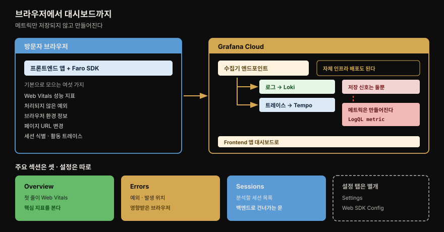
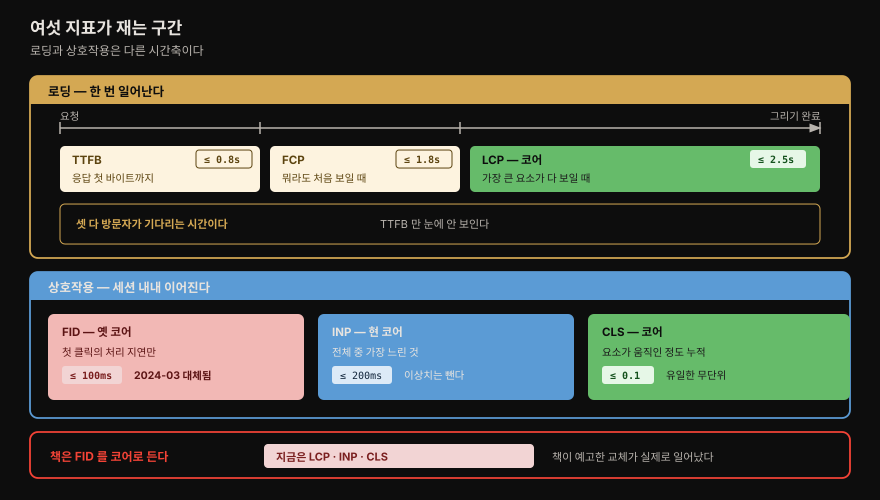
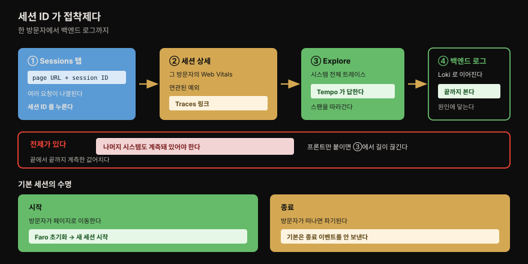
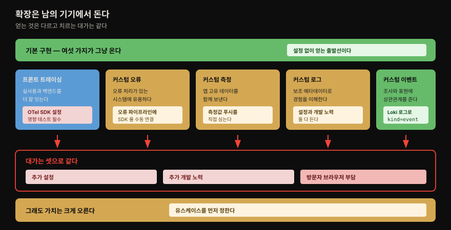

# RUM

---

## 핵심 요약

> **이 장에서 관측 대상이 처음으로 우리 인프라 밖으로 나갑니다.** 지금까지 열한 장은 우리가 소유한 서버·컨테이너·클러스터를 봤습니다. RUM 은 **방문자의 브라우저**에서 도는 코드가 보내오는 데이터를 다룹니다. 소유하지 않은 기기라는 사실이 이 장의 거의 모든 판단을 지배합니다.
>
> 기술적으로 가장 특이한 것은 **메트릭이 저장되지 않는다**는 점입니다. Faro 가 보낸 데이터는 로그와 트레이스로만 저장되고, 대시보드의 메트릭은 **Loki 의 LogQL 메트릭 쿼리로 로그에서 그때그때 만들어집니다**. 4장에서 배운 "로그에서 메트릭 만들기"가 여기서 제품 기능으로 쓰입니다.
>
> 이 장에는 **검증 가능한 예언**이 하나 있습니다. 저자들은 "2024년 3월에 FID 를 INP 로 교체할 계획이 있다"고 적었습니다. 그 일은 실제로 **2024년 3월 12일**에 일어났습니다. 책이 미래형으로 쓴 문장을 우리는 과거형으로 읽습니다.

## 학습 목표

이 장을 읽고 나면 다음을 할 수 있어야 합니다.

- RUM 이 무엇을 보는 텔레메트리인지, 앞 장들의 백엔드 관측과 무엇이 다른지 설명한다
- Faro Web SDK 가 기본으로 모으는 여섯 가지를 말하고, 그것이 어느 저장소로 가는지 그린다
- Overview 탭이 쓰는 Web Vitals 여섯이 페이지 수명의 어느 구간을 재는지 구분하고 목표값을 댄다
- Core Web Vitals 가 지금 무엇인지 알고, 책의 서술과 현재 상태의 차이를 설명한다
- 세션 하나에서 백엔드 로그까지 건너가는 경로와 그 전제 조건을 말한다
- 저자들이 든 확장들이 각각 무엇을 주고 무엇을 대가로 요구하는지 판단한다

## RUM 이란 무엇인가

> Faro SDK 가 브라우저에서 모아 Grafana Cloud 로 보내고, 로그와 트레이스로 갈라져 저장됩니다. 메트릭만 저장되지 않고 로그에서 만들어집니다.

RUM(Real User Monitoring)은 웹 애플리케이션 **프론트엔드의 건강 상태**를 설명하는 텔레메트리를 모으고 처리하는 일을 가리키는 말입니다. 저자들은 이것이 사용자 트랜잭션을 **조감도처럼** 보여 준다고 표현합니다. 사용자의 브라우저에서 시작해 백엔드 시스템까지, 일어나는 그대로 실시간으로 봅니다.

이 텔레메트리의 값어치는 **실제 사용자가 겪는 성능 경험**을 들여다볼 수 있다는 데 있습니다. 우리가 서버에서 재는 응답 시간이 아무리 좋아도, 방문자의 낡은 안드로이드 폰에서 자바스크립트 번들이 3초 동안 파싱되고 있다면 그 사람에게 우리 서비스는 느린 서비스입니다. 서버 쪽 지표는 그 사실을 영원히 모릅니다.

> **책 밖 —** 이 장은 화이트박스·블랙박스라는 말을 쓰지 않습니다. 다만 [9장 노트](09-01.사고%20관리%20—%20금은동%20지휘·SLI%20알림·IRM%20도구%20셋.md) 의 그 구분에 얹어 읽으면 자리가 분명해집니다. 서버 지표가 화이트박스라면 RUM 은 우리 통제 밖까지 보는 쪽입니다. 9장이 경고한 **통제 밖을 보기 때문에 생기는 오탐 위험**도 그대로 따라옵니다 — 방문자의 회사 프록시가 느린 것을 우리 장애로 잡을 수 있습니다.

Grafana 는 RUM 을 세 조각으로 구현합니다.

**첫째, Grafana Faro Web SDK 입니다.** 웹 애플리케이션에 심으면 기본으로 다음을 모읍니다.

- Web Vitals 성능 메트릭
- 처리되지 않은 예외(unhandled exceptions)
- 브라우저 환경 정보
- 페이지 URL 변경
- 세션 식별(데이터 상관관계용)
- 활동 트레이스(activity traces)

기본값 외에도 커스텀 메타데이터·측정값·메트릭을 보내도록 설정할 수 있습니다. Faro Web SDK 는 `opentelemetry-js` 와 통합해 OpenTelemetry 기반 트레이싱을 제공합니다. 이 SDK 는 오픈소스이며 [저장소](https://github.com/grafana/faro-web-sdk)에 문서와 데모 코드가 함께 있습니다.

**둘째, 브라우저 텔레메트리를 받는 클라우드 호스팅 수신기입니다.** Grafana Cloud 에서 애플리케이션 관측을 활성화할 때 만들어지고 설정됩니다. 대안으로 **자체 인프라에 Grafana Agent 를 배포**할 수도 있습니다.

> ⚠️ **버전 드리프트** — 여기서 말하는 Grafana Agent 는 이후 Alloy 로 대체됐습니다. 근거와 현재 상태는 [1장 노트](01-01.관측%20가능성과%20Grafana%20스택%20—%20파나마%20운하·페르소나·LGTM.md) 가 정본이므로 반복하지 않습니다. 자체 호스팅 수신기를 지금 세운다면 Alloy 쪽 문서를 봐야 합니다.

**셋째, 만드는 앱마다 생기는 전용 Grafana 앱 인터페이스입니다.** 대시보드가 탭으로 포함됩니다.

### 메트릭만 다르게 취급됩니다

데이터 경로에서 가장 눈여겨볼 대목이 여기입니다. Faro Web SDK 가 모은 텔레메트리는 Grafana Cloud 의 수집기 엔드포인트로 가고, 거기서 **적절한 백엔드로 나뉩니다 — 로그는 Loki 로, 트레이스는 Tempo 로**.

그런데 메트릭에는 대응하는 저장소가 없습니다. 저자들은 이렇게 적습니다. **메트릭은 4장에서 다룬 Loki 의 LogQL 메트릭 쿼리를 써서 로그로부터 생성됩니다.** 그렇게 만들어진 메트릭이 Frontend Observability 대시보드에 그려집니다.

**저자들은 왜 이렇게 설계했는지 설명하지 않습니다.** 사실은 여기까지입니다. 아래 두 문단은 이 노트가 앞 장들과 이어 붙인 해석이며 원문에 없습니다.

> **책 밖 —** [4장 노트](04-01.Loki%20와%20LogQL%20—%20파이프라인·메트릭%20쿼리·아키텍처.md) 에서 본 Loki 의 성격을 떠올리면 앞뒤가 맞습니다. Loki 는 메타데이터만 색인하므로 브라우저에서 오는 고카디널리티 필드(세션 ID·URL·브라우저 버전)를 감당할 수 있습니다. [11장](11-01.플랫폼%20설계%20—%20데이터%20아키텍처·수집%20참조%20구조·RBAC.md) 에서 확인한 원칙 그대로입니다 — **높은 카디널리티는 메트릭에 담지 않습니다**. 같은 데이터를 시계열로 밀어 넣었다면 세션 ID 하나마다 시계열이 생겼을 겁니다. 다만 이는 **정황이 맞아떨어진다는 것이지 저자들이 밝힌 이유가 아닙니다.**
>
> 실무에서 걸릴 수 있는 지점도 같은 성격의 추론입니다. 메트릭이 조회 시점에 로그에서 만들어진다면, **대시보드가 느릴 때 의심할 곳이 메트릭 저장소가 아니라 로그 쿼리 쪽**이 됩니다. 조회 구간을 길게 잡으면 그만큼의 로그를 훑어야 하기 때문입니다. 원문은 성능을 언급하지 않으므로 실제 부하는 직접 재 봐야 합니다.

## 설정과 앱 화면

> 메뉴에서 앱을 만들고 SDK 통합 방식을 고릅니다. 만들어진 앱은 조사용 세 섹션과 설정용 탭들로 나뉩니다.

설정 절차 자체는 UI 클릭이라 오래 남지 않습니다. [3장 노트](03-01.학습%20환경%20—%20Grafana%20Cloud·OTel%20데모·자격증명과%20트러블슈팅.md) 에서 정한 방침대로, 화면 순서 대신 **오래 사는 결정**만 남깁니다.

앱을 만들 때 입력하는 값은 셋입니다. **앱 이름**, **CORS 주소**, 그리고 **추가 라벨**입니다. 마지막 것이 중요합니다 — 저자들이 괄호로 밝히듯 이 라벨은 **Grafana Cloud 로 들어오는 Loki 로그에 붙는 라벨**입니다. 앞 절에서 본 저장 구조가 여기서 드러납니다. 프론트엔드 데이터가 로그로 저장되니 라벨 설계도 로그의 문법을 따릅니다. 4장에서 배운 좋은 라벨과 나쁜 라벨의 기준이 그대로 적용됩니다.

폼에는 **이 기능이 늘리는 클라우드 비용을 확인하는 항목**도 있습니다. 텔레메트리가 늘면 비용이 는다는 사실을 활성화 시점에 명시적으로 확인시킵니다.

폼을 마치면 SDK 통합 방식을 고르게 됩니다. 원문은 **"몇 가지 옵션(a few options)"** 이라고 열어 두고 다음을 예로 듭니다.

| 방식 | 특징 |
|------|------|
| **NPM** | 빌드 파이프라인에 넣습니다 |
| **CDN with Tracing** | 스크립트 태그로 넣고 트레이싱을 포함합니다 |
| **CDN without Tracing** | 스크립트 태그로 넣되 트레이싱은 뺍니다 |

저자들은 어느 것이 낫다고 말하지 않고 **애플리케이션 개발 요구사항에 맞는 것을 직접 판단하라**고만 적습니다. 뒤의 확장 절에서 트레이싱이 방문자 브라우저에 부담을 준다고 말하는 것을 함께 읽으면, CDN 두 갈래가 왜 나뉘어 있는지 이해됩니다.

앱 화면의 구조는 두 층으로 읽어야 합니다. 저자들은 **앱 메뉴에 "세 개의 주요 섹션(three main sections)"이 있다**고 못 박고 **Overview·Errors·Sessions** 를 듭니다. 조사를 위한 화면들입니다. **Overview** 는 주요 메트릭을 담은 메인 대시보드이며 **맨 윗줄이 Web Vitals** 입니다. **Errors** 는 프론트엔드 예외와 발생 위치, 영향받은 브라우저를 보여 줍니다. **Sessions** 는 분석할 사용자 세션 목록이며 다음다음 절의 주인공입니다.

**Settings** 와 **Web SDK Configuration** 은 이 셋과 나란히 놓이지 않습니다. 원문이 따로 떼어 설명하듯 이 둘은 **연결을 설정하는** 탭이며, 각각 앞서 입력한 값과 설정 코드를 다시 보는 곳입니다. 조사하는 화면과 설정하는 화면을 저자가 나눠 놓았다는 사실 자체가 이 앱을 쓰는 방식을 알려 줍니다.

## Web Vitals — Overview 탭의 여섯

> Overview 탭이 쓰는 여섯은 페이지 수명의 서로 다른 구간을 잽니다. 셋은 로딩을, 셋은 상호작용을 봅니다.

Web Vitals 는 **구글의 이니셔티브**로, 좋은 웹 사용자 경험을 전달하는 데 필수인 품질 신호에 통일된 지침을 제공합니다. 프로젝트 전반은 [web.dev/articles/vitals](https://web.dev/articles/vitals), Core Web Vitals 는 [web.dev/vitals/#core-web-vitals](https://web.dev/vitals/#core-web-vitals) 에서 볼 수 있습니다.

Overview 탭이 쓰는 지표는 여섯이며, 저자들은 이를 Core 와 나머지로 나눕니다.

| 구분 | 지표 | 무엇을 재는가 | 목표 |
|------|------|-------------|------|
| Core | **LCP** (Largest Contentful Paint) | 페이지가 로드되기 시작한 시점 대비, **가장 큰 가시 영역**이 표시되는 시간. 텍스트일 수도 이미지일 수도 있습니다 | ≤ 2.5초 |
| Core | **FID** (First Input Delay) | 방문자가 링크를 클릭한 시점부터 **브라우저가 그 이벤트 처리를 시작**하기까지 | ≤ 100밀리초 |
| Core | **CLS** (Cumulative Layout Shift) | 보이는 요소가 위치를 바꿀 때마다 그 지속 시간을 잡아 **누적 점수**로 보고 | ≤ 0.1 |
| 그 외 | **TTFB** (Time To First Byte) | 웹 리소스 요청부터 **응답의 맨 첫 바이트**가 도착하기 시작할 때까지 | ≤ 0.8초 |
| 그 외 | **FCP** (First Contentful Paint) | 페이지 로드 시작부터 **페이지의 어느 부분이든 화면에 표시**될 때까지 | ≤ 1.8초 |
| 그 외 | **INP** (Interaction to Next Paint) | 세션 내내 **모든 클릭·탭·키보드 상호작용의 지연**을 관찰해 가장 긴 것을 취합니다(이상치는 제외) | ≤ 200밀리초 |

지표를 외우기보다 **무엇을 재는 자인지 구분하는 편**이 오래갑니다. 표를 다시 보면 셋(TTFB·FCP·LCP)은 페이지가 뜨는 **한 번의 사건**을 재고, 셋(FID·INP·CLS)은 방문자가 페이지와 **주고받는 내내** 잽니다.

TTFB 는 방문자 눈에 직접 보이지 않습니다. 저자들도 그렇게 적으면서, 그럼에도 **콘텐츠를 방문자에게 전달하는 응답성의 좋은 지표**라고 덧붙입니다. 여섯 중 유일하게 브라우저가 무언가를 그리기 *전*을 재는 지표라, 값이 나쁘면 시선이 자연스럽게 서버·네트워크 쪽으로 갑니다.

CLS 는 여섯 중 **유일하게 시간이 아닙니다.** 다른 다섯은 초나 밀리초인데 CLS 만 무단위 점수입니다. 광고나 이미지가 뒤늦게 로드되면서 읽고 있던 문단을 아래로 밀어 버리는 경험 — 그 짜증을 수치로 만든 것입니다.

### 책이 예고한 교체는 실제로 일어났습니다

FID 항목에서 저자들은 이렇게 적습니다. **"2024년 3월에 FID 를 INP 로 교체해 Core Web Vital 로 삼을 계획이 있다."**

이 예고는 실현됐습니다. INP 는 **2024년 3월 12일** Core Web Vital 이 되면서 FID 를 대체했습니다. 그래서 지금 Core Web Vitals 는 **LCP · INP · CLS** 입니다.

> **책 밖 —** 위 교체 사실은 이 저장소 [9장 노트](09-01.사고%20관리%20—%20금은동%20지휘·SLI%20알림·IRM%20도구%20셋.md) 의 "책 밖으로 잇기" 절에서 1차 자료로 확인해 기록한 내용입니다. 날짜와 유예 기간, 출처 링크는 그쪽이 정본이므로 여기서 반복하지 않습니다.

읽는 방법이 하나 더 있습니다. 이 책의 표는 **FID 와 INP 를 둘 다 담고 있습니다.** FID 는 Core 로, INP 는 "그 외"로 넣었습니다. 교체가 끝난 지금 시점에서 보면 **두 지표의 자리가 서로 바뀐 표**입니다. 오래된 기술서를 읽을 때의 요령이 여기 있습니다 — 저자가 "계획"이나 "예정"이라고 쓴 대목은 지금 결과를 확인할 수 있는 자리이며, 대체로 그 부분의 서술 구조 자체가 이미 답을 품고 있습니다.

## 프론트에서 백엔드로 건너가기

> Sessions 탭에서 세션 ID 를 눌러 상세로, 거기서 트레이스로, 다시 백엔드 로그로 이어집니다.

프론트엔드 데이터를 모으기 시작하면 **백엔드·인프라 텔레메트리와 상관관계를 맺을 수 있게** 됩니다. Loki·Tempo·Mimir 를 쓰고 있다면 Grafana 가 그 연결을 위한 간단한 인터페이스를 제공합니다.

원문은 이 이동을 죽 이어지는 산문으로 서술합니다. 외우기 좋게 네 걸음으로 끊어 보면 이렇습니다.

**① Sessions 탭** 에는 여러 페이지 URL 로의 요청이 **연관된 세션 ID 와 나란히** 나옵니다.

**② 세션 상세** — 세션 ID 항목을 클릭하면 상세 화면으로 갑니다. 여기서 **그 방문자 세션의 Web Vitals**, 연관된 예외, 그리고 **나머지 시스템을 계측해 뒀다면 트레이스로 가는 링크**를 봅니다.

**③ Explore** — 트레이스를 선택하면 시스템 전체 트레이스의 Explore 화면으로 들어갑니다.

**④ 백엔드 로그** — 거기서 백엔드의 Loki 로그로 쉽게 이동할 수 있습니다. 저자들은 이것이 **시스템을 가로지르는(traverse) 능력**이며, **끝에서 끝까지 관측을 계측했을 때 얻는 추가 가치를 보여 준다**고 적습니다.

전제를 놓치면 안 됩니다. ②에서 트레이스 링크가 나타나는 조건이 **"나머지 시스템도 계측되어 있다면"** 입니다. 프론트엔드에만 Faro 를 붙여 놓으면 이 경로는 ②에서 끊깁니다. 브라우저에서 예외가 났다는 사실까지는 알아도 그게 어느 API 호출 때문인지는 모릅니다. **이 장의 값어치는 앞의 열한 장을 해 놓았을 때 열립니다.**

이 연결을 가능하게 하는 것이 **세션 식별자**입니다. 맨 앞 절에서 Faro 의 기본 수집 항목에 "세션 식별(데이터 상관관계용)"이 괄호까지 달려 있던 이유가 여기서 드러납니다.

### 기본 세션의 수명

기본 세션은 이렇게 정의됩니다.

- **세션 시작** — 방문자가 웹 페이지로 이동하고, Faro 가 초기화되고, 새 세션이 시작됩니다
- **세션 종료** — 방문자가 떠나고 세션이 파기됩니다. **기본적으로 세션 종료 이벤트는 전송되지 않습니다**

종료 이벤트를 안 보낸다는 단서가 실무에서 걸립니다. "세션이 얼마나 지속됐는가"를 데이터에서 직접 얻을 수 없다는 뜻이기 때문입니다. 마지막 활동 시각으로 추정하는 수밖에 없습니다.

다만 **세션 로직은 유스케이스에 맞게 직접 정의할 수 있습니다.** 사용 가능한 설정은 [Faro 세션 계측 문서](https://grafana.com/docs/grafana-cloud/monitor-applications/frontend-observability/faro-web-sdk/components/provided-instrumentations/#session-tracking) 에 있습니다.

## 확장과 커스텀 설정

> 기본 구현 위에 여러 가지를 얹을 수 있습니다. 얻는 것은 제각각이고 치르는 대가는 셋으로 같습니다.

저자들은 이 절을 이렇게 엽니다. **모든 관측에서 유스케이스를 고려해야 하지만, 프론트엔드 관측에서는 특히 그렇습니다. 방문자의 브라우저 안에서 돌게 되기 때문입니다.**

이 한 문장이 이 장 전체를 관통합니다. 우리 서버라면 수집기를 하나 더 띄우는 결정은 우리 비용과 우리 자원의 문제입니다. 방문자 브라우저에서는 **우리가 지불하지 않는 비용을 남에게 지우는 결정**이 됩니다.

원문은 **"여러 가지 확장(several enhancements)"** 이라고 열어 두고 다음을 듭니다.

| 확장 | 무엇을 얻는가 | 추가로 무엇이 필요한가 |
|------|-------------|---------------------|
| **Frontend Tracing** | 실제 사용자 상호작용과 백엔드 이벤트의 상관관계가 개선됩니다 | OpenTelemetry SDK 추가 설정. 방문자 브라우저에 부담이 늘어 **영향을 반드시 테스트**해야 합니다 |
| **Custom Errors** | 오류 처리가 있는 시스템의 관측성이 개선됩니다 | 오류 처리 파이프라인에 Faro Web SDK 를 **수동으로 추가**해 오류를 밀어 넣습니다 |
| **Custom Measurements** | 애플리케이션 고유 데이터로 텔레메트리가 풍부해집니다 | 추가 측정값을 밀어 넣도록 SDK 를 수동으로 추가합니다 |
| **Custom Logs** | 텔레메트리에 보조 메타데이터를 실어 방문자 경험을 이해합니다 | 추가 설정과 개발 노력이 듭니다 |
| **Custom Events** | 이슈 조사와 데이터 표현에 쓸 상관관계가 늘어납니다 | 이벤트는 **`kind=event` 라벨이 붙은 로그로 Loki 에 수집**됩니다 |

마지막 줄이 이 장의 저장 구조를 다시 확인해 줍니다. 커스텀 이벤트조차 별도 저장소로 가지 않고 **라벨 하나로 구분되는 로그**입니다. 4장에서 배운 라벨이 여기서 또 쓰입니다.

저자들이 정리한 대가는 셋으로 공통입니다 — **추가 설정, 추가 개발 노력, 그리고 방문자 브라우저에 미치는 잠재적으로 더 큰 영향**. 그럼에도 **Frontend Observability 계측이 제공하는 가치를 극적으로 높일 수 있다**고 덧붙입니다.

계측할 프론트엔드 앱이 없다면 Faro Web SDK 에 **데모 프로젝트**가 있습니다([demo/README.md](https://github.com/grafana/faro-web-sdk/blob/main/demo/README.md)). 무슨 일이 어떻게 일어나는지 자세히 이해하는 데 도움이 됩니다.

## 책 밖으로 잇기

> 이 장의 내용을 지금 적용할 때 달라지는 지점을 확인합니다.

**Core Web Vitals 는 LCP · INP · CLS 입니다.** 책의 표에서 FID 가 있던 자리에 INP 가 들어갔습니다. 근거와 날짜는 [9장 노트](09-01.사고%20관리%20—%20금은동%20지휘·SLI%20알림·IRM%20도구%20셋.md) 가 정본입니다. 지금 프론트엔드 SLI 를 잡는다면 이 셋으로 잡습니다.

**수집기를 자체 호스팅한다면 Alloy 입니다.** 책이 대안으로 제시한 Grafana Agent 는 대체됐습니다. 근거는 [1장 노트](01-01.관측%20가능성과%20Grafana%20스택%20—%20파나마%20운하·페르소나·LGTM.md) 에 있습니다.

**화면과 메뉴 구조는 확인이 필요합니다.** 이 장의 절반은 스크린샷 기반 설명입니다. [3장 노트](03-01.학습%20환경%20—%20Grafana%20Cloud·OTel%20데모·자격증명과%20트러블슈팅.md) 에서 실측한 대로 이 책의 Grafana 버전(10.2 기준)과 현재 사이에는 큰 간격이 있습니다. 탭 구성과 메뉴 경로는 달라졌을 수 있으니, 여기서 가져갈 것은 **화면 순서가 아니라 데이터가 흐르는 구조**입니다.

**개인정보 관점은 책이 다루지 않습니다.** 브라우저에서 데이터를 수집한다는 것은 개인정보 규제의 사정권에 들어간다는 뜻이지만, 이 장에는 동의·익명화·데이터 보존에 관한 서술이 없습니다. 11장이 경고한 **"조직 고유 필드는 라이브러리가 테스트해 주지 않는다"** 가 여기서 더 무겁게 적용됩니다. 커스텀 로그·이벤트에 사용자 식별 정보를 담기 전에 조직의 개인정보 정책을 먼저 확인해야 합니다.

> **책 밖 —** 위 개인정보 문단은 원문에 없는 지적입니다. 규제 요건은 관할과 업종에 따라 달라 이 노트가 판단할 수 없으므로, 구체적인 기준을 제시하지 않고 확인이 필요한 지점만 표시합니다.

## 결정 치트시트

> 근거 열의 **책**은 원문에 근거가 있는 판단, **밖**은 이 노트가 덧붙인 추론입니다. 뒤엣것은 자기 환경에서 확인하고 씁니다.

| 상황 | 판단 | 근거 |
|------|------|------|
| 서버 지표는 좋은데 사용자가 느리다고 한다 | RUM 을 붙입니다. 서버 쪽 지표로는 브라우저 안이 안 보입니다 | 책 |
| SDK 통합 방식을 고른다 | 애플리케이션 개발 요구사항에 맞는 것을 고릅니다. 저자들은 우열을 말하지 않습니다 | 책 |
| Core Web Vitals 로 SLI 를 잡는다 | LCP · INP · CLS. FID 는 쓰지 않습니다 | 밖 (9장에서 1차 확인) |
| 세션 상세에 트레이스 링크가 없다 | 나머지 시스템이 계측되지 않았습니다. 프론트만으로는 경로가 끊깁니다 | 책 |
| 세션 지속 시간을 알고 싶다 | 기본 설정으로는 못 얻습니다. 세션 로직을 직접 정의합니다 | 책 |
| 확장을 얹을지 고민한다 | 얻는 값과 **방문자 브라우저 부담**을 견줍니다. 우리가 안 내는 비용입니다 | 책 |
| Web Vitals 중 TTFB 만 나쁘다 | 브라우저가 그리기 전을 재는 유일한 지표이니 서버·네트워크를 먼저 봅니다 | 밖 |
| 대시보드 조회가 느리다 | 메트릭이 LogQL 로 생성되므로 로그 쿼리를 의심해 봅니다. 실제 부하는 재 봐야 합니다 | 밖 |

## Spring 개발자 관점에서

이 장은 이 저장소의 다른 노트들과 결이 다릅니다. **서버 개발자가 직접 코드를 심는 장이 아니기 때문입니다.** Faro SDK 는 프론트엔드 번들에 들어가므로 설치 주체가 프론트엔드 팀입니다. 그럼에도 백엔드 개발자가 알아야 할 대목이 있습니다.

> **책 밖 —** 이 절 전체가 원문에 없습니다. 이 장에는 Spring·Micrometer·`traceparent` 가 등장하지 않으며, CORS 도 앱 생성 폼의 입력 항목으로만 언급됩니다. 아래는 이 노트가 앞 장들과 Spring 실무를 이어 붙인 해석이므로, 각 항목은 자기 환경에서 직접 확인해야 합니다.

**첫째, 트레이스 컨텍스트가 이어지는지가 백엔드 문제입니다.** Faro 의 프론트엔드 트레이싱은 `opentelemetry-js` 로 스팬을 만들고 전파 헤더를 실어 보냅니다. Spring 쪽에서 그 헤더를 받아 스팬을 이어 붙이지 못하면 ③에서 ④로 넘어가는 경로가 만들어지지 않습니다.

[6장 노트](06-01.Tempo%20와%20TraceQL%20—%20구조%20연산자·전파%20헤더·아키텍처.md) 에서 정리한 **W3C `traceparent` 형식**이 여기서 실제로 쓰입니다. Spring Boot 3 의 Micrometer Tracing 은 기본으로 W3C 를 쓰므로 대체로 맞물립니다. 다만 게이트웨이나 CDN 이 중간에서 헤더를 떨어뜨리지 않는지는 확인해야 합니다.

**둘째, CORS 설정이 백엔드 몫일 수 있습니다.** 앱을 만들 때 CORS 주소를 입력하는데, 프론트엔드가 우리 API 를 호출하면서 트레이스 헤더를 실으려면 그 헤더가 **허용 헤더 목록**에 있어야 합니다. Spring Security 의 CORS 설정에서 `traceparent` 같은 헤더가 막히면 컨텍스트가 조용히 끊깁니다. 에러가 안 나고 그냥 트레이스가 안 이어지므로 진단이 까다롭습니다.

**셋째, 프론트엔드 예외가 백엔드 원인을 가리키는 경우가 흔합니다.** Errors 탭에 잡히는 것은 브라우저 예외지만, 그 원인은 API 가 예상 밖 형식을 돌려줬거나 500 을 뱉었기 때문인 경우가 많습니다. 세션 ID 로 백엔드 로그까지 건너갈 수 있다는 것은 **프론트엔드 팀이 "너희 API 문제야"를 근거와 함께 들고 올 수 있게 된다**는 뜻이기도 합니다.

## 면접 질문

1. RUM 이 서버 쪽 메트릭으로는 볼 수 없는 것을 본다고 할 때, 그 차이를 구체적인 예로 설명해 보세요.
2. Faro 가 보낸 데이터에서 메트릭은 어디에 저장됩니까?
3. Overview 탭이 쓰는 Web Vitals 여섯 중 페이지 로딩을 재는 것과 상호작용을 재는 것을 나눠 보세요.
4. 이 책은 Core Web Vitals 로 LCP·FID·CLS 를 듭니다. 지금도 맞습니까?
5. 세션 상세 화면에 트레이스 링크가 보이지 않습니다. 무엇을 의심합니까?
6. 기본 세션 정의에서 실무상 걸리는 점 하나를 짚어 보세요.
7. 프론트엔드 확장들이 공통으로 치르는 대가 셋은 무엇이며, 그중 프론트엔드에만 특유한 것은 무엇입니까?
8. 커스텀 이벤트는 어떻게 저장됩니까?

## 정답

**1.** 서버 지표는 우리 인프라 안까지만 봅니다. 응답을 100밀리초에 돌려줬어도, 방문자의 기기에서 자바스크립트 번들 파싱에 3초가 걸리거나 이미지가 늦게 떠 레이아웃이 밀리면 그 사람에게는 느린 서비스입니다. RUM 은 **방문자 브라우저에서 실제로 벌어진 일**을 잽니다. 저자들은 이를 "실제 사용자가 겪는 성능 경험에 대한 통찰"이라고 표현합니다. 9장의 화이트박스·블랙박스 분류에 얹어 읽을 수 있지만 그 말은 이 장에 나오지 않습니다.

**2.** 어디에도 저장되지 않습니다. 로그는 Loki 로, 트레이스는 Tempo 로 가지만 **메트릭은 Loki 의 LogQL 메트릭 쿼리로 로그에서 생성**됩니다. 여기까지가 원문입니다. 그렇다면 대시보드가 느릴 때 로그 쿼리를 의심해 볼 만하다는 것이 뒤따르는 추론인데, 성능 이야기는 원문에 없으므로 직접 재 봐야 합니다.

**3.** 로딩은 **TTFB · FCP · LCP** 로, 요청부터 가장 큰 요소가 다 그려질 때까지 한 번 일어나는 사건을 잽니다. 상호작용은 **FID · INP · CLS** 로, 방문자가 페이지와 주고받는 내내 이어집니다. CLS 만 시간이 아닌 누적 점수입니다.

**4.** 아닙니다. **2024년 3월 12일 INP 가 FID 를 대체**해 지금 Core Web Vitals 는 **LCP · INP · CLS** 입니다. 흥미롭게도 저자들은 FID 항목에서 이 교체를 "2024년 3월 계획"으로 예고했고, 표에는 INP 를 "그 외"에 이미 넣어 뒀습니다. 두 지표의 자리가 뒤바뀐 셈입니다.

**5.** **나머지 시스템이 계측되지 않았을 가능성**입니다. 저자들은 트레이스 링크가 나타나는 조건을 "시스템의 나머지를 계측했다면"이라고 명시합니다. 프론트엔드에만 Faro 를 붙이면 세션 상세까지는 보이지만 백엔드로 건너가는 길이 없습니다. 백엔드가 계측돼 있다면 그다음으로 트레이스 컨텍스트 전파(헤더가 중간에서 유실되는지)를 봅니다.

**6.** **세션 종료 이벤트가 기본적으로 전송되지 않는다**는 점입니다. 방문자가 떠나면 세션은 파기되지만 그 사실이 데이터로 오지 않으므로, 세션 지속 시간을 직접 얻을 수 없고 마지막 활동 시각으로 추정해야 합니다. 필요하면 세션 로직을 직접 정의할 수 있습니다.

**7.** 추가 설정, 추가 개발 노력, **방문자 브라우저에 미치는 잠재적으로 더 큰 영향** 셋입니다. 마지막 것이 프론트엔드 특유입니다. 다른 관측에서 늘어나는 부담은 우리가 소유한 자원이 지지만, 여기서는 **우리가 지불하지 않는 남의 기기 자원**을 씁니다. 그래서 저자들이 유스케이스 판단을 특히 강조합니다.

**8.** **`kind=event` 라벨이 붙은 로그로 Loki 에 수집**됩니다. 별도 저장소가 아니라 라벨로 구분되는 로그입니다.

## 체크리스트

- [ ] RUM 이 보는 것과 서버 쪽 지표가 보는 것의 차이를 예로 설명할 수 있는가?
- [ ] Faro 가 기본으로 모으는 여섯 가지를 말할 수 있는가?
- [ ] 로그·트레이스·메트릭이 각각 어디로 가는지, 왜 메트릭만 다른지 그릴 수 있는가?
- [ ] Overview 탭이 쓰는 여섯을 로딩 축과 상호작용 축으로 나눌 수 있는가?
- [ ] 그 여섯의 목표값을 댈 수 있는가?
- [ ] 지금의 Core Web Vitals 셋을 말할 수 있는가?
- [ ] 세션 ID 에서 백엔드 로그까지의 네 걸음과 그 전제를 설명할 수 있는가?
- [ ] 기본 세션의 시작·종료 정의와 그 한계를 말할 수 있는가?
- [ ] 확장들이 공통으로 치르는 대가 셋을 말할 수 있는가?
- [ ] 커스텀 이벤트가 어떻게 저장되는지 말할 수 있는가?

## 참고 자료

- 《Observability with Grafana》(Packt, ISBN 9781803248004) Ch12. Real User Monitoring with Grafana — 이 노트의 1차 자료
- [Grafana Faro Web SDK 저장소](https://github.com/grafana/faro-web-sdk) — 원문이 제시한 SDK 저장소
- [Faro Web SDK 데모 프로젝트](https://github.com/grafana/faro-web-sdk/blob/main/demo/README.md) — 계측할 앱이 없을 때 실험용
- [Faro 세션 계측 문서](https://grafana.com/docs/grafana-cloud/monitor-applications/frontend-observability/faro-web-sdk/components/provided-instrumentations/#session-tracking) — 세션 로직 커스터마이즈
- [web.dev — Web Vitals](https://web.dev/articles/vitals) · [Core Web Vitals](https://web.dev/vitals/#core-web-vitals) — 원문이 제시한 출처
- [web.dev — LCP](https://web.dev/articles/lcp) · [FID](https://web.dev/articles/fid) · [CLS](https://web.dev/articles/cls) · [TTFB](https://web.dev/articles/ttfb) · [FCP](https://web.dev/articles/fcp) · [INP](https://web.dev/articles/inp) — 지표별 상세

## 관련 문서

- [README](README.md) — 이 책의 진도표
- [11-01 플랫폼 설계](11-01.플랫폼%20설계%20—%20데이터%20아키텍처·수집%20참조%20구조·RBAC.md) — 카디널리티가 저장 위치를 정한다는 원칙의 정본
- [09-01 사고 관리](09-01.사고%20관리%20—%20금은동%20지휘·SLI%20알림·IRM%20도구%20셋.md) — **FID → INP 교체의 1차 자료 확인**, 화이트박스·블랙박스 구분(이 장에는 없는 틀)
- [04-01 Loki 와 LogQL](04-01.Loki%20와%20LogQL%20—%20파이프라인·메트릭%20쿼리·아키텍처.md) — 로그에서 메트릭 만들기, 라벨 설계
- [06-01 Tempo 와 TraceQL](06-01.Tempo%20와%20TraceQL%20—%20구조%20연산자·전파%20헤더·아키텍처.md) — 트레이스 컨텍스트 전파 헤더
- [03-01 학습 환경](03-01.학습%20환경%20—%20Grafana%20Cloud·OTel%20데모·자격증명과%20트러블슈팅.md) — 화면·버전 드리프트를 다루는 방침
- [01-01 관측 가능성과 Grafana 스택](01-01.관측%20가능성과%20Grafana%20스택%20—%20파나마%20운하·페르소나·LGTM.md) — Faro 의 자리, Grafana Agent → Alloy 드리프트
