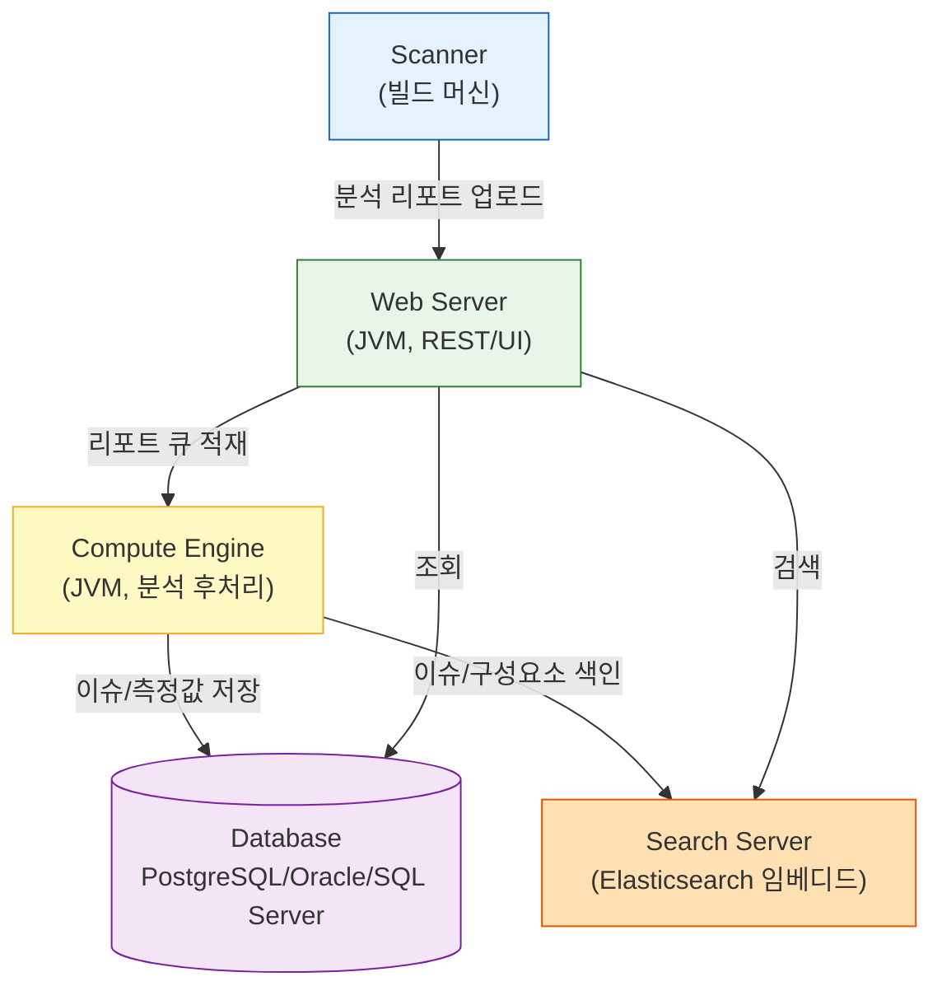
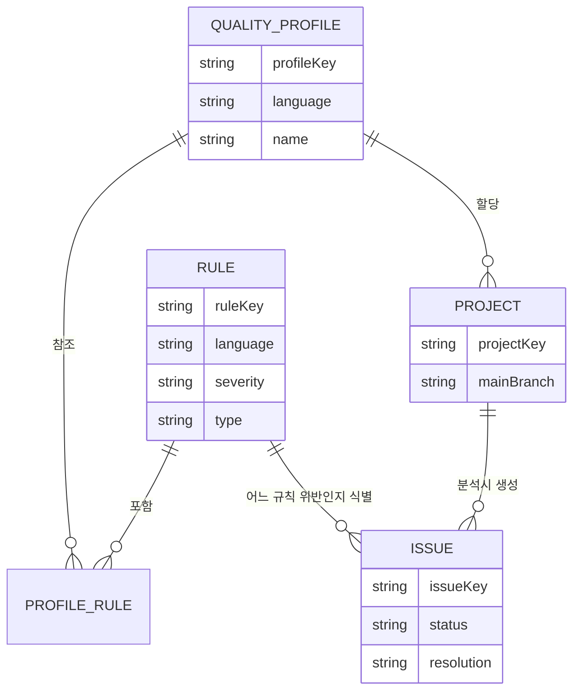

# 정적 분석과 SonarQube 모델

---

> SonarQube가 어떤 결함을 잡고, 내부 컴포넌트와 분석 리소스가 어떻게 짜여 있는지를 한 번에 본다. 도구 선택보다 모델을 먼저 잡는 장이다.

## 1. 정적 분석이 푸는 문제

> 컴파일러와 테스트가 모두 통과한 코드에도 결함은 남는다. 그 결함의 종류를 분류해 두는 것이 정적 분석의 출발점이다.

코드를 빌드하고 테스트가 모두 초록불로 끝났다고 결함이 사라진 것은 아니다. 컴파일러는 타입 시스템 안에서의 모순만 본다. 단위 테스트는 개발자가 의식적으로 작성한 시나리오만 본다. 두 검사 모두 통과해도 다음과 같은 결함은 그대로 남는다.

- 코드가 결과적으로는 동작하지만 잘못된 가정에 의존한 경우 (예: 검증 없이 외부 입력을 SQL에 직접 결합)
- 한 번도 호출되지 않거나 도달 불가능한 분기 (테스트가 도달하지 않은 사각지대)
- 같은 로직이 세 군데에 복제돼 있어 한 곳을 고치면 나머지 두 곳에서 회귀가 일어나는 구조
- 메서드 길이가 200줄을 넘어 사람의 단기 기억으로는 검토가 불가능한 구간

정적 분석(Static Analysis)은 이런 결함을 코드를 실행하지 않고 잡는다. 소스를 파서로 분해해 추상 구문 트리(AST)를 만들고, 그 위에서 데이터 흐름과 제어 흐름을 따라가며 정해진 규칙(Rule)에 어긋나는 패턴을 찾는다. 컴파일러가 보지 못하는 "관습 위반"과 "위험한 의도"를 잡는다는 뜻이다.

### 1.1 SonarQube가 분류하는 결함

SonarQube는 발견한 결함을 7개 축으로 나눈다. 도구가 무엇을 해주는가를 한 번에 보려면 이 분류를 먼저 잡는 것이 빠르다.

| 분류 | 무엇을 잡는가 | 예시 |
|------|------------|------|
| Bug | 동작이 의도와 어긋나는 코드 | NPE 가능성, 잘못된 비교, 빠진 break |
| Vulnerability | 취약점으로 직결되는 코드 | SQL Injection, XSS, 하드코딩된 비밀 |
| Security Hotspot | 보안 영향이 의심되지만 사람 판단이 필요한 지점 | 약한 암호 알고리즘 사용, CORS 설정 |
| Code Smell | 동작은 하지만 유지보수가 어려운 코드 | 복잡도 과다, 중복, 죽은 코드 |
| Coverage | 테스트가 도달하지 않은 코드 | line/branch coverage 부족 |
| Duplication | 같은 코드 블록의 반복 | 토큰 단위 동일 블록 탐지 |
| Maintainability | 전체 가독성·구조 지표 | 인지 복잡도, 메서드 길이 |

Vulnerability와 Security Hotspot은 자주 혼동된다. Vulnerability는 도구가 "확실히 위험하다"고 판정한 결함이며, Security Hotspot은 "위험할 수도 있지만 컨텍스트를 봐야 안다"는 판정이다. 예를 들어 약한 해시(MD5)를 무조건 위험하다고 표시할 수는 없다. 보안 목적이 아닌 빠른 체크섬 용도라면 정상이기 때문이다. 이런 회색지대는 Hotspot으로 분류해 사람이 리뷰 후 "검토 완료" 또는 "수정 필요"로 표시한다.

### 1.2 왜 빌드 단계에서 잡아야 하는가

같은 결함도 발견 시점에 따라 수정 비용이 크게 달라진다. IBM Systems Sciences Institute의 고전적 연구에서 결함 수정 비용은 설계 단계 1, 코드 단계 6.5, 테스트 단계 15, 운영 단계 100으로 집계된 바 있다. 절대 수치는 시대에 따라 달라지지만, "발견이 늦을수록 비용이 폭증한다"는 곡선은 여전히 유효하다.

빌드 단계에서 정적 분석을 끼워 넣으면 결함이 PR 단계에서 가시화된다. 리뷰어가 모든 코드를 손으로 읽지 않아도 도구가 1차 필터를 해 주므로 리뷰 시간이 짧아지고, 사람의 눈은 더 흥미로운 설계 판단에 집중할 수 있다. 운영 단계까지 넘어간 결함은 핫픽스, 사후 분석, 사과 메일이라는 사회적 비용까지 동반한다.

이 한 줄로 요약된다. 정적 분석은 결함 자체를 없애는 도구가 아니라, 결함이 발견되는 위치를 가능한 한 왼쪽(빌드 시점)으로 옮기는 도구다. "Shift Left"라고 부르는 그것이다.

## 2. SonarQube 아키텍처 3-tier

> SonarQube Server는 외부에서 보면 한 덩어리지만, 내부에는 책임이 다른 컴포넌트 셋이 들어 있다. 이 분리를 모르고 운영하면 메모리 산정과 장애 진단이 모두 어긋난다.

SonarQube의 운영 단위는 셋으로 나뉜다. 한 호스트에 모두 떠 있더라도 JVM 프로세스 자체가 분리된다.

각 컴포넌트의 역할은 다음과 같다.

- **Web Server**: REST API와 UI를 제공한다. 사용자 요청을 받고, Scanner가 업로드한 리포트의 입구가 된다. 다만 분석 리포트를 직접 처리하지는 않고, Compute Engine으로 큐잉만 한다.
- **Compute Engine**: 업로드된 분석 리포트를 한 건씩 직렬로 처리한다. 이슈 식별, 측정값 계산, 변경 이력 갱신, Quality Gate 평가, Webhook 발사가 모두 여기서 일어난다. 리포트가 큐에 쌓이면 사용자에게는 "Background Task"라는 이름으로 보인다.
- **Search Server**: Elasticsearch가 임베디드 형태로 떠 있다. 이슈 검색, 컴포넌트 트리 탐색, 측정값 집계 같은 빠른 조회를 책임진다. SonarQube 자체 데이터의 인덱스이지 외부에 노출되는 검색 엔진이 아니다.
- **Database**: 영구 저장 책임을 진다. 평가/평가용 H2가 동봉돼 있지만 실제 운영에서는 PostgreSQL, Oracle, Microsoft SQL Server 중 하나를 써야 한다. H2는 동시성과 백업 모델이 운영에 부적합하다.

### 2.1 분석 결과는 어디에 저장되는가

같은 데이터가 두 곳에 저장된다는 점이 운영자 관점의 첫 번째 함정이다. DB는 진실의 원본이고, Elasticsearch는 그 일부의 인덱스다. ES 인덱스가 손상되면 DB로부터 재생성할 수 있지만, 재생성 시간이 인덱스 크기에 비례한다. 백업은 DB만 떠도 데이터는 살아 있지만, 복구 직후 재시작 시 ES가 새로 채워질 때까지 검색이 비어 보이는 구간이 생긴다.

Compute Engine이 직렬 처리라는 점은 두 번째 함정이다. 큰 모노리포 하나가 30분 분석을 차지하고 있으면 그 동안 들어온 다른 프로젝트의 분석은 큐에 대기한다. Data Center Edition은 이 큐를 분산 노드로 나눠 처리하지만, Community Build와 Developer/Enterprise Edition은 단일 큐다.

## 3. 분석 리소스 모델 — Rule, Quality Profile, Issue

> SonarQube의 분석은 "어떤 규칙으로 어느 프로젝트를 보느냐"의 조합이다. 세 리소스의 관계만 잡으면 전체 흐름이 한 번에 보인다.

세 리소스의 관계는 이렇다.

순서대로 본다. **Rule**은 도구가 검사하는 규칙 한 개다. 예를 들어 자바의 `S1186`은 "메서드 본문이 비어 있으면 안 된다"는 규칙이다. SonarQube는 30+개 언어에 걸쳐 수천 개 규칙을 내장하고, 보안 분석 엔진(SonarSource Security Engine)으로 SAST 규칙도 추가 제공한다.

**Quality Profile**은 Rule들의 묶음이다. 언어별로 하나 이상이 존재하고, 각 프로젝트는 언어마다 하나의 Quality Profile을 사용한다. 기본 Profile은 "Sonar way"라는 이름으로 모든 언어에 제공되며, SonarSource가 권장하는 기본 규칙 세트다. 조직 정책에 따라 일부 규칙을 켜고 끄려면 Sonar way를 복제해 커스텀 Profile을 만든다.

**Issue**는 분석 한 번에서 발견된 결함 인스턴스다. "어느 파일의 몇 번째 줄에서 어느 Rule을 위반했는가"가 한 Issue다. Issue는 라이프사이클을 가진다. OPEN으로 생성된 뒤 CONFIRMED(개발자가 인정), RESOLVED(고쳐졌다고 표시), REOPENED(분석 결과 다시 발견됨), CLOSED(다음 분석에서 사라져 종결) 중 하나의 상태에 있다.

### 3.1 Rule 한 개가 어떻게 한 Issue를 만드는가

분석 한 번의 데이터 흐름은 다음과 같다. 코드 변경 → Scanner가 AST 생성 → 활성화된 Rule들이 AST를 순회하며 위반 패턴 탐지 → 각 위반은 위치(파일, 라인, 컬럼) 정보와 함께 Issue로 묶임 → Web Server로 업로드 → Compute Engine이 기존 Issue와 매칭(같은 파일·같은 메시지면 동일 Issue로 추적) → DB와 ES에 반영 → Quality Gate 평가.

이 흐름의 핵심은 "동일 Issue 추적"이다. 분석을 매번 새로 한다고 Issue가 매번 새로 생기지는 않는다. SonarQube는 라인 시프트, 메서드 이동, 리팩터링까지 어느 정도 견디며 같은 결함을 같은 Issue로 묶는다. 그래서 "이 결함을 발견한 지 30일이 됐는데 아직 안 고쳤다"는 식의 추적이 가능해진다.

### 3.2 Standard Experience Mode와 MQR Mode

SonarQube 2025.x부터 인스턴스는 두 모드 중 하나로 운영된다.

**Standard Experience Mode**는 전통적 분류다. 한 Rule이 한 종류의 결함(Bug / Vulnerability / Code Smell 중 하나)에 매핑되고, severity는 Blocker, Critical, Major, Minor, Info 중 하나다. 결함 종류와 severity 모두 Rule 하나당 한 값이다.

**MQR Mode**(Multi-Quality Rule)는 한 Rule이 여러 품질 차원(security, reliability, maintainability)에 동시 영향을 미친다는 새 모델이다. 같은 Rule이라도 어느 품질에 영향을 주느냐에 따라 다른 severity를 가진다. severity 자체도 Blocker, High, Medium, Low, Info의 5단계로 갱신됐다.

같은 결함을 다르게 부르는 게 아니라, 분류 축이 달라졌다는 뜻이다. 예를 들어 "암호화되지 않은 통신 채널 사용"은 Standard 모드에서 Vulnerability/Critical 하나의 라벨을 받지만, MQR 모드에서는 security: High, reliability: Medium처럼 두 개의 영향도가 동시에 매겨진다.

| 측면 | Standard Experience | MQR (Multi-Quality Rule) |
|------|--------------------|-----------------------|
| 분류 축 | Bug / Vulnerability / Code Smell | security / reliability / maintainability |
| Rule당 영향 차원 | 1개 | 1+ 개 (다중 영향) |
| Severity 단계 | Blocker / Critical / Major / Minor / Info | Blocker / High / Medium / Low / Info |
| 도입 시점 | SonarQube의 전통 모델 | 2024년 도입, 2025+ 권장 |

신규 인스턴스에서는 MQR이 기본이다. 기존 인스턴스를 MQR로 전환하면 과거 Issue의 severity가 재계산되므로, 대규모 인스턴스에서는 전환 시점을 PR 마감과 겹치지 않게 잡는다.

## 4. Quality Gate 모델

> 분석 결과를 "통과/실패"로 한 번에 판정하는 게이트다. CI 파이프라인의 빨간불·초록불을 결정하는 것이 이 모델이다.

분석이 끝나면 Compute Engine이 마지막으로 하는 일이 Quality Gate 평가다. Quality Gate는 측정값(metric)에 대한 조건의 묶음이다. 예를 들어 "신규 코드에서 Coverage가 80% 미만이면 실패", "신규 코드에서 Vulnerability가 1건 이상이면 실패" 같은 조건이 모이면 한 Gate가 된다.

기본 게이트는 "Sonar way"라는 이름으로 제공되며, SonarSource가 권장하는 6~10개 조건으로 구성된다. 조건은 두 축 중 하나에 걸린다.

- **New Code 조건**: 새로 추가/변경된 코드에만 적용. "이번 PR이 가져온 신규 결함" 관점.
- **Overall Code 조건**: 프로젝트 전체 코드에 적용. "현재 프로젝트의 누적 상태" 관점.

Sonar way 기본 게이트는 거의 모든 조건이 New Code 축에 걸려 있다. 이 선택이 Clean as You Code 정책의 기술적 구현이며, 다음 절에서 따로 다룬다.

### 4.1 Gate 평가 결과의 전달 경로

평가 결과는 PASSED 또는 FAILED 중 하나로 결정된다. 결과는 세 경로로 전달된다.

1. SonarQube UI에 프로젝트 상태로 표시된다 (대시보드 위 큰 배지).
2. Web API `/api/qualitygates/project_status` 로 조회 가능하다. CI 파이프라인이 폴링하는 입구다.
3. Webhook이 등록돼 있으면 분석 종료 직후 페이로드가 발사된다. CI 파이프라인이 빌드 결과를 기다리지 않고 비동기로 받는 입구다.

빌드 파이프라인이 결과를 빨리 알아야 할 때는 Webhook이 빠르고, 단순한 동기 폴링이면 `/api/qualitygates/project_status`가 단순하다. SonarScanner는 `-Dsonar.qualitygate.wait=true` 옵션으로 결과를 기다리는 동기 모드도 제공한다. CI 파이프라인이 단일 스텝이라면 이 옵션이 가장 단순한 선택이다.

### 4.2 Quality Profile과 Quality Gate의 책임 분리

자주 헷갈리는 두 개념을 한 줄로 정리한다. Quality Profile은 "어떤 규칙으로 검사할지"를 정한다. Quality Gate는 "검사 결과가 어떤 수치 이상이면 실패로 본다"를 정한다. 검사기와 채점표의 차이라고 보면 된다. Profile을 바꾸면 발견되는 Issue 자체가 바뀌고, Gate를 바꾸면 같은 Issue 수에서 통과/실패 판정만 바뀐다.

## 5. Clean as You Code

> 기존 부채를 강제 청산하지 않고 신규 결함을 막는 정책 철학이다. SonarQube의 기본 게이트가 이 철학을 따른다.

레거시 코드베이스에 SonarQube를 처음 붙이면 Issue가 수천 건이 잡히는 게 보통이다. 이걸 한꺼번에 청산하라고 강요하면 두 가지 일이 동시에 일어난다. 첫째, 정상 기능 개발이 마비된다. 둘째, 의무감으로 빠르게 닫는 과정에서 잘못된 수정이 들어가 회귀를 부른다.

Clean as You Code(이하 CAYC)는 이 함정을 우회하는 정책이다. 핵심 명제는 단순하다. "기존 코드의 결함은 그대로 두되, **새로 쓰는 코드**는 깨끗해야 한다." 시간이 지나 코드의 상당 부분이 새로 쓰인 코드로 치환되면 결과적으로 전체 코드도 깨끗해진다.

### 5.1 New Code 정의가 핵심

CAYC가 작동하려면 "새 코드"가 무엇인지 정확하게 정의돼야 한다. SonarQube는 "New Code Period"를 프로젝트 단위로 설정한다. 정의 방식은 다음과 같다.

- 특정 분석 이후 (이전 릴리스 분석 시점부터)
- 특정 버전 이후 (예: `1.4.0` 이후)
- 특정 일자 이후
- 이전 버전 이후 (지정한 갯수만큼 과거 버전부터)
- 참조 브랜치와의 차이 (예: `main`과 비교한 신규)

PR 분석에서는 자동으로 "PR 대상 브랜치와의 차이"가 New Code가 된다. main 브랜치 분석에서는 직전 릴리스 또는 직전 분석을 기준으로 잡는 게 일반적이다.

### 5.2 게이트 조건이 New Code에 몰리는 이유

Sonar way 기본 게이트는 다음과 같은 New Code 조건을 가진다.

- 신규 코드 Coverage ≥ 80%
- 신규 코드 Duplicated Lines (%) ≤ 3%
- 신규 코드 Maintainability Rating = A
- 신규 코드 Reliability Rating = A
- 신규 코드 Security Rating = A
- 신규 코드 Security Hotspots Reviewed = 100%

전체 코드 조건은 거의 없다. 이유는 명확하다. 전체 코드 조건을 거는 순간 게이트는 첫 분석부터 영구히 빨간불이 된다. 신규 코드에만 게이트를 걸면 첫 분석부터 게이트가 의미 있게 작동하고, 시간이 흐르면서 자연스럽게 코드 품질이 수렴한다.

이 정책 선택이 CAYC다. 기술적 트릭이 아니라 "어떻게 해야 사람이 따라올 수 있는 게이트가 되는가"에 대한 답이다.

## 6. 외부에 결과를 알리는 경로

> 분석 결과는 SonarQube 안에서 끝나지 않는다. CI 파이프라인, GitLab/GitHub PR, 외부 시스템이 결과를 어떻게 받느냐가 도구 가치를 결정한다.

SonarQube가 분석 결과를 외부로 내보내는 경로는 셋이다.

1. **Web API** — 동기 조회. CI가 `/api/qualitygates/project_status?projectKey=...` 같은 GET 요청으로 결과를 본다.
2. **Webhook** — 비동기 푸시. 분석 종료 직후 SonarQube가 등록된 URL로 페이로드를 POST한다. 페이로드에는 프로젝트, Quality Gate 결과, 변경된 측정값 요약이 들어 있다.
3. **DevOps Platform 통합** — GitLab/GitHub/Bitbucket/Azure DevOps에 직접 연결. PR 코멘트, 커밋 상태(check), 디코레이션을 SonarQube가 직접 수행한다. Developer Edition 이상에서 제공된다.

> 예시(상세는 4장에서): TPS Operator 모듈은 SonarQube를 admin tool로 등록받으면 글로벌 Webhook을 자동 등록한다. Webhook 핸들러를 별도 서비스(executor)에 두고, SonarQube의 분석 종료 이벤트를 자체 분석 결과 모델로 변환한다.

API와 Webhook의 선택은 단순하다. CI가 빌드 안에서 결과를 기다려야 하면 API + `sonar.qualitygate.wait=true`. 외부 시스템이 결과를 받아 자체 워크플로우를 트리거해야 하면 Webhook. 두 경로는 배타적이지 않고, 동시에 쓰는 경우가 흔하다.

## 7. 정리 — 다음으로 무엇을 보아야 하는가

> 1장은 도구의 모델만 잡았다. 실제로 띄우고 운영하는 어휘는 다음 문서에서 본다.

지금까지 본 것을 한 문장씩으로 요약하면 이렇다. 정적 분석은 결함 발견 시점을 빌드로 옮기는 도구다. SonarQube는 Web/Compute Engine/Search/DB 4개 컴포넌트로 분석 파이프라인을 구성한다. Rule을 묶어 Quality Profile을 만들고, 측정값 조건을 묶어 Quality Gate를 만들며, 둘을 분리하는 것이 책임 설계의 핵심이다. Clean as You Code는 게이트 조건을 New Code에 거는 정책이다. MQR 모드는 한 Rule을 여러 품질 차원에 매핑하는 새 모델이며 2025년 이후 신규 인스턴스의 기본이다.

남은 질문은 운영 어휘다. 한 호스트에 어떻게 띄우고, JVM과 Elasticsearch 메모리를 어떻게 산정하며, Scanner는 어떻게 고르고, 분석 한 번이 시간 축에서 어떻게 펼쳐지는가. 이걸 다음 문서 [01-02.운영 환경과 분석 흐름](01-02.운영 환경과 분석 흐름.md)에서 본다.

분석 리소스를 더 깊게 본 뒤 외부 통합으로 가고 싶다면 2장(Rule/Profile/Issue 깊이) → 3장(Web API와 Webhook) → 4장(Gradle Scanner와 TPS 사례) 순서로 읽는다.
