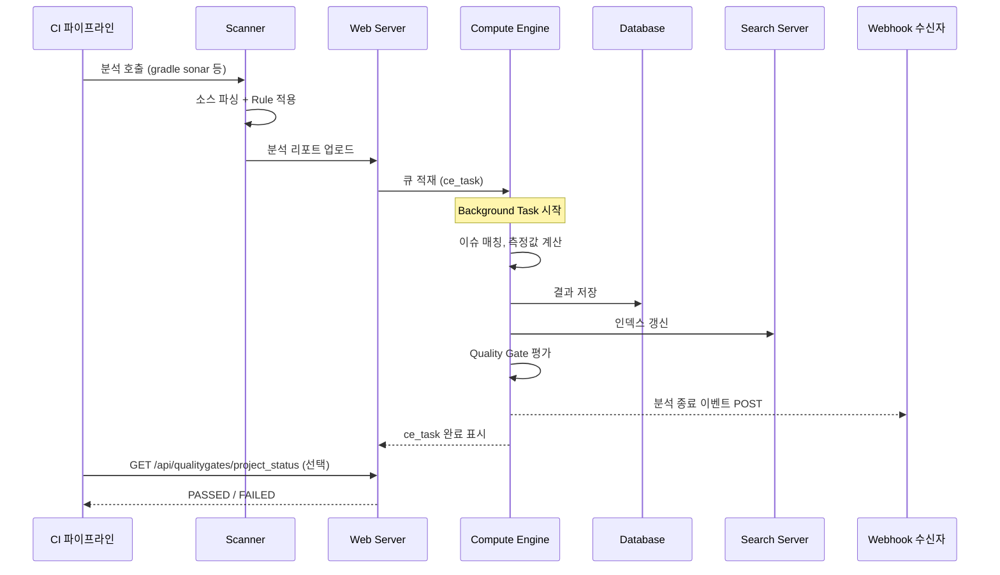

# 운영 환경과 분석 흐름

---

> 설치·메모리 산정·Scanner 선택·분석 한 번의 시간 축을 운영 어휘로 잡는다. 1장이 모델을 잡았다면 이 문서는 그 모델이 실제 호스트에서 어떻게 살아 움직이는지를 본다.


## 1. 배포 모델과 에디션 선택

> "어디에 띄울 것인가"와 "어느 에디션을 쓸 것인가"는 분리된 결정이지만 결과적으로 운영 비용이 함께 결정된다.

배포 형태는 셋 중 하나다.

- **Docker (단일 컨테이너)**: SonarSource 공식 이미지(`sonarqube:<tag>-community` 또는 `:<tag>`) 한 개로 시작. 운영 친화적이지만 단일 노드 제약이 그대로 따라온다.
- **Kubernetes (Helm chart)**: SonarSource 공식 차트 사용. PVC, Secret, Ingress 등 K8s 자원으로 구성. ES 인덱스 영속화 옵션과 reverse proxy 통합이 차트에 들어가 있다.
- **VM 직접 설치**: 압축 배포본을 풀어 systemd 서비스로 등록. 사내 보안 정책상 컨테이너가 막힌 환경에서 쓴다.

선택의 축은 단순하다. 팀에 K8s 운영 역량이 있고 다른 워크로드도 K8s 위에서 돌고 있다면 Helm이 자연스럽다. 그렇지 않다면 Docker Compose로 출발해서 부담이 커지면 옮긴다. 처음부터 K8s에 띄우는 것은 K8s 자체의 운영 복잡도를 한 번에 안고 가는 것이라 추천하지 않는다.

### 1.1 에디션은 별도 결정이다

SonarQube는 라이선스에 따라 사용 가능한 기능이 다르다. 2025년 기준 에디션은 다음과 같다.

| 에디션 | 가격 | 핵심 차이 |
|--------|------|----------|
| Community Build | 무료 (오픈소스) | 단일 브랜치만 분석, PR 분석 없음, MQR 기본 |
| Developer Edition | 유료 (라인 수 기반) | 다중 브랜치, PR 분석, DevOps Platform 통합 |
| Enterprise Edition | 유료 | 포트폴리오 관리, 보안 보고서, LDAP/SAML, 고급 SAST |
| Data Center Edition | 유료 | 고가용성, 분산 Compute Engine, 검색 노드 분리 |

PR 분석이 없는 Community Build로는 Clean as You Code의 기본 사용법인 "PR 단위 게이트"를 쓸 수 없다는 점이 가장 큰 제약이다. 팀이 PR 워크플로우를 쓴다면 Developer Edition 이상이 사실상 필수다.

> 메모: 2024년 SonarSource는 기존 "Community Edition"을 "Community Build"로 리브랜딩하면서 오픈소스 라이선스도 LGPL v3에서 SSALv1으로 변경했다. SaaS 형태로 재판매하지 않는 일반 사내 사용에는 영향이 없지만, 라이선스 검토가 필요한 조직은 SSALv1 조항을 한 번 확인할 필요가 있다.


## 2. JVM과 Elasticsearch 메모리 산정

> 한 프로세스가 아니라 세 개의 JVM이 각자 메모리를 먹는다는 사실이 운영자가 처음 만나는 함정이다.

1장에서 본 3-tier 구조 — Web Server, Compute Engine, Search Server — 는 한 호스트 위에서 각자 별개의 JVM으로 뜬다. 따라서 메모리 설정도 셋이 따로다. 공식 권장 출발값은 다음과 같다.

```properties
# Web Server JVM options
sonar.web.javaOpts=-Xmx512m -Xms128m -XX:+HeapDumpOnOutOfMemoryError

# Compute Engine JVM options
sonar.ce.javaOpts=-Xmx512m -Xms128m -XX:+HeapDumpOnOutOfMemoryError

# Elasticsearch JVM options
sonar.search.javaOpts=-Xmx512m -Xms512m -XX:+HeapDumpOnOutOfMemoryError
```

세 옵션의 합이 컨테이너/VM의 메모리 한계를 초과하지 않게 잡아야 한다. 실제로는 OS 캐시·JIT 메타스페이스·네이티브 라이브러리까지 들어가므로 합계 외 1~2GB 여유가 필요하다.

### 2.1 어디를 늘려야 하는가

분석 대상이 커지면 Compute Engine이 가장 먼저 한계에 닿는다. 하나의 분석 리포트는 큰 모노리포에서 수백 MB까지 커지고, 그걸 메모리에 펼쳐서 처리하기 때문이다. Compute Engine OOM이 터지면 분석이 실패하면서 큐가 막히는 형태로 증상이 나타난다. 운영 메모리 분포는 보통 Web < Search ≤ Compute Engine 순으로 잡는다.

Search Server는 Elasticsearch이므로 OS 페이지 캐시도 같이 사용한다. ES 공식 가이드대로 heap을 32GB 이상으로 늘리지 말고, 그 이상이 필요하다면 Data Center Edition으로 검색 노드를 분리하는 게 맞다.

### 2.2 Linux의 vm.max_map_count 사전 조건

Elasticsearch는 mmap 기반 파일 입출력에 의존한다. 리눅스 기본값(65530)으로는 시작에 실패하므로 다음 값으로 올려야 한다.

```bash
sysctl vm.max_map_count
sudo sysctl -w vm.max_map_count=524288

echo "vm.max_map_count=524288" | sudo tee -a /etc/sysctl.conf
```

Docker 환경에서는 호스트 커널 파라미터이므로 컨테이너 안에서 바꾸지 말고 호스트에서 설정한다. K8s에서는 노드 OS 이미지 수준에서 잡거나, init container로 강제 적용하는 패턴을 쓴다.


## 3. Scanner 종류와 선택

> 분석은 SonarQube Server가 하는 게 아니라 Scanner가 한다. 서버는 결과 수집·후처리·저장을 맡는다. 그래서 Scanner를 빌드 머신에 어떻게 들이느냐가 첫 운영 결정이 된다.

Scanner는 빌드 환경에 맞춰 여러 종류가 제공된다.

- **SonarScanner CLI**: 범용 명령줄 도구. 빌드 시스템과 무관한 폴리글랏 프로젝트, 또는 사전 빌드된 산출물 디렉터리를 분석할 때 쓴다.
- **SonarScanner for Gradle**: Gradle 플러그인. `id 'org.sonarqube'` 한 줄로 적용되며 Gradle 프로젝트 메타에서 소스 경로·테스트 경로·언어를 자동 추출한다.
- **SonarScanner for Maven**: Maven `sonar:sonar` 골. Maven 프로젝트 모델에서 자동 추출.
- **SonarScanner for .NET**: MSBuild 통합. .NET 솔루션 파일 기반.
- **SonarScanner for Jenkins**: Jenkins 플러그인. 위 Scanner들을 Jenkins 환경에서 호출하는 래퍼와 자격 증명 주입 도구.

선택 기준은 단순하다. 빌드 시스템이 정해져 있으면 그에 맞는 Scanner를 쓴다. CLI는 마지막 선택지다. 빌드 시스템 통합 Scanner는 자동으로 다음 정보를 추출한다.

- 소스 디렉터리와 테스트 디렉터리
- 언어 (확장자가 아닌 빌드 메타 기반)
- 컴파일된 바이너리 위치 (자바라면 `.class` 경로 — 일부 Rule은 바이트코드 분석 필요)
- 의존성 클래스패스 (SAST 분석에 필요)

CLI를 쓰면 위 정보를 `sonar-project.properties`로 모두 손으로 명시해야 한다. 작은 프로젝트에서는 가능하지만 멀티모듈 Gradle 빌드에서는 사실상 불가능하다.

### 3.1 분석 한 번을 호출하는 방법

빌드 시스템 통합 Scanner를 쓸 때의 호출 인터페이스는 다음과 같다. Gradle 예시다.

```bash
./gradlew sonar \
  -Dsonar.host.url=http://sonarqube.internal \
  -Dsonar.token=$SONAR_TOKEN \
  -Dsonar.projectKey=my-project
```

CI에서는 `SONAR_TOKEN`을 시크릿에서 주입하고, `projectKey`는 Gradle 프로젝트 그룹·이름에서 자동 도출되거나 명시적으로 준다. `sonar.host.url`은 환경변수(`SONAR_HOST_URL`)로도 받는다.

> 예시(상세는 4장에서): TPS `pipeline-api` 모듈은 `org.sonarqube` Gradle 플러그인을 적용해 Scanner for Gradle을 사용한다(`pipeline-api/build.gradle:8`). 별도 `sonar-project.properties` 없이 Gradle 프로젝트 메타에서 모든 분석 속성을 자동 추출하는 구성이다.


## 4. 분석 한 번의 시간 축

> Scanner가 끝났다고 분석이 끝난 게 아니다. 사용자에게 결과가 보이기까지 다섯 단계가 더 남았다.

분석 한 번의 흐름을 시간 순으로 펼치면 다음과 같다.



이 흐름의 핵심 사실 셋이다.

1. Scanner가 종료해도 분석은 끝난 것이 아니다. 결과가 사용자에게 보이려면 Compute Engine의 Background Task가 완료돼야 한다. SonarQube 공식 문서가 이 점을 명시적으로 언급한다.
2. Compute Engine은 직렬 처리이므로 큰 분석 리포트가 큐 앞에 있으면 뒤에 들어온 작은 분석도 대기한다. Data Center Edition만 이 큐를 분산 노드로 나눈다.
3. Webhook은 분석 종료 후 발사되며, 페이로드에는 프로젝트 키와 Quality Gate 결과가 포함된다. CI가 빌드 안에서 결과를 기다려야 한다면 Webhook이 아닌 동기 폴링 또는 `sonar.qualitygate.wait=true`가 적합하다.

### 4.1 CI 파이프라인이 결과를 받는 세 패턴

같은 결과를 어떻게 받느냐에 따라 파이프라인 구조가 달라진다.

- **동기 대기 (`sonar.qualitygate.wait=true`)**: Scanner가 결과를 기다렸다가 종료. 게이트가 FAILED면 Scanner 자체가 비영(non-zero) 종료. 가장 단순하지만 Compute Engine이 늦으면 빌드 시간이 늘어난다.
- **폴링**: Scanner는 즉시 끝내고, 후속 스텝이 `/api/ce/task?id=...`로 분석 완료를 폴링한 뒤 `/api/qualitygates/project_status`로 결과 조회. 빌드 시간이 일정해진다.
- **Webhook 비동기**: 빌드는 Scanner 종료 시점에 함께 종료. Webhook을 받는 별도 서비스가 후속 워크플로우(알림, 배포 차단)를 트리거. CI 파이프라인 안에 결과가 들어오지 않으므로 "이 빌드의 게이트 결과"라는 개념이 약해진다.

> 예시(상세는 4장에서): TPS Operator는 세 번째 패턴을 쓴다. SonarQube가 admin tool로 등록되면 글로벌 Webhook을 자동 생성하고, 별도 서비스(executor)가 Webhook을 받아 자체 분석 결과 모델에 적재한다.


## 5. 인증과 토큰 모델

> 누가 어디서 SonarQube에 접근하느냐에 따라 줘야 하는 토큰 종류가 달라진다. 셋의 권한 범위를 잡아야 최소 권한 원칙이 작동한다.

SonarQube의 토큰은 셋이다.

- **User Token**: 특정 사용자를 대신해 행동. 그 사용자의 모든 권한을 그대로 가진다. UI 외부에서 사용자가 자신을 대신해 호출할 때 쓴다. CI에서 쓰면 사용자 권한이 통째로 노출되므로 운영에는 부적합하다.
- **Project Analysis Token**: 한 프로젝트에 대한 분석 업로드 권한만 가짐. 가장 좁은 권한이며 CI 파이프라인의 분석 호출에 적합하다.
- **Global Analysis Token**: 모든 프로젝트의 분석 업로드 권한을 가진다. 여러 프로젝트를 한 빌드 머신에서 분석하는 경우에 쓴다. 단일 토큰 유출의 폭발 반경이 크므로 보관에 주의한다.

### 5.1 어느 토큰을 어디에 쓰는가

CI 파이프라인의 분석 호출에는 Project Analysis Token이 기본이다. 한 빌드 머신이 여러 프로젝트를 다룬다면 Global Analysis Token으로 합치는 것도 가능하지만, 그 경우 토큰 회전 정책을 더 엄격하게 운영한다.

UI 외부에서 사용자 행동을 대신해야 한다면 User Token이지만, 이 경우는 보통 사람이 직접 도구를 쓰는 시나리오다. 자동화에 User Token을 쓰는 것은 안티패턴이다.

토큰 회전은 SonarQube가 만료일을 강제하지 않으므로 운영 책임이다. 90일 또는 180일 단위로 회전하고, 회전 시 시크릿 매니저(GitLab CI variables, GitHub Actions secrets, Vault 등)에서 즉시 갱신한다.


## 6. 업그레이드와 호환성

> SonarQube 업그레이드는 DB 마이그레이션을 동반하는 일이라 다운타임 산정이 핵심이다. LTS 트랙을 알면 일정 잡기가 단순해진다.

SonarSource는 2024년부터 LTS(Long-Term Support) 트랙을 명시적으로 운영한다. 트랙은 셋이다.

- **LTS Active**: 2년 지원. 보안 패치와 버그 수정만 적용. 안정성 우선 운영에 적합.
- **LTS Previous**: 직전 LTS. 다음 LTS로 갈아타기 전까지 6~9개월 병행 지원.
- **Latest**: 매월 또는 분기마다 출시되는 신기능 포함 버전. 새 기능을 빨리 받고 싶지만 안정성을 일부 양보할 수 있는 운영에 적합.

운영 인스턴스는 LTS Active를 따라가는 게 일반적이다. Latest 트랙은 SaaS(SonarQube Cloud)나 신기능 검증용 서브 인스턴스에 둔다.

### 6.1 마이그레이션 절차의 핵심

업그레이드는 다음 순서로 진행된다. 각 단계가 동기적으로 끝나야 다음으로 넘어간다는 점이 운영 일정 산정의 출발이다.

1. SonarQube 정지
2. DB 백업 (이게 빠지면 회복 불가능한 사고가 난다)
3. ES 인덱스 백업 또는 삭제 (ES는 DB로부터 재생성 가능)
4. 새 버전 압축 해제 또는 새 이미지 적용
5. SonarQube 재시작 — DB 스키마 마이그레이션이 자동 시작
6. UI에 "Setup is required" 화면이 뜨면 `/setup`에서 마이그레이션 트리거
7. 완료 후 ES 재인덱싱 (인덱스를 지웠을 경우)

DB 마이그레이션 시간은 인스턴스 크기(이슈 수, 분석 이력)에 비례한다. 큰 인스턴스에서는 몇 시간 걸릴 수 있어 주말 또는 야간 작업창에 잡는다. 메이저 버전을 건너뛸 수 있는지는 버전 조합에 따라 다르므로 SonarSource 공식 매트릭스를 항상 확인한다.

### 6.2 호환성 절벽 지점

업그레이드 시 자주 부딪히는 호환성 절벽은 다음 셋이다.

- **DB 종류 변경**: H2 → PostgreSQL 전환은 마이그레이션 도구가 따로 있고, 경계 위에서 한 번에 옮긴다. PostgreSQL → Oracle 같은 횡 이동은 공식 지원이 없으므로 새 인스턴스를 띄우고 분석 이력을 포기하는 게 현실적이다.
- **Java 런타임**: SonarQube 자체가 요구하는 Java 버전이 메이저 버전마다 올라간다. 2025+ 버전은 Java 17 또는 21을 요구한다.
- **Scanner 호환성**: 신버전 SonarQube는 구버전 Scanner를 어느 정도 지원하지만, 신규 분석 기능은 신버전 Scanner를 요구한다. CI 파이프라인의 Scanner 버전도 함께 올린다.


## 7. 정리 — 다음으로 무엇을 보아야 하는가

> 이 문서로 운영 어휘를 잡았다. 분석 모델 자체를 더 깊게 보거나 외부 통합 패턴으로 가는 길이 다음 단계다.

요약하면 이렇다. SonarQube는 Web/Compute Engine/Search 세 JVM과 외부 DB로 구성되며, 메모리 산정도 셋을 따로 본다. Linux 호스트는 `vm.max_map_count`를 524288 이상으로 올려야 ES가 뜬다. Scanner는 빌드 시스템에 맞춰 고르고, 폴리글랏 프로젝트만 CLI를 쓴다. 분석 한 번의 흐름은 Scanner → 업로드 → Compute Engine 큐 → DB/ES 반영 → Quality Gate → Webhook의 직렬 파이프라인이다. CI가 결과를 받는 방법은 동기 대기 / 폴링 / Webhook 셋 중 하나이고, 토큰은 Project Analysis Token이 기본이다. 업그레이드는 DB 마이그레이션이 동반되므로 LTS Active 트랙을 따라가는 게 안전하다.

다음 단계로 갈 수 있는 두 갈래가 있다. 분석 리소스 자체를 더 보고 싶다면 2장(Rule/Quality Profile/Issue 깊이). 외부 통합 패턴이 궁금하다면 3장(Web API와 Webhook 구조)을 거쳐 4장(Gradle Scanner와 TPS 사례)으로 간다.

먼저 1장의 핵심 통찰만 빠르게 점검하고 싶다면 [01-점검.핵심 질문과 답](01-점검.핵심 질문과 답.md)으로 간다.
