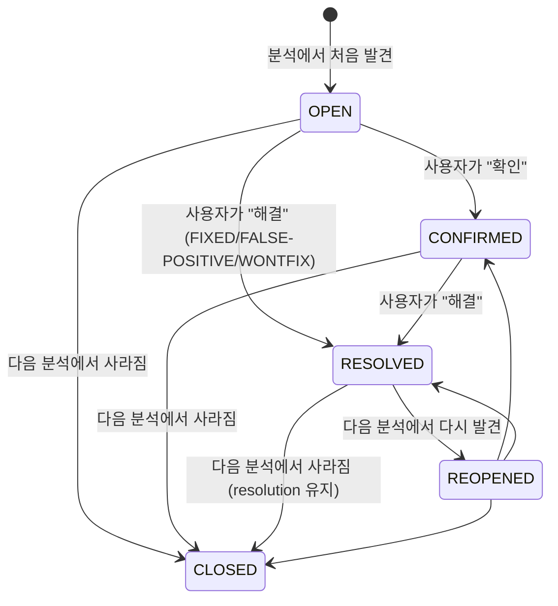

# Issue와 Security Hotspot

---

> 분석에서 발견된 결함의 라이프사이클을 본다. Issue가 어떻게 생성·추적·종결되는지, Security Hotspot이 일반 Issue와 무엇이 다른지를 운영 어휘로 정리한다.

## 1. Issue 한 개의 정체

> 한 Issue는 "어느 파일의 몇 번째 줄에서 어느 Rule을 위반했는가"의 한 인스턴스다. 분석 한 번이 N개의 Issue를 만든다.

Issue는 다음 속성으로 식별된다.

| 속성 | 의미 |
|------|------|
| `key` | Issue 고유 식별자 (분석 과정에서 자동 부여) |
| `rule` | 어느 Rule 위반인지 |
| `component` | 어느 파일 (예: `org.okestro:pipeline-api:src/main/java/.../Foo.java`) |
| `line` | 위반 시작 줄 |
| `textRange` | 정확한 시작·끝 위치 (line, column) |
| `message` | Rule이 생성한 사람 가독 메시지 |
| `severity` | 심각도 (Standard 또는 MQR) |
| `status` | 라이프사이클 상태 |
| `resolution` | 종결 사유 (status가 종결 상태일 때) |
| `creationDate` | 처음 발견된 시점 |
| `updateDate` | 마지막 변경 시점 |

분석 한 번이 같은 위반을 다시 발견했을 때 Issue를 새로 만들지 않고 기존 Issue를 갱신하는 것이 SonarQube 추적 모델의 핵심이다. 이 추적이 어떻게 동작하는지가 다음 절의 주제다.

## 2. Issue 추적 — 같은 결함을 같은 Issue로 묶기

> 분석을 매번 새로 한다고 Issue가 매번 새로 생기지는 않는다. SonarQube는 라인 시프트, 메서드 이동, 일부 리팩터링까지 견디며 동일 Issue를 추적한다.

SonarQube의 Issue 추적 알고리즘은 다음 순서를 거친다.

1. 새 분석에서 발견된 위반과 기존 Issue를 같은 파일 안에서 매칭 시도.
2. 1차 키 — `(rule, message, line)` 일치 (가장 단순한 매칭).
3. 라인이 시프트됐을 가능성이 있으므로 `(rule, message, code line content)`도 시도.
4. 파일이 이름 바뀌었거나 옮겨졌을 경우 변경 이력(SCM) 정보를 활용.
5. 어느 매칭에도 걸리지 않은 새 위반은 신규 Issue로 등록.
6. 기존 Issue 중 매칭되지 않은 것은 "결함이 사라졌다"고 보고 CLOSED로 전환.

이 알고리즘 덕에 Issue의 `creationDate`는 결함이 처음 등장한 시점을 정확히 보존한다. "이 결함을 발견한 지 30일 됐는데 아직 안 고쳤다" 같은 운영 통찰이 가능해진다.

### 2.1 추적이 깨지는 경우

추적 알고리즘이 완벽하지는 않다. 다음 경우에는 같은 결함이 새 Issue로 잡힐 수 있다.

- **대규모 리포맷팅**: 코드 스타일 변환으로 모든 줄이 시프트된 PR. 라인 정보와 코드 라인 내용이 동시에 바뀌면 추적이 깨진다.
- **메서드 이름 변경 + 위치 이동**: 메서드를 다른 파일로 옮기면서 이름까지 바꾸면 SonarQube가 같은 결함으로 인식하지 못한다.
- **언어 분석기 메이저 업그레이드**: 새 분석기가 같은 위반을 다른 message로 보고하면 추적이 끊긴다.

이런 경우 기존 Issue가 CLOSED로 전환되고 새 Issue가 OPEN으로 생긴다. `creationDate`가 새 시점으로 리셋되므로 "30일 추적"이 0일로 돌아간다는 점이 운영 부작용이다.

## 3. 라이프사이클 상태

> Issue는 5개 상태 중 하나에 있다. 상태 전환은 자동(분석 결과)과 수동(사용자 결정) 둘 다로 일어난다.

라이프사이클 다이어그램을 시간 순으로 본다.

각 상태의 의미를 정리한다.

- **OPEN**: 새로 발견된 결함. 아직 사용자가 보지 않았거나 처리하지 않은 상태.
- **CONFIRMED**: 사용자가 "이 결함을 인정한다"고 명시한 상태. 즉시 해결할 시간이 없지만 무시해서는 안 된다는 표시.
- **RESOLVED**: 사용자가 종결을 선언한 상태. 종결 사유(resolution)가 함께 붙는다.
- **REOPENED**: RESOLVED로 종결됐는데 다음 분석에서 다시 발견된 상태. 수정이 충분하지 않았다는 신호.
- **CLOSED**: 다음 분석에서 결함이 사라진 상태. 진짜 고쳐졌거나, Rule이 비활성화됐거나, 코드가 삭제됐거나.

### 3.1 RESOLVED의 세 가지 사유

RESOLVED 상태는 resolution 속성으로 더 세분된다.

| Resolution | 의미 | 효과 |
|-----------|------|------|
| `FIXED` | 결함이 수정됨 | 다음 분석에서 사라지면 CLOSED. 다시 발견되면 REOPENED |
| `FALSE-POSITIVE` | 도구가 잘못 잡음 | 같은 Issue가 다시 발견되도 RESOLVED 유지 |
| `WONTFIX` | 알지만 고치지 않기로 결정 | 위와 동일 — 같은 결함이 다시 발견되도 무시 |

`FIXED`는 "고쳤다고 주장"이며 검증은 다음 분석이 한다. `FALSE-POSITIVE`와 `WONTFIX`는 "재발견 시에도 무시"라는 의미를 가진다. 이 둘은 신중하게 써야 한다. 한 번 분류하면 그 결함은 영원히 무시된다.

### 3.2 자동 전환과 수동 전환

상태 전환의 주체를 정리한다.

- **자동 (분석 결과로 전환)**: OPEN 생성, CLOSED 종결, REOPENED 재발견.
- **수동 (사용자 결정)**: OPEN → CONFIRMED, OPEN/CONFIRMED → RESOLVED, REOPENED → CONFIRMED/RESOLVED.

Quality Gate가 평가할 때 OPEN과 CONFIRMED는 "활성 결함"으로 카운트되고, RESOLVED와 CLOSED는 카운트되지 않는다. 따라서 `WONTFIX`로 종결된 Issue는 Gate 통과에 영향이 없다. 이 사실이 `WONTFIX` 남용의 위험을 만든다 — 빨간불을 끄기 위해 Issue를 무시하는 데 쓰일 수 있다.

## 4. Severity 모델 — Standard와 MQR

> Severity는 두 모드에서 다르게 표현된다. 같은 결함이 운영 정책에 따라 다른 정량 라벨을 갖는다.

Standard Experience 모드의 severity는 단일 값이다.

- BLOCKER — 즉시 수정해야 하는 결함. 운영 사고로 직결.
- CRITICAL — 가까운 시일에 수정해야 하는 결함.
- MAJOR — 일반적 결함.
- MINOR — 상대적으로 덜 중요한 결함.
- INFO — 알림 수준. 일반적으로 무시 가능.

MQR 모드의 severity는 품질 차원별 다중 값이다.

- BLOCKER — 즉시 수정.
- HIGH — 우선순위 높음.
- MEDIUM — 일반.
- LOW — 낮음.
- INFO — 정보성.

5단계 자체는 비슷해 보이지만 의미가 다르다. Standard의 BLOCKER/CRITICAL/MAJOR/MINOR/INFO는 한 Rule에 한 값으로 부여되고, MQR의 BLOCKER/HIGH/MEDIUM/LOW/INFO는 (Rule, 품질 차원)별 한 값으로 부여된다. 같은 Rule이 security: HIGH, reliability: MEDIUM처럼 두 라벨을 가질 수 있다는 차이다.

### 4.1 Severity와 Quality Gate의 관계

Quality Gate의 일부 조건은 severity를 임계값으로 쓴다. 예를 들어 "신규 코드의 BLOCKER+CRITICAL Issue 수 = 0"이 Standard 모드의 흔한 조건이고, MQR 모드에서는 "신규 코드의 BLOCKER+HIGH Issue 수 = 0"으로 표현된다.

Severity 분포를 결정하는 책임은 Rule 활성화 정책과 SonarQube 기본값에 있다. 운영자가 severity를 직접 바꿀 일은 거의 없지만, MQR 모드에서는 Profile에서 (Rule, 품질 차원)별 severity 오버라이드가 가능하다는 점이 02-01에서 본 사실이다.

## 5. Security Hotspot — 일반 Issue와 다른 종류

> Security Hotspot은 "위험할 수도 있지만 사람 판단이 필요한 지점"이라는 별도 분류다. 일반 Issue와 라이프사이클이 다르다.

일반 Issue가 "도구가 위반을 확정한 결함"이라면 Hotspot은 "도구가 위험을 의심하지만 컨텍스트를 봐야 안다"는 검토 요청이다. 예시로 본다.

- 약한 해시 알고리즘 사용 (MD5, SHA-1) — 보안 목적이면 위험, 빠른 체크섬이면 정상.
- CORS 설정에서 와일드카드 origin — 공개 API라면 정상, 인증 API라면 위험.
- HTTP 헤더에 비표준 secret 토큰 — 컨텍스트에 따라 다름.

Hotspot은 분석 결과로 "감지"되지만 "위반"이 아니다. 사람이 검토 후 다음 결정을 내린다.

### 5.1 Hotspot의 라이프사이클

Hotspot은 3개 상태를 가진다.

- **TO_REVIEW** — 발견 후 검토 대기.
- **REVIEWED with SAFE** — 검토 결과 위험하지 않다고 판단.
- **REVIEWED with FIXED** — 검토 결과 위험해서 수정함.
- **REVIEWED with ACKNOWLEDGED** — 위험은 인정하지만 지금은 수용 가능 (Standard에서는 SAFE/FIXED만 있고 ACKNOWLEDGED는 일부 버전부터 도입).

Hotspot은 일반 Issue처럼 자동 OPEN/CLOSED 전환이 일어나지 않는다. 사람이 명시적으로 검토를 끝내야 라이프사이클이 진행된다. 이 차이가 Quality Gate 조건에서도 나타난다 — Sonar way 기본 게이트는 "신규 코드의 Hotspot 검토율 = 100%"라는 조건을 가진다. 검토를 끝내지 않은 Hotspot이 있으면 게이트 실패다.

### 5.2 Hotspot이 일반 Issue로 승격되는 경우

Hotspot 검토 결과 위험한 패턴이 확정되면 사용자가 그 위치에 일반 Issue를 만들 수도 있다. 다만 흔한 운영 흐름은 Hotspot을 REVIEWED with FIXED로 종결한 뒤 코드를 수정하고, 다음 분석에서 같은 위치에 다시 Hotspot이 잡히지 않는지 확인하는 것이다.

Hotspot을 일반 Vulnerability와 혼동하면 안 된다. Vulnerability는 도구가 확정한 위반이고, Hotspot은 검토 요청이다. 두 분류의 책임을 섞으면 도구가 도와주는 자동화 영역과 사람이 결정해야 하는 영역의 경계가 흐려진다.

## 6. 정리

> Issue 라이프사이클의 다섯 상태와 Security Hotspot의 분리가 1장에서 본 모델의 운영 어휘다.

요약한다. Issue는 한 Rule 위반의 인스턴스이며 추적 알고리즘으로 같은 결함을 같은 Issue로 묶는다. 라이프사이클은 OPEN → CONFIRMED/RESOLVED → REOPENED/CLOSED의 흐름이며 자동 전환과 수동 전환이 섞인다. RESOLVED는 FIXED/FALSE-POSITIVE/WONTFIX 사유로 세분되며 후자 둘은 재발견 시에도 무시한다. Severity 모델은 Standard와 MQR이 다르며 MQR은 차원별 다중 severity를 표현한다. Security Hotspot은 일반 Issue와 별도 분류이며 사람 검토를 명시적으로 요구한다.

다음 단계는 Issue·Hotspot이 아닌 다른 종류의 측정값 — Coverage와 Duplication이다. [02-03.Coverage와 Duplication](02-03.Coverage와 Duplication.md)에서 본다.
