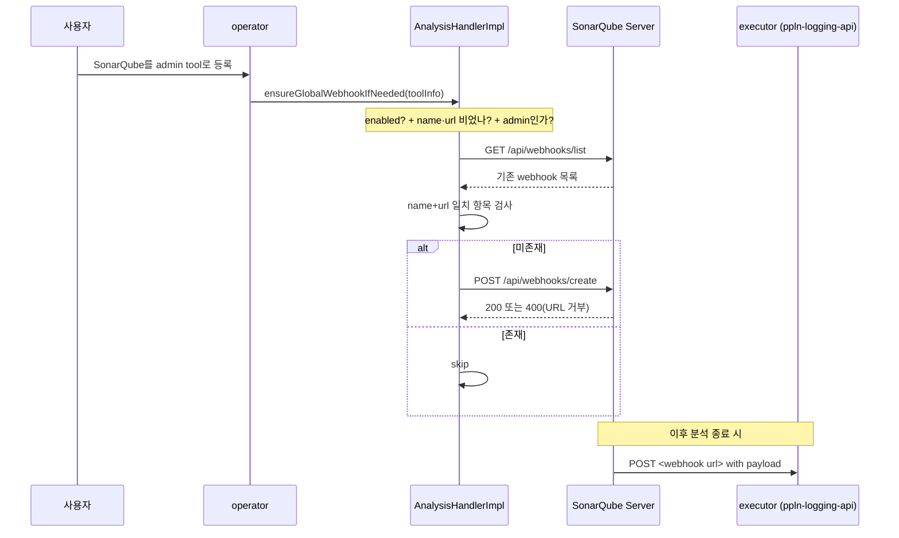

# SonarQube Web API·Webhook 통합

---

> SonarQube를 외부 시스템에서 다루는 가장 풍부한 사례를 본다. TPS `operator/cicd` 모듈의 26개 Java 파일이 어떻게 SonarQube를 컨트롤 플레인으로 통합했는지 추적한다.


## 1. 통합의 책임 분리

> "분석을 실행하는 일"과 "분석 결과를 사용자에게 노출하고 외부 워크플로우와 연결하는 일"은 다른 일이다. operator는 후자만 책임진다.

TPS는 SonarQube와의 관계를 세 모듈로 나눠 설계했다.

| 모듈 | 역할 | SonarQube와의 관계 |
|------|------|-------------------|
| `pipeline-api` | 자체 정적 분석 대상 | Producer — Gradle Scanner |
| `operator/cicd` | 분석 결과 조회·관리·Webhook 등록 | Consumer/Controller — Web API |
| `ppln-logging-api` | 분석 결과 로그 수집·저장 | Logger — Webhook 수신 후 처리 |

본 문서는 가운데 모듈(`operator/cicd`)에 집중한다. operator는 분석을 직접 실행하지 않는다. 사용자가 SonarQube를 admin tool로 등록하면 그 자격 증명으로 SonarQube Web API를 호출해 다음 일을 한다.

- 프로젝트·브랜치 목록을 사용자 인터페이스에 노출
- Quality Gate 결과 조회
- 측정값(Coverage, Maintainability Rating 등) 조회
- 이슈 검색과 코드 스니펫 조회
- 분석 결과 Webhook 자동 등록 — 분석 종료 이벤트가 ppln-logging-api로 전달되도록 사전 설정


## 2. Feign 기반 13개 엔드포인트 래핑

> SonarQube Web API의 여러 엔드포인트를 한 인터페이스로 묶은 Feign 클라이언트가 통합의 1차 진입점이다.

`operator/cicd` 모듈은 SonarQube Web API 호출을 Spring Cloud OpenFeign 인터페이스로 모았다. 진입 파일은 다음과 같다.

```
operator/cicd/src/main/java/org/okestro/tps/operator/cicd/
  environment/infrastructure/external/client/SonarQubeFeignClient.java
```

Feign 인터페이스의 핵심은 호출 베이스 URL을 파라미터로 받는다는 점이다.

```java
// SonarQubeFeignClient.java
@FeignClient(name = "sonarqube-feign", url = "sonarqube-placeholder")
public interface SonarQubeFeignClient {

    @GetMapping("/api/projects/search")
    ResponseEntity<Map<String, Object>> getProject(URI baseUrl,
            @RequestHeader("Authorization") String token,
            @RequestParam("projects") String projects);
    // ... 12개 더
}
```

`@FeignClient`의 `url`은 placeholder만 두고, 실제 호출 시점에 첫 번째 파라미터 `URI baseUrl`을 호출자가 채운다. 이 패턴이 의미 있는 이유는 SonarQube 인스턴스가 사용자별로 다를 수 있기 때문이다. 어느 사용자가 어느 SonarQube 서버를 보는지가 admin tool 등록 정보로 결정되며, 그 정보가 호출 시점에 동적으로 baseUrl로 들어간다.

### 2.1 노출된 엔드포인트 목록

13개 엔드포인트는 SonarQube Web API의 어느 영역을 다루는지에 따라 묶인다.

| 영역 | Feign 메서드 | SonarQube 엔드포인트 |
|------|-------------|---------------------|
| 프로젝트 메타 | `getProject` | `GET /api/projects/search` |
| 프로젝트 메타 | `selectProjectBranchesList` | `GET /api/project_branches/list` |
| 프로젝트 메타 | `selectComponentInfo` | `GET /api/components/show` |
| 프로젝트 생성 | `createProject` | `POST /api/projects/create` |
| Quality Gate | `selectQualitygates` | `GET /api/qualitygates/project_status` |
| 측정값 | `selectMeasuresComponent` | `GET /api/measures/component` |
| 측정값 | `selectMeasuresComponentTree` | `GET /api/measures/component_tree` |
| 이슈 | `selectIssuesSearch` | `GET /api/issues/search` |
| 이슈 코드 | `selectIssueSnippets` | `GET /api/sources/issue_snippets` |
| 이슈 코드 | `selectIssueLines` | `GET /api/sources/lines` |
| 이슈 규칙 | `selectIssueRule` | `GET /api/rules/show` |
| Webhook | `selectWebhooks` | `GET /api/webhooks/list` |
| Webhook | `createWebhook` | `POST /api/webhooks/create` |

13개 중 11개가 GET이라는 점이 흥미롭다. operator는 분석 결과를 만드는 게 아니라 보여주는 도메인이라는 사실이 메서드 분포에 그대로 반영돼 있다.

### 2.2 인증과 호출 — SonarQubeService 래핑

Feign 클라이언트를 그대로 도메인 코드에 노출하지 않고 한 번 더 감싸 도메인 어휘로 바꾼 것이 다음 클래스다.

```
operator/cicd/src/main/java/.../util/sonarqube/service/SonarQubeService.java
```

이 서비스는 SonarQube의 모든 호출을 한 자리에서 관리하며 다음 책임을 진다.

1. 인증 헤더(`Authorization: Bearer ...`) 결합 — `SonarQubeAuthVo`가 baseUrl과 토큰을 묶어 들고 다님
2. 응답 본문 추출 — `ResponseEntity<Map<String, Object>>`에서 body만 꺼내 도메인으로 반환
3. 예외 분류 — `FeignException`을 HTTP 상태 코드별로 도메인 예외(`TpsException`)로 변환

3번이 핵심이다. SonarQube가 4xx로 응답한 이유는 호출자가 알아야 하는 정보다. operator는 다음 매핑을 쓴다.

```java
// SonarQubeService.java
private ErrorCodeCicd resolveErrorCode(FeignException exception) {
    return switch (exception.status()) {
        case 400 -> ErrorCodeCicd.SONARQUBE_BAD_REQUEST;
        case 401 -> ErrorCodeCicd.SONARQUBE_UNAUTHORIZED;
        case 403 -> ErrorCodeCicd.SONARQUBE_FORBIDDEN;
        case 404 -> ErrorCodeCicd.SONARQUBE_NOT_FOUND;
        default -> ErrorCodeCicd.WITH_SONARQUBE_ERROR;
    };
}
```

이 매핑이 있으면 사용자에게 노출되는 에러 메시지가 "401: SonarQube 토큰을 다시 확인하세요"처럼 구체적으로 나갈 수 있다. 모든 SonarQube 실패를 "외부 시스템 오류" 한 가지로 뭉치지 않은 설계다.


## 3. Webhook 자동 등록 메커니즘

> operator의 가장 흥미로운 부분이 여기다. 사용자가 SonarQube를 admin tool로 등록하면 글로벌 Webhook이 자동으로 만들어진다.

Webhook 등록 흐름을 시간 순으로 펼치면 다음과 같다.



핵심 컴포넌트 셋이다.

- **`SonarQubeWebhookProperties`**: `enabled`, `name`, `url` 세 속성을 환경 설정에서 받는다.
- **`AnalysisHandlerImpl`**: 사용자의 admin tool 등록 이벤트를 받아 자동 등록을 수행한다.
- **`AnalysisReaderImpl#existsGlobalWebhook`**: 동일 webhook 중복 생성을 막는다.

### 3.1 ConfigurationProperties로 받는 webhook 설정

설정 클래스는 단순하다.

```java
// SonarQubeWebhookProperties.java
@Getter @Setter
@ConfigurationProperties(prefix = "operator.cicd.sonarqube.webhook")
public class SonarQubeWebhookProperties {

    private boolean enabled = false;
    private String name = "";
    private String url = "";

    public boolean isRunnable() {
        return enabled && StringUtils.hasText(name) && StringUtils.hasText(url);
    }
}
```

세 환경별로 채워지는 값은 다음과 같다.

```yaml
# operator/app/src/main/resources/application-local-ld.yml
operator:
  cicd:
    sonarqube:
      webhook:
        enabled: ${OPERATOR_CICD_SONARQUBE_WEBHOOK_ENABLED:true}
        name: ${OPERATOR_CICD_SONARQUBE_WEBHOOK_NAME:trb-executor-webhook}
        url: ${OPERATOR_CICD_SONARQUBE_WEBHOOK_URL:http://dev.trombone-v2.okestro.cloud/executor/api/sonarqube-webhook}
```

기본 webhook URL이 `executor` 서비스의 `/api/sonarqube-webhook` 엔드포인트로 잡혀 있다. 즉 SonarQube의 분석 종료 이벤트가 executor를 거쳐 후속 처리(분석 결과 로그 적재 등)로 흐른다.

### 3.2 admin tool 단일 진입의 이유

Webhook 자동 등록은 같은 SonarQube 서버에 여러 사용자가 접근해도 한 번만 일어나야 한다. operator는 이 제약을 다음과 같이 표현한다.

```java
// AnalysisHandlerImpl.java
private boolean isSonarQubeAdminTool(ToolInfo toolInfo) {
    return toolInfo != null
            && ToolCategory.SONARQUBE == toolInfo.getToolCategory()
            && "admin".equals(toolInfo.getToolCntnId());
    // 중복 webhook 생성 방지를 위해 admin인 경우에만 생성할 수 있도록 검증
}
```

`toolCntnId == "admin"`이라는 제약이 게이트키퍼다. SonarQube에서 글로벌 webhook을 만들 권한은 관리자 토큰만 가지므로, 일반 사용자 토큰으로 등록된 도구에서는 어차피 401이 떨어진다. 시스템 차원에서 관리자 등록 한 번에만 webhook 생성을 시도하도록 좁힌 설계다.

### 3.3 동일 webhook 중복 생성 방지

`AnalysisHandlerImpl`이 자동 등록을 호출하기 전에 reader가 기존 webhook 목록을 보고 같은 name·url 조합이 있는지 본다.

```java
// AnalysisReaderImpl.java
@Override
public boolean existsGlobalWebhook(String toolId) {
    String webhookName = trimToNull(webhookProperties.getName());
    String webhookUrl = trimToNull(webhookProperties.getUrl());
    if(webhookName == null || webhookUrl == null) {
        return false;
    }

    Map<String, Object> response = sonarQubeUseCase.getWebhookList(getAuthInfo(toolId));
    for(Map<String, Object> webhook : mapList(response == null ? null : response.get("webhooks"))) {
        if(isConfiguredGlobalWebhook(webhook, webhookName, webhookUrl)) {
            return true;
        }
    }
    return false;
}
```

이 검사가 빠지면 admin tool 재등록 시마다 같은 webhook이 새로 추가돼 SonarQube가 분석 종료 이벤트를 N개로 발사하는 사고가 난다. 멱등성 방어로 운영 사고를 막는 표준 패턴이다.


## 4. URL 거부 분류 — SonarQube의 보안 응답 해석

> SonarQube는 보안상 임의의 URL을 webhook으로 받지 않는다. 거부 응답을 읽어서 도메인 예외로 분류하는 것이 외부 시스템 통합의 잔기술이다.

SonarQube는 webhook URL이 다음 중 하나에 해당하면 400 Bad Request로 거부한다.

- 루프백 주소(`localhost`, `127.0.0.1`, `::1`)
- 와일드카드 주소(`0.0.0.0` 등)
- 유효하지 않은 URL 형식

operator는 이 거부를 일반적인 400과 분리해 다른 에러 코드로 노출한다.

```java
// SonarQubeService.java
} catch (FeignException e) {
    if (isInvalidWebhookUrl(e)) {
        log.error("SonarQube webhook URL 거부. status=[{}], msg=[{}]", e.status(), e.getMessage());
        throw new TpsException(ErrorCodeCicd.SONARQUBE_WEBHOOK_URL_NOT_ALLOWED);
    }
    throw e;
}

private boolean isInvalidWebhookUrl(FeignException e) {
    if (e.status() != 400) { return false; }
    String body = e.contentUTF8();
    if (body == null || body.isBlank()) { return false; }
    String lower = body.toLowerCase(java.util.Locale.ROOT);
    return lower.contains("loopback") || lower.contains("wildcard");
}
```

응답 본문에 `loopback` 또는 `wildcard` 단어가 있으면 URL 거부로 판단한다는 휴리스틱이다. SonarQube가 정확한 에러 코드를 주지 않으므로 본문 키워드에 의존할 수밖에 없다. 이런 코드는 SonarQube 버전 업그레이드 시 메시지 문구가 바뀌면 깨지는 위험을 가진다. 통합 테스트가 회귀를 잡아야 하는 영역이다.


## 5. 분석 결과의 도메인 모델화

> SonarQube의 응답을 그대로 노출하지 않고 도메인 어휘로 다시 짠다. 그것이 통합 코드가 단순한 프록시를 넘어서는 지점이다.

operator는 SonarQube에서 받은 데이터를 다음 도메인 객체로 재구성한다(파일 경로는 모두 `operator/cicd/src/main/java/.../environment/domain/sonarqube/dto/` 아래).

- `SonarQubeIssueRule` — 한 Rule의 메타와 설명
- `SonarQubeIssueList` — 페이지된 Issue 목록
- `SonarQubeIssueProjectBranchList` — 프로젝트의 브랜치별 Issue 분포
- `SonarQubeIssueSnippets` — Issue가 위치한 코드 스니펫
- `SonarQubeMeasuresResult` — 측정값(Coverage, Rating 등) 결과
- `SonarQubeSideFilterState` — UI 사이드바 필터 상태(severity, type, resolved 등)
- `SonarQubeAnalysisResultQuery` — 분석 결과 조회 입력

이런 도메인 객체가 있으면 다음 두 가지가 가능해진다.

1. **상위 레이어가 SonarQube에 종속되지 않는다** — 컨트롤러나 Application Service는 `SonarQubeIssueList`만 안다. SonarQube가 응답 형식을 바꿔도 Feign 클라이언트와 매퍼만 손대면 된다.
2. **다른 분석 도구로 교체 가능성이 열린다** — TPS의 `Test Job` 도메인은 `SonarQubeTestJobEntity`와 `SonarQubeExecutionResultEntity`로 SonarQube 실행을 다른 종류의 테스트(JUnit 등)와 같은 자리에 둔다. 향후 다른 정적 분석 도구를 추가해도 같은 추상이 작동한다.


## 6. 페이지네이션과 SonarQube의 한계

> SonarQube Web API는 페이지네이션이 강제다. operator의 페이지 사이즈 결정은 운영 시 한 번 부딪히는 함정에 대한 답이다.

`AnalysisReaderImpl`은 다음 두 상수를 쓴다.

```java
// AnalysisReaderImpl.java
private static final int ISSUE_PAGE_SIZE = 500;
private static final String COMPONENT_TREE_PAGE_SIZE = "500";
```

500이 등장하는 이유는 SonarQube Web API의 페이지 사이즈 상한이 500이기 때문이다. 한 호출에 더 많은 결과를 받을 수 없다. 큰 프로젝트에서 이슈가 5000개라면 10번 호출이 필요하다.

또 다른 함정이 `/api/issues/search`의 `Total of issues` 제한이다. SonarQube는 한 검색 결과의 최대 노출을 10000개로 제한한다. 이 한계를 넘어가는 프로젝트는 검색 조건(severity, type, file path 등)을 좁혀 다중 호출로 나눠야 한다. operator는 사이드 필터(`SonarQubeSideFilterStateVo`)로 이 분할을 지원한다.


## 7. 분석 시각의 직렬화 약속

> operator가 SonarQube에서 받은 분석 일자를 어떻게 다루는지에 작은 함정이 있다.

분석 일자 파싱은 다음 포맷터를 쓴다.

```java
// AnalysisReaderImpl.java
private static final DateTimeFormatter ANALYSIS_DATE_FORMATTER = DateTimeFormatter
        .ofPattern("yyyy-MM-dd'T'HH:mm:ssZ");
```

SonarQube가 반환하는 분석 일자는 `2025-12-31T15:30:45+0900` 형태이며 ISO-8601의 변형이다. 표준 `DateTimeFormatter.ISO_OFFSET_DATE_TIME`은 콜론이 들어간 오프셋(`+09:00`)을 기대하므로 SonarQube의 콜론 없는 오프셋을 직접 받지 못한다. operator는 이를 위해 명시적 패턴을 둔다.

이런 사소한 결정이 외부 시스템 통합의 일상이다. 도구의 시각 직렬화 규칙을 한 번 잘못 잡으면 시간대가 어긋난 분석 이력이 DB에 쌓인다.


## 8. 정리 — 통합 설계의 교훈

> operator가 SonarQube를 통합한 방식에서 일반화 가능한 패턴을 추출한다.

이 사례에서 다른 외부 도구 통합에도 가져갈 수 있는 결정 셋이다.

1. **호출 인터페이스 한 자리에 모은다** — Feign 인터페이스 한 개가 13개 엔드포인트의 진입을 책임진다. 매퍼와 도메인 객체는 그 인터페이스 위에서 작동하므로 외부 시스템의 변경이 한 자리에 집중된다.
2. **인증 정보를 동적 baseUrl로 다룬다** — `@FeignClient(url = "placeholder")` + 호출 시 `URI baseUrl` 주입 패턴은 멀티 인스턴스 통합에 자연스러운 선택이다.
3. **에러를 도메인 어휘로 분류한다** — HTTP 4xx를 `SONARQUBE_BAD_REQUEST/UNAUTHORIZED/...`로 매핑하면 사용자에게 의미 있는 메시지를 줄 수 있다.
4. **자동 등록은 멱등으로 짠다** — Webhook 등록 전 존재 검사가 있어야 재등록 시 중복 사고가 안 난다.
5. **상한이 있는 외부 API는 페이지네이션으로 감싼다** — SonarQube의 500 페이지·10000 결과 한계는 도메인이 페이지 분할 책임을 지면 사라진다.

다음 문서에서는 이 통합으로 발사된 Webhook을 받는 쪽([04-03.분석 실행 로그 수집](04-03.분석 실행 로그 수집.md))을 본다.
