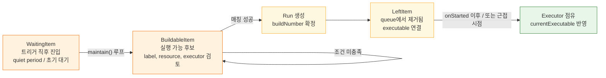
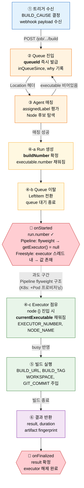

# 실행 모델과 빌드 라이프사이클

---

> 빌드 요청이 들어오면 Jenkins 내부에서 무슨 일이 일어나는가를 추적한다.

## 1. Freestyle vs Pipeline

>  Jenkins에는 두 가지 잡 유형이 있다. Freestyle Job은 UI 클릭으로 설정하고, Pipeline은 Jenkinsfile이라는 코드로 정의한다. 
>
> - 이 차이가 단순한 사용성 문제가 아니라 재현성과 유지보수성의 근본적인 차이를 만든다.

| 항목 | Freestyle Job | Pipeline |
|------|--------------|---------|
| 정의 방식 | UI 클릭 | Jenkinsfile (코드) |
| 버전 관리 | 불가 | Git 커밋 |
| 복잡한 흐름 | 플러그인 조합 | stage/step 코드 |
| 재현성 | 낮음 | 높음 |
| 병렬 실행 | 제한적 | `parallel {}` |

- reestyle Job은 간단한 빌드에는 충분하지만, "이 잡이 왜 이렇게 설정되어 있는가?"를 추적할 방법이 없다. 누군가 UI에서 체크박스를 바꿔도 기록이 남지 않는다. 
- Pipeline은 Jenkinsfile을 소스코드와 같은 Git 저장소에 두므로, 파이프라인 변경도 코드 리뷰와 커밋 히스토리로 추적된다. 새 프로젝트라면 처음부터 Pipeline으로 시작하는 것이 옳다.


## 2. Queue에서 Executor까지

>  빌드 요청이 들어오면 Jenkins 내부에서 여러 단계를 거친다. 이 흐름을 모르면 "왜 빌드가 바로 시작 안 되지?"라는 상황에서 원인을 찾기 어렵다.

빌드의 전체 라이프사이클은 다음 순서로 진행된다:

```mermaid
flowchart LR
    subgraph Controller
        T["① 트리거 수신<br/>webhook / cron / 수동"]
        Q["② Queue 진입<br/>queueId 발급 · 대기"]
        M["③ Agent 매칭<br/>Label 조건 탐색"]
        RC["④ Run 생성<br/>buildNumber 확정"]
        LQ["④-a Queue 이탈<br/>LeftItem 전환<br/>executable 연결"]
    end

    H1{{"🔔 onStarted<br/>(Pipeline: flyweight 실행)"}}

    subgraph Agent
        EA["⑤ Executor 점유<br/>node {} 진입 시<br/>currentExecutable 채워짐"]
        B["⑥ 빌드 실행<br/>checkout → steps"]
    end

    R["⑦ 결과 반환<br/>로그 · 아티팩트<br/>→ Controller 저장"]
    H2{{"🔔 onFinalized"}}

    T --> Q --> M --> RC --> LQ --> H1 --> EA --> B --> R --> H2
    M -->|"매칭 실패"| Q

    style T fill:#e3f2fd,stroke:#1565c0,color:#333
    style Q fill:#fff3e0,stroke:#ef6c00,color:#333
    style M fill:#fff3e0,stroke:#ef6c00,color:#333
    style RC fill:#fff8e1,stroke:#f9a825,color:#333
    style LQ fill:#fff8e1,stroke:#f9a825,color:#333
    style H1 fill:#ffcdd2,stroke:#c62828,color:#333
    style EA fill:#e8f5e9,stroke:#2e7d32,color:#333
    style B fill:#e8f5e9,stroke:#2e7d32,color:#333
    style R fill:#f3e5f5,stroke:#7b1fa2,color:#333
    style H2 fill:#ffcdd2,stroke:#c62828,color:#333
```



1. **트리거 수신**: webhook, cron, 수동 실행 중 하나로 빌드 요청이 발생하면 Controller가 수신한다.
2. **Queue 진입**: Controller는 요청을 즉시 실행하지 않고 빌드 큐에 넣는다. `queueId`가 발급되며 대기 상태가 시작된다.
3. **Agent 매칭**: Controller가 주기적으로 큐를 스캔하여 Label 조건에 맞는 Agent를 탐색한다. 매칭 실패 시 큐로 되돌아간다.
4. **Run 생성**: 매칭이 성공하면 Controller 측에서 Run 객체가 생성되고 `buildNumber`가 확정된다. Queue item의 `executable.number`가 이 시점에 채워진다.
5. **🔔 onStarted Hook**: Run 생성 직후 `RunListener.onStarted`가 발동된다. Pipeline 잡은 이 시점에서 Controller 위의 flyweight task로 시작되어 아직 어떤 Agent의 executor 슬롯도 점유하지 않으므로 `run.getExecutor()`가 null이다. Freestyle 잡은 executor 스레드 내에서 호출되므로 null이 아니다.
6. **Executor 점유**: Pipeline의 `node {}` 블록 진입 시 Agent 측 Executor 슬롯이 실제로 해당 Run을 받아 `currentExecutable`이 채워진다. 이 과도 구간은 Pipeline 잡의 구조적 특성이며, K8s 동적 에이전트 환경에서는 Pod 프로비저닝으로 인해 더 길어진다.
7. **빌드 실행**: Executor가 workspace에서 소스코드를 체크아웃하고 Jenkinsfile의 단계를 실행한다.
8. **결과 반환**: 빌드가 완료되면 로그, 아티팩트, 테스트 리포트를 Controller로 전송하여 영구 저장한다.
9. **🔔 onFinalized Hook**: 결과 반환 후 `RunListener.onFinalized`가 발동된다. `result`가 확정되고 executor 슬롯은 이미 해제된 상태다.

여기서 한 가지 짚어둘 점은 Jenkins UI에서 "실행 중"으로 표시되어도 실제로는 아직 Queue 대기 상태일 수 있다는 것이다. 정확한 상태는 `/queue/api/json`으로 확인해야 한다(→ 5절 스크립트 참조). 트리거 직후 어떤 값이 언제 생기는지는 다음 절에서 단계별로 정리한다.

### 2-1. Queue 내부 상태 전이

앞의 요약 다이어그램에서는 `Queue 진입`을 한 칸으로 압축했지만, Jenkins 내부에서는 보통 다음 세 상태를 거친다.



- `WaitingItem`은 트리거 직후 큐에 들어온 직후 상태다. `quiet period`가 있거나 아직 즉시 스케줄링 판단을 하지 않는 구간이 여기에 해당한다.
- `BuildableItem`은 실행 후보로 올라온 상태다. Label, 리소스 제약, 사용 가능한 executor 유무를 계속 확인한다.
- `LeftItem`은 queue 자료구조에서는 빠져나왔다는 뜻이지, 곧바로 agent executor가 busy가 되었다는 뜻은 아니다.
- 따라서 실무에서는 `Queue에서 빠짐`과 `Executor 점유`를 같은 순간으로 취급하면 추적 로직이 흔들린다.

## 3. 단계별로 어떤 값이 생기는가

> 빌드 요청이 들어온 뒤 각 단계에서 새 값이 만들어지고 다음 단계로 전달된다. 이 매핑을 모르면 "트리거 직후 build number를 받았다고 착각"하거나, "Executor가 잡히기 전에 환경 변수를 참조"하는 실수가 생긴다.

전체 값 흐름은 다음과 같다. `queueId`는 트리거 직후 즉시 생기고, `buildNumber`는 Run 생성 시점에 확정되며, `currentExecutable`과 환경 변수는 Executor 슬롯이 실제로 점유된 뒤에야 채워진다.



이 다이어그램에서 네 가지를 읽어야 한다.

1. ③ Agent 매칭이 실패하면 큐로 되돌아가 대기를 유지한다.
2. ④-a Run 생성과 ④-b Queue 이탈 직후 **`onStarted` Hook이 발동**된다. Pipeline 잡은 이 시점에서 Controller 위의 flyweight task로 시작되어 `run.getExecutor()`가 null이다. 이는 VM/K8s 에이전트 유형과 무관하게 **Pipeline의 2단계 실행 구조** 때문이다. Freestyle 잡은 executor 스레드 내에서 `onStarted`가 호출되므로 null이 아니다.
3. `onStarted` → ④-c 사이의 점선 구간이 "Run은 존재하지만 queue에서는 이미 빠졌지만, executor 슬롯은 아직 미확정"인 과도 상태다. Pipeline 잡에서는 `node {}` 블록 진입 시 비로소 executor가 할당된다. K8s 동적 에이전트 환경에서는 Pod 프로비저닝이 추가되어 이 구간이 더 길어진다.
4. ⑥ 결과 반환 이후 **`onFinalized` Hook이 발동**되며, 이 시점에서 `result`가 확정되고 executor 슬롯은 이미 해제된 상태다.

### 3-1. 단계별 값 타임라인

각 단계에서 새로 생기는 식별자와 그 값을 어디서 확인할 수 있는지 정리하면 다음과 같다:

| 단계 | 새로 생기는 값 | 어디서 확인 |
|------|--------------|-----------|
| ① 트리거 수신 | `BUILD_CAUSE` (UserCause / SCMTriggerCause / TimerTriggerCause), webhook payload | Queue 항목의 `actions[].causes[]` |
| ② Queue 진입 | **`queueId`** (전역 단일 증가), `inQueueSince`, `why` | HTTP 응답 `Location: /queue/item/{queueId}/`, `/queue/api/json` |
| ③ Agent 매칭 | `assignedLabel`, 매칭된 Node 후보 | `/queue/item/{queueId}/api/json`의 `why` 사유 |
| ④-a Run 생성 | **`buildNumber`** (Job 내부 순차), `executable.url`, `executable.number` | `/queue/item/{queueId}/api/json`의 `executable.number` |
| ④-b Queue 이탈 | `LeftItem` 전환, queue 대기 종료 | Queue 내부 상태 전이, `/queue/item/{queueId}/api/json`에서 executable 연결 이후 |
| 🔔 **onStarted** | Hook 발동 — `run.number` ✓. **Pipeline**: flyweight task이므로 `run.getExecutor()` = null (VM/K8s 무관). **Freestyle**: executor 스레드 내 호출이므로 값 존재 | `RunListener.onStarted(Run, TaskListener)` |
| ④-c Executor 점유 | **`currentExecutable`**, `EXECUTOR_NUMBER`, `NODE_NAME`, `busyExecutors` 증가 | `/computer/api/json?tree=computer[executors[currentExecutable[url]]]` |
| ⑤ 빌드 실행 | `BUILD_URL`, `BUILD_TAG`, `WORKSPACE`, `JOB_NAME`, `GIT_COMMIT`, `GIT_BRANCH` | 빌드 환경 변수, `/job/.../{buildNumber}/api/json` |
| ⑥ 결과 반환 | `result` (SUCCESS / FAILURE / UNSTABLE / ABORTED), `duration`, `timestamp`, 아티팩트 fingerprint | `/job/.../{buildNumber}/api/json`의 `result` |
| 🔔 **onFinalized** | Hook 발동 — `result` 확정, executor 해제 완료, 로그 flush 완료 | `RunListener.onFinalized(Run)` |

### 3-2. 핵심 식별자 — `queueId`와 `buildNumber`

두 식별자를 혼동하는 것이 가장 흔한 실수이므로 별도로 분리해서 본다.

- `queueId`는 Jenkins controller 전역에서 단일 증가하는 큐 항목 ID다. `POST /job/.../build` 응답의 `Location` 헤더에 즉시 담겨 오므로, 트리거 직후 받을 수 있는 유일한 식별자다.
- `buildNumber`는 각 Job 내부에서만 1부터 증가하는 빌드 번호다. Executor가 배정되어 빌드 객체가 생성되는 시점에야 확정되며, 그 전까지 `executable` 필드는 `null`이다.

값의 흐름은 다음 한 줄로 요약된다:

```text
Location 헤더 → queueId → /queue/item/{queueId}/api/json → executable.number → buildNumber
```

### 3-3. 빌드 실행 시점에 주입되는 환경 변수

Executor가 배정되면 Jenkins는 다음 환경 변수를 빌드 프로세스에 주입한다. 셸 스텝(`sh`, `bat`)이나 Pipeline 변수(`env.BUILD_NUMBER`)에서 그대로 참조할 수 있다.

| 변수 | 값 예시 | 생성 시점 |
|------|--------|---------|
| `BUILD_NUMBER` | `42` | Executor 배정 후 |
| `BUILD_ID` | `42` (LTS 1.597 이후 동일) | Executor 배정 후 |
| `BUILD_URL` | `${JENKINS_URL}/job/myapp/42/` | Executor 배정 후 |
| `BUILD_TAG` | `jenkins-myapp-42` | Executor 배정 후 |
| `EXECUTOR_NUMBER` | `0`, `1`, `2` | Executor 슬롯 결정 시 |
| `NODE_NAME` | `built-in`, `agent-linux-1` | Agent 매칭 후 |
| `NODE_LABELS` | `linux java17 docker` | Agent 매칭 후 |
| `WORKSPACE` | `/var/jenkins_home/workspace/myapp` | 빌드 실행 직전 |
| `JOB_NAME` | `myapp` 또는 `team/myapp` | 트리거 시점(정적) |
| `GIT_COMMIT` / `GIT_BRANCH` | SHA 값, `refs/heads/main` | SCM 체크아웃 후 |

### 3-4. 자동화 스크립트가 빠지는 함정

빌드를 트리거한 직후 API로 받는 값은 build number가 아니라 queue item ID다. 이 차이를 놓치고 트리거 직후 곧바로 `/job/.../lastBuild/api/json`을 폴링하면, 이전 빌드 결과를 잘못 읽거나 해당 빌드가 아직 없어 `null`을 참조하게 된다. 올바른 흐름은 응답 `Location`에서 `queueId`를 추출해 `/queue/item/{queueId}/api/json`을 폴링하다가, `executable.number`가 채워지면 그때부터 `buildNumber` 기반 API로 넘어가는 것이다.

### 3-5. `run.getExecutor()`가 null인 이유

위 타임라인에서 ④-a(Run 생성) ~ ④-c(Executor 점유) 사이의 과도 구간 동안에는 `buildNumber`는 존재하는데 `run.getExecutor()`는 null인 상태가 된다. 근본 원인은 Pipeline의 2단계 실행 구조다 — `onStarted` 시점에 Controller 위 flyweight task로 시작될 뿐 아직 어떤 Agent의 executor 슬롯도 점유하지 않기 때문이다. Freestyle 잡은 executor 스레드 내에서 `onStarted`가 호출되므로 이 문제가 없다. K8s 동적 에이전트는 Pod 프로비저닝이 더해져 구간이 길어진다.

Jenkins 코어의 [`Executables.getExecutor()`](https://github.com/jenkinsci/jenkins/blob/master/core/src/main/java/hudson/model/queue/Executables.java)가 모든 Computer의 executor를 돌며 `currentExecutable == this`를 찾는데, flyweight 시점에는 어떤 executor도 이 Run을 들고 있지 않아 null이 반환된다.

```java
// hudson.model.queue.Executables (Jenkins 코어)
// https://github.com/jenkinsci/jenkins/blob/master/core/src/main/java/hudson/model/queue/Executables.java
public static @CheckForNull Executor getExecutor(Executable e) {
    for (Computer c : Jenkins.get().getComputers()) {
        for (Executor ex : c.getExecutors()) {
            if (ex.getCurrentExecutable() == e) return ex;
        }
        for (Executor ex : c.getOneOffExecutors()) {
            if (ex.getCurrentExecutable() == e) return ex;
        }
    }
    return null;
}
```

> **관련 Jenkins 소스코드:**
> - [`Run.java`](https://github.com/jenkinsci/jenkins/blob/master/core/src/main/java/hudson/model/Run.java) — Run 객체 및 `getExecutor()` 위임
> - [`Executables.java`](https://github.com/jenkinsci/jenkins/blob/master/core/src/main/java/hudson/model/queue/Executables.java) — 실제 executor 탐색 로직
> - [`RunListener.java`](https://github.com/jenkinsci/jenkins/blob/master/core/src/main/java/hudson/model/listeners/RunListener.java) — `onStarted`, `onFinalized` Hook 정의
> - [RunListener Javadoc](https://javadoc.jenkins.io/hudson/model/listeners/RunListener.html) — 공식 API 문서

**Executor가 실제로 busy인지 확인하는 방법:**

`currentExecutable`이 채워졌는지를 보는 것이 가장 직접적인 신호다:

```bash
curl -sS -u "${JENKINS_USER}:${JENKINS_PASS}" \
  "${JENKINS_URL}/computer/api/json?tree=computer[displayName,executors[currentExecutable[url]]]" \
  | jq '.computer[].executors[]? | select(.currentExecutable != null) | .currentExecutable.url'
```

`currentExecutable.url`이 해당 빌드의 URL을 가리키면 그 순간부터 "executor 슬롯을 점유한 상태"로 볼 수 있다.

### 3-6. 두 개의 추적 축

빌드 상태를 추적할 때 흔히 하나의 축으로 뭉개는 실수가 생긴다. 실제로는 두 개의 독립적인 축으로 나눠서 봐야 한다.

| 추적 축 | 식별자 | 주요 API |
|--------|--------|---------|
| **빌드 라이프사이클** | `queueId`, `buildNumber` | `/queue/item/{id}/api/json`, `/job/.../{buildNumber}/api/json` |
| **실행 슬롯 점유** | `currentExecutable`, `busyExecutors` | `/computer/api/json?tree=computer[executors[currentExecutable[*]]]` |

이 두 축은 **시작 시점이 다르고, 끝나는 시점도 다를 수 있다.** 예를 들어 빌드가 종료되면 `buildNumber` 기준 추적은 `result`로 마무리되지만, executor 슬롯은 그보다 먼저 해제될 수도 있다.

상태 모델을 설계할 때 `STARTED`와 `FINALIZED` 두 가지만으로 나누면 이 간극을 표현하지 못한다. 더 정밀하게 추적하려면 다음처럼 분리하는 것이 낫다:

| 상태 | 전제 조건 |
|------|----------|
| `QUEUED` | `queueId` 존재, `executable` null |
| `RUN_CREATED` | `buildNumber` 존재, `currentExecutable` 미확인 |
| `AGENT_ASSIGNED` | `currentExecutable` 확인됨 |
| `FINALIZED` | `result` 확정 |

`STARTED == busy`로 바로 매핑하면 "시작했는데 왜 nodeName이 없지?"류의 혼란이 생긴다. `AGENT_ASSIGNED`를 별도 상태로 두면 이 구간의 모호함이 사라진다.

### 3-7. 더 깊은 추적이 필요하면

이 문서는 입문자 관점의 lifecycle과 값 흐름을 다룬다. 더 깊은 영역은 다음 문서로 분리돼 있다.

- `05-04c.md` — `WaitingItem → BuildableItem → BlockedItem → LeftItem` 상태 전이, `maintain()` 루프, `createExecutable()`과 `nextBuildNumber` 확정 시점, Quiet Period가 작동하는 이유, `cancelItem` 흐름. Jenkins 소스 코드 수준의 큐 메커니즘.
- `05-04b.md` — VM 정적 vs K8s 동적 에이전트의 executor 해석 차이, `KubernetesComputer` 식별, TPS가 저장해야 하는 최소 데이터.
- `05-04a.md` — TPS 운영 패턴(Pre-trigger Guard, `nextBuildNumber` 트릭, Queue 운영 판단, dedupe).

## 4. Label 기반 라우팅

> `agent` 지시문은 빌드가 어디에서 실행될지를 결정한다. 잘못된 Agent에서 빌드가 실행되면 필요한 도구가 없어 실패하거나, 보안 경계를 넘어 민감한 환경에 접근할 수 있기 때문에 라우팅 설정은 신중하게 해야 한다.

| 지시문 | 의미 | 사용 시나리오 |
|--------|------|--------------|
| `agent any` | 사용 가능한 아무 Agent에서 실행 | 환경 무관한 간단한 빌드 |
| `agent { label 'docker' }` | 해당 라벨을 가진 Agent에서만 실행 | 특정 도구/환경이 필요한 빌드 |
| `agent none` | Pipeline 수준에서 Agent를 지정하지 않음 | 각 stage마다 다른 Agent 사용 시 |
| `agent { docker { image 'node:18' } }` | Docker 컨테이너 안에서 실행 | 빌드 환경 격리가 필요할 때 |
| `agent { kubernetes { ... } }` | K8s Pod으로 임시 Agent 생성 | K8s 환경에서 동적 프로비저닝 |

Label은 Boolean 표현식으로 조합할 수 있다. `java17 && linux`는 java17 라벨과 linux 라벨을 모두 가진 Agent에서만 실행하고, `java17 || java21`은 둘 중 하나를 가진 Agent에서 실행한다. Label 조건이 맞는 Agent가 없으면 빌드는 Queue에서 무기한 대기하므로, Agent 라벨 관리를 체계적으로 해야 한다.

`agent { label }` 패턴의 사용 예시다:

```groovy
pipeline {
    agent { label 'java17 && linux' }
    stages {
        stage('Build') {
            steps {
                sh './gradlew build'
            }
        }
        stage('Docker') {
            agent { label 'docker' }
            steps {
                sh 'docker build -t myapp .'
            }
        }
    }
}
```

`agent none`을 Pipeline 수준에 선언하면 각 stage에서 개별적으로 Agent를 지정할 수 있다. Build stage는 java17 Agent에서, Docker stage는 docker Agent에서 실행되도록 분리하는 패턴이다.


## 5. Flyweight vs Heavyweight 실행

> Jenkins Pipeline의 실행에는 두 가지 레벨이 공존한다. 이 구분을 모르면 "Controller Executor를 0으로 설정했는데 왜 Pipeline이 시작되는가?"라는 현상을 설명할 수 없다.

**Flyweight 실행**은 Pipeline 자체의 흐름 제어 코드가 Controller에서 실행되는 것이다. 

- Pipeline은 CPS(Continuation-Passing Style)로 컴파일되어 Controller JVM에서 실행된다. 
- stage 정의, when 조건 평가, parallel 블록 분기 같은 파이프라인 구조적 요소가 여기 해당한다. 
- 이것은 매우 가볍고(Flyweight), Controller Executor 슬롯을 소비하지 않는다.

**Heavyweight 실행**은 `sh`, `bat`, `git checkout`처럼 실제 작업을 수행하는 step이 Agent의 Executor에서 실행되는 것이다. 

- 이 단계가 되어야 비로소 Agent의 Executor 슬롯이 소비된다. Controller Executor를 0으로 설정해도 Pipeline이 시작되는 이유가 바로 이것이다. 
- Pipeline의 구조적 실행(Flyweight)은 Controller에서 일어나고, 실제 무거운 작업(Heavyweight)만 Agent로 넘어가기 때문이다.

다음 예시에서 어떤 코드가 어디에서 실행되는지를 주석으로 표기했다:

```groovy
pipeline {
    agent none                          // ← Flyweight: Controller에서 파이프라인 구조 해석
    stages {
        stage('Decide') {
            when { branch 'main' }      // ← Flyweight: Controller에서 조건 평가
            agent { label 'linux' }
            steps {
                sh 'make build'         // ← Heavyweight: Agent Executor에서 실행
                sh 'make test'          // ← Heavyweight: Agent Executor에서 실행
            }
        }
        stage('Deploy') {
            input message: '배포?'      // ← Flyweight: Controller에서 승인 대기
            agent { label 'deploy' }
            steps {
                sh './deploy.sh'        // ← Heavyweight: Agent Executor에서 실행
            }
        }
    }
}
```

| 실행 위치 | 해당 코드 | Executor 소비 |
|----------|----------|-------------|
| Controller (Flyweight) | `pipeline {}`, `stage()`, `when {}`, `input`, `parallel`, 변수 할당 | 소비 안 함 |
| Agent (Heavyweight) | `sh`, `bat`, `git checkout`, `docker.build`, `writeFile` | Executor 1개 점유 |

- 이 구분이 중요한 실용적 이유가 있다. Flyweight 코드가 너무 많으면 Controller 메모리를 잡아먹는다. 
- 예를 들어 `for` 루프로 100번 반복하는 Pipeline 코드는 Controller에서 모두 처리된다. 복잡한 로직은 `sh` step 안에서 셸 스크립트로 처리하는 것이 Controller 부하를 줄이는 방법이다.

### 실습: Queue와 Executor 상태 확인

Jenkins REST API로 Queue와 Executor 상태를 직접 확인하는 스크립트다. 빌드가 예상보다 늦게 시작될 때 원인을 파악하는 데 유용하다.

> 실습 환경 설정은 `05-00. 젠킨스 API 실습 환경 설정` 참조

Queue 대기 목록 확인 — 어떤 빌드가 왜 대기 중인지 확인한다:

```bash
curl -sSf -u "${JENKINS_USER}:${JENKINS_PASS}" \
  "${JENKINS_URL}/queue/api/json?tree=items[id,task[name],why]"
```

`why` 필드가 대기 이유를 설명한다. "Waiting for next available executor"는 Executor가 부족한 것이고, "Waiting for the agent to be online"은 해당 Label의 Agent가 오프라인 상태임을 뜻한다.

Executor 상태 확인 — 각 Agent에서 무엇이 실행 중인지 확인한다:

```bash
curl -sSf -u "${JENKINS_USER}:${JENKINS_PASS}" \
  "${JENKINS_URL}/computer/api/json?tree=computer[displayName,executors[currentExecutable[url]],numExecutors]"
```

`currentExecutable`이 `null`이면 해당 Executor는 유휴 상태고, URL이 있으면 실행 중인 빌드의 경로를 가리킨다. `numExecutors`가 0이면 해당 Agent(또는 Controller)에서 빌드가 실행되지 않도록 설정된 것이다.


## 이 단계에서 스스로 던질 질문

Jenkins를 단순히 사용하는 것과 구조를 이해하고 사용하는 것은 다르다. 다음 질문에 답할 수 있다면 이 단계를 마친 것이다:

- 내가 호출하는 Jenkins API는 **어떤 리소스 레벨**인가? Jenkins API는 경로에 따라 바라보는 대상이 다르다:
  - `/api/json` — Controller 전체 (잡 목록, 시스템 상태)
  - `/job/.../api/json` — Job 정의 (설정, 최근 빌드 번호)
  - `/job/.../42/api/json` — 특정 Build (결과, 로그, 아티팩트)
  - `/queue/api/json` — Queue (아직 실행 전인 대기 항목)
- 내가 보는 "실행 중" 상태는 실제 Agent 실행인가, 아직 Queue 대기 상태인가?
- 배포 실패의 원인은 Pipeline 로직 실패인가, Agent 환경 실패인가?

### 공식 문서 참조

이 단계에서 읽어볼 Jenkins 공식 문서는 다음과 같다:

- [Jenkins Handbook](https://www.jenkins.io/doc/book/) — 전체 문서 지도를 제공한다.
- [Using Jenkins](https://www.jenkins.io/doc/book/using/) — Jenkins 사용법의 진입점이다.
- [Managing Nodes](https://www.jenkins.io/doc/book/managing/nodes/) — Agent가 정적 또는 동적으로 할당될 수 있다고 설명한다.
