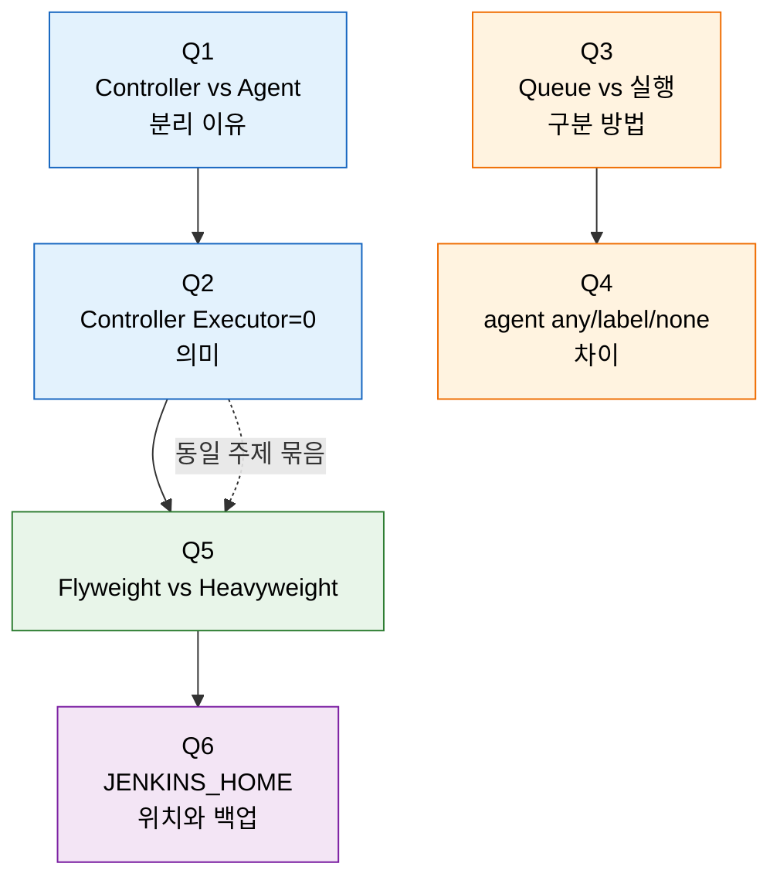
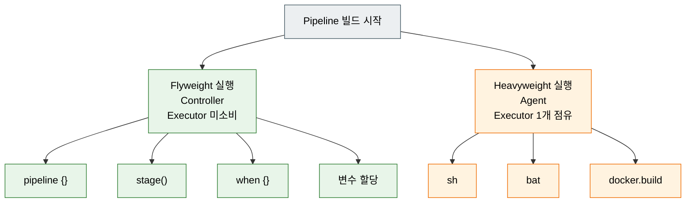

# 1단계 점검 — Jenkins 구조 핵심 질문

> 이 점검 문서는 1단계(Jenkins 구조·실행 모델)를 다 읽은 뒤 스스로를 시험하기 위한 자가 점검입니다. 먼저 §면접 질문만 보고 답을 떠올린 뒤, §정답 절에서 같은 번호로 대조하세요.
> 다루는 문서: `01-01.Jenkins가 제어하는 것`, `01-02.빌드 요청에서 실행까지`

## §학습 목표

> 이 질문들에 막힘 없이 답할 수 있으면 1단계 본편 학습이 끝난 것으로 봅니다. 막힌 질문은 본문 해당 절로 돌아가 다시 읽고 다음 회차 복습으로 가져갑니다.

## §사전 지식

> 본 점검은 "서버-워커 분리", "큐와 워커 풀", "프로세스 자원 격리" 같은 운영 일반 개념을 Jenkins 의 Controller/Agent, Queue/Executor, `JENKINS_HOME` 단위로 좁혀 본 형태입니다.

## §질문 흐름 한눈에

> 같은 색 묶음은 같은 주제를 다룹니다. 파란색은 Controller 와 Executor 의 관계, 주황색은 Queue 와 Agent 라우팅, 초록색은 Pipeline 실행 모델, 보라색은 영속 상태입니다.

## §Flyweight vs Heavyweight 실행 분류

Q5 가 묻는 핵심은 *어떤 step 이 어디서 도는가* 입니다. Pipeline 의 step 은 Controller 에서 Executor 를 소비하지 않고 도는 Flyweight 와, Agent Executor 한 개를 점유하는 Heavyweight 로 갈립니다.

> 이 구분을 모르면 "Controller Executor 가 0 인데 왜 Pipeline 이 시작되는가" 를 설명할 수 없습니다. 복잡한 로직을 Pipeline Groovy 에 넣으면 Controller 메모리를 잡아먹으므로 셸 스크립트로 밀어냅니다.

---

## 면접 질문

> 답을 떠올린 뒤 §정답 절에서 같은 번호로 대조하세요. 각 질문 뒤의 *심화*까지 답할 수 있으면 충분합니다.

1. Controller와 Agent를 분리해야 하는 이유는 무엇입니까? *(심화: 임시 에이전트(Ephemeral Agent)가 상시 에이전트보다 보안상 유리한 이유는 무엇입니까?)*
2. Controller Executor를 0으로 설정하면 어떻게 됩니까? *(심화: Pipeline은 시작됐는데 Queue에서 빌드가 빠지지 않을 때, Flyweight와 Heavyweight 경계 중 어디서 멈춰 있는지를 어떻게 식별합니까?)*
3. Queue에 있는 빌드와 실행 중인 빌드를 어떻게 구분합니까? *(심화: Queue에서 빌드가 빠지지 않는 원인 3가지를 말할 수 있습니까? (힌트: Label, Executor, Agent 상태))*
4. `agent any`, `agent { label }`, `agent none`의 차이는 무엇입니까? *(심화: `agent none` Pipeline에서 모든 stage가 `agent { label 'gpu' }`를 쓴다면, GPU 노드가 모두 사용 중일 때 어떤 일이 벌어집니까?)*
5. Flyweight 실행과 Heavyweight 실행의 차이는 무엇입니까? *(심화: `for` 루프로 1000번 반복하는 코드를 Pipeline Groovy에 직접 작성하면 어떤 문제가 생깁니까?)*
6. JENKINS_HOME은 어디에 존재하고, 무엇을 백업해야 합니까? *(심화: Jenkinsfile을 SCM에 저장하는 것과 `jobs/config.xml`에 인라인으로 저장하는 것의 차이는 무엇이며, 백업 전략에 어떤 영향을 줍니까?)*

---

## 정답

> 위 질문을 스스로 설명해 본 뒤에 펼치세요.

### 정답 1 — Controller와 Agent 분리

리소스 경쟁(빌드가 Controller JVM과 메모리를 공유하다 OOM), 보안(빌드 스크립트가 `JENKINS_HOME/secrets/`에 접근), 확장성(단일 서버의 수직 확장 한계) 세 가지 문제를 한꺼번에 해결하기 위함입니다. Kubernetes에서 빌드마다 Pod를 동적 생성·삭제하는 방식이 임시 에이전트의 보안적 이점을 가장 잘 보여줍니다.

상세는 [01-01. Jenkins가 제어하는 것](01-01.Jenkins가%20제어하는%20것.md) § "Controller-Agent 모델" 을 참조합니다.

### 정답 1 심화 — 임시 에이전트의 보안 이점

임시 에이전트는 빌드 종료 후 즉시 폐기되므로 (a) 빌드 간 부산물·임시 파일·악성 코드가 다음 빌드로 전파되지 않고, (b) 컴프로마이즈된 에이전트가 살아서 다른 빌드의 크레덴셜을 훔칠 시간 창이 거의 없으며, (c) 매 빌드가 깨끗한 베이스 이미지에서 시작하므로 "이 빌드에만 있는 알 수 없는 변경"이 없습니다. 상시 에이전트는 세 가지 모두 시간이 지날수록 위험이 누적됩니다.

### 정답 2 — Controller Executor 0의 의미

Agent가 연결되지 않은 상태에서 0으로 두면 모든 빌드가 Queue에서 무한 대기합니다. 단, Pipeline은 **시작은 됩니다** — 구조 해석(Flyweight)은 Executor를 소비하지 않기 때문입니다. 실제 `sh` step에 도달하는 순간 Agent Executor가 필요해집니다. 운영 환경에서는 보안을 위해 0으로 두되 반드시 Agent를 먼저 연결합니다.

조합별 결과 표는 [01-01. Jenkins가 제어하는 것](01-01.Jenkins가%20제어하는%20것.md) § "Executor와 빌드 실행" 을 참조합니다.

### 정답 2 심화 — Flyweight·Heavyweight 경계 식별

`/queue/api/json` 의 `why` 필드를 먼저 봅니다. "Waiting for next available executor" 가 떠 있으면 Heavyweight 경계(Agent Executor 부족)에서 막힌 것이고, 큐 자체가 비어 있는데 빌드 페이지가 진행 중처럼 보이면 Flyweight 단계(`pipeline {}` 해석은 끝났지만 `node {}` 진입 전)입니다. `/computer/api/json` 의 `currentExecutable` 이 비어 있고 빌드 페이지에는 stage 가 살아 있으면 Pipeline 이 Controller 위의 flyweight task 로만 도는 상태입니다.

### 정답 3 — Queue와 실행 중 빌드 구분

UI의 "실행 중" 표시는 신뢰할 수 없습니다. `/queue/api/json`의 `why` 필드와 `/job/.../{N}/api/json`의 `building` 필드를 함께 봐야 합니다. 빌드를 트리거한 직후 받는 값은 buildNumber가 아니라 **queue item ID**이므로, `executable.number`가 채워질 때까지 폴링해야 실제 buildNumber를 얻습니다.

상세 흐름(queueId vs buildNumber)은 [01-02. 빌드 요청에서 실행까지](01-02.빌드%20요청에서%20실행까지.md) § "단계별로 어떤 값이 생기는가" 를 참조합니다.

### 정답 3 심화 — Queue 적체 원인 3가지

세 가지가 흔합니다. (a) **Label** — 조건에 맞는 Agent 가 아예 없거나 모두 오프라인. (b) **Executor** — Agent 는 있지만 다른 빌드가 모든 Executor 슬롯을 점유 중. (c) **Agent 상태** — Agent 가 등록은 됐지만 disconnected/offline 상태. 셋 다 `/queue/api/json` 의 `why` 사유 텍스트로 1차 식별이 됩니다.

### 정답 4 — agent any/label/none 차이

세 지시문은 모두 "**어디서 실행할 것입니까**"를 정하지만, `agent none`은 Pipeline 레벨에서 실행 위치를 비워두고 stage마다 다르게 지정하기 위한 선택입니다. Controller는 어떤 지시문이든 Flyweight(오케스트레이션)만 담당합니다. Label 조건이 맞는 Agent가 없으면 Queue에서 무한 대기하므로 Agent 라벨 관리가 가용성과 직결됩니다.

지시문별 표는 [01-02. 빌드 요청에서 실행까지](01-02.빌드%20요청에서%20실행까지.md) § "Label 기반 라우팅" 을 참조합니다.

### 정답 4 심화 — GPU 노드 포화 시 동작

GPU 노드가 모두 사용 중이면 첫 번째 stage 의 `agent { label 'gpu' }` 가 매칭 실패로 큐 대기에 들어갑니다. `agent none` 자체는 Controller 위 flyweight 로 시작되므로 Pipeline 은 "실행 중" 으로 보이지만, 어떤 stage 도 진입하지 못하고 큐 사유에 "Waiting for next available executor on label gpu" 가 누적됩니다. `timeout` 이 안 걸려 있으면 사람이 끊을 때까지 무한 대기입니다.

### 정답 5 — Flyweight vs Heavyweight 실행

Flyweight는 `pipeline {}`/`stage()`/`when {}`/변수 할당 등 Controller에서 도는 오케스트레이션이고 Executor를 소비하지 않습니다. Heavyweight는 `sh`/`bat`/`docker.build` 등 실제 작업으로 Agent Executor 1개를 점유합니다. 이 구분을 모르면 "Controller Executor가 0인데 왜 Pipeline이 시작되는가"를 설명할 수 없습니다. 복잡한 로직을 Pipeline Groovy에 넣으면 Controller 메모리를 잡아먹으므로 셸 스크립트로 밀어냅니다.

분류 표와 실습 코드는 [01-02. 빌드 요청에서 실행까지](01-02.빌드%20요청에서%20실행까지.md) § "Flyweight vs Heavyweight 실행" 을 참조합니다.

### 정답 5 심화 — Pipeline Groovy 루프의 위험

`for` 루프 1000회는 모두 Controller JVM 에서 Flyweight 로 처리되므로 (a) Controller 힙에 루프 상태·CPS 콜스택 1000회 분이 쌓이고, (b) Pipeline 의 모든 step 이 SCM 에 직렬화돼 저장되어 빌드 메타 디렉토리 용량이 폭증하며, (c) Controller GC 가 길어져 다른 잡의 UI 응답이 느려집니다. 같은 로직은 `sh "for i in {1..1000}; do ...; done"` 한 줄로 Agent 셸에 밀어내면 Controller 부담이 0 입니다.

### 정답 6 — JENKINS_HOME 위치와 백업

`JENKINS_HOME`은 **Controller에만 존재**합니다. Agent에는 `workspace/`만 생기므로 잡 정의·크레덴셜·빌드 기록은 모두 Controller 백업 대상입니다. 핵심은 `config.xml`(전역 설정), `jobs/`(잡 정의 + 빌드 히스토리), `secrets/`(`master.key` 포함 — 잃으면 모든 크레덴셜이 복호화 불가)이며 `workspace/`와 `plugins/`는 백업하지 않아도 복구 가능합니다.

디렉토리 구조와 항목별 설명은 [01-01. Jenkins가 제어하는 것](01-01.Jenkins가%20제어하는%20것.md) § "JENKINS_HOME 디렉토리 구조" 를 참조합니다.

### 정답 6 심화 — Jenkinsfile SCM 저장과 백업 전략

Jenkinsfile 을 SCM 에 두면 파이프라인 정의가 *코드 리포지토리* 안에 살아 있으므로 Jenkins 백업 범위에서 사실상 빠집니다. `jobs/config.xml` 에는 "어느 SCM 의 어느 경로에서 Jenkinsfile 을 가져온다" 같은 *포인터* 만 남으므로 백업 부피가 작아지고 복원도 빠릅니다. 반대로 인라인 저장은 *파이프라인 본문* 이 Jenkins 내부에만 존재하므로 `jobs/` 디렉토리를 잃으면 파이프라인 코드 자체가 사라집니다. 따라서 SCM 저장이 백업·재현성 양쪽에서 우월합니다.

## 관련 문서

> 이 점검 문서는 01장 제어의 두 본편(01-01·01-02)을 다룹니다. 막힌 질문이 있으면 아래 해당 편으로 돌아가 해당 절을 다시 읽으면 동선이 이어집니다.

- [01-01. Jenkins가 제어하는 것](01-01.Jenkins가%20제어하는%20것.md) § "제어 영역" — Controller/Executor 분리·JENKINS_HOME 백업(정답 1·2·6 연계)
- [01-02. 빌드 요청에서 실행까지](01-02.빌드%20요청에서%20실행까지.md) § "Queue·Executor" — Queue 적체·agent 모드·Flyweight/Heavyweight(정답 3·4·5 연계)
