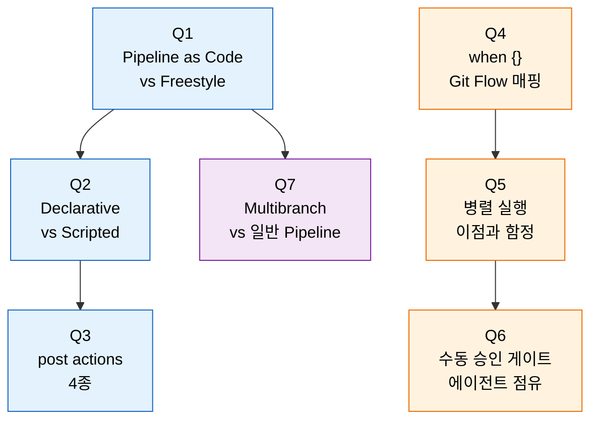

# 2단계 점검 — Pipeline 핵심 질문

> 다루는 문서: `02-01.코드로 파이프라인 정의하기` ~ `02-04.실패 대응과 파이프라인 원칙`
> 본 점검은 질문만 모아 둡니다. 답을 떠올린 뒤 문서 맨 아래 `§정답` 절을 펼쳐 자기 답과 비교합니다.

## §점검 사용 목표

> 이 질문들에 막힘 없이 답할 수 있으면 2단계 본편 학습이 끝난 것으로 봅니다. 표와 예제는 본문에 있으므로 여기서는 *왜 그렇게 설계됐는가* 만 묻습니다. 막힌 질문은 해당 절로 돌아가 다시 읽고 다음 회차 복습으로 가져갑니다.

## §사전 지식

> 본 점검은 "코드로 인프라를 관리한다(IaC)", "선언적 vs 명령형 DSL", "워커 풀과 외부 호출 패턴" 같은 일반 개념을 Jenkins Pipeline 의 Declarative/Scripted, when/post/parallel, Multibranch/Shared Library 단위로 좁혀 본 형태입니다.

## §질문 흐름 한눈에

> 파란색은 *문법과 구조* (왜 코드로, 어떤 DSL 로, 어떻게 마무리할지), 주황색은 *실행 흐름 제어* (조건, 병렬, 사람 개입), 보라색은 *프로젝트 스케일* (브랜치 다중화) 입니다.

---

## Q1: Pipeline as Code가 Freestyle Job보다 나은 이유는?

> 답은 §정답 절을 참조합니다.

### 심화

Jenkinsfile을 팀에서 공유할 때 Shared Library와의 관계는 무엇입니까? 공통 로직을 어떻게 중앙화합니까?

## Q2: Declarative와 Scripted Pipeline의 차이는?

> 답은 §정답 절을 참조합니다.

### 심화

Declarative 안에서 `script {}` 블록을 과도하게 쓰면 사실상 Scripted와 같아집니다. 이 경계를 어떻게 관리하겠습니까?

## Q3: post actions 종류와 실무 활용 패턴은?

> 답은 §정답 절을 참조합니다.

### 심화

stage 레벨 `post`와 pipeline 레벨 `post`를 어떤 기준으로 구분해서 씁니까?

## Q4: when {} 조건을 Git Flow에 매핑하는 방법은?

> 답은 §정답 절을 참조합니다.

### 심화

`when { changeset }` 사용 시 첫 빌드에서는 이전 커밋이 없어 변경 파일을 감지할 수 없습니다. 어떻게 해결합니까?

## Q5: 병렬 실행의 이점과 주의사항은?

> 답은 §정답 절을 참조합니다.

### 심화

병렬 테스트 결과를 하나의 리포트로 합치려면 어떤 접근이 필요합니까?

## Q6: 수동 승인 게이트 구현 시 에이전트 점유 문제는?

> 답은 §정답 절을 참조합니다.

### 심화

승인 게이트 없이 완전 자동화된 프로덕션 배포(Continuous Deployment)로 전환하려면 어떤 전제 조건이 필요합니까?

## Q7: Multibranch Pipeline이 일반 Pipeline Job과 다른 점은?

> 답은 §정답 절을 참조합니다.

### 심화

모노레포에서 Multibranch Pipeline을 사용할 때, 변경된 모듈만 빌드하려면 어떻게 설계해야 합니까?

---

## §정답

> 자기 답을 떠올린 뒤에만 이 절을 펼쳐 봅니다. 먼저 읽으면 active recall 효과가 사라집니다.

### Q1 정답

Jenkinsfile은 Git 히스토리로 변경의 저자·시점·이유를 남기므로 Freestyle처럼 UI에서 누가 무엇을 바꿨는지 추적 불가능한 상태가 되지 않습니다. 파이프라인 변경이 PR 리뷰에 들어오므로 위험한 설정 변경을 사전에 잡을 수 있고, Jenkins 서버가 날아가도 Git에서 clone하면 즉시 복원됩니다. 브랜치마다 Job을 따로 관리할 필요가 없는 것은 결과적으로 따라오는 부수 효과입니다.

상세 비교는 `02-01.md` §1 을 참조합니다.

### Q1 심화 정답

Shared Library 는 *여러 Jenkinsfile 이 반복하는 공통 코드를 한 Git 저장소에 모아 두는 메커니즘* 입니다. 예를 들어 100개 마이크로서비스가 각자 `docker build → push → slack 알림` 을 적는다면 같은 로직 100벌이 떠다닙니다. 이 공통부를 `vars/buildDocker.groovy`·`vars/notifySlack.groovy` 같은 *전역 함수* 로 옮기고 개별 Jenkinsfile 은 `buildDocker(image: 'myapp')` 한 줄만 부르면 됩니다. 결과적으로 개별 Jenkinsfile 은 *무엇을 빌드/배포하는가* 만 남고, *어떻게 빌드/알리는가* 는 라이브러리에서 한 번만 관리합니다. 상세는 `02-04.md` §Shared Library 와 08 시리즈를 참조합니다.

### Q2 정답

Declarative는 정해진 DSL을 강제하므로 실행 전에 문법 구조 검증이 가능하고 실패한 stage부터 재시작할 수 있습니다. Scripted는 `node {}` 안의 순수 Groovy라 자유도는 높지만 오류는 실행 시점에야 드러나고 재시작은 처음부터 해야 합니다. 실무 90%는 Declarative로 충분하며, 복잡한 로직만 `script {}` 블록으로 들여놓습니다.

비교 표는 `02-01.md` §Declarative vs Scripted Pipeline 을 참조합니다.

### Q2 심화 정답

세 가지 신호를 자체 기준으로 둡니다. (a) **줄 수** — 한 Jenkinsfile 의 `script {}` 합산이 stage 본문 줄 수의 30% 를 넘으면 위험. (b) **반복** — 같은 `script {}` 패턴이 두 Jenkinsfile 이상에 나타나면 Shared Library `vars/` 로 추출. (c) **선언적 대체 가능 여부** — 단순 환경 변수 선언·조건 분기를 `script` 로 풀고 있으면 `environment {}`·`when { expression {} }` 로 다시 옮김. 이 세 신호가 깨지지 않는 한 Declarative 의 사전 검증·재시작 이점이 유지됩니다.

### Q3 정답

`always`(워크스페이스 정리·테스트 결과 수집), `success`(알림·CD 트리거), `failure`(@here 멘션), `changed`(상태 전환 알림 — "이전까지 성공하던 빌드가 실패하기 시작했습니다") 네 가지가 핵심입니다. 실행 순서는 결과별 조건이 먼저, `always`가 마지막이며 이 순서를 알면 "왜 알림이 두 번 가는가" 같은 의문이 풀립니다. `post`는 pipeline 레벨과 stage 레벨 둘 다에서 정의 가능합니다.

조건별 표는 `02-02.md` §Post Actions 를 참조합니다.

### Q3 심화 정답

기준은 *후처리의 영향 범위* 입니다. **stage 레벨 `post`** — 해당 stage 의 산출물 정리(임시 디렉토리, stage 별 테스트 리포트), stage 실패 시에만 보낼 좁은 알림. **pipeline 레벨 `post`** — 전체 워크스페이스 `cleanWs()`, 빌드 전체 결과 알림, CD 트리거. 같은 일을 두 레벨에 동시에 두면 알림이 두 번 가거나 정리가 두 번 도므로 *한 책임은 한 레벨에만* 둡니다.

### Q4 정답

브랜치 이름 패턴(`feature/*`, `develop`, `release/*`, `main`, `hotfix/*`)에 따라 빌드 강도와 배포 대상을 분기하는 것이 기본입니다. 두 가지 옵션이 가용성·비용에 결정적입니다. `beforeAgent true`는 비싼 노드(GPU 등)를 점유하기 전에 조건을 평가해 무의미한 점유를 막고, `changeset "backend/**"`는 모노레포에서 변경된 부분만 빌드해 CI 시간을 줄입니다.

브랜치별 동작 표는 `02-03.md` §브랜치별 조건부 실행 을 참조합니다.

### Q4 심화 정답

첫 빌드 시 이전 커밋이 없으면 Jenkins 는 *모든 파일이 변경된 것으로 간주* 해 안전 측으로 빌드를 돕니다. 그래서 보통은 문제가 아니지만, 명시적으로 통제하고 싶으면 (a) `when { anyOf { changeset 'backend/**'; expression { return env.BUILD_NUMBER == '1' } } }` 로 첫 빌드 예외 OR 분기를 박거나, (b) Multibranch + Git Polling 으로 첫 빌드 자체를 강제로 *전체 빌드* 시나리오로 묶습니다. 두 방법 모두 "첫 빌드에서 누락된 stage 없음" 을 보장합니다.

### Q5 정답

독립적인 작업(단위/통합 테스트, 보안 스캔, 린트)을 동시에 실행하면 전체 시간이 가장 긴 작업으로 수렴합니다. 함정은 셋입니다. (1) 동일 워크스페이스 공유 시 파일 쓰기 레이스 — `agent` 분리 또는 `dir()`로 격리. (2) 4 병렬 = 에이전트 슬롯 4개 점유로 다른 Job 지연 가능. (3) `failFast true`는 첫 실패에 나머지를 끊고, 기본값은 모두 끝까지 실행해 한 번에 모든 결과를 봅니다.

### Q5 심화 정답

각 병렬 stage 가 결과를 *공통 합의된 포맷* (JUnit XML, SARIF 등) 으로 따로 떨어뜨린 뒤 마지막에 통합합니다. 패턴은 (a) 병렬 stage 마다 `**/build/test-results/**/*.xml` 같은 표준 경로에 결과 출력, (b) 모든 병렬이 끝난 뒤 별도 *통합 stage* 에서 `junit '**/build/test-results/**/*.xml'` 또는 `publishHTML` 로 일괄 수집. 동일 워크스페이스가 아니라면 각 병렬이 `stash` 로 결과를 올리고 통합 stage 가 `unstash` 로 모은 뒤 발행하는 형태가 안전합니다.

### Q6 정답

`input`이 `steps` 블록 안에 있으면 승인 대기 시간 동안 에이전트가 점유되어 리소스가 낭비됩니다. 해당 stage에 `agent none`을 지정해 에이전트를 풀고, `timeout(time: 2, unit: 'HOURS')`로 무한 대기를 방지하며, `parameters` 옵션으로 승인 사유를 입력받아 누가 언제 왜 승인했는지 감사 로그를 남깁니다. 이 세 가지가 빠지면 운영 사고로 직결됩니다.

상세는 `02-04.md` §retry, timeout, input 을 참조합니다.

### Q6 심화 정답

수동 게이트를 빼려면 *게이트가 잡아주던 위험* 을 자동 검증으로 대체해야 합니다. 보통 (a) **트래픽 게이트** — Canary / Blue-Green 배포로 신규 버전이 일부 트래픽만 받게 두고 에러율·지연 지표가 임계 안일 때만 전체로 승격, (b) **자동 롤백** — SLO 위반이 감지되면 즉시 이전 버전으로 회귀, (c) **테스트 신뢰도** — 통합·E2E·계약 테스트 커버리지가 충분해서 "사람이 봐야 안심" 이 사라진 상태. 셋이 모두 갖춰지지 않으면 게이트를 빼는 순간 사고 빈도가 늘어납니다.

### Q7 정답

Branch Source Plugin이 SCM을 주기적으로 스캔해 `Jenkinsfile`이 있는 모든 브랜치를 자동 탐지하고, 각 브랜치마다 독립 하위 Job을 생성합니다. 일반 Pipeline은 브랜치당 수동 생성, 삭제 시 수동 정리, PR 빌드 별도 설정이 필요하지만 Multibranch는 Orphaned Item Strategy로 자동 정리하고 GitHub/GitLab 통합으로 PR을 머지 상태로 빌드합니다.

기능 비교 표는 `02-03.md` §Multibranch Pipeline 을 참조합니다.

### Q7 심화 정답

모노레포 + Multibranch 의 표준 접근은 `when { changeset }` 과 *모듈별 stage 분리* 의 결합입니다. (a) Jenkinsfile 최상위에서 변경 경로를 한 번 계산 (`def changed = sh(returnStdout: true, script: 'git diff --name-only HEAD~1')`), (b) 각 모듈 stage 에 `when { changeset 'backend/**' }` / `when { changeset 'frontend/**' }` 박음, (c) 공통 의존(예: `libs/**`) 이 바뀌면 전체 빌드로 fallback. 첫 빌드·변경 감지 실패 시 *전체 빌드* 로 안전하게 떨어지는 분기를 함께 둡니다.
