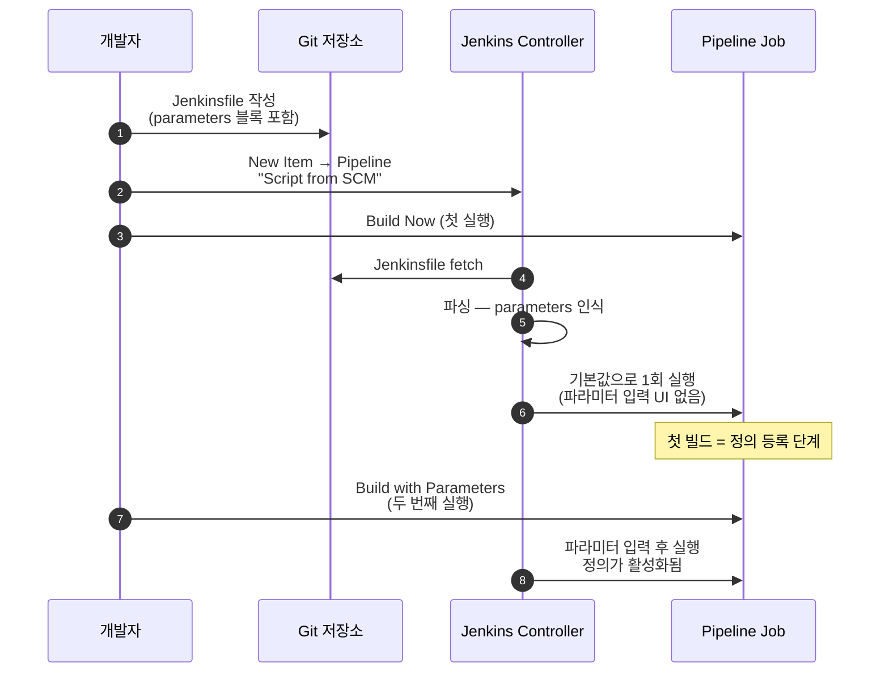
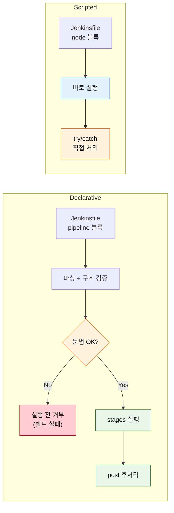

# Pipeline as Code

---

> Pipeline이 Jenkins의 중심입니다. 이 문서는 코드로 파이프라인을 정의하는 접근법을 다룹니다.

## §학습 목표

> 이 문서를 읽고 나면 Freestyle Job 과 Pipeline as Code 가 *추적성·재현성·테스트 가능성* 축에서 어떻게 다른지 *비교* 할 수 있고, Declarative 와 Scripted Pipeline 의 사전 검증 차이를 *설명* 할 수 있으며, `script {}` 블록을 *언제 써야 하고 언제 피해야 하는지* 를 판별할 수 있습니다.

## §사전 지식

> 본 문서는 "코드로 인프라/설정을 관리한다(IaC, Configuration as Code)" 와 "선언적 DSL vs 명령형 스크립트" 라는 일반 개념을 Jenkins 의 Jenkinsfile·Declarative/Scripted 단위로 좁혀 본 것입니다.

## Freestyle Job의 한계

> 본 절은 Freestyle Job 이 *왜 팀 규모에서 부서지는가* 를 변경 추적·복구·환경 일관성 다섯 축으로 정리합니다.

> Jenkins 초기 사용 방식인 Freestyle Job은 웹 UI에서 마우스 클릭으로 빌드 설정을 구성합니다.
>
> - 처음에는 직관적이지만 팀 규모가 커지고 파이프라인이 복잡해지면 치명적인 한계에 부딪힙니다.

| 항목 | Freestyle Job | Pipeline as Code |
|------|---------------|-----------------|
| **변경 추적** | 누가 언제 뭘 바꿨는지 기록 없음 | Git 커밋 히스토리로 모든 변경 추적 |
| **코드 리뷰** | 빌드 설정을 PR로 리뷰할 방법 없음 | Jenkinsfile도 PR 리뷰 대상에 포함 |
| **재현성** | Jenkins 서버 장애 시 설정 복구 어려움 | Git에서 clone하면 파이프라인 즉시 복원 |
| **환경 일관성** | 환경별 Job을 각각 수동 설정 | 하나의 Jenkinsfile이 매개변수로 환경 분기 |
| **테스트 가능성** | 빌드 설정 자체를 테스트할 방법 없음 | 문법 검증(lint), 로컬 테스트 가능 |

- 이 한계들이 실제로 문제가 되는 시점은 Jenkins 서버가 교체되거나 동일한 파이프라인을 여러 팀이 공유해야 할 때입니다.
- Freestyle Job 방식에서는 설정 복구에 수 시간이 걸리지만, Pipeline as Code는 Git 저장소만 있으면 즉시 재현됩니다.


## Jenkinsfile과 Pipeline as Code

> 본 절은 Jenkinsfile 이 *애플리케이션 코드와 같은 저장소* 에 사는 이유를 다룹니다. 핵심은 *파이프라인 변경의 라이프사이클을 코드 변경과 일치시키는 것* 입니다.

> **Pipeline as Code**는 빌드/배포 파이프라인을 소스 코드처럼 파일로 정의하고 애플리케이션 코드와 같은 저장소에 함께 관리하는 접근법입니다.
>
> - 이 파일을 `Jenkinsfile`이라고 부르며, 저장소 루트에 위치시키는 것이 관례입니다.

Jenkinsfile을 소스 코드와 같은 저장소에 두는 이유는 파이프라인과 코드의 생명주기를 일치시키기 위해서입니다.

- Feature 브랜치에서 새로운 빌드 단계가 필요하면 해당 브랜치의 Jenkinsfile을 함께 수정하면 됩니다.
- main 브랜치의 파이프라인에는 영향이 없고, PR 리뷰를 통해 파이프라인 변경도 코드 변경과 동일하게 검토받을 수 있습니다.

Git 기반 관리의 핵심 이점은 세 가지입니다.

- **변경 추적**: 파이프라인 설정 변경이 Git 커밋으로 기록되어 누가 언제 왜 바꿨는지 알 수 있습니다
- **PR 리뷰**: 파이프라인 변경을 코드 변경과 동일한 리뷰 프로세스로 검토할 수 있습니다
- **즉시 복원**: 장애 발생 시 `git revert` 한 줄로 이전 상태로 돌아갈 수 있습니다

Jenkinsfile을 작성할 때 주의할 점이 하나 있습니다.

- Jenkins에서 새 Pipeline Job을 생성하고 "Pipeline script from SCM"으로 설정하면, Jenkins가 첫 빌드 시 저장소에서 Jenkinsfile을 가져와 파싱합니다.
- `parameters` 블록이나 `triggers` 블록을 처음 추가했을 때는 이 첫 번째 실행에서 해당 설정이 적용되지 않습니다.
- Jenkins가 Jenkinsfile을 읽어 파이프라인 정의를 인식해야 하므로, 첫 실행은 기본값으로 수행되고 두 번째 실행부터 정의가 활성화됩니다. Multibranch Pipeline을 사용하면 이 과정이 브랜치 스캔 시 자동으로 처리됩니다.

### Jenkinsfile 첫 빌드 라이프사이클

> 위의 *첫 실행 = 기본값* 함정을 한 그림으로 정리합니다.



> 핵심은 *첫 빌드는 정의를 Jenkins 에 등록하는 단계* 라는 점입니다. Multibranch Pipeline 은 브랜치 스캔이 이 등록을 대신 처리해 주므로 첫 빌드에서도 파라미터 UI 가 나타납니다.


## Declarative vs Scripted Pipeline

> 본 절은 Jenkins Pipeline 의 두 문법을 *사전 검증·재시작 단위·자유도* 축에서 비교합니다. 결론은 *기본은 Declarative, 복잡한 로직만 `script {}` 로 들어감* 입니다.

> Jenkins Pipeline은 두 가지 문법을 지원합니다. 같은 Pipeline 엔진 위에서 동작하지만 코드를 작성하는 방식과 제약 사항이 근본적으로 다릅니다.

**Declarative Pipeline**은 Jenkins가 제공하는 구조화된 DSL입니다.

- `pipeline {}` 블록을 최상위로 하여 정해진 블록 구조를 따릅니다.
- Jenkins가 이 구조를 파싱하여 문법 오류를 빌드 실행 전에 검증할 수 있으므로, 잘못된 파이프라인이 실행되는 것을 사전에 방지합니다.

```groovy
pipeline {
    agent any
    stages {
        stage('Build') {
            steps {
                sh 'mvn clean package'
            }
        }
    }
    post {
        failure { mail to: 'team@example.com', subject: 'Build Failed' }
    }
}
```

**Scripted Pipeline**은 순수 Groovy 스크립트입니다.

- `node {}` 블록 안에서 자유롭게 Groovy 코드를 작성할 수 있어 조건 분기, 반복문, 예외 처리 등 프로그래밍 언어의 모든 기능을 사용할 수 있습니다.
- 그러나 이 자유도는 곧 복잡성으로 이어지며, 구조적 검증이 불가능합니다.

```groovy
node {
    stage('Build') {
        try {
            // 왜 try-catch 를 직접 쓰는가:
            // Scripted 는 post {} 같은 선언적 후처리가 없어 실패 분기를 손으로 잡아야 함
            sh 'mvn clean package'
        } catch (Exception e) {
            currentBuild.result = 'FAILURE'
            throw e  // 다시 던져야 빌드 결과가 실제 FAILURE 로 마무리됨
        }
    }
}
```

| 항목 | Declarative | Scripted |
|------|-------------|----------|
| **문법** | 구조화된 DSL (`pipeline {}`) | 순수 Groovy (`node {}`) |
| **유연성** | 제한적 (정해진 블록 구조) | 완전한 Groovy 프로그래밍 |
| **사전 검증** | 문법 오류 실행 전 검출 | 실행 시점에만 오류 발견 |
| **에러 핸들링** | `post {}` 블록으로 선언적 처리 | `try-catch-finally` 직접 작성 |
| **재시작** | 특정 stage부터 재시작 가능 | 처음부터 재실행만 가능 |
| **권장 상황** | 대부분의 CI/CD 파이프라인 | 동적 스테이지 생성, 복잡한 조건 로직 |

- 실무에서 90%의 유스케이스는 Declarative Pipeline으로 충분합니다. 나머지 10%의 복잡한 로직은 `script {}` 블록으로 처리합니다.

### Declarative vs Scripted 한눈에 비교

> 두 문법의 *처리 흐름* 자체가 다릅니다. Declarative 는 *파싱→검증→실행* 으로 사전 게이트가 한 단계 있고, Scripted 는 *바로 실행* 입니다.



> Declarative 의 *문법 OK?* 게이트가 있기 때문에 잘못된 파이프라인이 Agent 점유 없이 즉시 거부됩니다. Scripted 는 그 게이트가 없어 실행 중 NullPointerException 같은 형태로 깨집니다.


## script {} 블록

> 본 절은 Declarative 안에서 Groovy 가 필요한 경우의 *유일한 합법 통로* 인 `script {}` 의 *사용 기준과 회피 기준* 을 다룹니다.

> Declarative Pipeline 안에서 Groovy 코드가 필요한 경우 `script {}` 블록을 사용합니다.
>
> - 블록 내부에서는 Scripted Pipeline과 동일한 Groovy 문법을 사용할 수 있으므로, Declarative의 구조적 명확함을 유지하면서 필요한 부분에만 유연성을 추가할 수 있습니다.

```groovy
pipeline {
    agent any
    stages {
        stage('Dynamic Build') {
            steps {
                script {
                    // 왜 script {} 를 쓰는가:
                    // 서비스 목록이 런타임에 결정되므로 정적 stage 선언으로는 표현 불가
                    def services = ['api', 'web', 'worker']
                    def builds = [:]
                    services.each { svc ->
                        builds[svc] = { sh "docker build -t ${svc} ./${svc}" }
                    }
                    parallel builds  // 동적으로 만든 맵을 병렬 실행에 그대로 넘김
                }
            }
        }
    }
}
```

- `script {}` 블록을 사용해야 하는 경우는 주로 두 가지입니다.

1. 동적으로 병렬 스테이지를 생성해야 할 때입니다. 서비스 목록이 런타임에 결정되거나 API 응답에 따라 분기가 필요한 경우가 여기에 해당합니다.
2. 변수를 선언하고 스테이지 간에 값을 전달해야 할 때입니다.

반대로 피해야 하는 경우도 있습니다.

- 단순한 셸 명령 실행이나 파일 아카이빙처럼 Declarative 지시문으로 표현 가능한 작업에 `script {}` 블록을 쓰면 코드가 불필요하게 복잡해집니다.
- `script {}` 블록이 많아질수록 Scripted Pipeline과 차이가 없어지므로, 꼭 필요한 경우에만 최소한으로 사용하는 것이 좋습니다.

---

## 면접 질문

> 자기 답을 떠올린 뒤 `정답` 절을 펼쳐 비교합니다.

1. Freestyle 과 Pipeline as Code 차이 중에서 *팀 규모가 커질수록* 가장 먼저 비용으로 드러나는 항목은 무엇입니까?
2. Declarative Pipeline 의 *사전 검증* 이 운영 비용을 어떻게 줄입니까? Agent 자원 측면에서 설명할 수 있습니까?
3. `script {}` 가 한 Jenkinsfile 에서 *어떻게 커지면 위험 신호* 입니까? 자체 기준 세 가지를 말할 수 있습니까?
4. `parameters` 블록을 새로 추가한 첫 빌드에서 파라미터 UI 가 안 나타나는 이유는 무엇이며, Multibranch Pipeline 은 이 함정을 어떻게 피합니까?

## 정답

### 정답 1 — 팀 규모가 커질 때 드러나는 비용

**변경 추적** 입니다. 팀이 작을 때는 UI 클릭 변경이라도 *누가 바꿨는지* 구두로 파악되지만, 10명 이상이 같은 Jenkins 인스턴스를 쓰면 *왜 어제 잘 돌던 빌드가 깨졌는가* 의 원인 추적이 불가능해집니다. Pipeline as Code 는 같은 상황에서 `git log Jenkinsfile` 한 줄로 책임자·시점·이유가 동시에 나옵니다.

### 정답 2 — 사전 검증이 줄이는 운영 비용

Declarative 는 *파싱→구조 검증→실행* 의 세 단계이고, 검증 단계에서 문법 오류면 *Agent 를 점유하기 전에* 빌드가 거부됩니다. Scripted 는 같은 오류가 `node {}` 안에서 발견되므로 이미 Executor 슬롯·체크아웃·일부 step 실행 비용을 쓴 뒤에 깨집니다. 즉 Declarative 의 사전 검증은 *잘못된 빌드의 Agent 자원 소비 비용을 0 으로* 만듭니다.

### 정답 3 — script 블록의 위험 신호

세 신호로 봅니다. (a) **줄 수** — `script {}` 합산이 stage 본문의 30% 를 넘으면 위험. (b) **반복** — 같은 `script {}` 패턴이 두 Jenkinsfile 이상에 나타나면 Shared Library `vars/` 추출 타이밍. (c) **선언적 대체 가능 여부** — 단순 환경 변수·조건 분기를 `script` 로 풀고 있으면 `environment {}`·`when { expression {} }` 로 옮길 신호. 세 신호 중 하나라도 깨지면 Declarative 의 이점(사전 검증·재시작)이 사라집니다.

### 정답 4 — parameters 첫 빌드 함정

`parameters` 블록은 Jenkinsfile 을 *파싱해서 Jenkins 내부 Job 정의에 등록* 되어야 비로소 UI 에 노출됩니다. 첫 빌드는 *그 등록을 수행하는 단계* 이므로 파라미터 입력 UI 가 없고 기본값으로 한 번 돕니다. 두 번째부터 "Build with Parameters" 가 활성화됩니다. Multibranch Pipeline 은 *브랜치 스캔 단계* 에서 Jenkinsfile 을 미리 파싱해 Job 정의를 등록하므로 첫 빌드부터 파라미터 UI 가 나옵니다.

## 관련 문서

> 코드로 정의하기로 결정한 다음에는 어떤 블록으로 구성하고(02-02), 어떤 패턴으로 합성하며(02-03), `script` 비대화 시 어디로 추출하는지(05_operations 공유 라이브러리)로 이어집니다.

- [01-01. Jenkins가 제어하는 것](01-01.Jenkins가%20제어하는%20것.md) § "제어 영역" — 코드화 대상이 되는 제어 영역의 전제
- [02-02. Declarative Pipeline 핵심 구조](02-02.Declarative%20Pipeline%20핵심%20구조.md) § "블록 구조" — Declarative 선택 후의 4계층 블록 본편
- [02-03. Pipeline 패턴](02-03.Pipeline%20패턴.md) § "Multibranch" — `parameters` 첫 빌드 함정(정답 4)을 Multibranch가 회피
- [../05_operations/02-01. 공유 라이브러리](../05_operations/02-01.공유%20라이브러리.md) § "vars/src" — `script {}` 비대화 시 추출 대상(정답 3)
