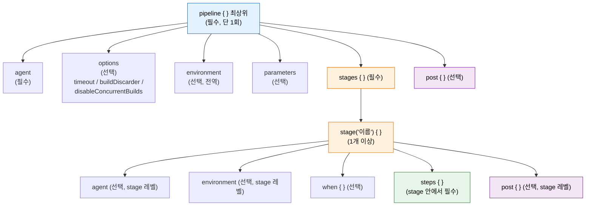

# Declarative Pipeline 구조와 문법

---

> `pipeline {}` 블록의 핵심 구조와 자주 쓰는 지시문을 정리합니다.

## §학습 목표

> 이 문서를 읽고 나면 Declarative Pipeline 의 *4계층 블록 구조* (pipeline → stages → stage → steps) 와 각 계층의 역할을 *설명* 할 수 있고, `agent` 유형 6종(`any` / `none` / `label` / `docker` / `dockerfile` / `kubernetes`) 의 격리 수준을 *비교* 할 수 있으며, `environment` · `parameters` · `post` 블록이 *어떤 시점에 동작하는지* 를 *예측* 할 수 있습니다.

## §사전 지식

> 본 문서는 "선언적 DSL 의 계층 구조", "빌드 환경 격리(VM·컨테이너)", "환경 변수 vs 사용자 입력 파라미터", "후처리 훅(post-hook)" 같은 일반 개념을 Jenkins Declarative Pipeline 의 `pipeline {}` · `agent` · `environment` · `parameters` · `post` 단위로 좁혀 본 것입니다.

## 핵심 블록 구조

> 본 절은 Declarative Pipeline 의 *4계층 블록* 이 어떻게 중첩되는지와 각 계층의 단일 책임을 다룹니다.

> Declarative Pipeline은 계층적 블록 구조로 구성됩니다.
>
> - 최상위 `pipeline {}` 블록 안에 `agent`, `stages`, `post` 등 지시문이 위치하며, `stages` 안에 여러 `stage`가 들어가고, 각 `stage` 안에 `steps`가 위치하는 형태입니다.

```groovy
pipeline {           // 최상위 블록 (필수)
    agent any        // 실행 환경 지정 (필수)
    stages {         // 스테이지 묶음 (필수)
        stage('Build') {    // 개별 스테이지
            steps {         // 실행할 작업
                sh 'mvn clean package'
            }
        }
        stage('Test') {
            steps {
                sh 'mvn test'
            }
        }
    }
    post { }         // 실행 후 처리 (선택)
}
```

각 블록의 역할은 명확하게 분리됩니다.

- `agent`는 어디서 실행할지를 결정하고, `stages`는 무엇을 순서대로 실행할지를 정의하며, `post`는 실행 결과에 따라 어떻게 후처리할지를 담당합니다.
- 이 구조를 지키는 한 Jenkins는 파이프라인을 실행 전에 검증하고 Blue Ocean UI에서 자동으로 시각화할 수 있습니다.

### Declarative 4계층 블록 한눈에

> 어떤 지시문이 어느 계층에 속해야 하는지를 한 그림으로 정리합니다. 잘못된 계층에 두면 *문법 검증* 단계에서 거부됩니다.



> 파란색은 *최상위 한 번만 등장*, 주황색은 *반복 등장 가능*, 초록색은 *실제 명령 실행이 일어나는 자리*, 보라색은 *후처리* 입니다. `agent`·`environment`·`post` 는 pipeline 레벨과 stage 레벨 둘 다에 둘 수 있고, 좁은 쪽이 우선됩니다.

`options` 블록은 파이프라인 동작 방식을 설정하는 선택적 블록입니다. 전체 파이프라인 타임아웃, 빌드 보존 개수, 동시 실행 방지 등을 여기서 선언합니다.

```groovy
options {
    timeout(time: 30, unit: 'MINUTES')              // 왜: 외부 호출 지연으로 인한 무한 대기 차단
    buildDiscarder(logRotator(numToKeepStr: '10'))  // 왜: 빌드 기록 무한 증가로 디스크 가득 차는 사고 방지
    disableConcurrentBuilds()                       // 왜: 같은 브랜치 빌드 중복 실행 시 워크스페이스 레이스 방지
}
```


## agent 유형별 사용법

> 본 절은 `agent` 6종을 *격리 수준* 축에서 비교합니다. `none` 은 *Pipeline 레벨 위임*, `docker`/`kubernetes` 는 *환경 격리* 가 핵심입니다.

>  `agent`는 **파이프라인이 어디에서 실행될지를 결정**합니다. 유형에 따라 빌드 환경의 격리 수준과 재현성이 달라집니다.

| 유형 | 선언 방식 | 용도 |
|------|-----------|------|
| `any` | `agent any` | 사용 가능한 아무 Agent에서 실행 |
| `none` | `agent none` | 파이프라인 레벨 Agent 없음, stage마다 개별 지정 |
| `label` | `agent { label 'linux' }` | 특정 라벨의 Agent에서 실행 |
| `docker` | `agent { docker { image '...' } }` | Docker 컨테이너 안에서 실행 |
| `dockerfile` | `agent { dockerfile { filename '...' } }` | 저장소 내 Dockerfile로 환경 생성 |
| `kubernetes` | `agent { kubernetes { yaml '...' } }` | K8s Pod으로 동적 Agent 프로비저닝 |

stage마다 다른 Agent를 사용해야 할 때는 `agent none` 패턴을 씁니다. 파이프라인 레벨에서 Agent를 지정하지 않고 각 stage에서 개별 지정하는 방식입니다.

```groovy
pipeline {
    agent none  // 왜: stage 마다 다른 환경(Docker / production 서버)이 필요할 때 위임
    stages {
        stage('Build') {
            agent { docker { image 'maven:3.9-eclipse-temurin-17' } }
            steps { sh 'mvn clean package' }
        }
        stage('Deploy') {
            agent { label 'production-server' }
            steps { sh './deploy.sh' }
        }
    }
}
```

### 격리 수준 한눈에 — 어디까지가 문법, 어디부터 실행환경인가

`docker` 와 `kubernetes` 는 같은 "컨테이너 기반 격리" 라도 *경계가 놓이는 위치* 가 다릅니다. Declarative 문법 관점에서 6종을 격리 수준 축으로만 추리면 다음과 같습니다.

| 유형 | 격리 경계 | 문법 위에서 보이는 차이 |
|------|----------|----------------------|
| `any` / `label` | 격리 없음 (Agent 호스트 그대로) | 도구가 Agent 에 미리 설치돼 있어야 함 |
| `none` | (해당 없음 — stage 로 위임) | pipeline 레벨 Agent 미지정, stage 마다 개별 선언 |
| `docker` / `dockerfile` | Agent 호스트 안의 컨테이너 (커널 공유) | 한 컨테이너, Agent 에 Docker Engine 전제 |
| `kubernetes` | Pod 단위 (네트워크/스토리지 격리) | 여러 컨테이너(sidecar), Controller 가 클러스터 접근 전제 |

여기까지가 *Declarative 문법이 표현하는 표면* 입니다. 그 아래 — `docker pull → run` 이 Agent 어디서 도는지, K8s Plugin 이 Pod 를 어떻게 동적 생성·삭제하는지, Private Registry 인증·멀티 컨테이너·DinD·Kaniko 같은 *실행환경 내부 동작* — 은 본 편의 범위가 아니라 `03_agent` 폴더가 SSOT 로 다룹니다. 같은 내용을 양쪽에 두면 어긋나므로, 내부 동작이 궁금하면 아래 관련 문서의 03_agent 링크로 넘어갑니다.


## environment와 parameters

> 본 절은 *Jenkins 내부에서 정의되는 환경 변수* (environment) 와 *빌드 시 사용자가 입력하는 파라미터* (parameters) 의 차이와 활용 패턴을 다룹니다. `credentials()` 함수는 두 영역의 교차점입니다.

> `environment` 블록은 파이프라인 전체 또는 특정 stage에서 사용할 환경 변수를 선언합니다.
>
> - 전역 선언은 `pipeline {}` 바로 아래에, 스테이지별 선언은 해당 `stage {}` 안에 넣습니다.

```groovy
pipeline {
    agent any
    environment {
        REGISTRY = 'registry.example.com'
        // 왜 credentials(): Jenkins Credentials 저장소의 값을 빌드 로그 마스킹 대상으로 가져옴
        DB_CRED  = credentials('db-password')  // Jenkins Credentials에서 주입
    }
    stages {
        stage('Deploy') {
            environment {
                DEPLOY_ENV = 'staging'          // 이 stage에서만 유효
            }
            steps {
                sh "docker push ${REGISTRY}/app:${BUILD_NUMBER}"
                sh "./deploy.sh ${DEPLOY_ENV}"
            }
        }
    }
}
```

- `credentials()` 함수는 Jenkins Credentials 저장소에서 값을 가져옵니다.
- Username/Password 타입은 `_USR`(사용자명)과 `_PSW`(패스워드) 접미사로 분리 접근이 가능합니다. 시크릿은 빌드 로그에서 자동으로 마스킹되므로 평문 하드코딩보다 안전합니다.

`parameters` 블록은 빌드 실행 시 사용자로부터 입력을 받는 파라미터를 정의합니다.

```groovy
pipeline {
    agent any
    parameters {
        choice(name: 'DEPLOY_ENV',
               choices: ['dev', 'staging', 'prod'],
               description: '배포할 환경을 선택하세요')
        booleanParam(name: 'SKIP_TESTS',
                     defaultValue: false,
                     description: '긴급 배포 시 테스트 건너뜀')
        string(name: 'IMAGE_TAG',
               defaultValue: 'latest',
               description: '배포할 Docker 이미지 태그')
    }
    stages {
        stage('Test') {
            when { expression { return !params.SKIP_TESTS } }
            steps { sh 'mvn test' }
        }
        stage('Deploy') {
            steps {
                sh "deploy.sh --env ${params.DEPLOY_ENV} --tag ${params.IMAGE_TAG}"
            }
        }
    }
}
```

- 파라미터를 처음 선언한 후 첫 번째 실행에서는 파라미터가 적용되지 않습니다.
- Jenkins가 Jenkinsfile을 파싱해야 파라미터 정의를 인식하므로, 첫 실행은 기본값으로 수행되고 두 번째 실행부터 "Build with Parameters" 버튼이 활성화됩니다.


## Post Actions

> 본 절은 6종 `post` 조건이 *언제 동작하는지* 와 *왜 결과별 조건이 always 보다 먼저 평가되는지* 를 다룹니다.

> `post` 블록은 파이프라인 실행 완료 후 결과에 따라 처리할 작업을 선언합니다.
>
> - 실패 알림, 워크스페이스 정리, 테스트 리포트 발행 등을 여기에 넣습니다.
> - post를 사용하는 이유는 결과에 따른 후처리를 steps 안에 분산시키지 않고 한 곳에 모아 의도를 명확하게 드러내기 위해서입니다.

| 조건 | 실행 시점 |
|------|-----------|
| `always` | 성공/실패 무관하게 항상 |
| `success` | 파이프라인이 성공했을 때 |
| `failure` | 파이프라인이 실패했을 때 |
| `unstable` | 빌드 결과가 UNSTABLE일 때 (테스트 실패 등) |
| `changed` | 이전 빌드와 결과가 달라졌을 때 |
| `aborted` | 사용자가 수동으로 중단했을 때 |

```groovy
post {
    always {
        cleanWs()                                  // 왜: 다음 빌드가 깨끗한 워크스페이스에서 시작하도록 항상 정리
        junit '**/target/surefire-reports/*.xml'   // 왜: 결과 무관하게 테스트 리포트는 수집해야 추세 추적 가능
    }
    success {
        archiveArtifacts artifacts: '**/target/*.jar'
    }
    failure {
        slackSend(
            channel: '#build-alerts',
            color: 'danger',
            message: "빌드 실패: ${JOB_NAME} #${BUILD_NUMBER}\n${BUILD_URL}"
        )
    }
    changed {
        // 왜 changed: 성공이 실패로 바뀐 시점, 실패가 성공으로 돌아온 시점만 알림
        emailext(
            subject: "빌드 상태 변경: ${currentBuild.result}",
            body: '${DEFAULT_CONTENT}',
            to: '${DEFAULT_RECIPIENTS}'
        )
    }
}
```

- `post` 블록은 파이프라인 최상위(`pipeline {}` 직속)에도, 각 `stage {}` 안에도 넣을 수 있습니다. 스테이지별 `post`는 해당 스테이지 실패 시에만 동작하는 처리를 분리할 때 유용합니다.
- `cleanWs()`는 `always` 조건에 두는 것이 관례인데, 성공/실패에 무관하게 빌드 에이전트의 디스크를 정리해야 다음 빌드에 영향이 없기 때문입니다.

---

## 면접 질문

> 자기 답을 떠올린 뒤 `정답` 절을 펼쳐 비교합니다.

1. Declarative 4계층 블록 중 *stage 안에 필수* 인 블록 하나는 무엇이며, 누락 시 어떤 일이 일어납니까?
2. `agent` 가 pipeline 레벨과 stage 레벨에 *동시에* 있을 때 어느 쪽이 적용됩니까? 같은 질문을 `environment` 에 대해서도 답할 수 있습니까?
3. `environment { DB_CRED = credentials('...') }` 가 평문 하드코딩보다 안전한 이유 두 가지를 말할 수 있습니까?
4. `post` 의 `always` 와 `success`/`failure` 가 동시에 매치될 때 실행 순서는 어떻게 됩니까? `cleanWs()` 가 `always` 에 있어야 하는 이유는 무엇입니까?

## 정답

### 정답 1 — stage 안 필수 블록

`steps { }` 입니다. `stage` 는 *이름표 + 실행 묶음* 이고, 실제로 명령이 도는 자리는 `steps` 입니다. 누락하면 Declarative 의 *사전 구조 검증* 단계에서 "Missing required section 'steps'" 로 빌드가 *실행 전에 거부* 되어 Agent 자원을 안 씁니다.

### 정답 2 — agent·environment 적용 우선순위

둘 다 *좁은 쪽이 우선* 입니다. `agent` 는 stage 레벨 선언이 있으면 그 stage 만 해당 Agent 에서 도ㅓㄴ다 (pipeline 레벨은 다른 stage 의 기본값). `environment` 도 stage 레벨 변수가 pipeline 레벨과 동명이라면 stage 범위 안에서는 stage 값이 이깁니다. 패턴은 *공통 기본값은 pipeline, stage 별 override 는 stage* 입니다.

### 정답 3 — credentials가 안전한 이유

(a) **로그 마스킹** — `credentials()` 로 주입된 값은 Jenkins 가 빌드 로그를 출력할 때 자동으로 `****` 로 가립니다. 평문 변수는 `sh 'echo $PASS'` 한 줄이면 그대로 노출. (b) **저장소 분리** — 실제 값은 Jenkins Credentials 저장소(`secrets/`) 의 암호화 영역에 있고 Jenkinsfile 에는 *식별자* 만 남습니다. Git 에 시크릿이 박힐 위험이 0.

### 정답 4 — post 실행 순서와 cleanWs

순서는 *결과별 조건이 먼저, always 가 마지막* 입니다. 빌드가 실패한 경우 `failure` → `changed` (직전 빌드가 성공이었으면) → `always` 순서로 실행됩니다. `cleanWs()` 는 *결과와 무관하게* 워크스페이스를 비워야 다음 빌드가 안전하게 시작되므로 `always` 에 둡니다. `success` 에 두면 *실패 빌드 후 디스크가 정리되지 않아* 다음 빌드가 디스크 가득 차서 깨질 위험이 생깁니다.

## 관련 문서

> 이 편의 4계층 블록은 진입 동기(02-01) 위에 서고, 그 위에 합성 패턴(02-03)·실패 처리(02-04)가 얹히며, `credentials()` 마스킹은 보안 권한 모델로 이어집니다.

- [02-01. 코드로 파이프라인 정의하기](02-01.코드로%20파이프라인%20정의하기.md) § "Pipeline as Code" — Declarative 진입 동기와 사전 검증
- [02-03. Pipeline 패턴](02-03.Pipeline%20패턴.md) § "조건부·병렬" — 블록 위에 얹는 합성 패턴
- [02-04. 실패 대응과 파이프라인 원칙](02-04.실패%20대응과%20파이프라인%20원칙.md) § "post·cleanWs" — post 순서·cleanWs in always(정답 4) 심화
- [../03_agent/01-02. Docker with Pipeline](../03_agent/01-02.Docker%20with%20Pipeline.md) § "1 Docker Agent · 2 호스트 Docker vs DinD vs Kaniko" — `agent { docker }` 내부 동작(pull/run·Registry 인증·DinD)의 SSOT
- [../03_agent/02-01. Kubernetes Jenkins 구축](../03_agent/02-01.Kubernetes%20Jenkins%20구축.md) § "3 Kubernetes Plugin 설정" — `agent { kubernetes }` Pod 동적 생성·멀티 컨테이너의 SSOT
- [../02_security/01-02. 시크릿 관리와 최소 권한 원칙](../02_security/01-02.시크릿%20관리와%20최소%20권한%20원칙.md) § "자격증명 바인딩" — `credentials()` 마스킹(정답 3)의 권한 모델
