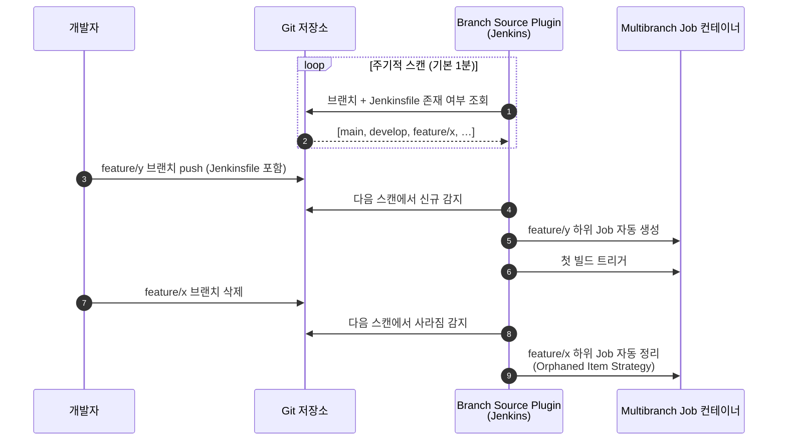
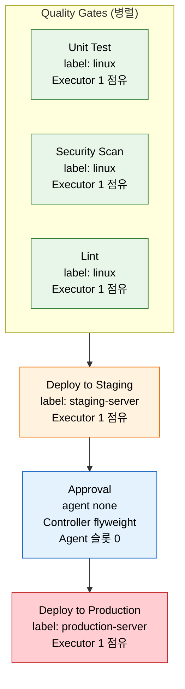

# Pipeline 패턴

---

> 실전에서 반복되는 파이프라인 설계 패턴을 정리합니다. 같은 Jenkinsfile이라도 브랜치, 파라미터, 실행 방식에 따라 동작이 달라져야 합니다.

## §학습 목표

> 이 문서를 읽고 나면 Multibranch Pipeline 이 *일반 Pipeline Job 의 어떤 운영 비용* 을 자동화로 흡수하는지 *설명* 할 수 있고, `when` 조건의 다섯 종(`branch` / `tag` / `expression` / `changeset` / `allOf|anyOf`) 을 Git Flow 와 *매핑* 할 수 있으며, 병렬 + 승인 게이트 조합에서 *Agent 점유 누수를 어디서 막아야 하는지* 를 식별할 수 있습니다.

## §사전 지식

> 본 문서는 "코드 분기 전략(Git Flow)", "독립 작업의 병렬화", "사람 승인 게이트", "파라미터화된 빌드" 같은 일반 CI/CD 패턴을 Jenkins Pipeline 의 Multibranch · `when` · `parallel` · `input` 단위로 좁혀 본 것입니다.

## Multibranch Pipeline

> 본 절은 Multibranch Pipeline 이 *브랜치마다 Job 을 수동 관리하는 비용* 을 어떻게 자동 스캔으로 흡수하는지 다룹니다. PR 빌드 자동화도 같은 메커니즘에서 따라옵니다.

> Multibranch Pipeline은 저장소의 모든 브랜치를 자동 감지하여 브랜치별로 독립적인 Job을 생성하는 Jenkins Job 유형입니다.
>
> - 일반 Pipeline Job이 고정된 하나의 브랜치만 빌드하는 것과 달리, `Jenkinsfile`이 존재하는 모든 브랜치를 스캔하고 Job을 자동 생성합니다.

설정 방법은 Jenkins 대시보드에서 "New Item → Multibranch Pipeline"을 선택하고 Branch Source에 Git 저장소 URL을 입력합니다. Branch Source Plugin이 주기적으로(기본 1분) 저장소를 스캔하여 새 브랜치 감지 시 Job을 자동 생성하고, 브랜치 삭제 시 Job을 자동 정리합니다.

이 방식이 중요한 이유는 팀 규모가 커질수록 동시에 활성화되는 브랜치가 수십 개에 달하기 때문입니다.

- 수동으로 Job을 관리하면 누락이나 설정 불일치가 발생합니다.
- Multibranch Pipeline은 모든 브랜치가 동일한 Jenkinsfile 기반으로 일관된 파이프라인을 실행하도록 보장합니다.
- PR이 생성되면 GitHub/GitLab Branch Source Plugin이 자동으로 빌드를 실행하고, 결과를 PR 페이지에 상태 체크로 표시합니다.

```groovy
// Multibranch에서 브랜치별 다른 동작을 하는 Jenkinsfile 예시
pipeline {
    agent any
    stages {
        stage('Build') {
            steps { sh './gradlew build' }
        }
        stage('Deploy to Dev') {
            when { branch 'develop' }   // develop 브랜치에서만 dev 배포
            steps { sh './deploy.sh dev' }
        }
        stage('Deploy to Prod') {
            when { branch 'main' }      // main 브랜치에서만 prod 배포
            steps { sh './deploy.sh prod' }
        }
    }
}
```

### Multibranch 자동 스캔 동작 흐름

> Branch Source Plugin 이 *스캔 → 신규 감지 → Job 생성/삭제* 를 반복하는 모습을 시퀀스로 봅니다.



> 핵심은 *브랜치 생성·삭제 둘 다 사람이 손대지 않아도 Job 이 따라온다* 는 점입니다. 수동 Pipeline 은 두 이벤트마다 사람이 동기화해야 합니다.


## 브랜치별 조건부 실행 (when)

> 본 절은 `when` 다섯 종의 *언제 무엇을 골라야 하는가* 를 다룹니다. `beforeAgent true` 와 `changeset` 두 옵션이 *가용성·비용* 에 결정적입니다.

> `when` 지시어는 스테이지의 실행 여부를 결정하는 조건을 정의합니다.
>
> - 같은 Jenkinsfile이라도 브랜치, 태그, 파일 변경에 따라 다른 동작을 수행할 수 있습니다.

| 조건 | 설명 | 사용 시나리오 |
|------|------|-------------|
| `branch` | 특정 브랜치에서만 실행 | main에서만 배포 |
| `tag` | 특정 태그 패턴일 때 실행 | `v*` 태그에서 릴리스 |
| `expression` | Groovy 표현식 평가 | 복잡한 조건 조합 |
| `changeset` | 특정 파일 변경 시 실행 | `**/*.java` 변경 시에만 빌드 |
| `allOf` / `anyOf` | 조건 조합 (AND/OR) | 복합 조건 |

```groovy
pipeline {
    agent any
    stages {
        stage('Test') {
            steps { sh './gradlew test' }
        }
        stage('Build Image') {
            when { branch 'main' }  // main 브랜치에서만 이미지 빌드
            steps { sh 'docker build -t myapp:${BUILD_NUMBER} .' }
        }
        stage('Release') {
            when { tag pattern: "v\\d+\\.\\d+\\.\\d+", comparator: "REGEXP" }
            steps { sh './release.sh ${TAG_NAME}' }
        }
        stage('Integration Test') {
            when {
                allOf {
                    branch 'main'
                    expression { return !params.SKIP_TESTS }
                }
            }
            steps { sh './gradlew integrationTest' }
        }
        stage('Deploy to Prod') {
            when {
                beforeAgent true  // 왜: 비싼 production 노드 할당 전에 조건부터 평가
                branch 'main'
            }
            agent { label 'production-server' }
            steps { sh './deploy.sh production' }
        }
    }
}
```

`beforeAgent true`는 에이전트 할당 전에 조건을 평가합니다.

- 기본적으로 `when` 조건은 에이전트가 할당된 **후에** 평가됩니다.
- 프로덕션 서버처럼 비싼 리소스를 사용하는 스테이지에서는 에이전트 할당 전에 조건을 평가하여 불필요한 리소스 점유를 방지해야 합니다.

`changeset`은 모노레포에서 특히 유용합니다.

- 백엔드 코드만 변경됐는데 프론트엔드 빌드까지 실행하면 시간과 리소스가 낭비됩니다.
- `when { changeset '**/*.java' }`로 Java 파일이 변경된 경우에만 해당 스테이지를 실행할 수 있습니다.


## 파라미터화 빌드

> 본 절은 *하나의 파이프라인으로 여러 시나리오를 처리* 하는 패턴을 다룹니다. 네 가지 파라미터 타입의 UI 형태와 적합 용도를 매칭합니다.

> 파이프라인 실행 시 사용자로부터 입력을 받아 동작을 동적으로 변경하는 패턴입니다.
>
> - 배포 환경 선택, 이미지 태그 지정, 테스트 스킵 여부 등을 파라미터로 제어하여 하나의 파이프라인으로 여러 시나리오를 처리합니다.

파라미터 타입은 네 가지 기본 유형이 있습니다:

| 타입 | UI 형태 | 적합한 용도 |
|------|---------|-----------|
| `choice` | 드롭다운 선택 | 환경 선택 (오타 방지) |
| `booleanParam` | 체크박스 | 기능 토글 (테스트 스킵 등) |
| `string` | 단일 행 텍스트 | 이미지 태그, 버전 번호 |
| `text` | 여러 줄 텍스트 | 릴리스 노트, 설명 |

```groovy
pipeline {
    agent any
    parameters {
        choice(
            name: 'DEPLOY_ENV'
            , choices: ['dev', 'staging', 'prod']
            , description: '배포할 환경을 선택하세요'
        )
        string(
            name: 'IMAGE_TAG'
            , defaultValue: 'latest'
            , description: '배포할 Docker 이미지 태그'
        )
        booleanParam(
            name: 'SKIP_TESTS'
            , defaultValue: false
            , description: '긴급 배포 시 테스트를 건너뜁니다'
        )
    }
    stages {
        stage('Test') {
            when { expression { return !params.SKIP_TESTS } }
            steps { sh './gradlew test' }
        }
        stage('Deploy') {
            when {
                expression {
                    // prod 배포는 이전 빌드가 성공한 경우에만 허용
                    // 왜: 직전 빌드 실패 상태에서 운영 배포를 막는 안전 게이트
                    return params.DEPLOY_ENV == 'prod'
                        ? currentBuild.previousBuild?.result == 'SUCCESS'
                        : true
                }
            }
            steps {
                sh "deploy.sh --env ${params.DEPLOY_ENV} --tag ${params.IMAGE_TAG}"
            }
        }
    }
}
```

파라미터를 처음 선언한 후 첫 번째 실행에서는 파라미터가 적용되지 않습니다.

- Jenkins가 Jenkinsfile을 파싱해야 파라미터 정의를 인식하므로, 첫 실행은 기본값으로 수행됩니다.
- 두 번째 실행부터 "Build with Parameters" 버튼이 활성화됩니다.

이 함정의 *우회 방법* 은 Multibranch Pipeline 입니다. 브랜치 스캔 단계가 Jenkinsfile 파싱을 미리 수행하므로 첫 빌드부터 파라미터 UI 가 노출됩니다. 일반 Pipeline 의 경우는 *첫 빌드 = 정의 등록* 이라는 점을 받아들이고 두 번째 빌드부터 정상 운영을 시작합니다.


## 병렬 실행과 승인 게이트

> 본 절은 *Quality Gates 병렬화 → 자동 staging 배포 → 사람 승인 → production 배포* 라는 운영 표준 흐름을 다룹니다. `failFast` 와 `agent none` 의 결정이 비용·가용성에 직결됩니다.

> 독립적인 작업은 병렬로 실행하여 전체 파이프라인 소요 시간을 단축합니다.
>
> - 단위 테스트, 통합 테스트, 보안 스캔처럼 서로 의존성이 없는 작업이 대상입니다.
> - 각각 5분, 10분, 3분이 걸리는 작업을 순차 실행하면 18분이지만 병렬 실행하면 10분입니다.

`input` 블록은 파이프라인 실행을 일시 중지하고 사람의 수동 승인을 기다립니다. 프로덕션 배포처럼 되돌리기 어려운 작업 전에 사람의 판단을 개입시킵니다.

```groovy
pipeline {
    agent none
    stages {
        stage('Quality Gates') {
            failFast true  // 왜: 한 검증이 깨지면 나머지를 끌고 가지 않고 즉시 피드백
            parallel {
                stage('Unit Test') {
                    agent { label 'linux' }
                    steps { sh './gradlew test' }
                }
                stage('Security Scan') {
                    agent { label 'linux' }
                    steps { sh 'trivy image myapp:${BUILD_NUMBER}' }
                }
                stage('Lint') {
                    agent { label 'linux' }
                    steps { sh './gradlew checkstyleMain' }
                }
            }
        }
        stage('Deploy to Staging') {
            agent { label 'staging-server' }
            steps { sh './deploy.sh staging' }
        }
        stage('Approval') {
            agent none  // 왜: 승인 대기 동안 Agent 슬롯을 풀어 다른 빌드를 안 막기 위함
            steps {
                timeout(time: 2, unit: 'HOURS') {
                    input(
                        message: '프로덕션 배포를 승인하시겠습니까?'
                        , ok: '배포 승인'
                        , submitter: 'devops-team,tech-lead'
                    )
                }
            }
        }
        stage('Deploy to Production') {
            agent { label 'production-server' }
            steps { sh './deploy.sh production' }
        }
    }
}
```

`failFast true`는 병렬 스테이지 중 하나라도 실패하면 나머지를 즉시 중단합니다.

- 빠른 피드백을 위해 사용합니다.
- 반대로 모든 실패를 한 번에 확인하고 싶을 때는 `failFast false`(기본값)로 둡니다.

`agent none`을 Approval 스테이지에 지정하는 이유는 에이전트 점유를 방지하기 위해서입니다.

- `input`이 `steps` 안에 있을 때 `agent none`이 없으면, 대기 시간 동안 에이전트 슬롯이 계속 점유되어 다른 빌드를 블로킹합니다.
- `timeout`은 승인 없이 방치된 빌드가 에이전트를 무한정 잡아두는 상황을 방지하기 위해 `input`과 반드시 함께 사용합니다.

### 병렬 + 승인 게이트의 자원 점유 그림

> *어느 stage 가 어느 Agent 를 잡고 있고, 언제 풀리는가* 를 한 그림으로 봅니다. Approval 의 `agent none` 이 *유일한 자원 누수 방지선* 입니다.



> Quality Gates 동안 linux Agent Executor 가 *동시에 3개* 점유됩니다. Approval 의 파란색 박스는 *Agent 점유 0* 인 유일한 단계이고, 여기서 `agent none` 이 빠지면 staging-server Executor 가 승인 대기 시간 내내 잡혀 다른 staging 빌드를 막습니다.

### 동적 병렬 실행 (script 블록 활용)

서비스 목록이 런타임에 결정되는 경우 `script {}` 블록으로 동적 병렬 스테이지를 생성할 수 있습니다:

```groovy
pipeline {
    agent any
    stages {
        stage('Build All Services') {
            steps {
                script {
                    // 왜 script {}: 서비스 목록이 런타임에 결정되므로 정적 stage 로 표현 불가
                    def services = ['api', 'web', 'worker', 'scheduler']
                    def builds = [:]
                    services.each { svc ->
                        builds[svc] = {
                            stage("Build ${svc}") {
                                sh "docker build -t ${svc}:${BUILD_NUMBER} ./${svc}"
                            }
                        }
                    }
                    parallel builds  // 동적으로 구성한 맵을 parallel 에 그대로 전달
                }
            }
        }
    }
}
```

---

## 면접 질문

> 자기 답을 떠올린 뒤 `정답` 절을 펼쳐 비교합니다.

1. Multibranch Pipeline 이 일반 Pipeline 보다 *팀 운영* 관점에서 흡수하는 비용 세 가지를 말할 수 있습니까?
2. `when { beforeAgent true }` 가 없을 때와 있을 때, *비싼 노드(GPU/production)* 점유 비용이 어떻게 달라집니까?
3. `failFast true` 와 `failFast false` 중 *통합 테스트 종합 리포트가 필요한* 상황에선 어느 쪽이 맞습니까? 왜 그렇습니까?
4. 모노레포에서 `when { changeset }` 으로 변경 모듈만 빌드할 때, *첫 빌드* 가 모든 stage 를 빠뜨리지 않게 하려면 어떤 안전망을 둡니까?

## 정답

### 정답 1 — Multibranch 운영 비용

(a) **브랜치 생성/삭제 동기화 비용** — 사람이 Job 을 수동 생성·정리하지 않아도 됨. (b) **PR 빌드 설정 비용** — GitHub/GitLab Branch Source 가 PR 자동 빌드 + 상태 체크 표시까지 수행. (c) **첫 빌드 함정 비용** — 브랜치 스캔이 Jenkinsfile 파싱을 미리 처리하므로 `parameters` 가 첫 빌드부터 UI 에 노출.

### 정답 2 — beforeAgent의 노드 점유 비용

`beforeAgent true` 없으면 `when` 조건이 *Agent 할당 후* 평가됩니다. 즉 production 노드를 잡고 워크스페이스 체크아웃까지 한 뒤 "조건 미충족" 으로 스킵 — *비싼 노드를 무의미하게 점유* 한 시간이 그대로 비용. `beforeAgent true` 면 조건이 Controller flyweight 에서 먼저 평가되어 조건 미충족 시 노드 할당 자체가 일어나지 않습니다.

### 정답 3 — failFast와 종합 리포트

`failFast false` (기본값) 가 맞습니다. 통합 테스트 종합 리포트는 *어느 모듈에서 무엇이 깨졌는지 한 번에* 보는 게 목적인데, `failFast true` 면 첫 실패 시점에 나머지가 중단되어 *리포트가 비어 있는* 상태가 됩니다. 반대로 *빠른 피드백* 만 원하는 PR 검증 단계는 `failFast true` 가 비용 효율적입니다.

### 정답 4 — changeset 첫 빌드 안전망

두 가지 안전망을 둡니다. (a) **첫 빌드 OR 분기** — `when { anyOf { changeset 'mod/**'; expression { return env.BUILD_NUMBER == '1' } } }` 로 첫 빌드는 무조건 stage 진입. (b) **공통 의존 fallback** — `libs/**`·`Jenkinsfile`·`build.gradle` 같은 *모든 모듈 영향* 경로가 변경되면 전체 모듈을 빌드하도록 별도 분기. 두 안전망이 없으면 첫 빌드 또는 공통 의존 변경 시 *조용히 스킵* 되어 사고로 이어집니다.

## 관련 문서

> 이 편의 합성 패턴은 Declarative 기반 블록(02-02) 위에 서고, 실패 격리(02-04)·Executor 점유(01-02)와 맞물리며, 재사용 패턴은 공유 라이브러리로 빠집니다.

- [02-02. Declarative Pipeline 핵심 구조](02-02.Declarative%20Pipeline%20핵심%20구조.md) § "stages·when" — 패턴이 올라서는 기반 블록
- [02-04. 실패 대응과 파이프라인 원칙](02-04.실패%20대응과%20파이프라인%20원칙.md) § "failFast·retry" — 병렬 failFast(정답 3) 실패 격리 연계
- [01-02. 빌드 요청에서 실행까지](01-02.빌드%20요청에서%20실행까지.md) § "Executor" — `beforeAgent`(정답 2) 비싼 노드 점유 원리
- [../05_operations/02-01. 공유 라이브러리](../05_operations/02-01.공유%20라이브러리.md) § "@Library" — 반복 패턴을 Shared Library로 추출
