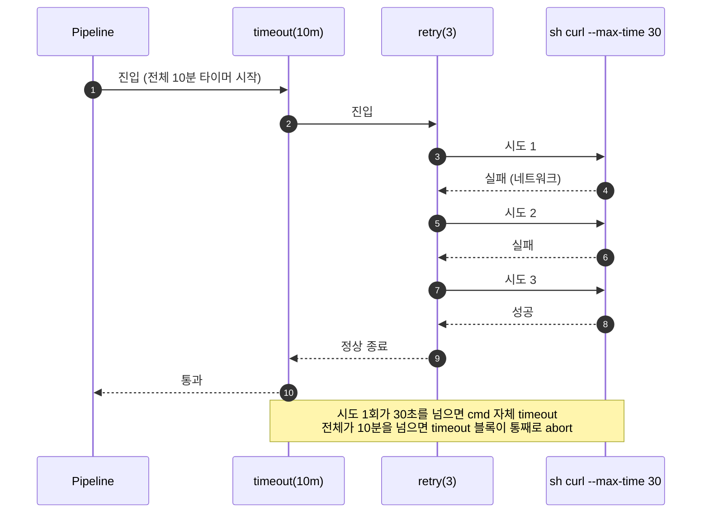
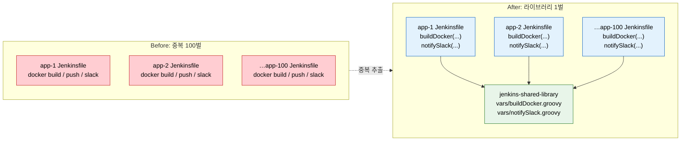

# Pipeline 제어와 Best Practices

---

> 실패 대응, 라이브러리 분리, 파이프라인 작성 원칙을 다룹니다.

## §학습 목표

> 이 문서를 읽고 나면 `retry` · `timeout` · `input` 세 블록이 각각 *어떤 실패 유형* 을 해결하는지 *구분* 할 수 있고, Shared Library 가 100개 마이크로서비스의 중복을 *어떻게 한 곳으로 모으는지* 설명할 수 있으며, Jenkinsfile Best Practices 중 *누락 시 가장 큰 운영 사고로 번지는 두 가지* (타임아웃·워크스페이스 정리) 를 *예측* 할 수 있습니다.

## §사전 지식

> 본 문서는 "재시도와 타임아웃의 조합", "외부 호출 게이트", "공통 코드 추출(라이브러리화)" 같은 일반 패턴을 Jenkins Pipeline 의 `retry`·`timeout`·`input`·Shared Library 단위로 좁혀 본 것입니다.

## retry, timeout, input

> 본 절은 세 제어 블록을 *어떤 실패 유형을 다루는가* 축으로 정리합니다. 핵심은 `retry` 는 *일시적 실패*, `timeout` 은 *무한 대기*, `input` 은 *사람 게이트* 라는 책임 분리입니다.

> 파이프라인 제어 블록 세 가지는 각각 다른 문제를 해결합니다.
>
> - `retry`는 일시적 실패를 재시도로 극복하고, `timeout`은 무한 대기를 차단하며, `input`은 자동화와 수동 검증의 접점을 만듭니다.

| 블록 | 위치 | 용도 | 주의점 |
|------|------|------|--------|
| `retry(n)` | `steps {}` 내부 | 일시적 네트워크 오류, 외부 서비스 불안정 재시도 | `timeout` 없이 쓰면 한 번 시도가 무한 대기 가능 |
| `timeout(time, unit)` | `steps {}` 또는 `stage {}` | 무한 대기 방지, 전체 실행 시간 상한 | 단위 기본값 없음, `unit` 명시 필수 |
| `input` | `stage {}` 레벨 권장 | 수동 승인, 배포 전 인간 검증 | `agent none` 없이 쓰면 에이전트 점유 |

`retry`와 `timeout`은 반드시 함께 사용해야 합니다. `retry(3)` 안에서 외부 API를 호출하는데 타임아웃이 없으면, 한 번의 시도가 무한히 걸릴 수 있어 retry가 의미 없어집니다. 안전한 조합은 전체 재시도에 상한을 두는 `timeout` 안에 `retry`를 넣는 것입니다.

```groovy
stages {
    stage('Deploy') {
        steps {
            // 왜 timeout 이 retry 를 감싸는가:
            // 한 시도의 무한 대기 + 재시도 누적을 막기 위해 전체 상한이 바깥에 있어야 함
            timeout(time: 10, unit: 'MINUTES') {
                retry(3) {
                    sh 'curl --max-time 30 -f http://deploy-api/deploy'  // 시도 자체에도 30초 cap
                }
            }
        }
    }
    stage('Production Approval') {
        agent none  // 왜 none 인가: input 대기 동안 Agent 슬롯을 풀어 다른 빌드를 안 막기 위함
        steps {
            timeout(time: 2, unit: 'HOURS') {
                input(
                    message: '프로덕션 배포를 승인하시겠습니까?',
                    ok: '배포 승인',
                    submitter: 'devops-team,tech-lead'
                )
            }
        }
    }
}
```

- `input` 스테이지에 `agent none`을 지정하는 이유는 대기 시간 동안 에이전트 슬롯을 점유하지 않기 위해서입니다.
- `agent none` 없이 `steps {}` 안에 `input`을 넣으면, 승인 대기 시간(수 시간이 될 수 있습니다) 동안 빌드 에이전트가 아무것도 하지 않으면서 다른 빌드를 블로킹합니다.

### retry + timeout 중첩 흐름

> *왜 timeout 이 바깥, retry 가 안쪽* 인가를 한 그림으로 정리합니다. 반대로 중첩하면 전체 상한이 사라집니다.



> 만약 `retry` 가 바깥, `timeout` 이 안쪽이면 각 시도마다 10분이 새로 시작되므로 *최악 30분 대기* 가 됩니다. 항상 *상한 → 재시도* 순으로 감쌉니다.


## Shared Library 개요

> 본 절은 100개 Jenkinsfile 의 중복을 *한 Git 저장소* 로 모으는 메커니즘을 다룹니다. 디렉토리 구조와 `@Library` 호출 규약이 핵심입니다.

> 마이크로서비스 100개가 각각 Jenkinsfile을 가지고 있다면, Docker 빌드 단계나 Slack 알림 코드가 100개 파일에 중복됩니다.
>
> - 하나를 수정하면 100개를 모두 업데이트해야 합니다. **Shared Library**는 이 중복을 해결하는 Jenkins의 공유 코드 메커니즘입니다.

Shared Library는 별도의 Git 저장소로 관리하며, 디렉토리 구조가 정해져 있습니다.

```
jenkins-shared-library/
├── vars/               # 전역 함수 (Jenkinsfile에서 직접 호출)
│   ├── buildDocker.groovy
│   └── notifySlack.groovy
├── src/                # 클래스 (vars보다 복잡한 로직)
│   └── com/example/
│       └── PipelineUtils.groovy
└── resources/          # 설정 파일, 스크립트 리소스
    └── deploy-template.sh
```

Jenkins 시스템 설정(Manage Jenkins → Configure System → Global Pipeline Libraries)에 저장소를 등록하면, Jenkinsfile에서 `@Library`로 불러올 수 있습니다.

```groovy
@Library('jenkins-shared-library') _

pipeline {
    agent any
    stages {
        stage('Build') {
            steps {
                // 왜 buildDocker(...) 한 줄로 되는가:
                // docker build → push → tag 의 공통 흐름이 vars/buildDocker.groovy 에 박혀 있음
                buildDocker(image: 'myapp', tag: BUILD_NUMBER)
            }
        }
    }
    post {
        failure {
            // 동일하게 알림 채널/메시지 포맷이 vars/notifySlack.groovy 에 박힘
            notifySlack(channel: '#alerts', result: 'FAILURE')
        }
    }
}
```

- Shared Library를 도입하면 개별 Jenkinsfile이 비즈니스 로직(무엇을 빌드하고 어디에 배포하는가)에만 집중할 수 있습니다. 공통 인프라 코드(어떻게 빌드하고 알리는가)는 라이브러리에서 한 번만 관리합니다. 상세 구현과 vars/ 작성법은 08 시리즈에서 다룹니다.

### 100개 Jenkinsfile 의 중복이 라이브러리로 모이는 그림

> 중복 패턴 → 추출 → 단일 책임 의 흐름을 한 다이어그램으로 정리합니다.



> 빨간색(Before) 은 *하나 고치면 100개를 고쳐야 하는 상태*, 초록색(라이브러리) 은 *한 곳만 고치면 100곳이 따라오는 상태* 입니다. 파란색(After Jenkinsfile) 은 비즈니스 로직만 남은 모습입니다.


## Docker with Pipeline 개요

> 본 절은 `agent { docker }` 가 *왜 재현성을 높이는가* 를 다룹니다. 핵심은 *Agent 머신에 도구 설치 책임을 안 지우는 것* 입니다.

> `agent { docker }` 패턴은 빌드 환경을 컨테이너로 격리합니다. Agent 머신에 Java, Node.js, Go 등을 직접 설치하지 않아도 되고, 빌드마다 다른 버전의 도구를 사용할 수 있습니다.

```groovy
pipeline {
    agent {
        docker {
            image 'maven:3.9-eclipse-temurin-17'
            // 왜 -v 캐시 마운트인가:
            // 매 빌드마다 의존성을 새로 받지 않고 호스트 .m2 디렉토리를 재사용해 시간 단축
            args '-v $HOME/.m2:/root/.m2'   // 의존성 캐시 마운트
        }
    }
    stages {
        stage('Build') {
            steps { sh 'mvn clean package' }
        }
    }
}
```

- 이 패턴의 핵심 이점은 재현성입니다. 팀원 모두가 동일한 이미지를 사용하므로 "내 로컬에서는 됐는데 CI에서는 안 된다"는 상황이 줄어듭니다.
- Docker in Docker 구성이나 멀티 컨테이너 Agent 패턴은 04 시리즈에서 상세히 다룹니다.


## Jenkinsfile Best Practices

> 본 절은 *반복되는 실수 패턴을 한 표로* 모은 체크리스트입니다. 그 중 *타임아웃 누락* 과 *워크스페이스 정리 누락* 두 가지가 누락 빈도와 운영 비용 모두 가장 큽니다.

기존 파이프라인 문서에 산재된 실수 패턴을 통합 정리합니다.

| Practice | Bad | Good |
|----------|-----|------|
| **시크릿 관리** | `PASSWORD = 'hardcoded123'` | `credentials('my-secret')` 사용 |
| **타임아웃** | `retry(3) { sh 'curl ...' }` | `timeout` 안에 `retry` 중첩 |
| **에이전트 점유** | `steps { input '승인?' }` | `agent none` + `input` 조합 |
| **병렬화** | 테스트 3종을 순차 실행 | 독립적인 테스트는 `parallel {}` |
| **스테이지 이름** | `stage('s1')` | `stage('Unit Test')` (의미 있는 이름) |
| **워크스페이스** | post 없이 종료 | `post { always { cleanWs() } }` |
| **빌드 보존** | 기본값 (무한 보존) | `buildDiscarder(logRotator(numToKeepStr: '10'))` |
| **동시 실행** | 같은 브랜치 빌드 중복 허용 | `disableConcurrentBuilds()` 설정 |
| **조건부 실행** | `if (env.BRANCH_NAME == 'main')` in steps | `when { branch 'main' }` 선언적 사용 |
| **변수 선언** | `steps {}` 안에서 `script {}` 남발 | `environment {}` 블록에서 선언 |

- 이 중 타임아웃과 워크스페이스 정리는 누락되기 가장 쉬우면서 영향이 큽니다.
- 타임아웃이 없으면 외부 서비스 응답 지연 시 빌드가 무기한 대기하고, 워크스페이스를 정리하지 않으면 에이전트 디스크가 가득 차서 갑작스럽게 빌드가 실패합니다.
- 새 Jenkinsfile을 작성할 때는 `options { timeout ... }` 과 `post { always { cleanWs() } }`를 먼저 선언하는 것을 습관으로 삼는 것이 좋습니다.

파이프라인이 길어질수록 `script {}` 블록이 늘어나는 경향이 있습니다. 같은 `script {}` 로직이 두 개 이상의 Jenkinsfile에 나타나기 시작하면 Shared Library로 추출할 타이밍입니다. Declarative Pipeline의 가독성을 유지하는 선에서 `script {}` 블록은 최소화합니다.

---

## 면접 질문

> 자기 답을 떠올린 뒤 `정답` 절을 펼쳐 비교합니다.

1. `retry` 와 `timeout` 의 중첩 순서가 *왜 timeout 이 바깥* 이어야 합니까? 반대로 중첩하면 어떤 사고가 납니까?
2. `input` 에 `agent none` 이 빠지면 *어느 자원이 새는지* 한 문장으로 답할 수 있습니까?
3. Shared Library 의 `vars/` 와 `src/` 는 어떤 기준으로 나눕니까?
4. Best Practices 표에서 *누락 빈도와 비용이 동시에 큰 두 가지* 가 무엇이며, 새 Jenkinsfile 시작 시 *먼저 박을 두 줄* 은 무엇입니까?

## 정답

### 정답 1 — retry·timeout 중첩 순서

`timeout` 이 바깥이어야 *전체 재시도 묶음에 단일 상한* 이 걸립니다. 반대로 `retry` 가 바깥이면 각 시도마다 새 timeout 이 시작되므로 `timeout(10m) × retry(3) = 최악 30분` 대기가 됩니다. 무한 대기를 막으려고 둔 timeout 이 *세 배로 늘어나는* 사고입니다.

### 정답 2 — input·agent none 자원 누수

**Agent Executor 슬롯** 이 샙니다. `input` 이 `steps {}` 안에 있으면 승인 대기 동안 해당 stage 가 잡은 Agent Executor 가 풀리지 않아 다른 빌드가 같은 Label 대기열에서 막힙니다. `agent none` 을 지정하면 승인은 Controller flyweight 에서 대기하고 Agent 슬롯은 즉시 풀립니다.

### 정답 3 — vars vs src 분리 기준

`vars/` 는 *Jenkinsfile 에서 함수처럼 직접 호출* 하는 전역 함수 (`buildDocker(image: 'x')`), `src/` 는 *클래스/객체로 묶을 만한 복잡한 로직* (재사용 헬퍼·도메인 모델). 단순 step 묶음은 `vars/`, 여러 함수가 공유하는 상태/타입이 필요하면 `src/` 로 갑니다.

### 정답 4 — 누락 빈도·비용이 큰 두 항목

**타임아웃 누락** 과 **워크스페이스 정리 누락** 입니다. 전자는 외부 서비스 지연 시 빌드를 무기한 대기시켜 Executor 슬롯을 뺏고, 후자는 Agent 디스크를 채워 *예고 없이* 다른 빌드를 깨뜨립니다. 새 Jenkinsfile 의 첫 두 줄은 `options { timeout(time: 30, unit: 'MINUTES') }` 와 `post { always { cleanWs() } }` 입니다.

## 관련 문서

> 실패 처리는 post 블록(02-02) 위에 서고, 셸 레벨 전파(02-05)·Executor 슬롯 누수(01-02)와 맞물리며, vars/src 기준은 공유 라이브러리 본편으로 이어집니다.

- [02-02. Declarative Pipeline 핵심 구조](02-02.Declarative%20Pipeline%20핵심%20구조.md) § "post 블록" — post 처리의 기반 구조
- [02-05. sh step 셸 실행 위생](02-05.sh%20step%20셸%20실행%20위생.md) § "set -euo pipefail" — 실패 전파를 셸 레벨에서 보강
- [01-02. 빌드 요청에서 실행까지](01-02.빌드%20요청에서%20실행까지.md) § "Executor 슬롯" — `input`/`agent none`(정답 2) 슬롯 누수
- [../05_operations/02-01. 공유 라이브러리](../05_operations/02-01.공유%20라이브러리.md) § "vars/src" — vars/src 분리 기준(정답 3) 본편
