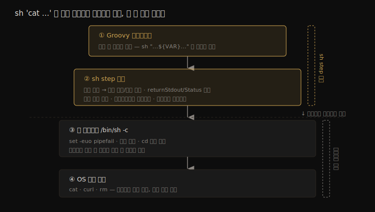
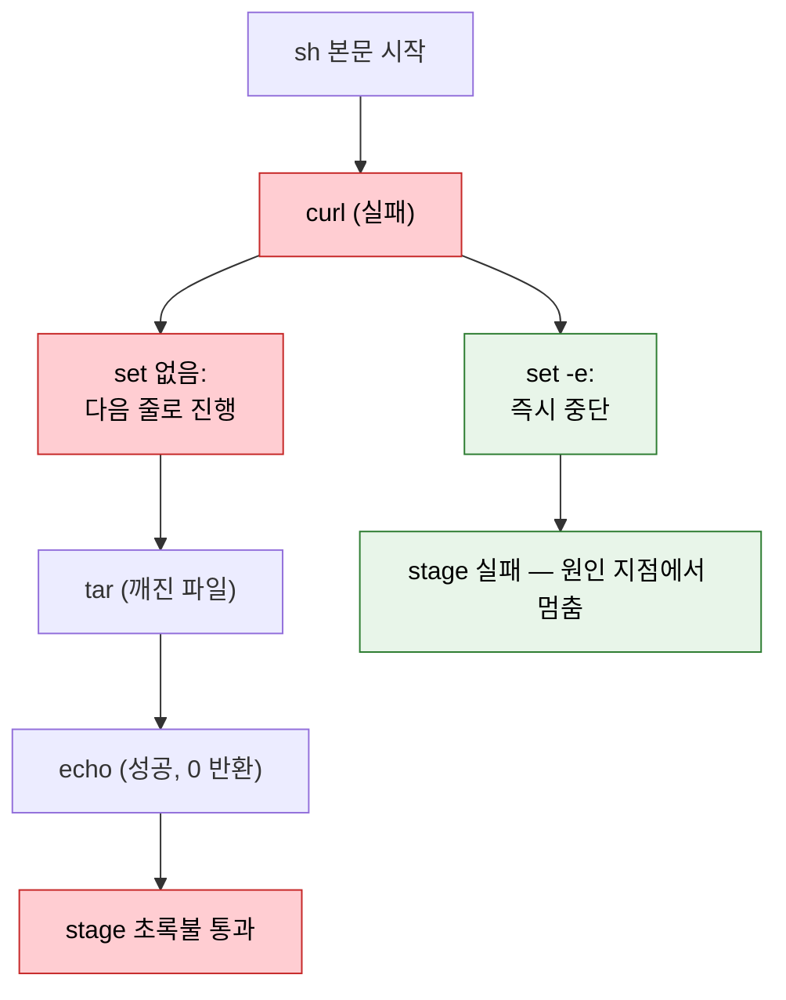
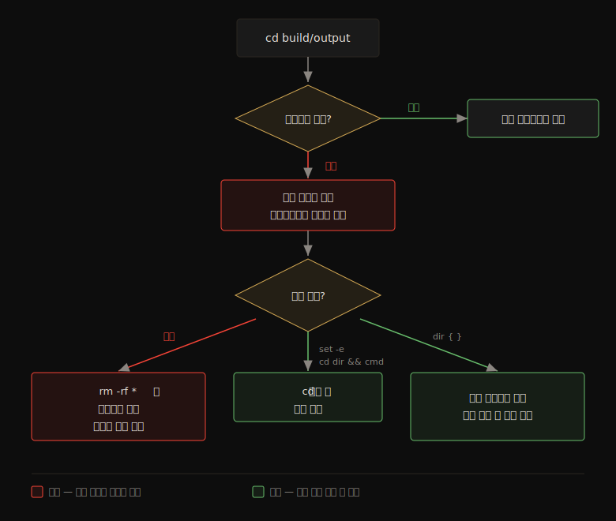
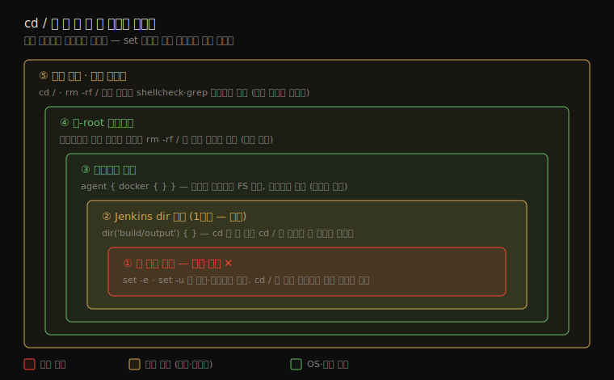
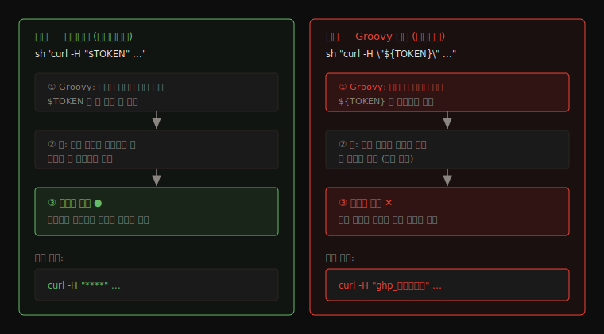

# sh step 셸 실행 위생

---

> Jenkins `sh` step 안에서 셸이 실패를 삼키거나 빈 변수를 위험하게 확장하는 함정과, 남이 짠 파이프라인의 sh 위험을 읽고 판단하는 체크포인트를 다룹니다.

## §학습 목표

> 이 문서를 읽고 나면 Jenkins `sh` 가 *기본적으로 어떤 실패를 조용히 넘기는지* 설명할 수 있고, `set -euo pipefail` 네 옵션이 각각 *어떤 함정을 막는지* 구분할 수 있으며, `returnStatus` 와 `returnStdout` 을 *언제 갈라 쓰는지*, 그리고 `rm -rf "$VAR/"` 나 `cd "$VAR"` 같은 한 줄이 *빈 변수이거나 이동에 실패했을 때 무엇을 지우고 어디서 도는지* 예측할 수 있습니다.


## §사전 지식

> 본 문서는 "셸 스크립트 실패 처리", "변수 확장 안전성", "종료 코드 전파" 같은 일반 셸 위생 개념을 Jenkins Pipeline 의 `sh` step 단위로 좁혀 본 것입니다. 파이프라인 레벨의 타임아웃·워크스페이스 정리는 [02-04 실패 대응과 파이프라인 원칙](./02-04.실패%20대응과%20파이프라인%20원칙.md) 에서 다루므로, 이 문서는 *sh 한 줄 안쪽* 에 집중합니다.


## 1. sh 는 기본적으로 실패를 삼키는 동작

> 본 절은 *왜 sh step 첫 줄에 `set -euo pipefail` 을 박아야 하는가* 를 다룹니다. 핵심은 Jenkins 가 sh 의 *마지막 명령 종료 코드만* 본다는 점입니다.

### sh step 은 순수 셸과 무엇이 다른가

`sh 'cat file.txt'` 는 터미널에서 직접 `cat file.txt` 를 치는 것과 *명령 레벨에선 동일* 합니다. 

- Jenkins 가 에이전트 머신에서 셸 프로세스를 띄우고 그 안에서 같은 OS 명령을 실행하므로, 같은 종료 코드를 냅니다. 
- 그래서 이 문서가 다루는 `set -euo pipefail`·빈 변수 확장·`cd` 실패 같은 *셸 위생* 이 그대로 적용됩니다. 차이는 *명령 바깥* 에 있습니다. `sh` step 은 단순 실행이 아니라 그 위에 여러 층을 두릅니다.



가장 안쪽 두 층(셸 프로세스·OS 명령)은 터미널과 같지만, 위 두 층이 `sh` step 고유의 동작입니다.

- **종료 코드를 빌드 판정에 연결한다** — 터미널의 `cat` 은 에러를 찍고 끝나지만, sh step 은 그 종료 코드를 받아 stage 를 초록불/빨간불로 판정합니다. 아래에서 볼 "마지막 명령 종료 코드만 본다" 는 규칙이 바로 이 층의 동작입니다.
- **값을 Groovy 로 돌려준다** — 터미널 출력은 화면에 흐르고 사라지지만, `returnStdout`·`returnStatus` 는 그 출력·종료 코드를 Groovy 변수로 캡처합니다 (2절).
- **실행 전에 Groovy 가 문자열을 가공한다** — `sh "...${VAR}..."` 는 셸이 보기 전에 Groovy 보간이 일어나 문자열이 완성됩니다. 순수 셸엔 없는 이 단계가 비밀값 마스킹 우회의 원인입니다 (4절).
- **로그·워크스페이스·에이전트 컨텍스트를 관리한다** — 출력을 콘솔 로그로 모으고, 워크스페이스 디렉토리에서 실행하며, `dir('build/output') { }` 가 경계를 아는 것도 이 층 덕분입니다 (3절).

그래서 셸 위생(안쪽 층)에 더해, sh step 고유의 주의점(바깥 층 — `returnStatus`/`Stdout`, Groovy 보간)이 따로 존재합니다. 이어지는 절들이 두 갈래를 차례로 다룹니다.

Jenkins `sh` step 은 셸 스크립트를 실행한 뒤 *마지막 명령의 종료 코드* 로 성공·실패를 판정합니다. 여러 줄을 한 sh 에 넣으면 중간 명령이 실패해도 마지막 줄만 성공하면 stage 가 초록불로 통과합니다. 빌드는 성공이라 표시되는데 실제로는 중간 단계가 깨진 *조용한 실패* 입니다.

```groovy
steps {
    // 왜 위험: download 가 실패해도 echo 가 0 을 반환하면 stage 는 성공 처리됨
    sh '''
        curl -o app.tar.gz http://artifacts/app.tar.gz
        tar xzf app.tar.gz
        echo "배포 준비 완료"
    '''
}
```

- 위 스크립트에서 `curl` 이 404 를 받아도, `tar` 가 깨진 파일에 실패해도, 마지막 `echo` 가 0 을 반환하므로 Jenkins 는 통과로 봅니다. 
- 깨진 산출물이 다음 stage 로 흘러가 *실패 지점에서 멀리 떨어진 곳* 에서 터집니다.

해결은 sh 본문 첫 줄에 `set -euo pipefail` 을 박는 것입니다. 네 옵션이 각각 다른 함정을 막습니다.

| 옵션 | 막는 함정 | 없으면 |
|------|----------|--------|
| `set -e` | 중간 명령 실패 시 즉시 중단 | 실패해도 다음 줄로 진행 |
| `set -u` | 미설정 변수 참조 시 에러 | 빈 문자열로 조용히 확장 |
| `set -o pipefail` | 파이프 중간 실패를 종료 코드에 반영 | 마지막 파이프 단계만 보고 성공 판정 |
| (`set -x`) | 디버깅용 명령 추적 — **운영 빌드엔 주의** | (4절에서 다룸) |

```groovy
steps {
    // 왜 첫 줄에 set: curl/tar 중 하나라도 실패하면 거기서 멈춰 echo 까지 못 감
    sh '''
        set -euo pipefail
        curl -fsSL -o app.tar.gz http://artifacts/app.tar.gz
        tar xzf app.tar.gz
        echo "배포 준비 완료"
    '''
}
```

- `curl` 에 `-f` 를 더한 이유도 같은 맥락입니다. `-f` 없는 curl 은 404 응답을 *받아서 본문을 저장* 하고 종료 코드 0 을 반환합니다. 
- HTTP 에러를 셸 실패로 바꾸려면 `-f` 가 필요합니다.

### sh 실패 전파 흐름

> *set 이 있을 때와 없을 때* 중간 실패가 어디서 멈추는지 한 그림으로 정리합니다.



> 빨간 경로(set 없음) 는 깨진 산출물을 다음 stage 로 흘려보내고, 초록 경로(set -e) 는 *실패한 그 줄* 에서 멈춰 원인 추적을 쉽게 만듭니다. 조용한 성공보다 *시끄러운 실패* 가 낫습니다.


## 2. 종료 코드를 직접 받아야 할 때

> 본 절은 sh 의 종료 코드와 출력을 *값으로 받는* `returnStatus` · `returnStdout` 을 다룹니다. 핵심은 *실패를 허용하고 분기할 것인가* vs *출력을 변수로 쓸 것인가* 의 구분입니다.

`set -e` 는 실패 시 무조건 중단하지만, 때로는 *실패를 정상 분기로 다루고 싶을* 때가 있습니다. 예를 들어 "이미지가 레지스트리에 있으면 건너뛰고 없으면 빌드한다" 같은 조건 분기입니다. 이때 `returnStatus: true` 로 종료 코드를 값으로 받습니다.

```groovy
steps {
    script {
        // 왜 returnStatus: 실패(비0)를 예외로 던지지 않고 분기 조건으로 쓰기 위함
        def exists = sh(script: 'docker manifest inspect myapp:1.0', returnStatus: true)
        if (exists != 0) {
            sh 'docker build -t myapp:1.0 .'
        } else {
            echo '이미지가 이미 존재하여 빌드를 건너뜁니다'
        }
    }
}
```

출력 문자열 자체가 필요하면 `returnStdout: true` 를 씁니다. 두 옵션의 책임은 다릅니다.

| 옵션 | 반환값 | 쓰는 상황 |
|------|--------|----------|
| (기본) | 없음, 실패 시 stage 중단 | 명령이 성공해야만 다음으로 진행 |
| `returnStatus: true` | 종료 코드 정수 | 실패를 분기 조건으로 다룸 |
| `returnStdout: true` | 표준출력 문자열 | 명령 결과를 변수로 사용 |

`returnStdout` 의 결과는 끝에 줄바꿈이 붙으므로 `.trim()` 으로 다듬는 습관이 안전합니다. 커밋 해시처럼 한 줄을 받을 때 줄바꿈이 따라붙어 태그 이름이 깨지는 사고가 흔합니다.

```groovy
// 왜 trim(): git rev-parse 출력 끝 줄바꿈이 이미지 태그에 섞여 들어가는 것을 막음
def commit = sh(script: 'git rev-parse --short HEAD', returnStdout: true).trim()
```

### sh 의 두 호출 형태 — `sh '...'` 와 `sh(script: ...)`

앞 예시들에서 `sh '''...'''` 와 `sh(script: ...)` 두 표기가 섞여 나오는데, 이는 서로 다른 명령이 아니라 **같은 `sh` step 의 두 호출 형태**입니다. 갈리는 기준은 하나입니다. 

- `sh '명령'` 은 Groovy 의 괄호 생략형입니다. Groovy 는 인자가 하나인 메서드 호출에서 괄호를 뺄 수 있으므로 `sh('명령')` 을 `sh '명령'` 으로 씁니다. 
- 삼중따옴표 `'''...'''` 는 여러 줄 문자열을 담는 Groovy 문법이라 여러 줄 셸 스크립트에 자연스럽습니다. 이 형태는 실행만 하고 결과는 안 받겠다는 뜻입니다.

반면 `returnStatus` 나 `returnStdout` 같은 옵션을 줄 때는 괄호를 생략할 수 없습니다. 

- sh step 에 `script:`·`returnStatus:`·`returnStdout:` 같은 named parameter 를 맵으로 넘기는 형태라, 이때는 `script:` 키를 명시해야 합니다.

| 표기 | 실제 의미 | 언제 |
|------|----------|------|
| `sh '명령'` / `sh '''여러 줄'''` | `sh('명령')` 괄호 생략형 | 실행만, 반환값 불필요 |
| `sh(script: '명령', returnStatus: true)` | named parameter 맵 전달 | `returnStatus`·`returnStdout` 등 옵션 필요 |

- 규칙은 단순합니다. 반환값(종료 코드·출력)을 받아야 하면 `sh(script: ...)` 형태를, 그냥 실행만 하면 `sh '...'` 를 씁니다. 
- 2절 앞에서 본 "기본 sh 는 값을 안 돌려주고 `returnStatus`·`returnStdout` 은 값을 받는다" 는 구분이 이 표기 차이로 드러나는 것입니다.

따옴표 종류도 취향 문제가 아닙니다. `sh "${VAR}"` 처럼 큰따옴표를 쓰면 4절에서 다룰 *Groovy 보간* 이 일어나 값이 sh 실행 전에 문자열로 박힙니다. 비밀값을 다룰 때는 작은따옴표 `sh '... $VAR'` 로 셸에 위임해야 마스킹이 보존됩니다.


## 3. 빈 변수·와일드카드·cd 가 만드는 위치 사고

> 본 절은 `rm -rf "$VAR/"` 와 `cd "$VAR"` 한 줄이 *변수가 비거나 이동에 실패했을 때 무엇을 지우고 어디로 가는가* 를 다룹니다. 핵심은 셸이 빈 변수를 *조용히 빈 문자열로* 확장하고, `cd` 실패를 *조용히 무시* 한다는 점입니다.

정리 단계에서 자주 쓰는 `rm -rf "$BUILD_DIR/"` 는 `BUILD_DIR` 가 비어 있으면 `rm -rf "/"` 가 됩니다. 셸은 미설정 변수를 에러가 아니라 *빈 문자열* 로 확장하기 때문입니다. 1절의 `set -u` 가 이 함정을 막는 첫 방어선입니다.

```groovy
steps {
    // 왜 위험: WORKSPACE_SUB 가 환경에서 빠지면 rm -rf / 로 변신
    sh 'rm -rf "$WORKSPACE_SUB/target"'
}
```


세 겹의 방어를 함께 둡니다. 

1. 첫째, `set -u` 로 미설정 변수를 에러로 만듭니다. 
2. 둘째, 변수를 항상 큰따옴표로 감싸 공백·와일드카드가 섞인 경로가 여러 인자로 쪼개지지 않게 합니다. 
3. 셋째, 가능하면 셸 `rm` 대신 Jenkins 가 워크스페이스 경계를 아는 `deleteDir()` 이나 `cleanWs()` 를 씁니다.

```groovy
steps {
    // 왜 deleteDir: 현재 워크스페이스 경계 안에서만 지워 / 파괴 위험이 원천 차단됨
    dir('target') {
        deleteDir()
    }
}
```

- 와일드카드도 같은 종류의 함정입니다. `rm -rf $DIR/*` 에서 `DIR` 가 비면 `rm -rf /*` 가 되고, 큰따옴표 없이 쓴 변수에 공백이 있으면 한 경로가 여러 인자로 쪼개집니다. 
- 셸 확장은 *변수 치환 → 단어 분리 → 와일드카드 전개* 순으로 일어나므로, 따옴표는 이 연쇄를 끊는 가장 단순한 도구입니다.

빈 변수는 삭제뿐 아니라 *이동* 에서도 사고를 냅니다. `cd "$BUILD_DIR"` 에서 `BUILD_DIR` 가 비면 `cd ""` 가 되는데, 같은 `set -u` 가 이 줄에서 멈춰 막습니다. 

그런데 `cd` 에는 변수 함정과 결이 다른 위험이 하나 더 있습니다. `cd` 가 *실패해도* 셸은 에러를 내고 끝나는 게 아니라 *원래 위치에 그대로 머뭅니다*. 그래서 `set -e` 없이 다음 줄을 실행하면 의도한 디렉토리가 아니라 직전 위치에서 명령이 도는 사고가 납니다.

```groovy
steps {
    // 왜 위험: cd 가 실패(디렉토리 없음)해도 셸은 멈추지 않고
    //          현재 위치(워크스페이스 루트 등)에서 rm 이 실행됨
    sh '''
        cd build/output
        rm -rf *
    '''
}
```

- `build/output` 이 없으면 `cd` 가 실패하고, 셸은 *워크스페이스 루트* 에 머문 채 `rm -rf *` 로 빌드 산출물 전체를 지웁니다. 
- 막는 방법은 두 가지입니다. 첫 줄에 `set -e` 를 박아 `cd` 실패 시 즉시 중단하거나, `cd dir && cmd` 처럼 *이동 성공을 조건으로* 다음 명령을 묶는 것입니다.

```groovy
steps {
    sh '''
        set -euo pipefail
        // 왜 &&: cd 가 성공해야만 rm 이 실행되도록 묶어 위치 이탈을 차단
        cd build/output && rm -rf *
    '''
}
```

- 다만 `cd /` 처럼 *리터럴 슬래시* 를 직접 쓴 경우는 셸 옵션으로 못 막습니다. 변수 미설정도 실패도 아닌 *정상적인 "루트로 가라"* 명령이라 셸 입장에서는 막을 근거가 없습니다.

 이건 위생 옵션이 아니라 코드 리뷰에서 잡을 의도 오류이고, 더 근본적인 답은 셸 `cd` 를 쓰지 않는 것입니다. Jenkins `dir('build/output') { }` 블록은 워크스페이스 경계 안에서만 작동하고 블록을 벗어나면 *원래 위치로 자동 복귀* 하므로, `cd` 로 길을 잃는 문제 자체가 구조적으로 사라집니다.

```groovy
steps {
    // 왜 dir 블록: 경계 안에서만 이동하고 블록 종료 시 자동 복귀 — cd 로 길 잃을 일이 없음
    dir('build/output') {
        sh 'rm -rf *'
    }
}
```

### cd 실패 시 위치 이탈 사고 흐름

`cd` 가 실패해도 셸은 멈추지 않고 *원래 위치에 머무는* 것이 사고의 핵심입니다. 아래 흐름은 같은 `cd build/output` 한 줄이 방어 장치 유무에 따라 어떻게 갈리는지 보여 줍니다.



> 리터럴 `cd /` 는 변수 미설정도 실패도 아닌 정상 명령이라 셸 옵션으로 막을 근거가 없습니다. 
>
> 근본 답은 `cd` 대신 `dir { }` 블록을 써서 길을 잃을 구조 자체를 없애는 것입니다.

### cd / 는 셸 밖 한 층 위에서 막는다

`set -euo pipefail` 이 다 켜져 있어도 `cd /` 를 막지 못하는 이유는 1절에서 본 그대로입니다. `set -e` 는 실패(비0)를, `set -u` 는 미설정 변수를 잡는데, `cd /` 는 *실패도 미설정도 아닌 정상 명령* 이라 두 옵션이 발동할 조건 자체가 없습니다. 

그렇다면 영영 못 막느냐 하면 그렇지 않습니다. 셸 *안* 에서 못 막을 뿐, 셸 밖 한 층 위로 올라가면 막을 수단이 생깁니다. 도커가 루트 파괴를 막는 방식이 바로 경계를 셸 밖에서 강제하는 것입니다.



바깥 층일수록 차단력이 강합니다. 가장 안쪽 셸 옵션은 `cd /` 를 못 막지만, 한 층씩 올라가며 다음 수단이 열립니다.

- **Jenkins `dir('build/output') { }`** — 3절에서 본 1순위 답입니다. `cd` 를 아예 안 쓰니 `cd /` 가 등장할 일 자체가 사라집니다. 차단보다 예방이 낫습니다.
- **컨테이너 격리 (`agent { docker { } }`)** — 빌드를 컨테이너에 가두면 `rm -rf /` 가 돌아도 컨테이너 파일시스템만 날아가고 호스트는 멀쩡합니다. 경계를 OS 레벨에서 강제하는 도커식 방식입니다.
- **비-root 에이전트** — 에이전트에 루트 권한이 없으면 `rm -rf /` 가 권한 거부로 막힙니다. 최소 권한 원칙의 적용입니다.
- **코드 리뷰·린트 게이트** — `cd /`·`rm -rf /` 같은 위험 패턴을 shellcheck 나 커스텀 grep 게이트로 CI 에서 차단합니다. "사람이 잡을 의도 오류" 를 기계가 잡도록 옮긴 것입니다.

운영 파이프라인이라면 컨테이너 격리와 비-root 실행은 과한 조치가 아니라 오히려 표준입니다. `cd /` 단일 패턴만 거르겠다면 린트 게이트가 가장 가볍습니다.


## 4. 남이 짠 파이프라인의 sh 를 읽을 때

> 본 절은 *직접 작성이 아니라 검토·연동* 관점에서 sh step 의 위험 신호를 빠르게 잡는 체크포인트를 다룹니다. 핵심은 *마스킹 우회* 와 *조용한 실패* 두 축입니다.

API 연동이나 코드 리뷰로 남이 작성한 Jenkinsfile 을 읽을 때, sh step 에서 먼저 확인할 신호가 있습니다. 직접 짜지 않더라도 이 신호를 읽으면 운영 사고를 미리 거를 수 있습니다.

- `set -x` 가 크레덴셜을 다루는 sh 에 켜져 있는가 — `set -x` 는 실행 명령을 로그에 그대로 찍으므로, 크레덴셜이 인자로 들어간 명령이 콘솔 로그에 노출됩니다. Jenkins 의 마스킹은 *환경변수 값* 은 가리지만 `set -x` 가 보여주는 *치환된 명령줄* 까지 항상 가리지는 못합니다.
- 크레덴셜이 `"$TOKEN"` 처럼 환경변수로 전달되는가, 아니면 Groovy 보간 `"${TOKEN}"` 으로 sh 문자열에 박혀 있는가 — 후자는 마스킹을 우회합니다. 이유는 [02-security/01-02 시크릿 관리](../02_security/01-02.시크릿%20관리와%20최소%20권한%20원칙.md) 에서 다룹니다.
- 여러 명령을 한 sh 에 묶으면서 `set -e` 가 없는가 — 1절의 조용한 실패가 숨어 있습니다.
- `curl | bash` 로 외부 스크립트를 받아 즉시 실행하는가 — 외부 서버가 침해되면 빌드마다 임의 코드가 실행됩니다. 받은 스크립트를 검증 없이 파이프로 셸에 넘기는 패턴은 공급망 공격의 입구입니다.

### Groovy 보간이 마스킹을 우회하는 이유

위 두 번째 신호(`"$TOKEN"` 환경변수 vs `"${TOKEN}"` Groovy 보간)가 *왜* 갈리는지는 1절에서 본 sh 의 층 구조로 설명됩니다. 핵심은 **토큰 문자열이 *언제* 완성되느냐** 입니다.



작은따옴표 `sh 'curl -H "$TOKEN" ...'` 는 Groovy 가 문자열을 그대로 셸에 넘기고, 셸이 *실행 시점에* 자기 환경에서 `$TOKEN` 을 풉니다. 토큰 값이 Groovy 단계를 거치지 않고 셸 안에만 머무르므로, Jenkins 마스킹이 그 환경변수 경로를 추적해 로그에서 `****` 로 가립니다.

반면 큰따옴표 `sh "curl -H \"${TOKEN}\" ..."` 는 Groovy 보간이 **sh 가 실행되기도 전에** 문자열을 완성합니다. 셸에 넘어가는 순간 이미 `curl -H "실제토큰값" ...` 으로 박제된 평문이라, 마스킹이 가릴 *변수 자체가 사라집니다*. 마스킹은 셸 환경변수를 기준으로 가리는데 토큰이 이미 평문 문자열에 녹아버렸으니 가릴 대상이 없는 것입니다. 그래서 로그·에러 메시지에 평문으로 샙니다.

정리하면, `"$TOKEN"` 은 셸이 실행 때 풀어 마스킹 경로에 남기고, `"${TOKEN}"` 은 Groovy 가 실행 *전에* 문자열로 박아넣어 마스킹이 가릴 대상을 없앱니다. 그래서 비밀값은 sh 문자열에 보간하지 말고 환경변수로 셸에 위임하는 것이 원칙입니다. 마스킹 동작과 빌드 로그 노출의 세부는 [02-security/01-02 시크릿 관리](../02_security/01-02.시크릿%20관리와%20최소%20권한%20원칙.md) 에서 다룹니다.

직접 작성할 때든 검토할 때든 기준은 하나입니다. sh 본문은 *실패를 시끄럽게 드러내고*, 변수는 *비어도 안전하게 확장되며*, 비밀값은 *로그에 새지 않아야* 합니다.


## 면접 질문

> 자기 답을 떠올린 뒤 `정답` 절을 펼쳐 비교합니다.

1. Jenkins `sh` 에 여러 줄을 넣고 중간 명령이 실패했는데 stage 가 초록불로 통과했습니다. *왜* 그런지, `set -euo pipefail` 중 *어느 옵션* 이 이걸 막는지 답할 수 있습니까?
2. `returnStatus: true` 와 `returnStdout: true` 는 각각 *언제* 쓰며, 기본 sh 와 무엇이 다릅니까?
3. `rm -rf "$BUILD_DIR/"` 가 위험한 한 줄인 이유와, 셸 대신 무엇을 쓰면 그 위험이 원천 차단되는지 설명할 수 있습니까?
3-1. `cd build/output` 이 실패했는데 다음 줄 `rm -rf *` 가 *엉뚱한 곳* 에서 도는 이유는 무엇이며, `set -e` 와 `&&` 가 각각 어떻게 막습니까? `cd /` 를 직접 쓴 경우는 *왜* 셸 옵션으로 못 막습니까?
4. 남이 짠 파이프라인의 sh 에서 *크레덴셜 노출 신호* 두 가지를 짚을 수 있습니까?


## 정답

### 정답 1 — set -euo pipefail 옵션

Jenkins 는 sh 의 *마지막 명령 종료 코드만* 보고 판정하기 때문입니다. 중간 `curl` 이 실패해도 마지막 `echo` 가 0 을 반환하면 stage 는 성공으로 표시됩니다. `set -e` 가 이걸 막습니다 — 중간 명령이 비0 으로 끝나면 거기서 즉시 중단해 실패를 그 줄에서 드러냅니다. 파이프(`a | b`) 중간 실패까지 잡으려면 `set -o pipefail` 도 함께 둡니다.

### 정답 2 — returnStatus·returnStdout

`returnStatus: true` 는 *종료 코드를 정수로* 받아 실패를 예외가 아니라 *분기 조건* 으로 다룰 때 씁니다 (예: 이미지 존재 여부로 빌드 건너뛰기). `returnStdout: true` 는 *표준출력 문자열* 을 받아 변수로 쓸 때 씁니다 (예: 커밋 해시를 태그로). 기본 sh 는 반환값이 없고 실패 시 stage 를 중단합니다. `returnStdout` 결과는 끝 줄바꿈이 붙으므로 `.trim()` 으로 다듬습니다.

### 정답 3 — rm -rf 위험과 원천 차단

셸은 미설정 변수를 에러가 아니라 *빈 문자열* 로 확장하므로, `BUILD_DIR` 가 비면 `rm -rf "/"` 가 됩니다. 세 겹으로 막습니다 — `set -u` 로 미설정 변수를 에러화, 큰따옴표로 단어 분리·와일드카드 전개 차단, 그리고 셸 `rm` 대신 워크스페이스 경계를 아는 `deleteDir()` / `cleanWs()` 사용. 마지막이 가장 강력합니다. Jenkins 가 *현재 워크스페이스 안* 으로 삭제 범위를 한정하므로 `/` 파괴가 구조적으로 불가능해집니다.

### 정답 3-1 — cd 실패와 경계 이탈

`cd` 는 실패해도 셸을 멈추지 않고 *원래 위치에 그대로 머뭅니다*. 그래서 `cd build/output` 이 실패하면 셸은 워크스페이스 루트에 남고, 다음 `rm -rf *` 가 거기서 돌아 빌드 산출물을 통째로 지웁니다. `set -e` 는 `cd` 가 비0 으로 끝나는 순간 중단해 다음 줄로 못 넘어가게 막고, `cd dir && cmd` 는 *이동 성공을 조건* 으로 명령을 묶어 실패 시 `cmd` 를 아예 실행하지 않습니다. 반면 `cd /` 를 직접 쓴 경우는 변수 미설정도 실패도 아닌 *정상적인 명령* 이라 셸이 막을 근거가 없습니다 — 이건 위생 옵션이 아니라 코드 리뷰로 잡을 의도 오류이고, 애초에 셸 `cd` 대신 Jenkins `dir() { }` 블록을 쓰면 경계 이탈 자체가 사라집니다.

### 정답 4 — 크레덴셜 노출 신호

하나는 **`set -x` 가 켜진 sh 에서 크레덴셜을 인자로 넘기는 명령** 입니다. `set -x` 는 치환된 명령줄을 로그에 찍어, Jenkins 환경변수 마스킹으로 가려지지 않는 경로로 비밀값이 노출됩니다. 다른 하나는 **Groovy 보간 `"${TOKEN}"` 으로 sh 문자열에 비밀값을 박는 패턴** 입니다. 환경변수 `"$TOKEN"` 으로 셸에 위임하면 마스킹이 보존되지만, Groovy 보간은 sh 실행 전에 문자열을 완성해버려 마스킹을 우회합니다.

## 관련 문서

> sh 셸 위생은 실패 격리(02-04)의 셸 레벨 보강이고, 크레덴셜 노출 신호는 environment credentials(02-02)·시크릿 마스킹(보안 01-02)과 직결됩니다.

- [02-04. 실패 대응과 파이프라인 원칙](02-04.실패%20대응과%20파이프라인%20원칙.md) § "실패 격리" — sh 실패 전파가 stage 판정에 미치는 영향
- [02-02. Declarative Pipeline 핵심 구조](02-02.Declarative%20Pipeline%20핵심%20구조.md) § "environment credentials" — 크레덴셜 노출(정답 4·set -x·Groovy 보간)
- [../02_security/01-02. 시크릿 관리와 최소 권한 원칙](../02_security/01-02.시크릿%20관리와%20최소%20권한%20원칙.md) § "빌드 로그 마스킹" — echo 디버깅·마스킹 우회와 직결
