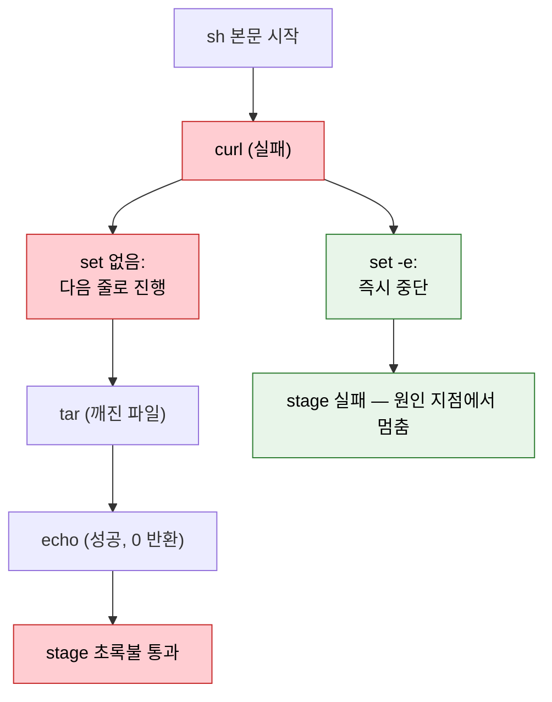

# sh step 셸 실행 위생

---

> Jenkins `sh` step 안에서 셸이 실패를 삼키거나 빈 변수를 위험하게 확장하는 함정과, 남이 짠 파이프라인의 sh 위험을 읽고 판단하는 체크포인트를 다룹니다.

## §학습 목표

> 이 문서를 읽고 나면 Jenkins `sh` 가 *기본적으로 어떤 실패를 조용히 넘기는지* 설명할 수 있고, `set -euo pipefail` 네 옵션이 각각 *어떤 함정을 막는지* 구분할 수 있으며, `returnStatus` 와 `returnStdout` 을 *언제 갈라 쓰는지*, 그리고 `rm -rf "$VAR/"` 같은 한 줄이 *빈 변수일 때 무엇을 지우는지* 예측할 수 있습니다.

## §사전 지식

> 본 문서는 "셸 스크립트 실패 처리", "변수 확장 안전성", "종료 코드 전파" 같은 일반 셸 위생 개념을 Jenkins Pipeline 의 `sh` step 단위로 좁혀 본 것입니다. 파이프라인 레벨의 타임아웃·워크스페이스 정리는 [02-04 실패 대응과 파이프라인 원칙](./02-04.실패%20대응과%20파이프라인%20원칙.md) 에서 다루므로, 이 문서는 *sh 한 줄 안쪽* 에 집중합니다.

## 1. sh 는 기본적으로 실패를 삼킨다

> 본 절은 *왜 sh step 첫 줄에 `set -euo pipefail` 을 박아야 하는가* 를 다룹니다. 핵심은 Jenkins 가 sh 의 *마지막 명령 종료 코드만* 본다는 점입니다.

Jenkins `sh` step 은 셸 스크립트를 실행한 뒤 *마지막 명령의 종료 코드* 로 성공·실패를 판정합니다. 여러 줄을 한 sh 에 넣으면 중간 명령이 실패해도 마지막 줄만 성공하면 stage 가 초록불로 통과합니다. 빌드는 성공이라 표시되는데 실제로는 중간 단계가 깨진 *조용한 실패* 입니다.

```groovy
steps {
    // 왜 위험: download 가 실패해도 echo 가 0 을 반환하면 stage 는 성공 처리됨
    sh '''
        curl -o app.tar.gz http://artifacts/app.tar.gz
        tar xzf app.tar.gz
        echo "배포 준비 완료"
    '''
}
```

위 스크립트에서 `curl` 이 404 를 받아도, `tar` 가 깨진 파일에 실패해도, 마지막 `echo` 가 0 을 반환하므로 Jenkins 는 통과로 봅니다. 깨진 산출물이 다음 stage 로 흘러가 *실패 지점에서 멀리 떨어진 곳* 에서 터집니다.

해결은 sh 본문 첫 줄에 `set -euo pipefail` 을 박는 것입니다. 네 옵션이 각각 다른 함정을 막습니다.

| 옵션 | 막는 함정 | 없으면 |
|------|----------|--------|
| `set -e` | 중간 명령 실패 시 즉시 중단 | 실패해도 다음 줄로 진행 |
| `set -u` | 미설정 변수 참조 시 에러 | 빈 문자열로 조용히 확장 |
| `set -o pipefail` | 파이프 중간 실패를 종료 코드에 반영 | 마지막 파이프 단계만 보고 성공 판정 |
| (`set -x`) | 디버깅용 명령 추적 — **운영 빌드엔 주의** | (4절에서 다룸) |

```groovy
steps {
    // 왜 첫 줄에 set: curl/tar 중 하나라도 실패하면 거기서 멈춰 echo 까지 못 감
    sh '''
        set -euo pipefail
        curl -fsSL -o app.tar.gz http://artifacts/app.tar.gz
        tar xzf app.tar.gz
        echo "배포 준비 완료"
    '''
}
```

`curl` 에 `-f` 를 더한 이유도 같은 맥락입니다. `-f` 없는 curl 은 404 응답을 *받아서 본문을 저장* 하고 종료 코드 0 을 반환합니다. HTTP 에러를 셸 실패로 바꾸려면 `-f` 가 필요합니다.

### sh 실패 전파 흐름

> *set 이 있을 때와 없을 때* 중간 실패가 어디서 멈추는지 한 그림으로 정리합니다.



> 빨간 경로(set 없음) 는 깨진 산출물을 다음 stage 로 흘려보내고, 초록 경로(set -e) 는 *실패한 그 줄* 에서 멈춰 원인 추적을 쉽게 만듭니다. 조용한 성공보다 *시끄러운 실패* 가 낫습니다.

## 2. 종료 코드를 직접 받아야 할 때

> 본 절은 sh 의 종료 코드와 출력을 *값으로 받는* `returnStatus` · `returnStdout` 을 다룹니다. 핵심은 *실패를 허용하고 분기할 것인가* vs *출력을 변수로 쓸 것인가* 의 구분입니다.

`set -e` 는 실패 시 무조건 중단하지만, 때로는 *실패를 정상 분기로 다루고 싶을* 때가 있습니다. 예를 들어 "이미지가 레지스트리에 있으면 건너뛰고 없으면 빌드한다" 같은 조건 분기입니다. 이때 `returnStatus: true` 로 종료 코드를 값으로 받습니다.

```groovy
steps {
    script {
        // 왜 returnStatus: 실패(비0)를 예외로 던지지 않고 분기 조건으로 쓰기 위함
        def exists = sh(script: 'docker manifest inspect myapp:1.0', returnStatus: true)
        if (exists != 0) {
            sh 'docker build -t myapp:1.0 .'
        } else {
            echo '이미지가 이미 존재하여 빌드를 건너뜁니다'
        }
    }
}
```

출력 문자열 자체가 필요하면 `returnStdout: true` 를 씁니다. 두 옵션의 책임은 다릅니다.

| 옵션 | 반환값 | 쓰는 상황 |
|------|--------|----------|
| (기본) | 없음, 실패 시 stage 중단 | 명령이 성공해야만 다음으로 진행 |
| `returnStatus: true` | 종료 코드 정수 | 실패를 분기 조건으로 다룸 |
| `returnStdout: true` | 표준출력 문자열 | 명령 결과를 변수로 사용 |

`returnStdout` 의 결과는 끝에 줄바꿈이 붙으므로 `.trim()` 으로 다듬는 습관이 안전합니다. 커밋 해시처럼 한 줄을 받을 때 줄바꿈이 따라붙어 태그 이름이 깨지는 사고가 흔합니다.

```groovy
// 왜 trim(): git rev-parse 출력 끝 줄바꿈이 이미지 태그에 섞여 들어가는 것을 막음
def commit = sh(script: 'git rev-parse --short HEAD', returnStdout: true).trim()
```

## 3. 빈 변수와 와일드카드가 만드는 파괴

> 본 절은 `rm -rf "$VAR/"` 한 줄이 *변수가 비었을 때 무엇을 지우는가* 를 다룹니다. 핵심은 셸이 빈 변수를 *조용히 빈 문자열로* 확장한다는 점입니다.

정리 단계에서 자주 쓰는 `rm -rf "$BUILD_DIR/"` 는 `BUILD_DIR` 가 비어 있으면 `rm -rf "/"` 가 됩니다. 셸은 미설정 변수를 에러가 아니라 *빈 문자열* 로 확장하기 때문입니다. 1절의 `set -u` 가 이 함정을 막는 첫 방어선입니다.

```groovy
steps {
    // 왜 위험: WORKSPACE_SUB 가 환경에서 빠지면 rm -rf / 로 변신
    sh 'rm -rf "$WORKSPACE_SUB/target"'
}
```

세 겹의 방어를 함께 둡니다. 첫째, `set -u` 로 미설정 변수를 에러로 만듭니다. 둘째, 변수를 항상 큰따옴표로 감싸 공백·와일드카드가 섞인 경로가 여러 인자로 쪼개지지 않게 합니다. 셋째, 가능하면 셸 `rm` 대신 Jenkins 가 워크스페이스 경계를 아는 `deleteDir()` 이나 `cleanWs()` 를 씁니다.

```groovy
steps {
    // 왜 deleteDir: 현재 워크스페이스 경계 안에서만 지워 / 파괴 위험이 원천 차단됨
    dir('target') {
        deleteDir()
    }
}
```

와일드카드도 같은 종류의 함정입니다. `rm -rf $DIR/*` 에서 `DIR` 가 비면 `rm -rf /*` 가 되고, 큰따옴표 없이 쓴 변수에 공백이 있으면 한 경로가 여러 인자로 쪼개집니다. 셸 확장은 *변수 치환 → 단어 분리 → 와일드카드 전개* 순으로 일어나므로, 따옴표는 이 연쇄를 끊는 가장 단순한 도구입니다.

## 4. 남이 짠 파이프라인의 sh 를 읽을 때

> 본 절은 *직접 작성이 아니라 검토·연동* 관점에서 sh step 의 위험 신호를 빠르게 잡는 체크포인트를 다룹니다. 핵심은 *마스킹 우회* 와 *조용한 실패* 두 축입니다.

API 연동이나 코드 리뷰로 남이 작성한 Jenkinsfile 을 읽을 때, sh step 에서 먼저 확인할 신호가 있습니다. 직접 짜지 않더라도 이 신호를 읽으면 운영 사고를 미리 거를 수 있습니다.

- `set -x` 가 크레덴셜을 다루는 sh 에 켜져 있는가 — `set -x` 는 실행 명령을 로그에 그대로 찍으므로, 크레덴셜이 인자로 들어간 명령이 콘솔 로그에 노출됩니다. Jenkins 의 마스킹은 *환경변수 값* 은 가리지만 `set -x` 가 보여주는 *치환된 명령줄* 까지 항상 가리지는 못합니다.
- 크레덴셜이 `"$TOKEN"` 처럼 환경변수로 전달되는가, 아니면 Groovy 보간 `"${TOKEN}"` 으로 sh 문자열에 박혀 있는가 — 후자는 마스킹을 우회합니다. 이유는 [02-security/01-02 시크릿 관리](../02_security/01-02.시크릿%20관리와%20최소%20권한%20원칙.md) 에서 다룹니다.
- 여러 명령을 한 sh 에 묶으면서 `set -e` 가 없는가 — 1절의 조용한 실패가 숨어 있습니다.
- `curl | bash` 로 외부 스크립트를 받아 즉시 실행하는가 — 외부 서버가 침해되면 빌드마다 임의 코드가 실행됩니다. 받은 스크립트를 검증 없이 파이프로 셸에 넘기는 패턴은 공급망 공격의 입구입니다.

직접 작성할 때든 검토할 때든 기준은 하나입니다. sh 본문은 *실패를 시끄럽게 드러내고*, 변수는 *비어도 안전하게 확장되며*, 비밀값은 *로그에 새지 않아야* 합니다.

---

## §면접 질문

> 자기 답을 떠올린 뒤 `§정답` 절을 펼쳐 비교합니다.

1. Jenkins `sh` 에 여러 줄을 넣고 중간 명령이 실패했는데 stage 가 초록불로 통과했습니다. *왜* 그런지, `set -euo pipefail` 중 *어느 옵션* 이 이걸 막는지 답할 수 있습니까?
2. `returnStatus: true` 와 `returnStdout: true` 는 각각 *언제* 쓰며, 기본 sh 와 무엇이 다릅니까?
3. `rm -rf "$BUILD_DIR/"` 가 위험한 한 줄인 이유와, 셸 대신 무엇을 쓰면 그 위험이 원천 차단되는지 설명할 수 있습니까?
4. 남이 짠 파이프라인의 sh 에서 *크레덴셜 노출 신호* 두 가지를 짚을 수 있습니까?

## §정답

### Q1 정답

Jenkins 는 sh 의 *마지막 명령 종료 코드만* 보고 판정하기 때문입니다. 중간 `curl` 이 실패해도 마지막 `echo` 가 0 을 반환하면 stage 는 성공으로 표시됩니다. `set -e` 가 이걸 막습니다 — 중간 명령이 비0 으로 끝나면 거기서 즉시 중단해 실패를 그 줄에서 드러냅니다. 파이프(`a | b`) 중간 실패까지 잡으려면 `set -o pipefail` 도 함께 둡니다.

### Q2 정답

`returnStatus: true` 는 *종료 코드를 정수로* 받아 실패를 예외가 아니라 *분기 조건* 으로 다룰 때 씁니다 (예: 이미지 존재 여부로 빌드 건너뛰기). `returnStdout: true` 는 *표준출력 문자열* 을 받아 변수로 쓸 때 씁니다 (예: 커밋 해시를 태그로). 기본 sh 는 반환값이 없고 실패 시 stage 를 중단합니다. `returnStdout` 결과는 끝 줄바꿈이 붙으므로 `.trim()` 으로 다듬습니다.

### Q3 정답

셸은 미설정 변수를 에러가 아니라 *빈 문자열* 로 확장하므로, `BUILD_DIR` 가 비면 `rm -rf "/"` 가 됩니다. 세 겹으로 막습니다 — `set -u` 로 미설정 변수를 에러화, 큰따옴표로 단어 분리·와일드카드 전개 차단, 그리고 셸 `rm` 대신 워크스페이스 경계를 아는 `deleteDir()` / `cleanWs()` 사용. 마지막이 가장 강력합니다. Jenkins 가 *현재 워크스페이스 안* 으로 삭제 범위를 한정하므로 `/` 파괴가 구조적으로 불가능해집니다.

### Q4 정답

하나는 **`set -x` 가 켜진 sh 에서 크레덴셜을 인자로 넘기는 명령** 입니다. `set -x` 는 치환된 명령줄을 로그에 찍어, Jenkins 환경변수 마스킹으로 가려지지 않는 경로로 비밀값이 노출됩니다. 다른 하나는 **Groovy 보간 `"${TOKEN}"` 으로 sh 문자열에 비밀값을 박는 패턴** 입니다. 환경변수 `"$TOKEN"` 으로 셸에 위임하면 마스킹이 보존되지만, Groovy 보간은 sh 실행 전에 문자열을 완성해버려 마스킹을 우회합니다.
