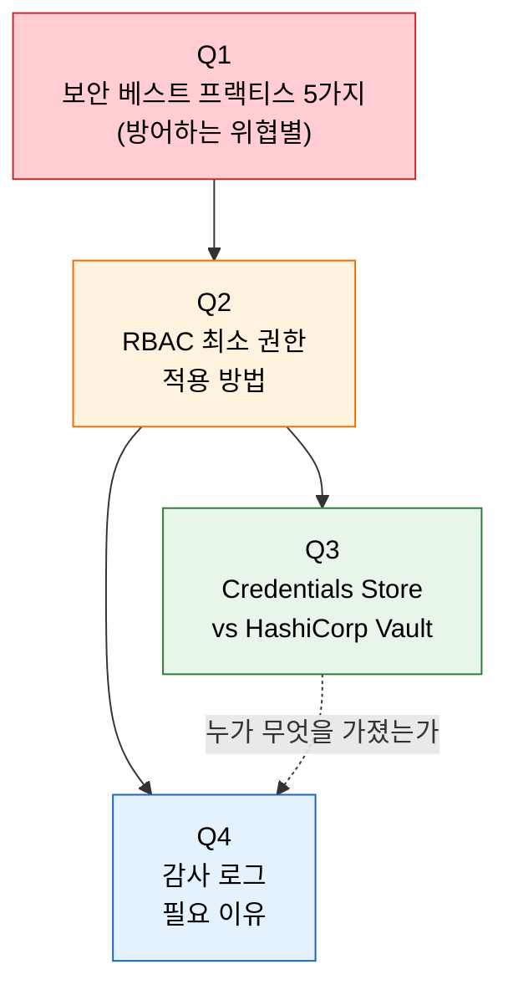
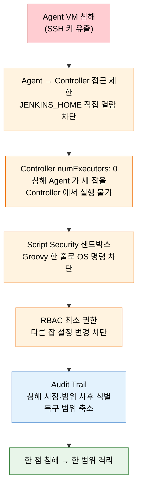

# 3단계 점검 — 보안 핵심 질문

---

> 다루는 문서: `01-01.인증과 인가 — 누가 무엇을 할 수 있는가`, `01-02.시크릿 관리와 최소 권한 원칙`
> 본 점검은 질문만 모아 둡니다. 답을 떠올린 뒤 문서 맨 아래 `§정답` 절을 펼쳐 자기 답과 비교합니다.

## §학습 목표

> 이 질문들에 막힘 없이 답할 수 있으면 보안 단계 본편 학습이 끝난 것으로 봅니다. 막힌 질문은 본문 해당 절로 돌아가 다시 읽고 다음 회차 복습으로 가져갑니다.

## §사전 지식

> 본 점검은 "심층 방어(Defense in Depth)", "RBAC 의 3계층(전역·프로젝트·노드)", "시크릿 외부화와 동적 시크릿", "감사 로그(Audit Trail) 의 컴플라이언스 역할" 같은 일반 보안 개념을 Jenkins 의 Matrix/Role Strategy, Credentials Store/Vault, Audit Trail Plugin 단위로 좁혀 본 형태입니다.

## §질문 흐름 한눈에

> 빨간색은 *전반 보안 자세*, 주황색은 *권한 모델*, 초록색은 *시크릿 저장소 선택*, 파란색은 *사후 감사* 축입니다. Q2(RBAC) 가 Q3(시크릿)·Q4(감사) 와 함께 묶여야 *접근 통제 → 권한 사용 → 사후 검증* 의 한 흐름이 완성됩니다.

## §방어 심층 — 한 점 침해를 한 범위로 격리

Q1 심화의 핵심은 *왜 다섯 가지를 겹쳐 두는가* 입니다. Agent VM 한 대가 SSH 키 유출로 침해됐다고 가정하면, 각 계층이 피해를 한 단계 안에 가둡니다. 한 레이어만 있었다면 침해가 곧 전체 장악이지만, 다섯 계층이 겹치면 *한 점 → 한 범위* 로 격리됩니다.

> 각 계층은 *방어하는 위협* 이 다릅니다. 한 줄로 모두 막는 단일 통제는 없고, 겹친 통제가 *침해의 전파 경로* 를 한 칸씩 끊습니다.

---

## §면접 질문

> 각 질문에 먼저 스스로 답한 뒤, 아래 §정답 절과 대조합니다. 심화는 한 단계 더 들어간 후속 질문입니다.

## Q1: Jenkins 보안 베스트 프랙티스 5가지는?

> 답은 §정답 절을 참조합니다.

### 심화

심층 방어(Defense in Depth) 관점에서 보안 레이어 중 하나가 뚫렸을 때 나머지 레이어가 어떻게 피해를 제한합니까? 시나리오를 들어 설명할 수 있습니까?

## Q2: Jenkins RBAC 구현에서 최소 권한 원칙을 어떻게 적용합니까?

> 답은 §정답 절을 참조합니다.

### 심화

개발자가 Jenkinsfile에서 `sh 'curl http://internal-api/admin'` 같은 명령을 실행하면 RBAC만으로 방어할 수 있습니까? 추가로 필요한 보안 조치는 무엇입니까?

## Q3: Jenkins Credentials Store와 HashiCorp Vault 중 무엇을 선택합니까?

> 답은 §정답 절을 참조합니다.

### 심화

Jenkins Credentials Store의 마스터 키(`$JENKINS_HOME/secrets/`)가 유출되면 어떤 일이 발생하며, 이를 방지하기 위한 조치는 무엇입니까?

## Q4: Jenkins 감사 로그(Audit Trail)가 필요한 이유는?

> 답은 §정답 절을 참조합니다.

### 심화

감사 로그의 무결성(Integrity)을 보장하기 위해 어떤 조치를 취할 수 있습니까?

---

## §정답

> 자기 답을 떠올린 뒤에만 이 절을 펼쳐 봅니다. 먼저 읽으면 active recall 효과가 사라집니다.

### Q1 정답

각 항목이 *방어하는 위협* 이 다릅니다:

| 조치 | 방어하는 위협 |
|------|-------------|
| Controller에서 빌드 실행 금지(`numExecutors: 0`) | 악의적 Jenkinsfile이 `$JENKINS_HOME/secrets/`를 읽거나 다른 Job의 크레덴셜 탈취 |
| Agent → Controller 접근 제한 | Agent 침해 시 Controller까지 공격이 확산(lateral movement) |
| CSRF Protection 활성화 | 인증된 관리자 세션을 이용한 외부 위조 요청 |
| Script Security Plugin 샌드박스 | Groovy 스크립트가 OS 명령 실행이나 파일시스템 접근으로 서버 탈취 |
| 정기적 플러그인 업데이트 | 알려진 CVE를 통한 진입 (Jenkins 보안 취약점의 대부분은 플러그인에서 발생) |

### Q1 심화 정답

한 레이어가 뚫려도 나머지가 *피해 범위를 한 단계 안에서 가둡니다*. 예시 시나리오 — Agent VM 한 대가 SSH 키 유출로 침해됐다고 가정합니다. (a) **Agent → Controller 접근 제한** 이 있으면 Agent 가 `JENKINS_HOME` 을 직접 못 봅니다. (b) **Controller `numExecutors: 0`** 이라면 침해된 Agent 가 새 잡을 Controller 위에서 실행시킬 수 없습니다. (c) **Script Security 샌드박스** 가 있으면 Groovy 한 줄로 OS 명령을 못 깁니다. (d) **RBAC** 가 좁으면 침해된 사용자가 다른 잡 설정을 못 바꿉니다. (e) **감사 로그** 로 침해 시점·범위를 사후에 정확히 짚을 수 있어 *복구 범위를 좁힙니다*. 한 레이어만 있었다면 침해가 곧 전체 장악이지만, 5계층이 겹치면 *한 점 → 한 범위* 로 격리됩니다.

### Q2 정답

- **Matrix-based Security**: 사용자별로 개별 권한 부여. 사용자가 50명을 넘으면 관리가 비현실적입니다.
- **Role Strategy Plugin**: Global Roles, Project Roles, Agent Roles의 3계층으로 역할을 정의합니다.
  - Project Roles에서 `frontend-.*` 같은 정규식을 사용하면 네이밍 규칙만 지키면 새 프로젝트에 자동으로 권한이 적용됩니다.
- **최소 권한**: 개발자에게는 `Job/Build`와 `Job/Read`만 부여하고 `Job/Configure`는 부여하지 않습니다.
- **JCasC 연동**: RBAC 설정을 YAML 파일로 관리하면 Git을 통한 변경 추적과 코드 리뷰가 가능해 "누가 권한을 바꿨는지"를 항상 확인할 수 있습니다.

### Q2 심화 정답

RBAC 만으로는 *부족합니다*. RBAC 는 *Jenkins UI/API 권한* 만 통제할 뿐, 잡이 한 번 실행되면 그 안의 `sh` 는 Agent 셸 전체를 다 부릅니다. 추가 조치는 (a) **Script Security Plugin 샌드박스** — Groovy 스크립트에 화이트리스트 기반 메서드 제한, (b) **Agent 네트워크 분리** — 내부망 API(`internal-api`) 에 Agent 가 직접 접근 못 하게 방화벽·NetworkPolicy 로 차단, (c) **Credentials 범위 제한** — Job/Folder 단위로 크레덴셜 가시성 묶어 *Job 이 못 보는 비밀* 을 늘림. 세 가지가 함께 작동해야 RBAC 위로 새는 권한이 좁혀집니다.

### Q3 정답

| 구분 | Jenkins Credentials Store | HashiCorp Vault |
|------|--------------------------|-----------------|
| 저장 방식 | Controller 디스크에 AES-128 암호화 | 중앙화된 별도 인프라 |
| 설정 난이도 | 간단, 별도 인프라 불필요 | 별도 구축 필요 |
| 시크릿 공유 | Jenkins에 종속, 다른 시스템과 공유 어려움 | 모든 시스템이 동일한 저장소에서 가져감 |
| 순환 | 수동 순환 필요 | 동적 시크릿으로 TTL 만료 시 자동 폐기 |

Vault 도입을 검토해야 하는 시점:

- 시크릿을 관리하는 시스템이 3개 이상일 때
- 순환 주기를 90일 이하로 유지해야 할 때
- SOC2/ISO 27001 감사에서 접근 로그를 요구할 때

### Q3 심화 정답

`$JENKINS_HOME/secrets/master.key` 와 `hudson.util.Secret` 이 유출되면 *Controller 의 모든 크레덴셜이 평문 복호화 가능* 해집니다. `credentials.xml` 의 암호화된 값은 이 두 키로 한 번에 풀리므로 *전체 시크릿 노출* 입니다. 방지 조치는 (a) **파일시스템 권한** — `secrets/` 를 jenkins 사용자만 read 가능하게(600), (b) **OS 단 디스크 암호화** — LUKS/dm-crypt 로 마운트 단계에서 차단, (c) **백업 분리 저장** — `secrets/` 백업은 `jobs/` 와 다른 위치 + 추가 암호화 키로 봉인, (d) **장기적으로 Vault 이전** — 마스터 키 자체를 없애고 외부 시크릿 저장소로 가져가는 게 근본 해결.

### Q4 정답

감사 로그가 없으면 "어제 저녁에 누군가 설정을 바꿨는데 오늘 빌드가 다 깨진다"는 상황에서 모든 팀원에게 물어봐야 합니다. 감사 로그가 있으면 "19:32에 user-A가 JDK 경로를 변경했다"는 사실을 즉시 확인할 수 있습니다.

- **컴플라이언스**: SOC2, ISO 27001, GDPR은 Traceability(누가, 언제, 무엇을 했는지)를 요구합니다. 감사 로그 없이는 컴플라이언스 감사에서 지적 사항이 됩니다.
- **RBAC와 결합**: RBAC로 "누가 무엇을 할 수 있는지"를 제어하고, Audit Trail로 "누가 실제로 무엇을 했는지"를 기록하면 권한 남용을 사후에 감지하고 RBAC 정책의 적절성을 검증할 수 있습니다.

### Q4 심화 정답

무결성 보장 조치는 *기록 자체가 위조·삭제되지 않도록* 하는 데 모입니다. (a) **외부 시스템으로 즉시 전송** — Audit Trail Plugin 의 출력을 syslog/rsyslog 로 외부 SIEM(Splunk/ELK) 에 실시간 전달하여 Jenkins 가 침해돼도 외부 사본이 살아 있게 함. (b) **append-only 저장소** — S3 Object Lock, WORM 스토리지처럼 *쓰기 후 변경 불가* 모드. (c) **시간 동기화 + 서명** — NTP 로 타임스탬프 일치 보장 + 로그 라인 hash chain 으로 사후 위조 탐지. (d) **권한 분리** — Jenkins 관리자도 외부 SIEM 로그는 못 지우게 *역할 분리* 적용. 네 조치가 함께 작동해야 "공격자가 로그를 지우고 흔적을 없애는" 시나리오가 막힙니다.
