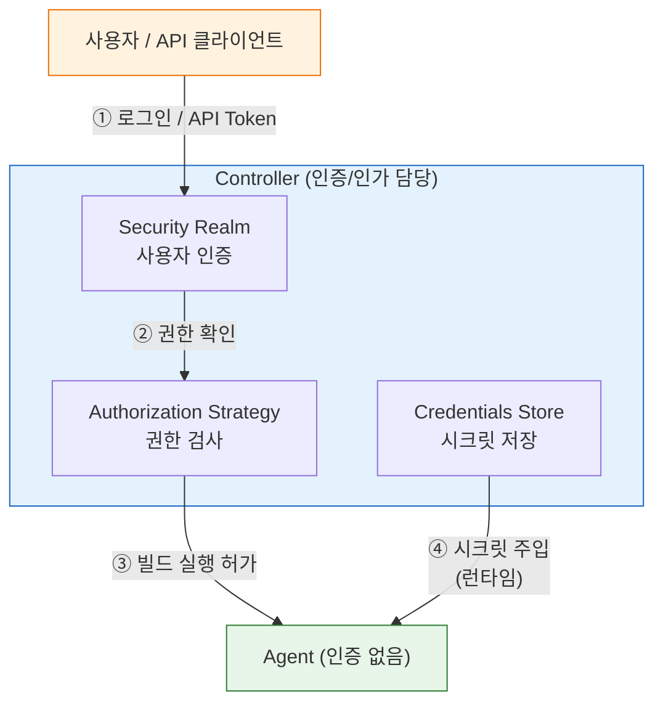
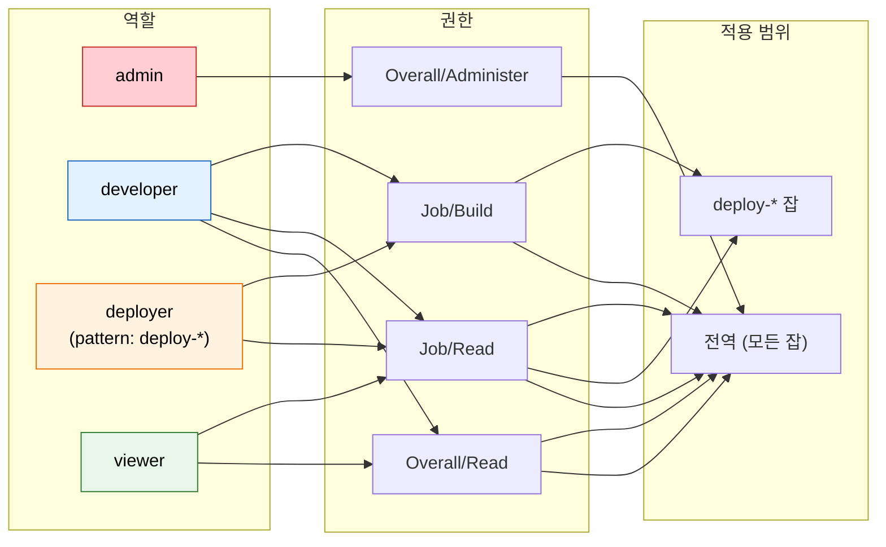

# 인증과 인가 — 누가 무엇을 할 수 있는가

---

> Jenkins를 API와 배포에 쓰는 순간, 보안은 선택이 아니라 바닥입니다. Jenkins 보안 모델은 두 축으로 작동합니다.
>
> 1. **Security Realm**이 "누가 로그인하는가"를 결정합니다.
> 2. **Authorization Strategy**가 "로그인한 사람이 무엇을 할 수 있는가"를 제어합니다.

## §학습 목표

> 이 문서를 읽고 나면 Security Realm 4종(Jenkins DB / LDAP / AD / SAML) 을 *조직 규모와 기존 디렉터리 인프라* 축에서 *선택* 할 수 있고, Authorization Strategy 5종을 *세분화 수준과 운영 위험* 으로 *비교* 할 수 있으며, API Token 과 crumb 의 *자동화 적합도 차이* 를 *설명* 할 수 있습니다.

## §사전 지식

> 본 문서는 "인증(누구) vs 인가(무엇을)", "최소 권한 원칙", "토큰 기반 stateless 인증", "CSRF 방어" 같은 일반 보안 개념을 Jenkins 의 Security Realm·Authorization Strategy·API Token·crumb 단위로 좁혀 본 것입니다.

## 1. Security Realm (인증)

> 본 절은 Security Realm 4종의 *적합 환경 차이* 와 *Controller 단일 책임* 모델을 다룹니다. Agent 가 인증을 안 갖는다는 사실이 운영 정책의 기준점입니다.

> Security Realm은 Jenkins에 로그인하는 사용자를 어디서 확인할지를 결정하는 설정입니다.
>
> - Jenkins 자체 데이터베이스에 계정을 저장할 수도 있고, 조직 디렉터리(LDAP, Active Directory)나 SSO(SAML, OIDC)와 연동할 수도 있습니다.

| Security Realm | 특징 | 적합한 환경 |
|---|---|---|
| Jenkins 자체 DB | 계정을 Jenkins 내부에 저장 | 소규모 팀, 빠른 구축 |
| LDAP | 조직 디렉터리 서버 연동 | 사내 인프라가 있는 중대형 팀 |
| Active Directory | 윈도우 도메인 계정 연동 | Windows 중심 엔터프라이즈 |
| SAML 2.0 | SSO 통합 | Okta, Google Workspace 등 IDP 운영 조직 |

- 실무에서 Jenkins 자체 DB는 테스트 환경에는 괜찮지만, 운영 환경에서는 계정 관리가 Jenkins에 종속된다는 단점이 있습니다.
- 이미 LDAP나 Active Directory를 운영하는 조직이라면 연동이 자연스럽고, 계정 생애 주기를 Jenkins와 분리할 수 있어 보안 관리가 훨씬 수월해집니다.

현재 Jenkins에 설정된 Security Realm을 확인하는 방법은 다음과 같습니다:

> 실습 환경 설정은 `05-00. 젠킨스 API 실습 환경 설정` 참조

```bash
# 왜 tree= : useSecurity 와 securityRealm._class 만 받아 응답 가볍게 유지
curl -sSf -u "${JENKINS_USER}:${JENKINS_PASS}" \
  "${JENKINS_URL}/api/json?tree=useSecurity,securityRealm[_class]"
```

- `securityRealm._class`가 `HudsonPrivateSecurityRealm`이면 Jenkins 자체 DB를 사용하는 상태입니다.
- `LDAPSecurityRealm`이면 LDAP 연동 중입니다.

### Controller와 Agent의 인증은 별개인가?

Jenkins의 인증/인가 체계는 **Controller에만 존재**합니다. Agent는 독립적인 인증 시스템을 갖지 않습니다.



- 사용자가 빌드를 트리거하면 Controller가 인증/인가를 검사합니다.
- Agent는 Controller가 "이 빌드를 실행해라"고 지시하면 그대로 수행할 뿐, 누가 요청했는지 검증하지 않습니다.
- Agent와 Controller 사이의 통신은 JNLP/SSH 채널로 보호되지만, 이것은 사용자 인증이 아니라 노드 간 통신 보안입니다.
- 결론: 인증/인가 정책을 바꾸려면 Controller 설정만 변경하면 됩니다. Agent는 영향을 받지 않습니다.


## 2. Authorization Strategy (인가)

> 본 절은 Authorization Strategy 5종의 *세분화 수준* 과 *운영 위험* 의 trade-off 를 다룹니다. 결론은 *중대형은 Role-Based Strategy Plugin* 입니다.

> Authorization Strategy는 로그인에 성공한 사용자가 Jenkins에서 무엇을 할 수 있는지를 결정합니다.
>
> - Security Realm이 문 앞 경비원이라면, Authorization Strategy는 내부 구역별 출입 카드입니다.

| 전략 | 세분화 수준 | 적합한 규모 | 운영 위험 |
|---|---|---|---|
| Anyone can do anything | 없음 | 격리된 테스트 전용 | 치명적 |
| Logged-in users can do anything | 없음 | 소규모 신뢰 팀 | 높음 |
| Matrix-based security | 글로벌 권한 | 소~중규모 | 낮음 |
| Project-based Matrix | 잡(Job) 단위 | 중규모 | 낮음 |
| Role-Based Strategy Plugin | 역할 기반 | 중~대규모 | 낮음 |

- "Anyone can do anything"은 이름 그대로 모든 사람이 모든 것을 할 수 있습니다. 격리된 로컬 환경 외에는 절대 사용해서는 안 됩니다.
- 외부에서 Jenkins URL에 접근 가능한 상태에서 이 설정을 켜두면, 인증 없이도 빌드 실행·크레덴셜 조회·스크립트 실행이 가능해집니다.
- 운영 환경에서는 **Role-Based Strategy Plugin**이 가장 현실적인 선택입니다. 역할을 미리 정의하고 사용자 또는 그룹에 역할을 부여하는 방식으로, 세분화 수준과 관리 편의성 모두 뛰어납니다.


## 3. Access Control 실전 설정

> 본 절은 최소 권한 원칙을 Jenkins 역할 4종(admin / developer / deployer / viewer) 으로 구현하는 패턴을 다룹니다. *관리자 토큰 하나로 모든 호출* 패턴이 가장 흔한 실무 안티패턴입니다.

> 최소 권한 원칙(Least Privilege)은 각 주체가 자신의 업무에 필요한 최소한의 권한만 갖도록 설계하는 것입니다.
>
> - Jenkins에서는 역할을 기능 단위로 나누고, 각 역할이 접근 가능한 범위를 명확히 제한하는 방식으로 구현합니다.

실전에서 자주 쓰이는 역할 구성 예시는 다음과 같습니다:

| 역할 | 대상 | 허용 범위 |
|---|---|---|
| admin | 인프라 팀 | 전체 관리 권한 |
| developer | 개발자 | 잡 읽기, 빌드 실행 |
| deployer | 배포 자동화 계정 | 특정 잡 빌드 실행, 파라미터 주입 |
| viewer | 모니터링, 감사 | 읽기 전용 |

- "관리자 토큰 하나로 모든 API를 호출"하는 패턴은 편리하지만 위험합니다. 토큰이 유출되면 Jenkins 전체를 탈취당하는 것과 같습니다.
- 대신 `deployer` 역할처럼 목적에 맞는 계정을 별도로 만들고, 필요한 잡과 작업에만 권한을 부여해야 합니다.
- 이렇게 하면 하나의 계정이 유출되더라도 피해 범위가 해당 잡으로 제한됩니다.

### Role-Based Strategy 권한 매트릭스 한눈에

> *어느 역할이 어느 권한을 가지며 어느 잡 범위에 적용되는가* 를 한 그림으로 정리합니다.



> 빨간색(admin) 만 전역 관리자 권한이고, 주황색(deployer) 은 *deploy-* 패턴의 잡에만 Build 권한을 가집니다. 파란색(developer) 은 전역 Read + Build, 초록색(viewer) 은 Read 만 — *최소 권한 원칙이 시각적으로 깔끔* 합니다. deployer 같은 자동화 계정이 *전역 admin 토큰을 빌려 쓰지 않는 게* 사고 시 피해 범위를 좁히는 핵심입니다.

### Role-Based Strategy 기본 설정 흐름

Role-Based Strategy Plugin을 설치한 뒤 역할을 구성하는 순서는 다음과 같습니다:

- Manage Jenkins > Security > Authorization: Role-Based Strategy 선택
- Manage and Assign Roles > Manage Roles에서 역할 정의
- Assign Roles에서 사용자 또는 그룹에 역할 부여
- 잡 단위 제한이 필요하면 Item Roles에 정규식 패턴으로 잡 범위 지정

```groovy
// JCasC로 Role-Based Strategy를 설정하는 예시
authorizationStrategy:
  roleBased:
    roles:
      global:
        - name: "admin"
          permissions:
            - "Overall/Administer"
          assignments:
            - "admin-user"
        - name: "developer"
          permissions:
            - "Overall/Read"
            - "Job/Build"
            - "Job/Read"
          assignments:
            - "dev-team"
      items:
        # 왜 pattern: deploy-* 잡에만 권한 부여 — 자동화 계정 피해 범위 제한
        - name: "deployer"
          pattern: "deploy-.*"
          permissions:
            - "Job/Build"
            - "Job/Read"
          assignments:
            - "ci-service-account"
```


## 4. API Token과 CSRF Protection

> 본 절은 *자동화 인증 수단 선택* 의 결론을 다룹니다. **API Token 이 권장 방식**, crumb 은 브라우저 CSRF 방어용입니다.

> API Token은 Jenkins REST API를 호출할 때 비밀번호 대신 사용하는 인증 수단입니다.
>
> - 비밀번호와 달리 API Token은 언제든지 폐기·재발급할 수 있고, 사용 범위도 API 호출로 제한됩니다.

API Token의 주요 특징은 다음과 같습니다:

- Jenkins 사용자 계정마다 여러 개 발급 가능
- 토큰에 이름을 붙여 목적별로 구분 관리 가능 (예: `ci-pipeline-token`, `deploy-token`)
- 발급 후 한 번만 표시되므로 즉시 안전한 곳에 저장해야 합니다
- 비밀번호 변경과 무관하게 독립적으로 유효하므로, 주기적으로 교체하는 습관이 필요합니다

### CSRF Protection (crumb)

> **CSRF Protection**은 Cross-Site Request Forgery 공격을 막기 위한 Jenkins의 내장 보호 장치입니다.
>
> - Jenkins에 POST 요청을 보낼 때 서버가 발급한 crumb 값을 헤더에 함께 실어야 하며, 그렇지 않으면 `403 Forbidden`이 반환됩니다.

crumb이 필요한 이유는 다음과 같습니다:

- 공격자가 사용자의 브라우저 세션을 이용해 Jenkins에 악의적인 요청을 보낼 수 있습니다.
- crumb은 요청마다 서버가 발급하는 일회성 토큰이므로, 서드파티 사이트에서 이 값을 사전에 알 수 없습니다.
- 즉, crumb 없이는 위조 요청이 성공하지 못하도록 막는 장치입니다.

crumb 발급 → POST 요청까지의 전체 흐름:

```bash
# 1단계: crumb 발급
# 왜 jq -r: 원시 문자열로 뽑아 다음 단계 헤더 값에 그대로 사용
CRUMB_RESPONSE=$(curl -sSf -u "${JENKINS_USER}:${JENKINS_PASS}" \
  "${JENKINS_URL}/crumbIssuer/api/json")

CRUMB=$(echo "$CRUMB_RESPONSE" | jq -r '.crumb')
CRUMB_FIELD=$(echo "$CRUMB_RESPONSE" | jq -r '.crumbRequestField')

# 2단계: crumb을 헤더에 실어 POST 요청
curl -sSf -X POST \
  -u "${JENKINS_USER}:${JENKINS_PASS}" \
  -H "${CRUMB_FIELD}:${CRUMB}" \
  "${JENKINS_URL}/job/my-job/build"
```

### API Token vs crumb — 어떤 방식을 써야 하는가?

Jenkins 공식 문서는 **API Token을 권장**합니다. Jenkins 2.96 이후부터 API Token은 crumb 없이 POST 요청이 가능하도록 설계되었습니다.

| 항목 | ID/Password + crumb | API Token |
|------|---------------------|-----------|
| POST 요청 시 | crumb 헤더 + 세션 cookie 필요 | Token만으로 인증 완료 |
| crumb 만료 | Jenkins 재시작 시 무효화 → 재발급 필요 | 영향 없음 |
| 비밀번호 변경 | 즉시 인증 실패 | 독립적으로 유효 |
| 폐기/교체 | 비밀번호 자체를 변경해야 함 | 토큰만 개별 폐기·재발급 |
| 자동화 적합성 | 낮음 (세션 관리 복잡) | 높음 (stateless) |
| Jenkins 권장 | 레거시 호환용 | **권장 방식** |

실제 기업 환경에서의 선택 기준은 다음과 같습니다:

- **자동화 스크립트 / 외부 시스템 연동** → API Token이 압도적으로 유리합니다. crumb 방식은 세션 cookie를 관리해야 하고, Jenkins 재시작마다 crumb이 무효화되어 스크립트가 깨집니다.
- **crumb만 지원하는 레거시 환경** → Jenkins 2.96 미만이거나, 보안 정책에 의해 API Token이 비활성화된 환경에서만 crumb을 사용합니다.
- **보안 감사 관점** → API Token은 사용자별·용도별로 여러 개 발급할 수 있어 감사 추적에 유리합니다. crumb은 세션 기반이므로 "누가 이 API를 호출했는가"를 추적하기 어렵습니다.

결론: **새로 구축하는 환경이라면 API Token을 사용합니다.** crumb은 브라우저 기반 CSRF 방어 목적이지, API 자동화 인증 수단으로 설계된 것이 아닙니다.

```bash
# API Token 방식 — 깔끔하고 stateless
curl -sSf -X POST \
  -u "${JENKINS_USER}:${API_TOKEN}" \
  "${JENKINS_URL}/job/my-job/build"

# crumb 방식 — 2단계 필요, 세션 cookie 관리 필수
CRUMB=$(curl -sSf -u "${JENKINS_USER}:${JENKINS_PASS}" \
  -c /tmp/cookies "${JENKINS_URL}/crumbIssuer/api/json" | jq -r '.crumb')
curl -sSf -X POST \
  -u "${JENKINS_USER}:${JENKINS_PASS}" \
  -H "Jenkins-Crumb:${CRUMB}" -b /tmp/cookies \
  "${JENKINS_URL}/job/my-job/build"
```

- 인증 API 상세 스펙과 TPS 환경에서의 실제 사용 패턴은 `05-02` 문서를 참조합니다.

---

## §면접 질문

> 자기 답을 떠올린 뒤 `§정답` 절을 펼쳐 비교합니다.

1. Jenkins 인증/인가 체계가 *Controller 에만 존재* 한다는 사실이 운영 관점에서 *어떤 단순화* 와 *어떤 위험* 을 동시에 만듭니까?
2. Authorization Strategy 5종 중 "Logged-in users can do anything" 이 *공식 위험 등급은 높음* 인데도 실무에서 종종 쓰이는 이유는 무엇이며, 무엇이 함정입니까?
3. API Token 이 crumb 보다 *자동화에 압도적으로 유리* 한 두 가지 구체적인 이유는 무엇입니까?
4. *관리자 토큰 하나로 모든 API 호출* 패턴이 왜 위험하고, Role-Based Strategy 의 *Item Roles + 정규식 패턴* 이 어떻게 이 위험을 좁힙니까?

## §정답

### Q1 정답

**단순화**: 인증·인가 정책을 바꿀 때 *Controller 한 곳만* 손대면 모든 빌드·UI·API 접근에 즉시 반영됩니다. Agent 가 늘어나도 추가 작업이 없습니다. **위험**: Controller 가 단일 실패 지점입니다. Controller 가 침해되면 Agent 는 *누가 빌드를 요청했는지 검증하지 않으므로* 그대로 따릅니다. Agent → Controller 접근 제한, Controller 위 Executor = 0, Script Security 샌드박스 같은 *심층 방어* 가 함께 가야 단일 지점 위험이 완화됩니다.

### Q2 정답

이유는 *내부 격리망 + 신뢰 팀 가정* 입니다. VPN 안에서만 도달 가능하고 팀원이 5명 이하라면 RBAC 운영 비용이 *부가가치* 보다 커 보이기 때문입니다. 함정은 두 가지 — (a) *네트워크 가정의 깨짐* — 사내 VPN 이 BYOD/원격 근무로 확장되면 "내부망" 가정이 깨짐. (b) *팀 성장의 침묵성* — 5명 → 15명 으로 늘어도 누가 권한 모델을 다시 설계할 시점인지 알려주는 알람이 없음. 결과는 *어느 날 갑자기* admin 권한 남용 사고가 사후에 드러납니다.

### Q3 정답

(a) **Stateless 인증** — API Token 은 매 호출마다 `Authorization: Basic ...` 한 줄이면 끝. crumb 은 *crumb 발급 + cookie 보존 + POST* 2단계 + 세션 cookie 파일 관리가 필요해 스크립트 복잡도가 두 배. (b) **재시작 무관성** — crumb 은 Jenkins 재시작 시 *무효화* 되어 모든 자동화가 동시에 깨지지만, API Token 은 *Token 폐기 전까지 유효* 하므로 Jenkins 재시작 후에도 즉시 정상 동작. 두 차이가 자동화 환경의 *깨질 확률* 을 결정합니다.

### Q4 정답

*관리자 토큰* 은 Overall/Administer 를 갖고 있어 *Jenkins 전체 잡 빌드·설정·플러그인·크레덴셜* 모두에 접근 가능합니다. 토큰 한 번 유출 = Jenkins 전체 장악과 같습니다. Item Roles + 정규식 패턴은 *해당 자동화의 작업 범위를 잡 이름 패턴으로 좁혀* 권한을 한정합니다. 예 — `deployer` 역할에 `pattern: "deploy-.*"` 박으면 그 토큰은 *deploy- 로 시작하는 잡의 Build/Read 만* 가능. `secret-vault-rotate` 같은 다른 잡은 *권한 자체가 없어* 호출 시 403. 사고 시 *피해 범위가 deploy-* 잡으로 갇히고 잡 이름 명명 규약만 지키면 새 잡에도 자동 적용되어 운영 비용이 낮습니다.
