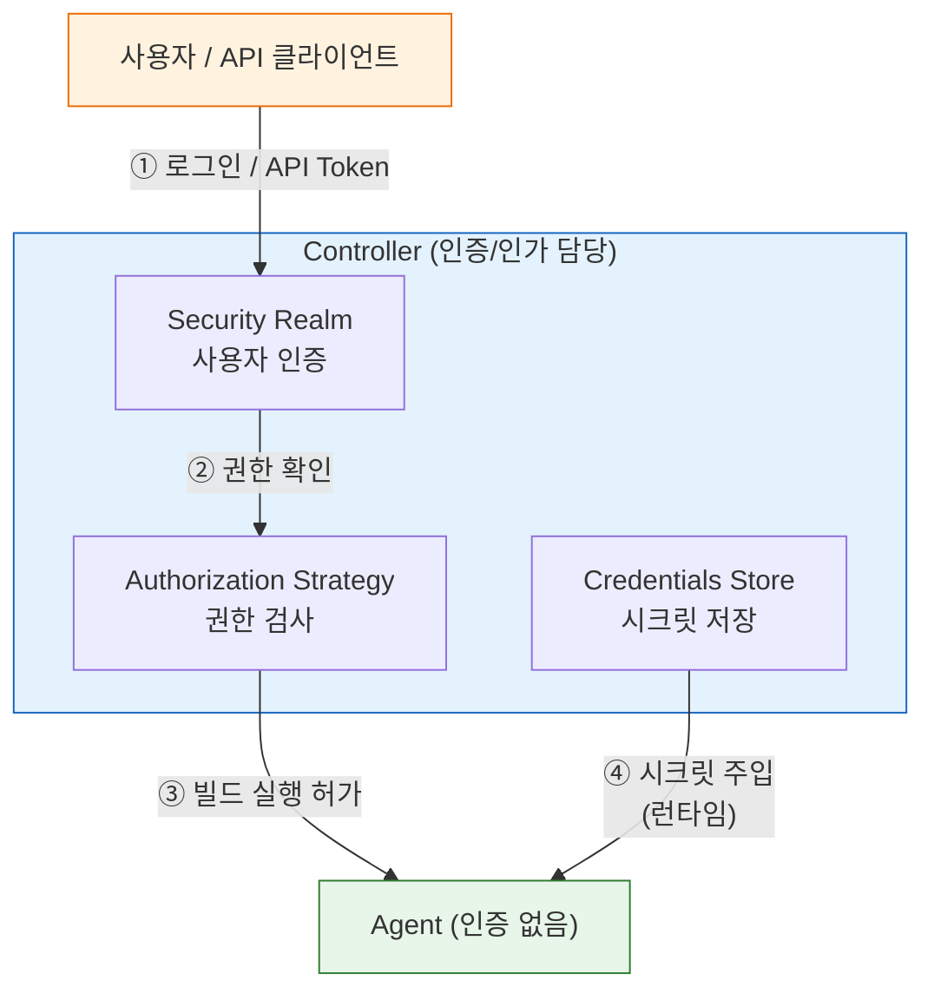

# 인증과 인가 — 누가 무엇을 할 수 있는가

---

> Jenkins를 API와 배포에 쓰는 순간, 보안은 선택이 아니라 바닥이다. Jenkins 보안 모델은 두 축으로 작동한다. 
>
> 1. **Security Realm**이 "누가 로그인하는가"를 결정한다.
> 2. **Authorization Strategy**가 "로그인한 사람이 무엇을 할 수 있는가"를 제어한다.

## 1. Security Realm (인증)

> Security Realm은 Jenkins에 로그인하는 사용자를 어디서 확인할지를 결정하는 설정이다.
>
> - Jenkins 자체 데이터베이스에 계정을 저장할 수도 있고, 조직 디렉터리(LDAP, Active Directory)나 SSO(SAML, OIDC)와 연동할 수도 있다.

| Security Realm | 특징 | 적합한 환경 |
|---|---|---|
| Jenkins 자체 DB | 계정을 Jenkins 내부에 저장 | 소규모 팀, 빠른 구축 |
| LDAP | 조직 디렉터리 서버 연동 | 사내 인프라가 있는 중대형 팀 |
| Active Directory | 윈도우 도메인 계정 연동 | Windows 중심 엔터프라이즈 |
| SAML 2.0 | SSO 통합 | Okta, Google Workspace 등 IDP 운영 조직 |

- 실무에서 Jenkins 자체 DB는 테스트 환경에는 괜찮지만, 운영 환경에서는 계정 관리가 Jenkins에 종속된다는 단점이 있다.
- 이미 LDAP나 Active Directory를 운영하는 조직이라면 연동이 자연스럽고, 계정 생애 주기를 Jenkins와 분리할 수 있어 보안 관리가 훨씬 수월해진다.

현재 Jenkins에 설정된 Security Realm을 확인하는 방법은 다음과 같다:

> 실습 환경 설정은 `05-00. 젠킨스 API 실습 환경 설정` 참조

```bash
curl -sSf -u "${JENKINS_USER}:${JENKINS_PASS}" \
  "${JENKINS_URL}/api/json?tree=useSecurity,securityRealm[_class]"
```

- `securityRealm._class`가 `HudsonPrivateSecurityRealm`이면 Jenkins 자체 DB를 사용하는 상태다.
- `LDAPSecurityRealm`이면 LDAP 연동 중이다.

### Controller와 Agent의 인증은 별개인가?

Jenkins의 인증/인가 체계는 **Controller에만 존재**한다. Agent는 독립적인 인증 시스템을 갖지 않는다.



- 사용자가 빌드를 트리거하면 Controller가 인증/인가를 검사한다.
- Agent는 Controller가 "이 빌드를 실행해라"고 지시하면 그대로 수행할 뿐, 누가 요청했는지 검증하지 않는다.
- Agent와 Controller 사이의 통신은 JNLP/SSH 채널로 보호되지만, 이것은 사용자 인증이 아니라 노드 간 통신 보안이다.
- 결론: 인증/인가 정책을 바꾸려면 Controller 설정만 변경하면 된다. Agent는 영향을 받지 않는다.


## 2. Authorization Strategy (인가)

> Authorization Strategy는 로그인에 성공한 사용자가 Jenkins에서 무엇을 할 수 있는지를 결정한다.
>
> - Security Realm이 문 앞 경비원이라면, Authorization Strategy는 내부 구역별 출입 카드다.

| 전략 | 세분화 수준 | 적합한 규모 | 운영 위험 |
|---|---|---|---|
| Anyone can do anything | 없음 | 격리된 테스트 전용 | 매우 높음 |
| Logged-in users can do anything | 없음 | 소규모 신뢰 팀 | 높음 |
| Matrix-based security | 글로벌 권한 | 소~중규모 | 낮음 |
| Project-based Matrix | 잡(Job) 단위 | 중규모 | 낮음 |
| Role-Based Strategy Plugin | 역할 기반 | 중~대규모 | 낮음 |

- "Anyone can do anything"은 이름 그대로 모든 사람이 모든 것을 할 수 있다. 격리된 로컬 환경 외에는 절대 사용해서는 안 된다.
- 외부에서 Jenkins URL에 접근 가능한 상태에서 이 설정을 켜두면, 인증 없이도 빌드 실행·크레덴셜 조회·스크립트 실행이 가능해진다.
- 운영 환경에서는 **Role-Based Strategy Plugin**이 가장 현실적인 선택이다. 역할을 미리 정의하고 사용자 또는 그룹에 역할을 부여하는 방식으로, 세분화 수준과 관리 편의성 모두 뛰어나다.


## 3. Access Control 실전 설정

> 최소 권한 원칙(Least Privilege)은 각 주체가 자신의 업무에 필요한 최소한의 권한만 갖도록 설계하는 것이다.
>
> - Jenkins에서는 역할을 기능 단위로 나누고, 각 역할이 접근 가능한 범위를 명확히 제한하는 방식으로 구현한다.

실전에서 자주 쓰이는 역할 구성 예시는 다음과 같다:

| 역할 | 대상 | 허용 범위 |
|---|---|---|
| admin | 인프라 팀 | 전체 관리 권한 |
| developer | 개발자 | 잡 읽기, 빌드 실행 |
| deployer | 배포 자동화 계정 | 특정 잡 빌드 실행, 파라미터 주입 |
| viewer | 모니터링, 감사 | 읽기 전용 |

- "관리자 토큰 하나로 모든 API를 호출"하는 패턴은 편리하지만 위험하다. 토큰이 유출되면 Jenkins 전체를 탈취당하는 것과 같다.
- 대신 `deployer` 역할처럼 목적에 맞는 계정을 별도로 만들고, 필요한 잡과 작업에만 권한을 부여해야 한다.
- 이렇게 하면 하나의 계정이 유출되더라도 피해 범위가 해당 잡으로 제한된다.

### Role-Based Strategy 기본 설정 흐름

Role-Based Strategy Plugin을 설치한 뒤 역할을 구성하는 순서는 다음과 같다:

- Manage Jenkins > Security > Authorization: Role-Based Strategy 선택
- Manage and Assign Roles > Manage Roles에서 역할 정의
- Assign Roles에서 사용자 또는 그룹에 역할 부여
- 잡 단위 제한이 필요하면 Item Roles에 정규식 패턴으로 잡 범위 지정

```groovy
// JCasC로 Role-Based Strategy를 설정하는 예시
authorizationStrategy:
  roleBased:
    roles:
      global:
        - name: "admin"
          permissions:
            - "Overall/Administer"
          assignments:
            - "admin-user"
        - name: "developer"
          permissions:
            - "Overall/Read"
            - "Job/Build"
            - "Job/Read"
          assignments:
            - "dev-team"
      items:
        - name: "deployer"
          pattern: "deploy-.*"
          permissions:
            - "Job/Build"
            - "Job/Read"
          assignments:
            - "ci-service-account"
```


## 4. API Token과 CSRF Protection

> API Token은 Jenkins REST API를 호출할 때 비밀번호 대신 사용하는 인증 수단이다.
>
> - 비밀번호와 달리 API Token은 언제든지 폐기·재발급할 수 있고, 사용 범위도 API 호출로 제한된다.

API Token의 주요 특징은 다음과 같다:

- Jenkins 사용자 계정마다 여러 개 발급 가능
- 토큰에 이름을 붙여 목적별로 구분 관리 가능 (예: `ci-pipeline-token`, `deploy-token`)
- 발급 후 한 번만 표시되므로 즉시 안전한 곳에 저장해야 한다
- 비밀번호 변경과 무관하게 독립적으로 유효하므로, 주기적으로 교체하는 습관이 필요하다

### CSRF Protection (crumb)

> **CSRF Protection**은 Cross-Site Request Forgery 공격을 막기 위한 Jenkins의 내장 보호 장치다.
>
> - Jenkins에 POST 요청을 보낼 때 서버가 발급한 crumb 값을 헤더에 함께 실어야 하며, 그렇지 않으면 `403 Forbidden`이 반환된다.

crumb이 필요한 이유는 다음과 같다:

- 공격자가 사용자의 브라우저 세션을 이용해 Jenkins에 악의적인 요청을 보낼 수 있다.
- crumb은 요청마다 서버가 발급하는 일회성 토큰이므로, 서드파티 사이트에서 이 값을 사전에 알 수 없다.
- 즉, crumb 없이는 위조 요청이 성공하지 못하도록 막는 장치다.

crumb 발급 → POST 요청까지의 전체 흐름:

```bash
# 1단계: crumb 발급
CRUMB_RESPONSE=$(curl -sSf -u "${JENKINS_USER}:${JENKINS_PASS}" \
  "${JENKINS_URL}/crumbIssuer/api/json")

CRUMB=$(echo "$CRUMB_RESPONSE" | jq -r '.crumb')
CRUMB_FIELD=$(echo "$CRUMB_RESPONSE" | jq -r '.crumbRequestField')

# 2단계: crumb을 헤더에 실어 POST 요청
curl -sSf -X POST \
  -u "${JENKINS_USER}:${JENKINS_PASS}" \
  -H "${CRUMB_FIELD}:${CRUMB}" \
  "${JENKINS_URL}/job/my-job/build"
```

### API Token vs crumb — 어떤 방식을 써야 하는가?

Jenkins 공식 문서는 **API Token을 권장**한다. Jenkins 2.96 이후부터 API Token은 crumb 없이 POST 요청이 가능하도록 설계되었다.

| 항목 | ID/Password + crumb | API Token |
|------|---------------------|-----------|
| POST 요청 시 | crumb 헤더 + 세션 cookie 필요 | Token만으로 인증 완료 |
| crumb 만료 | Jenkins 재시작 시 무효화 → 재발급 필요 | 영향 없음 |
| 비밀번호 변경 | 즉시 인증 실패 | 독립적으로 유효 |
| 폐기/교체 | 비밀번호 자체를 변경해야 함 | 토큰만 개별 폐기·재발급 |
| 자동화 적합성 | 낮음 (세션 관리 복잡) | 높음 (stateless) |
| Jenkins 권장 | 레거시 호환용 | **권장 방식** |

실제 기업 환경에서의 선택 기준은 다음과 같다:

- **자동화 스크립트 / 외부 시스템 연동** → API Token이 압도적으로 유리하다. crumb 방식은 세션 cookie를 관리해야 하고, Jenkins 재시작마다 crumb이 무효화되어 스크립트가 깨진다.
- **crumb만 지원하는 레거시 환경** → Jenkins 2.96 미만이거나, 보안 정책에 의해 API Token이 비활성화된 환경에서만 crumb을 사용한다.
- **보안 감사 관점** → API Token은 사용자별·용도별로 여러 개 발급할 수 있어 감사 추적에 유리하다. crumb은 세션 기반이므로 "누가 이 API를 호출했는가"를 추적하기 어렵다.

결론: **새로 구축하는 환경이라면 API Token을 사용한다.** crumb은 브라우저 기반 CSRF 방어 목적이지, API 자동화 인증 수단으로 설계된 것이 아니다.

```bash
# API Token 방식 — 깔끔하고 stateless
curl -sSf -X POST \
  -u "${JENKINS_USER}:${API_TOKEN}" \
  "${JENKINS_URL}/job/my-job/build"

# crumb 방식 — 2단계 필요, 세션 cookie 관리 필수
CRUMB=$(curl -sSf -u "${JENKINS_USER}:${JENKINS_PASS}" \
  -c /tmp/cookies "${JENKINS_URL}/crumbIssuer/api/json" | jq -r '.crumb')
curl -sSf -X POST \
  -u "${JENKINS_USER}:${JENKINS_PASS}" \
  -H "Jenkins-Crumb:${CRUMB}" -b /tmp/cookies \
  "${JENKINS_URL}/job/my-job/build"
```

- 인증 API 상세 스펙과 TPS 환경에서의 실제 사용 패턴은 `05-02` 문서를 참조한다.
