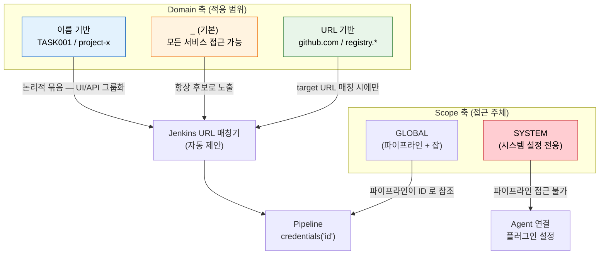
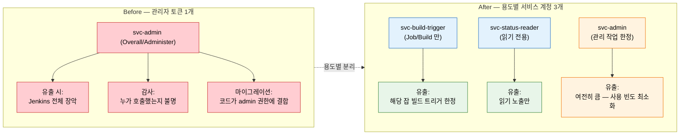

# 시크릿 관리와 최소 권한 원칙

---

> Jenkins에서 시크릿을 안전하게 관리하고, 권한을 최소화하는 방법을 다룹니다.
> 시크릿을 Jenkinsfile에 하드코딩하거나 환경 변수로 그대로 출력하면, 빌드 로그에 그대로 남습니다.

## §학습 목표

> 이 문서를 읽고 나면 Credentials 의 **Scope** (GLOBAL/SYSTEM) 와 **Domain** (URL/이름) 두 분류 축을 *시크릿 가시성·오용 방지* 관점에서 *설명* 할 수 있고, Credential 4유형(Username with password / Secret text / SSH Key / Certificate) 의 파이프라인 접근 방법을 *구분* 할 수 있으며, 빌드 로그 누수·Script Console 권한·관리자 토큰 빚 세 안티패턴을 *예측* 하고 막을 수 있습니다.

## §사전 지식

> 본 문서는 "시크릿 외부화", "최소 권한 원칙(Least Privilege)", "감사 추적(audit trail)", "서비스 계정 분리" 같은 일반 보안 운영 개념을 Jenkins Credentials Plugin·Script Console·API Token 단위로 좁혀 본 것입니다.

## 1. Credentials Plugin 구조

> 본 절은 Scope · Domain 두 분류 축이 *어떻게 시크릿 가시성을 좁히고 오용을 줄이는가* 를 다룹니다. 파이프라인은 ID 로만 참조하고 실제 값은 Controller 가 런타임에 주입합니다.

> Credentials Plugin은 시크릿을 **Scope**와 **Domain** 두 가지 기준으로 분류해 저장합니다.
>
> - 파이프라인에서는 ID로만 참조하고, 실제 값은 Jenkins가 런타임에 주입합니다.

### 1-1. Scope

**Scope**는 해당 크레덴셜이 어디서 사용 가능한지를 제어합니다:

| Scope | 접근 가능 범위 | 용도 |
|-------|-------------|------|
| `GLOBAL` | 모든 파이프라인과 잡 | 일반적인 빌드·배포 시크릿 |
| `SYSTEM` | Jenkins 시스템 설정만 (파이프라인 접근 불가) | Agent 연결, 플러그인 설정 |

SYSTEM Scope의 크레덴셜은 파이프라인이 접근할 수 없습니다.

- 예를 들어 Agent 노드 연결에 사용하는 SSH 키를 SYSTEM으로 등록하면, 개발자가 Jenkinsfile에서 그 키를 직접 가져올 수 없습니다.

- 이것이 의도된 격리입니다.


### 1-2. Domain

**Domain**은 크레덴셜의 적용 범위를 특정 URL이나 서비스로 제한하는 기능입니다.

Domain이 필요한 이유를 예시로 설명합니다.

- Git 토큰, Docker Registry 비밀번호, Slack Webhook URL이 모두 기본 도메인(`_`)에 들어 있으면 어떤 크레덴셜이 어떤 서비스용인지 구분이 어렵고, 잘못된 크레덴셜이 의도하지 않은 서비스에 자동 적용될 수 있습니다.

```
Credentials Store (system)
├── _ (기본 도메인) ← 모든 크레덴셜이 여기에 쌓이면 관리가 어렵습니다
│   ├── git-token
│   ├── docker-registry
│   ├── slack-webhook
│   └── db-password
│
├── github.com (도메인 분리)
│   └── git-token          ← github.com 관련 작업에서만 자동 매칭
│
├── registry.example.com
│   └── docker-registry    ← 이 레지스트리 접근 시에만 자동 매칭
│
└── TASK001 (업무 단위 분리)
    ├── slack-webhook       ← 특정 프로젝트 전용
    └── db-password
```

Domain의 동작 방식은 다음과 같습니다:

- **기본 도메인 (`_`)**: 모든 서비스에서 접근 가능합니다. Domain을 지정하지 않으면 여기에 저장됩니다.
- **URL 기반 도메인**: 특정 URL 패턴(예: `github.com`, `registry.example.com`)에 매칭되는 작업에서만 해당 크레덴셜이 자동으로 제안됩니다. Jenkins가 Git checkout이나 Docker push 시 대상 URL을 보고 매칭합니다.
- **이름 기반 도메인**: URL 패턴 없이 논리적 그룹으로만 분리합니다(예: `TASK001`). API에서 `/credentials/store/system/domain/TASK001/`로 접근합니다. 05-07에서 API로 도메인을 생성하고 크레덴셜을 등록하는 방법을 다룹니다.

### 1-3. Scope × Domain 분류 한눈에

> 두 축이 함께 작동하면 *어떤 크레덴셜이 어디서 보이는가* 가 분명해집니다.



> 빨간색(SYSTEM Scope) 은 *파이프라인 접근 차단* 의 격리선. 주황색(기본 도메인) 은 *모든 곳에서 보이는* 광범위 영역으로 *잘못된 시크릿 선택 위험* 이 가장 큽니다. 초록색(URL 기반 도메인) 은 *URL 매칭으로 자동 좁혀짐*, 파란색(이름 기반) 은 *논리적 그룹화* — 셋 다 *기본 도메인 남용을 줄이는* 방향입니다.

Domain 분리의 실무 이점:

- **가시성**: "이 도메인에는 이 서비스 관련 시크릿만 있다"고 즉시 파악할 수 있습니다.
- **오용 방지**: URL 기반 도메인은 해당 URL이 아닌 작업에서 크레덴셜이 제안되지 않으므로, 잘못된 시크릿을 선택하는 실수를 줄입니다.
- **API 관리 편의**: 도메인 단위로 크레덴셜을 일괄 조회·관리할 수 있습니다.

크레덴셜의 실제 값은 `$JENKINS_HOME/secrets/` 디렉터리에 암호화되어 저장됩니다. Jenkins 마스터 키로 암호화하므로, 파일 시스템에 직접 접근해도 평문을 볼 수 없습니다.

### 어떤 Agent 환경에서도 동일하게 작동합니다

Credential은 Controller가 보관·복호화한 뒤 Agent에 환경변수(`$CRED_USR` / `$CRED_PSW`)로 전달하므로 Agent가 VM이든, Docker 컨테이너든, K8s Pod이든 동일하게 작동합니다. Agent 자체는 크레덴셜 저장소에 접근하지 않고, Controller가 주입한 변수만 봅니다.

SSH 키나 인증서처럼 파일 형태가 필요한 크레덴셜은 Jenkins가 Agent에 **임시 파일**로 마운트합니다. K8s Pod 같은 임시 에이전트는 Pod 삭제 시 자동으로 사라지지만, VM Agent는 빌드 비정상 종료 시 임시 파일이 남을 수 있으므로 `post { always { cleanWs() } }`로 정리하는 것이 좋습니다.


## 2. Credential 유형별 사용법

> 본 절은 4유형의 *접미사 변수 규약* (`_USR`/`_PSW` vs 단일 변수) 과 *파일 마운트* 동작을 정리합니다. 빌드 로그 자동 마스킹이 핵심 보호선입니다.

> Jenkins Credentials Plugin이 지원하는 주요 유형과 파이프라인에서의 접근 방법을 정리합니다.

| 유형 | 용도 | Pipeline 접근 방법 |
|---|---|---|
| Username with password | Git 인증, 레지스트리 로그인 | `$CRED_USR`, `$CRED_PSW` |
| Secret text | API 키, 토큰, Webhook URL | `$CRED` |
| SSH Username with private key | Git SSH 접속, 서버 배포 | `$CRED` (키 파일 경로) |
| Certificate | X.509 인증서, PKCS#12 | `$CRED` (키스토어 경로) |

### Username with password 예시

```groovy
pipeline {
    agent any
    environment {
        // 왜 environment 블록: credentials() 바인딩으로 자동 _USR/_PSW 분리 + 로그 마스킹
        REGISTRY_CRED = credentials('docker-registry')
    }
    stages {
        stage('Push') {
            steps {
                sh 'docker login -u $REGISTRY_CRED_USR -p $REGISTRY_CRED_PSW'
                sh 'docker push myapp:${BUILD_NUMBER}'
            }
        }
    }
}
```

- `credentials('docker-registry')`는 ID가 `docker-registry`인 크레덴셜을 주입합니다.
- Jenkins는 자동으로 `_USR`과 `_PSW` 접미사 변수를 생성합니다.
- 빌드 로그에는 `****`로 마스킹되어 출력됩니다.

### Secret text 예시

```groovy
environment {
    SLACK_TOKEN = credentials('slack-webhook-token')
}
stages {
    stage('Notify') {
        steps {
            # 왜 단일 변수: Secret text 유형은 접미사 없이 변수명 그대로 사용
            sh 'curl -X POST -d "text=Build done" -H "Authorization: Bearer $SLACK_TOKEN" ...'
        }
    }
}
```

- Secret text 유형은 접미사 없이 변수명 그대로 사용합니다.
- SSH 키와 Certificate는 Jenkins가 임시 파일로 마운트해 제공하며, 빌드 종료 시 자동으로 삭제됩니다.


## 3. 보안 취약 패턴

> 본 절은 *실무에서 가장 자주 발견되는* 3대 안티패턴을 다룹니다. 모두 *편의 → 누수 → 사후 발견* 의 흐름이 공통점입니다.

> 실제 현장에서 자주 발견되는 잘못된 패턴 세 가지를 짚습니다.
>
> - 각각이 왜 위험한지 이해하는 것이 올바른 사용의 출발점입니다.

### 패턴 1: sh 명령어에 크레덴셜 직접 삽입

```groovy
// ❌ 위험: 토큰이 빌드 로그에 그대로 출력됨
sh "curl -H 'Authorization: Bearer ${MY_TOKEN}' https://api.example.com"

// ✅ 안전: credentials() 바인딩 사용
environment {
    API_TOKEN = credentials('my-api-token')
}
steps {
    // 왜 큰따옴표 안 작은따옴표: Groovy 보간을 피하고 셸이 환경변수 치환하도록 위임 → 마스킹 보존
    sh 'curl -H "Authorization: Bearer $API_TOKEN" https://api.example.com'
}
```

- `credentials()` 바인딩을 `environment` 블록에서 사용하면 Jenkins가 로그 출력 시 자동으로 마스킹합니다.

### 패턴 2: echo로 크레덴셜 값 출력

- 디버깅 목적으로 `echo $SECRET`을 파이프라인에 넣으면, 마스킹이 적용되어도 빌드 로그 아카이브에 흔적이 남습니다.
- 값을 부분 문자열로 쪼개거나 인코딩하면 마스킹을 우회할 수 있습니다.

### 패턴 3: 하나의 크레덴셜을 모든 잡이 공유

- `GLOBAL` Scope로 등록된 크레덴셜은 Jenkins 내 모든 파이프라인에서 ID만 알면 접근할 수 있습니다.
- 개발용 Git 토큰과 운영 레지스트리 패스워드를 같은 크레덴셜로 관리하면, 개발 파이프라인 하나가 침해되었을 때 운영 레지스트리까지 노출됩니다.
- 환경(개발/스테이징/운영)과 목적(소스 관리/이미지 푸시/배포)을 기준으로 크레덴셜을 분리하는 것이 좋습니다.


## 4. Script Console 보안

> 본 절은 *가장 위험한 내장 도구* 인 Script Console 의 권한 모델을 다룹니다. *완전 비활성화* 는 비현실적이고 *admin 역할로만 제한* 이 표준입니다.

> Script Console은 Jenkins 관리자가 서버에서 직접 Groovy 코드를 실행할 수 있는 내장 환경입니다.
>
> - 경로는 `/script`이며, 접근하면 Groovy 코드를 입력하고 즉시 실행할 수 있습니다.

Script Console은 Jenkins 프로세스 권한으로 실행됩니다. 즉, 다음 모든 것이 가능합니다:

- `JENKINS_HOME/secrets/` 디렉터리 파일 읽기
- 저장된 크레덴셜 복호화 및 평문 출력
- 서버 파일 시스템 접근 및 수정
- 시스템 명령어 실행 (`Runtime.exec(...)`)
- Jenkins 내부 상태 직접 조작

Script Console에 접근할 수 있는 계정을 탈취하면, 사실상 Jenkins가 실행되는 서버 전체를 장악할 수 있습니다.

- 비활성화하는 것이 이론적으로는 가장 안전하지만, 장애 디버깅과 플러그인 문제 해결에 자주 쓰이므로 완전 비활성화는 현실적이지 않습니다.
- 대신 Role-Based Strategy에서 Script Console 접근 권한을 `admin` 역할에만 명시적으로 부여하고, 그 외 모든 역할은 차단하는 것이 현실적인 방어선입니다.


## 5. 관리자 토큰의 빚

> 본 절의 결론은 *편의로 시작한 관리자 토큰 일원화가 가장 큰 부채로 누적된다* 입니다. 서비스 계정 분리가 *유출·감사·마이그레이션* 세 문제를 동시에 해결합니다.

> 개발 코드에서 Jenkins API를 호출할 때 "그냥 계정 하나 만들어서 관리자 토큰으로 호출"하면 처음에는 편합니다.
>
> - 하지만 이것이 나중에 가장 큰 빚이 됩니다.

관리자 토큰 하나로 모든 것을 하면 세 가지 문제가 동시에 발생합니다:

- **유출 시 전체 장악**: 관리자 토큰이 유출되면 Jenkins 전체를 장악할 수 있습니다.
- **감사 추적 불가**: 누가 어떤 API를 호출했는지 구분할 수 없습니다.
- **마이그레이션 불가**: 권한을 줄이려 해도 이미 모든 코드가 관리자 권한에 의존하고 있어 변경이 불가능에 가깝습니다.

올바른 접근은 용도별 서비스 계정을 분리하는 것입니다:

| 계정 | 용도 | 부여 권한 |
|------|------|----------|
| `svc-build-trigger` | 빌드 트리거 | `build/buildWithParameters`만 |
| `svc-status-reader` | 상태 조회 | 읽기 전용 (`api/json`, `wfapi`) |
| `svc-admin` | 관리 작업 | 크레덴셜 관리, 설정 변경 (사용 빈도 최소화) |

- 서비스 계정별로 API Token을 발급하면, 토큰 하나가 유출되어도 피해 범위가 해당 계정의 권한으로 제한됩니다.
- 감사 로그에서도 어떤 계정이 어떤 작업을 수행했는지 추적이 가능해집니다.

### 서비스 계정 분리가 줄이는 위험 한눈에

> *한 계정 → 세 계정* 으로 갈랐을 때 어떤 위험 축이 어떻게 좁혀지는지를 한 그림으로 정리합니다.



> 빨간색(Before) 은 *모든 위험이 한 점에 집중* 된 상태. 파란색(After 의 두 좁은 계정) 은 *유출 시에도 피해 범위가 그 계정의 권한* 으로 갇힙니다. 주황색(svc-admin) 은 *여전히 위험이 크지만 사용 빈도 최소화 + 사용 시 audit log 강화* 로 완화. *한 계정으로 묶지 않는 것* 자체가 *유출 → 사고* 의 폭을 줄이는 가장 큰 레버입니다.


## 6. 최소 권한 원칙 체크리스트

> 본 절은 *보안 설정 완료 후 자기 점검* 7항목입니다. 하나라도 누락되면 *공격 표면이 열려 있는* 상태입니다.

> 보안 설정을 마친 뒤 다음 항목을 점검합니다.
>
> - 하나라도 체크되지 않은 항목이 있으면 공격 표면이 열려 있는 것입니다.

- [ ] Controller Executor를 0으로 설정했는가 (빌드는 Agent에서만 실행)
- [ ] API Token은 사용자별로 발급했는가 (공유 계정 금지)
- [ ] Credentials Scope를 SYSTEM/GLOBAL로 적절히 분리했는가
- [ ] Script Console 접근을 admin 역할로만 제한했는가
- [ ] 비밀번호나 토큰이 Jenkinsfile에 하드코딩되어 있지 않은가
- [ ] CSRF Protection(crumb)이 활성화되어 있는가
- [ ] 서비스 계정을 용도별로 분리했는가

현재 등록된 크레덴셜 목록을 조회하는 방법은 다음과 같습니다:

> 실습 환경 설정은 `05-00. 젠킨스 API 실습 환경 설정` 참조

```bash
# 왜 tree= : 응답 필드를 id/typeName/description 으로 좁혀 가독성 확보
curl -sSf -u "${JENKINS_USER}:${JENKINS_PASS}" \
  "${JENKINS_URL}/credentials/store/system/domain/_/api/json?tree=credentials[id,typeName,description]"
```

- 응답에서 `typeName`으로 각 크레덴셜의 유형을 확인할 수 있습니다.
- `id`가 의미 없는 UUID로 되어 있으면 관리가 어려우므로, 등록 시 `git-deploy-key`, `docker-registry-prod`처럼 목적을 알 수 있는 이름을 직접 부여하는 것이 좋습니다.
- Credentials API의 상세 스펙(도메인 생성, 크레덴셜 CRUD, upsert 패턴)은 `05-07` 문서를 참조합니다.

---

## 면접 질문

> 자기 답을 떠올린 뒤 `정답` 절을 펼쳐 비교합니다.

1. SYSTEM Scope 와 GLOBAL Scope 의 *파이프라인 접근 차이* 가 보안 측면에서 의도하는 격리는 무엇입니까? Agent SSH 키를 SYSTEM 으로 두는 게 *왜 안전망* 입니까?
2. URL 기반 Domain 과 이름 기반 Domain 중 *오용 방지 효과가 직접적* 인 쪽은 어느 쪽이고 왜 그렇습니까?
3. 빌드 로그 마스킹이 적용된 상태에서도 *echo 디버깅* 이 위험한 이유 두 가지를 말할 수 있습니까?
4. *관리자 토큰 한 개로 모든 호출* 패턴이 *마이그레이션을 불가능에 가깝게* 만드는 메커니즘을 설명할 수 있습니까?

## 정답

### 정답 1 — SYSTEM vs GLOBAL Scope

SYSTEM Scope 의 크레덴셜은 *파이프라인 코드에서 접근 자체가 불가* 합니다. Agent SSH 키처럼 Jenkins 시스템이 노드 연결에 쓰는 비밀은 *개발자의 Jenkinsfile 이 절대 가져갈 일이 없는* 비밀입니다. GLOBAL 로 두면 누군가가 Jenkinsfile 에서 `credentials('agent-ssh-key')` 한 줄로 그 키를 환경변수에 노출시킬 수 있고, 그 시점에 *Jenkins 가 관리하는 모든 Agent 노드의 SSH 접근* 이 빌드 로그·`sh` 명령으로 새 나갑니다. SYSTEM 으로 묶으면 *접근 자체가 차단되어* 코드 실수로 노출되는 경로가 사라집니다 — *카테고리 단위 격리* 가 안전망입니다.

### 정답 2 — URL vs 이름 기반 Domain

**URL 기반 Domain** 입니다. URL 기반은 *Jenkins 가 작업의 target URL 을 보고 매칭* 하므로 `github.com` 작업 시 `registry.example.com` 크레덴셜이 *후보로 제안되지도 않습니다*. 이름 기반은 *논리적 그룹* 일 뿐 자동 매칭이 없어 *UI/API 가시성 개선* 효과만 있고 오용 방지는 약합니다. 실무 패턴은 *URL 기반을 1차로*, 이름 기반은 *URL 로 표현 안 되는 프로젝트 단위 묶음* 에만 보조로 씁니다.

### 정답 3 — echo 디버깅이 위험한 이유

(a) **마스킹 우회 가능** — 값을 *부분 문자열로 쪼개거나 base64/url 인코딩* 하면 Jenkins 의 *원본 문자열 매칭* 마스킹이 통과합니다. 예: `echo ${SECRET:0:5}` 같은 호출은 *앞 5자만* 출력되어 마스킹 안 됨. (b) **로그 아카이브 영속** — 마스킹된 흔적조차도 *빌드 로그가 아카이브된 시점·다운로드 시점* 의 메타데이터에 *"이 빌드에서 SECRET 이 화면에 출력됐다"* 는 사실을 남깁니다. 침해 후 *언제부터 노출* 됐는지 시간 측정이 어려워집니다.

### 정답 4 — 관리자 토큰과 마이그레이션

코드가 *권한을 호출 시점에 의식하지 않고 admin 권한이 있다는 가정* 으로 작성되기 때문입니다. 예 — `svc-admin` 토큰으로 `/createItem`, `/scriptText`, `/credentials/...`, `/job/.../build` 등을 *섞어서* 호출하는 자동화가 N년에 걸쳐 쌓이면, 토큰 권한을 줄이는 순간 *어느 호출이 어느 권한을 요구하는지* 의 매핑이 안 잡힙니다. *권한 축소 = 미지의 호출이 깨지는* 변경이 되어 *깨질 위험을 감수할 수 없어* 마이그레이션이 멈춥니다. 처음부터 *호출 단위로 계정을 갈라* 두면 *어느 계정이 무엇을 필요로 하는지* 가 코드 → 계정 매핑으로 명확해 *권한 변경이 한 계정 안에서 닫힌 작업* 이 됩니다.

## 관련 문서

> 시크릿 격리는 인증/인가 권한 모델(01-01) 위에 서고, 코드화(02-03)·셸 노출(01_core sh 위생)·API 크레덴셜(04_api)로 이어집니다.

- [01-01. 인증과 인가 — 누가 무엇을 할 수 있는가](01-01.인증과%20인가%20%E2%80%94%20누가%20무엇을%20할%20수%20있는가.md) § "Authorization Strategy" — 권한 모델 위에서의 시크릿 격리
- [02-03. JCasC 시크릿과 실전 패턴](02-03.JCasC%20시크릿과%20실전%20패턴.md) § "${SECRET} 치환·Vault" — 시크릿을 코드로 다루는 다음 단계
- [../01_core/02-05. sh step 셸 실행 위생](../01_core/02-05.sh%20step%20셸%20실행%20위생.md) § "크레덴셜 노출 신호" — echo 마스킹 우회(정답 3)와 직결
- [../04_api/08-01. API 크레덴셜 관리](../04_api/08-01.API%20크레덴셜%20관리.md) § "store/domain 모델" — Domain 격리(정답 2)의 API 면
