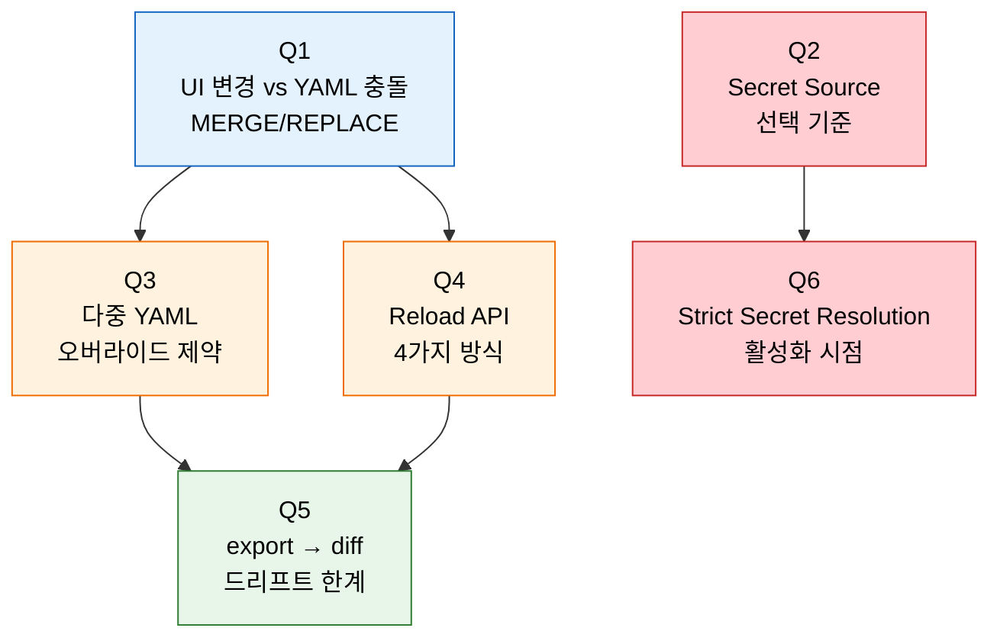
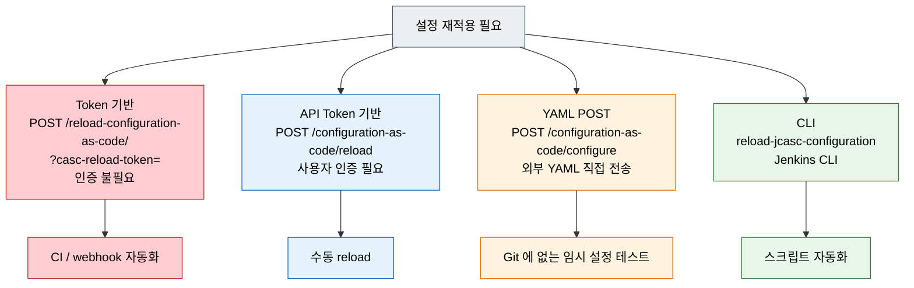

# 6단계 점검 — JCasC 핵심 질문

---

> 이 점검 문서는 JCasC 단계(설정 코드화·운영·시크릿)를 다 읽은 뒤 스스로를 시험하기 위한 자가 점검입니다. 먼저 §면접 질문만 보고 답을 떠올린 뒤, §정답 절에서 같은 번호로 대조하세요.
> 다루는 문서: `02-01.설정을 코드로 — JCasC`, `02-02.JCasC 운영과 GitOps`, `02-03.JCasC 시크릿과 실전 패턴`

## §학습 목표

> 이 질문들에 막힘 없이 답할 수 있으면 JCasC 본편 학습이 끝난 것으로 봅니다. 막힌 질문은 본문 해당 절로 돌아가 다시 읽고 다음 회차 복습으로 가져갑니다.

## §사전 지식

> 본 점검은 "설정의 코드화(Configuration as Code)", "MERGE vs REPLACE 적용 모드", "시크릿 외부화(환경변수/Docker/K8s/Vault)", "다중 파일 합성과 충돌", "Reload 트리거 채널", "드리프트(drift) 감지" 같은 일반 운영 개념을 Jenkins JCasC 의 `jenkins.yaml`·Secret Source·`CASC_JENKINS_CONFIG`·Reload API 단위로 좁혀 본 형태입니다.

## §질문 흐름 한눈에

> 파란색은 *적용 모드*, 빨간색은 *시크릿/보안 설정*, 주황색은 *파일 구성과 재적용 채널*, 초록색은 *드리프트 감지* 입니다. Q1·Q4 가 *적용 시점*, Q3·Q5 가 *구성 시점과 검증*, Q2·Q6 이 *시크릿 운영* 의 묶음을 이룹니다.

## §Reload 4채널 — 용도별 선택

Q4 의 핵심은 *어떤 트리거를 어떤 인증으로 거는가* 입니다. JCasC 는 네 가지 재적용 채널을 제공하고, 인증 요구와 용도가 갈립니다.

> Token 기반은 인증이 없어 자동화에 편하지만, 토큰이 노출되면 *인증 없이 reload 트리거* 가 가능하므로 짧은 주기 회전과 네트워크 ACL 로 보호합니다.

---

## 면접 질문

> 답을 떠올린 뒤 §정답 절에서 같은 번호로 대조하세요. 각 질문 뒤의 *심화*까지 답할 수 있으면 충분합니다.

1. JCasC에서 UI 변경과 YAML 충돌이 발생하면 어떻게 됩니까? *(심화: `jenkins.yaml`을 Git으로 관리할 때 환경별(dev/prod) 값 분기 전략 3가지는 무엇입니까?)*
2. Secret Source를 선택하는 기준은 무엇입니까? *(심화: Docker Secrets와 K8s Secrets를 동시에 사용해야 하는 상황이 있습니까?)*
3. 다중 YAML 파일 간 오버라이드 제약은 무엇입니까? *(심화: YAML 앵커(`&`, `*`)로 중복을 줄이는 것과 파일을 분할하는 것의 장단점은 무엇입니까?)*
4. Reload API 방식 간 차이는 무엇입니까? *(심화: Token 기반 reload에서 토큰이 노출되었을 때 공격자가 할 수 있는 것은 무엇입니까? 어떻게 방어합니까?)*
5. export → diff 드리프트 감지의 한계는 무엇입니까? *(심화: YAML 파서 기반 비교를 구현하려면 어떤 도구를 사용할 수 있습니까?)*
6. Strict Secret Resolution은 언제 활성화해야 합니까? *(심화: strict 모드에서 새 시크릿을 추가할 때 무중단으로 적용하려면 어떤 순서로 진행해야 합니까?)*

---

## 정답

> 위 질문을 스스로 설명해 본 뒤에 펼치세요.

### 정답 1 — UI 변경과 YAML 충돌

JCasC는 두 가지 적용 모드를 제공합니다:

| 모드 | 동작 |
|------|------|
| `MERGE` | YAML에 명시된 항목만 덮어쓰고 나머지 UI 설정은 유지 |
| `REPLACE` | YAML 기준으로 전체 재설정 → UI 변경값 전부 사라짐 |

- 운영에서는 `REPLACE` 모드가 권장됩니다. YAML이 진실의 원천이 되어야 재현성이 보장됩니다.
- 팀 운영 정책으로 "JCasC 적용 후 UI 직접 변경 금지"를 수립해야 충돌을 방지할 수 있습니다.

### 정답 1 심화 — 환경별 값 분기 전략

세 가지 분기 전략이 흔합니다. (a) **파일 분리** — `jenkins-base.yaml` + `jenkins-dev.yaml` / `jenkins-prod.yaml` 을 환경별로 `CASC_JENKINS_CONFIG` 디렉토리에 다른 조합으로 마운트. 충돌 키만 안 겹치게 루트 키를 나눔. (b) **환경변수 치환** — 같은 YAML 안에서 `${JENKINS_URL}` / `${DEFAULT_AGENT_LABEL}` 같은 변수를 두고 환경마다 다른 값 주입. Strict mode 와 결합해 누락 방지. (c) **Helm/Kustomize 오버레이** — K8s 환경이면 base ConfigMap + 환경별 patch 로 YAML 자체를 합성. Git 에는 base 만 두고 prod 차이는 overlay 디렉토리로 분리. 세 방법은 *섞어서* 쓰는 게 일반적입니다 — 구조 차이는 파일 분리, 값 차이는 변수.

### 정답 2 — Secret Source 선택 기준

배포 환경, 보안 요구 수준, 팀 규모에 따라 적합한 Secret Source가 달라집니다:

- 환경변수: 로컬 개발/PoC에만 사용합니다. Jenkins 관리자에게 노출되므로 운영 환경에서는 부적합합니다.
- Docker Secrets: Docker Compose 환경에서 파일 기반으로 자동 매핑합니다. 운영 복잡도가 낮아 소규모 팀에 적합합니다.
- K8s Secrets: Kubernetes 환경의 표준입니다. 볼륨 마운트로 `/run/secrets/`에 파일로 노출합니다.
- HashiCorp Vault: 엔터프라이즈 환경에서 중앙 집중식 시크릿 관리가 필요할 때 사용합니다. AppRole, Token, UserPass 세 가지 인증 방식을 지원합니다.
- AWS Secrets Manager: AWS 환경에서 네이티브 통합이 필요할 때 선택합니다.

선택 기준은 배포 환경(Docker/K8s/클라우드) + 보안 요구 수준 + 팀 규모의 조합으로 결정합니다.

### 정답 2 심화 — Docker·K8s Secrets 병행

흔치는 않지만 *과도기* 에 그런 상황이 생깁니다. 예시 — *Compose 로 운영하다 K8s 로 이전 중* 인 시점에 (a) 일부 잡은 여전히 Docker 호스트의 빌드 Agent 에 SSH 로 붙어 빌드, (b) 새 잡은 K8s 동적 Agent 로 돌아가는 상황. 같은 시크릿(예: SCM 토큰) 을 두 채널에 동시에 노출해야 하면 Docker Secrets 와 K8s Secrets 양쪽에서 *같은 값* 을 가져갈 수 있게 *둘 다 Secret Source 로 등록* 해 두는 게 자연스럽습니다. 단 *시크릿 진실의 원천* 은 한 곳(보통 Vault) 이 돼야 두 채널 동기화 사고가 줄어듭니다.

### 정답 3 — 다중 YAML 오버라이드 제약

`CASC_JENKINS_CONFIG`에 디렉토리를 지정하면 모든 `.yml`/`.yaml` 파일을 재귀 수집합니다. 파일 간 같은 키를 선언하면 `ConfiguratorException`이 발생합니다. 오버라이드가 아니라 보충(supplementary) 관계이기 때문입니다.

충돌 방지 전략은 루트 키(`jenkins`, `tool`, `unclassified`, `credentials`) 단위로 파일을 분리하는 것입니다.

### 정답 3 심화 — YAML 앵커 vs 파일 분할

| 축 | YAML 앵커 (`&`/`*`) | 파일 분할 |
|----|---------------------|----------|
| 가독성 | 같은 파일 안에서 묶이면 OK, 멀어지면 추적 난이도 ↑ | 파일명 자체가 의미를 가져 *어디에 무엇이 있는지* 가 명확 |
| 변경 영향 | 앵커 정의 한 곳 수정이 *모든 alias* 에 즉시 반영 | 변경이 한 파일에 갇힘 — *의도된 차이* 를 보장하기 쉬움 |
| 충돌 | 같은 키 충돌 없음 (한 파일 안) | 같은 루트 키 등장 시 `ConfiguratorException` |
| 환경 분기 | 변수만으로는 한계 | 환경별 디렉토리 마운트로 자연스럽게 분기 |

소규모·동질 환경은 *앵커* 가 가볍고, 다환경·팀 분리 운영은 *파일 분할* 이 안전합니다. 둘은 *섞어 씁니다* — 공통은 base 파일에서 앵커, 환경 차이는 다른 파일에서 alias 재사용.

### 정답 4 — Reload API 4채널 차이

용도에 따라 네 가지 방식 중 하나를 선택합니다:

- Token 기반 (`/reload-configuration-as-code/?casc-reload-token=`): 사용자 인증이 불필요합니다. CI/webhook 자동화에 최적입니다.
- API Token 기반 (`/configuration-as-code/reload`): 사용자 인증이 필요합니다. 수동 reload에 적합합니다.
- YAML POST (`/configuration-as-code/configure`): 외부 YAML을 직접 전송합니다. Git에 없는 임시 설정 테스트 시 유용합니다.
- CLI (`reload-jcasc-configuration`): Jenkins CLI 환경에서 사용합니다. 스크립트 자동화가 가능합니다.

### 정답 4 심화 — 토큰 노출 시 위험과 방어

토큰이 노출되면 공격자가 *인증 없이 reload 트리거* 를 칠 수 있습니다. 직접적인 시크릿 유출은 없지만, (a) 임의의 시점에 reload 가 걸려 *진행 중인 빌드/관리자 작업* 이 흔들릴 수 있고, (b) Git 의 YAML 이 공격자가 미리 바꿔둔 commit 을 가리키게 만들면 *권한 설정 자체를 그 시점에* 갈아엎을 수 있습니다 (Q1 의 REPLACE 와 결합 시 위험). 방어는 (a) **토큰을 짧은 주기로 회전** + Vault 같은 외부 시크릿 저장소에서만 발급, (b) **네트워크 ACL** — reload endpoint 를 내부망(예: GitOps controller 만) 에서만 접근 가능, (c) **Audit Trail 로 reload 호출 모니터링** — 비정상 빈도/시각 알림.

### 정답 5 — export → diff 드리프트 한계

`export`는 현재 Jenkins 상태 전체를 출력하므로, `jenkins.yaml`에 명시하지 않은 기본값도 포함됩니다. 이로 인해 diff에 노이즈가 발생합니다. 관리 대상 섹션만 필터링하는 전략이 필요합니다.

export된 YAML의 키 순서가 `jenkins.yaml`과 다를 수 있어, 단순 diff보다 YAML 파서 기반 비교가 정확합니다.

### 정답 5 심화 — YAML 파서 기반 비교 도구

(a) **`yq` (Mike Farah 버전)** — `yq eval-all 'select(fi==0) - select(fi==1)' a.yaml b.yaml` 같은 형태로 *키 순서 무관* 비교. CLI 한 줄로 끝나는 게 강점. (b) **Python `ruamel.yaml`** — 주석 보존 + 키 순서 옵션 제어가 필요한 정밀 비교에 적합. 스크립트 안에서 *관리 대상 섹션만* 필터링하기 쉬움. (c) **`json-diff` + `yaml→json` 변환** — `yq -o=json` 으로 변환 후 `json-diff` 로 비교. JSON 기반 도구 생태계 재사용. 셋 다 핵심은 *기본값·키 순서·주석 차이* 를 노이즈에서 빼고 *의미 있는 차이* 만 추출하는 것입니다.

### 정답 6 — Strict Secret Resolution 활성화 시점

기본 동작에서 미해결 `${VAR}`은 빈 문자열로 대체됩니다. 관리자 비밀번호가 빈 문자열이 되면 누구나 로그인할 수 있으므로 심각한 보안 문제로 이어집니다.

`CASC_STRICT_SECRET_RESOLUTION=true`를 활성화하면 시크릿이 해결되지 않을 때 reload 자체가 중단됩니다. 운영 환경에서는 반드시 활성화해야 하며, 개발 환경에서도 활성화를 권장합니다. `${VAR:-default}` 형식의 기본값은 strict 모드에서도 정상 동작합니다.

### 정답 6 심화 — strict 모드 무중단 시크릿 추가

순서가 핵심입니다 — *시크릿 먼저, YAML 나중*. (a) **새 시크릿을 Secret Source 에 먼저 배치** — Vault/K8s Secret 에 키 등록 + Jenkins 가 읽을 수 있는지 *기존 YAML 로 reload* 해 봐서 *기존 동작이 깨지지 않는지* 확인. (b) **YAML 에서 새 시크릿을 참조하는 변경 commit** — `${NEW_VAR}` 추가, PR 리뷰. (c) **새 YAML reload** — 이 시점에 strict 모드가 켜져 있어도 시크릿이 이미 존재하므로 통과. (d) **롤백 절차 박제** — 시크릿 또는 YAML 중 하나가 잘못 배포돼 reload 실패 시 *직전 YAML 로 즉시 되돌리는* git revert + reload 트리거를 준비. 순서를 뒤집어 *YAML 먼저, 시크릿 나중* 으로 가면 strict 모드가 reload 를 막아 무중단이 깨집니다.

## 관련 문서

> 이 점검 문서는 02장 JCasC의 세 본편(02-01~02-03)을 다룹니다. 막힌 질문이 있으면 아래 해당 편으로 돌아가 해당 절을 다시 읽으면 동선이 이어집니다.

- [02-01. 설정을 코드로 — JCasC](02-01.설정을%20코드로%20%E2%80%94%20JCasC.md) § "jenkins.yaml 섹션" — UI 충돌·다중 YAML·도입 5스텝(정답 1·3 연계)
- [02-02. JCasC 운영과 GitOps](02-02.JCasC%20운영과%20GitOps.md) § "Reload·환경 분리" — Reload API·plugins.txt 정합성(정답 4 연계)
- [02-03. JCasC 시크릿과 실전 패턴](02-03.JCasC%20시크릿과%20실전%20패턴.md) § "Secret Source·strict" — Secret Source·strict 모드(정답 2·6 연계)
