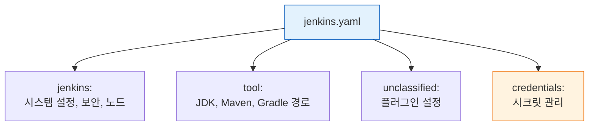
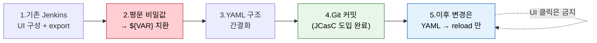

# JCasC 구조와 설정

---

> Jenkins 설정도 코드처럼 관리해야 하는 이유와 방법을 다룹니다.

## §학습 목표

> 이 문서를 읽고 나면 `jenkins.yaml` 의 4섹션(`jenkins` / `tool` / `unclassified` / `credentials`) 이 각각 *무엇을 담는지* 를 *설명* 할 수 있고, 기존 Jenkins 를 export → 환경변수 치환 → reload 하는 JCasC 도입 절차를 *재현* 할 수 있으며, UI 변경과 YAML 충돌을 막는 두 전략(UI 변경 금지 정책 / 주기적 reload 자동화) 의 트레이드오프를 *비교* 할 수 있습니다.

## §사전 지식

> 본 문서는 "설정의 코드화", "환경변수 치환을 통한 시크릿 외부화", "drift 감지(export → diff)" 같은 일반 IaC 개념을 Jenkins JCasC 의 `jenkins.yaml`·`/configuration-as-code/export`·`/configuration-as-code/reload` 단위로 좁혀 본 것입니다.

## 1. UI 설정의 한계와 Configuration as Code

> 본 절의 결론은 *클릭으로 구성한 Jenkins 는 추적도 재현도 불가* 이고, JCasC 가 이 두 문제를 *YAML 파일 하나* 로 푼다는 것입니다.

> 클릭으로 구성한 Jenkins는 누가 무엇을 바꿨는지 기록되지 않습니다. JCasC는 이 문제를 YAML 파일 하나로 해결합니다.

Jenkins를 처음 구성하면 Manage Jenkins 화면에서 클릭으로 모든 설정을 마칩니다.

- 이 방식의 문제는 "누가 언제 무엇을 바꿨는지"가 기록되지 않는다는 점입니다. 팀원 중 누군가가 플러그인 설정을 변경하거나 보안 정책을 수정해도 Jenkins 자체 로그에는 흔적이 남지 않습니다.
- 운영 환경과 동일한 Jenkins를 다른 서버에 재현하려면 UI를 처음부터 다시 클릭해야 합니다.

**Configuration as Code(JCasC)** 플러그인은 이 문제를 `jenkins.yaml` 파일 하나로 해결합니다.

- Jenkins의 모든 시스템 설정을 YAML로 선언하면, 버전 관리·리뷰·롤백이 가능해집니다. 설정 변경은 YAML 파일을 수정하고 reload하는 것으로 대체됩니다. 재현 가능한 Jenkins 환경이 목표라면 JCasC는 선택이 아니라 필수입니다.


## 2. jenkins.yaml 구조

> 본 절은 `jenkins.yaml` 의 4섹션 책임 분리와 *플러그인 스키마에 의해 키가 결정* 된다는 점을 다룹니다. 스키마 endpoint 가 오타 방어선입니다.

> `jenkins.yaml`은 네 섹션으로 구성되며, 각 섹션은 플러그인 스키마에 의해 키가 결정됩니다.

`jenkins.yaml`은 크게 네 섹션으로 구성됩니다. 각 섹션은 Jenkins 설정의 특정 영역을 담당합니다:

1. `jenkins`: Controller 자체 설정 — 실행자 수, 보안 영역(Security Realm), 인가 전략(Authorization Strategy)
2.  `tool`: JDK, Maven, Gradle 같은 빌드 도구 자동 설치 설정
3. `unclassified`: 플러그인별 설정 — GitHub 서버, Slack 알림, Pipeline 전역 옵션 등 플러그인이 추가하는 설정 항목
4. `credentials`: Jenkins Credential Store에 등록할 자격증명 (암호화 참조 또는 환경변수 치환 방식)



- 각 섹션의 키 이름은 고정된 규칙이 아니라 플러그인이 제공하는 스키마에 의해 결정됩니다. 플러그인이 업데이트되면 스키마 키가 바뀔 수 있습니다.
- JCasC는 `/configuration-as-code/schema` 엔드포인트로 현재 설치된 플러그인 기준의 YAML 스키마를 JSON으로 제공하므로, 처음 설정을 작성할 때 이 스키마를 참조하면 오타나 구조 오류를 줄일 수 있습니다.

기본적인 `jenkins.yaml` 예시는 다음과 같습니다:

```yaml
jenkins:
  numExecutors: 2
  securityRealm:
    local:
      allowsSignup: false
      users:
        - id: "${JENKINS_ADMIN_ID}"
          # 왜 ${VAR} 형태: 비밀값을 Git 에 평문으로 두지 않고 환경에서 주입
          password: "${JENKINS_ADMIN_PASSWORD}"
  authorizationStrategy:
    loggedInUsersCanDoAnything:
      allowAnonymousRead: false

tool:
  maven:
    installations:
      - name: "Maven 3.9"
        properties:
          - installSource:
              installers:
                - maven:
                    id: "3.9.6"

unclassified:
  location:
    url: "http://34.47.74.0:31080/"

credentials:
  system:
    domainCredentials:
      - credentials:
          - usernamePassword:
              id: "github-creds"
              username: "${GITHUB_USER}"
              # 같은 이유로 토큰도 환경 주입
              password: "${GITHUB_TOKEN}"
              scope: GLOBAL
```

- 비밀값은 `${ENV_VAR}` 형식으로 환경변수를 참조합니다. 파일에 평문 비밀값을 넣으면 Git에 노출될 위험이 있으므로, 환경변수 치환은 선택이 아니라 필수입니다.
- `${JENKINS_ADMIN_ID}`, `${JENKINS_ADMIN_PASSWORD}`, `${GITHUB_TOKEN}` 모두 같은 패턴을 따릅니다.


## 3. 설정 export와 reload

> 본 절은 *기존 Jenkins → YAML → 재반영* 의 사이클을 다룹니다. 도입 단계 5스텝이 *클릭 → 코드* 의 전환 절차이고, reload 의 *MERGE 동작 (선언된 항목만 덮어쓰기)* 이 핵심 주의점입니다.

> 기존 Jenkins를 YAML로 추출하고, 수정 후 재시작 없이 반영하는 절차를 다룹니다.

현재 Jenkins의 설정을 `jenkins.yaml`으로 추출하는 방법은 두 가지입니다:

- UI: Manage Jenkins > Configuration as Code > Download Configuration 클릭
- API: 아래 curl 명령어 사용

> 실습 환경 설정은 `05-00. 젠킨스 API 실습 환경 설정` 참조

```bash
# 현재 설정 export
# 왜 export 부터: 기존 UI 설정을 YAML 로 옮기는 첫 단계가 현재 상태 추출
curl -sSf -u "${JENKINS_USER}:${JENKINS_PASS}" \
  "${JENKINS_URL}/configuration-as-code/export"
```

`jenkins.yaml`을 수정한 뒤에는 Jenkins를 재시작하지 않고 reload할 수 있습니다:

```bash
# 설정 reload (재시작 없이 적용)
# 왜 POST: GET 으로는 멱등성 위반 — reload 는 상태를 바꾸는 액션
curl -sSf -X POST -u "${JENKINS_USER}:${JENKINS_PASS}" \
  "${JENKINS_URL}/configuration-as-code/reload"
```

### JCasC 도입 5스텝 흐름

> *클릭 운영 → 코드 운영* 으로 가는 표준 절차입니다. 1~3 은 *준비*, 4 는 *코드화의 결정 시점*, 5 는 *운영 원칙* 입니다.



> 빨간색(2번) 이 *시크릿 외부화* — 이 단계를 건너뛰고 4번으로 가면 *Git 에 평문 시크릿* 이 박힙니다. 초록색(4번) 이 *전환점*, 파란색(5번) 이 *지속 운영 규약* 입니다.

JCasC를 처음 도입할 때 활용하는 전형적인 절차는 다음과 같습니다:

1. 기존 Jenkins를 UI로 구성한 뒤 export API로 현재 설정을 추출합니다.
2. 추출된 YAML에서 비밀값을 환경변수 참조(`${VAR}`)로 교체합니다.
3. 불필요한 항목을 정리하고 YAML 구조를 간결하게 만듭니다.
4. 이 YAML을 Git에 커밋하면 JCasC 도입이 완료됩니다.
5. 이후 설정 변경은 모두 YAML 파일 수정을 통해서만 진행합니다.

reload 시 주의사항이 있습니다. reload는 선언된 항목만 덮어쓰고, YAML에 없는 항목은 현재 값을 유지합니다. 플러그인 업데이트 후에는 스키마가 변경될 수 있으므로, export로 최신 스키마를 확인하는 것이 좋습니다.


## 4. UI vs Code 충돌과 해결

> 본 절은 *두 경로 공존* 의 위험과 *두 전략의 트레이드오프* 를 다룹니다. 결론은 *팀 규율 + 시스템 자동화 병행* 이고, drift 감지의 실용 패턴이 핵심입니다.

> YAML과 UI 변경이 공존하면 다음 reload 시 UI 변경이 조용히 사라집니다. 두 가지 전략으로 이 충돌을 막습니다.

JCasC를 도입하면 두 가지 설정 경로가 공존하는 문제가 생깁니다.

- `jenkins.yaml`로 설정을 선언하고 reload했는데, 팀원이 UI에서 해당 값을 바꾸면 즉시 불일치가 발생합니다.
- 다음 번 reload 시 YAML의 값으로 덮어씌워지므로, UI 변경은 조용히 사라집니다.

이 충돌을 해결하는 전략은 두 가지입니다:

### 4-1. **UI 변경 금지 정책**

JCasC를 도입한 순간부터 Manage Jenkins 화면에서 설정을 직접 변경하는 것을 팀 규칙으로 금지합니다.

- 설정 변경은 반드시 `jenkins.yaml` 수정 → PR 리뷰 → reload 순서로 진행합니다. 팀 규율에 의존하지만 가장 명확한 경계를 만듭니다.

### 4-2. **주기적 reload 자동화**

Kubernetes 환경이라면 ConfigMap으로 `jenkins.yaml`을 마운트하고, 파일이 변경될 때 자동으로 reload되도록 구성합니다. UI 변경이 발생해도 짧은 주기 안에 YAML 상태로 수렴됩니다. 시스템이 일관성을 보장한다는 점에서 첫 번째 전략보다 강력합니다.

### 4-3. 현실적 방안

실무에서는 두 전략을 병행하는 것이 현실적입니다.

- JCasC의 가치는 "설정이 코드로 존재한다"는 사실 그 자체보다, "설정 변경이 Git 히스토리에 남는다"는 감사 추적(audit trail) 능력에 있습니다.
- UI와 YAML의 충돌 여부를 확인하는 실용적인 방법이 있습니다. 현재 Jenkins 상태를 export API로 추출한 뒤, Git에 저장된 `jenkins.yaml`과 diff를 비교합니다.
- 차이가 발생했다면 UI에서 누군가 설정을 변경한 흔적입니다. CI에서 매일 새벽에 export → diff → Slack 알림을 보내는 방식으로 자동화하면 YAML과 실제 상태의 괴리를 조기에 발견할 수 있습니다.

---

## 면접 질문

> 자기 답을 떠올린 뒤 `정답` 절을 펼쳐 비교합니다.

1. `jenkins.yaml` 의 4섹션 중 *플러그인 업데이트로 키 이름이 가장 자주 깨지는* 자리는 어디이며 왜 그렇습니까?
2. 도입 5스텝에서 *2번(평문 → `${VAR}`)* 을 빠뜨리고 4번(Git 커밋) 으로 가면 어떤 사고가 납니까?
3. UI 변경 금지 정책과 주기적 reload 자동화 중 *팀 규율에 의존하지 않는* 쪽은 어느 쪽이며, 한계는 무엇입니까?
4. export → diff 자동화에서 *false positive (의미 없는 차이)* 가 나오는 이유는 무엇입니까?

## 정답

### 정답 1 — 가장 자주 깨지는 섹션

**`unclassified` 섹션** 입니다. `jenkins`/`tool`/`credentials` 는 비교적 안정된 코어/공식 영역이지만 `unclassified` 는 *플러그인이 임의로 추가하는 설정 항목* 이 모이는 자리입니다. 플러그인의 메이저 업데이트나 리네이밍이 그대로 키 이름 변경으로 전달되어 reload 시점에 `ConfiguratorException` 으로 깨집니다. 방어선은 `/configuration-as-code/schema` 엔드포인트로 *현재 설치된 플러그인 기준 스키마* 를 받아 PR 단계에서 검증하는 것입니다.

### 정답 2 — 시크릿 외부화 스텝 누락

**Git 저장소에 평문 시크릿이 박히는 사고** 입니다. export 결과에는 admin 비밀번호·SCM 토큰·SMTP 비밀번호 등이 *암호화 흔적 그대로* 또는 *평문* 으로 들어 있습니다. 2번을 건너뛰고 그대로 커밋하면 (a) Git push 즉시 *그 시점 이후 영원히 히스토리에 남고*, (b) public 미러·CI 로그에 노출될 수 있으며, (c) 복구는 *모든 시크릿 회전 + git history 재작성* 으로 비용이 폭증합니다. 시크릿 외부화는 *4번 직전 반드시* 수행돼야 합니다.

### 정답 3 — 규율에 의존하지 않는 방식

**주기적 reload 자동화** 입니다. UI 변경 금지 정책은 *팀원이 안 누른다* 는 약속에 의존하지만, 주기적 reload 는 *변경이 일어나도 짧은 주기 안에 YAML 상태로 강제 수렴* 시킵니다. 한계는 (a) **수렴 사이의 윈도우** — reload 주기 동안은 UI 변경이 살아 있으므로 그 사이 발생한 빌드는 변경된 상태로 돔. (b) **REPLACE 모드의 부수효과** — 다른 사람이 UI 에서 일시 조정한 *의도된 임시 변경* 도 함께 날아가 사고로 이어질 수 있음. 그래서 실무는 *두 전략 병행* 입니다.

### 정답 4 — export diff의 false positive

세 가지 원인이 큽니다. (a) **export 가 기본값까지 포함** — `jenkins.yaml` 에 명시하지 않은 키도 export 결과에는 *현재 값* 으로 나타나 diff 가 *없는 차이* 를 만들어냄. (b) **YAML 키 순서 차이** — 단순 line diff 는 키 순서만 다른 같은 의미 YAML 을 *변경* 으로 잡음. (c) **플러그인 업데이트가 자동 추가한 항목** — 새 플러그인 버전이 자체 기본 설정을 export 결과에 끼워 넣음. 대응은 *YAML 파서 기반 diff* + *관리 대상 섹션 화이트리스트 필터링* 입니다.

## 관련 문서

> 설정 코드화는 운영·GitOps(02-02)·시크릿 외부화(02-03)로 이어지고, `securityRealm` 코드화는 인증 모델(01-01)과 맞물립니다.

- [02-02. JCasC 운영과 GitOps](02-02.JCasC%20운영과%20GitOps.md) § "PR 리뷰·reload" — 도입 후 운영(export→diff 정답 4)
- [02-03. JCasC 시크릿과 실전 패턴](02-03.JCasC%20시크릿과%20실전%20패턴.md) § "${SECRET} 치환" — 평문→${VAR} 외부화(정답 2) 본편
- [01-01. 인증과 인가 — 누가 무엇을 할 수 있는가](01-01.인증과%20인가%20%E2%80%94%20누가%20무엇을%20할%20수%20있는가.md) § "securityRealm" — `jenkins.yaml`이 코드화하는 권한 모델
- [../05_operations/01-01. Pipeline 내구성과 재기동](../05_operations/01-01.Pipeline%20내구성과%20재기동.md) § "controller 재기동" — 설정 코드화가 재구축 시간을 결정
