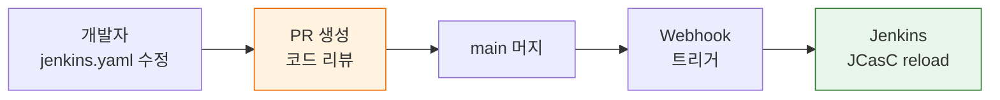
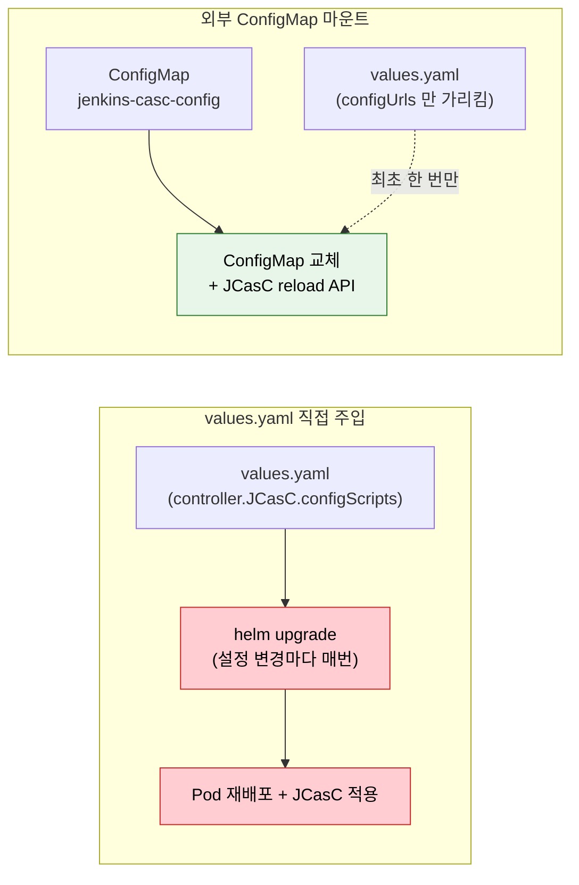

# JCasC 운영과 GitOps

---

> "파이프라인을 만드는 도구"가 아니라 재생산 가능한 운영 환경이어야 합니다.

## §학습 목표

> 이 문서를 읽고 나면 `jenkins.yaml` 의 SCM 저장 두 패턴(브랜치 분기 vs 변수 치환) 을 *상황별로 선택* 할 수 있고, Helm `values.yaml` 직접 주입과 외부 ConfigMap 마운트 두 방식의 *관리 위치 차이* 를 *비교* 할 수 있으며, 30분 안에 Jenkins Controller 를 재구축하기 위한 세 가지 전제 조건을 *설명* 할 수 있습니다.

## §사전 지식

> 본 문서는 "GitOps 워크플로우", "Helm 으로 컴포넌트 배포", "ConfigMap 마운트", "플러그인 버전 고정", "Pod 재시작 = 무상태 복구" 같은 일반 K8s/IaC 개념을 Jenkins JCasC 의 `jenkins.yaml`·`plugins.txt`·Helm Chart 단위로 좁혀 본 것입니다.

## 1. SCM 저장 패턴

> `jenkins.yaml` 의 SCM 저장 방식은 *환경 차이의 크기* 에 따라 두 갈래로 갈립니다. 브랜치 분기는 *구조 차이* 가 클 때, 단일 파일 + 변수 치환은 *값 차이* 만 있을 때입니다.

> `jenkins.yaml`을 Git에 올려야 변경 이력, PR 리뷰, 롤백이 가능해집니다. 환경 수에 따라 브랜치 전략과 단일 파일 전략 중 하나를 선택합니다.

`jenkins.yaml`을 로컬 파일시스템에만 두면 JCasC의 가치가 절반으로 줄어듭니다. Git 저장소에 올려야 변경 이력, PR 리뷰, 롤백이 가능해집니다. 저장소 구조는 팀의 환경 수에 따라 두 가지 방향으로 나뉩니다:

| 전략 | 적합한 경우 | 방식 |
|------|-----------|------|
| 브랜치 전략 | 환경 간 차이가 크고 YAML 구조 자체가 달라질 때 | `dev` 브랜치에 개발계, `main` 브랜치에 운영계 설정 관리 |
| 단일 파일 + 변수 치환 | 환경 간 차이가 작을 때 | `jenkins.yaml` 하나를 유지하되 `${ENV_NAME}`, `${JENKINS_URL}` 같은 환경변수로 차이 흡수 |

디렉토리 구조 예시는 다음과 같습니다:

```
jenkins-config/
├── jenkins.yaml          # JCasC 설정
├── plugins.txt           # 플러그인 목록 + 버전
├── jobs/                 # Job DSL 또는 Jobfile
│   ├── pipeline-a.groovy
│   └── pipeline-b.groovy
└── helm/
    └── values.yaml       # Helm 배포 값
```

- 이 구조에서 `jenkins.yaml`과 `plugins.txt`는 함께 관리합니다. 플러그인 버전이 바뀌면 설정 스키마도 달라질 수 있으므로, 두 파일은 항상 같은 커밋에서 변경되어야 일관성이 유지됩니다.

### GitOps 워크플로우

> *설정 변경 = 코드 배포* 라는 명제를 만드는 5단계 흐름입니다. PR 리뷰가 들어가는 자리가 *드리프트와 사고 예방의 단일 게이트* 입니다.

GitOps 워크플로우로 운영하면 Jenkins 설정 변경 절차가 코드 배포와 동일해집니다. 설정을 바꿔야 할 때는 브랜치를 만들고 `jenkins.yaml`을 수정한 뒤 PR을 올립니다. 팀원이 리뷰하고 승인하면 main 브랜치에 머지됩니다. CI가 머지를 감지하면 reload API를 호출하여 Jenkins에 변경 사항을 반영합니다.



- 자동 reload를 구현하는 간단한 방법은 저장소 웹훅과 Job을 연결하는 것입니다.
- `jenkins.yaml`이 포함된 저장소에 push 이벤트가 발생하면, Jenkins의 관리용 Job이 트리거되어 reload API를 호출합니다.
- Kubernetes 환경이라면 ArgoCD나 Flux 같은 GitOps 도구가 ConfigMap 변경을 감지하여 마운트 파일을 갱신하고, JCasC가 파일 변경을 자동으로 감지하도록 설정할 수도 있습니다.


## 2. Helm + JCasC 통합

> Kubernetes 환경의 표준은 *Helm 으로 Jenkins 배포 + `jenkins.yaml` 을 ConfigMap 으로 주입* 입니다. 주입 방식은 두 가지이고, *관리 위치* 가 다릅니다.

> Kubernetes 환경에서 Jenkins를 Helm으로 배포하면 `jenkins.yaml`을 ConfigMap으로 마운트하는 방식이 표준입니다.

Jenkins 공식 Helm 차트는 `controller.JCasC` 섹션을 통해 이 과정을 자동화합니다.

`values.yaml`에서 JCasC 설정을 직접 주입하는 방식은 다음과 같습니다:

```yaml
controller:
  JCasC:
    configScripts:
      jenkins-config: |
        jenkins:
          numExecutors: 2
          securityRealm:
            local:
              allowsSignup: false
              users:
                - id: "admin"
                  # 왜 변수 치환: 비밀번호를 values.yaml/Git 에 평문으로 두지 않고 환경에서 주입
                  password: "${JENKINS_ADMIN_PASSWORD}"
          authorizationStrategy:
            loggedInUsersCanDoAnything:
              allowAnonymousRead: false
        unclassified:
          location:
            url: "${JENKINS_URL}"
```

외부 `jenkins.yaml` 파일을 별도 ConfigMap으로 마운트하는 방식도 있습니다:

```yaml
controller:
  JCasC:
    configUrls:
      # 왜 configmap:// : Helm 릴리스와 분리해 ConfigMap 만 교체해도 reload 가능
      - "configmap://jenkins-casc-config/jenkins.yaml"
```

두 방식의 차이는 *관리 위치* 에 있습니다:

- `values.yaml` 직접 주입: Helm 릴리스 한 곳에서 모든 설정을 관리할 수 있습니다. 설정 변경 시 Helm upgrade가 필요합니다.
- 외부 ConfigMap 방식: 설정과 배포 파이프라인을 분리할 수 있습니다. Jenkins 설정만 바꿀 때 Helm upgrade 없이 ConfigMap만 교체하면 됩니다.

### 두 주입 방식의 관리 경계 한눈에

> *어떤 변경이 Helm upgrade 를 부르고, 어떤 변경이 ConfigMap 교체만으로 끝나는가* 를 한 그림으로 정리합니다.



> 빨간색은 *Pod 재시작 비용을 동반하는 경로* 입니다. `values.yaml` 직접 주입은 설정 한 줄 변경에도 Helm upgrade → Pod 재배포가 따라옵니다. 외부 ConfigMap 방식은 *최초 등록만 Helm* 이고 이후 변경은 ConfigMap 교체 + reload API 호출로 무중단입니다. 단 두 파일이 분리되므로 *어디에 어떤 키가 있는지* 추적 비용이 늘어납니다 — 팀 규모가 작으면 직접 주입, 변경 빈도가 높고 무중단이 필요하면 외부 ConfigMap.


## 3. 플러그인 버전 관리

> 재구축 시 *어제와 같은 환경* 을 만들려면 플러그인 버전이 고정돼야 합니다. `plugins.txt` 와 `plugin-installation-manager-tool` 의 결합이 이 고정의 SSOT 입니다.

> 플러그인 버전을 고정하지 않으면 재구축 시 최신 버전이 설치되어 기존 설정과 호환되지 않는 문제가 발생합니다.

`plugins.txt`에 버전을 명시하는 것이 재현 가능한 환경의 전제 조건입니다:

```text
kubernetes:4246.v5a_12b_c97c7e6
workflow-aggregator:596.v8c21c963d92d
git:5.2.1
configuration-as-code:1810.v9b_c30a_249a_4c
blueocean:1.27.9
```

`plugin-installation-manager-tool`을 사용하면 `plugins.txt`를 읽어 지정 버전을 설치합니다. Docker 이미지 빌드 시 이 도구를 활용하면 플러그인 버전까지 이미지에 고정됩니다:

```dockerfile
FROM jenkins/jenkins:2.440.3-lts-jdk17

# 왜 ref/plugins.txt 경로: jenkins-plugin-cli 가 ref/ 디렉토리를 기본 입력으로 인식
COPY plugins.txt /usr/share/jenkins/ref/plugins.txt
RUN jenkins-plugin-cli --plugin-file /usr/share/jenkins/ref/plugins.txt
```

플러그인 호환성 문제는 대부분 메이저 버전 업데이트 시 발생합니다. 대처 방법은 다음과 같습니다:

- 플러그인 업데이트는 dev 환경에서 먼저 검증한 후 `plugins.txt`에 반영합니다.
- JCasC export로 설정 스키마 변경 여부를 확인합니다.
- 플러그인 업데이트와 `jenkins.yaml` 변경은 같은 PR에서 진행합니다.


## 4. 운영 설계 원칙

> 본 절의 결론 한 줄은 *"Jenkins Controller 가 망가져도 30분 안에 동일한 환경을 재구축할 수 있어야 한다"* 입니다. 세 조건이 모두 갖춰져야 *상태를 유지해야 하는 서버* 가 *교체 가능한 컴포넌트* 로 바뀝니다.

> Jenkins Controller가 망가졌을 때 30분 안에 동일한 환경을 재구축할 수 있어야 합니다. 이 목표가 달성되면 Jenkins는 "상태를 유지해야 하는 서버"에서 "언제든 교체 가능한 컴포넌트"로 바뀝니다.

이 목표를 달성하는 데 필요한 세 가지 조건이 있습니다:

1. `jenkins.yaml`이 Git에 있어야 합니다 — 현재 상태를 언제든 재현할 수 있습니다.
2. `plugins.txt`가 버전을 고정해야 합니다 — 재구축 시 동일한 플러그인 환경이 보장됩니다.
3. 비밀값이 환경변수나 Secrets Manager로 분리되어야 합니다 — YAML 파일만으로는 재구축이 불완전합니다.

설정 변경을 PR로 강제하면 감사 추적이 자연스럽게 만들어집니다. "누가 언제 무엇을 왜 바꿨는지"가 Git 히스토리에 남습니다. 이것은 보안 감사, 장애 원인 분석, 신규 팀원 온보딩 모두에 가치가 있습니다. Jenkins를 운영하는 팀이 JCasC를 도입해야 하는 이유는 편의성이 아니라, 운영 환경의 신뢰성과 재현 가능성 때문입니다.

실제 운영에서 JCasC가 빛나는 순간은 장애 대응 상황입니다. Jenkins Controller가 응답하지 않아 Pod를 재시작해야 할 때, JCasC가 없으면 재시작 후 설정이 초기화된 Jenkins를 다시 클릭해가며 복구해야 합니다. JCasC가 있으면 Pod가 올라오면서 ConfigMap에 마운트된 `jenkins.yaml`을 읽어 자동으로 설정을 복원합니다. 다운타임이 Pod 재시작 시간으로 줄어든다는 뜻입니다.

---

## §면접 질문

> 자기 답을 떠올린 뒤 `§정답` 절을 펼쳐 비교합니다.

1. `jenkins.yaml` 의 SCM 저장에서 *브랜치 전략* 과 *단일 파일 + 변수 치환* 을 *어떤 신호* 로 갈라야 합니까?
2. Helm `values.yaml` 직접 주입과 외부 ConfigMap 마운트 중, *설정 변경 빈도가 높은 팀* 에 더 맞는 쪽은 무엇이고 왜 그렇습니까?
3. `plugins.txt` 와 `jenkins.yaml` 을 *같은 커밋에서 변경* 해야 하는 이유는 무엇입니까?
4. Jenkins Controller 30분 재구축의 세 전제 조건 중 *하나라도 빠지면* 어떤 사고가 납니까?

## §정답

### Q1 정답

신호는 *환경 간 YAML 구조 차이의 크기* 입니다. (a) **브랜치 전략** — dev/prod 가 사용하는 securityRealm 자체가 다르거나(예: dev=local user, prod=LDAP), authorizationStrategy 트리 자체가 다르면 구조 차이가 큰 신호. 브랜치별 YAML 이 자연스럽고 머지 시점에 PR 리뷰가 *구조 변화* 를 잡아냄. (b) **단일 파일 + 변수** — URL·라벨·executor 수 같은 *값만* 다르고 트리는 동일하면 `${JENKINS_URL}`·`${DEFAULT_AGENT_LABEL}` 치환으로 충분. 한 파일이라 *환경 간 의도된 차이* 가 한눈에 보임. 구조 차이가 크지 않은데 브랜치를 갈라두면 두 브랜치가 표류해 사고로 이어집니다.

### Q2 정답

**외부 ConfigMap 마운트** 가 더 맞습니다. `values.yaml` 직접 주입은 설정 한 줄을 바꿔도 *Helm upgrade → Pod 재배포* 가 따라오므로 변경마다 *Jenkins 다운타임* 이 발생합니다. 외부 ConfigMap 은 최초 등록만 Helm 으로 하고, 이후 변경은 ConfigMap 교체 + JCasC reload API 호출 한 번으로 *무중단 재적용* 이 가능합니다. 단 *파일이 두 곳* 으로 분리되므로 *어느 키가 어디 있는지* 의 추적 비용이 늘어 — 변경 빈도가 *낮고* 팀 규모가 작으면 직접 주입이 단순합니다.

### Q3 정답

플러그인 버전이 바뀌면 *그 플러그인이 제공하는 설정 스키마 자체* 가 달라질 수 있기 때문입니다. 예를 들어 `git` 플러그인의 메이저 업데이트로 `git` 섹션의 자식 키 이름이 바뀌면 — 옛 `jenkins.yaml` 그대로 + 새 `plugins.txt` 로 빌드하면 reload 시점에 `ConfiguratorException` 으로 *Jenkins 전체 설정 적용이 실패* 합니다. 같은 커밋에 두면 (a) PR 리뷰가 *둘의 정합성* 을 동시에 검증하고, (b) 롤백이 *한 커밋 revert* 로 깔끔합니다.

### Q4 정답

각 조건이 빠질 때마다 다른 사고가 납니다. (a) **`jenkins.yaml` 이 Git 에 없음** → Controller 재시작 시 *어제 설정* 을 재현할 SSOT 가 없어 사람이 클릭으로 복구. 30분 → 수 시간. (b) **`plugins.txt` 버전 고정 없음** → 재구축 시 *최신 버전* 이 설치되어 기존 `jenkins.yaml` 과 스키마 충돌, reload 실패. (c) **비밀값이 YAML 안에 평문** → 재구축은 되지만 *Git 에 시크릿이 박힘* — Git 노출 한 번이면 시크릿 전체 회전 비용이 발생. 셋 모두 갖춰야 *상태를 유지해야 하는 서버* 에서 *교체 가능한 컴포넌트* 로 전환됩니다.
