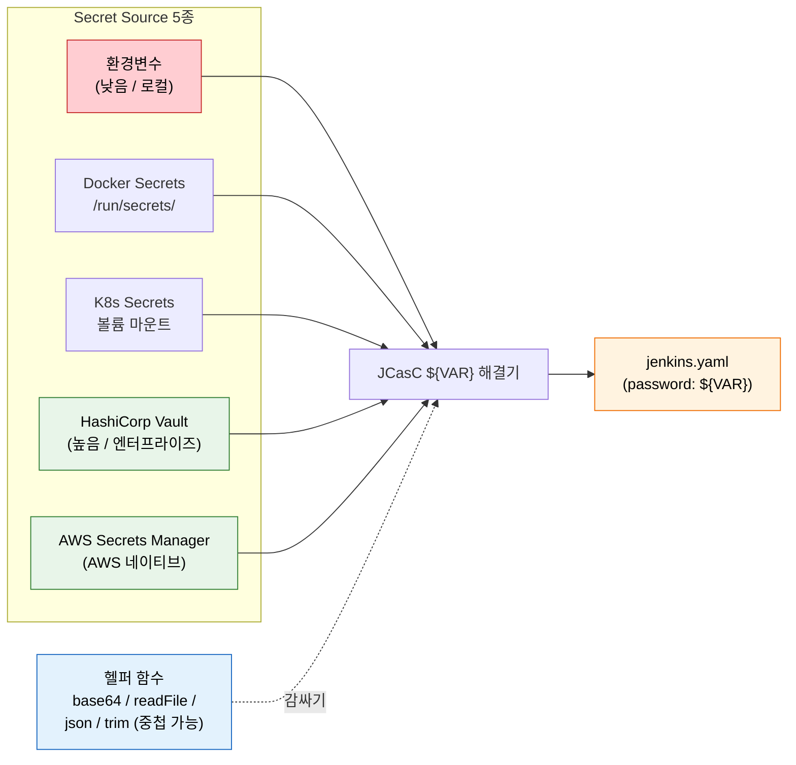
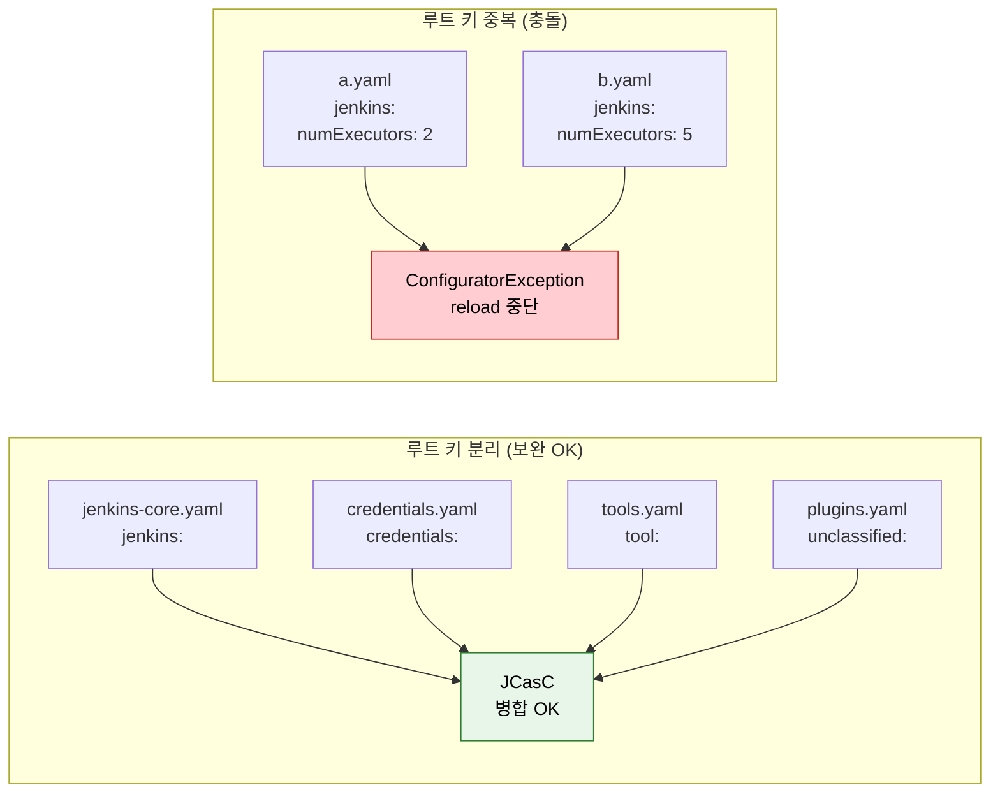

# JCasC 시크릿과 실전 패턴

---

> JCasC에서 비밀값을 안전하게 주입하는 다섯 가지 방법과, 설정 파일을 분할·검증·자동화하는 실전 패턴을 다룹니다.

## §학습 목표

> 이 문서를 읽고 나면 JCasC Secret Source 5종을 *보안 수준·운영 복잡도* 축에서 *비교* 할 수 있고, `${VAR}` 의 헬퍼 함수(base64·readFile·json·trim) 를 *중첩* 해 파일 → 인코딩 흐름을 *구성* 할 수 있으며, Reload API 4방식 중 *Webhook 자동화에 적합한* 채널을 *선택* 할 수 있고, Strict Secret Resolution 을 *왜 운영에서 반드시 켜야 하는지* 를 *설명* 할 수 있습니다.

## §사전 지식

> 본 문서는 "변수 치환 + 헬퍼 함수 중첩", "디렉토리 기반 다중 YAML 합성", "Webhook reload 자동화", "drift 감지(export → diff)", "fail-fast 설정 게이트" 같은 일반 운영 패턴을 JCasC 의 `${VAR}`·`CASC_JENKINS_CONFIG`·reload endpoint·`CASC_STRICT_SECRET_RESOLUTION` 단위로 좁혀 본 것입니다.

## 1. Secret Source 전체 구조

> 본 절은 비밀값 주입 경로 5종과 헬퍼 함수의 *조합 가능성* 을 다룹니다. 선택은 *환경 + 보안 요구 + 팀 규모* 의 곱으로 결정됩니다.

> 비밀값을 주입하는 경로는 환경변수, Docker Secrets, K8s Secrets, HashiCorp Vault, AWS Secrets Manager 다섯 가지이며, 각각 보안 수준과 운영 복잡도가 다릅니다.

JCasC는 `${VAR}` 문법으로 비밀값을 주입합니다. YAML 파일에 평문 비밀값을 직접 쓰는 대신, 실행 시점에 외부 소스에서 값을 읽어 치환하는 방식입니다. 기본값 문법은 `${VALUE:-defaultvalue}`이며, 변수가 해결되지 않을 때 대신 사용할 값을 지정할 수 있습니다. 리터럴 `${`를 출력해야 할 때는 `^${VAR}` 형태로 이스케이프합니다.

비밀값 소스는 운영 환경과 보안 요구 수준에 따라 선택합니다:

| Source | 보안 수준 | 운영 복잡도 | 적합 환경 | 비고 |
|--------|----------|-----------|---------|------|
| 환경변수 | 낮음 | 낮음 | 로컬/PoC | Jenkins 관리자에게 노출 가능 |
| Docker Secrets | 중간 | 낮음 | Docker Compose | `/run/secrets/` 자동 매핑 |
| K8s Secrets | 중간 | 중간 | Kubernetes | 볼륨 마운트 필요 |
| HashiCorp Vault | 높음 | 높음 | 엔터프라이즈 | AppRole/Token/UserPass 인증 |
| AWS Secrets Manager | 높음 | 중간 | AWS 환경 | 플러그인 필요 |

JCasC는 변수 값을 변환하는 헬퍼 함수도 제공합니다. 파일에서 읽은 값을 인코딩하거나, JSON 구조에서 특정 필드만 추출하는 용도로 사용합니다:

| 헬퍼 | 기능 | 예시 |
|------|------|------|
| `base64` | Base64 인코딩 | `${base64:HELLO}` |
| `decodeBase64` | Base64 디코딩 | `${decodeBase64:SEVMTE8=}` |
| `readFile` / `file` | 파일 내용 읽기 | `${readFile:/secret/token.txt}` |
| `readFileBase64` / `fileBase64` | 바이너리 파일을 Base64로 | `${fileBase64:/secret/cert.p12}` |
| `json` | JSON에서 값 추출 | `${json:username:${ENV_VAR}}` |
| `trim` | 공백 제거 | `${trim:${readFile:/secret/pass.txt}}` |

헬퍼는 중첩하여 사용할 수 있습니다. 파일 내용을 읽은 뒤 Base64로 인코딩하는 예시는 다음과 같습니다:

```
${base64:${readFile:/secret/file.txt}}
```

### 시크릿 주입 경로 한눈에

> 5종 Source 가 JCasC `${VAR}` 해결기에 어떻게 도달하는지를 한 그림으로 정리합니다. 선택 신호는 *환경 + 보안 요구* 입니다.



> 빨간색은 *운영 부적합* 채널(환경변수 = 로컬/PoC 한정), 초록색은 *높은 보안 수준*, 파란색은 *값 변환 보조* 입니다. 5종 중 어느 것을 골라도 같은 `${VAR}` 해결기로 들어가므로 *나중에 Source 를 바꿔도 YAML 본문은 그대로* 입니다 — 이게 JCasC 시크릿 외부화의 핵심 이득입니다.


## 2. 실습: Docker Secrets 기반 JCasC

> 본 절은 Docker Compose 의 `/run/secrets/*` 자동 매핑이 *별도 플러그인 없이* JCasC 의 `${KEY}` 와 1:1 로 묶이는 패턴을 다룹니다.

> Docker Compose 환경에서 secrets 디렉토리에 파일을 마운트하고, JCasC가 파일명으로 자동 치환하는 과정을 실습합니다.

Docker Secrets를 사용하면 `/run/secrets/${KEY}` 경로에 마운트된 파일이 JCasC의 `${KEY}` 변수로 자동으로 치환됩니다. 별도 플러그인 없이 파일명이 변수명이 되는 자동 매핑 방식입니다. 기본 경로를 변경하려면 `SECRETS` 환경변수로 다른 디렉토리를 지정할 수 있습니다.

Docker Compose 파일 예시는 다음과 같습니다:

```yaml
version: "3.8"
services:
  jenkins:
    image: jenkins/jenkins:2.440.3-lts-jdk17
    environment:
      # 왜 디렉토리: 다중 YAML 합성 패턴(§3) 을 같이 적용하기 위함
      CASC_JENKINS_CONFIG: /var/jenkins_home/casc.d/
    secrets:
      - jenkins_admin_password
      - github_token
    volumes:
      - ./casc.d:/var/jenkins_home/casc.d:ro
    ports:
      - "8080:8080"

secrets:
  jenkins_admin_password:
    file: ./secrets/admin_password.txt
  github_token:
    file: ./secrets/github_token.txt
```

`jenkins.yaml`에서 Docker Secrets를 참조하는 방식은 다음과 같습니다:

```yaml
jenkins:
  securityRealm:
    local:
      allowsSignup: false
      users:
        - id: "admin"
          # /run/secrets/jenkins_admin_password 파일이 자동 매핑됨
          password: ${jenkins_admin_password}
```

실습 절차는 다음 순서로 진행합니다:

1. `echo "mypassword" > secrets/admin_password.txt`로 시크릿 파일을 생성합니다.
2. `docker compose up -d`로 Jenkins를 시작합니다.
3. `admin/mypassword`로 로그인하여 정상 동작을 확인합니다.
4. 시크릿 파일 내용을 새 비밀번호로 변경합니다.
5. reload API를 호출하여 변경 사항을 반영합니다.
6. 새 비밀번호로 로그인이 되는지 확인합니다.


## 3. 실습: 다중 YAML 설정 소스

> 본 절은 디렉토리 기반 다중 YAML 합성의 *덮어쓰기가 아닌 보완* 동작을 다룹니다. 충돌 회피의 핵심은 *루트 키 단위 파일 분리* 입니다.

> `CASC_JENKINS_CONFIG`에 디렉토리를 지정하면 JCasC가 모든 YAML 파일을 재귀적으로 수집하여 병합합니다. 단, 파일 간 같은 키를 선언하면 `ConfiguratorException`이 발생합니다.

`CASC_JENKINS_CONFIG`는 단일 파일 경로, 디렉토리 경로, URL을 모두 허용합니다. 디렉토리를 지정하면 하위 YAML 파일 전체를 읽어 하나의 설정으로 병합합니다. 환경변수를 지정하지 않으면 `$JENKINS_HOME/jenkins.yaml`을 기본값으로 사용합니다.

설정을 역할별로 분리하면 관리가 편해집니다. 아래 구조처럼 루트 키 단위로 파일을 나누는 것이 충돌을 막는 가장 확실한 방법입니다:

```
casc.d/
├── jenkins-core.yaml    # jenkins: 섹션
├── credentials.yaml     # credentials: 섹션
├── tools.yaml           # tool: 섹션
└── plugins.yaml         # unclassified: 섹션
```

### 다중 YAML 합성 — 보완 vs 충돌

> *어떤 분할이 안전하고 어떤 분할이 ConfiguratorException 을 부르는가* 를 한 그림으로 정리합니다.



> 초록색은 *서로 다른 루트 키* 라 충돌이 일어날 수 없는 구조. 빨간색은 *같은 `jenkins.numExecutors`* 가 두 파일에 동시에 등장 — JCasC 는 *오버라이드가 아닌 보완 합성* 이라 둘을 합칠 방법이 없어 reload 자체가 중단됩니다.

에이전트 템플릿처럼 반복되는 설정은 YAML 앵커로 중복을 제거할 수 있습니다:

```yaml
# 왜 앵커: 같은 템플릿이 여러 노드에 중복되지 않게 한 곳에 정의 + alias 로 재사용
x-agent-template: &agent_template
  remoteFS: "/home/jenkins"
  launcher:
    inbound:
      workDirSettings:
        disabled: true

jenkins:
  nodes:
    - permanent:
        name: "agent-1"
        <<: *agent_template
    - permanent:
        name: "agent-2"
        <<: *agent_template
```

주의할 점은 다중 파일이 "덮어쓰기"가 아닌 "보완" 방식으로 병합된다는 것입니다. 두 파일이 같은 `jenkins.numExecutors` 키를 선언하면 `ConfiguratorException`이 발생하여 reload가 중단됩니다. 충돌을 피하려면 루트 키(`jenkins`, `tool`, `unclassified`, `credentials`) 단위로 파일을 나눠 각 파일이 서로 다른 루트 키를 담당하도록 분리합니다.


## 4. 실습: Reload API 4가지 방식

> 본 절은 reload 4채널의 *인증 방식과 자동화 적합도* 를 비교합니다. Token 기반이 Webhook 자동화의 표준 선택입니다.

> 설정 변경 후 Jenkins를 재시작하지 않고 반영하는 네 가지 경로를 비교합니다.

| 방식 | 인증 | 용도 | 명령어 |
|------|------|------|------|
| Token 기반 | `CASC_RELOAD_TOKEN` 환경변수 | Webhook/CI 자동화 | `curl -X POST "JENKINS_URL/reload-configuration-as-code/?casc-reload-token=TOKEN"` |
| API Token 기반 | 사용자 인증 + CRUMB | 수동 reload | `curl -X POST -u admin:API_TOKEN "JENKINS_URL/configuration-as-code/reload"` |
| YAML POST | 사용자 인증 | 외부 YAML 직접 주입 | `curl -X POST -u admin:TOKEN --data-binary @jenkins.yaml "JENKINS_URL/configuration-as-code/configure"` |
| CLI | Jenkins CLI | 스크립트 자동화 | `java -jar jenkins-cli.jar -s JENKINS_URL reload-jcasc-configuration` |

Token 기반 방식이 CI/webhook 자동화에 가장 적합한 이유는 별도 사용자 인증 없이 토큰만으로 reload를 호출할 수 있기 때문입니다. CRUMB 처리나 API 토큰 발급 없이 `CASC_RELOAD_TOKEN` 환경변수 하나로 webhook을 연결할 수 있어 구성이 단순합니다.

YAML POST 방식은 다른 세 가지와 성격이 다릅니다. Git에 저장된 YAML을 reload하는 것이 아니라, 호출 시점에 직접 전달한 YAML 내용을 Jenkins에 밀어넣습니다. 외부 시스템에서 동적으로 생성한 설정을 주입할 때 유용하지만, Git과 Jenkins 상태가 달라질 수 있으므로 주의가 필요합니다.


## 5. 실습: export → diff 드리프트 감지

> 본 절은 *YAML SSOT 와 Jenkins 실제 상태의 괴리를 조기에 발견하는* 자동화 패턴을 다룹니다. 핵심 노이즈는 *기본값 포함 export* 입니다.

> Jenkins의 현재 상태를 주기적으로 export하고 Git의 `jenkins.yaml`과 비교하면 UI 변경에 의한 드리프트를 조기에 발견할 수 있습니다.

드리프트 감지의 기본 개념은 간단합니다. Jenkins 현재 상태를 export API로 추출한 뒤, Git에 커밋된 `jenkins.yaml`과 diff를 비교하여 차이가 있으면 알림을 보냅니다. 이를 매일 새벽에 자동 실행하는 Jenkinsfile 예시는 다음과 같습니다:

```groovy
pipeline {
    agent any
    triggers { cron('H 3 * * *') }  // 왜 새벽: 운영 트래픽이 가장 적은 시간대에 실행

    environment {
        JENKINS_API_TOKEN = credentials('jenkins-api-token')
    }

    stages {
        stage('Export') {
            steps {
                sh '''
                    curl -sSf -u "admin:${JENKINS_API_TOKEN}" \
                      "${JENKINS_URL}/configuration-as-code/export" \
                      > exported.yaml
                '''
            }
        }
        stage('Diff') {
            steps {
                sh '''
                    # 왜 || true: diff 가 차이 있을 때 비0 종료 → 그대로 두면 stage 실패
                    DIFF=$(diff jenkins.yaml exported.yaml || true)
                    if [ -n "$DIFF" ]; then
                        echo "⚠️ 설정 드리프트 감지"
                        echo "$DIFF"
                        exit 1  # 의도적으로 실패시켜 post failure 알림 트리거
                    fi
                '''
            }
        }
    }

    post {
        failure {
            echo '설정 드리프트가 감지되었습니다. jenkins.yaml과 실제 상태를 확인하세요.'
        }
    }
}
```

주의할 점은 export 결과에 `jenkins.yaml`에 명시하지 않은 기본값들이 포함된다는 것입니다. 플러그인이 기본값으로 사용하는 필드까지 모두 출력되므로, diff에 노이즈가 섞입니다. 현실적인 대응 방법은 자신이 명시적으로 관리하는 섹션에서만 드리프트를 확인하는 것입니다. 예를 들어 `jenkins.securityRealm`, `jenkins.authorizationStrategy`, `credentials` 섹션만 추출하여 비교하면 노이즈를 줄일 수 있습니다.


## 6. Strict Secret Resolution

> 본 절의 결론은 *운영에서는 반드시 strict 모드 ON* 입니다. 기본 동작(미해결 → 빈 문자열) 은 *관리자 비밀번호 공백화* 같은 침묵성 사고를 부릅니다.

> 미해결 시크릿을 빈 문자열로 대체하는 기본 동작은 운영 사고를 유발할 수 있습니다. strict 모드를 활성화하면 시크릿이 하나라도 해결되지 않으면 reload가 중단됩니다.

JCasC의 기본 동작은 `${VAR}` 변수를 해결하지 못하면 빈 문자열로 조용히 대체하는 것입니다. 이 동작은 위험합니다. 예를 들어 `JENKINS_ADMIN_PASSWORD` 환경변수가 설정되지 않은 상태에서 reload하면 관리자 비밀번호가 빈 문자열이 되어 누구나 로그인할 수 있는 상태가 됩니다.

strict 모드는 다음 두 가지 방법으로 활성화합니다:

```bash
# 환경변수로 활성화
CASC_STRICT_SECRET_RESOLUTION=true

# Java 시스템 속성으로 활성화
-Dcasc.strict.secret.resolution=true
```

strict 모드가 활성화되면 기본값 없이 선언된 변수 중 하나라도 해결되지 않으면 reload 전체가 중단됩니다. 비밀값 누락이 조용히 반영되는 대신, 명시적인 오류로 즉시 드러납니다. **운영 환경에서는 항상 strict 모드를 활성화**해야 합니다.

기본값 문법은 strict 모드에서도 그대로 동작합니다. `${VAR:-fallback_value}` 형태로 선언한 변수는 `VAR`가 해결되지 않아도 `fallback_value`를 사용하므로 strict 모드 위반에 해당하지 않습니다. 필수 시크릿은 기본값 없이, 선택적 시크릿은 기본값과 함께 선언하는 방식으로 두 요구사항을 함께 충족할 수 있습니다.

---

## 면접 질문

> 자기 답을 떠올린 뒤 `정답` 절을 펼쳐 비교합니다.

1. JCasC 헬퍼 함수의 *중첩 가능성* 이 왜 중요합니까? `${base64:${readFile:/secret/cert.p12}}` 같은 패턴이 실무에서 어디에 쓰입니까?
2. Docker Secrets 의 `/run/secrets/${KEY}` 자동 매핑이 *별도 플러그인 없이* 동작하는 이유는 무엇이며, 같은 패턴을 K8s Secrets 에 적용하려면 어떻게 다릅니까?
3. 다중 YAML 합성에서 *루트 키 단위 분리* 가 충돌 회피의 표준이 된 이유는 무엇입니까?
4. Reload API 4채널 중 *Token 기반* 이 Webhook 자동화 표준인 이유 두 가지를 말할 수 있습니까?
5. Strict 모드를 켜지 않은 상태에서 `JENKINS_ADMIN_PASSWORD` 환경변수가 누락되면 *정확히 어떤 보안 사고* 가 발생합니까?

## 정답

### 정답 1 — 헬퍼 함수 중첩 가능성

중첩 가능성은 *Source 와 변환을 같은 표현식 안에서 합성* 하게 해 줍니다. 실무 예시 — (a) **바이너리 인증서 주입**: `${base64:${readFile:/secret/cert.p12}}` — Vault/K8s 가 파일로 마운트한 PKCS#12 인증서를 base64 로 인코딩해 YAML 의 한 필드에 넣음. (b) **JSON 시크릿에서 필드 추출**: `${json:password:${readFile:/secret/cred.json}}` — Vault dynamic secret 처럼 JSON 으로 떨어지는 값에서 password 필드만 뽑음. (c) **공백 제거**: `${trim:${readFile:/secret/token.txt}}` — `echo "..." >` 로 만들어진 파일의 trailing newline 제거. 중첩이 없으면 같은 처리를 *Pod init container* 같은 외부 단계에 빼야 해서 운영 복잡도가 늘어납니다.

### 정답 2 — Docker vs K8s Secrets 매핑

Docker Compose 가 `secrets:` 블록 마운트 결과를 *항상 `/run/secrets/<name>`* 경로에 두기 때문이고, JCasC 가 *기본 Secret Source 중 하나로 그 경로를 자동 스캔* 하기 때문입니다. 파일명이 곧 변수명이라 별도 매핑 코드 없이 `${jenkins_admin_password}` 가 풀립니다. K8s Secrets 도 같은 패턴을 쓸 수 있지만 *볼륨 마운트를 명시적으로 선언* 해야 합니다 — Pod spec 에서 `volumeMounts` + `volumes.secret` 으로 Secret 을 `/run/secrets/` 또는 임의 경로에 마운트하면, 그 경로를 `SECRETS` 환경변수로 알려 줘서 JCasC 가 인식하게 합니다. Docker 는 *자동*, K8s 는 *명시 마운트 + 경로 통보* 가 차이입니다.

### 정답 3 — 루트 키 단위 분리

JCasC 의 다중 파일 합성이 *덮어쓰기가 아닌 보완* 이기 때문입니다. 같은 키가 두 파일에 등장하면 JCasC 는 *어느 쪽을 채택해야 할지* 결정 규칙이 없어 `ConfiguratorException` 으로 reload 자체를 중단시킵니다. 루트 키(`jenkins`/`tool`/`unclassified`/`credentials`) 단위로 파일을 나누면 *각 파일이 서로 다른 루트 키를 책임* 하므로 같은 키 충돌이 구조적으로 불가능해집니다. 같은 책임 영역을 다시 쪼개야 하면 *값 단위 변수 치환* + *YAML 앵커* 로 해결합니다.

### 정답 4 — Token 기반 Reload

(a) **인증 단순화** — 사용자 API token + CRUMB 처리가 필요 없고 `casc-reload-token` 쿼리 파라미터만 있으면 끝. Webhook 호출자(GitHub/GitLab) 는 토큰만 알면 됨. (b) **CI 자동화 친화** — `curl -X POST` 한 줄로 끝나는 stateless 호출이라 CI 스크립트·webhook receiver 어느 쪽에 박아도 동작. API token 방식은 사용자 식별이 필요해 *서비스 계정 + 토큰 회전* 까지 운영 부담이 추가됩니다. 단 Token 기반의 *노출 위험* (보안 답변 Q4-심화) 은 별개 — 네트워크 ACL + 토큰 회전이 함께 가야 합니다.

### 정답 5 — strict 모드와 빈 비밀번호

*관리자 비밀번호가 빈 문자열* 이 됩니다. JCasC 가 미해결 `${VAR}` 을 빈 문자열로 조용히 대체하기 때문에 `users[admin].password: ""` 가 되어 *Jenkins 가 admin/빈 비밀번호 로그인을 허용* 합니다. 결과적으로 *누구나 admin 권한으로 로그인 가능* 한 상태가 일정 시간 동안 노출됩니다. 더 나쁜 건 이 상태가 *에러 없이 reload 성공* 으로 보이므로 운영자가 인지를 못 한다는 점입니다. strict 모드는 정확히 이 시나리오를 막기 위해 *미해결 시 reload 자체를 중단* 시킵니다 — *침묵 사고를 명시적 실패로 바꾸는 fail-fast 게이트* 입니다.

## 관련 문서

> 시크릿 실전 패턴은 도입 변수화(02-01)·운영 reload(02-02) 위에 서고, 시크릿 격리 모델(01-02)·K8s Secrets 마운트(05_operations)와 맞물립니다.

- [02-01. 설정을 코드로 — JCasC](02-01.설정을%20코드로%20%E2%80%94%20JCasC.md) § "${VAR} 치환" — 시크릿 외부화의 기반
- [02-02. JCasC 운영과 GitOps](02-02.JCasC%20운영과%20GitOps.md) § "환경별 분리·reload" — Reload 4채널(정답 4) 운영
- [01-02. 시크릿 관리와 최소 권한 원칙](01-02.시크릿%20관리와%20최소%20권한%20원칙.md) § "Credentials Provider" — 외부 Vault·strict(정답 5) 권한 모델
- [../05_operations/02-06. GCP K8s Jenkins 실전](../05_operations/02-06.GCP%20K8s%20Jenkins%20실전.md) § "K8s Secrets" — K8s Secrets 명시 마운트(정답 2)
