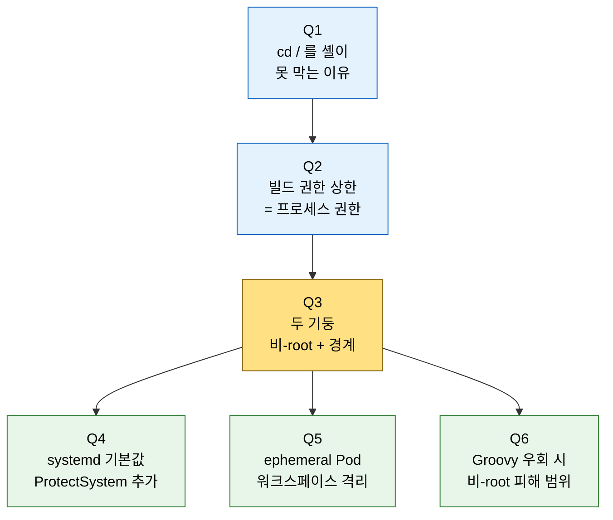

# 6단계 점검 — 프로세스·파일시스템 격리 핵심 질문

---

> 이 점검 문서는 03장(프로세스·파일시스템 격리) 을 다 읽은 뒤 스스로를 시험하기 위한 자가 점검입니다. 먼저 §면접 질문만 보고 답을 떠올린 뒤, §정답 절에서 같은 번호로 대조하세요.
> 다루는 문서: `03-01.프로세스·파일시스템 격리 — 워킹 디렉토리 밖으로 못 나가게`

## §학습 목표

> 이 질문들에 막힘 없이 답할 수 있으면 03장 본편 학습이 끝난 것으로 봅니다. 막힌 질문은 본문 해당 절로 돌아가 다시 읽고 다음 회차 복습으로 가져갑니다.

## §사전 지식

> 본 점검은 "비-root 실행", "워킹 디렉토리 격리", "read-only 파일시스템", "최소 권한", "피해 범위 한정(blast radius)" 같은 일반 보안 개념을 Jenkins 의 systemd `ProtectSystem`·Docker `--read-only`·Kubernetes `securityContext`·ephemeral agent Pod 단위로 좁혀 본 형태입니다. 셸 한 줄 안쪽 위생은 [01_core/02-05](../01_core/02-05.sh%20step%20셸%20실행%20위생.md) 에서 먼저 봅니다.

## §질문 흐름 한눈에

> Q3(두 기둥) 이 허브입니다. Q1·Q2 가 *왜 격리가 필요한가* 를 세우고, Q4·Q5·Q6 이 *어느 환경에서 어떻게 구현·작동하는가* 로 뻗습니다.

## 면접 질문

> 자기 답을 떠올린 뒤 `정답` 절을 펼쳐 비교합니다.

1. `set -euo pipefail` 을 다 켜도 `cd /` 를 못 막는 이유는 무엇입니까?
2. 빌드가 시스템을 망가뜨릴 수 있는 권한 상한이 왜 Jenkins 프로세스의 권한과 같습니까?
3. 비-root 실행과 워킹 디렉토리 경계는 각각 무엇을 막으며, 왜 둘을 함께 둬야 합니까?
4. systemd 패키지 기본 unit 에 `ProtectSystem=strict` 이 들어 있습니까? `ProtectSystem=strict` + `ReadWritePaths=` 는 무엇을 구현합니까?
5. 쿠버네티스 ephemeral agent Pod 가 워크스페이스 잔류를 *구조적으로* 막는 원리는?
6. Groovy 샌드박스 우회로 `Runtime.exec("rm -rf /")` 가 실행됐을 때, 비-root 컨트롤러는 어느 피해까지 가둡니까?

## 정답

### 정답 1

`set -e` 는 실패(비0 종료) 를, `set -u` 는 미설정 변수를 잡습니다. `cd /` 는 루트가 항상 존재하므로 *정상 성공* 하는 명령이라 두 옵션의 발동 조건이 없습니다. 이건 의도 오류라, 셸이 아니라 코드 리뷰·린트가 잡거나, 근본적으로는 Jenkins 프로세스가 루트에 쓸 권한을 갖지 않게 만들어 막습니다.

### 정답 2

Jenkins Controller Isolation 문서가 "built-in node 빌드는 Jenkins 프로세스와 동일한 수준으로 컨트롤러 파일시스템에 접근한다" 고 명시합니다. 빌드가 프로세스의 권한을 *물려받기* 때문입니다. 그래서 프로세스 권한을 낮추는 것이 빌드 피해 범위를 낮추는 직접 수단입니다.

### 정답 3

비-root 실행은 빌드가 시스템 파일을 *읽거나 지우는 것* 을 막고(권한 없음), 워킹 디렉토리 경계는 *쓰기 가능 영역을 JENKINS_HOME·워크스페이스로 한정* 합니다. 둘을 함께 둬야 하는 이유는 — 비-root 만으로는 그 유저가 쓰기 권한을 가진 다른 경로가 위험하고, 경계만으로는 root 로 도는 한 우회당할 수 있기 때문입니다. 함께 두면 피해가 워킹 디렉토리로 좁혀집니다.

### 정답 4

들어 있지 않습니다. 패키지 기본 unit 의 보안 지시어는 `User=`·`Group=`·`WorkingDirectory=` 뿐이고, `ProtectSystem`·`PrivateTmp`·`NoNewPrivileges` 는 `systemctl edit` 으로 직접 추가합니다(systemd 일반 기능). `ProtectSystem=strict` 이 루트를 read-only 로 마운트하고, `ReadWritePaths=/var/lib/jenkins` 가 JENKINS_HOME 만 쓰기 예외로 엽니다 — "루트 read-only + 워킹 디렉토리만 쓰기" 경계입니다.

### 정답 5

Kubernetes 플러그인이 빌드마다 새 agent Pod 를 만들고 종료 시 즉시 삭제합니다. 워크스페이스는 `emptyDir` 같은 임시 볼륨에 격리되어 Pod 와 함께 사라지므로, 빌드 간 워크스페이스 잔류가 구조적으로 불가능합니다. `cd` 실패로 직전 워크스페이스에 머무는 사고도 그 Pod 안으로 갇힙니다.

### 정답 6

비-root 컨트롤러는 시스템 파일을 삭제할 권한이 없으므로, OS 가 `rm -rf /` 를 거부합니다. 피해가 Jenkins 프로세스 소유 파일(워킹 디렉토리)로 국한되고, `/etc/passwd`·타 서비스 비밀·루트 소유 파일은 손대지 못합니다. 취약점은 패치(Script Security 1.50 등)로 막고, 패치 전 피해는 비-root 격리가 가두는 이중 방어입니다.
