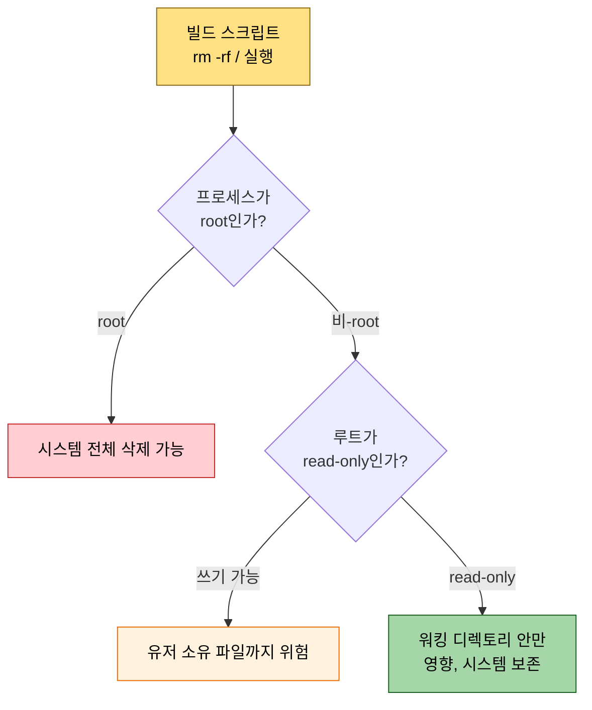
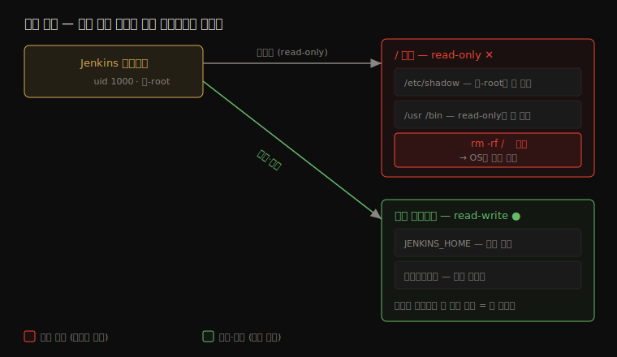

# 프로세스·파일시스템 격리 — 워킹 디렉토리 밖으로 못 나가게

---

> Jenkins 빌드가 `cd /` 나 `rm -rf /` 같은 명령을 실행해도 시스템이 망가지지 않도록, Jenkins 프로세스를 *비-root 로 실행* 하고 *워킹 디렉토리 안에만 가두는* 방법을 systemd·Docker·Kubernetes 세 환경으로 나눠 다룹니다. 셸 위생으로 못 막는 위험을 한 층 밖에서 막는 것이 핵심입니다.

## §학습 목표

> 이 문서를 읽고 나면 *왜 셸 옵션(`set -e`)으로는 `cd /` 를 못 막는지* 를 한 문장으로 설명할 수 있고, 비-root 실행과 워킹 디렉토리 격리가 *어떤 피해를 어떻게 줄이는지* 구분할 수 있으며, systemd `ProtectSystem=strict`·Docker `--read-only`·Kubernetes `securityContext` 가 각각 *무엇을 막는지* 답할 수 있습니다. 나아가 CVE-2024-23897·Groovy 샌드박스 우회 같은 실제 사고에서 *비-root 프로세스가 피해를 어디까지 가뒀을지* 예측할 수 있습니다.

## §사전 지식

> 본 문서는 [01_core/02-05 sh step 셸 실행 위생](../01_core/02-05.sh%20step%20셸%20실행%20위생.md) 의 후속입니다. 그 문서가 *셸 한 줄 안쪽* 의 위생(`set -euo pipefail`, 빈 변수 확장, `cd` 실패)을 다뤘다면, 이 문서는 그 셸을 실행하는 *Jenkins 프로세스를 OS 레벨에서 가두는* 한 층 바깥을 다룹니다. 최소 권한 원칙의 기본 개념은 [01-02 시크릿 관리와 최소 권한 원칙](01-02.시크릿%20관리와%20최소%20권한%20원칙.md) 에서 먼저 보고 오면 이해가 빠릅니다.

> **공식 문서 내 위치**: Jenkins 공식 보안 문서([jenkins.io/doc/book/security](https://www.jenkins.io/doc/book/security/)) 는 14개 주제로 나뉩니다. 이 문서는 그중 *Controller Isolation*(컨트롤러 격리) 과 *Securing Builds*(빌드 격리) 두 페이지를 프로세스·파일시스템 관점으로 좁혀 다룹니다. 인증·인가(Access Control) 는 [01-01 인증과 인가](01-01.인증과%20인가%20—%20누가%20무엇을%20할%20수%20있는가.md), 시크릿·자격증명(Credentials) 은 [01-02](01-02.시크릿%20관리와%20최소%20권한%20원칙.md)·[02-03](02-03.JCasC%20시크릿과%20실전%20패턴.md) 이 담당합니다. CSRF·CSP·환경변수 주입 등 나머지 주제는 이 문서 범위 밖입니다 — 보안 전체가 아니라 *빌드가 시스템을 망가뜨릴 범위를 좁히는* 한 조각입니다.


## 1. 왜 셸 안에서는 `cd /` 를 못 막는가

> 본 절은 *셸 위생의 한계* 를 짚습니다. 핵심은 `cd /` 가 셸 입장에서 실패도 미설정도 아닌 *정상 명령* 이라, 셸 옵션이 발동할 근거가 없다는 점입니다.

[02-05 §3](../01_core/02-05.sh%20step%20셸%20실행%20위생.md) 에서 본 대로, `sh` step 첫 줄에 `set -euo pipefail` 을 다 박아도 `cd /` 한 줄은 막지 못합니다. `set -e` 는 명령이 *실패(비0 종료)* 할 때 멈추고, `set -u` 는 *미설정 변수* 를 참조할 때 에러를 냅니다. 그런데 `cd /` 는 둘 중 어느 것도 아닙니다. 루트 디렉토리는 항상 존재하므로 `cd /` 는 *정상적으로 성공* 하는 명령입니다. 셸 입장에서는 "사용자가 루트로 가라고 했고, 그대로 됐다" 이므로 막을 근거 자체가 없습니다.

문제는 그다음입니다. 누군가 `cd /` 뒤에 `rm -rf *` 를 두면, 셸은 루트에서 그 명령을 그대로 실행합니다. 

- 이건 문법 오류가 아니라 *의도* 오류라, 기계(셸 옵션)가 아니라 사람(코드 리뷰)이 잡아야 합니다. 
- 그리고 더 근본적인 답은 — 애초에 **Jenkins 프로세스가 루트에 쓸 권한을 갖지 않게 만드는 것** 입니다. 셸 안에서 못 막으면, 셸 *밖* 한 층 위에서 막습니다.

그 한 층 밖이 이 문서의 주제입니다. 빌드가 `rm -rf /` 를 실행하더라도, Jenkins 프로세스가 루트 권한이 없으면 OS 가 그 삭제를 거부합니다. 

- Jenkins 공식 문서의 Controller Isolation 항목은 이 위험을 한 문장으로 못 박습니다. 
- "built-in node 에서 도는 빌드는 Jenkins 프로세스와 *동일한 수준* 으로 컨트롤러 파일시스템에 접근한다" 는 것입니다. 즉 빌드의 권한 상한은 Jenkins 프로세스의 권한입니다.

여기서 공식 문서가 권하는 *방어 순서* 를 정확히 짚어야 합니다. Controller Isolation 의 1순위 권고는 프로세스 권한을 낮추는 것이 아니라 — **애초에 빌드를 컨트롤러(built-in node)에서 돌리지 않는 것** 입니다 (다음 절에서 인용·설명합니다). 

- 빌드를 별도 에이전트로 옮겨 컨트롤러를 빌드 코드에서 떼어 놓는 것이 먼저고, 비-root 실행·파일시스템 격리는 *빌드가 실제로 도는 노드(에이전트를 포함한)* 를 가두는 그다음 층입니다. 
- 이 문서가 다루는 비-root·경계 격리는 그 두 번째 층이며, 두 층은 함께 가야 합니다.


## 2. 공통 원칙 — 비-root 실행과 워킹 디렉토리 경계

> 본 절은 세 배포 환경에 *공통으로 깔리는 두 기둥* 을 세웁니다. 환경별 설정은 이 두 원칙을 각자의 방식으로 구현한 것입니다.

### 공식 1순위 — 빌드를 컨트롤러에서 빼라

두 기둥에 들어가기 전에, 공식 문서가 *그보다 먼저* 권하는 것을 분명히 합니다. Jenkins 의 [Controller Isolation](https://www.jenkins.io/doc/book/security/controller-isolation/) 문서는 다음과 같이 권고합니다.

**"built-in node 에서 *어떤 빌드도 돌리지 말고* 에이전트를 쓰라(it is highly advisable to not run any builds on the built-in node, instead using agents)"** 

- 이를 강제하려면 built-in node 설정에서 "executors 수를 0 으로(Set the number of executors to 0)" 두라고 합니다. 
- 빌드를 컨트롤러에서 떼어 놓으면, 빌드 코드가 컨트롤러 파일시스템·시크릿·설정에 닿는 통로 자체가 끊깁니다.

같은 문서는 에이전트로 옮길 때의 격리 조건도 못 박습니다. 

- 한 시스템에서 에이전트를 *다른 OS 유저* 로 돌려 격리할 경우, "그 에이전트 프로세스는 Jenkins home 디렉토리에 읽기도 쓰기도 할 수 없어야 하고(no file system access, neither read nor write, to the Jenkins home directory), `sudo` 를 쓸 수 없어야 한다" 는 것입니다. 
- 즉 에이전트를 둔다고 끝이 아니라, 그 에이전트가 컨트롤러 영역을 못 건드리게 막아야 격리가 완성됩니다.

[Securing Builds](https://www.jenkins.io/doc/book/security/securing-builds/) 문서는 한 걸음 더 나아가 "빌드마다 새 에이전트를 만드는 클라우드 프로바이더를 쓰라(Use cloud providers that create a new agent for every build)" 고 권합니다. 이것이 3절에서 볼 쿠버네티스 *ephemeral agent Pod* 의 공식 근거입니다 — 빌드마다 새 Pod 를 만들고 끝나면 버리면, 빌드 간 간섭과 워크스페이스 잔류가 함께 사라집니다.

그러므로 이 문서가 다루는 비-root·파일시스템 격리는 *공식 1순위(빌드를 에이전트로)를 적용한 뒤, 빌드가 실제로 도는 그 노드(에이전트 포함)를 한 겹 더 가두는* 두 번째 층입니다. 컨트롤러에 빌드를 남겨 둔 채 하드닝만 거는 것은 순서가 뒤바뀐 것입니다.

### 두 기둥 — 비-root 실행과 워킹 디렉토리 경계

방어는 두 기둥으로 섭니다. 

1. 첫째는 **비-root 실행** 입니다. 1절에서 본 대로 빌드는 Jenkins 프로세스의 권한을 그대로 물려받으므로, 그 프로세스가 root 가 아니면 빌드가 시스템 파일(`/etc/shadow`, 다른 서비스의 설정)을 읽거나 지울 수 없습니다. 
2. 둘째는 **워킹 디렉토리 경계** 입니다. Jenkins 가 쓰기 가능한 영역을 `JENKINS_HOME` 과 워크스페이스로 한정하고 나머지 파일시스템을 read-only 로 두면, `rm -rf /` 가 돌아도 지울 대상이 없습니다.

두 기둥은 서로를 보완합니다. 비-root 만으로는 그 유저가 쓰기 권한을 가진 다른 디렉토리까지 위험하고, 경계 격리만으로는 root 로 도는 한 격리 자체를 우회당할 수 있습니다. 둘을 함께 둬야 "빌드가 망가뜨릴 수 있는 범위 = Jenkins 워킹 디렉토리" 로 좁혀집니다.



> 위 분기는 두 기둥이 *함께* 설 때만 초록 경로(시스템 보존)에 도달함을 보여 줍니다. 비-root 여도 루트가 쓰기 가능하면 주황(부분 위험)에 멈춥니다.

3 환경(systemd·Docker·Kubernetes)은 이 두 기둥을 각자의 메커니즘으로 구현합니다. 아래 그림은 어느 환경이든 도달하려는 *목표 상태* 를 한 장으로 정리합니다 — 비-root 프로세스가 루트엔 읽기만, 워킹 디렉토리엔 쓰기까지 갖는 모습입니다.




## 3. 환경별 설정 — systemd · Docker · Kubernetes

> 본 절은 세 환경의 *최소 설정 스니펫* 을 다룹니다. 각 설정 키가 2절의 두 기둥(비-root·경계) 중 무엇을 구현하는지 함께 봅니다.

### systemd — 패키지 설치 Jenkins

리눅스 머신에 패키지로 설치하면 Jenkins 는 `jenkins` 전용 시스템 유저·그룹을 자동 생성하고, unit 파일에 `User=jenkins` 가 고정됩니다. 여기까지가 비-root 기둥의 기본값입니다.

그런데 **워킹 디렉토리 경계는 기본값이 아닙니다.** 이 점을 정확히 알아야 합니다. 

- `jenkinsci/packaging` 의 기본 unit 파일을 실측하면 활성화된 보안 지시어는 `User=`·`Group=`·`WorkingDirectory=` 뿐이고, `ProtectSystem`·`PrivateTmp`·`NoNewPrivileges` 같은 파일시스템 격리 지시어는 **포함돼 있지 않습니다**. 
- 이 지시어들은 Jenkins 공식 권고가 아니라 systemd 가 제공하는 일반 기능이며, `systemctl edit jenkins` 로 직접 추가해야 합니다.

추가할 override 설정은 다음과 같습니다.

```ini
# /etc/systemd/system/jenkins.service.d/hardening.conf
[Service]
ProtectSystem=strict
ReadWritePaths=/var/lib/jenkins /var/cache/jenkins /var/log/jenkins
ProtectHome=true
PrivateTmp=true
NoNewPrivileges=true
ProtectKernelTunables=true
PrivateDevices=true
RestrictSUIDSGID=true
```

- `systemctl daemon-reload && systemctl restart jenkins` 로 적용합니다. 각 지시어의 효과는 다음과 같습니다 (출처: systemd.exec man page).

| 지시어 | 막는 것 | 구현하는 기둥 |
|--------|---------|--------------|
| `ProtectSystem=strict` | `/dev`·`/proc`·`/sys` 외 전체 파일시스템을 read-only 마운트 | 경계 (루트 read-only) |
| `ReadWritePaths=` | 위 read-only 의 예외로 쓰기 허용할 경로 지정 (JENKINS_HOME) | 경계 (워킹 디렉토리만 쓰기) |
| `ProtectHome=true` | `/home`·`/root` 를 빈 inaccessible 마운트로 차단 | 경계 (남의 홈 차단) |
| `PrivateTmp=true` | 프로세스 전용 격리된 `/tmp` 제공 | 경계 (임시 파일 격리) |
| `NoNewPrivileges=true` | SUID/SGID 경유 권한 상승 차단 | 비-root (상승 봉쇄) |
| `ProtectKernelTunables=true` | `/proc/sys`·`/sys` 커널 파라미터를 read-only 로 보호 | 경계 (커널 설정 보호) |

- `ProtectSystem=strict` 이 루트를 read-only 로 만들고 `ReadWritePaths=` 가 `JENKINS_HOME` 만 예외로 여는 조합이 2절의 경계 기둥을 그대로 구현합니다. 이 상태에서 빌드가 `rm -rf /` 를 실행하면 루트가 read-only 라 삭제가 거부됩니다.

운영체제 레벨에서 한 겹 더 가두려면 AppArmor 나 SELinux 로 Jenkins 프로세스를 `JENKINS_HOME` 접근만 허용하는 프로파일에 묶을 수 있습니다. 다만 이건 Jenkins 공식 문서 범위 밖의 OS 배포판 정책이라, 구체적 프로파일은 배포판 문서(예: Ubuntu `apparmor-utils`)를 따라야 합니다. 개념만 알아 두고 필요할 때 깊이 들어가는 편이 낫습니다.

### Docker — `jenkins/jenkins` 이미지

공식 `jenkins/jenkins` 이미지는 Dockerfile 마지막에 `USER jenkins`(uid 1000) 를 선언합니다. 컨테이너 안에서 이미 비-root 이므로 첫 기둥은 이미지가 제공합니다. 워킹 디렉토리 경계는 실행 플래그로 줍니다.

```bash
docker run \
  --read-only \
  --tmpfs /tmp:rw,noexec,nosuid \
  --tmpfs /var/cache/jenkins:rw \
  --cap-drop=ALL \
  --security-opt no-new-privileges:true \
  --volume jenkins-data:/var/jenkins_home \
  -p 8080:8080 \
  jenkins/jenkins:lts
```

| 플래그 | 효과 | 구현하는 기둥 |
|--------|------|--------------|
| `--read-only` | 컨테이너 rootfs 를 read-only 로, 볼륨만 쓰기 가능 | 경계 (루트 read-only) |
| `--tmpfs /tmp` | 메모리 기반 임시 파일시스템 (read-only 보완) | 경계 (임시 영역 한정) |
| `--cap-drop=ALL` | Linux capability 전부 제거 | 비-root (권한 최소화) |
| `--security-opt no-new-privileges` | SUID 경유 권한 상승 차단 | 비-root (상승 봉쇄) |

- 컨테이너 경계는 `cd /` 를 *자연스럽게* 가둡니다. Docker 는 마운트 네임스페이스로 컨테이너를 격리하므로, 빌드가 `cd /` 로 가더라도 그 `/` 는 호스트 루트가 아니라 *컨테이너의 rootfs* 입니다.  `--read-only` 까지 걸면 그 컨테이너 루트마저 쓰기가 막힙니다. 
- 호스트 파일시스템은 명시 마운트한 볼륨(`/var/jenkins_home`) 외에는 보이지도 않습니다. 단, Docker-in-Docker(dind) 가 필요한 경우의 `--privileged` 는 이 격리를 무너뜨리므로 Jenkins 컨테이너 자체에는 쓰지 않습니다.

### Kubernetes — `securityContext` 와 ephemeral agent

쿠버네티스에서는 Pod 의 `securityContext` 로 두 기둥을 선언합니다.

```yaml
apiVersion: v1
kind: Pod
metadata:
  name: jenkins
spec:
  securityContext:
    runAsUser: 1000
    runAsGroup: 1000
    fsGroup: 1000
    runAsNonRoot: true
  containers:
  - name: jenkins
    image: jenkins/jenkins:lts
    securityContext:
      allowPrivilegeEscalation: false
      readOnlyRootFilesystem: true
      capabilities:
        drop: [ALL]
    volumeMounts:
    - name: jenkins-home
      mountPath: /var/jenkins_home
    - name: tmp
      mountPath: /tmp
  volumes:
  - name: jenkins-home
    persistentVolumeClaim:
      claimName: jenkins-pvc
  - name: tmp
    emptyDir: {}
```

| 필드 | 기본값 | 효과 | 구현하는 기둥 |
|------|--------|------|--------------|
| `runAsNonRoot: true` | false | uid 0 이면 기동 자체 실패 — 이미지 실수 방어선 | 비-root |
| `runAsUser: 1000` | 0 | 프로세스 uid 고정 | 비-root |
| `readOnlyRootFilesystem: true` | false | rootfs read-only, 볼륨 경로만 쓰기 | 경계 |
| `allowPrivilegeEscalation: false` | true | execve 경유 권한 상승 차단 | 비-root |
| `capabilities.drop: [ALL]` | — | Linux capability 전부 제거 | 비-root |

`runAsNonRoot: true` 가 특히 유용한 이유는, 이미지가 실수로 root 로 도는 상황을 *기동 단계에서 거부* 하기 때문입니다. 사람이 잊어도 클러스터가 막는 방어선입니다.

쿠버네티스에는 한 가지 구조적 이점이 더 있습니다. Jenkins Kubernetes 플러그인은 빌드마다 *새 agent Pod 를 만들고 빌드가 끝나면 즉시 삭제* 합니다. 워크스페이스는 `emptyDir` 같은 임시 볼륨에 격리되므로, 빌드 간 워크스페이스 잔류가 *구조적으로 불가능* 합니다. 02-05 §3 에서 본 "`cd` 가 실패해 직전 워크스페이스에 머무는" 사고도, 매 빌드가 깨끗한 Pod 에서 시작하면 영향 범위가 그 Pod 안으로 갇힙니다.

```groovy
// Jenkinsfile — ephemeral agent
podTemplate(yaml: '''
  spec:
    securityContext:
      runAsUser: 1000
      runAsNonRoot: true
    containers:
    - name: maven
      image: maven:3.9-eclipse-temurin-17
      securityContext:
        allowPrivilegeEscalation: false
        readOnlyRootFilesystem: true
        capabilities:
          drop: [ALL]
''') {
  node(POD_LABEL) {
    stage('Build') { sh 'mvn package' }
  }
}  // 왜 여기서 끝: 블록 종료 시 Pod 삭제 — 워크스페이스가 따라 사라짐
```


## 4. 대표 CVE 와 방어 — 격리가 줄인 실제 피해

> 본 절은 *비-root·격리가 실제 어느 사고의 피해를 줄였는지* 를 검증된 CVE 로 확인합니다. 핵심은 "취약점을 못 막더라도 *피해 범위* 를 가둔다" 는 점입니다.

격리는 취약점 자체를 없애지 못합니다. 패치가 1순위입니다. 다만 패치 전이나 미지의 취약점 상황에서, 비-root·경계 격리는 *피해가 번지는 범위* 를 좁힙니다. 아래는 실재 확인된 대표 사례입니다 (출처: Jenkins Security Advisory·NVD).

| CVE | 원인 | 영향 | 비-root·격리가 줄인 피해 |
|-----|------|------|------------------------|
| CVE-2024-23897 | CLI args4j 의 `@파일경로→파일내용` 자동 치환이 기본 활성화 | 미인증자도 파일 일부, `Overall/Read` 권한자는 컨트롤러 파일 전체 읽기 → 키 탈취 후 RCE (CVSS 9.8, CISA KEV 등재) | 비-root 면 `/etc/shadow`·타 서비스 비밀 파일이 안 읽혀 피해가 Jenkins 소유 파일로 국한 |
| CVE-2019-1003000 | Script Security 의 `@Grab` 등 AST 변환이 샌드박스 컴파일을 우회 | 파이프라인 작성 권한만으로 컨트롤러에서 임의 OS 명령 실행 (`rm -rf /` 등) | 비-root 면 시스템 파일 파괴·루트 프로세스 강제 종료 불가 |
| CVE-2022-43401~43403 | Groovy 암시적 형 변환(cast)이 샌드박스에서 차단 안 됨 | 파이프라인 정의 권한으로 컨트롤러 JVM 임의 코드 실행 | 워킹 디렉토리 격리로 탈출 후 횡이동 범위 축소 |
| CVE-2016-0788 | 에이전트-컨트롤러 Remoting 채널의 미인증 JRMP 리스너 | 네트워크 접근자가 인증 없이 컨트롤러에서 RCE | 비-root 면 RCE 후 루트 획득 단계가 추가로 필요 |
| SECURITY-162 (CVE 미발급) | 빌드 아티팩트의 심볼릭 링크로 컨트롤러 파일시스템 순회 | `Item/Configure` 권한자가 컨트롤러 임의 파일 읽기 (에이전트→컨트롤러 경계 침범) | 워크스페이스 전용 격리·`followLinks` 비허용으로 직접 완화 |

버전 노트는 다음과 같습니다.

| CVE | 취약 버전 | 수정 버전 |
|-----|----------|----------|
| CVE-2024-23897 | Jenkins ≤ 2.441 / LTS ≤ 2.426.2 | 2.442 / LTS 2.426.3 |
| CVE-2019-1003000 | Script Security Plugin ≤ 1.49 | 1.50 |
| CVE-2022-43401~43403 | Script Security Plugin ≤ 1183 | 1184 |
| CVE-2016-0788 | Jenkins ≤ 1.649 / LTS ≤ 1.642.1 | 1.650 / LTS 1.642.2 |
| SECURITY-162 | Jenkins ≤ 1.600 / LTS ≤ 1.580.3 | 1.600 / LTS 1.596.1 |

이 표에서 이번 학습 주제와 가장 정확히 맞닿는 것은 **Groovy 샌드박스 우회 계열**(CVE-2019-1003000, CVE-2022-43401~43403) 입니다. 공격자가 샌드박스를 뚫고 `Runtime.exec("rm -rf /")` 를 실행하는 순간이, 바로 02-05 와 이 문서가 다룬 "셸이 `cd /`·`rm -rf /` 를 그대로 실행하는" 사고의 실물입니다. 셸 위생(`set -e`)은 이 명령이 *문법적으로 정상* 이라 못 막습니다. 그러나 컨트롤러가 비-root 로 돌면, 그 `rm -rf /` 는 OS 권한 체계에서 거부됩니다. 취약점은 패치로 막고, 그 사이의 피해는 비-root 격리가 가두는 것입니다.


## 5. 한계와 트레이드오프 — 어디까지가 과한가

> 본 절은 *격리를 어디까지 거는 게 적정한가* 를 다룹니다. 핵심은 "운영 환경이면 표준, 학습·단일 패턴이면 가벼운 수단" 이라는 판단 기준입니다.

격리는 공짜가 아닙니다. `readOnlyRootFilesystem` 이나 `--read-only` 를 걸면 *쓰기 경로를 가정하는 플러그인* 이 깨질 수 있어, 필요한 경로를 `tmpfs` 나 추가 볼륨으로 일일이 열어 줘야 합니다. systemd `ProtectSystem=strict` 도 마찬가지로 Jenkins 가 쓰는 모든 경로를 `ReadWritePaths=` 에 빠짐없이 넣어야 기동이 정상입니다. 하나라도 빠지면 빌드가 권한 오류로 실패합니다.

그래서 조치의 무게는 환경에 맞춥니다. 운영 파이프라인이라면 컨테이너 격리와 비-root 실행은 과한 조치가 아니라 오히려 표준입니다. 반면 `cd /` 단일 패턴만 거르겠다면, 무거운 OS 격리보다 [02-05 §3](../01_core/02-05.sh%20step%20셸%20실행%20위생.md) 에서 본 코드 리뷰·린트 게이트(shellcheck, `cd /`·`rm -rf /` grep 차단)가 가장 가볍습니다. MAC(AppArmor/SELinux)은 가장 강하지만 OS 정책 영역이라 학습 단계에서는 개념만 잡고, 실제 운영에서 필요할 때 배포판 문서로 깊이 들어가는 편이 낫습니다.

정리하면, 방어는 한 겹이 아니라 층입니다 — 셸 위생(못 막는 `cd /` 가 있음) → 비-root 실행 → 워킹 디렉토리 경계 → 컨테이너·Pod 격리 → MAC → 코드 리뷰·린트. 어느 층까지 쌓을지는 그 파이프라인이 다루는 자산의 가치와 운영 규모가 정합니다.

---

## 면접 질문

> 자기 답을 떠올린 뒤 `정답` 절을 펼쳐 비교합니다.

1. `set -euo pipefail` 을 다 켜도 `cd /` 를 못 막는 이유는 무엇입니까? 그렇다면 이건 무엇으로 막아야 합니까?
2. 빌드가 시스템을 망가뜨릴 수 있는 *권한 상한* 이 왜 Jenkins 프로세스의 권한과 같습니까? (Controller Isolation 관점)
3. 비-root 실행과 워킹 디렉토리 경계는 각각 *무엇을* 막습니까? 왜 둘을 함께 둬야 합니까?
4. systemd 패키지 기본 unit 에 `ProtectSystem=strict` 이 들어 있습니까? `ProtectSystem=strict` + `ReadWritePaths=` 조합은 무엇을 구현합니까?
5. 쿠버네티스 ephemeral agent Pod 가 워크스페이스 잔류 사고를 *구조적으로* 막는 원리는 무엇입니까?
6. Groovy 샌드박스 우회(CVE-2019-1003000 등)로 `Runtime.exec("rm -rf /")` 가 실행됐을 때, 비-root 컨트롤러는 *어느 피해까지* 가둡니까?

## 정답

### 정답 1 — `cd /` 를 셸이 못 막는 이유

`set -e` 는 *실패(비0 종료)* 를, `set -u` 는 *미설정 변수* 를 잡습니다. `cd /` 는 루트가 항상 존재하므로 *정상적으로 성공* 하는 명령이라, 두 옵션이 발동할 조건 자체가 없습니다. 이건 문법 오류가 아니라 의도 오류라, 셸이 아니라 *코드 리뷰·린트* 가 잡거나, 더 근본적으로는 *Jenkins 프로세스가 루트에 쓸 권한을 갖지 않게* 만들어 막습니다.

### 정답 2 — 빌드 권한 상한

Jenkins 공식 Controller Isolation 문서가 "built-in node 빌드는 Jenkins 프로세스와 동일한 수준으로 컨트롤러 파일시스템에 접근한다" 고 명시합니다. 빌드는 별도 권한이 아니라 *그 프로세스의 권한을 물려받기* 때문입니다. 그래서 프로세스가 root 면 빌드도 root, 비-root 면 빌드도 비-root 입니다. 프로세스 권한을 낮추는 것이 빌드 피해 범위를 낮추는 직접 수단인 이유입니다. 다만 공식 1순위는 그보다 앞서 — 빌드를 컨트롤러에서 빼 에이전트로 옮겨 통로 자체를 끊는 것이고, 프로세스 권한 낮추기는 빌드가 도는 그 노드를 가두는 다음 층입니다.

### 정답 3 — 두 기둥

비-root 실행은 *빌드가 시스템 파일을 읽거나 지우는 것* 을 막습니다 (권한 없음). 워킹 디렉토리 경계는 *쓰기 가능 영역을 JENKINS_HOME·워크스페이스로 한정* 해, 나머지를 read-only 로 둡니다. 둘을 함께 둬야 하는 이유는 — 비-root 만으로는 그 유저가 쓰기 권한을 가진 다른 경로가 위험하고, 경계만으로는 root 로 도는 한 격리를 우회당할 수 있기 때문입니다. 함께 두면 피해 범위가 정확히 워킹 디렉토리로 좁혀집니다.

### 정답 4 — systemd 기본값과 ProtectSystem

들어 있지 **않습니다.** 패키지 기본 unit 의 보안 지시어는 `User=`·`Group=`·`WorkingDirectory=` 뿐이고, `ProtectSystem`·`PrivateTmp`·`NoNewPrivileges` 는 `systemctl edit` 으로 *직접 추가* 해야 합니다 (Jenkins 공식 권고가 아니라 systemd 일반 기능). `ProtectSystem=strict` 은 루트 전체를 read-only 로 마운트하고, `ReadWritePaths=/var/lib/jenkins` 가 그 예외로 JENKINS_HOME 만 쓰기를 엽니다. 이 조합이 "루트 read-only + 워킹 디렉토리만 쓰기" 라는 경계 기둥을 구현합니다.

### 정답 5 — ephemeral agent Pod

Jenkins Kubernetes 플러그인은 빌드마다 *새 agent Pod 를 생성하고 빌드 종료 시 즉시 삭제* 합니다. 워크스페이스는 `emptyDir` 같은 임시 볼륨에 격리되므로, 빌드가 끝나면 Pod 와 함께 사라집니다. 따라서 *빌드 간 워크스페이스 잔류가 구조적으로 불가능* 하고, `cd` 실패로 직전 워크스페이스에 머무는 사고도 그 Pod 안으로 갇힙니다. 매 빌드가 깨끗한 환경에서 시작한다는 것이 핵심입니다.

### 정답 6 — Groovy 우회와 비-root 피해 범위

샌드박스를 뚫어 `Runtime.exec("rm -rf /")` 를 실행해도, 비-root 컨트롤러 프로세스는 *시스템 파일을 삭제할 권한이 없습니다*. OS 가 그 삭제를 거부하므로 피해가 Jenkins 프로세스 소유 파일(워킹 디렉토리)로 국한됩니다. `/etc/passwd`·다른 서비스 비밀 파일·루트 소유 파일은 손대지 못합니다. 취약점 자체는 패치(Script Security 1.50 등)로 막고, 패치 전 피해는 비-root 격리가 가두는 이중 방어입니다.

## 관련 문서

> 셸 한 줄 위생은 02-05 가, 권한·시크릿 최소화는 01-02 가, JCasC 로 그 설정을 코드화하는 법은 02-03 이 다룹니다. 이 문서는 그 사이의 *OS·배포 레벨 격리* 를 채웁니다.

- [01_core/02-05. sh step 셸 실행 위생](../01_core/02-05.sh%20step%20셸%20실행%20위생.md) § "cd / 는 셸 밖 한 층 위에서 막는다" — 셸 위생의 한계와 이 문서로의 다리
- [01-02. 시크릿 관리와 최소 권한 원칙](01-02.시크릿%20관리와%20최소%20권한%20원칙.md) — 권한 최소화 원칙의 시크릿 측면
- [02-03. JCasC 시크릿과 실전 패턴](02-03.JCasC%20시크릿과%20실전%20패턴.md) — 이 하드닝 설정을 코드(JCasC)로 재현 가능하게 두는 법

### 공식 출처 (1차 자료)

본문의 인용·권고는 다음 Jenkins 공식 문서에 근거합니다. 설정 키·CVE 번호가 의심되면 1차 자료를 직접 확인합니다.

- [Controller Isolation](https://www.jenkins.io/doc/book/security/controller-isolation/) — built-in node 빌드의 파일시스템 접근, "빌드를 에이전트로·executors 0", 에이전트의 Jenkins home 접근·sudo 금지 조건
- [Securing Builds](https://www.jenkins.io/doc/book/security/securing-builds/) — 빌드 간 간섭, "빌드마다 새 에이전트를 만드는 클라우드 프로바이더"
- [systemd.exec man page](https://man7.org/linux/man-pages/man5/systemd.exec.5.html) — `ProtectSystem`·`ReadWritePaths`·`NoNewPrivileges` 등 지시어
- [Docker — Installing Jenkins](https://www.jenkins.io/doc/book/installing/docker/) · [Kubernetes securityContext](https://kubernetes.io/docs/tasks/configure-pod-container/security-context/) — 컨테이너·Pod 격리 설정
- 4절 CVE: 각 Jenkins Security Advisory 및 [NVD](https://nvd.nist.gov/) (CVE-2024-23897, CVE-2019-1003000, CVE-2022-43401~43403, CVE-2016-0788, SECURITY-162)
